STAT3 acts as a suppressor of the transcription factor Ets-2 in
activated T helper cells-Data Analysis
================
Charalampos Lazaris

## Purpose

The purpose of this document is to provide a reproducible environment
and generate all the graphs included in the manuscript “STAT3 acts as a
suppressor of the transcription factor Ets-2 in activated T helper
cells” by Theodoraki et al., along with the statistical analysis.

## Analysis

We load the required libraries/packages:

``` r
library(ggpubr) # For plotting and statistical tests
```

    Loading required package: ggplot2

``` r
library(tidyverse) # For data wrangling and summarizing
```

    ── Attaching core tidyverse packages ──────────────────────── tidyverse 2.0.0 ──
    ✔ dplyr     1.1.4     ✔ readr     2.1.5
    ✔ forcats   1.0.0     ✔ stringr   1.5.1
    ✔ lubridate 1.9.3     ✔ tibble    3.2.1
    ✔ purrr     1.0.4     ✔ tidyr     1.3.1

    ── Conflicts ────────────────────────────────────────── tidyverse_conflicts() ──
    ✖ dplyr::filter() masks stats::filter()
    ✖ dplyr::lag()    masks stats::lag()
    ℹ Use the conflicted package (<http://conflicted.r-lib.org/>) to force all conflicts to become errors

``` r
library(readxl)  # To read excel files
library(cowplot) # To create composite figures
```


    Attaching package: 'cowplot'

    The following object is masked from 'package:lubridate':

        stamp

    The following object is masked from 'package:ggpubr':

        get_legend

``` r
library(gt) # For creating tables
library(gtExtras) # For additional gt features
```

### Helper functions

Function to calculate change in expression levels (mRNA) between groups
based on qPCR data:

``` r
compare_qpcr_groups <- function(df, group_col = "treatment", 
                                gene_col = "stat3", actin_col = "actin", 
                                control_group = "CM", 
                                wilcox_pairs = list(c("CM", "PI"))) {
  
  # Define a function to identify outliers and remove them
  remove_outliers <- function(data, column, group) {
    data %>%
    group_by(!!rlang::sym(group)) %>%
    mutate(
      Q1 = quantile(!!rlang::sym(column), 0.25, na.rm = TRUE),
      Q3 = quantile(!!rlang::sym(column), 0.75, na.rm = TRUE),
      IQR = Q3 - Q1,
      Lower = Q1 - 1.5 * IQR,
      Upper = Q3 + 1.5 * IQR
    ) %>%
    filter(!!rlang::sym(column) >= Lower & !!rlang::sym(column) <= Upper) %>%
    ungroup() %>%
    select(-Q1, -Q3, -IQR, -Lower, -Upper)  # Remove helper columns
  }

  # Remove the outliers
  df <- remove_outliers(data = df, column = gene_col, group = group_col)
  
  # ΔCt calculation
  df <- df %>%
    mutate(DeltaCt = .data[[gene_col]] - .data[[actin_col]])
  
  # Mean ΔCt for control
  mean_DeltaCt_control <- mean(df$DeltaCt[df[[group_col]] == control_group], na.rm = TRUE)

  # ΔΔCt and FoldChange
  df <- df %>%
    mutate(
      mean_DeltaCt_control = mean_DeltaCt_control,
      DeltaDeltaCt = DeltaCt - mean_DeltaCt_control,
      FoldChange = 2^(-DeltaDeltaCt)
    )
  
  # Normalize so control mean = 1
  norm_factor <- 1 / mean(df$FoldChange[df[[group_col]] == control_group], na.rm = TRUE)
  
  # Get the df with the normalized values
  df <- df %>%
    mutate(norm_factor = norm_factor,
      NormFoldChange = FoldChange * norm_factor)

  # Mann-Whitney tests (non-parametric test for comparing two independent samples)
  wilcox_results <- map_dfr(
    wilcox_pairs,
    function(pair) {
      group1 <- pair[1]
      group2 <- pair[2]
      vals1 <- df$NormFoldChange[df[[group_col]] == group1]
      vals2 <- df$NormFoldChange[df[[group_col]] == group2]
      test <- wilcox.test(vals1, vals2, alternative = "two.sided", paired = FALSE)
      tibble(
        group1 = group1,
        group2 = group2,
        p.value = test$p.value,
        statistic = test$statistic
      )
    }
  )
  
  # Perform all pairwise Mann-Whitney tests
  group_levels <- unique(as.character(df[[group_col]]))
  all_pairs <- combn(group_levels, 2, simplify = FALSE)
  all_wilcox <- map_dfr(
    all_pairs,
    function(pair) {
      group1 <- pair[1]
      group2 <- pair[2]
      vals1 <- df$NormFoldChange[df[[group_col]] == group1]
      vals2 <- df$NormFoldChange[df[[group_col]] == group2]
      test <- wilcox.test(vals1, vals2, alternative = "two.sided", paired = FALSE)
      tibble(
        Comparison = paste(group1, "vs", group2),
        Statistic = test$statistic,
        P_value = test$p.value,
        Significant = ifelse(test$p.value < 0.05, "Yes", "No")
      )
    }
  )
  
  # Table with all pairwise comparisons
  wilcox_table <- all_wilcox %>%
    gt() %>%
    gt_highlight_rows(rows = Significant == "Yes", fill = "#cce6ff") %>%
    fmt_number(columns = c(P_value), decimals = 4) %>%
    tab_style(
      style = cell_text(weight = "bold"),
      locations = cells_body(rows = Significant == "Yes")
    )
  
  # Convert condition to a factor()
  df$condition <- factor(df$condition, levels = c('CM', 'PI'))
  
  # Set group_col as a factor with all levels present in the data
  df[[group_col]] <- factor(df[[group_col]], levels = unique(df[[group_col]]))

  
  # Plot
  p <- ggplot(df, aes(x = !!rlang::sym(group_col), y = NormFoldChange, color = condition, fill = condition)) +
  stat_summary(fun = mean, geom = "bar", color = "black", alpha = 0.5, width = 0.7) +
  stat_summary(fun.data = mean_se, geom = "errorbar", width = 0.2, color = "black", alpha = 0.5) +
  geom_jitter(width = 0.15, color = "black", size = 1) +
  scale_fill_manual(values = c("gray", "black")) +
  theme_bw(base_size = 12) +
  theme(axis.text.x = element_text(angle = 45, hjust = 1)) +
  labs(
    title = toupper(gene_col),
    x = group_col,
    y = "Relative Gene Expression\n(mRNA)"
  ) +
  stat_compare_means(
    comparisons = wilcox_pairs,
    method = "wilcox.test",
    hide.ns = TRUE,
    label = "p.signif",
    size = 3
  )
  
  # Return the results
  return(list(df = df, p = p, wilcox_results = wilcox_results, all_wilcox_table = wilcox_table))
}
```

We create a function to compare qPCR results only when ratios and actin
measurements are available:

``` r
compare_qpcr_groups_with_ratio <- function(df, group_col = "treatment", 
                                gene_col = "stat3", actin_col = "actin", 
                                ratio_col = "ratio",
                                control_group = "CM", 
                                wilcox_pairs = NULL) {
  
  # Calculate gene_col based on actin_col and ratio_col
  df <- df %>%
    mutate(!!rlang::sym(gene_col) := .data[[actin_col]] * .data[[ratio_col]])
  
  # Define a function to identify outliers and remove them
  remove_outliers <- function(data, column, group) {
    data %>%
    group_by(!!rlang::sym(group)) %>%
    mutate(
      Q1 = quantile(!!rlang::sym(column), 0.25, na.rm = TRUE),
      Q3 = quantile(!!rlang::sym(column), 0.75, na.rm = TRUE),
      IQR = Q3 - Q1,
      Lower = Q1 - 1.5 * IQR,
      Upper = Q3 + 1.5 * IQR
    ) %>%
    filter(!!rlang::sym(column) >= Lower & !!rlang::sym(column) <= Upper) %>%
    ungroup() %>%
    select(-Q1, -Q3, -IQR, -Lower, -Upper)  # Remove helper columns
   }

  # Remove the outliers
  df <- remove_outliers(data = df, column = gene_col, group = group_col)
  
  # Calculate the FoldChange based on the actin control
  df <- df %>%
    mutate(FoldChange = .data[[gene_col]] / .data[[actin_col]])
  
  # Normalize so control mean = 1
  norm_factor <- 1 / mean(df$FoldChange[df[[group_col]] == control_group], na.rm = TRUE)

  # Get the df with the normalized values
  df <- df %>%
    mutate(norm_factor = norm_factor,
      NormFoldChange = FoldChange * norm_factor
    )

  # Calculate summary statistics by treatment group
  df <- df %>%
    group_by(.data[[group_col]]) %>%
    mutate(
      Mean_NormFoldChange = mean(NormFoldChange, na.rm = TRUE),
      SEM_NormFoldChange = sd(NormFoldChange, na.rm = TRUE) / sqrt(n())
    ) 
  
  # Mann-Whitney tests for specified pairs (only if wilcox_pairs is provided)
  wilcox_results <- NULL
  if (!is.null(wilcox_pairs)) {
    wilcox_results <- map_dfr(
      wilcox_pairs,
      function(pair) {
        group1 <- pair[1]
        group2 <- pair[2]
        vals1 <- df$NormFoldChange[df[[group_col]] == group1]
        vals2 <- df$NormFoldChange[df[[group_col]] == group2]
        test <- wilcox.test(vals1, vals2, alternative = "two.sided", paired = FALSE)
        tibble(
          group1 = group1,
          group2 = group2,
          p.value = test$p.value,
          statistic = test$statistic
        )
      }
    )
  }
  
  # Perform all pairwise Mann-Whitney tests
  group_levels <- unique(as.character(df[[group_col]]))
  all_pairs <- combn(group_levels, 2, simplify = FALSE)
  all_wilcox <- map_dfr(
    all_pairs,
    function(pair) {
      group1 <- pair[1]
      group2 <- pair[2]
      vals1 <- df$NormFoldChange[df[[group_col]] == group1]
      vals2 <- df$NormFoldChange[df[[group_col]] == group2]
      test <- wilcox.test(vals1, vals2, alternative = "two.sided", paired = FALSE)
      tibble(
        Comparison = paste(group1, "vs", group2),
        Statistic = test$statistic,
        P_value = test$p.value,
        Significant = ifelse(test$p.value < 0.05, "Yes", "No")
      )
    }
  )
  
  # Table with all pairwise comparisons
  wilcox_table <- all_wilcox %>%
    gt() %>%
    gt_highlight_rows(rows = Significant == "Yes", fill = "#cce6ff") %>%
    fmt_number(columns = c(P_value), decimals = 4) %>%
    tab_style(
      style = cell_text(weight = "bold"),
      locations = cells_body(rows = Significant == "Yes")
    )

  # Convert condition to a factor()
  df$condition <- factor(df$condition, levels = c('CM', 'PI'))
  
  # Set group_col (treatment) as a factor with all levels present in the data
  df[[group_col]] <- factor(df[[group_col]], levels = unique(df[[group_col]]))
  
  # Plot
  p <- ggplot(df, aes(x = !!rlang::sym(group_col), y = NormFoldChange, color = condition, fill = condition)) +
  stat_summary(fun = mean, geom = "bar", color = "black", alpha = 0.5, width = 0.7) +
  stat_summary(fun.data = mean_se, geom = "errorbar", width = 0.2, color = "black", alpha = 0.5) +
  geom_jitter(width = 0.15, color = "black", size = 1) +
  scale_fill_manual(values = c("gray", "black")) +
  theme_bw(base_size = 12) +
  theme(axis.text.x = element_text(angle = 45, hjust = 1)) +
  labs(
    title = toupper(gene_col),
    x = group_col,
    y = "Relative Gene Expression\n(mRNA)"
  ) +
  stat_compare_means(
    comparisons = wilcox_pairs,
    method = "wilcox.test",
    hide.ns = TRUE,
    label = "p.signif",
    size = 3
  )
  
  # Return the results
  return(list(df = df, p = p, wilcox_results = wilcox_results, all_wilcox_table = wilcox_table))
}
```

We create another function to calculate changes in gene expression
levels based only on the ratio:

``` r
compare_protein_ratio <- function(df, 
                               ratio_col = "ratio",
                               group_col = "treatment", 
                               gene_name = "STAT3",
                               control_group = "CM", 
                               wilcox_pairs = list(c("CM", "PI"))) {
  
  # FoldChange is essentially the ratio
  df <- df %>%
    mutate(FoldChange = .data[[ratio_col]])
  
  # Normalize so control mean = 1
  norm_factor <- 1 / mean(df$FoldChange[df[[group_col]] == control_group], na.rm = TRUE)

  # Get the df with the normalized values
  # Normalized fold change is calculated by the ratio multiplied by the norm_factor
  df <- df %>%
    mutate(norm_factor = norm_factor,
      NormFoldChange = .data[[ratio_col]] * norm_factor
    )

  # Calculate summary statistics by treatment group
  df <- df %>%
    group_by(.data[[group_col]]) %>%
    mutate(
      Mean_NormFoldChange = mean(NormFoldChange, na.rm = TRUE),
      SEM_NormFoldChange = sd(NormFoldChange, na.rm = TRUE) / sqrt(n())
    ) 
  
  # Mann-Whitney tests (non-parametric test for comparing two independent samples)
  wilcox_results <- map_dfr(
    wilcox_pairs,
    function(pair) {
      group1 <- pair[1]
      group2 <- pair[2]
      vals1 <- df$NormFoldChange[df[[group_col]] == group1]
      vals2 <- df$NormFoldChange[df[[group_col]] == group2]
      test <- wilcox.test(vals1, vals2, alternative = "two.sided", paired = FALSE)
      tibble(
        group1 = group1,
        group2 = group2,
        p.value = test$p.value,
        statistic = test$statistic
      )
    }
  )
  
  # Perform all pairwise Mann-Whitney tests
  group_levels <- unique(as.character(df[[group_col]]))
  all_pairs <- combn(group_levels, 2, simplify = FALSE)
  all_wilcox <- map_dfr(
    all_pairs,
    function(pair) {
      group1 <- pair[1]
      group2 <- pair[2]
      vals1 <- df$NormFoldChange[df[[group_col]] == group1]
      vals2 <- df$NormFoldChange[df[[group_col]] == group2]
      test <- wilcox.test(vals1, vals2, alternative = "two.sided", paired = FALSE)
      tibble(
        Comparison = paste(group1, "vs", group2),
        Statistic = test$statistic,
        P_value = test$p.value,
        Significant = ifelse(test$p.value < 0.05, "Yes", "No")
      )
    }
  )
  
  # Table with all pairwise comparisons
  wilcox_table <- all_wilcox %>%
    gt() %>%
    gt_highlight_rows(rows = Significant == "Yes", fill = "#cce6ff") %>%
    fmt_number(columns = c(P_value), decimals = 4) %>%
    tab_style(
      style = cell_text(weight = "bold"),
      locations = cells_body(rows = Significant == "Yes")
    )

  # Convert condition to a factor() - assuming condition column exists
  if("condition" %in% names(df)) {
    df$condition <- factor(df$condition, levels = c('CM', 'PI'))
  }
  
  # Set group_col (treatment) as a factor with all levels present in the data
  df[[group_col]] <- factor(df[[group_col]], levels = unique(df[[group_col]]))
  
  # Plot with gene name as title
  p <- ggplot(df, aes(x = !!rlang::sym(group_col), y = NormFoldChange)) +
  {if("condition" %in% names(df)) 
    aes(color = condition, fill = condition)
  } +
  stat_summary(fun = mean, geom = "bar", color = "black", alpha = 0.5, width = 0.7) +
  stat_summary(fun.data = mean_se, geom = "errorbar", width = 0.2, color = "black", alpha = 0.5) +
  geom_jitter(width = 0.15, color = "black", size = 1) +
  {if("condition" %in% names(df)) 
    scale_fill_manual(values = c("gray", "black"))
  } +
  theme_bw(base_size = 12) +
  theme(axis.text.x = element_text(angle = 45, hjust = 1)) +
  labs(
    title = toupper(gene_name),
    x = group_col,
    y = "Relative Gene Expression\n(Protein)"
  ) +
  stat_compare_means(
    comparisons = wilcox_pairs,
    method = "wilcox.test",
    hide.ns = TRUE,
    label = "p.signif",
    size = 3
  )
  
  # Return the results
  return(list(df = df, p = p, wilcox_results = wilcox_results, all_wilcox_table = wilcox_table))
}
```

We modify the function to work for PCR with only ratio column:

``` r
compare_qpcr_ratio <- function(df, 
                               ratio_col = "ratio",
                               group_col = "treatment", 
                               gene_name = "IL2",
                               control_group = "CM", 
                               wilcox_pairs = NULL) {
  
  # FoldChange is essentially the ratio
  df <- df %>%
    mutate(FoldChange = .data[[ratio_col]])
  
  # Normalize so control mean = 1
  norm_factor <- 1 / mean(df$FoldChange[df[[group_col]] == control_group], na.rm = TRUE)

  # Get the df with the normalized values
  # Normalized fold change is calculated by the ratio multiplied by the norm_factor
  df <- df %>%
    mutate(norm_factor = norm_factor,
      NormFoldChange = .data[[ratio_col]] * norm_factor
    )

  # Calculate summary statistics by treatment group
  df <- df %>%
    group_by(.data[[group_col]]) %>%
    mutate(
      Mean_NormFoldChange = mean(NormFoldChange, na.rm = TRUE),
      SEM_NormFoldChange = sd(NormFoldChange, na.rm = TRUE) / sqrt(n())
    ) 
  
  # Mann-Whitney tests for specified pairs (only if wilcox_pairs is provided)
  wilcox_results <- NULL
  if (!is.null(wilcox_pairs)) {
    wilcox_results <- map_dfr(
      wilcox_pairs,
      function(pair) {
        group1 <- pair[1]
        group2 <- pair[2]
        vals1 <- df$NormFoldChange[df[[group_col]] == group1]
        vals2 <- df$NormFoldChange[df[[group_col]] == group2]
        test <- wilcox.test(vals1, vals2, alternative = "two.sided", paired = FALSE)
        tibble(
          group1 = group1,
          group2 = group2,
          p.value = test$p.value,
          statistic = test$statistic
        )
      }
    )
  }
  
  # Perform all pairwise Mann-Whitney tests
  group_levels <- unique(as.character(df[[group_col]]))
  all_pairs <- combn(group_levels, 2, simplify = FALSE)
  all_wilcox <- map_dfr(
    all_pairs,
    function(pair) {
      group1 <- pair[1]
      group2 <- pair[2]
      vals1 <- df$NormFoldChange[df[[group_col]] == group1]
      vals2 <- df$NormFoldChange[df[[group_col]] == group2]
      test <- wilcox.test(vals1, vals2, alternative = "two.sided", paired = FALSE)
      tibble(
        Comparison = paste(group1, "vs", group2),
        Statistic = test$statistic,
        P_value = test$p.value,
        Significant = ifelse(test$p.value < 0.05, "Yes", "No")
      )
    }
  )
  
  # Table with all pairwise comparisons
  wilcox_table <- all_wilcox %>%
    gt() %>%
    gt_highlight_rows(rows = Significant == "Yes", fill = "#cce6ff") %>%
    fmt_number(columns = c(P_value), decimals = 4) %>%
    tab_style(
      style = cell_text(weight = "bold"),
      locations = cells_body(rows = Significant == "Yes")
    )
  
  # Convert condition to a factor() - assuming condition column exists
  if("condition" %in% names(df)) {
    df$condition <- factor(df$condition, levels = c('CM', 'PI'))
  }
  
  # Set group_col (treatment) as a factor with all levels present in the data
  df[[group_col]] <- factor(df[[group_col]], levels = unique(df[[group_col]]))
  
  # Plot with gene name as title
  p <- ggplot(df, aes(x = !!rlang::sym(group_col), y = NormFoldChange)) +
  {if("condition" %in% names(df)) 
    aes(color = condition, fill = condition)
  } +
  stat_summary(fun = mean, geom = "bar", color = "black", alpha = 0.5, width = 0.7) +
  stat_summary(fun.data = mean_se, geom = "errorbar", width = 0.2, color = "black", alpha = 0.5) +
  geom_jitter(width = 0.15, color = "black", size = 1) +
  {if("condition" %in% names(df)) 
    scale_fill_manual(values = c("gray", "black"))
  } +
  theme_bw(base_size = 12) +
  theme(axis.text.x = element_text(angle = 45, hjust = 1)) +
  labs(
    title = toupper(gene_name),
    x = group_col,
    y = "Relative Gene Expression\n(mRNA)"
  ) +
  stat_compare_means(
    comparisons = wilcox_pairs,
    method = "wilcox.test",
    hide.ns = TRUE,
    label = "p.signif",
    size = 3
  )
  
  # Return the results
  return(list(df = df, p = p, wilcox_results = wilcox_results, all_wilcox_table = wilcox_table))
}
```

We create a function to calculate changes in protein levels between
groups based on Western blot data:

``` r
compare_protein_groups <- function(df, group_col = "treatment", 
                                gene_col = "stat3", actin_col = "actin", 
                                control_group = "CM", 
                                wilcox_pairs = list(c("CM", "PI"))) {
  
  # Define a function to identify outliers and remove them
  remove_outliers <- function(data, column, group) {
    data %>%
    group_by(!!rlang::sym(group)) %>%
    mutate(
      Q1 = quantile(!!rlang::sym(column), 0.25, na.rm = TRUE),
      Q3 = quantile(!!rlang::sym(column), 0.75, na.rm = TRUE),
      IQR = Q3 - Q1,
      Lower = Q1 - 1.5 * IQR,
      Upper = Q3 + 1.5 * IQR
    ) %>%
    filter(!!rlang::sym(column) >= Lower & !!rlang::sym(column) <= Upper) %>%
    ungroup() %>%
    select(-Q1, -Q3, -IQR, -Lower, -Upper)  # Remove helper columns
   }

  # Remove the outliers
  df <- remove_outliers(data = df, column = gene_col, group = group_col)
  
  # Calculate the FoldChange based on the actin control
  df <- df %>%
    mutate(FoldChange = .data[[gene_col]] / .data[[actin_col]])
  
  # Normalize so control mean = 1
  norm_factor <- 1 / mean(df$FoldChange[df[[group_col]] == control_group], na.rm = TRUE)

  # Get the df with the normalized values
  df <- df %>%
    mutate(norm_factor = norm_factor,
      NormFoldChange = FoldChange * norm_factor
    )

  # Calculate summary statistics by treatment group
  df <- df %>%
    group_by(.data[[group_col]]) %>%
    mutate(
      Mean_NormFoldChange = mean(NormFoldChange, na.rm = TRUE),
      SEM_NormFoldChange = sd(NormFoldChange, na.rm = TRUE) / sqrt(n())
    ) 
  
  # Mann-Whitney tests (non-parametric test for comparing two independent samples)
  wilcox_results <- map_dfr(
    wilcox_pairs,
    function(pair) {
      group1 <- pair[1]
      group2 <- pair[2]
      vals1 <- df$NormFoldChange[df[[group_col]] == group1]
      vals2 <- df$NormFoldChange[df[[group_col]] == group2]
      test <- wilcox.test(vals1, vals2, alternative = "two.sided", paired = FALSE)
      tibble(
        group1 = group1,
        group2 = group2,
        p.value = test$p.value,
        statistic = test$statistic
      )
    }
  )
  
  # Perform all pairwise Mann-Whitney tests
  group_levels <- unique(as.character(df[[group_col]]))
  all_pairs <- combn(group_levels, 2, simplify = FALSE)
  all_wilcox <- map_dfr(
    all_pairs,
    function(pair) {
      group1 <- pair[1]
      group2 <- pair[2]
      vals1 <- df$NormFoldChange[df[[group_col]] == group1]
      vals2 <- df$NormFoldChange[df[[group_col]] == group2]
      test <- wilcox.test(vals1, vals2, alternative = "two.sided", paired = FALSE)
      tibble(
        Comparison = paste(group1, "vs", group2),
        Statistic = test$statistic,
        P_value = test$p.value,
        Significant = ifelse(test$p.value < 0.05, "Yes", "No")
      )
    }
  )
  
  # Table with all pairwise comparisons
  wilcox_table <- all_wilcox %>%
    gt() %>%
    gt_highlight_rows(rows = Significant == "Yes", fill = "#cce6ff") %>%
    fmt_number(columns = c(P_value), decimals = 4) %>%
    tab_style(
      style = cell_text(weight = "bold"),
      locations = cells_body(rows = Significant == "Yes")
    )

  # Convert condition to a factor()
  df$condition <- factor(df$condition, levels = c('CM', 'PI'))
  
  # Set group_col (treatment) as a factor with all levels present in the data
  df[[group_col]] <- factor(df[[group_col]], levels = unique(df[[group_col]]))
  
  # Plot
  p <- ggplot(df, aes(x = !!rlang::sym(group_col), y = NormFoldChange, color = condition, fill = condition)) +
  stat_summary(fun = mean, geom = "bar", color = "black", alpha = 0.5, width = 0.7) +
  stat_summary(fun.data = mean_se, geom = "errorbar", width = 0.2, color = "black", alpha = 0.5) +
  geom_jitter(width = 0.15, color = "black", size = 1) +
  scale_fill_manual(values = c("gray", "black")) +
  theme_bw(base_size = 12) +
  theme(axis.text.x = element_text(angle = 45, hjust = 1)) +
  labs(
    title = toupper(gene_col),
    x = group_col,
    y = "Relative Gene Expression\n(protein)"
  ) +
  stat_compare_means(
    comparisons = wilcox_pairs,
    method = "wilcox.test",
    hide.ns = TRUE,
    label = "p.signif",
    size = 3
  )
  
  # Return the results
  return(list(df = df, p = p, wilcox_results = wilcox_results, all_wilcox_table = wilcox_table))
}
```

We modify the first one of the helper functions, to compare ChIP-seq
data:

``` r
compare_chipseq_groups <- function(df, group_col = "treatment", 
                                gene_col = "stat3", control_col = "control", 
                                control_group = "CM", 
                                wilcox_pairs = NULL) {
  
  # Populate the control column with the sum of the gene_col and dct
  df <- df %>%
    mutate(!!rlang::sym(control_col) := .data[[gene_col]] - .data[["dct"]])
  
  # Define a function to identify outliers and remove them
  remove_outliers <- function(data, column, group) {
    data %>%
    group_by(!!rlang::sym(group)) %>%
    mutate(
      Q1 = quantile(!!rlang::sym(column), 0.25, na.rm = TRUE),
      Q3 = quantile(!!rlang::sym(column), 0.75, na.rm = TRUE),
      IQR = Q3 - Q1,
      Lower = Q1 - 1.5 * IQR,
      Upper = Q3 + 1.5 * IQR
    ) %>%
    filter(!!rlang::sym(column) >= Lower & !!rlang::sym(column) <= Upper) %>%
    ungroup() %>%
    select(-Q1, -Q3, -IQR, -Lower, -Upper)  # Remove helper columns
  }

  # Remove the outliers
  df <- remove_outliers(data = df, column = gene_col, group = group_col)
  
  # ΔCt calculation
  df <- df %>%
    mutate(DeltaCt = .data[[gene_col]] - .data[[control_col]])
  
  # Mean ΔCt for control
  mean_DeltaCt_control <- mean(df$DeltaCt[df[[group_col]] == control_group], na.rm = TRUE)

  # ΔΔCt and FoldChange
  df <- df %>%
    mutate(
      mean_DeltaCt_control = mean_DeltaCt_control,
      DeltaDeltaCt = DeltaCt - mean_DeltaCt_control,
      FoldChange = 2^(-DeltaDeltaCt)
    )
  
  # Normalize so control mean = 1
  norm_factor <- 1 / mean(df$FoldChange[df[[group_col]] == control_group], na.rm = TRUE)
  
  # Get the df with the normalized values
  df <- df %>%
    mutate(norm_factor = norm_factor,
      NormFoldChange = FoldChange * norm_factor)

  # Mann-Whitney tests for specified pairs (only if wilcox_pairs is provided)
  wilcox_results <- NULL
  if (!is.null(wilcox_pairs)) {
    wilcox_results <- map_dfr(
      wilcox_pairs,
      function(pair) {
        group1 <- pair[1]
        group2 <- pair[2]
        vals1 <- df$NormFoldChange[df[[group_col]] == group1]
        vals2 <- df$NormFoldChange[df[[group_col]] == group2]
        test <- wilcox.test(vals1, vals2, alternative = "two.sided", paired = FALSE)
        tibble(
          group1 = group1,
          group2 = group2,
          p.value = test$p.value,
          statistic = test$statistic
        )
      }
    )
  }
  
  # Perform all pairwise Mann-Whitney tests
  group_levels <- unique(as.character(df[[group_col]]))
  all_pairs <- combn(group_levels, 2, simplify = FALSE)
  all_wilcox <- map_dfr(
    all_pairs,
    function(pair) {
      group1 <- pair[1]
      group2 <- pair[2]
      vals1 <- df$NormFoldChange[df[[group_col]] == group1]
      vals2 <- df$NormFoldChange[df[[group_col]] == group2]
      test <- wilcox.test(vals1, vals2, alternative = "two.sided", paired = FALSE)
      tibble(
        Comparison = paste(group1, "vs", group2),
        Statistic = test$statistic,
        P_value = test$p.value,
        Significant = ifelse(test$p.value < 0.05, "Yes", "No")
      )
    }
  )
  
  # Table with all pairwise comparisons
  wilcox_table <- all_wilcox %>%
    gt() %>%
    gt_highlight_rows(rows = Significant == "Yes", fill = "#cce6ff") %>%
    fmt_number(columns = c(P_value), decimals = 4) %>%
    tab_style(
      style = cell_text(weight = "bold"),
      locations = cells_body(rows = Significant == "Yes")
    )
  
  # Convert condition to a factor()
  df$condition <- factor(df$condition, levels = c('CM', 'PI'))
  
  # Set group_col as a factor with all levels present in the data
  # in the desired order
  
  # Create custom factor levels with desired order
  create_custom_order <- function(levels) {
    cm_base <- levels[levels == "CM"]
    pi_base <- levels[levels == "PI"]
    cm_stat <- levels[grepl("^CM_STAT", levels)]
    pi_stat <- levels[grepl("^PI_STAT", levels)]
  
    cm_stat <- sort(cm_stat)
    pi_stat <- sort(pi_stat)
  
    return(c(cm_base, pi_base, cm_stat, pi_stat))
  }

  #  Apply custom ordering to the group_col
  group_levels <- unique(as.character(df[[group_col]]))
  custom_levels <- create_custom_order(group_levels)
  
  # Set the group_col as a factor with the custom levels
  df[[group_col]] <- factor(df[[group_col]], levels = custom_levels)

  # Create base plot
  p <- ggplot(df, aes(x = !!rlang::sym(group_col), y = NormFoldChange, color = condition, fill = condition)) +
    stat_summary(fun = mean, geom = "bar", color = "black", alpha = 0.5, width = 0.7) +
    stat_summary(fun.data = mean_se, geom = "errorbar", width = 0.2, color = "black", alpha = 0.5) +
    geom_jitter(width = 0.15, color = "black", size = 1) +
    scale_fill_manual(values = c("gray", "black")) +
    theme_bw(base_size = 12) +
    theme(axis.text.x = element_text(angle = 45, hjust = 1)) +
    labs(
      title = toupper(gene_col),
      x = group_col,
      y = "Fold Enrichment (ChIP-seq)"
    ) +
    ylim(0, 10)
  
  # Add statistical comparisons only if wilcox_pairs is provided
  if (!is.null(wilcox_pairs)) {
    p <- p + stat_compare_means(
      comparisons = wilcox_pairs,
      method = "wilcox.test",
      hide.ns = TRUE,
      label = "p.signif",
      size = 3
    )
  }
  
  # Return the results
  return(list(df = df, p = p, wilcox_results = wilcox_results, all_wilcox_table = wilcox_table))
}
```

### Figure 2

#### Figure 2a (ETS2 mRNA expression levels)

We import the data for ETS2 mRNA expression levels from the qPCR
experiment:

``` r
fig2_ets2_qpcr_data <- read_xlsx("input/Figure2_data.xlsx", sheet = "ETS2_mRNA")
```

``` r
fig2_ets2_qpcr_result <- compare_qpcr_groups(
  fig2_ets2_qpcr_data,
  group_col = "treatment",
  gene_col = "ets2",
  actin_col = "actin",
  control_group = "CM",
  wilcox_pairs = list(c("CM", "PI"))
)
```

``` r
fig2_ets2_qpcr_result$all_wilcox_table
```

<div id="yotfxaavff" style="padding-left:0px;padding-right:0px;padding-top:10px;padding-bottom:10px;overflow-x:auto;overflow-y:auto;width:auto;height:auto;">
<style>#yotfxaavff table {
  font-family: system-ui, 'Segoe UI', Roboto, Helvetica, Arial, sans-serif, 'Apple Color Emoji', 'Segoe UI Emoji', 'Segoe UI Symbol', 'Noto Color Emoji';
  -webkit-font-smoothing: antialiased;
  -moz-osx-font-smoothing: grayscale;
}

#yotfxaavff thead, #yotfxaavff tbody, #yotfxaavff tfoot, #yotfxaavff tr, #yotfxaavff td, #yotfxaavff th {
  border-style: none;
}

#yotfxaavff p {
  margin: 0;
  padding: 0;
}

#yotfxaavff .gt_table {
  display: table;
  border-collapse: collapse;
  line-height: normal;
  margin-left: auto;
  margin-right: auto;
  color: #333333;
  font-size: 16px;
  font-weight: normal;
  font-style: normal;
  background-color: #FFFFFF;
  width: auto;
  border-top-style: solid;
  border-top-width: 2px;
  border-top-color: #A8A8A8;
  border-right-style: none;
  border-right-width: 2px;
  border-right-color: #D3D3D3;
  border-bottom-style: solid;
  border-bottom-width: 2px;
  border-bottom-color: #A8A8A8;
  border-left-style: none;
  border-left-width: 2px;
  border-left-color: #D3D3D3;
}

#yotfxaavff .gt_caption {
  padding-top: 4px;
  padding-bottom: 4px;
}

#yotfxaavff .gt_title {
  color: #333333;
  font-size: 125%;
  font-weight: initial;
  padding-top: 4px;
  padding-bottom: 4px;
  padding-left: 5px;
  padding-right: 5px;
  border-bottom-color: #FFFFFF;
  border-bottom-width: 0;
}

#yotfxaavff .gt_subtitle {
  color: #333333;
  font-size: 85%;
  font-weight: initial;
  padding-top: 3px;
  padding-bottom: 5px;
  padding-left: 5px;
  padding-right: 5px;
  border-top-color: #FFFFFF;
  border-top-width: 0;
}

#yotfxaavff .gt_heading {
  background-color: #FFFFFF;
  text-align: center;
  border-bottom-color: #FFFFFF;
  border-left-style: none;
  border-left-width: 1px;
  border-left-color: #D3D3D3;
  border-right-style: none;
  border-right-width: 1px;
  border-right-color: #D3D3D3;
}

#yotfxaavff .gt_bottom_border {
  border-bottom-style: solid;
  border-bottom-width: 2px;
  border-bottom-color: #D3D3D3;
}

#yotfxaavff .gt_col_headings {
  border-top-style: solid;
  border-top-width: 2px;
  border-top-color: #D3D3D3;
  border-bottom-style: solid;
  border-bottom-width: 2px;
  border-bottom-color: #D3D3D3;
  border-left-style: none;
  border-left-width: 1px;
  border-left-color: #D3D3D3;
  border-right-style: none;
  border-right-width: 1px;
  border-right-color: #D3D3D3;
}

#yotfxaavff .gt_col_heading {
  color: #333333;
  background-color: #FFFFFF;
  font-size: 100%;
  font-weight: normal;
  text-transform: inherit;
  border-left-style: none;
  border-left-width: 1px;
  border-left-color: #D3D3D3;
  border-right-style: none;
  border-right-width: 1px;
  border-right-color: #D3D3D3;
  vertical-align: bottom;
  padding-top: 5px;
  padding-bottom: 6px;
  padding-left: 5px;
  padding-right: 5px;
  overflow-x: hidden;
}

#yotfxaavff .gt_column_spanner_outer {
  color: #333333;
  background-color: #FFFFFF;
  font-size: 100%;
  font-weight: normal;
  text-transform: inherit;
  padding-top: 0;
  padding-bottom: 0;
  padding-left: 4px;
  padding-right: 4px;
}

#yotfxaavff .gt_column_spanner_outer:first-child {
  padding-left: 0;
}

#yotfxaavff .gt_column_spanner_outer:last-child {
  padding-right: 0;
}

#yotfxaavff .gt_column_spanner {
  border-bottom-style: solid;
  border-bottom-width: 2px;
  border-bottom-color: #D3D3D3;
  vertical-align: bottom;
  padding-top: 5px;
  padding-bottom: 5px;
  overflow-x: hidden;
  display: inline-block;
  width: 100%;
}

#yotfxaavff .gt_spanner_row {
  border-bottom-style: hidden;
}

#yotfxaavff .gt_group_heading {
  padding-top: 8px;
  padding-bottom: 8px;
  padding-left: 5px;
  padding-right: 5px;
  color: #333333;
  background-color: #FFFFFF;
  font-size: 100%;
  font-weight: initial;
  text-transform: inherit;
  border-top-style: solid;
  border-top-width: 2px;
  border-top-color: #D3D3D3;
  border-bottom-style: solid;
  border-bottom-width: 2px;
  border-bottom-color: #D3D3D3;
  border-left-style: none;
  border-left-width: 1px;
  border-left-color: #D3D3D3;
  border-right-style: none;
  border-right-width: 1px;
  border-right-color: #D3D3D3;
  vertical-align: middle;
  text-align: left;
}

#yotfxaavff .gt_empty_group_heading {
  padding: 0.5px;
  color: #333333;
  background-color: #FFFFFF;
  font-size: 100%;
  font-weight: initial;
  border-top-style: solid;
  border-top-width: 2px;
  border-top-color: #D3D3D3;
  border-bottom-style: solid;
  border-bottom-width: 2px;
  border-bottom-color: #D3D3D3;
  vertical-align: middle;
}

#yotfxaavff .gt_from_md > :first-child {
  margin-top: 0;
}

#yotfxaavff .gt_from_md > :last-child {
  margin-bottom: 0;
}

#yotfxaavff .gt_row {
  padding-top: 8px;
  padding-bottom: 8px;
  padding-left: 5px;
  padding-right: 5px;
  margin: 10px;
  border-top-style: solid;
  border-top-width: 1px;
  border-top-color: #D3D3D3;
  border-left-style: none;
  border-left-width: 1px;
  border-left-color: #D3D3D3;
  border-right-style: none;
  border-right-width: 1px;
  border-right-color: #D3D3D3;
  vertical-align: middle;
  overflow-x: hidden;
}

#yotfxaavff .gt_stub {
  color: #333333;
  background-color: #FFFFFF;
  font-size: 100%;
  font-weight: initial;
  text-transform: inherit;
  border-right-style: solid;
  border-right-width: 2px;
  border-right-color: #D3D3D3;
  padding-left: 5px;
  padding-right: 5px;
}

#yotfxaavff .gt_stub_row_group {
  color: #333333;
  background-color: #FFFFFF;
  font-size: 100%;
  font-weight: initial;
  text-transform: inherit;
  border-right-style: solid;
  border-right-width: 2px;
  border-right-color: #D3D3D3;
  padding-left: 5px;
  padding-right: 5px;
  vertical-align: top;
}

#yotfxaavff .gt_row_group_first td {
  border-top-width: 2px;
}

#yotfxaavff .gt_row_group_first th {
  border-top-width: 2px;
}

#yotfxaavff .gt_summary_row {
  color: #333333;
  background-color: #FFFFFF;
  text-transform: inherit;
  padding-top: 8px;
  padding-bottom: 8px;
  padding-left: 5px;
  padding-right: 5px;
}

#yotfxaavff .gt_first_summary_row {
  border-top-style: solid;
  border-top-color: #D3D3D3;
}

#yotfxaavff .gt_first_summary_row.thick {
  border-top-width: 2px;
}

#yotfxaavff .gt_last_summary_row {
  padding-top: 8px;
  padding-bottom: 8px;
  padding-left: 5px;
  padding-right: 5px;
  border-bottom-style: solid;
  border-bottom-width: 2px;
  border-bottom-color: #D3D3D3;
}

#yotfxaavff .gt_grand_summary_row {
  color: #333333;
  background-color: #FFFFFF;
  text-transform: inherit;
  padding-top: 8px;
  padding-bottom: 8px;
  padding-left: 5px;
  padding-right: 5px;
}

#yotfxaavff .gt_first_grand_summary_row {
  padding-top: 8px;
  padding-bottom: 8px;
  padding-left: 5px;
  padding-right: 5px;
  border-top-style: double;
  border-top-width: 6px;
  border-top-color: #D3D3D3;
}

#yotfxaavff .gt_last_grand_summary_row_top {
  padding-top: 8px;
  padding-bottom: 8px;
  padding-left: 5px;
  padding-right: 5px;
  border-bottom-style: double;
  border-bottom-width: 6px;
  border-bottom-color: #D3D3D3;
}

#yotfxaavff .gt_striped {
  background-color: rgba(128, 128, 128, 0.05);
}

#yotfxaavff .gt_table_body {
  border-top-style: solid;
  border-top-width: 2px;
  border-top-color: #D3D3D3;
  border-bottom-style: solid;
  border-bottom-width: 2px;
  border-bottom-color: #D3D3D3;
}

#yotfxaavff .gt_footnotes {
  color: #333333;
  background-color: #FFFFFF;
  border-bottom-style: none;
  border-bottom-width: 2px;
  border-bottom-color: #D3D3D3;
  border-left-style: none;
  border-left-width: 2px;
  border-left-color: #D3D3D3;
  border-right-style: none;
  border-right-width: 2px;
  border-right-color: #D3D3D3;
}

#yotfxaavff .gt_footnote {
  margin: 0px;
  font-size: 90%;
  padding-top: 4px;
  padding-bottom: 4px;
  padding-left: 5px;
  padding-right: 5px;
}

#yotfxaavff .gt_sourcenotes {
  color: #333333;
  background-color: #FFFFFF;
  border-bottom-style: none;
  border-bottom-width: 2px;
  border-bottom-color: #D3D3D3;
  border-left-style: none;
  border-left-width: 2px;
  border-left-color: #D3D3D3;
  border-right-style: none;
  border-right-width: 2px;
  border-right-color: #D3D3D3;
}

#yotfxaavff .gt_sourcenote {
  font-size: 90%;
  padding-top: 4px;
  padding-bottom: 4px;
  padding-left: 5px;
  padding-right: 5px;
}

#yotfxaavff .gt_left {
  text-align: left;
}

#yotfxaavff .gt_center {
  text-align: center;
}

#yotfxaavff .gt_right {
  text-align: right;
  font-variant-numeric: tabular-nums;
}

#yotfxaavff .gt_font_normal {
  font-weight: normal;
}

#yotfxaavff .gt_font_bold {
  font-weight: bold;
}

#yotfxaavff .gt_font_italic {
  font-style: italic;
}

#yotfxaavff .gt_super {
  font-size: 65%;
}

#yotfxaavff .gt_footnote_marks {
  font-size: 75%;
  vertical-align: 0.4em;
  position: initial;
}

#yotfxaavff .gt_asterisk {
  font-size: 100%;
  vertical-align: 0;
}

#yotfxaavff .gt_indent_1 {
  text-indent: 5px;
}

#yotfxaavff .gt_indent_2 {
  text-indent: 10px;
}

#yotfxaavff .gt_indent_3 {
  text-indent: 15px;
}

#yotfxaavff .gt_indent_4 {
  text-indent: 20px;
}

#yotfxaavff .gt_indent_5 {
  text-indent: 25px;
}
</style>
<table class="gt_table" data-quarto-disable-processing="false" data-quarto-bootstrap="false">
  <thead>
    <tr class="gt_col_headings">
      <th class="gt_col_heading gt_columns_bottom_border gt_left" rowspan="1" colspan="1" scope="col" id="Comparison">Comparison</th>
      <th class="gt_col_heading gt_columns_bottom_border gt_right" rowspan="1" colspan="1" scope="col" id="Statistic">Statistic</th>
      <th class="gt_col_heading gt_columns_bottom_border gt_right" rowspan="1" colspan="1" scope="col" id="P_value">P_value</th>
      <th class="gt_col_heading gt_columns_bottom_border gt_left" rowspan="1" colspan="1" scope="col" id="Significant">Significant</th>
    </tr>
  </thead>
  <tbody class="gt_table_body">
    <tr><td headers="Comparison" class="gt_row gt_left" style="background-color: rgba(204,230,255,0.8); color: #000000; font-weight: bold;">CM vs PI</td>
<td headers="Statistic" class="gt_row gt_right" style="background-color: rgba(204,230,255,0.8); color: #000000; font-weight: bold;">44</td>
<td headers="P_value" class="gt_row gt_right" style="background-color: rgba(204,230,255,0.8); color: #000000; font-weight: bold;">0.0496</td>
<td headers="Significant" class="gt_row gt_left" style="background-color: rgba(204,230,255,0.8); color: #000000; font-weight: bold;">Yes</td></tr>
  </tbody>
  
  
</table>
</div>

``` r
fig2a <- fig2_ets2_qpcr_result$p
```

``` r
fig2a 
```

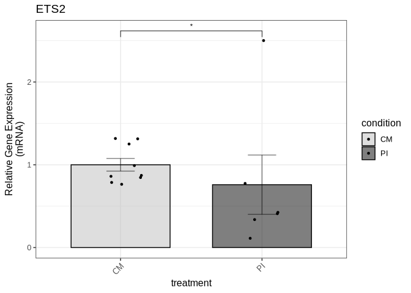

We export the figure to a PDF file in the Figure2 directory:

``` r
ggsave("output/Figure2/fig2a_ets2_qpcr.pdf", fig2a, 
       width = 3, height = 6, dpi = 300, useDingbats=FALSE)
```

#### Figure 2b (STAT3 mRNA expression levels)

We run the function for the STAT3 data:

``` r
fig2_stat3_qpcr_data <- read_xlsx("input/Figure2_data.xlsx", sheet = "STAT3_mRNA")
```

``` r
fig2_stat3_qpcr_result <- compare_qpcr_groups(
  fig2_stat3_qpcr_data,
  group_col = "treatment",
  gene_col = "stat3",
  actin_col = "actin",
  control_group = "CM",
  wilcox_pairs = list(c("CM", "PI"))
)
```

``` r
fig2_stat3_qpcr_result$all_wilcox_table
```

<div id="nwtbhwaswt" style="padding-left:0px;padding-right:0px;padding-top:10px;padding-bottom:10px;overflow-x:auto;overflow-y:auto;width:auto;height:auto;">
<style>#nwtbhwaswt table {
  font-family: system-ui, 'Segoe UI', Roboto, Helvetica, Arial, sans-serif, 'Apple Color Emoji', 'Segoe UI Emoji', 'Segoe UI Symbol', 'Noto Color Emoji';
  -webkit-font-smoothing: antialiased;
  -moz-osx-font-smoothing: grayscale;
}

#nwtbhwaswt thead, #nwtbhwaswt tbody, #nwtbhwaswt tfoot, #nwtbhwaswt tr, #nwtbhwaswt td, #nwtbhwaswt th {
  border-style: none;
}

#nwtbhwaswt p {
  margin: 0;
  padding: 0;
}

#nwtbhwaswt .gt_table {
  display: table;
  border-collapse: collapse;
  line-height: normal;
  margin-left: auto;
  margin-right: auto;
  color: #333333;
  font-size: 16px;
  font-weight: normal;
  font-style: normal;
  background-color: #FFFFFF;
  width: auto;
  border-top-style: solid;
  border-top-width: 2px;
  border-top-color: #A8A8A8;
  border-right-style: none;
  border-right-width: 2px;
  border-right-color: #D3D3D3;
  border-bottom-style: solid;
  border-bottom-width: 2px;
  border-bottom-color: #A8A8A8;
  border-left-style: none;
  border-left-width: 2px;
  border-left-color: #D3D3D3;
}

#nwtbhwaswt .gt_caption {
  padding-top: 4px;
  padding-bottom: 4px;
}

#nwtbhwaswt .gt_title {
  color: #333333;
  font-size: 125%;
  font-weight: initial;
  padding-top: 4px;
  padding-bottom: 4px;
  padding-left: 5px;
  padding-right: 5px;
  border-bottom-color: #FFFFFF;
  border-bottom-width: 0;
}

#nwtbhwaswt .gt_subtitle {
  color: #333333;
  font-size: 85%;
  font-weight: initial;
  padding-top: 3px;
  padding-bottom: 5px;
  padding-left: 5px;
  padding-right: 5px;
  border-top-color: #FFFFFF;
  border-top-width: 0;
}

#nwtbhwaswt .gt_heading {
  background-color: #FFFFFF;
  text-align: center;
  border-bottom-color: #FFFFFF;
  border-left-style: none;
  border-left-width: 1px;
  border-left-color: #D3D3D3;
  border-right-style: none;
  border-right-width: 1px;
  border-right-color: #D3D3D3;
}

#nwtbhwaswt .gt_bottom_border {
  border-bottom-style: solid;
  border-bottom-width: 2px;
  border-bottom-color: #D3D3D3;
}

#nwtbhwaswt .gt_col_headings {
  border-top-style: solid;
  border-top-width: 2px;
  border-top-color: #D3D3D3;
  border-bottom-style: solid;
  border-bottom-width: 2px;
  border-bottom-color: #D3D3D3;
  border-left-style: none;
  border-left-width: 1px;
  border-left-color: #D3D3D3;
  border-right-style: none;
  border-right-width: 1px;
  border-right-color: #D3D3D3;
}

#nwtbhwaswt .gt_col_heading {
  color: #333333;
  background-color: #FFFFFF;
  font-size: 100%;
  font-weight: normal;
  text-transform: inherit;
  border-left-style: none;
  border-left-width: 1px;
  border-left-color: #D3D3D3;
  border-right-style: none;
  border-right-width: 1px;
  border-right-color: #D3D3D3;
  vertical-align: bottom;
  padding-top: 5px;
  padding-bottom: 6px;
  padding-left: 5px;
  padding-right: 5px;
  overflow-x: hidden;
}

#nwtbhwaswt .gt_column_spanner_outer {
  color: #333333;
  background-color: #FFFFFF;
  font-size: 100%;
  font-weight: normal;
  text-transform: inherit;
  padding-top: 0;
  padding-bottom: 0;
  padding-left: 4px;
  padding-right: 4px;
}

#nwtbhwaswt .gt_column_spanner_outer:first-child {
  padding-left: 0;
}

#nwtbhwaswt .gt_column_spanner_outer:last-child {
  padding-right: 0;
}

#nwtbhwaswt .gt_column_spanner {
  border-bottom-style: solid;
  border-bottom-width: 2px;
  border-bottom-color: #D3D3D3;
  vertical-align: bottom;
  padding-top: 5px;
  padding-bottom: 5px;
  overflow-x: hidden;
  display: inline-block;
  width: 100%;
}

#nwtbhwaswt .gt_spanner_row {
  border-bottom-style: hidden;
}

#nwtbhwaswt .gt_group_heading {
  padding-top: 8px;
  padding-bottom: 8px;
  padding-left: 5px;
  padding-right: 5px;
  color: #333333;
  background-color: #FFFFFF;
  font-size: 100%;
  font-weight: initial;
  text-transform: inherit;
  border-top-style: solid;
  border-top-width: 2px;
  border-top-color: #D3D3D3;
  border-bottom-style: solid;
  border-bottom-width: 2px;
  border-bottom-color: #D3D3D3;
  border-left-style: none;
  border-left-width: 1px;
  border-left-color: #D3D3D3;
  border-right-style: none;
  border-right-width: 1px;
  border-right-color: #D3D3D3;
  vertical-align: middle;
  text-align: left;
}

#nwtbhwaswt .gt_empty_group_heading {
  padding: 0.5px;
  color: #333333;
  background-color: #FFFFFF;
  font-size: 100%;
  font-weight: initial;
  border-top-style: solid;
  border-top-width: 2px;
  border-top-color: #D3D3D3;
  border-bottom-style: solid;
  border-bottom-width: 2px;
  border-bottom-color: #D3D3D3;
  vertical-align: middle;
}

#nwtbhwaswt .gt_from_md > :first-child {
  margin-top: 0;
}

#nwtbhwaswt .gt_from_md > :last-child {
  margin-bottom: 0;
}

#nwtbhwaswt .gt_row {
  padding-top: 8px;
  padding-bottom: 8px;
  padding-left: 5px;
  padding-right: 5px;
  margin: 10px;
  border-top-style: solid;
  border-top-width: 1px;
  border-top-color: #D3D3D3;
  border-left-style: none;
  border-left-width: 1px;
  border-left-color: #D3D3D3;
  border-right-style: none;
  border-right-width: 1px;
  border-right-color: #D3D3D3;
  vertical-align: middle;
  overflow-x: hidden;
}

#nwtbhwaswt .gt_stub {
  color: #333333;
  background-color: #FFFFFF;
  font-size: 100%;
  font-weight: initial;
  text-transform: inherit;
  border-right-style: solid;
  border-right-width: 2px;
  border-right-color: #D3D3D3;
  padding-left: 5px;
  padding-right: 5px;
}

#nwtbhwaswt .gt_stub_row_group {
  color: #333333;
  background-color: #FFFFFF;
  font-size: 100%;
  font-weight: initial;
  text-transform: inherit;
  border-right-style: solid;
  border-right-width: 2px;
  border-right-color: #D3D3D3;
  padding-left: 5px;
  padding-right: 5px;
  vertical-align: top;
}

#nwtbhwaswt .gt_row_group_first td {
  border-top-width: 2px;
}

#nwtbhwaswt .gt_row_group_first th {
  border-top-width: 2px;
}

#nwtbhwaswt .gt_summary_row {
  color: #333333;
  background-color: #FFFFFF;
  text-transform: inherit;
  padding-top: 8px;
  padding-bottom: 8px;
  padding-left: 5px;
  padding-right: 5px;
}

#nwtbhwaswt .gt_first_summary_row {
  border-top-style: solid;
  border-top-color: #D3D3D3;
}

#nwtbhwaswt .gt_first_summary_row.thick {
  border-top-width: 2px;
}

#nwtbhwaswt .gt_last_summary_row {
  padding-top: 8px;
  padding-bottom: 8px;
  padding-left: 5px;
  padding-right: 5px;
  border-bottom-style: solid;
  border-bottom-width: 2px;
  border-bottom-color: #D3D3D3;
}

#nwtbhwaswt .gt_grand_summary_row {
  color: #333333;
  background-color: #FFFFFF;
  text-transform: inherit;
  padding-top: 8px;
  padding-bottom: 8px;
  padding-left: 5px;
  padding-right: 5px;
}

#nwtbhwaswt .gt_first_grand_summary_row {
  padding-top: 8px;
  padding-bottom: 8px;
  padding-left: 5px;
  padding-right: 5px;
  border-top-style: double;
  border-top-width: 6px;
  border-top-color: #D3D3D3;
}

#nwtbhwaswt .gt_last_grand_summary_row_top {
  padding-top: 8px;
  padding-bottom: 8px;
  padding-left: 5px;
  padding-right: 5px;
  border-bottom-style: double;
  border-bottom-width: 6px;
  border-bottom-color: #D3D3D3;
}

#nwtbhwaswt .gt_striped {
  background-color: rgba(128, 128, 128, 0.05);
}

#nwtbhwaswt .gt_table_body {
  border-top-style: solid;
  border-top-width: 2px;
  border-top-color: #D3D3D3;
  border-bottom-style: solid;
  border-bottom-width: 2px;
  border-bottom-color: #D3D3D3;
}

#nwtbhwaswt .gt_footnotes {
  color: #333333;
  background-color: #FFFFFF;
  border-bottom-style: none;
  border-bottom-width: 2px;
  border-bottom-color: #D3D3D3;
  border-left-style: none;
  border-left-width: 2px;
  border-left-color: #D3D3D3;
  border-right-style: none;
  border-right-width: 2px;
  border-right-color: #D3D3D3;
}

#nwtbhwaswt .gt_footnote {
  margin: 0px;
  font-size: 90%;
  padding-top: 4px;
  padding-bottom: 4px;
  padding-left: 5px;
  padding-right: 5px;
}

#nwtbhwaswt .gt_sourcenotes {
  color: #333333;
  background-color: #FFFFFF;
  border-bottom-style: none;
  border-bottom-width: 2px;
  border-bottom-color: #D3D3D3;
  border-left-style: none;
  border-left-width: 2px;
  border-left-color: #D3D3D3;
  border-right-style: none;
  border-right-width: 2px;
  border-right-color: #D3D3D3;
}

#nwtbhwaswt .gt_sourcenote {
  font-size: 90%;
  padding-top: 4px;
  padding-bottom: 4px;
  padding-left: 5px;
  padding-right: 5px;
}

#nwtbhwaswt .gt_left {
  text-align: left;
}

#nwtbhwaswt .gt_center {
  text-align: center;
}

#nwtbhwaswt .gt_right {
  text-align: right;
  font-variant-numeric: tabular-nums;
}

#nwtbhwaswt .gt_font_normal {
  font-weight: normal;
}

#nwtbhwaswt .gt_font_bold {
  font-weight: bold;
}

#nwtbhwaswt .gt_font_italic {
  font-style: italic;
}

#nwtbhwaswt .gt_super {
  font-size: 65%;
}

#nwtbhwaswt .gt_footnote_marks {
  font-size: 75%;
  vertical-align: 0.4em;
  position: initial;
}

#nwtbhwaswt .gt_asterisk {
  font-size: 100%;
  vertical-align: 0;
}

#nwtbhwaswt .gt_indent_1 {
  text-indent: 5px;
}

#nwtbhwaswt .gt_indent_2 {
  text-indent: 10px;
}

#nwtbhwaswt .gt_indent_3 {
  text-indent: 15px;
}

#nwtbhwaswt .gt_indent_4 {
  text-indent: 20px;
}

#nwtbhwaswt .gt_indent_5 {
  text-indent: 25px;
}
</style>
<table class="gt_table" data-quarto-disable-processing="false" data-quarto-bootstrap="false">
  <thead>
    <tr class="gt_col_headings">
      <th class="gt_col_heading gt_columns_bottom_border gt_left" rowspan="1" colspan="1" scope="col" id="Comparison">Comparison</th>
      <th class="gt_col_heading gt_columns_bottom_border gt_right" rowspan="1" colspan="1" scope="col" id="Statistic">Statistic</th>
      <th class="gt_col_heading gt_columns_bottom_border gt_right" rowspan="1" colspan="1" scope="col" id="P_value">P_value</th>
      <th class="gt_col_heading gt_columns_bottom_border gt_left" rowspan="1" colspan="1" scope="col" id="Significant">Significant</th>
    </tr>
  </thead>
  <tbody class="gt_table_body">
    <tr><td headers="Comparison" class="gt_row gt_left" style="background-color: rgba(204,230,255,0.8); color: #000000; font-weight: bold;">CM vs PI</td>
<td headers="Statistic" class="gt_row gt_right" style="background-color: rgba(204,230,255,0.8); color: #000000; font-weight: bold;">5</td>
<td headers="P_value" class="gt_row gt_right" style="background-color: rgba(204,230,255,0.8); color: #000000; font-weight: bold;">0.0411</td>
<td headers="Significant" class="gt_row gt_left" style="background-color: rgba(204,230,255,0.8); color: #000000; font-weight: bold;">Yes</td></tr>
  </tbody>
  
  
</table>
</div>

``` r
fig2b <- fig2_stat3_qpcr_result$p
```

``` r
fig2b
```


We export the figure to a PDF file in the Figure2 directory:

``` r
ggsave("output/Figure2/fig2b_stat3_qpcr.pdf", fig2b, 
       width = 3, height = 6, dpi = 300, useDingbats=FALSE)
```

#### Figure 2c (IL2 mRNA expression levels)

We calculate the relative expression levels for IL2 between the two
conditions, based on qPCR data:

``` r
fig2_il2_qpcr_data <- read_xlsx("input/Figure2_data.xlsx", sheet = "IL2_mRNA")
```

``` r
fig2_il2_qpcr_result <- compare_qpcr_groups_with_ratio(
  fig2_il2_qpcr_data,
  group_col = "treatment",
  gene_col = "il2",
  actin_col = "actin",
  ratio_col = "ratio",
  control_group = "CM",
  wilcox_pairs = list(c("CM", "PI"))
)
```

``` r
fig2_il2_qpcr_result$all_wilcox_table
```

<div id="vmykhunjul" style="padding-left:0px;padding-right:0px;padding-top:10px;padding-bottom:10px;overflow-x:auto;overflow-y:auto;width:auto;height:auto;">
<style>#vmykhunjul table {
  font-family: system-ui, 'Segoe UI', Roboto, Helvetica, Arial, sans-serif, 'Apple Color Emoji', 'Segoe UI Emoji', 'Segoe UI Symbol', 'Noto Color Emoji';
  -webkit-font-smoothing: antialiased;
  -moz-osx-font-smoothing: grayscale;
}

#vmykhunjul thead, #vmykhunjul tbody, #vmykhunjul tfoot, #vmykhunjul tr, #vmykhunjul td, #vmykhunjul th {
  border-style: none;
}

#vmykhunjul p {
  margin: 0;
  padding: 0;
}

#vmykhunjul .gt_table {
  display: table;
  border-collapse: collapse;
  line-height: normal;
  margin-left: auto;
  margin-right: auto;
  color: #333333;
  font-size: 16px;
  font-weight: normal;
  font-style: normal;
  background-color: #FFFFFF;
  width: auto;
  border-top-style: solid;
  border-top-width: 2px;
  border-top-color: #A8A8A8;
  border-right-style: none;
  border-right-width: 2px;
  border-right-color: #D3D3D3;
  border-bottom-style: solid;
  border-bottom-width: 2px;
  border-bottom-color: #A8A8A8;
  border-left-style: none;
  border-left-width: 2px;
  border-left-color: #D3D3D3;
}

#vmykhunjul .gt_caption {
  padding-top: 4px;
  padding-bottom: 4px;
}

#vmykhunjul .gt_title {
  color: #333333;
  font-size: 125%;
  font-weight: initial;
  padding-top: 4px;
  padding-bottom: 4px;
  padding-left: 5px;
  padding-right: 5px;
  border-bottom-color: #FFFFFF;
  border-bottom-width: 0;
}

#vmykhunjul .gt_subtitle {
  color: #333333;
  font-size: 85%;
  font-weight: initial;
  padding-top: 3px;
  padding-bottom: 5px;
  padding-left: 5px;
  padding-right: 5px;
  border-top-color: #FFFFFF;
  border-top-width: 0;
}

#vmykhunjul .gt_heading {
  background-color: #FFFFFF;
  text-align: center;
  border-bottom-color: #FFFFFF;
  border-left-style: none;
  border-left-width: 1px;
  border-left-color: #D3D3D3;
  border-right-style: none;
  border-right-width: 1px;
  border-right-color: #D3D3D3;
}

#vmykhunjul .gt_bottom_border {
  border-bottom-style: solid;
  border-bottom-width: 2px;
  border-bottom-color: #D3D3D3;
}

#vmykhunjul .gt_col_headings {
  border-top-style: solid;
  border-top-width: 2px;
  border-top-color: #D3D3D3;
  border-bottom-style: solid;
  border-bottom-width: 2px;
  border-bottom-color: #D3D3D3;
  border-left-style: none;
  border-left-width: 1px;
  border-left-color: #D3D3D3;
  border-right-style: none;
  border-right-width: 1px;
  border-right-color: #D3D3D3;
}

#vmykhunjul .gt_col_heading {
  color: #333333;
  background-color: #FFFFFF;
  font-size: 100%;
  font-weight: normal;
  text-transform: inherit;
  border-left-style: none;
  border-left-width: 1px;
  border-left-color: #D3D3D3;
  border-right-style: none;
  border-right-width: 1px;
  border-right-color: #D3D3D3;
  vertical-align: bottom;
  padding-top: 5px;
  padding-bottom: 6px;
  padding-left: 5px;
  padding-right: 5px;
  overflow-x: hidden;
}

#vmykhunjul .gt_column_spanner_outer {
  color: #333333;
  background-color: #FFFFFF;
  font-size: 100%;
  font-weight: normal;
  text-transform: inherit;
  padding-top: 0;
  padding-bottom: 0;
  padding-left: 4px;
  padding-right: 4px;
}

#vmykhunjul .gt_column_spanner_outer:first-child {
  padding-left: 0;
}

#vmykhunjul .gt_column_spanner_outer:last-child {
  padding-right: 0;
}

#vmykhunjul .gt_column_spanner {
  border-bottom-style: solid;
  border-bottom-width: 2px;
  border-bottom-color: #D3D3D3;
  vertical-align: bottom;
  padding-top: 5px;
  padding-bottom: 5px;
  overflow-x: hidden;
  display: inline-block;
  width: 100%;
}

#vmykhunjul .gt_spanner_row {
  border-bottom-style: hidden;
}

#vmykhunjul .gt_group_heading {
  padding-top: 8px;
  padding-bottom: 8px;
  padding-left: 5px;
  padding-right: 5px;
  color: #333333;
  background-color: #FFFFFF;
  font-size: 100%;
  font-weight: initial;
  text-transform: inherit;
  border-top-style: solid;
  border-top-width: 2px;
  border-top-color: #D3D3D3;
  border-bottom-style: solid;
  border-bottom-width: 2px;
  border-bottom-color: #D3D3D3;
  border-left-style: none;
  border-left-width: 1px;
  border-left-color: #D3D3D3;
  border-right-style: none;
  border-right-width: 1px;
  border-right-color: #D3D3D3;
  vertical-align: middle;
  text-align: left;
}

#vmykhunjul .gt_empty_group_heading {
  padding: 0.5px;
  color: #333333;
  background-color: #FFFFFF;
  font-size: 100%;
  font-weight: initial;
  border-top-style: solid;
  border-top-width: 2px;
  border-top-color: #D3D3D3;
  border-bottom-style: solid;
  border-bottom-width: 2px;
  border-bottom-color: #D3D3D3;
  vertical-align: middle;
}

#vmykhunjul .gt_from_md > :first-child {
  margin-top: 0;
}

#vmykhunjul .gt_from_md > :last-child {
  margin-bottom: 0;
}

#vmykhunjul .gt_row {
  padding-top: 8px;
  padding-bottom: 8px;
  padding-left: 5px;
  padding-right: 5px;
  margin: 10px;
  border-top-style: solid;
  border-top-width: 1px;
  border-top-color: #D3D3D3;
  border-left-style: none;
  border-left-width: 1px;
  border-left-color: #D3D3D3;
  border-right-style: none;
  border-right-width: 1px;
  border-right-color: #D3D3D3;
  vertical-align: middle;
  overflow-x: hidden;
}

#vmykhunjul .gt_stub {
  color: #333333;
  background-color: #FFFFFF;
  font-size: 100%;
  font-weight: initial;
  text-transform: inherit;
  border-right-style: solid;
  border-right-width: 2px;
  border-right-color: #D3D3D3;
  padding-left: 5px;
  padding-right: 5px;
}

#vmykhunjul .gt_stub_row_group {
  color: #333333;
  background-color: #FFFFFF;
  font-size: 100%;
  font-weight: initial;
  text-transform: inherit;
  border-right-style: solid;
  border-right-width: 2px;
  border-right-color: #D3D3D3;
  padding-left: 5px;
  padding-right: 5px;
  vertical-align: top;
}

#vmykhunjul .gt_row_group_first td {
  border-top-width: 2px;
}

#vmykhunjul .gt_row_group_first th {
  border-top-width: 2px;
}

#vmykhunjul .gt_summary_row {
  color: #333333;
  background-color: #FFFFFF;
  text-transform: inherit;
  padding-top: 8px;
  padding-bottom: 8px;
  padding-left: 5px;
  padding-right: 5px;
}

#vmykhunjul .gt_first_summary_row {
  border-top-style: solid;
  border-top-color: #D3D3D3;
}

#vmykhunjul .gt_first_summary_row.thick {
  border-top-width: 2px;
}

#vmykhunjul .gt_last_summary_row {
  padding-top: 8px;
  padding-bottom: 8px;
  padding-left: 5px;
  padding-right: 5px;
  border-bottom-style: solid;
  border-bottom-width: 2px;
  border-bottom-color: #D3D3D3;
}

#vmykhunjul .gt_grand_summary_row {
  color: #333333;
  background-color: #FFFFFF;
  text-transform: inherit;
  padding-top: 8px;
  padding-bottom: 8px;
  padding-left: 5px;
  padding-right: 5px;
}

#vmykhunjul .gt_first_grand_summary_row {
  padding-top: 8px;
  padding-bottom: 8px;
  padding-left: 5px;
  padding-right: 5px;
  border-top-style: double;
  border-top-width: 6px;
  border-top-color: #D3D3D3;
}

#vmykhunjul .gt_last_grand_summary_row_top {
  padding-top: 8px;
  padding-bottom: 8px;
  padding-left: 5px;
  padding-right: 5px;
  border-bottom-style: double;
  border-bottom-width: 6px;
  border-bottom-color: #D3D3D3;
}

#vmykhunjul .gt_striped {
  background-color: rgba(128, 128, 128, 0.05);
}

#vmykhunjul .gt_table_body {
  border-top-style: solid;
  border-top-width: 2px;
  border-top-color: #D3D3D3;
  border-bottom-style: solid;
  border-bottom-width: 2px;
  border-bottom-color: #D3D3D3;
}

#vmykhunjul .gt_footnotes {
  color: #333333;
  background-color: #FFFFFF;
  border-bottom-style: none;
  border-bottom-width: 2px;
  border-bottom-color: #D3D3D3;
  border-left-style: none;
  border-left-width: 2px;
  border-left-color: #D3D3D3;
  border-right-style: none;
  border-right-width: 2px;
  border-right-color: #D3D3D3;
}

#vmykhunjul .gt_footnote {
  margin: 0px;
  font-size: 90%;
  padding-top: 4px;
  padding-bottom: 4px;
  padding-left: 5px;
  padding-right: 5px;
}

#vmykhunjul .gt_sourcenotes {
  color: #333333;
  background-color: #FFFFFF;
  border-bottom-style: none;
  border-bottom-width: 2px;
  border-bottom-color: #D3D3D3;
  border-left-style: none;
  border-left-width: 2px;
  border-left-color: #D3D3D3;
  border-right-style: none;
  border-right-width: 2px;
  border-right-color: #D3D3D3;
}

#vmykhunjul .gt_sourcenote {
  font-size: 90%;
  padding-top: 4px;
  padding-bottom: 4px;
  padding-left: 5px;
  padding-right: 5px;
}

#vmykhunjul .gt_left {
  text-align: left;
}

#vmykhunjul .gt_center {
  text-align: center;
}

#vmykhunjul .gt_right {
  text-align: right;
  font-variant-numeric: tabular-nums;
}

#vmykhunjul .gt_font_normal {
  font-weight: normal;
}

#vmykhunjul .gt_font_bold {
  font-weight: bold;
}

#vmykhunjul .gt_font_italic {
  font-style: italic;
}

#vmykhunjul .gt_super {
  font-size: 65%;
}

#vmykhunjul .gt_footnote_marks {
  font-size: 75%;
  vertical-align: 0.4em;
  position: initial;
}

#vmykhunjul .gt_asterisk {
  font-size: 100%;
  vertical-align: 0;
}

#vmykhunjul .gt_indent_1 {
  text-indent: 5px;
}

#vmykhunjul .gt_indent_2 {
  text-indent: 10px;
}

#vmykhunjul .gt_indent_3 {
  text-indent: 15px;
}

#vmykhunjul .gt_indent_4 {
  text-indent: 20px;
}

#vmykhunjul .gt_indent_5 {
  text-indent: 25px;
}
</style>
<table class="gt_table" data-quarto-disable-processing="false" data-quarto-bootstrap="false">
  <thead>
    <tr class="gt_col_headings">
      <th class="gt_col_heading gt_columns_bottom_border gt_left" rowspan="1" colspan="1" scope="col" id="Comparison">Comparison</th>
      <th class="gt_col_heading gt_columns_bottom_border gt_right" rowspan="1" colspan="1" scope="col" id="Statistic">Statistic</th>
      <th class="gt_col_heading gt_columns_bottom_border gt_right" rowspan="1" colspan="1" scope="col" id="P_value">P_value</th>
      <th class="gt_col_heading gt_columns_bottom_border gt_left" rowspan="1" colspan="1" scope="col" id="Significant">Significant</th>
    </tr>
  </thead>
  <tbody class="gt_table_body">
    <tr><td headers="Comparison" class="gt_row gt_left" style="background-color: rgba(204,230,255,0.8); color: #000000; font-weight: bold;">CM vs PI</td>
<td headers="Statistic" class="gt_row gt_right" style="background-color: rgba(204,230,255,0.8); color: #000000; font-weight: bold;">0</td>
<td headers="P_value" class="gt_row gt_right" style="background-color: rgba(204,230,255,0.8); color: #000000; font-weight: bold;">0.0079</td>
<td headers="Significant" class="gt_row gt_left" style="background-color: rgba(204,230,255,0.8); color: #000000; font-weight: bold;">Yes</td></tr>
  </tbody>
  
  
</table>
</div>

``` r
fig2c <- fig2_il2_qpcr_result$p
```

``` r
fig2c
```


We export the figure to a PDF file in the Figure2 directory:

``` r
ggsave("output/Figure2/fig2c_il2_qpcr.pdf", fig2c, 
       width = 3, height = 6, dpi = 300, useDingbats=FALSE)
```

#### Figure 2d (ETS2 protein expression levels)

We calculate the relative expression levels for ETS2 and STAT3 proteins
between the two conditions, based on Western blot data:

``` r
fig2_ets2_protein_data <- read_xlsx("input/Figure2_data.xlsx", sheet = "ETS2_protein_new")
```

``` r
fig2_ets2_protein_result <- compare_protein_groups(
  fig2_ets2_protein_data,
  group_col = "treatment",
  gene_col = "ets2",
  actin_col = "actin",
  control_group = "CM",
  wilcox_pairs = list(c("CM", "PI"))
)
```

``` r
fig2_ets2_protein_result$all_wilcox_table
```

<div id="gaotmzrlmi" style="padding-left:0px;padding-right:0px;padding-top:10px;padding-bottom:10px;overflow-x:auto;overflow-y:auto;width:auto;height:auto;">
<style>#gaotmzrlmi table {
  font-family: system-ui, 'Segoe UI', Roboto, Helvetica, Arial, sans-serif, 'Apple Color Emoji', 'Segoe UI Emoji', 'Segoe UI Symbol', 'Noto Color Emoji';
  -webkit-font-smoothing: antialiased;
  -moz-osx-font-smoothing: grayscale;
}

#gaotmzrlmi thead, #gaotmzrlmi tbody, #gaotmzrlmi tfoot, #gaotmzrlmi tr, #gaotmzrlmi td, #gaotmzrlmi th {
  border-style: none;
}

#gaotmzrlmi p {
  margin: 0;
  padding: 0;
}

#gaotmzrlmi .gt_table {
  display: table;
  border-collapse: collapse;
  line-height: normal;
  margin-left: auto;
  margin-right: auto;
  color: #333333;
  font-size: 16px;
  font-weight: normal;
  font-style: normal;
  background-color: #FFFFFF;
  width: auto;
  border-top-style: solid;
  border-top-width: 2px;
  border-top-color: #A8A8A8;
  border-right-style: none;
  border-right-width: 2px;
  border-right-color: #D3D3D3;
  border-bottom-style: solid;
  border-bottom-width: 2px;
  border-bottom-color: #A8A8A8;
  border-left-style: none;
  border-left-width: 2px;
  border-left-color: #D3D3D3;
}

#gaotmzrlmi .gt_caption {
  padding-top: 4px;
  padding-bottom: 4px;
}

#gaotmzrlmi .gt_title {
  color: #333333;
  font-size: 125%;
  font-weight: initial;
  padding-top: 4px;
  padding-bottom: 4px;
  padding-left: 5px;
  padding-right: 5px;
  border-bottom-color: #FFFFFF;
  border-bottom-width: 0;
}

#gaotmzrlmi .gt_subtitle {
  color: #333333;
  font-size: 85%;
  font-weight: initial;
  padding-top: 3px;
  padding-bottom: 5px;
  padding-left: 5px;
  padding-right: 5px;
  border-top-color: #FFFFFF;
  border-top-width: 0;
}

#gaotmzrlmi .gt_heading {
  background-color: #FFFFFF;
  text-align: center;
  border-bottom-color: #FFFFFF;
  border-left-style: none;
  border-left-width: 1px;
  border-left-color: #D3D3D3;
  border-right-style: none;
  border-right-width: 1px;
  border-right-color: #D3D3D3;
}

#gaotmzrlmi .gt_bottom_border {
  border-bottom-style: solid;
  border-bottom-width: 2px;
  border-bottom-color: #D3D3D3;
}

#gaotmzrlmi .gt_col_headings {
  border-top-style: solid;
  border-top-width: 2px;
  border-top-color: #D3D3D3;
  border-bottom-style: solid;
  border-bottom-width: 2px;
  border-bottom-color: #D3D3D3;
  border-left-style: none;
  border-left-width: 1px;
  border-left-color: #D3D3D3;
  border-right-style: none;
  border-right-width: 1px;
  border-right-color: #D3D3D3;
}

#gaotmzrlmi .gt_col_heading {
  color: #333333;
  background-color: #FFFFFF;
  font-size: 100%;
  font-weight: normal;
  text-transform: inherit;
  border-left-style: none;
  border-left-width: 1px;
  border-left-color: #D3D3D3;
  border-right-style: none;
  border-right-width: 1px;
  border-right-color: #D3D3D3;
  vertical-align: bottom;
  padding-top: 5px;
  padding-bottom: 6px;
  padding-left: 5px;
  padding-right: 5px;
  overflow-x: hidden;
}

#gaotmzrlmi .gt_column_spanner_outer {
  color: #333333;
  background-color: #FFFFFF;
  font-size: 100%;
  font-weight: normal;
  text-transform: inherit;
  padding-top: 0;
  padding-bottom: 0;
  padding-left: 4px;
  padding-right: 4px;
}

#gaotmzrlmi .gt_column_spanner_outer:first-child {
  padding-left: 0;
}

#gaotmzrlmi .gt_column_spanner_outer:last-child {
  padding-right: 0;
}

#gaotmzrlmi .gt_column_spanner {
  border-bottom-style: solid;
  border-bottom-width: 2px;
  border-bottom-color: #D3D3D3;
  vertical-align: bottom;
  padding-top: 5px;
  padding-bottom: 5px;
  overflow-x: hidden;
  display: inline-block;
  width: 100%;
}

#gaotmzrlmi .gt_spanner_row {
  border-bottom-style: hidden;
}

#gaotmzrlmi .gt_group_heading {
  padding-top: 8px;
  padding-bottom: 8px;
  padding-left: 5px;
  padding-right: 5px;
  color: #333333;
  background-color: #FFFFFF;
  font-size: 100%;
  font-weight: initial;
  text-transform: inherit;
  border-top-style: solid;
  border-top-width: 2px;
  border-top-color: #D3D3D3;
  border-bottom-style: solid;
  border-bottom-width: 2px;
  border-bottom-color: #D3D3D3;
  border-left-style: none;
  border-left-width: 1px;
  border-left-color: #D3D3D3;
  border-right-style: none;
  border-right-width: 1px;
  border-right-color: #D3D3D3;
  vertical-align: middle;
  text-align: left;
}

#gaotmzrlmi .gt_empty_group_heading {
  padding: 0.5px;
  color: #333333;
  background-color: #FFFFFF;
  font-size: 100%;
  font-weight: initial;
  border-top-style: solid;
  border-top-width: 2px;
  border-top-color: #D3D3D3;
  border-bottom-style: solid;
  border-bottom-width: 2px;
  border-bottom-color: #D3D3D3;
  vertical-align: middle;
}

#gaotmzrlmi .gt_from_md > :first-child {
  margin-top: 0;
}

#gaotmzrlmi .gt_from_md > :last-child {
  margin-bottom: 0;
}

#gaotmzrlmi .gt_row {
  padding-top: 8px;
  padding-bottom: 8px;
  padding-left: 5px;
  padding-right: 5px;
  margin: 10px;
  border-top-style: solid;
  border-top-width: 1px;
  border-top-color: #D3D3D3;
  border-left-style: none;
  border-left-width: 1px;
  border-left-color: #D3D3D3;
  border-right-style: none;
  border-right-width: 1px;
  border-right-color: #D3D3D3;
  vertical-align: middle;
  overflow-x: hidden;
}

#gaotmzrlmi .gt_stub {
  color: #333333;
  background-color: #FFFFFF;
  font-size: 100%;
  font-weight: initial;
  text-transform: inherit;
  border-right-style: solid;
  border-right-width: 2px;
  border-right-color: #D3D3D3;
  padding-left: 5px;
  padding-right: 5px;
}

#gaotmzrlmi .gt_stub_row_group {
  color: #333333;
  background-color: #FFFFFF;
  font-size: 100%;
  font-weight: initial;
  text-transform: inherit;
  border-right-style: solid;
  border-right-width: 2px;
  border-right-color: #D3D3D3;
  padding-left: 5px;
  padding-right: 5px;
  vertical-align: top;
}

#gaotmzrlmi .gt_row_group_first td {
  border-top-width: 2px;
}

#gaotmzrlmi .gt_row_group_first th {
  border-top-width: 2px;
}

#gaotmzrlmi .gt_summary_row {
  color: #333333;
  background-color: #FFFFFF;
  text-transform: inherit;
  padding-top: 8px;
  padding-bottom: 8px;
  padding-left: 5px;
  padding-right: 5px;
}

#gaotmzrlmi .gt_first_summary_row {
  border-top-style: solid;
  border-top-color: #D3D3D3;
}

#gaotmzrlmi .gt_first_summary_row.thick {
  border-top-width: 2px;
}

#gaotmzrlmi .gt_last_summary_row {
  padding-top: 8px;
  padding-bottom: 8px;
  padding-left: 5px;
  padding-right: 5px;
  border-bottom-style: solid;
  border-bottom-width: 2px;
  border-bottom-color: #D3D3D3;
}

#gaotmzrlmi .gt_grand_summary_row {
  color: #333333;
  background-color: #FFFFFF;
  text-transform: inherit;
  padding-top: 8px;
  padding-bottom: 8px;
  padding-left: 5px;
  padding-right: 5px;
}

#gaotmzrlmi .gt_first_grand_summary_row {
  padding-top: 8px;
  padding-bottom: 8px;
  padding-left: 5px;
  padding-right: 5px;
  border-top-style: double;
  border-top-width: 6px;
  border-top-color: #D3D3D3;
}

#gaotmzrlmi .gt_last_grand_summary_row_top {
  padding-top: 8px;
  padding-bottom: 8px;
  padding-left: 5px;
  padding-right: 5px;
  border-bottom-style: double;
  border-bottom-width: 6px;
  border-bottom-color: #D3D3D3;
}

#gaotmzrlmi .gt_striped {
  background-color: rgba(128, 128, 128, 0.05);
}

#gaotmzrlmi .gt_table_body {
  border-top-style: solid;
  border-top-width: 2px;
  border-top-color: #D3D3D3;
  border-bottom-style: solid;
  border-bottom-width: 2px;
  border-bottom-color: #D3D3D3;
}

#gaotmzrlmi .gt_footnotes {
  color: #333333;
  background-color: #FFFFFF;
  border-bottom-style: none;
  border-bottom-width: 2px;
  border-bottom-color: #D3D3D3;
  border-left-style: none;
  border-left-width: 2px;
  border-left-color: #D3D3D3;
  border-right-style: none;
  border-right-width: 2px;
  border-right-color: #D3D3D3;
}

#gaotmzrlmi .gt_footnote {
  margin: 0px;
  font-size: 90%;
  padding-top: 4px;
  padding-bottom: 4px;
  padding-left: 5px;
  padding-right: 5px;
}

#gaotmzrlmi .gt_sourcenotes {
  color: #333333;
  background-color: #FFFFFF;
  border-bottom-style: none;
  border-bottom-width: 2px;
  border-bottom-color: #D3D3D3;
  border-left-style: none;
  border-left-width: 2px;
  border-left-color: #D3D3D3;
  border-right-style: none;
  border-right-width: 2px;
  border-right-color: #D3D3D3;
}

#gaotmzrlmi .gt_sourcenote {
  font-size: 90%;
  padding-top: 4px;
  padding-bottom: 4px;
  padding-left: 5px;
  padding-right: 5px;
}

#gaotmzrlmi .gt_left {
  text-align: left;
}

#gaotmzrlmi .gt_center {
  text-align: center;
}

#gaotmzrlmi .gt_right {
  text-align: right;
  font-variant-numeric: tabular-nums;
}

#gaotmzrlmi .gt_font_normal {
  font-weight: normal;
}

#gaotmzrlmi .gt_font_bold {
  font-weight: bold;
}

#gaotmzrlmi .gt_font_italic {
  font-style: italic;
}

#gaotmzrlmi .gt_super {
  font-size: 65%;
}

#gaotmzrlmi .gt_footnote_marks {
  font-size: 75%;
  vertical-align: 0.4em;
  position: initial;
}

#gaotmzrlmi .gt_asterisk {
  font-size: 100%;
  vertical-align: 0;
}

#gaotmzrlmi .gt_indent_1 {
  text-indent: 5px;
}

#gaotmzrlmi .gt_indent_2 {
  text-indent: 10px;
}

#gaotmzrlmi .gt_indent_3 {
  text-indent: 15px;
}

#gaotmzrlmi .gt_indent_4 {
  text-indent: 20px;
}

#gaotmzrlmi .gt_indent_5 {
  text-indent: 25px;
}
</style>
<table class="gt_table" data-quarto-disable-processing="false" data-quarto-bootstrap="false">
  <thead>
    <tr class="gt_col_headings">
      <th class="gt_col_heading gt_columns_bottom_border gt_left" rowspan="1" colspan="1" scope="col" id="Comparison">Comparison</th>
      <th class="gt_col_heading gt_columns_bottom_border gt_right" rowspan="1" colspan="1" scope="col" id="Statistic">Statistic</th>
      <th class="gt_col_heading gt_columns_bottom_border gt_right" rowspan="1" colspan="1" scope="col" id="P_value">P_value</th>
      <th class="gt_col_heading gt_columns_bottom_border gt_left" rowspan="1" colspan="1" scope="col" id="Significant">Significant</th>
    </tr>
  </thead>
  <tbody class="gt_table_body">
    <tr><td headers="Comparison" class="gt_row gt_left" style="background-color: rgba(204,230,255,0.8); color: #000000; font-weight: bold;">CM vs PI</td>
<td headers="Statistic" class="gt_row gt_right" style="background-color: rgba(204,230,255,0.8); color: #000000; font-weight: bold;">16</td>
<td headers="P_value" class="gt_row gt_right" style="background-color: rgba(204,230,255,0.8); color: #000000; font-weight: bold;">0.0286</td>
<td headers="Significant" class="gt_row gt_left" style="background-color: rgba(204,230,255,0.8); color: #000000; font-weight: bold;">Yes</td></tr>
  </tbody>
  
  
</table>
</div>

``` r
fig2d <- fig2_ets2_protein_result$p
```

``` r
fig2d 
```


We export the figure to a PDF file in the Figure2 directory:

``` r
ggsave("output/Figure2/fig2d_ets2_protein.pdf", fig2d, 
       width = 3, height = 6, dpi = 300, useDingbats=FALSE)
```

#### Figure 2e (STAT3 protein expression levels)

We do the same for STAT3:

``` r
fig2_stat3_protein_data <- read_xlsx("input/Figure2_data.xlsx", sheet = "STAT3_protein")
```

``` r
fig2_stat3_protein_result <- compare_protein_groups(
  fig2_stat3_protein_data,
  group_col = "treatment",
  gene_col = "stat3",
  actin_col = "actin",
  control_group = "CM",
  wilcox_pairs = list(c("CM", "PI"))
)
```

``` r
fig2_stat3_protein_result$all_wilcox_table
```

<div id="cvdhooqdmw" style="padding-left:0px;padding-right:0px;padding-top:10px;padding-bottom:10px;overflow-x:auto;overflow-y:auto;width:auto;height:auto;">
<style>#cvdhooqdmw table {
  font-family: system-ui, 'Segoe UI', Roboto, Helvetica, Arial, sans-serif, 'Apple Color Emoji', 'Segoe UI Emoji', 'Segoe UI Symbol', 'Noto Color Emoji';
  -webkit-font-smoothing: antialiased;
  -moz-osx-font-smoothing: grayscale;
}

#cvdhooqdmw thead, #cvdhooqdmw tbody, #cvdhooqdmw tfoot, #cvdhooqdmw tr, #cvdhooqdmw td, #cvdhooqdmw th {
  border-style: none;
}

#cvdhooqdmw p {
  margin: 0;
  padding: 0;
}

#cvdhooqdmw .gt_table {
  display: table;
  border-collapse: collapse;
  line-height: normal;
  margin-left: auto;
  margin-right: auto;
  color: #333333;
  font-size: 16px;
  font-weight: normal;
  font-style: normal;
  background-color: #FFFFFF;
  width: auto;
  border-top-style: solid;
  border-top-width: 2px;
  border-top-color: #A8A8A8;
  border-right-style: none;
  border-right-width: 2px;
  border-right-color: #D3D3D3;
  border-bottom-style: solid;
  border-bottom-width: 2px;
  border-bottom-color: #A8A8A8;
  border-left-style: none;
  border-left-width: 2px;
  border-left-color: #D3D3D3;
}

#cvdhooqdmw .gt_caption {
  padding-top: 4px;
  padding-bottom: 4px;
}

#cvdhooqdmw .gt_title {
  color: #333333;
  font-size: 125%;
  font-weight: initial;
  padding-top: 4px;
  padding-bottom: 4px;
  padding-left: 5px;
  padding-right: 5px;
  border-bottom-color: #FFFFFF;
  border-bottom-width: 0;
}

#cvdhooqdmw .gt_subtitle {
  color: #333333;
  font-size: 85%;
  font-weight: initial;
  padding-top: 3px;
  padding-bottom: 5px;
  padding-left: 5px;
  padding-right: 5px;
  border-top-color: #FFFFFF;
  border-top-width: 0;
}

#cvdhooqdmw .gt_heading {
  background-color: #FFFFFF;
  text-align: center;
  border-bottom-color: #FFFFFF;
  border-left-style: none;
  border-left-width: 1px;
  border-left-color: #D3D3D3;
  border-right-style: none;
  border-right-width: 1px;
  border-right-color: #D3D3D3;
}

#cvdhooqdmw .gt_bottom_border {
  border-bottom-style: solid;
  border-bottom-width: 2px;
  border-bottom-color: #D3D3D3;
}

#cvdhooqdmw .gt_col_headings {
  border-top-style: solid;
  border-top-width: 2px;
  border-top-color: #D3D3D3;
  border-bottom-style: solid;
  border-bottom-width: 2px;
  border-bottom-color: #D3D3D3;
  border-left-style: none;
  border-left-width: 1px;
  border-left-color: #D3D3D3;
  border-right-style: none;
  border-right-width: 1px;
  border-right-color: #D3D3D3;
}

#cvdhooqdmw .gt_col_heading {
  color: #333333;
  background-color: #FFFFFF;
  font-size: 100%;
  font-weight: normal;
  text-transform: inherit;
  border-left-style: none;
  border-left-width: 1px;
  border-left-color: #D3D3D3;
  border-right-style: none;
  border-right-width: 1px;
  border-right-color: #D3D3D3;
  vertical-align: bottom;
  padding-top: 5px;
  padding-bottom: 6px;
  padding-left: 5px;
  padding-right: 5px;
  overflow-x: hidden;
}

#cvdhooqdmw .gt_column_spanner_outer {
  color: #333333;
  background-color: #FFFFFF;
  font-size: 100%;
  font-weight: normal;
  text-transform: inherit;
  padding-top: 0;
  padding-bottom: 0;
  padding-left: 4px;
  padding-right: 4px;
}

#cvdhooqdmw .gt_column_spanner_outer:first-child {
  padding-left: 0;
}

#cvdhooqdmw .gt_column_spanner_outer:last-child {
  padding-right: 0;
}

#cvdhooqdmw .gt_column_spanner {
  border-bottom-style: solid;
  border-bottom-width: 2px;
  border-bottom-color: #D3D3D3;
  vertical-align: bottom;
  padding-top: 5px;
  padding-bottom: 5px;
  overflow-x: hidden;
  display: inline-block;
  width: 100%;
}

#cvdhooqdmw .gt_spanner_row {
  border-bottom-style: hidden;
}

#cvdhooqdmw .gt_group_heading {
  padding-top: 8px;
  padding-bottom: 8px;
  padding-left: 5px;
  padding-right: 5px;
  color: #333333;
  background-color: #FFFFFF;
  font-size: 100%;
  font-weight: initial;
  text-transform: inherit;
  border-top-style: solid;
  border-top-width: 2px;
  border-top-color: #D3D3D3;
  border-bottom-style: solid;
  border-bottom-width: 2px;
  border-bottom-color: #D3D3D3;
  border-left-style: none;
  border-left-width: 1px;
  border-left-color: #D3D3D3;
  border-right-style: none;
  border-right-width: 1px;
  border-right-color: #D3D3D3;
  vertical-align: middle;
  text-align: left;
}

#cvdhooqdmw .gt_empty_group_heading {
  padding: 0.5px;
  color: #333333;
  background-color: #FFFFFF;
  font-size: 100%;
  font-weight: initial;
  border-top-style: solid;
  border-top-width: 2px;
  border-top-color: #D3D3D3;
  border-bottom-style: solid;
  border-bottom-width: 2px;
  border-bottom-color: #D3D3D3;
  vertical-align: middle;
}

#cvdhooqdmw .gt_from_md > :first-child {
  margin-top: 0;
}

#cvdhooqdmw .gt_from_md > :last-child {
  margin-bottom: 0;
}

#cvdhooqdmw .gt_row {
  padding-top: 8px;
  padding-bottom: 8px;
  padding-left: 5px;
  padding-right: 5px;
  margin: 10px;
  border-top-style: solid;
  border-top-width: 1px;
  border-top-color: #D3D3D3;
  border-left-style: none;
  border-left-width: 1px;
  border-left-color: #D3D3D3;
  border-right-style: none;
  border-right-width: 1px;
  border-right-color: #D3D3D3;
  vertical-align: middle;
  overflow-x: hidden;
}

#cvdhooqdmw .gt_stub {
  color: #333333;
  background-color: #FFFFFF;
  font-size: 100%;
  font-weight: initial;
  text-transform: inherit;
  border-right-style: solid;
  border-right-width: 2px;
  border-right-color: #D3D3D3;
  padding-left: 5px;
  padding-right: 5px;
}

#cvdhooqdmw .gt_stub_row_group {
  color: #333333;
  background-color: #FFFFFF;
  font-size: 100%;
  font-weight: initial;
  text-transform: inherit;
  border-right-style: solid;
  border-right-width: 2px;
  border-right-color: #D3D3D3;
  padding-left: 5px;
  padding-right: 5px;
  vertical-align: top;
}

#cvdhooqdmw .gt_row_group_first td {
  border-top-width: 2px;
}

#cvdhooqdmw .gt_row_group_first th {
  border-top-width: 2px;
}

#cvdhooqdmw .gt_summary_row {
  color: #333333;
  background-color: #FFFFFF;
  text-transform: inherit;
  padding-top: 8px;
  padding-bottom: 8px;
  padding-left: 5px;
  padding-right: 5px;
}

#cvdhooqdmw .gt_first_summary_row {
  border-top-style: solid;
  border-top-color: #D3D3D3;
}

#cvdhooqdmw .gt_first_summary_row.thick {
  border-top-width: 2px;
}

#cvdhooqdmw .gt_last_summary_row {
  padding-top: 8px;
  padding-bottom: 8px;
  padding-left: 5px;
  padding-right: 5px;
  border-bottom-style: solid;
  border-bottom-width: 2px;
  border-bottom-color: #D3D3D3;
}

#cvdhooqdmw .gt_grand_summary_row {
  color: #333333;
  background-color: #FFFFFF;
  text-transform: inherit;
  padding-top: 8px;
  padding-bottom: 8px;
  padding-left: 5px;
  padding-right: 5px;
}

#cvdhooqdmw .gt_first_grand_summary_row {
  padding-top: 8px;
  padding-bottom: 8px;
  padding-left: 5px;
  padding-right: 5px;
  border-top-style: double;
  border-top-width: 6px;
  border-top-color: #D3D3D3;
}

#cvdhooqdmw .gt_last_grand_summary_row_top {
  padding-top: 8px;
  padding-bottom: 8px;
  padding-left: 5px;
  padding-right: 5px;
  border-bottom-style: double;
  border-bottom-width: 6px;
  border-bottom-color: #D3D3D3;
}

#cvdhooqdmw .gt_striped {
  background-color: rgba(128, 128, 128, 0.05);
}

#cvdhooqdmw .gt_table_body {
  border-top-style: solid;
  border-top-width: 2px;
  border-top-color: #D3D3D3;
  border-bottom-style: solid;
  border-bottom-width: 2px;
  border-bottom-color: #D3D3D3;
}

#cvdhooqdmw .gt_footnotes {
  color: #333333;
  background-color: #FFFFFF;
  border-bottom-style: none;
  border-bottom-width: 2px;
  border-bottom-color: #D3D3D3;
  border-left-style: none;
  border-left-width: 2px;
  border-left-color: #D3D3D3;
  border-right-style: none;
  border-right-width: 2px;
  border-right-color: #D3D3D3;
}

#cvdhooqdmw .gt_footnote {
  margin: 0px;
  font-size: 90%;
  padding-top: 4px;
  padding-bottom: 4px;
  padding-left: 5px;
  padding-right: 5px;
}

#cvdhooqdmw .gt_sourcenotes {
  color: #333333;
  background-color: #FFFFFF;
  border-bottom-style: none;
  border-bottom-width: 2px;
  border-bottom-color: #D3D3D3;
  border-left-style: none;
  border-left-width: 2px;
  border-left-color: #D3D3D3;
  border-right-style: none;
  border-right-width: 2px;
  border-right-color: #D3D3D3;
}

#cvdhooqdmw .gt_sourcenote {
  font-size: 90%;
  padding-top: 4px;
  padding-bottom: 4px;
  padding-left: 5px;
  padding-right: 5px;
}

#cvdhooqdmw .gt_left {
  text-align: left;
}

#cvdhooqdmw .gt_center {
  text-align: center;
}

#cvdhooqdmw .gt_right {
  text-align: right;
  font-variant-numeric: tabular-nums;
}

#cvdhooqdmw .gt_font_normal {
  font-weight: normal;
}

#cvdhooqdmw .gt_font_bold {
  font-weight: bold;
}

#cvdhooqdmw .gt_font_italic {
  font-style: italic;
}

#cvdhooqdmw .gt_super {
  font-size: 65%;
}

#cvdhooqdmw .gt_footnote_marks {
  font-size: 75%;
  vertical-align: 0.4em;
  position: initial;
}

#cvdhooqdmw .gt_asterisk {
  font-size: 100%;
  vertical-align: 0;
}

#cvdhooqdmw .gt_indent_1 {
  text-indent: 5px;
}

#cvdhooqdmw .gt_indent_2 {
  text-indent: 10px;
}

#cvdhooqdmw .gt_indent_3 {
  text-indent: 15px;
}

#cvdhooqdmw .gt_indent_4 {
  text-indent: 20px;
}

#cvdhooqdmw .gt_indent_5 {
  text-indent: 25px;
}
</style>
<table class="gt_table" data-quarto-disable-processing="false" data-quarto-bootstrap="false">
  <thead>
    <tr class="gt_col_headings">
      <th class="gt_col_heading gt_columns_bottom_border gt_left" rowspan="1" colspan="1" scope="col" id="Comparison">Comparison</th>
      <th class="gt_col_heading gt_columns_bottom_border gt_right" rowspan="1" colspan="1" scope="col" id="Statistic">Statistic</th>
      <th class="gt_col_heading gt_columns_bottom_border gt_right" rowspan="1" colspan="1" scope="col" id="P_value">P_value</th>
      <th class="gt_col_heading gt_columns_bottom_border gt_left" rowspan="1" colspan="1" scope="col" id="Significant">Significant</th>
    </tr>
  </thead>
  <tbody class="gt_table_body">
    <tr><td headers="Comparison" class="gt_row gt_left" style="background-color: rgba(204,230,255,0.8); color: #000000; font-weight: bold;">CM vs PI</td>
<td headers="Statistic" class="gt_row gt_right" style="background-color: rgba(204,230,255,0.8); color: #000000; font-weight: bold;">0</td>
<td headers="P_value" class="gt_row gt_right" style="background-color: rgba(204,230,255,0.8); color: #000000; font-weight: bold;">0.0286</td>
<td headers="Significant" class="gt_row gt_left" style="background-color: rgba(204,230,255,0.8); color: #000000; font-weight: bold;">Yes</td></tr>
  </tbody>
  
  
</table>
</div>

``` r
fig2e <- fig2_stat3_protein_result$p
```

``` r
fig2e
```


We export the figure to a PDF file in the Figure2 directory:

``` r
ggsave("output/Figure2/fig2e_stat3_protein.pdf", fig2e, 
       width = 3, height = 6, dpi = 300, useDingbats=FALSE)
```

We create the composite figure for Figure 2, which includes all the
individual panels. For convenience, we repeat one panel to replace by
the Western blot:

``` r
composite_fig2 <- plot_grid(fig2a, fig2d, fig2b, fig2e, fig2c, fig2c,
                            ncol = 2, nrow = 3, 
                            labels = c("A", "D", "B", "E", "C", "F"), 
                            label_size = 12, 
                            align = "v") 
```

``` r
composite_fig2
```

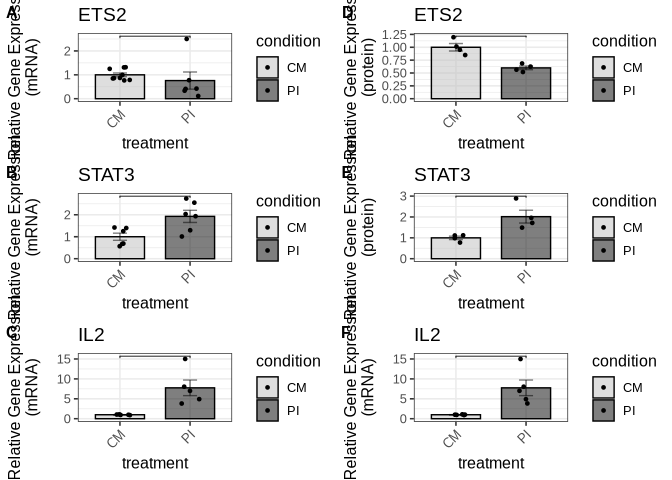

``` r
ggsave("output/Figure2/composite_fig2.pdf", composite_fig2, 
       width = 6, height = 9, dpi = 300)
```

### Figure 3

#### Figure 3a (ETS2 mRNA expression levels)

We import the expression data (qPCR) for ETS2:

``` r
fig3_ets2_qpcr_data <- read_xlsx("input/Figure3_data.xlsx", sheet = "ETS2_mRNA")
```

``` r
fig3_ets2_qpcr_result <- compare_qpcr_groups(
  fig3_ets2_qpcr_data,
  group_col = "treatment",
  gene_col = "ets2",
  actin_col = "actin",
  control_group = "CM",
  wilcox_pairs = list(c("CM", "PI"), c("CM", "CM_500"), c("CM", "CM_1000"), c("PI", "PI_500"), 
                      c("PI", "PI_1000"), c("PI", "PI_1500"))
)
```

``` r
fig3_ets2_qpcr_result$wilcox_results
```

    # A tibble: 6 × 4
      group1 group2  p.value statistic
      <chr>  <chr>     <dbl>     <dbl>
    1 CM     PI      0.0260         32
    2 CM     CM_500  0.0260         32
    3 CM     CM_1000 0.0411         31
    4 PI     PI_500  0.00216        36
    5 PI     PI_1000 0.00433        30
    6 PI     PI_1500 0.00216        36

``` r
fig3_ets2_qpcr_result$all_wilcox_table
```

<div id="lacuatcqbp" style="padding-left:0px;padding-right:0px;padding-top:10px;padding-bottom:10px;overflow-x:auto;overflow-y:auto;width:auto;height:auto;">
<style>#lacuatcqbp table {
  font-family: system-ui, 'Segoe UI', Roboto, Helvetica, Arial, sans-serif, 'Apple Color Emoji', 'Segoe UI Emoji', 'Segoe UI Symbol', 'Noto Color Emoji';
  -webkit-font-smoothing: antialiased;
  -moz-osx-font-smoothing: grayscale;
}

#lacuatcqbp thead, #lacuatcqbp tbody, #lacuatcqbp tfoot, #lacuatcqbp tr, #lacuatcqbp td, #lacuatcqbp th {
  border-style: none;
}

#lacuatcqbp p {
  margin: 0;
  padding: 0;
}

#lacuatcqbp .gt_table {
  display: table;
  border-collapse: collapse;
  line-height: normal;
  margin-left: auto;
  margin-right: auto;
  color: #333333;
  font-size: 16px;
  font-weight: normal;
  font-style: normal;
  background-color: #FFFFFF;
  width: auto;
  border-top-style: solid;
  border-top-width: 2px;
  border-top-color: #A8A8A8;
  border-right-style: none;
  border-right-width: 2px;
  border-right-color: #D3D3D3;
  border-bottom-style: solid;
  border-bottom-width: 2px;
  border-bottom-color: #A8A8A8;
  border-left-style: none;
  border-left-width: 2px;
  border-left-color: #D3D3D3;
}

#lacuatcqbp .gt_caption {
  padding-top: 4px;
  padding-bottom: 4px;
}

#lacuatcqbp .gt_title {
  color: #333333;
  font-size: 125%;
  font-weight: initial;
  padding-top: 4px;
  padding-bottom: 4px;
  padding-left: 5px;
  padding-right: 5px;
  border-bottom-color: #FFFFFF;
  border-bottom-width: 0;
}

#lacuatcqbp .gt_subtitle {
  color: #333333;
  font-size: 85%;
  font-weight: initial;
  padding-top: 3px;
  padding-bottom: 5px;
  padding-left: 5px;
  padding-right: 5px;
  border-top-color: #FFFFFF;
  border-top-width: 0;
}

#lacuatcqbp .gt_heading {
  background-color: #FFFFFF;
  text-align: center;
  border-bottom-color: #FFFFFF;
  border-left-style: none;
  border-left-width: 1px;
  border-left-color: #D3D3D3;
  border-right-style: none;
  border-right-width: 1px;
  border-right-color: #D3D3D3;
}

#lacuatcqbp .gt_bottom_border {
  border-bottom-style: solid;
  border-bottom-width: 2px;
  border-bottom-color: #D3D3D3;
}

#lacuatcqbp .gt_col_headings {
  border-top-style: solid;
  border-top-width: 2px;
  border-top-color: #D3D3D3;
  border-bottom-style: solid;
  border-bottom-width: 2px;
  border-bottom-color: #D3D3D3;
  border-left-style: none;
  border-left-width: 1px;
  border-left-color: #D3D3D3;
  border-right-style: none;
  border-right-width: 1px;
  border-right-color: #D3D3D3;
}

#lacuatcqbp .gt_col_heading {
  color: #333333;
  background-color: #FFFFFF;
  font-size: 100%;
  font-weight: normal;
  text-transform: inherit;
  border-left-style: none;
  border-left-width: 1px;
  border-left-color: #D3D3D3;
  border-right-style: none;
  border-right-width: 1px;
  border-right-color: #D3D3D3;
  vertical-align: bottom;
  padding-top: 5px;
  padding-bottom: 6px;
  padding-left: 5px;
  padding-right: 5px;
  overflow-x: hidden;
}

#lacuatcqbp .gt_column_spanner_outer {
  color: #333333;
  background-color: #FFFFFF;
  font-size: 100%;
  font-weight: normal;
  text-transform: inherit;
  padding-top: 0;
  padding-bottom: 0;
  padding-left: 4px;
  padding-right: 4px;
}

#lacuatcqbp .gt_column_spanner_outer:first-child {
  padding-left: 0;
}

#lacuatcqbp .gt_column_spanner_outer:last-child {
  padding-right: 0;
}

#lacuatcqbp .gt_column_spanner {
  border-bottom-style: solid;
  border-bottom-width: 2px;
  border-bottom-color: #D3D3D3;
  vertical-align: bottom;
  padding-top: 5px;
  padding-bottom: 5px;
  overflow-x: hidden;
  display: inline-block;
  width: 100%;
}

#lacuatcqbp .gt_spanner_row {
  border-bottom-style: hidden;
}

#lacuatcqbp .gt_group_heading {
  padding-top: 8px;
  padding-bottom: 8px;
  padding-left: 5px;
  padding-right: 5px;
  color: #333333;
  background-color: #FFFFFF;
  font-size: 100%;
  font-weight: initial;
  text-transform: inherit;
  border-top-style: solid;
  border-top-width: 2px;
  border-top-color: #D3D3D3;
  border-bottom-style: solid;
  border-bottom-width: 2px;
  border-bottom-color: #D3D3D3;
  border-left-style: none;
  border-left-width: 1px;
  border-left-color: #D3D3D3;
  border-right-style: none;
  border-right-width: 1px;
  border-right-color: #D3D3D3;
  vertical-align: middle;
  text-align: left;
}

#lacuatcqbp .gt_empty_group_heading {
  padding: 0.5px;
  color: #333333;
  background-color: #FFFFFF;
  font-size: 100%;
  font-weight: initial;
  border-top-style: solid;
  border-top-width: 2px;
  border-top-color: #D3D3D3;
  border-bottom-style: solid;
  border-bottom-width: 2px;
  border-bottom-color: #D3D3D3;
  vertical-align: middle;
}

#lacuatcqbp .gt_from_md > :first-child {
  margin-top: 0;
}

#lacuatcqbp .gt_from_md > :last-child {
  margin-bottom: 0;
}

#lacuatcqbp .gt_row {
  padding-top: 8px;
  padding-bottom: 8px;
  padding-left: 5px;
  padding-right: 5px;
  margin: 10px;
  border-top-style: solid;
  border-top-width: 1px;
  border-top-color: #D3D3D3;
  border-left-style: none;
  border-left-width: 1px;
  border-left-color: #D3D3D3;
  border-right-style: none;
  border-right-width: 1px;
  border-right-color: #D3D3D3;
  vertical-align: middle;
  overflow-x: hidden;
}

#lacuatcqbp .gt_stub {
  color: #333333;
  background-color: #FFFFFF;
  font-size: 100%;
  font-weight: initial;
  text-transform: inherit;
  border-right-style: solid;
  border-right-width: 2px;
  border-right-color: #D3D3D3;
  padding-left: 5px;
  padding-right: 5px;
}

#lacuatcqbp .gt_stub_row_group {
  color: #333333;
  background-color: #FFFFFF;
  font-size: 100%;
  font-weight: initial;
  text-transform: inherit;
  border-right-style: solid;
  border-right-width: 2px;
  border-right-color: #D3D3D3;
  padding-left: 5px;
  padding-right: 5px;
  vertical-align: top;
}

#lacuatcqbp .gt_row_group_first td {
  border-top-width: 2px;
}

#lacuatcqbp .gt_row_group_first th {
  border-top-width: 2px;
}

#lacuatcqbp .gt_summary_row {
  color: #333333;
  background-color: #FFFFFF;
  text-transform: inherit;
  padding-top: 8px;
  padding-bottom: 8px;
  padding-left: 5px;
  padding-right: 5px;
}

#lacuatcqbp .gt_first_summary_row {
  border-top-style: solid;
  border-top-color: #D3D3D3;
}

#lacuatcqbp .gt_first_summary_row.thick {
  border-top-width: 2px;
}

#lacuatcqbp .gt_last_summary_row {
  padding-top: 8px;
  padding-bottom: 8px;
  padding-left: 5px;
  padding-right: 5px;
  border-bottom-style: solid;
  border-bottom-width: 2px;
  border-bottom-color: #D3D3D3;
}

#lacuatcqbp .gt_grand_summary_row {
  color: #333333;
  background-color: #FFFFFF;
  text-transform: inherit;
  padding-top: 8px;
  padding-bottom: 8px;
  padding-left: 5px;
  padding-right: 5px;
}

#lacuatcqbp .gt_first_grand_summary_row {
  padding-top: 8px;
  padding-bottom: 8px;
  padding-left: 5px;
  padding-right: 5px;
  border-top-style: double;
  border-top-width: 6px;
  border-top-color: #D3D3D3;
}

#lacuatcqbp .gt_last_grand_summary_row_top {
  padding-top: 8px;
  padding-bottom: 8px;
  padding-left: 5px;
  padding-right: 5px;
  border-bottom-style: double;
  border-bottom-width: 6px;
  border-bottom-color: #D3D3D3;
}

#lacuatcqbp .gt_striped {
  background-color: rgba(128, 128, 128, 0.05);
}

#lacuatcqbp .gt_table_body {
  border-top-style: solid;
  border-top-width: 2px;
  border-top-color: #D3D3D3;
  border-bottom-style: solid;
  border-bottom-width: 2px;
  border-bottom-color: #D3D3D3;
}

#lacuatcqbp .gt_footnotes {
  color: #333333;
  background-color: #FFFFFF;
  border-bottom-style: none;
  border-bottom-width: 2px;
  border-bottom-color: #D3D3D3;
  border-left-style: none;
  border-left-width: 2px;
  border-left-color: #D3D3D3;
  border-right-style: none;
  border-right-width: 2px;
  border-right-color: #D3D3D3;
}

#lacuatcqbp .gt_footnote {
  margin: 0px;
  font-size: 90%;
  padding-top: 4px;
  padding-bottom: 4px;
  padding-left: 5px;
  padding-right: 5px;
}

#lacuatcqbp .gt_sourcenotes {
  color: #333333;
  background-color: #FFFFFF;
  border-bottom-style: none;
  border-bottom-width: 2px;
  border-bottom-color: #D3D3D3;
  border-left-style: none;
  border-left-width: 2px;
  border-left-color: #D3D3D3;
  border-right-style: none;
  border-right-width: 2px;
  border-right-color: #D3D3D3;
}

#lacuatcqbp .gt_sourcenote {
  font-size: 90%;
  padding-top: 4px;
  padding-bottom: 4px;
  padding-left: 5px;
  padding-right: 5px;
}

#lacuatcqbp .gt_left {
  text-align: left;
}

#lacuatcqbp .gt_center {
  text-align: center;
}

#lacuatcqbp .gt_right {
  text-align: right;
  font-variant-numeric: tabular-nums;
}

#lacuatcqbp .gt_font_normal {
  font-weight: normal;
}

#lacuatcqbp .gt_font_bold {
  font-weight: bold;
}

#lacuatcqbp .gt_font_italic {
  font-style: italic;
}

#lacuatcqbp .gt_super {
  font-size: 65%;
}

#lacuatcqbp .gt_footnote_marks {
  font-size: 75%;
  vertical-align: 0.4em;
  position: initial;
}

#lacuatcqbp .gt_asterisk {
  font-size: 100%;
  vertical-align: 0;
}

#lacuatcqbp .gt_indent_1 {
  text-indent: 5px;
}

#lacuatcqbp .gt_indent_2 {
  text-indent: 10px;
}

#lacuatcqbp .gt_indent_3 {
  text-indent: 15px;
}

#lacuatcqbp .gt_indent_4 {
  text-indent: 20px;
}

#lacuatcqbp .gt_indent_5 {
  text-indent: 25px;
}
</style>
<table class="gt_table" data-quarto-disable-processing="false" data-quarto-bootstrap="false">
  <thead>
    <tr class="gt_col_headings">
      <th class="gt_col_heading gt_columns_bottom_border gt_left" rowspan="1" colspan="1" scope="col" id="Comparison">Comparison</th>
      <th class="gt_col_heading gt_columns_bottom_border gt_right" rowspan="1" colspan="1" scope="col" id="Statistic">Statistic</th>
      <th class="gt_col_heading gt_columns_bottom_border gt_right" rowspan="1" colspan="1" scope="col" id="P_value">P_value</th>
      <th class="gt_col_heading gt_columns_bottom_border gt_left" rowspan="1" colspan="1" scope="col" id="Significant">Significant</th>
    </tr>
  </thead>
  <tbody class="gt_table_body">
    <tr><td headers="Comparison" class="gt_row gt_left">CM vs CM_VCT</td>
<td headers="Statistic" class="gt_row gt_right">12.0</td>
<td headers="P_value" class="gt_row gt_right">0.3939</td>
<td headers="Significant" class="gt_row gt_left">No</td></tr>
    <tr><td headers="Comparison" class="gt_row gt_left">CM vs CM_100</td>
<td headers="Statistic" class="gt_row gt_right">17.0</td>
<td headers="P_value" class="gt_row gt_right">0.7922</td>
<td headers="Significant" class="gt_row gt_left">No</td></tr>
    <tr><td headers="Comparison" class="gt_row gt_left">CM vs CM_250</td>
<td headers="Statistic" class="gt_row gt_right">18.0</td>
<td headers="P_value" class="gt_row gt_right">1.0000</td>
<td headers="Significant" class="gt_row gt_left">No</td></tr>
    <tr><td headers="Comparison" class="gt_row gt_left" style="background-color: rgba(204,230,255,0.8); color: #000000; font-weight: bold;">CM vs CM_500</td>
<td headers="Statistic" class="gt_row gt_right" style="background-color: rgba(204,230,255,0.8); color: #000000; font-weight: bold;">32.0</td>
<td headers="P_value" class="gt_row gt_right" style="background-color: rgba(204,230,255,0.8); color: #000000; font-weight: bold;">0.0260</td>
<td headers="Significant" class="gt_row gt_left" style="background-color: rgba(204,230,255,0.8); color: #000000; font-weight: bold;">Yes</td></tr>
    <tr><td headers="Comparison" class="gt_row gt_left" style="background-color: rgba(204,230,255,0.8); color: #000000; font-weight: bold;">CM vs CM_1000</td>
<td headers="Statistic" class="gt_row gt_right" style="background-color: rgba(204,230,255,0.8); color: #000000; font-weight: bold;">31.0</td>
<td headers="P_value" class="gt_row gt_right" style="background-color: rgba(204,230,255,0.8); color: #000000; font-weight: bold;">0.0411</td>
<td headers="Significant" class="gt_row gt_left" style="background-color: rgba(204,230,255,0.8); color: #000000; font-weight: bold;">Yes</td></tr>
    <tr><td headers="Comparison" class="gt_row gt_left">CM vs CM_1500</td>
<td headers="Statistic" class="gt_row gt_right">29.0</td>
<td headers="P_value" class="gt_row gt_right">0.0931</td>
<td headers="Significant" class="gt_row gt_left">No</td></tr>
    <tr><td headers="Comparison" class="gt_row gt_left" style="background-color: rgba(204,230,255,0.8); color: #000000; font-weight: bold;">CM vs PI</td>
<td headers="Statistic" class="gt_row gt_right" style="background-color: rgba(204,230,255,0.8); color: #000000; font-weight: bold;">32.0</td>
<td headers="P_value" class="gt_row gt_right" style="background-color: rgba(204,230,255,0.8); color: #000000; font-weight: bold;">0.0260</td>
<td headers="Significant" class="gt_row gt_left" style="background-color: rgba(204,230,255,0.8); color: #000000; font-weight: bold;">Yes</td></tr>
    <tr><td headers="Comparison" class="gt_row gt_left">CM vs PI_VCT</td>
<td headers="Statistic" class="gt_row gt_right">26.0</td>
<td headers="P_value" class="gt_row gt_right">0.2403</td>
<td headers="Significant" class="gt_row gt_left">No</td></tr>
    <tr><td headers="Comparison" class="gt_row gt_left" style="background-color: rgba(204,230,255,0.8); color: #000000; font-weight: bold;">CM vs PI_100</td>
<td headers="Statistic" class="gt_row gt_right" style="background-color: rgba(204,230,255,0.8); color: #000000; font-weight: bold;">23.0</td>
<td headers="P_value" class="gt_row gt_right" style="background-color: rgba(204,230,255,0.8); color: #000000; font-weight: bold;">0.0190</td>
<td headers="Significant" class="gt_row gt_left" style="background-color: rgba(204,230,255,0.8); color: #000000; font-weight: bold;">Yes</td></tr>
    <tr><td headers="Comparison" class="gt_row gt_left" style="background-color: rgba(204,230,255,0.8); color: #000000; font-weight: bold;">CM vs PI_250</td>
<td headers="Statistic" class="gt_row gt_right" style="background-color: rgba(204,230,255,0.8); color: #000000; font-weight: bold;">35.0</td>
<td headers="P_value" class="gt_row gt_right" style="background-color: rgba(204,230,255,0.8); color: #000000; font-weight: bold;">0.0043</td>
<td headers="Significant" class="gt_row gt_left" style="background-color: rgba(204,230,255,0.8); color: #000000; font-weight: bold;">Yes</td></tr>
    <tr><td headers="Comparison" class="gt_row gt_left" style="background-color: rgba(204,230,255,0.8); color: #000000; font-weight: bold;">CM vs PI_500</td>
<td headers="Statistic" class="gt_row gt_right" style="background-color: rgba(204,230,255,0.8); color: #000000; font-weight: bold;">36.0</td>
<td headers="P_value" class="gt_row gt_right" style="background-color: rgba(204,230,255,0.8); color: #000000; font-weight: bold;">0.0022</td>
<td headers="Significant" class="gt_row gt_left" style="background-color: rgba(204,230,255,0.8); color: #000000; font-weight: bold;">Yes</td></tr>
    <tr><td headers="Comparison" class="gt_row gt_left" style="background-color: rgba(204,230,255,0.8); color: #000000; font-weight: bold;">CM vs PI_1000</td>
<td headers="Statistic" class="gt_row gt_right" style="background-color: rgba(204,230,255,0.8); color: #000000; font-weight: bold;">30.0</td>
<td headers="P_value" class="gt_row gt_right" style="background-color: rgba(204,230,255,0.8); color: #000000; font-weight: bold;">0.0043</td>
<td headers="Significant" class="gt_row gt_left" style="background-color: rgba(204,230,255,0.8); color: #000000; font-weight: bold;">Yes</td></tr>
    <tr><td headers="Comparison" class="gt_row gt_left" style="background-color: rgba(204,230,255,0.8); color: #000000; font-weight: bold;">CM vs PI_1500</td>
<td headers="Statistic" class="gt_row gt_right" style="background-color: rgba(204,230,255,0.8); color: #000000; font-weight: bold;">36.0</td>
<td headers="P_value" class="gt_row gt_right" style="background-color: rgba(204,230,255,0.8); color: #000000; font-weight: bold;">0.0022</td>
<td headers="Significant" class="gt_row gt_left" style="background-color: rgba(204,230,255,0.8); color: #000000; font-weight: bold;">Yes</td></tr>
    <tr><td headers="Comparison" class="gt_row gt_left">CM_VCT vs CM_100</td>
<td headers="Statistic" class="gt_row gt_right">16.0</td>
<td headers="P_value" class="gt_row gt_right">0.9307</td>
<td headers="Significant" class="gt_row gt_left">No</td></tr>
    <tr><td headers="Comparison" class="gt_row gt_left">CM_VCT vs CM_250</td>
<td headers="Statistic" class="gt_row gt_right">18.5</td>
<td headers="P_value" class="gt_row gt_right">1.0000</td>
<td headers="Significant" class="gt_row gt_left">No</td></tr>
    <tr><td headers="Comparison" class="gt_row gt_left">CM_VCT vs CM_500</td>
<td headers="Statistic" class="gt_row gt_right">24.0</td>
<td headers="P_value" class="gt_row gt_right">0.3939</td>
<td headers="Significant" class="gt_row gt_left">No</td></tr>
    <tr><td headers="Comparison" class="gt_row gt_left">CM_VCT vs CM_1000</td>
<td headers="Statistic" class="gt_row gt_right">24.0</td>
<td headers="P_value" class="gt_row gt_right">0.3939</td>
<td headers="Significant" class="gt_row gt_left">No</td></tr>
    <tr><td headers="Comparison" class="gt_row gt_left">CM_VCT vs CM_1500</td>
<td headers="Statistic" class="gt_row gt_right">24.0</td>
<td headers="P_value" class="gt_row gt_right">0.3939</td>
<td headers="Significant" class="gt_row gt_left">No</td></tr>
    <tr><td headers="Comparison" class="gt_row gt_left">CM_VCT vs PI</td>
<td headers="Statistic" class="gt_row gt_right">24.0</td>
<td headers="P_value" class="gt_row gt_right">0.3939</td>
<td headers="Significant" class="gt_row gt_left">No</td></tr>
    <tr><td headers="Comparison" class="gt_row gt_left">CM_VCT vs PI_VCT</td>
<td headers="Statistic" class="gt_row gt_right">23.0</td>
<td headers="P_value" class="gt_row gt_right">0.4848</td>
<td headers="Significant" class="gt_row gt_left">No</td></tr>
    <tr><td headers="Comparison" class="gt_row gt_left">CM_VCT vs PI_100</td>
<td headers="Statistic" class="gt_row gt_right">16.0</td>
<td headers="P_value" class="gt_row gt_right">0.4762</td>
<td headers="Significant" class="gt_row gt_left">No</td></tr>
    <tr><td headers="Comparison" class="gt_row gt_left">CM_VCT vs PI_250</td>
<td headers="Statistic" class="gt_row gt_right">26.0</td>
<td headers="P_value" class="gt_row gt_right">0.2403</td>
<td headers="Significant" class="gt_row gt_left">No</td></tr>
    <tr><td headers="Comparison" class="gt_row gt_left">CM_VCT vs PI_500</td>
<td headers="Statistic" class="gt_row gt_right">27.0</td>
<td headers="P_value" class="gt_row gt_right">0.1797</td>
<td headers="Significant" class="gt_row gt_left">No</td></tr>
    <tr><td headers="Comparison" class="gt_row gt_left">CM_VCT vs PI_1000</td>
<td headers="Statistic" class="gt_row gt_right">21.0</td>
<td headers="P_value" class="gt_row gt_right">0.3290</td>
<td headers="Significant" class="gt_row gt_left">No</td></tr>
    <tr><td headers="Comparison" class="gt_row gt_left">CM_VCT vs PI_1500</td>
<td headers="Statistic" class="gt_row gt_right">28.0</td>
<td headers="P_value" class="gt_row gt_right">0.1320</td>
<td headers="Significant" class="gt_row gt_left">No</td></tr>
    <tr><td headers="Comparison" class="gt_row gt_left">CM_100 vs CM_250</td>
<td headers="Statistic" class="gt_row gt_right">15.0</td>
<td headers="P_value" class="gt_row gt_right">1.0000</td>
<td headers="Significant" class="gt_row gt_left">No</td></tr>
    <tr><td headers="Comparison" class="gt_row gt_left">CM_100 vs CM_500</td>
<td headers="Statistic" class="gt_row gt_right">17.0</td>
<td headers="P_value" class="gt_row gt_right">0.7922</td>
<td headers="Significant" class="gt_row gt_left">No</td></tr>
    <tr><td headers="Comparison" class="gt_row gt_left">CM_100 vs CM_1000</td>
<td headers="Statistic" class="gt_row gt_right">23.0</td>
<td headers="P_value" class="gt_row gt_right">0.1775</td>
<td headers="Significant" class="gt_row gt_left">No</td></tr>
    <tr><td headers="Comparison" class="gt_row gt_left">CM_100 vs CM_1500</td>
<td headers="Statistic" class="gt_row gt_right">22.0</td>
<td headers="P_value" class="gt_row gt_right">0.2468</td>
<td headers="Significant" class="gt_row gt_left">No</td></tr>
    <tr><td headers="Comparison" class="gt_row gt_left">CM_100 vs PI</td>
<td headers="Statistic" class="gt_row gt_right">18.0</td>
<td headers="P_value" class="gt_row gt_right">0.6623</td>
<td headers="Significant" class="gt_row gt_left">No</td></tr>
    <tr><td headers="Comparison" class="gt_row gt_left">CM_100 vs PI_VCT</td>
<td headers="Statistic" class="gt_row gt_right">18.0</td>
<td headers="P_value" class="gt_row gt_right">0.6623</td>
<td headers="Significant" class="gt_row gt_left">No</td></tr>
    <tr><td headers="Comparison" class="gt_row gt_left">CM_100 vs PI_100</td>
<td headers="Statistic" class="gt_row gt_right">15.0</td>
<td headers="P_value" class="gt_row gt_right">0.2857</td>
<td headers="Significant" class="gt_row gt_left">No</td></tr>
    <tr><td headers="Comparison" class="gt_row gt_left">CM_100 vs PI_250</td>
<td headers="Statistic" class="gt_row gt_right">26.0</td>
<td headers="P_value" class="gt_row gt_right">0.0519</td>
<td headers="Significant" class="gt_row gt_left">No</td></tr>
    <tr><td headers="Comparison" class="gt_row gt_left" style="background-color: rgba(204,230,255,0.8); color: #000000; font-weight: bold;">CM_100 vs PI_500</td>
<td headers="Statistic" class="gt_row gt_right" style="background-color: rgba(204,230,255,0.8); color: #000000; font-weight: bold;">28.0</td>
<td headers="P_value" class="gt_row gt_right" style="background-color: rgba(204,230,255,0.8); color: #000000; font-weight: bold;">0.0173</td>
<td headers="Significant" class="gt_row gt_left" style="background-color: rgba(204,230,255,0.8); color: #000000; font-weight: bold;">Yes</td></tr>
    <tr><td headers="Comparison" class="gt_row gt_left">CM_100 vs PI_1000</td>
<td headers="Statistic" class="gt_row gt_right">22.0</td>
<td headers="P_value" class="gt_row gt_right">0.0556</td>
<td headers="Significant" class="gt_row gt_left">No</td></tr>
    <tr><td headers="Comparison" class="gt_row gt_left" style="background-color: rgba(204,230,255,0.8); color: #000000; font-weight: bold;">CM_100 vs PI_1500</td>
<td headers="Statistic" class="gt_row gt_right" style="background-color: rgba(204,230,255,0.8); color: #000000; font-weight: bold;">29.5</td>
<td headers="P_value" class="gt_row gt_right" style="background-color: rgba(204,230,255,0.8); color: #000000; font-weight: bold;">0.0104</td>
<td headers="Significant" class="gt_row gt_left" style="background-color: rgba(204,230,255,0.8); color: #000000; font-weight: bold;">Yes</td></tr>
    <tr><td headers="Comparison" class="gt_row gt_left">CM_250 vs CM_500</td>
<td headers="Statistic" class="gt_row gt_right">18.0</td>
<td headers="P_value" class="gt_row gt_right">1.0000</td>
<td headers="Significant" class="gt_row gt_left">No</td></tr>
    <tr><td headers="Comparison" class="gt_row gt_left">CM_250 vs CM_1000</td>
<td headers="Statistic" class="gt_row gt_right">24.0</td>
<td headers="P_value" class="gt_row gt_right">0.3939</td>
<td headers="Significant" class="gt_row gt_left">No</td></tr>
    <tr><td headers="Comparison" class="gt_row gt_left">CM_250 vs CM_1500</td>
<td headers="Statistic" class="gt_row gt_right">25.0</td>
<td headers="P_value" class="gt_row gt_right">0.3095</td>
<td headers="Significant" class="gt_row gt_left">No</td></tr>
    <tr><td headers="Comparison" class="gt_row gt_left">CM_250 vs PI</td>
<td headers="Statistic" class="gt_row gt_right">18.0</td>
<td headers="P_value" class="gt_row gt_right">1.0000</td>
<td headers="Significant" class="gt_row gt_left">No</td></tr>
    <tr><td headers="Comparison" class="gt_row gt_left">CM_250 vs PI_VCT</td>
<td headers="Statistic" class="gt_row gt_right">19.0</td>
<td headers="P_value" class="gt_row gt_right">0.9372</td>
<td headers="Significant" class="gt_row gt_left">No</td></tr>
    <tr><td headers="Comparison" class="gt_row gt_left">CM_250 vs PI_100</td>
<td headers="Statistic" class="gt_row gt_right">16.0</td>
<td headers="P_value" class="gt_row gt_right">0.4762</td>
<td headers="Significant" class="gt_row gt_left">No</td></tr>
    <tr><td headers="Comparison" class="gt_row gt_left">CM_250 vs PI_250</td>
<td headers="Statistic" class="gt_row gt_right">29.0</td>
<td headers="P_value" class="gt_row gt_right">0.0931</td>
<td headers="Significant" class="gt_row gt_left">No</td></tr>
    <tr><td headers="Comparison" class="gt_row gt_left">CM_250 vs PI_500</td>
<td headers="Statistic" class="gt_row gt_right">30.0</td>
<td headers="P_value" class="gt_row gt_right">0.0649</td>
<td headers="Significant" class="gt_row gt_left">No</td></tr>
    <tr><td headers="Comparison" class="gt_row gt_left">CM_250 vs PI_1000</td>
<td headers="Statistic" class="gt_row gt_right">24.0</td>
<td headers="P_value" class="gt_row gt_right">0.1255</td>
<td headers="Significant" class="gt_row gt_left">No</td></tr>
    <tr><td headers="Comparison" class="gt_row gt_left" style="background-color: rgba(204,230,255,0.8); color: #000000; font-weight: bold;">CM_250 vs PI_1500</td>
<td headers="Statistic" class="gt_row gt_right" style="background-color: rgba(204,230,255,0.8); color: #000000; font-weight: bold;">32.0</td>
<td headers="P_value" class="gt_row gt_right" style="background-color: rgba(204,230,255,0.8); color: #000000; font-weight: bold;">0.0260</td>
<td headers="Significant" class="gt_row gt_left" style="background-color: rgba(204,230,255,0.8); color: #000000; font-weight: bold;">Yes</td></tr>
    <tr><td headers="Comparison" class="gt_row gt_left">CM_500 vs CM_1000</td>
<td headers="Statistic" class="gt_row gt_right">23.0</td>
<td headers="P_value" class="gt_row gt_right">0.4848</td>
<td headers="Significant" class="gt_row gt_left">No</td></tr>
    <tr><td headers="Comparison" class="gt_row gt_left">CM_500 vs CM_1500</td>
<td headers="Statistic" class="gt_row gt_right">24.0</td>
<td headers="P_value" class="gt_row gt_right">0.3939</td>
<td headers="Significant" class="gt_row gt_left">No</td></tr>
    <tr><td headers="Comparison" class="gt_row gt_left">CM_500 vs PI</td>
<td headers="Statistic" class="gt_row gt_right">19.5</td>
<td headers="P_value" class="gt_row gt_right">0.8726</td>
<td headers="Significant" class="gt_row gt_left">No</td></tr>
    <tr><td headers="Comparison" class="gt_row gt_left">CM_500 vs PI_VCT</td>
<td headers="Statistic" class="gt_row gt_right">17.0</td>
<td headers="P_value" class="gt_row gt_right">0.9372</td>
<td headers="Significant" class="gt_row gt_left">No</td></tr>
    <tr><td headers="Comparison" class="gt_row gt_left">CM_500 vs PI_100</td>
<td headers="Statistic" class="gt_row gt_right">17.0</td>
<td headers="P_value" class="gt_row gt_right">0.3524</td>
<td headers="Significant" class="gt_row gt_left">No</td></tr>
    <tr><td headers="Comparison" class="gt_row gt_left">CM_500 vs PI_250</td>
<td headers="Statistic" class="gt_row gt_right">30.0</td>
<td headers="P_value" class="gt_row gt_right">0.0649</td>
<td headers="Significant" class="gt_row gt_left">No</td></tr>
    <tr><td headers="Comparison" class="gt_row gt_left" style="background-color: rgba(204,230,255,0.8); color: #000000; font-weight: bold;">CM_500 vs PI_500</td>
<td headers="Statistic" class="gt_row gt_right" style="background-color: rgba(204,230,255,0.8); color: #000000; font-weight: bold;">34.0</td>
<td headers="P_value" class="gt_row gt_right" style="background-color: rgba(204,230,255,0.8); color: #000000; font-weight: bold;">0.0087</td>
<td headers="Significant" class="gt_row gt_left" style="background-color: rgba(204,230,255,0.8); color: #000000; font-weight: bold;">Yes</td></tr>
    <tr><td headers="Comparison" class="gt_row gt_left" style="background-color: rgba(204,230,255,0.8); color: #000000; font-weight: bold;">CM_500 vs PI_1000</td>
<td headers="Statistic" class="gt_row gt_right" style="background-color: rgba(204,230,255,0.8); color: #000000; font-weight: bold;">30.0</td>
<td headers="P_value" class="gt_row gt_right" style="background-color: rgba(204,230,255,0.8); color: #000000; font-weight: bold;">0.0043</td>
<td headers="Significant" class="gt_row gt_left" style="background-color: rgba(204,230,255,0.8); color: #000000; font-weight: bold;">Yes</td></tr>
    <tr><td headers="Comparison" class="gt_row gt_left" style="background-color: rgba(204,230,255,0.8); color: #000000; font-weight: bold;">CM_500 vs PI_1500</td>
<td headers="Statistic" class="gt_row gt_right" style="background-color: rgba(204,230,255,0.8); color: #000000; font-weight: bold;">36.0</td>
<td headers="P_value" class="gt_row gt_right" style="background-color: rgba(204,230,255,0.8); color: #000000; font-weight: bold;">0.0022</td>
<td headers="Significant" class="gt_row gt_left" style="background-color: rgba(204,230,255,0.8); color: #000000; font-weight: bold;">Yes</td></tr>
    <tr><td headers="Comparison" class="gt_row gt_left">CM_1000 vs CM_1500</td>
<td headers="Statistic" class="gt_row gt_right">14.0</td>
<td headers="P_value" class="gt_row gt_right">0.5887</td>
<td headers="Significant" class="gt_row gt_left">No</td></tr>
    <tr><td headers="Comparison" class="gt_row gt_left">CM_1000 vs PI</td>
<td headers="Statistic" class="gt_row gt_right">11.0</td>
<td headers="P_value" class="gt_row gt_right">0.3095</td>
<td headers="Significant" class="gt_row gt_left">No</td></tr>
    <tr><td headers="Comparison" class="gt_row gt_left">CM_1000 vs PI_VCT</td>
<td headers="Statistic" class="gt_row gt_right">13.0</td>
<td headers="P_value" class="gt_row gt_right">0.4848</td>
<td headers="Significant" class="gt_row gt_left">No</td></tr>
    <tr><td headers="Comparison" class="gt_row gt_left">CM_1000 vs PI_100</td>
<td headers="Statistic" class="gt_row gt_right">10.0</td>
<td headers="P_value" class="gt_row gt_right">0.7619</td>
<td headers="Significant" class="gt_row gt_left">No</td></tr>
    <tr><td headers="Comparison" class="gt_row gt_left">CM_1000 vs PI_250</td>
<td headers="Statistic" class="gt_row gt_right">20.5</td>
<td headers="P_value" class="gt_row gt_right">0.7483</td>
<td headers="Significant" class="gt_row gt_left">No</td></tr>
    <tr><td headers="Comparison" class="gt_row gt_left">CM_1000 vs PI_500</td>
<td headers="Statistic" class="gt_row gt_right">28.0</td>
<td headers="P_value" class="gt_row gt_right">0.1320</td>
<td headers="Significant" class="gt_row gt_left">No</td></tr>
    <tr><td headers="Comparison" class="gt_row gt_left">CM_1000 vs PI_1000</td>
<td headers="Statistic" class="gt_row gt_right">24.0</td>
<td headers="P_value" class="gt_row gt_right">0.1255</td>
<td headers="Significant" class="gt_row gt_left">No</td></tr>
    <tr><td headers="Comparison" class="gt_row gt_left">CM_1000 vs PI_1500</td>
<td headers="Statistic" class="gt_row gt_right">25.0</td>
<td headers="P_value" class="gt_row gt_right">0.3095</td>
<td headers="Significant" class="gt_row gt_left">No</td></tr>
    <tr><td headers="Comparison" class="gt_row gt_left">CM_1500 vs PI</td>
<td headers="Statistic" class="gt_row gt_right">12.0</td>
<td headers="P_value" class="gt_row gt_right">0.3939</td>
<td headers="Significant" class="gt_row gt_left">No</td></tr>
    <tr><td headers="Comparison" class="gt_row gt_left">CM_1500 vs PI_VCT</td>
<td headers="Statistic" class="gt_row gt_right">14.0</td>
<td headers="P_value" class="gt_row gt_right">0.5887</td>
<td headers="Significant" class="gt_row gt_left">No</td></tr>
    <tr><td headers="Comparison" class="gt_row gt_left">CM_1500 vs PI_100</td>
<td headers="Statistic" class="gt_row gt_right">16.0</td>
<td headers="P_value" class="gt_row gt_right">0.4762</td>
<td headers="Significant" class="gt_row gt_left">No</td></tr>
    <tr><td headers="Comparison" class="gt_row gt_left">CM_1500 vs PI_250</td>
<td headers="Statistic" class="gt_row gt_right">26.0</td>
<td headers="P_value" class="gt_row gt_right">0.2403</td>
<td headers="Significant" class="gt_row gt_left">No</td></tr>
    <tr><td headers="Comparison" class="gt_row gt_left">CM_1500 vs PI_500</td>
<td headers="Statistic" class="gt_row gt_right">30.0</td>
<td headers="P_value" class="gt_row gt_right">0.0649</td>
<td headers="Significant" class="gt_row gt_left">No</td></tr>
    <tr><td headers="Comparison" class="gt_row gt_left">CM_1500 vs PI_1000</td>
<td headers="Statistic" class="gt_row gt_right">23.0</td>
<td headers="P_value" class="gt_row gt_right">0.1775</td>
<td headers="Significant" class="gt_row gt_left">No</td></tr>
    <tr><td headers="Comparison" class="gt_row gt_left">CM_1500 vs PI_1500</td>
<td headers="Statistic" class="gt_row gt_right">30.0</td>
<td headers="P_value" class="gt_row gt_right">0.0649</td>
<td headers="Significant" class="gt_row gt_left">No</td></tr>
    <tr><td headers="Comparison" class="gt_row gt_left">PI vs PI_VCT</td>
<td headers="Statistic" class="gt_row gt_right">17.0</td>
<td headers="P_value" class="gt_row gt_right">0.9372</td>
<td headers="Significant" class="gt_row gt_left">No</td></tr>
    <tr><td headers="Comparison" class="gt_row gt_left">PI vs PI_100</td>
<td headers="Statistic" class="gt_row gt_right">16.0</td>
<td headers="P_value" class="gt_row gt_right">0.4762</td>
<td headers="Significant" class="gt_row gt_left">No</td></tr>
    <tr><td headers="Comparison" class="gt_row gt_left">PI vs PI_250</td>
<td headers="Statistic" class="gt_row gt_right">30.0</td>
<td headers="P_value" class="gt_row gt_right">0.0649</td>
<td headers="Significant" class="gt_row gt_left">No</td></tr>
    <tr><td headers="Comparison" class="gt_row gt_left" style="background-color: rgba(204,230,255,0.8); color: #000000; font-weight: bold;">PI vs PI_500</td>
<td headers="Statistic" class="gt_row gt_right" style="background-color: rgba(204,230,255,0.8); color: #000000; font-weight: bold;">36.0</td>
<td headers="P_value" class="gt_row gt_right" style="background-color: rgba(204,230,255,0.8); color: #000000; font-weight: bold;">0.0022</td>
<td headers="Significant" class="gt_row gt_left" style="background-color: rgba(204,230,255,0.8); color: #000000; font-weight: bold;">Yes</td></tr>
    <tr><td headers="Comparison" class="gt_row gt_left" style="background-color: rgba(204,230,255,0.8); color: #000000; font-weight: bold;">PI vs PI_1000</td>
<td headers="Statistic" class="gt_row gt_right" style="background-color: rgba(204,230,255,0.8); color: #000000; font-weight: bold;">30.0</td>
<td headers="P_value" class="gt_row gt_right" style="background-color: rgba(204,230,255,0.8); color: #000000; font-weight: bold;">0.0043</td>
<td headers="Significant" class="gt_row gt_left" style="background-color: rgba(204,230,255,0.8); color: #000000; font-weight: bold;">Yes</td></tr>
    <tr><td headers="Comparison" class="gt_row gt_left" style="background-color: rgba(204,230,255,0.8); color: #000000; font-weight: bold;">PI vs PI_1500</td>
<td headers="Statistic" class="gt_row gt_right" style="background-color: rgba(204,230,255,0.8); color: #000000; font-weight: bold;">36.0</td>
<td headers="P_value" class="gt_row gt_right" style="background-color: rgba(204,230,255,0.8); color: #000000; font-weight: bold;">0.0022</td>
<td headers="Significant" class="gt_row gt_left" style="background-color: rgba(204,230,255,0.8); color: #000000; font-weight: bold;">Yes</td></tr>
    <tr><td headers="Comparison" class="gt_row gt_left">PI_VCT vs PI_100</td>
<td headers="Statistic" class="gt_row gt_right">16.0</td>
<td headers="P_value" class="gt_row gt_right">0.4762</td>
<td headers="Significant" class="gt_row gt_left">No</td></tr>
    <tr><td headers="Comparison" class="gt_row gt_left">PI_VCT vs PI_250</td>
<td headers="Statistic" class="gt_row gt_right">28.0</td>
<td headers="P_value" class="gt_row gt_right">0.1320</td>
<td headers="Significant" class="gt_row gt_left">No</td></tr>
    <tr><td headers="Comparison" class="gt_row gt_left" style="background-color: rgba(204,230,255,0.8); color: #000000; font-weight: bold;">PI_VCT vs PI_500</td>
<td headers="Statistic" class="gt_row gt_right" style="background-color: rgba(204,230,255,0.8); color: #000000; font-weight: bold;">32.0</td>
<td headers="P_value" class="gt_row gt_right" style="background-color: rgba(204,230,255,0.8); color: #000000; font-weight: bold;">0.0260</td>
<td headers="Significant" class="gt_row gt_left" style="background-color: rgba(204,230,255,0.8); color: #000000; font-weight: bold;">Yes</td></tr>
    <tr><td headers="Comparison" class="gt_row gt_left" style="background-color: rgba(204,230,255,0.8); color: #000000; font-weight: bold;">PI_VCT vs PI_1000</td>
<td headers="Statistic" class="gt_row gt_right" style="background-color: rgba(204,230,255,0.8); color: #000000; font-weight: bold;">27.0</td>
<td headers="P_value" class="gt_row gt_right" style="background-color: rgba(204,230,255,0.8); color: #000000; font-weight: bold;">0.0303</td>
<td headers="Significant" class="gt_row gt_left" style="background-color: rgba(204,230,255,0.8); color: #000000; font-weight: bold;">Yes</td></tr>
    <tr><td headers="Comparison" class="gt_row gt_left" style="background-color: rgba(204,230,255,0.8); color: #000000; font-weight: bold;">PI_VCT vs PI_1500</td>
<td headers="Statistic" class="gt_row gt_right" style="background-color: rgba(204,230,255,0.8); color: #000000; font-weight: bold;">32.0</td>
<td headers="P_value" class="gt_row gt_right" style="background-color: rgba(204,230,255,0.8); color: #000000; font-weight: bold;">0.0260</td>
<td headers="Significant" class="gt_row gt_left" style="background-color: rgba(204,230,255,0.8); color: #000000; font-weight: bold;">Yes</td></tr>
    <tr><td headers="Comparison" class="gt_row gt_left">PI_100 vs PI_250</td>
<td headers="Statistic" class="gt_row gt_right">14.0</td>
<td headers="P_value" class="gt_row gt_right">0.7619</td>
<td headers="Significant" class="gt_row gt_left">No</td></tr>
    <tr><td headers="Comparison" class="gt_row gt_left">PI_100 vs PI_500</td>
<td headers="Statistic" class="gt_row gt_right">19.0</td>
<td headers="P_value" class="gt_row gt_right">0.1714</td>
<td headers="Significant" class="gt_row gt_left">No</td></tr>
    <tr><td headers="Comparison" class="gt_row gt_left">PI_100 vs PI_1000</td>
<td headers="Statistic" class="gt_row gt_right">16.0</td>
<td headers="P_value" class="gt_row gt_right">0.1905</td>
<td headers="Significant" class="gt_row gt_left">No</td></tr>
    <tr><td headers="Comparison" class="gt_row gt_left">PI_100 vs PI_1500</td>
<td headers="Statistic" class="gt_row gt_right">17.0</td>
<td headers="P_value" class="gt_row gt_right">0.3524</td>
<td headers="Significant" class="gt_row gt_left">No</td></tr>
    <tr><td headers="Comparison" class="gt_row gt_left">PI_250 vs PI_500</td>
<td headers="Statistic" class="gt_row gt_right">24.0</td>
<td headers="P_value" class="gt_row gt_right">0.3939</td>
<td headers="Significant" class="gt_row gt_left">No</td></tr>
    <tr><td headers="Comparison" class="gt_row gt_left">PI_250 vs PI_1000</td>
<td headers="Statistic" class="gt_row gt_right">17.0</td>
<td headers="P_value" class="gt_row gt_right">0.7922</td>
<td headers="Significant" class="gt_row gt_left">No</td></tr>
    <tr><td headers="Comparison" class="gt_row gt_left">PI_250 vs PI_1500</td>
<td headers="Statistic" class="gt_row gt_right">22.0</td>
<td headers="P_value" class="gt_row gt_right">0.5887</td>
<td headers="Significant" class="gt_row gt_left">No</td></tr>
    <tr><td headers="Comparison" class="gt_row gt_left">PI_500 vs PI_1000</td>
<td headers="Statistic" class="gt_row gt_right">14.0</td>
<td headers="P_value" class="gt_row gt_right">0.9307</td>
<td headers="Significant" class="gt_row gt_left">No</td></tr>
    <tr><td headers="Comparison" class="gt_row gt_left">PI_500 vs PI_1500</td>
<td headers="Statistic" class="gt_row gt_right">16.0</td>
<td headers="P_value" class="gt_row gt_right">0.8182</td>
<td headers="Significant" class="gt_row gt_left">No</td></tr>
    <tr><td headers="Comparison" class="gt_row gt_left">PI_1000 vs PI_1500</td>
<td headers="Statistic" class="gt_row gt_right">18.0</td>
<td headers="P_value" class="gt_row gt_right">0.6623</td>
<td headers="Significant" class="gt_row gt_left">No</td></tr>
  </tbody>
  
  
</table>
</div>

``` r
fig3a <- fig3_ets2_qpcr_result$p
```

``` r
fig3a
```

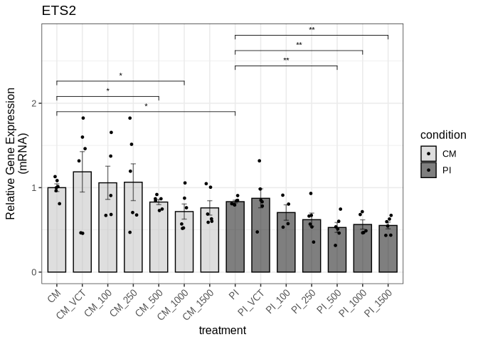

We export the figure to a PDF file in the Figure3 directory:

``` r
ggsave("output/Figure3/fig3a_ets2_qpcr.pdf", fig3a, 
       width = 6, height = 6, dpi = 300, useDingbats=FALSE)
```

#### Figure 3b (ETS2 protein expression levels)

We do the same using the new ETS2 protein data:

``` r
fig3_ets2_protein_data_new <- read_xlsx("input/Figure3_data.xlsx", sheet = "ETS2_protein_new")
```

``` r
fig3_ets2_protein_result_new <- compare_protein_groups(
  fig3_ets2_protein_data_new,
  group_col = "treatment",
  gene_col = "ets2",
  actin_col = "actin",
  control_group = "CM",
  wilcox_pairs = list(c("CM", "CM_500"), c("CM", "CM_1000"), c("CM", "CM_1500"),
                      c("PI", "PI_250"), c("PI", "PI_500"), 
                      c("PI", "PI_1000"))
)
```

``` r
fig3_ets2_protein_result_new$all_wilcox_table
```

<div id="tztohzmxsf" style="padding-left:0px;padding-right:0px;padding-top:10px;padding-bottom:10px;overflow-x:auto;overflow-y:auto;width:auto;height:auto;">
<style>#tztohzmxsf table {
  font-family: system-ui, 'Segoe UI', Roboto, Helvetica, Arial, sans-serif, 'Apple Color Emoji', 'Segoe UI Emoji', 'Segoe UI Symbol', 'Noto Color Emoji';
  -webkit-font-smoothing: antialiased;
  -moz-osx-font-smoothing: grayscale;
}

#tztohzmxsf thead, #tztohzmxsf tbody, #tztohzmxsf tfoot, #tztohzmxsf tr, #tztohzmxsf td, #tztohzmxsf th {
  border-style: none;
}

#tztohzmxsf p {
  margin: 0;
  padding: 0;
}

#tztohzmxsf .gt_table {
  display: table;
  border-collapse: collapse;
  line-height: normal;
  margin-left: auto;
  margin-right: auto;
  color: #333333;
  font-size: 16px;
  font-weight: normal;
  font-style: normal;
  background-color: #FFFFFF;
  width: auto;
  border-top-style: solid;
  border-top-width: 2px;
  border-top-color: #A8A8A8;
  border-right-style: none;
  border-right-width: 2px;
  border-right-color: #D3D3D3;
  border-bottom-style: solid;
  border-bottom-width: 2px;
  border-bottom-color: #A8A8A8;
  border-left-style: none;
  border-left-width: 2px;
  border-left-color: #D3D3D3;
}

#tztohzmxsf .gt_caption {
  padding-top: 4px;
  padding-bottom: 4px;
}

#tztohzmxsf .gt_title {
  color: #333333;
  font-size: 125%;
  font-weight: initial;
  padding-top: 4px;
  padding-bottom: 4px;
  padding-left: 5px;
  padding-right: 5px;
  border-bottom-color: #FFFFFF;
  border-bottom-width: 0;
}

#tztohzmxsf .gt_subtitle {
  color: #333333;
  font-size: 85%;
  font-weight: initial;
  padding-top: 3px;
  padding-bottom: 5px;
  padding-left: 5px;
  padding-right: 5px;
  border-top-color: #FFFFFF;
  border-top-width: 0;
}

#tztohzmxsf .gt_heading {
  background-color: #FFFFFF;
  text-align: center;
  border-bottom-color: #FFFFFF;
  border-left-style: none;
  border-left-width: 1px;
  border-left-color: #D3D3D3;
  border-right-style: none;
  border-right-width: 1px;
  border-right-color: #D3D3D3;
}

#tztohzmxsf .gt_bottom_border {
  border-bottom-style: solid;
  border-bottom-width: 2px;
  border-bottom-color: #D3D3D3;
}

#tztohzmxsf .gt_col_headings {
  border-top-style: solid;
  border-top-width: 2px;
  border-top-color: #D3D3D3;
  border-bottom-style: solid;
  border-bottom-width: 2px;
  border-bottom-color: #D3D3D3;
  border-left-style: none;
  border-left-width: 1px;
  border-left-color: #D3D3D3;
  border-right-style: none;
  border-right-width: 1px;
  border-right-color: #D3D3D3;
}

#tztohzmxsf .gt_col_heading {
  color: #333333;
  background-color: #FFFFFF;
  font-size: 100%;
  font-weight: normal;
  text-transform: inherit;
  border-left-style: none;
  border-left-width: 1px;
  border-left-color: #D3D3D3;
  border-right-style: none;
  border-right-width: 1px;
  border-right-color: #D3D3D3;
  vertical-align: bottom;
  padding-top: 5px;
  padding-bottom: 6px;
  padding-left: 5px;
  padding-right: 5px;
  overflow-x: hidden;
}

#tztohzmxsf .gt_column_spanner_outer {
  color: #333333;
  background-color: #FFFFFF;
  font-size: 100%;
  font-weight: normal;
  text-transform: inherit;
  padding-top: 0;
  padding-bottom: 0;
  padding-left: 4px;
  padding-right: 4px;
}

#tztohzmxsf .gt_column_spanner_outer:first-child {
  padding-left: 0;
}

#tztohzmxsf .gt_column_spanner_outer:last-child {
  padding-right: 0;
}

#tztohzmxsf .gt_column_spanner {
  border-bottom-style: solid;
  border-bottom-width: 2px;
  border-bottom-color: #D3D3D3;
  vertical-align: bottom;
  padding-top: 5px;
  padding-bottom: 5px;
  overflow-x: hidden;
  display: inline-block;
  width: 100%;
}

#tztohzmxsf .gt_spanner_row {
  border-bottom-style: hidden;
}

#tztohzmxsf .gt_group_heading {
  padding-top: 8px;
  padding-bottom: 8px;
  padding-left: 5px;
  padding-right: 5px;
  color: #333333;
  background-color: #FFFFFF;
  font-size: 100%;
  font-weight: initial;
  text-transform: inherit;
  border-top-style: solid;
  border-top-width: 2px;
  border-top-color: #D3D3D3;
  border-bottom-style: solid;
  border-bottom-width: 2px;
  border-bottom-color: #D3D3D3;
  border-left-style: none;
  border-left-width: 1px;
  border-left-color: #D3D3D3;
  border-right-style: none;
  border-right-width: 1px;
  border-right-color: #D3D3D3;
  vertical-align: middle;
  text-align: left;
}

#tztohzmxsf .gt_empty_group_heading {
  padding: 0.5px;
  color: #333333;
  background-color: #FFFFFF;
  font-size: 100%;
  font-weight: initial;
  border-top-style: solid;
  border-top-width: 2px;
  border-top-color: #D3D3D3;
  border-bottom-style: solid;
  border-bottom-width: 2px;
  border-bottom-color: #D3D3D3;
  vertical-align: middle;
}

#tztohzmxsf .gt_from_md > :first-child {
  margin-top: 0;
}

#tztohzmxsf .gt_from_md > :last-child {
  margin-bottom: 0;
}

#tztohzmxsf .gt_row {
  padding-top: 8px;
  padding-bottom: 8px;
  padding-left: 5px;
  padding-right: 5px;
  margin: 10px;
  border-top-style: solid;
  border-top-width: 1px;
  border-top-color: #D3D3D3;
  border-left-style: none;
  border-left-width: 1px;
  border-left-color: #D3D3D3;
  border-right-style: none;
  border-right-width: 1px;
  border-right-color: #D3D3D3;
  vertical-align: middle;
  overflow-x: hidden;
}

#tztohzmxsf .gt_stub {
  color: #333333;
  background-color: #FFFFFF;
  font-size: 100%;
  font-weight: initial;
  text-transform: inherit;
  border-right-style: solid;
  border-right-width: 2px;
  border-right-color: #D3D3D3;
  padding-left: 5px;
  padding-right: 5px;
}

#tztohzmxsf .gt_stub_row_group {
  color: #333333;
  background-color: #FFFFFF;
  font-size: 100%;
  font-weight: initial;
  text-transform: inherit;
  border-right-style: solid;
  border-right-width: 2px;
  border-right-color: #D3D3D3;
  padding-left: 5px;
  padding-right: 5px;
  vertical-align: top;
}

#tztohzmxsf .gt_row_group_first td {
  border-top-width: 2px;
}

#tztohzmxsf .gt_row_group_first th {
  border-top-width: 2px;
}

#tztohzmxsf .gt_summary_row {
  color: #333333;
  background-color: #FFFFFF;
  text-transform: inherit;
  padding-top: 8px;
  padding-bottom: 8px;
  padding-left: 5px;
  padding-right: 5px;
}

#tztohzmxsf .gt_first_summary_row {
  border-top-style: solid;
  border-top-color: #D3D3D3;
}

#tztohzmxsf .gt_first_summary_row.thick {
  border-top-width: 2px;
}

#tztohzmxsf .gt_last_summary_row {
  padding-top: 8px;
  padding-bottom: 8px;
  padding-left: 5px;
  padding-right: 5px;
  border-bottom-style: solid;
  border-bottom-width: 2px;
  border-bottom-color: #D3D3D3;
}

#tztohzmxsf .gt_grand_summary_row {
  color: #333333;
  background-color: #FFFFFF;
  text-transform: inherit;
  padding-top: 8px;
  padding-bottom: 8px;
  padding-left: 5px;
  padding-right: 5px;
}

#tztohzmxsf .gt_first_grand_summary_row {
  padding-top: 8px;
  padding-bottom: 8px;
  padding-left: 5px;
  padding-right: 5px;
  border-top-style: double;
  border-top-width: 6px;
  border-top-color: #D3D3D3;
}

#tztohzmxsf .gt_last_grand_summary_row_top {
  padding-top: 8px;
  padding-bottom: 8px;
  padding-left: 5px;
  padding-right: 5px;
  border-bottom-style: double;
  border-bottom-width: 6px;
  border-bottom-color: #D3D3D3;
}

#tztohzmxsf .gt_striped {
  background-color: rgba(128, 128, 128, 0.05);
}

#tztohzmxsf .gt_table_body {
  border-top-style: solid;
  border-top-width: 2px;
  border-top-color: #D3D3D3;
  border-bottom-style: solid;
  border-bottom-width: 2px;
  border-bottom-color: #D3D3D3;
}

#tztohzmxsf .gt_footnotes {
  color: #333333;
  background-color: #FFFFFF;
  border-bottom-style: none;
  border-bottom-width: 2px;
  border-bottom-color: #D3D3D3;
  border-left-style: none;
  border-left-width: 2px;
  border-left-color: #D3D3D3;
  border-right-style: none;
  border-right-width: 2px;
  border-right-color: #D3D3D3;
}

#tztohzmxsf .gt_footnote {
  margin: 0px;
  font-size: 90%;
  padding-top: 4px;
  padding-bottom: 4px;
  padding-left: 5px;
  padding-right: 5px;
}

#tztohzmxsf .gt_sourcenotes {
  color: #333333;
  background-color: #FFFFFF;
  border-bottom-style: none;
  border-bottom-width: 2px;
  border-bottom-color: #D3D3D3;
  border-left-style: none;
  border-left-width: 2px;
  border-left-color: #D3D3D3;
  border-right-style: none;
  border-right-width: 2px;
  border-right-color: #D3D3D3;
}

#tztohzmxsf .gt_sourcenote {
  font-size: 90%;
  padding-top: 4px;
  padding-bottom: 4px;
  padding-left: 5px;
  padding-right: 5px;
}

#tztohzmxsf .gt_left {
  text-align: left;
}

#tztohzmxsf .gt_center {
  text-align: center;
}

#tztohzmxsf .gt_right {
  text-align: right;
  font-variant-numeric: tabular-nums;
}

#tztohzmxsf .gt_font_normal {
  font-weight: normal;
}

#tztohzmxsf .gt_font_bold {
  font-weight: bold;
}

#tztohzmxsf .gt_font_italic {
  font-style: italic;
}

#tztohzmxsf .gt_super {
  font-size: 65%;
}

#tztohzmxsf .gt_footnote_marks {
  font-size: 75%;
  vertical-align: 0.4em;
  position: initial;
}

#tztohzmxsf .gt_asterisk {
  font-size: 100%;
  vertical-align: 0;
}

#tztohzmxsf .gt_indent_1 {
  text-indent: 5px;
}

#tztohzmxsf .gt_indent_2 {
  text-indent: 10px;
}

#tztohzmxsf .gt_indent_3 {
  text-indent: 15px;
}

#tztohzmxsf .gt_indent_4 {
  text-indent: 20px;
}

#tztohzmxsf .gt_indent_5 {
  text-indent: 25px;
}
</style>
<table class="gt_table" data-quarto-disable-processing="false" data-quarto-bootstrap="false">
  <thead>
    <tr class="gt_col_headings">
      <th class="gt_col_heading gt_columns_bottom_border gt_left" rowspan="1" colspan="1" scope="col" id="Comparison">Comparison</th>
      <th class="gt_col_heading gt_columns_bottom_border gt_right" rowspan="1" colspan="1" scope="col" id="Statistic">Statistic</th>
      <th class="gt_col_heading gt_columns_bottom_border gt_right" rowspan="1" colspan="1" scope="col" id="P_value">P_value</th>
      <th class="gt_col_heading gt_columns_bottom_border gt_left" rowspan="1" colspan="1" scope="col" id="Significant">Significant</th>
    </tr>
  </thead>
  <tbody class="gt_table_body">
    <tr><td headers="Comparison" class="gt_row gt_left">CM vs CM_VCT</td>
<td headers="Statistic" class="gt_row gt_right">23</td>
<td headers="P_value" class="gt_row gt_right">0.4848</td>
<td headers="Significant" class="gt_row gt_left">No</td></tr>
    <tr><td headers="Comparison" class="gt_row gt_left">CM vs CM_100</td>
<td headers="Statistic" class="gt_row gt_right">28</td>
<td headers="P_value" class="gt_row gt_right">0.1320</td>
<td headers="Significant" class="gt_row gt_left">No</td></tr>
    <tr><td headers="Comparison" class="gt_row gt_left" style="background-color: rgba(204,230,255,0.8); color: #000000; font-weight: bold;">CM vs CM_250</td>
<td headers="Statistic" class="gt_row gt_right" style="background-color: rgba(204,230,255,0.8); color: #000000; font-weight: bold;">32</td>
<td headers="P_value" class="gt_row gt_right" style="background-color: rgba(204,230,255,0.8); color: #000000; font-weight: bold;">0.0260</td>
<td headers="Significant" class="gt_row gt_left" style="background-color: rgba(204,230,255,0.8); color: #000000; font-weight: bold;">Yes</td></tr>
    <tr><td headers="Comparison" class="gt_row gt_left" style="background-color: rgba(204,230,255,0.8); color: #000000; font-weight: bold;">CM vs CM_500</td>
<td headers="Statistic" class="gt_row gt_right" style="background-color: rgba(204,230,255,0.8); color: #000000; font-weight: bold;">32</td>
<td headers="P_value" class="gt_row gt_right" style="background-color: rgba(204,230,255,0.8); color: #000000; font-weight: bold;">0.0260</td>
<td headers="Significant" class="gt_row gt_left" style="background-color: rgba(204,230,255,0.8); color: #000000; font-weight: bold;">Yes</td></tr>
    <tr><td headers="Comparison" class="gt_row gt_left" style="background-color: rgba(204,230,255,0.8); color: #000000; font-weight: bold;">CM vs CM_1000</td>
<td headers="Statistic" class="gt_row gt_right" style="background-color: rgba(204,230,255,0.8); color: #000000; font-weight: bold;">34</td>
<td headers="P_value" class="gt_row gt_right" style="background-color: rgba(204,230,255,0.8); color: #000000; font-weight: bold;">0.0087</td>
<td headers="Significant" class="gt_row gt_left" style="background-color: rgba(204,230,255,0.8); color: #000000; font-weight: bold;">Yes</td></tr>
    <tr><td headers="Comparison" class="gt_row gt_left" style="background-color: rgba(204,230,255,0.8); color: #000000; font-weight: bold;">CM vs CM_1500</td>
<td headers="Statistic" class="gt_row gt_right" style="background-color: rgba(204,230,255,0.8); color: #000000; font-weight: bold;">36</td>
<td headers="P_value" class="gt_row gt_right" style="background-color: rgba(204,230,255,0.8); color: #000000; font-weight: bold;">0.0022</td>
<td headers="Significant" class="gt_row gt_left" style="background-color: rgba(204,230,255,0.8); color: #000000; font-weight: bold;">Yes</td></tr>
    <tr><td headers="Comparison" class="gt_row gt_left">CM vs PI</td>
<td headers="Statistic" class="gt_row gt_right">28</td>
<td headers="P_value" class="gt_row gt_right">0.1320</td>
<td headers="Significant" class="gt_row gt_left">No</td></tr>
    <tr><td headers="Comparison" class="gt_row gt_left">CM vs PI_VCT</td>
<td headers="Statistic" class="gt_row gt_right">28</td>
<td headers="P_value" class="gt_row gt_right">0.1320</td>
<td headers="Significant" class="gt_row gt_left">No</td></tr>
    <tr><td headers="Comparison" class="gt_row gt_left" style="background-color: rgba(204,230,255,0.8); color: #000000; font-weight: bold;">CM vs PI_100</td>
<td headers="Statistic" class="gt_row gt_right" style="background-color: rgba(204,230,255,0.8); color: #000000; font-weight: bold;">36</td>
<td headers="P_value" class="gt_row gt_right" style="background-color: rgba(204,230,255,0.8); color: #000000; font-weight: bold;">0.0022</td>
<td headers="Significant" class="gt_row gt_left" style="background-color: rgba(204,230,255,0.8); color: #000000; font-weight: bold;">Yes</td></tr>
    <tr><td headers="Comparison" class="gt_row gt_left" style="background-color: rgba(204,230,255,0.8); color: #000000; font-weight: bold;">CM vs PI_250</td>
<td headers="Statistic" class="gt_row gt_right" style="background-color: rgba(204,230,255,0.8); color: #000000; font-weight: bold;">36</td>
<td headers="P_value" class="gt_row gt_right" style="background-color: rgba(204,230,255,0.8); color: #000000; font-weight: bold;">0.0022</td>
<td headers="Significant" class="gt_row gt_left" style="background-color: rgba(204,230,255,0.8); color: #000000; font-weight: bold;">Yes</td></tr>
    <tr><td headers="Comparison" class="gt_row gt_left" style="background-color: rgba(204,230,255,0.8); color: #000000; font-weight: bold;">CM vs PI_500</td>
<td headers="Statistic" class="gt_row gt_right" style="background-color: rgba(204,230,255,0.8); color: #000000; font-weight: bold;">36</td>
<td headers="P_value" class="gt_row gt_right" style="background-color: rgba(204,230,255,0.8); color: #000000; font-weight: bold;">0.0022</td>
<td headers="Significant" class="gt_row gt_left" style="background-color: rgba(204,230,255,0.8); color: #000000; font-weight: bold;">Yes</td></tr>
    <tr><td headers="Comparison" class="gt_row gt_left" style="background-color: rgba(204,230,255,0.8); color: #000000; font-weight: bold;">CM vs PI_1000</td>
<td headers="Statistic" class="gt_row gt_right" style="background-color: rgba(204,230,255,0.8); color: #000000; font-weight: bold;">36</td>
<td headers="P_value" class="gt_row gt_right" style="background-color: rgba(204,230,255,0.8); color: #000000; font-weight: bold;">0.0022</td>
<td headers="Significant" class="gt_row gt_left" style="background-color: rgba(204,230,255,0.8); color: #000000; font-weight: bold;">Yes</td></tr>
    <tr><td headers="Comparison" class="gt_row gt_left" style="background-color: rgba(204,230,255,0.8); color: #000000; font-weight: bold;">CM vs PI_1500</td>
<td headers="Statistic" class="gt_row gt_right" style="background-color: rgba(204,230,255,0.8); color: #000000; font-weight: bold;">36</td>
<td headers="P_value" class="gt_row gt_right" style="background-color: rgba(204,230,255,0.8); color: #000000; font-weight: bold;">0.0022</td>
<td headers="Significant" class="gt_row gt_left" style="background-color: rgba(204,230,255,0.8); color: #000000; font-weight: bold;">Yes</td></tr>
    <tr><td headers="Comparison" class="gt_row gt_left">CM_VCT vs CM_100</td>
<td headers="Statistic" class="gt_row gt_right">27</td>
<td headers="P_value" class="gt_row gt_right">0.1797</td>
<td headers="Significant" class="gt_row gt_left">No</td></tr>
    <tr><td headers="Comparison" class="gt_row gt_left" style="background-color: rgba(204,230,255,0.8); color: #000000; font-weight: bold;">CM_VCT vs CM_250</td>
<td headers="Statistic" class="gt_row gt_right" style="background-color: rgba(204,230,255,0.8); color: #000000; font-weight: bold;">32</td>
<td headers="P_value" class="gt_row gt_right" style="background-color: rgba(204,230,255,0.8); color: #000000; font-weight: bold;">0.0260</td>
<td headers="Significant" class="gt_row gt_left" style="background-color: rgba(204,230,255,0.8); color: #000000; font-weight: bold;">Yes</td></tr>
    <tr><td headers="Comparison" class="gt_row gt_left" style="background-color: rgba(204,230,255,0.8); color: #000000; font-weight: bold;">CM_VCT vs CM_500</td>
<td headers="Statistic" class="gt_row gt_right" style="background-color: rgba(204,230,255,0.8); color: #000000; font-weight: bold;">32</td>
<td headers="P_value" class="gt_row gt_right" style="background-color: rgba(204,230,255,0.8); color: #000000; font-weight: bold;">0.0260</td>
<td headers="Significant" class="gt_row gt_left" style="background-color: rgba(204,230,255,0.8); color: #000000; font-weight: bold;">Yes</td></tr>
    <tr><td headers="Comparison" class="gt_row gt_left" style="background-color: rgba(204,230,255,0.8); color: #000000; font-weight: bold;">CM_VCT vs CM_1000</td>
<td headers="Statistic" class="gt_row gt_right" style="background-color: rgba(204,230,255,0.8); color: #000000; font-weight: bold;">32</td>
<td headers="P_value" class="gt_row gt_right" style="background-color: rgba(204,230,255,0.8); color: #000000; font-weight: bold;">0.0260</td>
<td headers="Significant" class="gt_row gt_left" style="background-color: rgba(204,230,255,0.8); color: #000000; font-weight: bold;">Yes</td></tr>
    <tr><td headers="Comparison" class="gt_row gt_left" style="background-color: rgba(204,230,255,0.8); color: #000000; font-weight: bold;">CM_VCT vs CM_1500</td>
<td headers="Statistic" class="gt_row gt_right" style="background-color: rgba(204,230,255,0.8); color: #000000; font-weight: bold;">35</td>
<td headers="P_value" class="gt_row gt_right" style="background-color: rgba(204,230,255,0.8); color: #000000; font-weight: bold;">0.0043</td>
<td headers="Significant" class="gt_row gt_left" style="background-color: rgba(204,230,255,0.8); color: #000000; font-weight: bold;">Yes</td></tr>
    <tr><td headers="Comparison" class="gt_row gt_left">CM_VCT vs PI</td>
<td headers="Statistic" class="gt_row gt_right">28</td>
<td headers="P_value" class="gt_row gt_right">0.1320</td>
<td headers="Significant" class="gt_row gt_left">No</td></tr>
    <tr><td headers="Comparison" class="gt_row gt_left">CM_VCT vs PI_VCT</td>
<td headers="Statistic" class="gt_row gt_right">28</td>
<td headers="P_value" class="gt_row gt_right">0.1320</td>
<td headers="Significant" class="gt_row gt_left">No</td></tr>
    <tr><td headers="Comparison" class="gt_row gt_left" style="background-color: rgba(204,230,255,0.8); color: #000000; font-weight: bold;">CM_VCT vs PI_100</td>
<td headers="Statistic" class="gt_row gt_right" style="background-color: rgba(204,230,255,0.8); color: #000000; font-weight: bold;">36</td>
<td headers="P_value" class="gt_row gt_right" style="background-color: rgba(204,230,255,0.8); color: #000000; font-weight: bold;">0.0022</td>
<td headers="Significant" class="gt_row gt_left" style="background-color: rgba(204,230,255,0.8); color: #000000; font-weight: bold;">Yes</td></tr>
    <tr><td headers="Comparison" class="gt_row gt_left" style="background-color: rgba(204,230,255,0.8); color: #000000; font-weight: bold;">CM_VCT vs PI_250</td>
<td headers="Statistic" class="gt_row gt_right" style="background-color: rgba(204,230,255,0.8); color: #000000; font-weight: bold;">36</td>
<td headers="P_value" class="gt_row gt_right" style="background-color: rgba(204,230,255,0.8); color: #000000; font-weight: bold;">0.0022</td>
<td headers="Significant" class="gt_row gt_left" style="background-color: rgba(204,230,255,0.8); color: #000000; font-weight: bold;">Yes</td></tr>
    <tr><td headers="Comparison" class="gt_row gt_left" style="background-color: rgba(204,230,255,0.8); color: #000000; font-weight: bold;">CM_VCT vs PI_500</td>
<td headers="Statistic" class="gt_row gt_right" style="background-color: rgba(204,230,255,0.8); color: #000000; font-weight: bold;">36</td>
<td headers="P_value" class="gt_row gt_right" style="background-color: rgba(204,230,255,0.8); color: #000000; font-weight: bold;">0.0022</td>
<td headers="Significant" class="gt_row gt_left" style="background-color: rgba(204,230,255,0.8); color: #000000; font-weight: bold;">Yes</td></tr>
    <tr><td headers="Comparison" class="gt_row gt_left" style="background-color: rgba(204,230,255,0.8); color: #000000; font-weight: bold;">CM_VCT vs PI_1000</td>
<td headers="Statistic" class="gt_row gt_right" style="background-color: rgba(204,230,255,0.8); color: #000000; font-weight: bold;">36</td>
<td headers="P_value" class="gt_row gt_right" style="background-color: rgba(204,230,255,0.8); color: #000000; font-weight: bold;">0.0022</td>
<td headers="Significant" class="gt_row gt_left" style="background-color: rgba(204,230,255,0.8); color: #000000; font-weight: bold;">Yes</td></tr>
    <tr><td headers="Comparison" class="gt_row gt_left" style="background-color: rgba(204,230,255,0.8); color: #000000; font-weight: bold;">CM_VCT vs PI_1500</td>
<td headers="Statistic" class="gt_row gt_right" style="background-color: rgba(204,230,255,0.8); color: #000000; font-weight: bold;">36</td>
<td headers="P_value" class="gt_row gt_right" style="background-color: rgba(204,230,255,0.8); color: #000000; font-weight: bold;">0.0022</td>
<td headers="Significant" class="gt_row gt_left" style="background-color: rgba(204,230,255,0.8); color: #000000; font-weight: bold;">Yes</td></tr>
    <tr><td headers="Comparison" class="gt_row gt_left">CM_100 vs CM_250</td>
<td headers="Statistic" class="gt_row gt_right">28</td>
<td headers="P_value" class="gt_row gt_right">0.1320</td>
<td headers="Significant" class="gt_row gt_left">No</td></tr>
    <tr><td headers="Comparison" class="gt_row gt_left">CM_100 vs CM_500</td>
<td headers="Statistic" class="gt_row gt_right">28</td>
<td headers="P_value" class="gt_row gt_right">0.1320</td>
<td headers="Significant" class="gt_row gt_left">No</td></tr>
    <tr><td headers="Comparison" class="gt_row gt_left" style="background-color: rgba(204,230,255,0.8); color: #000000; font-weight: bold;">CM_100 vs CM_1000</td>
<td headers="Statistic" class="gt_row gt_right" style="background-color: rgba(204,230,255,0.8); color: #000000; font-weight: bold;">32</td>
<td headers="P_value" class="gt_row gt_right" style="background-color: rgba(204,230,255,0.8); color: #000000; font-weight: bold;">0.0260</td>
<td headers="Significant" class="gt_row gt_left" style="background-color: rgba(204,230,255,0.8); color: #000000; font-weight: bold;">Yes</td></tr>
    <tr><td headers="Comparison" class="gt_row gt_left">CM_100 vs CM_1500</td>
<td headers="Statistic" class="gt_row gt_right">28</td>
<td headers="P_value" class="gt_row gt_right">0.1320</td>
<td headers="Significant" class="gt_row gt_left">No</td></tr>
    <tr><td headers="Comparison" class="gt_row gt_left">CM_100 vs PI</td>
<td headers="Statistic" class="gt_row gt_right">22</td>
<td headers="P_value" class="gt_row gt_right">0.5887</td>
<td headers="Significant" class="gt_row gt_left">No</td></tr>
    <tr><td headers="Comparison" class="gt_row gt_left">CM_100 vs PI_VCT</td>
<td headers="Statistic" class="gt_row gt_right">25</td>
<td headers="P_value" class="gt_row gt_right">0.3095</td>
<td headers="Significant" class="gt_row gt_left">No</td></tr>
    <tr><td headers="Comparison" class="gt_row gt_left" style="background-color: rgba(204,230,255,0.8); color: #000000; font-weight: bold;">CM_100 vs PI_100</td>
<td headers="Statistic" class="gt_row gt_right" style="background-color: rgba(204,230,255,0.8); color: #000000; font-weight: bold;">36</td>
<td headers="P_value" class="gt_row gt_right" style="background-color: rgba(204,230,255,0.8); color: #000000; font-weight: bold;">0.0022</td>
<td headers="Significant" class="gt_row gt_left" style="background-color: rgba(204,230,255,0.8); color: #000000; font-weight: bold;">Yes</td></tr>
    <tr><td headers="Comparison" class="gt_row gt_left" style="background-color: rgba(204,230,255,0.8); color: #000000; font-weight: bold;">CM_100 vs PI_250</td>
<td headers="Statistic" class="gt_row gt_right" style="background-color: rgba(204,230,255,0.8); color: #000000; font-weight: bold;">36</td>
<td headers="P_value" class="gt_row gt_right" style="background-color: rgba(204,230,255,0.8); color: #000000; font-weight: bold;">0.0022</td>
<td headers="Significant" class="gt_row gt_left" style="background-color: rgba(204,230,255,0.8); color: #000000; font-weight: bold;">Yes</td></tr>
    <tr><td headers="Comparison" class="gt_row gt_left" style="background-color: rgba(204,230,255,0.8); color: #000000; font-weight: bold;">CM_100 vs PI_500</td>
<td headers="Statistic" class="gt_row gt_right" style="background-color: rgba(204,230,255,0.8); color: #000000; font-weight: bold;">36</td>
<td headers="P_value" class="gt_row gt_right" style="background-color: rgba(204,230,255,0.8); color: #000000; font-weight: bold;">0.0022</td>
<td headers="Significant" class="gt_row gt_left" style="background-color: rgba(204,230,255,0.8); color: #000000; font-weight: bold;">Yes</td></tr>
    <tr><td headers="Comparison" class="gt_row gt_left" style="background-color: rgba(204,230,255,0.8); color: #000000; font-weight: bold;">CM_100 vs PI_1000</td>
<td headers="Statistic" class="gt_row gt_right" style="background-color: rgba(204,230,255,0.8); color: #000000; font-weight: bold;">36</td>
<td headers="P_value" class="gt_row gt_right" style="background-color: rgba(204,230,255,0.8); color: #000000; font-weight: bold;">0.0022</td>
<td headers="Significant" class="gt_row gt_left" style="background-color: rgba(204,230,255,0.8); color: #000000; font-weight: bold;">Yes</td></tr>
    <tr><td headers="Comparison" class="gt_row gt_left" style="background-color: rgba(204,230,255,0.8); color: #000000; font-weight: bold;">CM_100 vs PI_1500</td>
<td headers="Statistic" class="gt_row gt_right" style="background-color: rgba(204,230,255,0.8); color: #000000; font-weight: bold;">36</td>
<td headers="P_value" class="gt_row gt_right" style="background-color: rgba(204,230,255,0.8); color: #000000; font-weight: bold;">0.0022</td>
<td headers="Significant" class="gt_row gt_left" style="background-color: rgba(204,230,255,0.8); color: #000000; font-weight: bold;">Yes</td></tr>
    <tr><td headers="Comparison" class="gt_row gt_left">CM_250 vs CM_500</td>
<td headers="Statistic" class="gt_row gt_right">8</td>
<td headers="P_value" class="gt_row gt_right">0.1320</td>
<td headers="Significant" class="gt_row gt_left">No</td></tr>
    <tr><td headers="Comparison" class="gt_row gt_left">CM_250 vs CM_1000</td>
<td headers="Statistic" class="gt_row gt_right">12</td>
<td headers="P_value" class="gt_row gt_right">0.3939</td>
<td headers="Significant" class="gt_row gt_left">No</td></tr>
    <tr><td headers="Comparison" class="gt_row gt_left">CM_250 vs CM_1500</td>
<td headers="Statistic" class="gt_row gt_right">20</td>
<td headers="P_value" class="gt_row gt_right">0.8182</td>
<td headers="Significant" class="gt_row gt_left">No</td></tr>
    <tr><td headers="Comparison" class="gt_row gt_left">CM_250 vs PI</td>
<td headers="Statistic" class="gt_row gt_right">20</td>
<td headers="P_value" class="gt_row gt_right">0.8182</td>
<td headers="Significant" class="gt_row gt_left">No</td></tr>
    <tr><td headers="Comparison" class="gt_row gt_left">CM_250 vs PI_VCT</td>
<td headers="Statistic" class="gt_row gt_right">18</td>
<td headers="P_value" class="gt_row gt_right">1.0000</td>
<td headers="Significant" class="gt_row gt_left">No</td></tr>
    <tr><td headers="Comparison" class="gt_row gt_left">CM_250 vs PI_100</td>
<td headers="Statistic" class="gt_row gt_right">20</td>
<td headers="P_value" class="gt_row gt_right">0.8182</td>
<td headers="Significant" class="gt_row gt_left">No</td></tr>
    <tr><td headers="Comparison" class="gt_row gt_left" style="background-color: rgba(204,230,255,0.8); color: #000000; font-weight: bold;">CM_250 vs PI_250</td>
<td headers="Statistic" class="gt_row gt_right" style="background-color: rgba(204,230,255,0.8); color: #000000; font-weight: bold;">36</td>
<td headers="P_value" class="gt_row gt_right" style="background-color: rgba(204,230,255,0.8); color: #000000; font-weight: bold;">0.0022</td>
<td headers="Significant" class="gt_row gt_left" style="background-color: rgba(204,230,255,0.8); color: #000000; font-weight: bold;">Yes</td></tr>
    <tr><td headers="Comparison" class="gt_row gt_left" style="background-color: rgba(204,230,255,0.8); color: #000000; font-weight: bold;">CM_250 vs PI_500</td>
<td headers="Statistic" class="gt_row gt_right" style="background-color: rgba(204,230,255,0.8); color: #000000; font-weight: bold;">36</td>
<td headers="P_value" class="gt_row gt_right" style="background-color: rgba(204,230,255,0.8); color: #000000; font-weight: bold;">0.0022</td>
<td headers="Significant" class="gt_row gt_left" style="background-color: rgba(204,230,255,0.8); color: #000000; font-weight: bold;">Yes</td></tr>
    <tr><td headers="Comparison" class="gt_row gt_left">CM_250 vs PI_1000</td>
<td headers="Statistic" class="gt_row gt_right">28</td>
<td headers="P_value" class="gt_row gt_right">0.1320</td>
<td headers="Significant" class="gt_row gt_left">No</td></tr>
    <tr><td headers="Comparison" class="gt_row gt_left">CM_250 vs PI_1500</td>
<td headers="Statistic" class="gt_row gt_right">20</td>
<td headers="P_value" class="gt_row gt_right">0.8182</td>
<td headers="Significant" class="gt_row gt_left">No</td></tr>
    <tr><td headers="Comparison" class="gt_row gt_left">CM_500 vs CM_1000</td>
<td headers="Statistic" class="gt_row gt_right">28</td>
<td headers="P_value" class="gt_row gt_right">0.1320</td>
<td headers="Significant" class="gt_row gt_left">No</td></tr>
    <tr><td headers="Comparison" class="gt_row gt_left">CM_500 vs CM_1500</td>
<td headers="Statistic" class="gt_row gt_right">20</td>
<td headers="P_value" class="gt_row gt_right">0.8182</td>
<td headers="Significant" class="gt_row gt_left">No</td></tr>
    <tr><td headers="Comparison" class="gt_row gt_left">CM_500 vs PI</td>
<td headers="Statistic" class="gt_row gt_right">20</td>
<td headers="P_value" class="gt_row gt_right">0.8182</td>
<td headers="Significant" class="gt_row gt_left">No</td></tr>
    <tr><td headers="Comparison" class="gt_row gt_left">CM_500 vs PI_VCT</td>
<td headers="Statistic" class="gt_row gt_right">20</td>
<td headers="P_value" class="gt_row gt_right">0.8182</td>
<td headers="Significant" class="gt_row gt_left">No</td></tr>
    <tr><td headers="Comparison" class="gt_row gt_left" style="background-color: rgba(204,230,255,0.8); color: #000000; font-weight: bold;">CM_500 vs PI_100</td>
<td headers="Statistic" class="gt_row gt_right" style="background-color: rgba(204,230,255,0.8); color: #000000; font-weight: bold;">36</td>
<td headers="P_value" class="gt_row gt_right" style="background-color: rgba(204,230,255,0.8); color: #000000; font-weight: bold;">0.0022</td>
<td headers="Significant" class="gt_row gt_left" style="background-color: rgba(204,230,255,0.8); color: #000000; font-weight: bold;">Yes</td></tr>
    <tr><td headers="Comparison" class="gt_row gt_left" style="background-color: rgba(204,230,255,0.8); color: #000000; font-weight: bold;">CM_500 vs PI_250</td>
<td headers="Statistic" class="gt_row gt_right" style="background-color: rgba(204,230,255,0.8); color: #000000; font-weight: bold;">36</td>
<td headers="P_value" class="gt_row gt_right" style="background-color: rgba(204,230,255,0.8); color: #000000; font-weight: bold;">0.0022</td>
<td headers="Significant" class="gt_row gt_left" style="background-color: rgba(204,230,255,0.8); color: #000000; font-weight: bold;">Yes</td></tr>
    <tr><td headers="Comparison" class="gt_row gt_left" style="background-color: rgba(204,230,255,0.8); color: #000000; font-weight: bold;">CM_500 vs PI_500</td>
<td headers="Statistic" class="gt_row gt_right" style="background-color: rgba(204,230,255,0.8); color: #000000; font-weight: bold;">36</td>
<td headers="P_value" class="gt_row gt_right" style="background-color: rgba(204,230,255,0.8); color: #000000; font-weight: bold;">0.0022</td>
<td headers="Significant" class="gt_row gt_left" style="background-color: rgba(204,230,255,0.8); color: #000000; font-weight: bold;">Yes</td></tr>
    <tr><td headers="Comparison" class="gt_row gt_left" style="background-color: rgba(204,230,255,0.8); color: #000000; font-weight: bold;">CM_500 vs PI_1000</td>
<td headers="Statistic" class="gt_row gt_right" style="background-color: rgba(204,230,255,0.8); color: #000000; font-weight: bold;">36</td>
<td headers="P_value" class="gt_row gt_right" style="background-color: rgba(204,230,255,0.8); color: #000000; font-weight: bold;">0.0022</td>
<td headers="Significant" class="gt_row gt_left" style="background-color: rgba(204,230,255,0.8); color: #000000; font-weight: bold;">Yes</td></tr>
    <tr><td headers="Comparison" class="gt_row gt_left" style="background-color: rgba(204,230,255,0.8); color: #000000; font-weight: bold;">CM_500 vs PI_1500</td>
<td headers="Statistic" class="gt_row gt_right" style="background-color: rgba(204,230,255,0.8); color: #000000; font-weight: bold;">36</td>
<td headers="P_value" class="gt_row gt_right" style="background-color: rgba(204,230,255,0.8); color: #000000; font-weight: bold;">0.0022</td>
<td headers="Significant" class="gt_row gt_left" style="background-color: rgba(204,230,255,0.8); color: #000000; font-weight: bold;">Yes</td></tr>
    <tr><td headers="Comparison" class="gt_row gt_left">CM_1000 vs CM_1500</td>
<td headers="Statistic" class="gt_row gt_right">20</td>
<td headers="P_value" class="gt_row gt_right">0.8182</td>
<td headers="Significant" class="gt_row gt_left">No</td></tr>
    <tr><td headers="Comparison" class="gt_row gt_left">CM_1000 vs PI</td>
<td headers="Statistic" class="gt_row gt_right">12</td>
<td headers="P_value" class="gt_row gt_right">0.3939</td>
<td headers="Significant" class="gt_row gt_left">No</td></tr>
    <tr><td headers="Comparison" class="gt_row gt_left">CM_1000 vs PI_VCT</td>
<td headers="Statistic" class="gt_row gt_right">12</td>
<td headers="P_value" class="gt_row gt_right">0.3939</td>
<td headers="Significant" class="gt_row gt_left">No</td></tr>
    <tr><td headers="Comparison" class="gt_row gt_left" style="background-color: rgba(204,230,255,0.8); color: #000000; font-weight: bold;">CM_1000 vs PI_100</td>
<td headers="Statistic" class="gt_row gt_right" style="background-color: rgba(204,230,255,0.8); color: #000000; font-weight: bold;">36</td>
<td headers="P_value" class="gt_row gt_right" style="background-color: rgba(204,230,255,0.8); color: #000000; font-weight: bold;">0.0022</td>
<td headers="Significant" class="gt_row gt_left" style="background-color: rgba(204,230,255,0.8); color: #000000; font-weight: bold;">Yes</td></tr>
    <tr><td headers="Comparison" class="gt_row gt_left" style="background-color: rgba(204,230,255,0.8); color: #000000; font-weight: bold;">CM_1000 vs PI_250</td>
<td headers="Statistic" class="gt_row gt_right" style="background-color: rgba(204,230,255,0.8); color: #000000; font-weight: bold;">36</td>
<td headers="P_value" class="gt_row gt_right" style="background-color: rgba(204,230,255,0.8); color: #000000; font-weight: bold;">0.0022</td>
<td headers="Significant" class="gt_row gt_left" style="background-color: rgba(204,230,255,0.8); color: #000000; font-weight: bold;">Yes</td></tr>
    <tr><td headers="Comparison" class="gt_row gt_left" style="background-color: rgba(204,230,255,0.8); color: #000000; font-weight: bold;">CM_1000 vs PI_500</td>
<td headers="Statistic" class="gt_row gt_right" style="background-color: rgba(204,230,255,0.8); color: #000000; font-weight: bold;">36</td>
<td headers="P_value" class="gt_row gt_right" style="background-color: rgba(204,230,255,0.8); color: #000000; font-weight: bold;">0.0022</td>
<td headers="Significant" class="gt_row gt_left" style="background-color: rgba(204,230,255,0.8); color: #000000; font-weight: bold;">Yes</td></tr>
    <tr><td headers="Comparison" class="gt_row gt_left" style="background-color: rgba(204,230,255,0.8); color: #000000; font-weight: bold;">CM_1000 vs PI_1000</td>
<td headers="Statistic" class="gt_row gt_right" style="background-color: rgba(204,230,255,0.8); color: #000000; font-weight: bold;">36</td>
<td headers="P_value" class="gt_row gt_right" style="background-color: rgba(204,230,255,0.8); color: #000000; font-weight: bold;">0.0022</td>
<td headers="Significant" class="gt_row gt_left" style="background-color: rgba(204,230,255,0.8); color: #000000; font-weight: bold;">Yes</td></tr>
    <tr><td headers="Comparison" class="gt_row gt_left">CM_1000 vs PI_1500</td>
<td headers="Statistic" class="gt_row gt_right">25</td>
<td headers="P_value" class="gt_row gt_right">0.3095</td>
<td headers="Significant" class="gt_row gt_left">No</td></tr>
    <tr><td headers="Comparison" class="gt_row gt_left">CM_1500 vs PI</td>
<td headers="Statistic" class="gt_row gt_right">8</td>
<td headers="P_value" class="gt_row gt_right">0.1320</td>
<td headers="Significant" class="gt_row gt_left">No</td></tr>
    <tr><td headers="Comparison" class="gt_row gt_left">CM_1500 vs PI_VCT</td>
<td headers="Statistic" class="gt_row gt_right">8</td>
<td headers="P_value" class="gt_row gt_right">0.1320</td>
<td headers="Significant" class="gt_row gt_left">No</td></tr>
    <tr><td headers="Comparison" class="gt_row gt_left">CM_1500 vs PI_100</td>
<td headers="Statistic" class="gt_row gt_right">24</td>
<td headers="P_value" class="gt_row gt_right">0.3939</td>
<td headers="Significant" class="gt_row gt_left">No</td></tr>
    <tr><td headers="Comparison" class="gt_row gt_left">CM_1500 vs PI_250</td>
<td headers="Statistic" class="gt_row gt_right">30</td>
<td headers="P_value" class="gt_row gt_right">0.0649</td>
<td headers="Significant" class="gt_row gt_left">No</td></tr>
    <tr><td headers="Comparison" class="gt_row gt_left">CM_1500 vs PI_500</td>
<td headers="Statistic" class="gt_row gt_right">24</td>
<td headers="P_value" class="gt_row gt_right">0.3939</td>
<td headers="Significant" class="gt_row gt_left">No</td></tr>
    <tr><td headers="Comparison" class="gt_row gt_left">CM_1500 vs PI_1000</td>
<td headers="Statistic" class="gt_row gt_right">28</td>
<td headers="P_value" class="gt_row gt_right">0.1320</td>
<td headers="Significant" class="gt_row gt_left">No</td></tr>
    <tr><td headers="Comparison" class="gt_row gt_left">CM_1500 vs PI_1500</td>
<td headers="Statistic" class="gt_row gt_right">24</td>
<td headers="P_value" class="gt_row gt_right">0.3939</td>
<td headers="Significant" class="gt_row gt_left">No</td></tr>
    <tr><td headers="Comparison" class="gt_row gt_left">PI vs PI_VCT</td>
<td headers="Statistic" class="gt_row gt_right">23</td>
<td headers="P_value" class="gt_row gt_right">0.4848</td>
<td headers="Significant" class="gt_row gt_left">No</td></tr>
    <tr><td headers="Comparison" class="gt_row gt_left">PI vs PI_100</td>
<td headers="Statistic" class="gt_row gt_right">28</td>
<td headers="P_value" class="gt_row gt_right">0.1320</td>
<td headers="Significant" class="gt_row gt_left">No</td></tr>
    <tr><td headers="Comparison" class="gt_row gt_left" style="background-color: rgba(204,230,255,0.8); color: #000000; font-weight: bold;">PI vs PI_250</td>
<td headers="Statistic" class="gt_row gt_right" style="background-color: rgba(204,230,255,0.8); color: #000000; font-weight: bold;">36</td>
<td headers="P_value" class="gt_row gt_right" style="background-color: rgba(204,230,255,0.8); color: #000000; font-weight: bold;">0.0022</td>
<td headers="Significant" class="gt_row gt_left" style="background-color: rgba(204,230,255,0.8); color: #000000; font-weight: bold;">Yes</td></tr>
    <tr><td headers="Comparison" class="gt_row gt_left" style="background-color: rgba(204,230,255,0.8); color: #000000; font-weight: bold;">PI vs PI_500</td>
<td headers="Statistic" class="gt_row gt_right" style="background-color: rgba(204,230,255,0.8); color: #000000; font-weight: bold;">36</td>
<td headers="P_value" class="gt_row gt_right" style="background-color: rgba(204,230,255,0.8); color: #000000; font-weight: bold;">0.0022</td>
<td headers="Significant" class="gt_row gt_left" style="background-color: rgba(204,230,255,0.8); color: #000000; font-weight: bold;">Yes</td></tr>
    <tr><td headers="Comparison" class="gt_row gt_left" style="background-color: rgba(204,230,255,0.8); color: #000000; font-weight: bold;">PI vs PI_1000</td>
<td headers="Statistic" class="gt_row gt_right" style="background-color: rgba(204,230,255,0.8); color: #000000; font-weight: bold;">32</td>
<td headers="P_value" class="gt_row gt_right" style="background-color: rgba(204,230,255,0.8); color: #000000; font-weight: bold;">0.0260</td>
<td headers="Significant" class="gt_row gt_left" style="background-color: rgba(204,230,255,0.8); color: #000000; font-weight: bold;">Yes</td></tr>
    <tr><td headers="Comparison" class="gt_row gt_left">PI vs PI_1500</td>
<td headers="Statistic" class="gt_row gt_right">28</td>
<td headers="P_value" class="gt_row gt_right">0.1320</td>
<td headers="Significant" class="gt_row gt_left">No</td></tr>
    <tr><td headers="Comparison" class="gt_row gt_left">PI_VCT vs PI_100</td>
<td headers="Statistic" class="gt_row gt_right">28</td>
<td headers="P_value" class="gt_row gt_right">0.1320</td>
<td headers="Significant" class="gt_row gt_left">No</td></tr>
    <tr><td headers="Comparison" class="gt_row gt_left" style="background-color: rgba(204,230,255,0.8); color: #000000; font-weight: bold;">PI_VCT vs PI_250</td>
<td headers="Statistic" class="gt_row gt_right" style="background-color: rgba(204,230,255,0.8); color: #000000; font-weight: bold;">36</td>
<td headers="P_value" class="gt_row gt_right" style="background-color: rgba(204,230,255,0.8); color: #000000; font-weight: bold;">0.0022</td>
<td headers="Significant" class="gt_row gt_left" style="background-color: rgba(204,230,255,0.8); color: #000000; font-weight: bold;">Yes</td></tr>
    <tr><td headers="Comparison" class="gt_row gt_left" style="background-color: rgba(204,230,255,0.8); color: #000000; font-weight: bold;">PI_VCT vs PI_500</td>
<td headers="Statistic" class="gt_row gt_right" style="background-color: rgba(204,230,255,0.8); color: #000000; font-weight: bold;">36</td>
<td headers="P_value" class="gt_row gt_right" style="background-color: rgba(204,230,255,0.8); color: #000000; font-weight: bold;">0.0022</td>
<td headers="Significant" class="gt_row gt_left" style="background-color: rgba(204,230,255,0.8); color: #000000; font-weight: bold;">Yes</td></tr>
    <tr><td headers="Comparison" class="gt_row gt_left" style="background-color: rgba(204,230,255,0.8); color: #000000; font-weight: bold;">PI_VCT vs PI_1000</td>
<td headers="Statistic" class="gt_row gt_right" style="background-color: rgba(204,230,255,0.8); color: #000000; font-weight: bold;">32</td>
<td headers="P_value" class="gt_row gt_right" style="background-color: rgba(204,230,255,0.8); color: #000000; font-weight: bold;">0.0260</td>
<td headers="Significant" class="gt_row gt_left" style="background-color: rgba(204,230,255,0.8); color: #000000; font-weight: bold;">Yes</td></tr>
    <tr><td headers="Comparison" class="gt_row gt_left">PI_VCT vs PI_1500</td>
<td headers="Statistic" class="gt_row gt_right">28</td>
<td headers="P_value" class="gt_row gt_right">0.1320</td>
<td headers="Significant" class="gt_row gt_left">No</td></tr>
    <tr><td headers="Comparison" class="gt_row gt_left" style="background-color: rgba(204,230,255,0.8); color: #000000; font-weight: bold;">PI_100 vs PI_250</td>
<td headers="Statistic" class="gt_row gt_right" style="background-color: rgba(204,230,255,0.8); color: #000000; font-weight: bold;">32</td>
<td headers="P_value" class="gt_row gt_right" style="background-color: rgba(204,230,255,0.8); color: #000000; font-weight: bold;">0.0260</td>
<td headers="Significant" class="gt_row gt_left" style="background-color: rgba(204,230,255,0.8); color: #000000; font-weight: bold;">Yes</td></tr>
    <tr><td headers="Comparison" class="gt_row gt_left">PI_100 vs PI_500</td>
<td headers="Statistic" class="gt_row gt_right">24</td>
<td headers="P_value" class="gt_row gt_right">0.3939</td>
<td headers="Significant" class="gt_row gt_left">No</td></tr>
    <tr><td headers="Comparison" class="gt_row gt_left">PI_100 vs PI_1000</td>
<td headers="Statistic" class="gt_row gt_right">28</td>
<td headers="P_value" class="gt_row gt_right">0.1320</td>
<td headers="Significant" class="gt_row gt_left">No</td></tr>
    <tr><td headers="Comparison" class="gt_row gt_left">PI_100 vs PI_1500</td>
<td headers="Statistic" class="gt_row gt_right">8</td>
<td headers="P_value" class="gt_row gt_right">0.1320</td>
<td headers="Significant" class="gt_row gt_left">No</td></tr>
    <tr><td headers="Comparison" class="gt_row gt_left">PI_250 vs PI_500</td>
<td headers="Statistic" class="gt_row gt_right">12</td>
<td headers="P_value" class="gt_row gt_right">0.3939</td>
<td headers="Significant" class="gt_row gt_left">No</td></tr>
    <tr><td headers="Comparison" class="gt_row gt_left">PI_250 vs PI_1000</td>
<td headers="Statistic" class="gt_row gt_right">12</td>
<td headers="P_value" class="gt_row gt_right">0.3939</td>
<td headers="Significant" class="gt_row gt_left">No</td></tr>
    <tr><td headers="Comparison" class="gt_row gt_left" style="background-color: rgba(204,230,255,0.8); color: #000000; font-weight: bold;">PI_250 vs PI_1500</td>
<td headers="Statistic" class="gt_row gt_right" style="background-color: rgba(204,230,255,0.8); color: #000000; font-weight: bold;">4</td>
<td headers="P_value" class="gt_row gt_right" style="background-color: rgba(204,230,255,0.8); color: #000000; font-weight: bold;">0.0260</td>
<td headers="Significant" class="gt_row gt_left" style="background-color: rgba(204,230,255,0.8); color: #000000; font-weight: bold;">Yes</td></tr>
    <tr><td headers="Comparison" class="gt_row gt_left">PI_500 vs PI_1000</td>
<td headers="Statistic" class="gt_row gt_right">24</td>
<td headers="P_value" class="gt_row gt_right">0.3939</td>
<td headers="Significant" class="gt_row gt_left">No</td></tr>
    <tr><td headers="Comparison" class="gt_row gt_left" style="background-color: rgba(204,230,255,0.8); color: #000000; font-weight: bold;">PI_500 vs PI_1500</td>
<td headers="Statistic" class="gt_row gt_right" style="background-color: rgba(204,230,255,0.8); color: #000000; font-weight: bold;">3</td>
<td headers="P_value" class="gt_row gt_right" style="background-color: rgba(204,230,255,0.8); color: #000000; font-weight: bold;">0.0152</td>
<td headers="Significant" class="gt_row gt_left" style="background-color: rgba(204,230,255,0.8); color: #000000; font-weight: bold;">Yes</td></tr>
    <tr><td headers="Comparison" class="gt_row gt_left" style="background-color: rgba(204,230,255,0.8); color: #000000; font-weight: bold;">PI_1000 vs PI_1500</td>
<td headers="Statistic" class="gt_row gt_right" style="background-color: rgba(204,230,255,0.8); color: #000000; font-weight: bold;">4</td>
<td headers="P_value" class="gt_row gt_right" style="background-color: rgba(204,230,255,0.8); color: #000000; font-weight: bold;">0.0260</td>
<td headers="Significant" class="gt_row gt_left" style="background-color: rgba(204,230,255,0.8); color: #000000; font-weight: bold;">Yes</td></tr>
  </tbody>
  
  
</table>
</div>

``` r
fig3b_new <- fig3_ets2_protein_result_new$p
```

``` r
fig3b_new
```


We export the figure to a PDF file in the Figure3 directory:

``` r
ggsave("output/Figure3/fig3b_ets2_protein.pdf", fig3b_new, 
       width = 6, height = 6, dpi = 300, useDingbats=FALSE)
```

#### Figure 3d (STAT3 protein expression levels)

We get the relative expression levels for STAT3 (protein):

``` r
fig3_stat3_protein_data <- read_xlsx("input/Figure3_data.xlsx", sheet = "STAT3_protein")
```

``` r
fig3_stat3_protein_result <- compare_protein_groups(
  fig3_stat3_protein_data,
  group_col = "treatment",
  gene_col = "stat3",
  actin_col = "actin",
  control_group = "CM",
  wilcox_pairs = list(c("CM", "PI"),
                      c("PI", "PI_250"), c("PI", "PI_500"), 
                      c("PI", "PI_1000"), c("PI", "PI_1500"))
)
```

``` r
fig3_stat3_protein_result$all_wilcox_table
```

<div id="ulyljyyquu" style="padding-left:0px;padding-right:0px;padding-top:10px;padding-bottom:10px;overflow-x:auto;overflow-y:auto;width:auto;height:auto;">
<style>#ulyljyyquu table {
  font-family: system-ui, 'Segoe UI', Roboto, Helvetica, Arial, sans-serif, 'Apple Color Emoji', 'Segoe UI Emoji', 'Segoe UI Symbol', 'Noto Color Emoji';
  -webkit-font-smoothing: antialiased;
  -moz-osx-font-smoothing: grayscale;
}

#ulyljyyquu thead, #ulyljyyquu tbody, #ulyljyyquu tfoot, #ulyljyyquu tr, #ulyljyyquu td, #ulyljyyquu th {
  border-style: none;
}

#ulyljyyquu p {
  margin: 0;
  padding: 0;
}

#ulyljyyquu .gt_table {
  display: table;
  border-collapse: collapse;
  line-height: normal;
  margin-left: auto;
  margin-right: auto;
  color: #333333;
  font-size: 16px;
  font-weight: normal;
  font-style: normal;
  background-color: #FFFFFF;
  width: auto;
  border-top-style: solid;
  border-top-width: 2px;
  border-top-color: #A8A8A8;
  border-right-style: none;
  border-right-width: 2px;
  border-right-color: #D3D3D3;
  border-bottom-style: solid;
  border-bottom-width: 2px;
  border-bottom-color: #A8A8A8;
  border-left-style: none;
  border-left-width: 2px;
  border-left-color: #D3D3D3;
}

#ulyljyyquu .gt_caption {
  padding-top: 4px;
  padding-bottom: 4px;
}

#ulyljyyquu .gt_title {
  color: #333333;
  font-size: 125%;
  font-weight: initial;
  padding-top: 4px;
  padding-bottom: 4px;
  padding-left: 5px;
  padding-right: 5px;
  border-bottom-color: #FFFFFF;
  border-bottom-width: 0;
}

#ulyljyyquu .gt_subtitle {
  color: #333333;
  font-size: 85%;
  font-weight: initial;
  padding-top: 3px;
  padding-bottom: 5px;
  padding-left: 5px;
  padding-right: 5px;
  border-top-color: #FFFFFF;
  border-top-width: 0;
}

#ulyljyyquu .gt_heading {
  background-color: #FFFFFF;
  text-align: center;
  border-bottom-color: #FFFFFF;
  border-left-style: none;
  border-left-width: 1px;
  border-left-color: #D3D3D3;
  border-right-style: none;
  border-right-width: 1px;
  border-right-color: #D3D3D3;
}

#ulyljyyquu .gt_bottom_border {
  border-bottom-style: solid;
  border-bottom-width: 2px;
  border-bottom-color: #D3D3D3;
}

#ulyljyyquu .gt_col_headings {
  border-top-style: solid;
  border-top-width: 2px;
  border-top-color: #D3D3D3;
  border-bottom-style: solid;
  border-bottom-width: 2px;
  border-bottom-color: #D3D3D3;
  border-left-style: none;
  border-left-width: 1px;
  border-left-color: #D3D3D3;
  border-right-style: none;
  border-right-width: 1px;
  border-right-color: #D3D3D3;
}

#ulyljyyquu .gt_col_heading {
  color: #333333;
  background-color: #FFFFFF;
  font-size: 100%;
  font-weight: normal;
  text-transform: inherit;
  border-left-style: none;
  border-left-width: 1px;
  border-left-color: #D3D3D3;
  border-right-style: none;
  border-right-width: 1px;
  border-right-color: #D3D3D3;
  vertical-align: bottom;
  padding-top: 5px;
  padding-bottom: 6px;
  padding-left: 5px;
  padding-right: 5px;
  overflow-x: hidden;
}

#ulyljyyquu .gt_column_spanner_outer {
  color: #333333;
  background-color: #FFFFFF;
  font-size: 100%;
  font-weight: normal;
  text-transform: inherit;
  padding-top: 0;
  padding-bottom: 0;
  padding-left: 4px;
  padding-right: 4px;
}

#ulyljyyquu .gt_column_spanner_outer:first-child {
  padding-left: 0;
}

#ulyljyyquu .gt_column_spanner_outer:last-child {
  padding-right: 0;
}

#ulyljyyquu .gt_column_spanner {
  border-bottom-style: solid;
  border-bottom-width: 2px;
  border-bottom-color: #D3D3D3;
  vertical-align: bottom;
  padding-top: 5px;
  padding-bottom: 5px;
  overflow-x: hidden;
  display: inline-block;
  width: 100%;
}

#ulyljyyquu .gt_spanner_row {
  border-bottom-style: hidden;
}

#ulyljyyquu .gt_group_heading {
  padding-top: 8px;
  padding-bottom: 8px;
  padding-left: 5px;
  padding-right: 5px;
  color: #333333;
  background-color: #FFFFFF;
  font-size: 100%;
  font-weight: initial;
  text-transform: inherit;
  border-top-style: solid;
  border-top-width: 2px;
  border-top-color: #D3D3D3;
  border-bottom-style: solid;
  border-bottom-width: 2px;
  border-bottom-color: #D3D3D3;
  border-left-style: none;
  border-left-width: 1px;
  border-left-color: #D3D3D3;
  border-right-style: none;
  border-right-width: 1px;
  border-right-color: #D3D3D3;
  vertical-align: middle;
  text-align: left;
}

#ulyljyyquu .gt_empty_group_heading {
  padding: 0.5px;
  color: #333333;
  background-color: #FFFFFF;
  font-size: 100%;
  font-weight: initial;
  border-top-style: solid;
  border-top-width: 2px;
  border-top-color: #D3D3D3;
  border-bottom-style: solid;
  border-bottom-width: 2px;
  border-bottom-color: #D3D3D3;
  vertical-align: middle;
}

#ulyljyyquu .gt_from_md > :first-child {
  margin-top: 0;
}

#ulyljyyquu .gt_from_md > :last-child {
  margin-bottom: 0;
}

#ulyljyyquu .gt_row {
  padding-top: 8px;
  padding-bottom: 8px;
  padding-left: 5px;
  padding-right: 5px;
  margin: 10px;
  border-top-style: solid;
  border-top-width: 1px;
  border-top-color: #D3D3D3;
  border-left-style: none;
  border-left-width: 1px;
  border-left-color: #D3D3D3;
  border-right-style: none;
  border-right-width: 1px;
  border-right-color: #D3D3D3;
  vertical-align: middle;
  overflow-x: hidden;
}

#ulyljyyquu .gt_stub {
  color: #333333;
  background-color: #FFFFFF;
  font-size: 100%;
  font-weight: initial;
  text-transform: inherit;
  border-right-style: solid;
  border-right-width: 2px;
  border-right-color: #D3D3D3;
  padding-left: 5px;
  padding-right: 5px;
}

#ulyljyyquu .gt_stub_row_group {
  color: #333333;
  background-color: #FFFFFF;
  font-size: 100%;
  font-weight: initial;
  text-transform: inherit;
  border-right-style: solid;
  border-right-width: 2px;
  border-right-color: #D3D3D3;
  padding-left: 5px;
  padding-right: 5px;
  vertical-align: top;
}

#ulyljyyquu .gt_row_group_first td {
  border-top-width: 2px;
}

#ulyljyyquu .gt_row_group_first th {
  border-top-width: 2px;
}

#ulyljyyquu .gt_summary_row {
  color: #333333;
  background-color: #FFFFFF;
  text-transform: inherit;
  padding-top: 8px;
  padding-bottom: 8px;
  padding-left: 5px;
  padding-right: 5px;
}

#ulyljyyquu .gt_first_summary_row {
  border-top-style: solid;
  border-top-color: #D3D3D3;
}

#ulyljyyquu .gt_first_summary_row.thick {
  border-top-width: 2px;
}

#ulyljyyquu .gt_last_summary_row {
  padding-top: 8px;
  padding-bottom: 8px;
  padding-left: 5px;
  padding-right: 5px;
  border-bottom-style: solid;
  border-bottom-width: 2px;
  border-bottom-color: #D3D3D3;
}

#ulyljyyquu .gt_grand_summary_row {
  color: #333333;
  background-color: #FFFFFF;
  text-transform: inherit;
  padding-top: 8px;
  padding-bottom: 8px;
  padding-left: 5px;
  padding-right: 5px;
}

#ulyljyyquu .gt_first_grand_summary_row {
  padding-top: 8px;
  padding-bottom: 8px;
  padding-left: 5px;
  padding-right: 5px;
  border-top-style: double;
  border-top-width: 6px;
  border-top-color: #D3D3D3;
}

#ulyljyyquu .gt_last_grand_summary_row_top {
  padding-top: 8px;
  padding-bottom: 8px;
  padding-left: 5px;
  padding-right: 5px;
  border-bottom-style: double;
  border-bottom-width: 6px;
  border-bottom-color: #D3D3D3;
}

#ulyljyyquu .gt_striped {
  background-color: rgba(128, 128, 128, 0.05);
}

#ulyljyyquu .gt_table_body {
  border-top-style: solid;
  border-top-width: 2px;
  border-top-color: #D3D3D3;
  border-bottom-style: solid;
  border-bottom-width: 2px;
  border-bottom-color: #D3D3D3;
}

#ulyljyyquu .gt_footnotes {
  color: #333333;
  background-color: #FFFFFF;
  border-bottom-style: none;
  border-bottom-width: 2px;
  border-bottom-color: #D3D3D3;
  border-left-style: none;
  border-left-width: 2px;
  border-left-color: #D3D3D3;
  border-right-style: none;
  border-right-width: 2px;
  border-right-color: #D3D3D3;
}

#ulyljyyquu .gt_footnote {
  margin: 0px;
  font-size: 90%;
  padding-top: 4px;
  padding-bottom: 4px;
  padding-left: 5px;
  padding-right: 5px;
}

#ulyljyyquu .gt_sourcenotes {
  color: #333333;
  background-color: #FFFFFF;
  border-bottom-style: none;
  border-bottom-width: 2px;
  border-bottom-color: #D3D3D3;
  border-left-style: none;
  border-left-width: 2px;
  border-left-color: #D3D3D3;
  border-right-style: none;
  border-right-width: 2px;
  border-right-color: #D3D3D3;
}

#ulyljyyquu .gt_sourcenote {
  font-size: 90%;
  padding-top: 4px;
  padding-bottom: 4px;
  padding-left: 5px;
  padding-right: 5px;
}

#ulyljyyquu .gt_left {
  text-align: left;
}

#ulyljyyquu .gt_center {
  text-align: center;
}

#ulyljyyquu .gt_right {
  text-align: right;
  font-variant-numeric: tabular-nums;
}

#ulyljyyquu .gt_font_normal {
  font-weight: normal;
}

#ulyljyyquu .gt_font_bold {
  font-weight: bold;
}

#ulyljyyquu .gt_font_italic {
  font-style: italic;
}

#ulyljyyquu .gt_super {
  font-size: 65%;
}

#ulyljyyquu .gt_footnote_marks {
  font-size: 75%;
  vertical-align: 0.4em;
  position: initial;
}

#ulyljyyquu .gt_asterisk {
  font-size: 100%;
  vertical-align: 0;
}

#ulyljyyquu .gt_indent_1 {
  text-indent: 5px;
}

#ulyljyyquu .gt_indent_2 {
  text-indent: 10px;
}

#ulyljyyquu .gt_indent_3 {
  text-indent: 15px;
}

#ulyljyyquu .gt_indent_4 {
  text-indent: 20px;
}

#ulyljyyquu .gt_indent_5 {
  text-indent: 25px;
}
</style>
<table class="gt_table" data-quarto-disable-processing="false" data-quarto-bootstrap="false">
  <thead>
    <tr class="gt_col_headings">
      <th class="gt_col_heading gt_columns_bottom_border gt_left" rowspan="1" colspan="1" scope="col" id="Comparison">Comparison</th>
      <th class="gt_col_heading gt_columns_bottom_border gt_right" rowspan="1" colspan="1" scope="col" id="Statistic">Statistic</th>
      <th class="gt_col_heading gt_columns_bottom_border gt_right" rowspan="1" colspan="1" scope="col" id="P_value">P_value</th>
      <th class="gt_col_heading gt_columns_bottom_border gt_left" rowspan="1" colspan="1" scope="col" id="Significant">Significant</th>
    </tr>
  </thead>
  <tbody class="gt_table_body">
    <tr><td headers="Comparison" class="gt_row gt_left">CM vs CM_VCT</td>
<td headers="Statistic" class="gt_row gt_right">6</td>
<td headers="P_value" class="gt_row gt_right">1.0000</td>
<td headers="Significant" class="gt_row gt_left">No</td></tr>
    <tr><td headers="Comparison" class="gt_row gt_left">CM vs CM_100</td>
<td headers="Statistic" class="gt_row gt_right">3</td>
<td headers="P_value" class="gt_row gt_right">0.4000</td>
<td headers="Significant" class="gt_row gt_left">No</td></tr>
    <tr><td headers="Comparison" class="gt_row gt_left">CM vs CM_250</td>
<td headers="Statistic" class="gt_row gt_right">9</td>
<td headers="P_value" class="gt_row gt_right">0.4000</td>
<td headers="Significant" class="gt_row gt_left">No</td></tr>
    <tr><td headers="Comparison" class="gt_row gt_left">CM vs CM_500</td>
<td headers="Statistic" class="gt_row gt_right">7</td>
<td headers="P_value" class="gt_row gt_right">0.8571</td>
<td headers="Significant" class="gt_row gt_left">No</td></tr>
    <tr><td headers="Comparison" class="gt_row gt_left">CM vs CM_1000</td>
<td headers="Statistic" class="gt_row gt_right">2</td>
<td headers="P_value" class="gt_row gt_right">0.1143</td>
<td headers="Significant" class="gt_row gt_left">No</td></tr>
    <tr><td headers="Comparison" class="gt_row gt_left">CM vs CM_1500</td>
<td headers="Statistic" class="gt_row gt_right">3</td>
<td headers="P_value" class="gt_row gt_right">0.2000</td>
<td headers="Significant" class="gt_row gt_left">No</td></tr>
    <tr><td headers="Comparison" class="gt_row gt_left" style="background-color: rgba(204,230,255,0.8); color: #000000; font-weight: bold;">CM vs PI</td>
<td headers="Statistic" class="gt_row gt_right" style="background-color: rgba(204,230,255,0.8); color: #000000; font-weight: bold;">0</td>
<td headers="P_value" class="gt_row gt_right" style="background-color: rgba(204,230,255,0.8); color: #000000; font-weight: bold;">0.0286</td>
<td headers="Significant" class="gt_row gt_left" style="background-color: rgba(204,230,255,0.8); color: #000000; font-weight: bold;">Yes</td></tr>
    <tr><td headers="Comparison" class="gt_row gt_left">CM vs PI_VCT</td>
<td headers="Statistic" class="gt_row gt_right">4</td>
<td headers="P_value" class="gt_row gt_right">0.3429</td>
<td headers="Significant" class="gt_row gt_left">No</td></tr>
    <tr><td headers="Comparison" class="gt_row gt_left" style="background-color: rgba(204,230,255,0.8); color: #000000; font-weight: bold;">CM vs PI_100</td>
<td headers="Statistic" class="gt_row gt_right" style="background-color: rgba(204,230,255,0.8); color: #000000; font-weight: bold;">0</td>
<td headers="P_value" class="gt_row gt_right" style="background-color: rgba(204,230,255,0.8); color: #000000; font-weight: bold;">0.0286</td>
<td headers="Significant" class="gt_row gt_left" style="background-color: rgba(204,230,255,0.8); color: #000000; font-weight: bold;">Yes</td></tr>
    <tr><td headers="Comparison" class="gt_row gt_left" style="background-color: rgba(204,230,255,0.8); color: #000000; font-weight: bold;">CM vs PI_250</td>
<td headers="Statistic" class="gt_row gt_right" style="background-color: rgba(204,230,255,0.8); color: #000000; font-weight: bold;">0</td>
<td headers="P_value" class="gt_row gt_right" style="background-color: rgba(204,230,255,0.8); color: #000000; font-weight: bold;">0.0286</td>
<td headers="Significant" class="gt_row gt_left" style="background-color: rgba(204,230,255,0.8); color: #000000; font-weight: bold;">Yes</td></tr>
    <tr><td headers="Comparison" class="gt_row gt_left" style="background-color: rgba(204,230,255,0.8); color: #000000; font-weight: bold;">CM vs PI_500</td>
<td headers="Statistic" class="gt_row gt_right" style="background-color: rgba(204,230,255,0.8); color: #000000; font-weight: bold;">0</td>
<td headers="P_value" class="gt_row gt_right" style="background-color: rgba(204,230,255,0.8); color: #000000; font-weight: bold;">0.0286</td>
<td headers="Significant" class="gt_row gt_left" style="background-color: rgba(204,230,255,0.8); color: #000000; font-weight: bold;">Yes</td></tr>
    <tr><td headers="Comparison" class="gt_row gt_left" style="background-color: rgba(204,230,255,0.8); color: #000000; font-weight: bold;">CM vs PI_1000</td>
<td headers="Statistic" class="gt_row gt_right" style="background-color: rgba(204,230,255,0.8); color: #000000; font-weight: bold;">0</td>
<td headers="P_value" class="gt_row gt_right" style="background-color: rgba(204,230,255,0.8); color: #000000; font-weight: bold;">0.0286</td>
<td headers="Significant" class="gt_row gt_left" style="background-color: rgba(204,230,255,0.8); color: #000000; font-weight: bold;">Yes</td></tr>
    <tr><td headers="Comparison" class="gt_row gt_left" style="background-color: rgba(204,230,255,0.8); color: #000000; font-weight: bold;">CM vs PI_1500</td>
<td headers="Statistic" class="gt_row gt_right" style="background-color: rgba(204,230,255,0.8); color: #000000; font-weight: bold;">0</td>
<td headers="P_value" class="gt_row gt_right" style="background-color: rgba(204,230,255,0.8); color: #000000; font-weight: bold;">0.0286</td>
<td headers="Significant" class="gt_row gt_left" style="background-color: rgba(204,230,255,0.8); color: #000000; font-weight: bold;">Yes</td></tr>
    <tr><td headers="Comparison" class="gt_row gt_left">CM_VCT vs CM_100</td>
<td headers="Statistic" class="gt_row gt_right">0</td>
<td headers="P_value" class="gt_row gt_right">0.1000</td>
<td headers="Significant" class="gt_row gt_left">No</td></tr>
    <tr><td headers="Comparison" class="gt_row gt_left">CM_VCT vs CM_250</td>
<td headers="Statistic" class="gt_row gt_right">6</td>
<td headers="P_value" class="gt_row gt_right">0.7000</td>
<td headers="Significant" class="gt_row gt_left">No</td></tr>
    <tr><td headers="Comparison" class="gt_row gt_left">CM_VCT vs CM_500</td>
<td headers="Statistic" class="gt_row gt_right">6</td>
<td headers="P_value" class="gt_row gt_right">0.7000</td>
<td headers="Significant" class="gt_row gt_left">No</td></tr>
    <tr><td headers="Comparison" class="gt_row gt_left">CM_VCT vs CM_1000</td>
<td headers="Statistic" class="gt_row gt_right">0</td>
<td headers="P_value" class="gt_row gt_right">0.0571</td>
<td headers="Significant" class="gt_row gt_left">No</td></tr>
    <tr><td headers="Comparison" class="gt_row gt_left">CM_VCT vs CM_1500</td>
<td headers="Statistic" class="gt_row gt_right">0</td>
<td headers="P_value" class="gt_row gt_right">0.0571</td>
<td headers="Significant" class="gt_row gt_left">No</td></tr>
    <tr><td headers="Comparison" class="gt_row gt_left">CM_VCT vs PI</td>
<td headers="Statistic" class="gt_row gt_right">0</td>
<td headers="P_value" class="gt_row gt_right">0.0571</td>
<td headers="Significant" class="gt_row gt_left">No</td></tr>
    <tr><td headers="Comparison" class="gt_row gt_left">CM_VCT vs PI_VCT</td>
<td headers="Statistic" class="gt_row gt_right">0</td>
<td headers="P_value" class="gt_row gt_right">0.0571</td>
<td headers="Significant" class="gt_row gt_left">No</td></tr>
    <tr><td headers="Comparison" class="gt_row gt_left">CM_VCT vs PI_100</td>
<td headers="Statistic" class="gt_row gt_right">0</td>
<td headers="P_value" class="gt_row gt_right">0.0571</td>
<td headers="Significant" class="gt_row gt_left">No</td></tr>
    <tr><td headers="Comparison" class="gt_row gt_left">CM_VCT vs PI_250</td>
<td headers="Statistic" class="gt_row gt_right">0</td>
<td headers="P_value" class="gt_row gt_right">0.0571</td>
<td headers="Significant" class="gt_row gt_left">No</td></tr>
    <tr><td headers="Comparison" class="gt_row gt_left">CM_VCT vs PI_500</td>
<td headers="Statistic" class="gt_row gt_right">0</td>
<td headers="P_value" class="gt_row gt_right">0.0571</td>
<td headers="Significant" class="gt_row gt_left">No</td></tr>
    <tr><td headers="Comparison" class="gt_row gt_left">CM_VCT vs PI_1000</td>
<td headers="Statistic" class="gt_row gt_right">0</td>
<td headers="P_value" class="gt_row gt_right">0.0571</td>
<td headers="Significant" class="gt_row gt_left">No</td></tr>
    <tr><td headers="Comparison" class="gt_row gt_left">CM_VCT vs PI_1500</td>
<td headers="Statistic" class="gt_row gt_right">0</td>
<td headers="P_value" class="gt_row gt_right">0.0571</td>
<td headers="Significant" class="gt_row gt_left">No</td></tr>
    <tr><td headers="Comparison" class="gt_row gt_left">CM_100 vs CM_250</td>
<td headers="Statistic" class="gt_row gt_right">9</td>
<td headers="P_value" class="gt_row gt_right">0.1000</td>
<td headers="Significant" class="gt_row gt_left">No</td></tr>
    <tr><td headers="Comparison" class="gt_row gt_left">CM_100 vs CM_500</td>
<td headers="Statistic" class="gt_row gt_right">7</td>
<td headers="P_value" class="gt_row gt_right">0.4000</td>
<td headers="Significant" class="gt_row gt_left">No</td></tr>
    <tr><td headers="Comparison" class="gt_row gt_left">CM_100 vs CM_1000</td>
<td headers="Statistic" class="gt_row gt_right">3</td>
<td headers="P_value" class="gt_row gt_right">0.4000</td>
<td headers="Significant" class="gt_row gt_left">No</td></tr>
    <tr><td headers="Comparison" class="gt_row gt_left">CM_100 vs CM_1500</td>
<td headers="Statistic" class="gt_row gt_right">5</td>
<td headers="P_value" class="gt_row gt_right">0.8571</td>
<td headers="Significant" class="gt_row gt_left">No</td></tr>
    <tr><td headers="Comparison" class="gt_row gt_left">CM_100 vs PI</td>
<td headers="Statistic" class="gt_row gt_right">0</td>
<td headers="P_value" class="gt_row gt_right">0.0571</td>
<td headers="Significant" class="gt_row gt_left">No</td></tr>
    <tr><td headers="Comparison" class="gt_row gt_left">CM_100 vs PI_VCT</td>
<td headers="Statistic" class="gt_row gt_right">6</td>
<td headers="P_value" class="gt_row gt_right">1.0000</td>
<td headers="Significant" class="gt_row gt_left">No</td></tr>
    <tr><td headers="Comparison" class="gt_row gt_left">CM_100 vs PI_100</td>
<td headers="Statistic" class="gt_row gt_right">2</td>
<td headers="P_value" class="gt_row gt_right">0.2286</td>
<td headers="Significant" class="gt_row gt_left">No</td></tr>
    <tr><td headers="Comparison" class="gt_row gt_left">CM_100 vs PI_250</td>
<td headers="Statistic" class="gt_row gt_right">0</td>
<td headers="P_value" class="gt_row gt_right">0.0571</td>
<td headers="Significant" class="gt_row gt_left">No</td></tr>
    <tr><td headers="Comparison" class="gt_row gt_left">CM_100 vs PI_500</td>
<td headers="Statistic" class="gt_row gt_right">0</td>
<td headers="P_value" class="gt_row gt_right">0.0571</td>
<td headers="Significant" class="gt_row gt_left">No</td></tr>
    <tr><td headers="Comparison" class="gt_row gt_left">CM_100 vs PI_1000</td>
<td headers="Statistic" class="gt_row gt_right">0</td>
<td headers="P_value" class="gt_row gt_right">0.0571</td>
<td headers="Significant" class="gt_row gt_left">No</td></tr>
    <tr><td headers="Comparison" class="gt_row gt_left">CM_100 vs PI_1500</td>
<td headers="Statistic" class="gt_row gt_right">0</td>
<td headers="P_value" class="gt_row gt_right">0.0571</td>
<td headers="Significant" class="gt_row gt_left">No</td></tr>
    <tr><td headers="Comparison" class="gt_row gt_left">CM_250 vs CM_500</td>
<td headers="Statistic" class="gt_row gt_right">4</td>
<td headers="P_value" class="gt_row gt_right">1.0000</td>
<td headers="Significant" class="gt_row gt_left">No</td></tr>
    <tr><td headers="Comparison" class="gt_row gt_left">CM_250 vs CM_1000</td>
<td headers="Statistic" class="gt_row gt_right">0</td>
<td headers="P_value" class="gt_row gt_right">0.0571</td>
<td headers="Significant" class="gt_row gt_left">No</td></tr>
    <tr><td headers="Comparison" class="gt_row gt_left">CM_250 vs CM_1500</td>
<td headers="Statistic" class="gt_row gt_right">0</td>
<td headers="P_value" class="gt_row gt_right">0.0571</td>
<td headers="Significant" class="gt_row gt_left">No</td></tr>
    <tr><td headers="Comparison" class="gt_row gt_left">CM_250 vs PI</td>
<td headers="Statistic" class="gt_row gt_right">0</td>
<td headers="P_value" class="gt_row gt_right">0.0571</td>
<td headers="Significant" class="gt_row gt_left">No</td></tr>
    <tr><td headers="Comparison" class="gt_row gt_left">CM_250 vs PI_VCT</td>
<td headers="Statistic" class="gt_row gt_right">0</td>
<td headers="P_value" class="gt_row gt_right">0.0571</td>
<td headers="Significant" class="gt_row gt_left">No</td></tr>
    <tr><td headers="Comparison" class="gt_row gt_left">CM_250 vs PI_100</td>
<td headers="Statistic" class="gt_row gt_right">0</td>
<td headers="P_value" class="gt_row gt_right">0.0571</td>
<td headers="Significant" class="gt_row gt_left">No</td></tr>
    <tr><td headers="Comparison" class="gt_row gt_left">CM_250 vs PI_250</td>
<td headers="Statistic" class="gt_row gt_right">0</td>
<td headers="P_value" class="gt_row gt_right">0.0571</td>
<td headers="Significant" class="gt_row gt_left">No</td></tr>
    <tr><td headers="Comparison" class="gt_row gt_left">CM_250 vs PI_500</td>
<td headers="Statistic" class="gt_row gt_right">0</td>
<td headers="P_value" class="gt_row gt_right">0.0571</td>
<td headers="Significant" class="gt_row gt_left">No</td></tr>
    <tr><td headers="Comparison" class="gt_row gt_left">CM_250 vs PI_1000</td>
<td headers="Statistic" class="gt_row gt_right">0</td>
<td headers="P_value" class="gt_row gt_right">0.0571</td>
<td headers="Significant" class="gt_row gt_left">No</td></tr>
    <tr><td headers="Comparison" class="gt_row gt_left">CM_250 vs PI_1500</td>
<td headers="Statistic" class="gt_row gt_right">0</td>
<td headers="P_value" class="gt_row gt_right">0.0571</td>
<td headers="Significant" class="gt_row gt_left">No</td></tr>
    <tr><td headers="Comparison" class="gt_row gt_left">CM_500 vs CM_1000</td>
<td headers="Statistic" class="gt_row gt_right">1</td>
<td headers="P_value" class="gt_row gt_right">0.1143</td>
<td headers="Significant" class="gt_row gt_left">No</td></tr>
    <tr><td headers="Comparison" class="gt_row gt_left">CM_500 vs CM_1500</td>
<td headers="Statistic" class="gt_row gt_right">1</td>
<td headers="P_value" class="gt_row gt_right">0.1143</td>
<td headers="Significant" class="gt_row gt_left">No</td></tr>
    <tr><td headers="Comparison" class="gt_row gt_left">CM_500 vs PI</td>
<td headers="Statistic" class="gt_row gt_right">0</td>
<td headers="P_value" class="gt_row gt_right">0.0571</td>
<td headers="Significant" class="gt_row gt_left">No</td></tr>
    <tr><td headers="Comparison" class="gt_row gt_left">CM_500 vs PI_VCT</td>
<td headers="Statistic" class="gt_row gt_right">2</td>
<td headers="P_value" class="gt_row gt_right">0.2286</td>
<td headers="Significant" class="gt_row gt_left">No</td></tr>
    <tr><td headers="Comparison" class="gt_row gt_left">CM_500 vs PI_100</td>
<td headers="Statistic" class="gt_row gt_right">0</td>
<td headers="P_value" class="gt_row gt_right">0.0571</td>
<td headers="Significant" class="gt_row gt_left">No</td></tr>
    <tr><td headers="Comparison" class="gt_row gt_left">CM_500 vs PI_250</td>
<td headers="Statistic" class="gt_row gt_right">0</td>
<td headers="P_value" class="gt_row gt_right">0.0571</td>
<td headers="Significant" class="gt_row gt_left">No</td></tr>
    <tr><td headers="Comparison" class="gt_row gt_left">CM_500 vs PI_500</td>
<td headers="Statistic" class="gt_row gt_right">0</td>
<td headers="P_value" class="gt_row gt_right">0.0571</td>
<td headers="Significant" class="gt_row gt_left">No</td></tr>
    <tr><td headers="Comparison" class="gt_row gt_left">CM_500 vs PI_1000</td>
<td headers="Statistic" class="gt_row gt_right">0</td>
<td headers="P_value" class="gt_row gt_right">0.0571</td>
<td headers="Significant" class="gt_row gt_left">No</td></tr>
    <tr><td headers="Comparison" class="gt_row gt_left">CM_500 vs PI_1500</td>
<td headers="Statistic" class="gt_row gt_right">0</td>
<td headers="P_value" class="gt_row gt_right">0.0571</td>
<td headers="Significant" class="gt_row gt_left">No</td></tr>
    <tr><td headers="Comparison" class="gt_row gt_left">CM_1000 vs CM_1500</td>
<td headers="Statistic" class="gt_row gt_right">11</td>
<td headers="P_value" class="gt_row gt_right">0.4857</td>
<td headers="Significant" class="gt_row gt_left">No</td></tr>
    <tr><td headers="Comparison" class="gt_row gt_left">CM_1000 vs PI</td>
<td headers="Statistic" class="gt_row gt_right">6</td>
<td headers="P_value" class="gt_row gt_right">0.6857</td>
<td headers="Significant" class="gt_row gt_left">No</td></tr>
    <tr><td headers="Comparison" class="gt_row gt_left">CM_1000 vs PI_VCT</td>
<td headers="Statistic" class="gt_row gt_right">10</td>
<td headers="P_value" class="gt_row gt_right">0.6857</td>
<td headers="Significant" class="gt_row gt_left">No</td></tr>
    <tr><td headers="Comparison" class="gt_row gt_left">CM_1000 vs PI_100</td>
<td headers="Statistic" class="gt_row gt_right">6</td>
<td headers="P_value" class="gt_row gt_right">0.6857</td>
<td headers="Significant" class="gt_row gt_left">No</td></tr>
    <tr><td headers="Comparison" class="gt_row gt_left" style="background-color: rgba(204,230,255,0.8); color: #000000; font-weight: bold;">CM_1000 vs PI_250</td>
<td headers="Statistic" class="gt_row gt_right" style="background-color: rgba(204,230,255,0.8); color: #000000; font-weight: bold;">0</td>
<td headers="P_value" class="gt_row gt_right" style="background-color: rgba(204,230,255,0.8); color: #000000; font-weight: bold;">0.0286</td>
<td headers="Significant" class="gt_row gt_left" style="background-color: rgba(204,230,255,0.8); color: #000000; font-weight: bold;">Yes</td></tr>
    <tr><td headers="Comparison" class="gt_row gt_left" style="background-color: rgba(204,230,255,0.8); color: #000000; font-weight: bold;">CM_1000 vs PI_500</td>
<td headers="Statistic" class="gt_row gt_right" style="background-color: rgba(204,230,255,0.8); color: #000000; font-weight: bold;">0</td>
<td headers="P_value" class="gt_row gt_right" style="background-color: rgba(204,230,255,0.8); color: #000000; font-weight: bold;">0.0286</td>
<td headers="Significant" class="gt_row gt_left" style="background-color: rgba(204,230,255,0.8); color: #000000; font-weight: bold;">Yes</td></tr>
    <tr><td headers="Comparison" class="gt_row gt_left" style="background-color: rgba(204,230,255,0.8); color: #000000; font-weight: bold;">CM_1000 vs PI_1000</td>
<td headers="Statistic" class="gt_row gt_right" style="background-color: rgba(204,230,255,0.8); color: #000000; font-weight: bold;">0</td>
<td headers="P_value" class="gt_row gt_right" style="background-color: rgba(204,230,255,0.8); color: #000000; font-weight: bold;">0.0286</td>
<td headers="Significant" class="gt_row gt_left" style="background-color: rgba(204,230,255,0.8); color: #000000; font-weight: bold;">Yes</td></tr>
    <tr><td headers="Comparison" class="gt_row gt_left" style="background-color: rgba(204,230,255,0.8); color: #000000; font-weight: bold;">CM_1000 vs PI_1500</td>
<td headers="Statistic" class="gt_row gt_right" style="background-color: rgba(204,230,255,0.8); color: #000000; font-weight: bold;">0</td>
<td headers="P_value" class="gt_row gt_right" style="background-color: rgba(204,230,255,0.8); color: #000000; font-weight: bold;">0.0286</td>
<td headers="Significant" class="gt_row gt_left" style="background-color: rgba(204,230,255,0.8); color: #000000; font-weight: bold;">Yes</td></tr>
    <tr><td headers="Comparison" class="gt_row gt_left">CM_1500 vs PI</td>
<td headers="Statistic" class="gt_row gt_right">2</td>
<td headers="P_value" class="gt_row gt_right">0.1143</td>
<td headers="Significant" class="gt_row gt_left">No</td></tr>
    <tr><td headers="Comparison" class="gt_row gt_left">CM_1500 vs PI_VCT</td>
<td headers="Statistic" class="gt_row gt_right">10</td>
<td headers="P_value" class="gt_row gt_right">0.6857</td>
<td headers="Significant" class="gt_row gt_left">No</td></tr>
    <tr><td headers="Comparison" class="gt_row gt_left">CM_1500 vs PI_100</td>
<td headers="Statistic" class="gt_row gt_right">4</td>
<td headers="P_value" class="gt_row gt_right">0.3429</td>
<td headers="Significant" class="gt_row gt_left">No</td></tr>
    <tr><td headers="Comparison" class="gt_row gt_left" style="background-color: rgba(204,230,255,0.8); color: #000000; font-weight: bold;">CM_1500 vs PI_250</td>
<td headers="Statistic" class="gt_row gt_right" style="background-color: rgba(204,230,255,0.8); color: #000000; font-weight: bold;">0</td>
<td headers="P_value" class="gt_row gt_right" style="background-color: rgba(204,230,255,0.8); color: #000000; font-weight: bold;">0.0286</td>
<td headers="Significant" class="gt_row gt_left" style="background-color: rgba(204,230,255,0.8); color: #000000; font-weight: bold;">Yes</td></tr>
    <tr><td headers="Comparison" class="gt_row gt_left" style="background-color: rgba(204,230,255,0.8); color: #000000; font-weight: bold;">CM_1500 vs PI_500</td>
<td headers="Statistic" class="gt_row gt_right" style="background-color: rgba(204,230,255,0.8); color: #000000; font-weight: bold;">0</td>
<td headers="P_value" class="gt_row gt_right" style="background-color: rgba(204,230,255,0.8); color: #000000; font-weight: bold;">0.0286</td>
<td headers="Significant" class="gt_row gt_left" style="background-color: rgba(204,230,255,0.8); color: #000000; font-weight: bold;">Yes</td></tr>
    <tr><td headers="Comparison" class="gt_row gt_left" style="background-color: rgba(204,230,255,0.8); color: #000000; font-weight: bold;">CM_1500 vs PI_1000</td>
<td headers="Statistic" class="gt_row gt_right" style="background-color: rgba(204,230,255,0.8); color: #000000; font-weight: bold;">0</td>
<td headers="P_value" class="gt_row gt_right" style="background-color: rgba(204,230,255,0.8); color: #000000; font-weight: bold;">0.0286</td>
<td headers="Significant" class="gt_row gt_left" style="background-color: rgba(204,230,255,0.8); color: #000000; font-weight: bold;">Yes</td></tr>
    <tr><td headers="Comparison" class="gt_row gt_left" style="background-color: rgba(204,230,255,0.8); color: #000000; font-weight: bold;">CM_1500 vs PI_1500</td>
<td headers="Statistic" class="gt_row gt_right" style="background-color: rgba(204,230,255,0.8); color: #000000; font-weight: bold;">0</td>
<td headers="P_value" class="gt_row gt_right" style="background-color: rgba(204,230,255,0.8); color: #000000; font-weight: bold;">0.0286</td>
<td headers="Significant" class="gt_row gt_left" style="background-color: rgba(204,230,255,0.8); color: #000000; font-weight: bold;">Yes</td></tr>
    <tr><td headers="Comparison" class="gt_row gt_left">PI vs PI_VCT</td>
<td headers="Statistic" class="gt_row gt_right">12</td>
<td headers="P_value" class="gt_row gt_right">0.3429</td>
<td headers="Significant" class="gt_row gt_left">No</td></tr>
    <tr><td headers="Comparison" class="gt_row gt_left">PI vs PI_100</td>
<td headers="Statistic" class="gt_row gt_right">8</td>
<td headers="P_value" class="gt_row gt_right">1.0000</td>
<td headers="Significant" class="gt_row gt_left">No</td></tr>
    <tr><td headers="Comparison" class="gt_row gt_left" style="background-color: rgba(204,230,255,0.8); color: #000000; font-weight: bold;">PI vs PI_250</td>
<td headers="Statistic" class="gt_row gt_right" style="background-color: rgba(204,230,255,0.8); color: #000000; font-weight: bold;">0</td>
<td headers="P_value" class="gt_row gt_right" style="background-color: rgba(204,230,255,0.8); color: #000000; font-weight: bold;">0.0286</td>
<td headers="Significant" class="gt_row gt_left" style="background-color: rgba(204,230,255,0.8); color: #000000; font-weight: bold;">Yes</td></tr>
    <tr><td headers="Comparison" class="gt_row gt_left" style="background-color: rgba(204,230,255,0.8); color: #000000; font-weight: bold;">PI vs PI_500</td>
<td headers="Statistic" class="gt_row gt_right" style="background-color: rgba(204,230,255,0.8); color: #000000; font-weight: bold;">0</td>
<td headers="P_value" class="gt_row gt_right" style="background-color: rgba(204,230,255,0.8); color: #000000; font-weight: bold;">0.0286</td>
<td headers="Significant" class="gt_row gt_left" style="background-color: rgba(204,230,255,0.8); color: #000000; font-weight: bold;">Yes</td></tr>
    <tr><td headers="Comparison" class="gt_row gt_left" style="background-color: rgba(204,230,255,0.8); color: #000000; font-weight: bold;">PI vs PI_1000</td>
<td headers="Statistic" class="gt_row gt_right" style="background-color: rgba(204,230,255,0.8); color: #000000; font-weight: bold;">0</td>
<td headers="P_value" class="gt_row gt_right" style="background-color: rgba(204,230,255,0.8); color: #000000; font-weight: bold;">0.0286</td>
<td headers="Significant" class="gt_row gt_left" style="background-color: rgba(204,230,255,0.8); color: #000000; font-weight: bold;">Yes</td></tr>
    <tr><td headers="Comparison" class="gt_row gt_left" style="background-color: rgba(204,230,255,0.8); color: #000000; font-weight: bold;">PI vs PI_1500</td>
<td headers="Statistic" class="gt_row gt_right" style="background-color: rgba(204,230,255,0.8); color: #000000; font-weight: bold;">0</td>
<td headers="P_value" class="gt_row gt_right" style="background-color: rgba(204,230,255,0.8); color: #000000; font-weight: bold;">0.0286</td>
<td headers="Significant" class="gt_row gt_left" style="background-color: rgba(204,230,255,0.8); color: #000000; font-weight: bold;">Yes</td></tr>
    <tr><td headers="Comparison" class="gt_row gt_left">PI_VCT vs PI_100</td>
<td headers="Statistic" class="gt_row gt_right">4</td>
<td headers="P_value" class="gt_row gt_right">0.3429</td>
<td headers="Significant" class="gt_row gt_left">No</td></tr>
    <tr><td headers="Comparison" class="gt_row gt_left" style="background-color: rgba(204,230,255,0.8); color: #000000; font-weight: bold;">PI_VCT vs PI_250</td>
<td headers="Statistic" class="gt_row gt_right" style="background-color: rgba(204,230,255,0.8); color: #000000; font-weight: bold;">0</td>
<td headers="P_value" class="gt_row gt_right" style="background-color: rgba(204,230,255,0.8); color: #000000; font-weight: bold;">0.0286</td>
<td headers="Significant" class="gt_row gt_left" style="background-color: rgba(204,230,255,0.8); color: #000000; font-weight: bold;">Yes</td></tr>
    <tr><td headers="Comparison" class="gt_row gt_left" style="background-color: rgba(204,230,255,0.8); color: #000000; font-weight: bold;">PI_VCT vs PI_500</td>
<td headers="Statistic" class="gt_row gt_right" style="background-color: rgba(204,230,255,0.8); color: #000000; font-weight: bold;">0</td>
<td headers="P_value" class="gt_row gt_right" style="background-color: rgba(204,230,255,0.8); color: #000000; font-weight: bold;">0.0286</td>
<td headers="Significant" class="gt_row gt_left" style="background-color: rgba(204,230,255,0.8); color: #000000; font-weight: bold;">Yes</td></tr>
    <tr><td headers="Comparison" class="gt_row gt_left" style="background-color: rgba(204,230,255,0.8); color: #000000; font-weight: bold;">PI_VCT vs PI_1000</td>
<td headers="Statistic" class="gt_row gt_right" style="background-color: rgba(204,230,255,0.8); color: #000000; font-weight: bold;">0</td>
<td headers="P_value" class="gt_row gt_right" style="background-color: rgba(204,230,255,0.8); color: #000000; font-weight: bold;">0.0286</td>
<td headers="Significant" class="gt_row gt_left" style="background-color: rgba(204,230,255,0.8); color: #000000; font-weight: bold;">Yes</td></tr>
    <tr><td headers="Comparison" class="gt_row gt_left" style="background-color: rgba(204,230,255,0.8); color: #000000; font-weight: bold;">PI_VCT vs PI_1500</td>
<td headers="Statistic" class="gt_row gt_right" style="background-color: rgba(204,230,255,0.8); color: #000000; font-weight: bold;">0</td>
<td headers="P_value" class="gt_row gt_right" style="background-color: rgba(204,230,255,0.8); color: #000000; font-weight: bold;">0.0286</td>
<td headers="Significant" class="gt_row gt_left" style="background-color: rgba(204,230,255,0.8); color: #000000; font-weight: bold;">Yes</td></tr>
    <tr><td headers="Comparison" class="gt_row gt_left">PI_100 vs PI_250</td>
<td headers="Statistic" class="gt_row gt_right">8</td>
<td headers="P_value" class="gt_row gt_right">1.0000</td>
<td headers="Significant" class="gt_row gt_left">No</td></tr>
    <tr><td headers="Comparison" class="gt_row gt_left">PI_100 vs PI_500</td>
<td headers="Statistic" class="gt_row gt_right">4</td>
<td headers="P_value" class="gt_row gt_right">0.3429</td>
<td headers="Significant" class="gt_row gt_left">No</td></tr>
    <tr><td headers="Comparison" class="gt_row gt_left" style="background-color: rgba(204,230,255,0.8); color: #000000; font-weight: bold;">PI_100 vs PI_1000</td>
<td headers="Statistic" class="gt_row gt_right" style="background-color: rgba(204,230,255,0.8); color: #000000; font-weight: bold;">0</td>
<td headers="P_value" class="gt_row gt_right" style="background-color: rgba(204,230,255,0.8); color: #000000; font-weight: bold;">0.0286</td>
<td headers="Significant" class="gt_row gt_left" style="background-color: rgba(204,230,255,0.8); color: #000000; font-weight: bold;">Yes</td></tr>
    <tr><td headers="Comparison" class="gt_row gt_left">PI_100 vs PI_1500</td>
<td headers="Statistic" class="gt_row gt_right">4</td>
<td headers="P_value" class="gt_row gt_right">0.3429</td>
<td headers="Significant" class="gt_row gt_left">No</td></tr>
    <tr><td headers="Comparison" class="gt_row gt_left">PI_250 vs PI_500</td>
<td headers="Statistic" class="gt_row gt_right">4</td>
<td headers="P_value" class="gt_row gt_right">0.3429</td>
<td headers="Significant" class="gt_row gt_left">No</td></tr>
    <tr><td headers="Comparison" class="gt_row gt_left" style="background-color: rgba(204,230,255,0.8); color: #000000; font-weight: bold;">PI_250 vs PI_1000</td>
<td headers="Statistic" class="gt_row gt_right" style="background-color: rgba(204,230,255,0.8); color: #000000; font-weight: bold;">0</td>
<td headers="P_value" class="gt_row gt_right" style="background-color: rgba(204,230,255,0.8); color: #000000; font-weight: bold;">0.0286</td>
<td headers="Significant" class="gt_row gt_left" style="background-color: rgba(204,230,255,0.8); color: #000000; font-weight: bold;">Yes</td></tr>
    <tr><td headers="Comparison" class="gt_row gt_left">PI_250 vs PI_1500</td>
<td headers="Statistic" class="gt_row gt_right">8</td>
<td headers="P_value" class="gt_row gt_right">1.0000</td>
<td headers="Significant" class="gt_row gt_left">No</td></tr>
    <tr><td headers="Comparison" class="gt_row gt_left" style="background-color: rgba(204,230,255,0.8); color: #000000; font-weight: bold;">PI_500 vs PI_1000</td>
<td headers="Statistic" class="gt_row gt_right" style="background-color: rgba(204,230,255,0.8); color: #000000; font-weight: bold;">0</td>
<td headers="P_value" class="gt_row gt_right" style="background-color: rgba(204,230,255,0.8); color: #000000; font-weight: bold;">0.0286</td>
<td headers="Significant" class="gt_row gt_left" style="background-color: rgba(204,230,255,0.8); color: #000000; font-weight: bold;">Yes</td></tr>
    <tr><td headers="Comparison" class="gt_row gt_left">PI_500 vs PI_1500</td>
<td headers="Statistic" class="gt_row gt_right">8</td>
<td headers="P_value" class="gt_row gt_right">1.0000</td>
<td headers="Significant" class="gt_row gt_left">No</td></tr>
    <tr><td headers="Comparison" class="gt_row gt_left" style="background-color: rgba(204,230,255,0.8); color: #000000; font-weight: bold;">PI_1000 vs PI_1500</td>
<td headers="Statistic" class="gt_row gt_right" style="background-color: rgba(204,230,255,0.8); color: #000000; font-weight: bold;">16</td>
<td headers="P_value" class="gt_row gt_right" style="background-color: rgba(204,230,255,0.8); color: #000000; font-weight: bold;">0.0286</td>
<td headers="Significant" class="gt_row gt_left" style="background-color: rgba(204,230,255,0.8); color: #000000; font-weight: bold;">Yes</td></tr>
  </tbody>
  
  
</table>
</div>

``` r
fig3d <- fig3_stat3_protein_result$p
```

``` r
fig3d
```


We export the figure to a PDF file in the Figure3 directory:

``` r
ggsave("output/Figure3/fig3d_stat3_protein.pdf", fig3d, 
       width = 6, height = 6, dpi = 300, useDingbats=FALSE)
```

#### Figure 3f (IL2 mRNA expression levels)

We do the same for IL2 expression levels (mRNA):

``` r
fig3_il2_qpcr_data <- read_xlsx("input/Figure3_data.xlsx", sheet = "IL2_mRNA")
```

``` r
fig3_il2_qpcr_result <- compare_qpcr_groups_with_ratio(
  fig3_il2_qpcr_data,
  group_col = "treatment",
  gene_col = "il2",
  actin_col = "actin",
  ratio_col = "ratio",
  control_group = "CM",
  wilcox_pairs = list(c("CM", "PI"),
                      c("PI", "PI_1500"))
)
```

``` r
fig3_il2_qpcr_result$all_wilcox_table
```

<div id="aczwikvgrg" style="padding-left:0px;padding-right:0px;padding-top:10px;padding-bottom:10px;overflow-x:auto;overflow-y:auto;width:auto;height:auto;">
<style>#aczwikvgrg table {
  font-family: system-ui, 'Segoe UI', Roboto, Helvetica, Arial, sans-serif, 'Apple Color Emoji', 'Segoe UI Emoji', 'Segoe UI Symbol', 'Noto Color Emoji';
  -webkit-font-smoothing: antialiased;
  -moz-osx-font-smoothing: grayscale;
}

#aczwikvgrg thead, #aczwikvgrg tbody, #aczwikvgrg tfoot, #aczwikvgrg tr, #aczwikvgrg td, #aczwikvgrg th {
  border-style: none;
}

#aczwikvgrg p {
  margin: 0;
  padding: 0;
}

#aczwikvgrg .gt_table {
  display: table;
  border-collapse: collapse;
  line-height: normal;
  margin-left: auto;
  margin-right: auto;
  color: #333333;
  font-size: 16px;
  font-weight: normal;
  font-style: normal;
  background-color: #FFFFFF;
  width: auto;
  border-top-style: solid;
  border-top-width: 2px;
  border-top-color: #A8A8A8;
  border-right-style: none;
  border-right-width: 2px;
  border-right-color: #D3D3D3;
  border-bottom-style: solid;
  border-bottom-width: 2px;
  border-bottom-color: #A8A8A8;
  border-left-style: none;
  border-left-width: 2px;
  border-left-color: #D3D3D3;
}

#aczwikvgrg .gt_caption {
  padding-top: 4px;
  padding-bottom: 4px;
}

#aczwikvgrg .gt_title {
  color: #333333;
  font-size: 125%;
  font-weight: initial;
  padding-top: 4px;
  padding-bottom: 4px;
  padding-left: 5px;
  padding-right: 5px;
  border-bottom-color: #FFFFFF;
  border-bottom-width: 0;
}

#aczwikvgrg .gt_subtitle {
  color: #333333;
  font-size: 85%;
  font-weight: initial;
  padding-top: 3px;
  padding-bottom: 5px;
  padding-left: 5px;
  padding-right: 5px;
  border-top-color: #FFFFFF;
  border-top-width: 0;
}

#aczwikvgrg .gt_heading {
  background-color: #FFFFFF;
  text-align: center;
  border-bottom-color: #FFFFFF;
  border-left-style: none;
  border-left-width: 1px;
  border-left-color: #D3D3D3;
  border-right-style: none;
  border-right-width: 1px;
  border-right-color: #D3D3D3;
}

#aczwikvgrg .gt_bottom_border {
  border-bottom-style: solid;
  border-bottom-width: 2px;
  border-bottom-color: #D3D3D3;
}

#aczwikvgrg .gt_col_headings {
  border-top-style: solid;
  border-top-width: 2px;
  border-top-color: #D3D3D3;
  border-bottom-style: solid;
  border-bottom-width: 2px;
  border-bottom-color: #D3D3D3;
  border-left-style: none;
  border-left-width: 1px;
  border-left-color: #D3D3D3;
  border-right-style: none;
  border-right-width: 1px;
  border-right-color: #D3D3D3;
}

#aczwikvgrg .gt_col_heading {
  color: #333333;
  background-color: #FFFFFF;
  font-size: 100%;
  font-weight: normal;
  text-transform: inherit;
  border-left-style: none;
  border-left-width: 1px;
  border-left-color: #D3D3D3;
  border-right-style: none;
  border-right-width: 1px;
  border-right-color: #D3D3D3;
  vertical-align: bottom;
  padding-top: 5px;
  padding-bottom: 6px;
  padding-left: 5px;
  padding-right: 5px;
  overflow-x: hidden;
}

#aczwikvgrg .gt_column_spanner_outer {
  color: #333333;
  background-color: #FFFFFF;
  font-size: 100%;
  font-weight: normal;
  text-transform: inherit;
  padding-top: 0;
  padding-bottom: 0;
  padding-left: 4px;
  padding-right: 4px;
}

#aczwikvgrg .gt_column_spanner_outer:first-child {
  padding-left: 0;
}

#aczwikvgrg .gt_column_spanner_outer:last-child {
  padding-right: 0;
}

#aczwikvgrg .gt_column_spanner {
  border-bottom-style: solid;
  border-bottom-width: 2px;
  border-bottom-color: #D3D3D3;
  vertical-align: bottom;
  padding-top: 5px;
  padding-bottom: 5px;
  overflow-x: hidden;
  display: inline-block;
  width: 100%;
}

#aczwikvgrg .gt_spanner_row {
  border-bottom-style: hidden;
}

#aczwikvgrg .gt_group_heading {
  padding-top: 8px;
  padding-bottom: 8px;
  padding-left: 5px;
  padding-right: 5px;
  color: #333333;
  background-color: #FFFFFF;
  font-size: 100%;
  font-weight: initial;
  text-transform: inherit;
  border-top-style: solid;
  border-top-width: 2px;
  border-top-color: #D3D3D3;
  border-bottom-style: solid;
  border-bottom-width: 2px;
  border-bottom-color: #D3D3D3;
  border-left-style: none;
  border-left-width: 1px;
  border-left-color: #D3D3D3;
  border-right-style: none;
  border-right-width: 1px;
  border-right-color: #D3D3D3;
  vertical-align: middle;
  text-align: left;
}

#aczwikvgrg .gt_empty_group_heading {
  padding: 0.5px;
  color: #333333;
  background-color: #FFFFFF;
  font-size: 100%;
  font-weight: initial;
  border-top-style: solid;
  border-top-width: 2px;
  border-top-color: #D3D3D3;
  border-bottom-style: solid;
  border-bottom-width: 2px;
  border-bottom-color: #D3D3D3;
  vertical-align: middle;
}

#aczwikvgrg .gt_from_md > :first-child {
  margin-top: 0;
}

#aczwikvgrg .gt_from_md > :last-child {
  margin-bottom: 0;
}

#aczwikvgrg .gt_row {
  padding-top: 8px;
  padding-bottom: 8px;
  padding-left: 5px;
  padding-right: 5px;
  margin: 10px;
  border-top-style: solid;
  border-top-width: 1px;
  border-top-color: #D3D3D3;
  border-left-style: none;
  border-left-width: 1px;
  border-left-color: #D3D3D3;
  border-right-style: none;
  border-right-width: 1px;
  border-right-color: #D3D3D3;
  vertical-align: middle;
  overflow-x: hidden;
}

#aczwikvgrg .gt_stub {
  color: #333333;
  background-color: #FFFFFF;
  font-size: 100%;
  font-weight: initial;
  text-transform: inherit;
  border-right-style: solid;
  border-right-width: 2px;
  border-right-color: #D3D3D3;
  padding-left: 5px;
  padding-right: 5px;
}

#aczwikvgrg .gt_stub_row_group {
  color: #333333;
  background-color: #FFFFFF;
  font-size: 100%;
  font-weight: initial;
  text-transform: inherit;
  border-right-style: solid;
  border-right-width: 2px;
  border-right-color: #D3D3D3;
  padding-left: 5px;
  padding-right: 5px;
  vertical-align: top;
}

#aczwikvgrg .gt_row_group_first td {
  border-top-width: 2px;
}

#aczwikvgrg .gt_row_group_first th {
  border-top-width: 2px;
}

#aczwikvgrg .gt_summary_row {
  color: #333333;
  background-color: #FFFFFF;
  text-transform: inherit;
  padding-top: 8px;
  padding-bottom: 8px;
  padding-left: 5px;
  padding-right: 5px;
}

#aczwikvgrg .gt_first_summary_row {
  border-top-style: solid;
  border-top-color: #D3D3D3;
}

#aczwikvgrg .gt_first_summary_row.thick {
  border-top-width: 2px;
}

#aczwikvgrg .gt_last_summary_row {
  padding-top: 8px;
  padding-bottom: 8px;
  padding-left: 5px;
  padding-right: 5px;
  border-bottom-style: solid;
  border-bottom-width: 2px;
  border-bottom-color: #D3D3D3;
}

#aczwikvgrg .gt_grand_summary_row {
  color: #333333;
  background-color: #FFFFFF;
  text-transform: inherit;
  padding-top: 8px;
  padding-bottom: 8px;
  padding-left: 5px;
  padding-right: 5px;
}

#aczwikvgrg .gt_first_grand_summary_row {
  padding-top: 8px;
  padding-bottom: 8px;
  padding-left: 5px;
  padding-right: 5px;
  border-top-style: double;
  border-top-width: 6px;
  border-top-color: #D3D3D3;
}

#aczwikvgrg .gt_last_grand_summary_row_top {
  padding-top: 8px;
  padding-bottom: 8px;
  padding-left: 5px;
  padding-right: 5px;
  border-bottom-style: double;
  border-bottom-width: 6px;
  border-bottom-color: #D3D3D3;
}

#aczwikvgrg .gt_striped {
  background-color: rgba(128, 128, 128, 0.05);
}

#aczwikvgrg .gt_table_body {
  border-top-style: solid;
  border-top-width: 2px;
  border-top-color: #D3D3D3;
  border-bottom-style: solid;
  border-bottom-width: 2px;
  border-bottom-color: #D3D3D3;
}

#aczwikvgrg .gt_footnotes {
  color: #333333;
  background-color: #FFFFFF;
  border-bottom-style: none;
  border-bottom-width: 2px;
  border-bottom-color: #D3D3D3;
  border-left-style: none;
  border-left-width: 2px;
  border-left-color: #D3D3D3;
  border-right-style: none;
  border-right-width: 2px;
  border-right-color: #D3D3D3;
}

#aczwikvgrg .gt_footnote {
  margin: 0px;
  font-size: 90%;
  padding-top: 4px;
  padding-bottom: 4px;
  padding-left: 5px;
  padding-right: 5px;
}

#aczwikvgrg .gt_sourcenotes {
  color: #333333;
  background-color: #FFFFFF;
  border-bottom-style: none;
  border-bottom-width: 2px;
  border-bottom-color: #D3D3D3;
  border-left-style: none;
  border-left-width: 2px;
  border-left-color: #D3D3D3;
  border-right-style: none;
  border-right-width: 2px;
  border-right-color: #D3D3D3;
}

#aczwikvgrg .gt_sourcenote {
  font-size: 90%;
  padding-top: 4px;
  padding-bottom: 4px;
  padding-left: 5px;
  padding-right: 5px;
}

#aczwikvgrg .gt_left {
  text-align: left;
}

#aczwikvgrg .gt_center {
  text-align: center;
}

#aczwikvgrg .gt_right {
  text-align: right;
  font-variant-numeric: tabular-nums;
}

#aczwikvgrg .gt_font_normal {
  font-weight: normal;
}

#aczwikvgrg .gt_font_bold {
  font-weight: bold;
}

#aczwikvgrg .gt_font_italic {
  font-style: italic;
}

#aczwikvgrg .gt_super {
  font-size: 65%;
}

#aczwikvgrg .gt_footnote_marks {
  font-size: 75%;
  vertical-align: 0.4em;
  position: initial;
}

#aczwikvgrg .gt_asterisk {
  font-size: 100%;
  vertical-align: 0;
}

#aczwikvgrg .gt_indent_1 {
  text-indent: 5px;
}

#aczwikvgrg .gt_indent_2 {
  text-indent: 10px;
}

#aczwikvgrg .gt_indent_3 {
  text-indent: 15px;
}

#aczwikvgrg .gt_indent_4 {
  text-indent: 20px;
}

#aczwikvgrg .gt_indent_5 {
  text-indent: 25px;
}
</style>
<table class="gt_table" data-quarto-disable-processing="false" data-quarto-bootstrap="false">
  <thead>
    <tr class="gt_col_headings">
      <th class="gt_col_heading gt_columns_bottom_border gt_left" rowspan="1" colspan="1" scope="col" id="Comparison">Comparison</th>
      <th class="gt_col_heading gt_columns_bottom_border gt_right" rowspan="1" colspan="1" scope="col" id="Statistic">Statistic</th>
      <th class="gt_col_heading gt_columns_bottom_border gt_right" rowspan="1" colspan="1" scope="col" id="P_value">P_value</th>
      <th class="gt_col_heading gt_columns_bottom_border gt_left" rowspan="1" colspan="1" scope="col" id="Significant">Significant</th>
    </tr>
  </thead>
  <tbody class="gt_table_body">
    <tr><td headers="Comparison" class="gt_row gt_left" style="background-color: rgba(204,230,255,0.8); color: #000000; font-weight: bold;">CM vs PI</td>
<td headers="Statistic" class="gt_row gt_right" style="background-color: rgba(204,230,255,0.8); color: #000000; font-weight: bold;">0</td>
<td headers="P_value" class="gt_row gt_right" style="background-color: rgba(204,230,255,0.8); color: #000000; font-weight: bold;">0.0286</td>
<td headers="Significant" class="gt_row gt_left" style="background-color: rgba(204,230,255,0.8); color: #000000; font-weight: bold;">Yes</td></tr>
    <tr><td headers="Comparison" class="gt_row gt_left" style="background-color: rgba(204,230,255,0.8); color: #000000; font-weight: bold;">CM vs PI_VCT</td>
<td headers="Statistic" class="gt_row gt_right" style="background-color: rgba(204,230,255,0.8); color: #000000; font-weight: bold;">0</td>
<td headers="P_value" class="gt_row gt_right" style="background-color: rgba(204,230,255,0.8); color: #000000; font-weight: bold;">0.0286</td>
<td headers="Significant" class="gt_row gt_left" style="background-color: rgba(204,230,255,0.8); color: #000000; font-weight: bold;">Yes</td></tr>
    <tr><td headers="Comparison" class="gt_row gt_left" style="background-color: rgba(204,230,255,0.8); color: #000000; font-weight: bold;">CM vs PI_100</td>
<td headers="Statistic" class="gt_row gt_right" style="background-color: rgba(204,230,255,0.8); color: #000000; font-weight: bold;">0</td>
<td headers="P_value" class="gt_row gt_right" style="background-color: rgba(204,230,255,0.8); color: #000000; font-weight: bold;">0.0286</td>
<td headers="Significant" class="gt_row gt_left" style="background-color: rgba(204,230,255,0.8); color: #000000; font-weight: bold;">Yes</td></tr>
    <tr><td headers="Comparison" class="gt_row gt_left">CM vs PI_250</td>
<td headers="Statistic" class="gt_row gt_right">0</td>
<td headers="P_value" class="gt_row gt_right">0.0571</td>
<td headers="Significant" class="gt_row gt_left">No</td></tr>
    <tr><td headers="Comparison" class="gt_row gt_left" style="background-color: rgba(204,230,255,0.8); color: #000000; font-weight: bold;">CM vs PI_500</td>
<td headers="Statistic" class="gt_row gt_right" style="background-color: rgba(204,230,255,0.8); color: #000000; font-weight: bold;">0</td>
<td headers="P_value" class="gt_row gt_right" style="background-color: rgba(204,230,255,0.8); color: #000000; font-weight: bold;">0.0286</td>
<td headers="Significant" class="gt_row gt_left" style="background-color: rgba(204,230,255,0.8); color: #000000; font-weight: bold;">Yes</td></tr>
    <tr><td headers="Comparison" class="gt_row gt_left" style="background-color: rgba(204,230,255,0.8); color: #000000; font-weight: bold;">CM vs PI_1000</td>
<td headers="Statistic" class="gt_row gt_right" style="background-color: rgba(204,230,255,0.8); color: #000000; font-weight: bold;">0</td>
<td headers="P_value" class="gt_row gt_right" style="background-color: rgba(204,230,255,0.8); color: #000000; font-weight: bold;">0.0286</td>
<td headers="Significant" class="gt_row gt_left" style="background-color: rgba(204,230,255,0.8); color: #000000; font-weight: bold;">Yes</td></tr>
    <tr><td headers="Comparison" class="gt_row gt_left" style="background-color: rgba(204,230,255,0.8); color: #000000; font-weight: bold;">CM vs PI_1500</td>
<td headers="Statistic" class="gt_row gt_right" style="background-color: rgba(204,230,255,0.8); color: #000000; font-weight: bold;">0</td>
<td headers="P_value" class="gt_row gt_right" style="background-color: rgba(204,230,255,0.8); color: #000000; font-weight: bold;">0.0286</td>
<td headers="Significant" class="gt_row gt_left" style="background-color: rgba(204,230,255,0.8); color: #000000; font-weight: bold;">Yes</td></tr>
    <tr><td headers="Comparison" class="gt_row gt_left">PI vs PI_VCT</td>
<td headers="Statistic" class="gt_row gt_right">7</td>
<td headers="P_value" class="gt_row gt_right">0.8857</td>
<td headers="Significant" class="gt_row gt_left">No</td></tr>
    <tr><td headers="Comparison" class="gt_row gt_left">PI vs PI_100</td>
<td headers="Statistic" class="gt_row gt_right">6</td>
<td headers="P_value" class="gt_row gt_right">0.6857</td>
<td headers="Significant" class="gt_row gt_left">No</td></tr>
    <tr><td headers="Comparison" class="gt_row gt_left">PI vs PI_250</td>
<td headers="Statistic" class="gt_row gt_right">4</td>
<td headers="P_value" class="gt_row gt_right">0.6286</td>
<td headers="Significant" class="gt_row gt_left">No</td></tr>
    <tr><td headers="Comparison" class="gt_row gt_left">PI vs PI_500</td>
<td headers="Statistic" class="gt_row gt_right">1</td>
<td headers="P_value" class="gt_row gt_right">0.0571</td>
<td headers="Significant" class="gt_row gt_left">No</td></tr>
    <tr><td headers="Comparison" class="gt_row gt_left">PI vs PI_1000</td>
<td headers="Statistic" class="gt_row gt_right">4</td>
<td headers="P_value" class="gt_row gt_right">0.3429</td>
<td headers="Significant" class="gt_row gt_left">No</td></tr>
    <tr><td headers="Comparison" class="gt_row gt_left" style="background-color: rgba(204,230,255,0.8); color: #000000; font-weight: bold;">PI vs PI_1500</td>
<td headers="Statistic" class="gt_row gt_right" style="background-color: rgba(204,230,255,0.8); color: #000000; font-weight: bold;">0</td>
<td headers="P_value" class="gt_row gt_right" style="background-color: rgba(204,230,255,0.8); color: #000000; font-weight: bold;">0.0286</td>
<td headers="Significant" class="gt_row gt_left" style="background-color: rgba(204,230,255,0.8); color: #000000; font-weight: bold;">Yes</td></tr>
    <tr><td headers="Comparison" class="gt_row gt_left">PI_VCT vs PI_100</td>
<td headers="Statistic" class="gt_row gt_right">8</td>
<td headers="P_value" class="gt_row gt_right">1.0000</td>
<td headers="Significant" class="gt_row gt_left">No</td></tr>
    <tr><td headers="Comparison" class="gt_row gt_left">PI_VCT vs PI_250</td>
<td headers="Statistic" class="gt_row gt_right">5</td>
<td headers="P_value" class="gt_row gt_right">0.8571</td>
<td headers="Significant" class="gt_row gt_left">No</td></tr>
    <tr><td headers="Comparison" class="gt_row gt_left">PI_VCT vs PI_500</td>
<td headers="Statistic" class="gt_row gt_right">1</td>
<td headers="P_value" class="gt_row gt_right">0.0571</td>
<td headers="Significant" class="gt_row gt_left">No</td></tr>
    <tr><td headers="Comparison" class="gt_row gt_left">PI_VCT vs PI_1000</td>
<td headers="Statistic" class="gt_row gt_right">8</td>
<td headers="P_value" class="gt_row gt_right">1.0000</td>
<td headers="Significant" class="gt_row gt_left">No</td></tr>
    <tr><td headers="Comparison" class="gt_row gt_left" style="background-color: rgba(204,230,255,0.8); color: #000000; font-weight: bold;">PI_VCT vs PI_1500</td>
<td headers="Statistic" class="gt_row gt_right" style="background-color: rgba(204,230,255,0.8); color: #000000; font-weight: bold;">0</td>
<td headers="P_value" class="gt_row gt_right" style="background-color: rgba(204,230,255,0.8); color: #000000; font-weight: bold;">0.0286</td>
<td headers="Significant" class="gt_row gt_left" style="background-color: rgba(204,230,255,0.8); color: #000000; font-weight: bold;">Yes</td></tr>
    <tr><td headers="Comparison" class="gt_row gt_left">PI_100 vs PI_250</td>
<td headers="Statistic" class="gt_row gt_right">6</td>
<td headers="P_value" class="gt_row gt_right">1.0000</td>
<td headers="Significant" class="gt_row gt_left">No</td></tr>
    <tr><td headers="Comparison" class="gt_row gt_left">PI_100 vs PI_500</td>
<td headers="Statistic" class="gt_row gt_right">8</td>
<td headers="P_value" class="gt_row gt_right">1.0000</td>
<td headers="Significant" class="gt_row gt_left">No</td></tr>
    <tr><td headers="Comparison" class="gt_row gt_left">PI_100 vs PI_1000</td>
<td headers="Statistic" class="gt_row gt_right">4</td>
<td headers="P_value" class="gt_row gt_right">0.3429</td>
<td headers="Significant" class="gt_row gt_left">No</td></tr>
    <tr><td headers="Comparison" class="gt_row gt_left" style="background-color: rgba(204,230,255,0.8); color: #000000; font-weight: bold;">PI_100 vs PI_1500</td>
<td headers="Statistic" class="gt_row gt_right" style="background-color: rgba(204,230,255,0.8); color: #000000; font-weight: bold;">0</td>
<td headers="P_value" class="gt_row gt_right" style="background-color: rgba(204,230,255,0.8); color: #000000; font-weight: bold;">0.0286</td>
<td headers="Significant" class="gt_row gt_left" style="background-color: rgba(204,230,255,0.8); color: #000000; font-weight: bold;">Yes</td></tr>
    <tr><td headers="Comparison" class="gt_row gt_left">PI_250 vs PI_500</td>
<td headers="Statistic" class="gt_row gt_right">1</td>
<td headers="P_value" class="gt_row gt_right">0.1143</td>
<td headers="Significant" class="gt_row gt_left">No</td></tr>
    <tr><td headers="Comparison" class="gt_row gt_left">PI_250 vs PI_1000</td>
<td headers="Statistic" class="gt_row gt_right">6</td>
<td headers="P_value" class="gt_row gt_right">1.0000</td>
<td headers="Significant" class="gt_row gt_left">No</td></tr>
    <tr><td headers="Comparison" class="gt_row gt_left">PI_250 vs PI_1500</td>
<td headers="Statistic" class="gt_row gt_right">0</td>
<td headers="P_value" class="gt_row gt_right">0.0571</td>
<td headers="Significant" class="gt_row gt_left">No</td></tr>
    <tr><td headers="Comparison" class="gt_row gt_left">PI_500 vs PI_1000</td>
<td headers="Statistic" class="gt_row gt_right">8</td>
<td headers="P_value" class="gt_row gt_right">1.0000</td>
<td headers="Significant" class="gt_row gt_left">No</td></tr>
    <tr><td headers="Comparison" class="gt_row gt_left" style="background-color: rgba(204,230,255,0.8); color: #000000; font-weight: bold;">PI_500 vs PI_1500</td>
<td headers="Statistic" class="gt_row gt_right" style="background-color: rgba(204,230,255,0.8); color: #000000; font-weight: bold;">0</td>
<td headers="P_value" class="gt_row gt_right" style="background-color: rgba(204,230,255,0.8); color: #000000; font-weight: bold;">0.0286</td>
<td headers="Significant" class="gt_row gt_left" style="background-color: rgba(204,230,255,0.8); color: #000000; font-weight: bold;">Yes</td></tr>
    <tr><td headers="Comparison" class="gt_row gt_left" style="background-color: rgba(204,230,255,0.8); color: #000000; font-weight: bold;">PI_1000 vs PI_1500</td>
<td headers="Statistic" class="gt_row gt_right" style="background-color: rgba(204,230,255,0.8); color: #000000; font-weight: bold;">0</td>
<td headers="P_value" class="gt_row gt_right" style="background-color: rgba(204,230,255,0.8); color: #000000; font-weight: bold;">0.0286</td>
<td headers="Significant" class="gt_row gt_left" style="background-color: rgba(204,230,255,0.8); color: #000000; font-weight: bold;">Yes</td></tr>
  </tbody>
  
  
</table>
</div>

``` r
fig3f <- fig3_il2_qpcr_result$p
```

``` r
fig3f
```

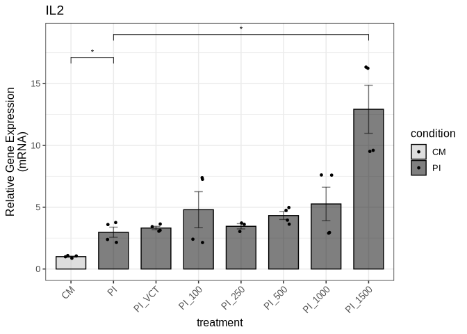

We export the figure to a PDF file in the Figure3 directory:

``` r
ggsave("output/Figure3/fig3f_il2_qpcr.pdf", fig3f, 
       width = 6, height = 6, dpi = 300, useDingbats=FALSE)
```

We create the composite Figure 3 and add two panels (fig3f copies) as
placeholders for Western blots:

``` r
composite_fig3 <- plot_grid(fig3a, fig3d, fig3b_new, fig3f, fig3f, fig3f,
                            ncol = 2, nrow = 3, 
                            labels = c("A", "D", "B", "E", "C", "F"), 
                            label_size = 12, 
                            align = "v")
```

``` r
composite_fig3
```

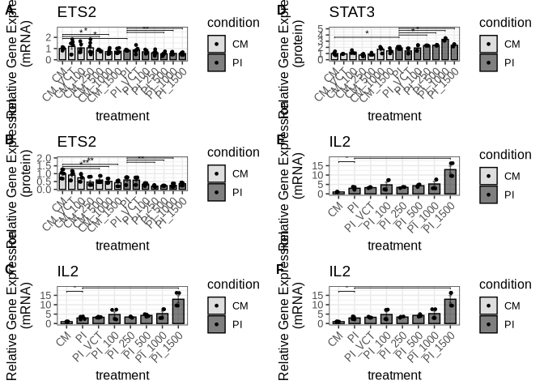

We save the composite Figure 3 to a file:

``` r
ggsave("output/Figure3/composite_fig3.pdf", composite_fig3, 
       width = 8, height = 9, dpi = 300)
```

### Figure 4

#### Figure 4a (STAT3 mRNA expression levels)

We import the expression data (qPCR) for STAT3:

``` r
fig4_stat3_qpcr_data <- read_xlsx("input/Figure4_data.xlsx", sheet = "STAT3_mRNA")
```

``` r
fig4_stat3_qpcr_result <- compare_qpcr_groups(
  fig4_stat3_qpcr_data,
  group_col = "treatment",
  gene_col = "stat3",
  actin_col = "actin",
  control_group = "CM",
  wilcox_pairs = list(c("CM", "PI"),
                      c("PI", "PI SI STAT3"))
)
```

``` r
fig4_stat3_qpcr_result$wilcox_results
```

    # A tibble: 2 × 4
      group1 group2      p.value statistic
      <chr>  <chr>         <dbl>     <dbl>
    1 CM     PI          0.0140          7
    2 PI     PI SI STAT3 0.00117        42

``` r
fig4a <- fig4_stat3_qpcr_result$p
```

``` r
fig4a
```


We save the figure to a PDF file in the Figure4 directory:

``` r
ggsave("output/Figure4/fig4a_stat3_qpcr.pdf", fig4a, 
       width = 3, height = 6, dpi = 300, useDingbats=FALSE)
```

#### Figure 4b (ETS2 mRNA expression levels)

We do the same for ETS2:

``` r
fig4_ets2_qpcr_data <- read_xlsx("input/Figure4_data.xlsx", sheet = "ETS2_mRNA_20250709")
```

``` r
fig4_ets2_qpcr_result <- compare_qpcr_groups(
  fig4_ets2_qpcr_data,
  group_col = "treatment",
  gene_col = "ets2",
  actin_col = "actin",
  control_group = "CM",
  wilcox_pairs = list(c("CM", "PI"), c("PI", "PI SI STAT3"))
)
```

``` r
fig4_ets2_qpcr_result$wilcox_results
```

    # A tibble: 2 × 4
      group1 group2      p.value statistic
      <chr>  <chr>         <dbl>     <dbl>
    1 CM     PI          0.00433        30
    2 PI     PI SI STAT3 0.00866         2

``` r
fig4_ets2_qpcr_result$all_wilcox_table
```

<div id="kxdgfmuyja" style="padding-left:0px;padding-right:0px;padding-top:10px;padding-bottom:10px;overflow-x:auto;overflow-y:auto;width:auto;height:auto;">
<style>#kxdgfmuyja table {
  font-family: system-ui, 'Segoe UI', Roboto, Helvetica, Arial, sans-serif, 'Apple Color Emoji', 'Segoe UI Emoji', 'Segoe UI Symbol', 'Noto Color Emoji';
  -webkit-font-smoothing: antialiased;
  -moz-osx-font-smoothing: grayscale;
}

#kxdgfmuyja thead, #kxdgfmuyja tbody, #kxdgfmuyja tfoot, #kxdgfmuyja tr, #kxdgfmuyja td, #kxdgfmuyja th {
  border-style: none;
}

#kxdgfmuyja p {
  margin: 0;
  padding: 0;
}

#kxdgfmuyja .gt_table {
  display: table;
  border-collapse: collapse;
  line-height: normal;
  margin-left: auto;
  margin-right: auto;
  color: #333333;
  font-size: 16px;
  font-weight: normal;
  font-style: normal;
  background-color: #FFFFFF;
  width: auto;
  border-top-style: solid;
  border-top-width: 2px;
  border-top-color: #A8A8A8;
  border-right-style: none;
  border-right-width: 2px;
  border-right-color: #D3D3D3;
  border-bottom-style: solid;
  border-bottom-width: 2px;
  border-bottom-color: #A8A8A8;
  border-left-style: none;
  border-left-width: 2px;
  border-left-color: #D3D3D3;
}

#kxdgfmuyja .gt_caption {
  padding-top: 4px;
  padding-bottom: 4px;
}

#kxdgfmuyja .gt_title {
  color: #333333;
  font-size: 125%;
  font-weight: initial;
  padding-top: 4px;
  padding-bottom: 4px;
  padding-left: 5px;
  padding-right: 5px;
  border-bottom-color: #FFFFFF;
  border-bottom-width: 0;
}

#kxdgfmuyja .gt_subtitle {
  color: #333333;
  font-size: 85%;
  font-weight: initial;
  padding-top: 3px;
  padding-bottom: 5px;
  padding-left: 5px;
  padding-right: 5px;
  border-top-color: #FFFFFF;
  border-top-width: 0;
}

#kxdgfmuyja .gt_heading {
  background-color: #FFFFFF;
  text-align: center;
  border-bottom-color: #FFFFFF;
  border-left-style: none;
  border-left-width: 1px;
  border-left-color: #D3D3D3;
  border-right-style: none;
  border-right-width: 1px;
  border-right-color: #D3D3D3;
}

#kxdgfmuyja .gt_bottom_border {
  border-bottom-style: solid;
  border-bottom-width: 2px;
  border-bottom-color: #D3D3D3;
}

#kxdgfmuyja .gt_col_headings {
  border-top-style: solid;
  border-top-width: 2px;
  border-top-color: #D3D3D3;
  border-bottom-style: solid;
  border-bottom-width: 2px;
  border-bottom-color: #D3D3D3;
  border-left-style: none;
  border-left-width: 1px;
  border-left-color: #D3D3D3;
  border-right-style: none;
  border-right-width: 1px;
  border-right-color: #D3D3D3;
}

#kxdgfmuyja .gt_col_heading {
  color: #333333;
  background-color: #FFFFFF;
  font-size: 100%;
  font-weight: normal;
  text-transform: inherit;
  border-left-style: none;
  border-left-width: 1px;
  border-left-color: #D3D3D3;
  border-right-style: none;
  border-right-width: 1px;
  border-right-color: #D3D3D3;
  vertical-align: bottom;
  padding-top: 5px;
  padding-bottom: 6px;
  padding-left: 5px;
  padding-right: 5px;
  overflow-x: hidden;
}

#kxdgfmuyja .gt_column_spanner_outer {
  color: #333333;
  background-color: #FFFFFF;
  font-size: 100%;
  font-weight: normal;
  text-transform: inherit;
  padding-top: 0;
  padding-bottom: 0;
  padding-left: 4px;
  padding-right: 4px;
}

#kxdgfmuyja .gt_column_spanner_outer:first-child {
  padding-left: 0;
}

#kxdgfmuyja .gt_column_spanner_outer:last-child {
  padding-right: 0;
}

#kxdgfmuyja .gt_column_spanner {
  border-bottom-style: solid;
  border-bottom-width: 2px;
  border-bottom-color: #D3D3D3;
  vertical-align: bottom;
  padding-top: 5px;
  padding-bottom: 5px;
  overflow-x: hidden;
  display: inline-block;
  width: 100%;
}

#kxdgfmuyja .gt_spanner_row {
  border-bottom-style: hidden;
}

#kxdgfmuyja .gt_group_heading {
  padding-top: 8px;
  padding-bottom: 8px;
  padding-left: 5px;
  padding-right: 5px;
  color: #333333;
  background-color: #FFFFFF;
  font-size: 100%;
  font-weight: initial;
  text-transform: inherit;
  border-top-style: solid;
  border-top-width: 2px;
  border-top-color: #D3D3D3;
  border-bottom-style: solid;
  border-bottom-width: 2px;
  border-bottom-color: #D3D3D3;
  border-left-style: none;
  border-left-width: 1px;
  border-left-color: #D3D3D3;
  border-right-style: none;
  border-right-width: 1px;
  border-right-color: #D3D3D3;
  vertical-align: middle;
  text-align: left;
}

#kxdgfmuyja .gt_empty_group_heading {
  padding: 0.5px;
  color: #333333;
  background-color: #FFFFFF;
  font-size: 100%;
  font-weight: initial;
  border-top-style: solid;
  border-top-width: 2px;
  border-top-color: #D3D3D3;
  border-bottom-style: solid;
  border-bottom-width: 2px;
  border-bottom-color: #D3D3D3;
  vertical-align: middle;
}

#kxdgfmuyja .gt_from_md > :first-child {
  margin-top: 0;
}

#kxdgfmuyja .gt_from_md > :last-child {
  margin-bottom: 0;
}

#kxdgfmuyja .gt_row {
  padding-top: 8px;
  padding-bottom: 8px;
  padding-left: 5px;
  padding-right: 5px;
  margin: 10px;
  border-top-style: solid;
  border-top-width: 1px;
  border-top-color: #D3D3D3;
  border-left-style: none;
  border-left-width: 1px;
  border-left-color: #D3D3D3;
  border-right-style: none;
  border-right-width: 1px;
  border-right-color: #D3D3D3;
  vertical-align: middle;
  overflow-x: hidden;
}

#kxdgfmuyja .gt_stub {
  color: #333333;
  background-color: #FFFFFF;
  font-size: 100%;
  font-weight: initial;
  text-transform: inherit;
  border-right-style: solid;
  border-right-width: 2px;
  border-right-color: #D3D3D3;
  padding-left: 5px;
  padding-right: 5px;
}

#kxdgfmuyja .gt_stub_row_group {
  color: #333333;
  background-color: #FFFFFF;
  font-size: 100%;
  font-weight: initial;
  text-transform: inherit;
  border-right-style: solid;
  border-right-width: 2px;
  border-right-color: #D3D3D3;
  padding-left: 5px;
  padding-right: 5px;
  vertical-align: top;
}

#kxdgfmuyja .gt_row_group_first td {
  border-top-width: 2px;
}

#kxdgfmuyja .gt_row_group_first th {
  border-top-width: 2px;
}

#kxdgfmuyja .gt_summary_row {
  color: #333333;
  background-color: #FFFFFF;
  text-transform: inherit;
  padding-top: 8px;
  padding-bottom: 8px;
  padding-left: 5px;
  padding-right: 5px;
}

#kxdgfmuyja .gt_first_summary_row {
  border-top-style: solid;
  border-top-color: #D3D3D3;
}

#kxdgfmuyja .gt_first_summary_row.thick {
  border-top-width: 2px;
}

#kxdgfmuyja .gt_last_summary_row {
  padding-top: 8px;
  padding-bottom: 8px;
  padding-left: 5px;
  padding-right: 5px;
  border-bottom-style: solid;
  border-bottom-width: 2px;
  border-bottom-color: #D3D3D3;
}

#kxdgfmuyja .gt_grand_summary_row {
  color: #333333;
  background-color: #FFFFFF;
  text-transform: inherit;
  padding-top: 8px;
  padding-bottom: 8px;
  padding-left: 5px;
  padding-right: 5px;
}

#kxdgfmuyja .gt_first_grand_summary_row {
  padding-top: 8px;
  padding-bottom: 8px;
  padding-left: 5px;
  padding-right: 5px;
  border-top-style: double;
  border-top-width: 6px;
  border-top-color: #D3D3D3;
}

#kxdgfmuyja .gt_last_grand_summary_row_top {
  padding-top: 8px;
  padding-bottom: 8px;
  padding-left: 5px;
  padding-right: 5px;
  border-bottom-style: double;
  border-bottom-width: 6px;
  border-bottom-color: #D3D3D3;
}

#kxdgfmuyja .gt_striped {
  background-color: rgba(128, 128, 128, 0.05);
}

#kxdgfmuyja .gt_table_body {
  border-top-style: solid;
  border-top-width: 2px;
  border-top-color: #D3D3D3;
  border-bottom-style: solid;
  border-bottom-width: 2px;
  border-bottom-color: #D3D3D3;
}

#kxdgfmuyja .gt_footnotes {
  color: #333333;
  background-color: #FFFFFF;
  border-bottom-style: none;
  border-bottom-width: 2px;
  border-bottom-color: #D3D3D3;
  border-left-style: none;
  border-left-width: 2px;
  border-left-color: #D3D3D3;
  border-right-style: none;
  border-right-width: 2px;
  border-right-color: #D3D3D3;
}

#kxdgfmuyja .gt_footnote {
  margin: 0px;
  font-size: 90%;
  padding-top: 4px;
  padding-bottom: 4px;
  padding-left: 5px;
  padding-right: 5px;
}

#kxdgfmuyja .gt_sourcenotes {
  color: #333333;
  background-color: #FFFFFF;
  border-bottom-style: none;
  border-bottom-width: 2px;
  border-bottom-color: #D3D3D3;
  border-left-style: none;
  border-left-width: 2px;
  border-left-color: #D3D3D3;
  border-right-style: none;
  border-right-width: 2px;
  border-right-color: #D3D3D3;
}

#kxdgfmuyja .gt_sourcenote {
  font-size: 90%;
  padding-top: 4px;
  padding-bottom: 4px;
  padding-left: 5px;
  padding-right: 5px;
}

#kxdgfmuyja .gt_left {
  text-align: left;
}

#kxdgfmuyja .gt_center {
  text-align: center;
}

#kxdgfmuyja .gt_right {
  text-align: right;
  font-variant-numeric: tabular-nums;
}

#kxdgfmuyja .gt_font_normal {
  font-weight: normal;
}

#kxdgfmuyja .gt_font_bold {
  font-weight: bold;
}

#kxdgfmuyja .gt_font_italic {
  font-style: italic;
}

#kxdgfmuyja .gt_super {
  font-size: 65%;
}

#kxdgfmuyja .gt_footnote_marks {
  font-size: 75%;
  vertical-align: 0.4em;
  position: initial;
}

#kxdgfmuyja .gt_asterisk {
  font-size: 100%;
  vertical-align: 0;
}

#kxdgfmuyja .gt_indent_1 {
  text-indent: 5px;
}

#kxdgfmuyja .gt_indent_2 {
  text-indent: 10px;
}

#kxdgfmuyja .gt_indent_3 {
  text-indent: 15px;
}

#kxdgfmuyja .gt_indent_4 {
  text-indent: 20px;
}

#kxdgfmuyja .gt_indent_5 {
  text-indent: 25px;
}
</style>
<table class="gt_table" data-quarto-disable-processing="false" data-quarto-bootstrap="false">
  <thead>
    <tr class="gt_col_headings">
      <th class="gt_col_heading gt_columns_bottom_border gt_left" rowspan="1" colspan="1" scope="col" id="Comparison">Comparison</th>
      <th class="gt_col_heading gt_columns_bottom_border gt_right" rowspan="1" colspan="1" scope="col" id="Statistic">Statistic</th>
      <th class="gt_col_heading gt_columns_bottom_border gt_right" rowspan="1" colspan="1" scope="col" id="P_value">P_value</th>
      <th class="gt_col_heading gt_columns_bottom_border gt_left" rowspan="1" colspan="1" scope="col" id="Significant">Significant</th>
    </tr>
  </thead>
  <tbody class="gt_table_body">
    <tr><td headers="Comparison" class="gt_row gt_left">CM vs CM SI GAPDH</td>
<td headers="Statistic" class="gt_row gt_right">11.0</td>
<td headers="P_value" class="gt_row gt_right">0.5368</td>
<td headers="Significant" class="gt_row gt_left">No</td></tr>
    <tr><td headers="Comparison" class="gt_row gt_left" style="background-color: rgba(204,230,255,0.8); color: #000000; font-weight: bold;">CM vs CM SI STAT3</td>
<td headers="Statistic" class="gt_row gt_right" style="background-color: rgba(204,230,255,0.8); color: #000000; font-weight: bold;">1.0</td>
<td headers="P_value" class="gt_row gt_right" style="background-color: rgba(204,230,255,0.8); color: #000000; font-weight: bold;">0.0317</td>
<td headers="Significant" class="gt_row gt_left" style="background-color: rgba(204,230,255,0.8); color: #000000; font-weight: bold;">Yes</td></tr>
    <tr><td headers="Comparison" class="gt_row gt_left" style="background-color: rgba(204,230,255,0.8); color: #000000; font-weight: bold;">CM vs PI</td>
<td headers="Statistic" class="gt_row gt_right" style="background-color: rgba(204,230,255,0.8); color: #000000; font-weight: bold;">30.0</td>
<td headers="P_value" class="gt_row gt_right" style="background-color: rgba(204,230,255,0.8); color: #000000; font-weight: bold;">0.0043</td>
<td headers="Significant" class="gt_row gt_left" style="background-color: rgba(204,230,255,0.8); color: #000000; font-weight: bold;">Yes</td></tr>
    <tr><td headers="Comparison" class="gt_row gt_left" style="background-color: rgba(204,230,255,0.8); color: #000000; font-weight: bold;">CM vs PI SI GAPDH</td>
<td headers="Statistic" class="gt_row gt_right" style="background-color: rgba(204,230,255,0.8); color: #000000; font-weight: bold;">30.0</td>
<td headers="P_value" class="gt_row gt_right" style="background-color: rgba(204,230,255,0.8); color: #000000; font-weight: bold;">0.0080</td>
<td headers="Significant" class="gt_row gt_left" style="background-color: rgba(204,230,255,0.8); color: #000000; font-weight: bold;">Yes</td></tr>
    <tr><td headers="Comparison" class="gt_row gt_left">CM vs PI SI STAT3</td>
<td headers="Statistic" class="gt_row gt_right">15.0</td>
<td headers="P_value" class="gt_row gt_right">1.0000</td>
<td headers="Significant" class="gt_row gt_left">No</td></tr>
    <tr><td headers="Comparison" class="gt_row gt_left">CM SI GAPDH vs CM SI STAT3</td>
<td headers="Statistic" class="gt_row gt_right">3.5</td>
<td headers="P_value" class="gt_row gt_right">0.0871</td>
<td headers="Significant" class="gt_row gt_left">No</td></tr>
    <tr><td headers="Comparison" class="gt_row gt_left" style="background-color: rgba(204,230,255,0.8); color: #000000; font-weight: bold;">CM SI GAPDH vs PI</td>
<td headers="Statistic" class="gt_row gt_right" style="background-color: rgba(204,230,255,0.8); color: #000000; font-weight: bold;">36.0</td>
<td headers="P_value" class="gt_row gt_right" style="background-color: rgba(204,230,255,0.8); color: #000000; font-weight: bold;">0.0022</td>
<td headers="Significant" class="gt_row gt_left" style="background-color: rgba(204,230,255,0.8); color: #000000; font-weight: bold;">Yes</td></tr>
    <tr><td headers="Comparison" class="gt_row gt_left" style="background-color: rgba(204,230,255,0.8); color: #000000; font-weight: bold;">CM SI GAPDH vs PI SI GAPDH</td>
<td headers="Statistic" class="gt_row gt_right" style="background-color: rgba(204,230,255,0.8); color: #000000; font-weight: bold;">34.0</td>
<td headers="P_value" class="gt_row gt_right" style="background-color: rgba(204,230,255,0.8); color: #000000; font-weight: bold;">0.0129</td>
<td headers="Significant" class="gt_row gt_left" style="background-color: rgba(204,230,255,0.8); color: #000000; font-weight: bold;">Yes</td></tr>
    <tr><td headers="Comparison" class="gt_row gt_left">CM SI GAPDH vs PI SI STAT3</td>
<td headers="Statistic" class="gt_row gt_right">14.0</td>
<td headers="P_value" class="gt_row gt_right">0.5887</td>
<td headers="Significant" class="gt_row gt_left">No</td></tr>
    <tr><td headers="Comparison" class="gt_row gt_left" style="background-color: rgba(204,230,255,0.8); color: #000000; font-weight: bold;">CM SI STAT3 vs PI</td>
<td headers="Statistic" class="gt_row gt_right" style="background-color: rgba(204,230,255,0.8); color: #000000; font-weight: bold;">24.0</td>
<td headers="P_value" class="gt_row gt_right" style="background-color: rgba(204,230,255,0.8); color: #000000; font-weight: bold;">0.0095</td>
<td headers="Significant" class="gt_row gt_left" style="background-color: rgba(204,230,255,0.8); color: #000000; font-weight: bold;">Yes</td></tr>
    <tr><td headers="Comparison" class="gt_row gt_left" style="background-color: rgba(204,230,255,0.8); color: #000000; font-weight: bold;">CM SI STAT3 vs PI SI GAPDH</td>
<td headers="Statistic" class="gt_row gt_right" style="background-color: rgba(204,230,255,0.8); color: #000000; font-weight: bold;">24.0</td>
<td headers="P_value" class="gt_row gt_right" style="background-color: rgba(204,230,255,0.8); color: #000000; font-weight: bold;">0.0139</td>
<td headers="Significant" class="gt_row gt_left" style="background-color: rgba(204,230,255,0.8); color: #000000; font-weight: bold;">Yes</td></tr>
    <tr><td headers="Comparison" class="gt_row gt_left">CM SI STAT3 vs PI SI STAT3</td>
<td headers="Statistic" class="gt_row gt_right">15.0</td>
<td headers="P_value" class="gt_row gt_right">0.6095</td>
<td headers="Significant" class="gt_row gt_left">No</td></tr>
    <tr><td headers="Comparison" class="gt_row gt_left">PI vs PI SI GAPDH</td>
<td headers="Statistic" class="gt_row gt_right">26.0</td>
<td headers="P_value" class="gt_row gt_right">0.2290</td>
<td headers="Significant" class="gt_row gt_left">No</td></tr>
    <tr><td headers="Comparison" class="gt_row gt_left" style="background-color: rgba(204,230,255,0.8); color: #000000; font-weight: bold;">PI vs PI SI STAT3</td>
<td headers="Statistic" class="gt_row gt_right" style="background-color: rgba(204,230,255,0.8); color: #000000; font-weight: bold;">2.0</td>
<td headers="P_value" class="gt_row gt_right" style="background-color: rgba(204,230,255,0.8); color: #000000; font-weight: bold;">0.0087</td>
<td headers="Significant" class="gt_row gt_left" style="background-color: rgba(204,230,255,0.8); color: #000000; font-weight: bold;">Yes</td></tr>
    <tr><td headers="Comparison" class="gt_row gt_left" style="background-color: rgba(204,230,255,0.8); color: #000000; font-weight: bold;">PI SI GAPDH vs PI SI STAT3</td>
<td headers="Statistic" class="gt_row gt_right" style="background-color: rgba(204,230,255,0.8); color: #000000; font-weight: bold;">3.0</td>
<td headers="P_value" class="gt_row gt_right" style="background-color: rgba(204,230,255,0.8); color: #000000; font-weight: bold;">0.0200</td>
<td headers="Significant" class="gt_row gt_left" style="background-color: rgba(204,230,255,0.8); color: #000000; font-weight: bold;">Yes</td></tr>
  </tbody>
  
  
</table>
</div>

``` r
fig4b <- fig4_ets2_qpcr_result$p
```

``` r
fig4b
```


We save the figure to a PDF file in the Figure4 directory:

``` r
ggsave("output/Figure4/fig4b_ets2_qpcr.pdf", fig4b, 
       width = 3, height = 6, dpi = 300, useDingbats=FALSE)
```

#### Figure 4c (IL2 expression levels)

We do the same for IL2 expression levels:

``` r
fig4_il2_qpcr_data <- read_xlsx("input/Figure4_data.xlsx", sheet = "IL2_mRNA")
```

``` r
fig4_il2_qpcr_result <- compare_qpcr_ratio(
  fig4_il2_qpcr_data,
  group_col = "treatment",
  gene_name = "il2",
  ratio_col = "ratio",
  control_group = "CM",
  wilcox_pairs = list(c("CM", "PI"), c("PI", "PI SI STAT3"))
)
```

``` r
fig4_il2_qpcr_result$wilcox_results
```

    # A tibble: 2 × 4
      group1 group2      p.value statistic
      <chr>  <chr>         <dbl>     <dbl>
    1 CM     PI           0.0294         0
    2 PI     PI SI STAT3  0.0286        16

``` r
fig4_il2_qpcr_result$all_wilcox_table
```

<div id="hhpkwcvmrp" style="padding-left:0px;padding-right:0px;padding-top:10px;padding-bottom:10px;overflow-x:auto;overflow-y:auto;width:auto;height:auto;">
<style>#hhpkwcvmrp table {
  font-family: system-ui, 'Segoe UI', Roboto, Helvetica, Arial, sans-serif, 'Apple Color Emoji', 'Segoe UI Emoji', 'Segoe UI Symbol', 'Noto Color Emoji';
  -webkit-font-smoothing: antialiased;
  -moz-osx-font-smoothing: grayscale;
}

#hhpkwcvmrp thead, #hhpkwcvmrp tbody, #hhpkwcvmrp tfoot, #hhpkwcvmrp tr, #hhpkwcvmrp td, #hhpkwcvmrp th {
  border-style: none;
}

#hhpkwcvmrp p {
  margin: 0;
  padding: 0;
}

#hhpkwcvmrp .gt_table {
  display: table;
  border-collapse: collapse;
  line-height: normal;
  margin-left: auto;
  margin-right: auto;
  color: #333333;
  font-size: 16px;
  font-weight: normal;
  font-style: normal;
  background-color: #FFFFFF;
  width: auto;
  border-top-style: solid;
  border-top-width: 2px;
  border-top-color: #A8A8A8;
  border-right-style: none;
  border-right-width: 2px;
  border-right-color: #D3D3D3;
  border-bottom-style: solid;
  border-bottom-width: 2px;
  border-bottom-color: #A8A8A8;
  border-left-style: none;
  border-left-width: 2px;
  border-left-color: #D3D3D3;
}

#hhpkwcvmrp .gt_caption {
  padding-top: 4px;
  padding-bottom: 4px;
}

#hhpkwcvmrp .gt_title {
  color: #333333;
  font-size: 125%;
  font-weight: initial;
  padding-top: 4px;
  padding-bottom: 4px;
  padding-left: 5px;
  padding-right: 5px;
  border-bottom-color: #FFFFFF;
  border-bottom-width: 0;
}

#hhpkwcvmrp .gt_subtitle {
  color: #333333;
  font-size: 85%;
  font-weight: initial;
  padding-top: 3px;
  padding-bottom: 5px;
  padding-left: 5px;
  padding-right: 5px;
  border-top-color: #FFFFFF;
  border-top-width: 0;
}

#hhpkwcvmrp .gt_heading {
  background-color: #FFFFFF;
  text-align: center;
  border-bottom-color: #FFFFFF;
  border-left-style: none;
  border-left-width: 1px;
  border-left-color: #D3D3D3;
  border-right-style: none;
  border-right-width: 1px;
  border-right-color: #D3D3D3;
}

#hhpkwcvmrp .gt_bottom_border {
  border-bottom-style: solid;
  border-bottom-width: 2px;
  border-bottom-color: #D3D3D3;
}

#hhpkwcvmrp .gt_col_headings {
  border-top-style: solid;
  border-top-width: 2px;
  border-top-color: #D3D3D3;
  border-bottom-style: solid;
  border-bottom-width: 2px;
  border-bottom-color: #D3D3D3;
  border-left-style: none;
  border-left-width: 1px;
  border-left-color: #D3D3D3;
  border-right-style: none;
  border-right-width: 1px;
  border-right-color: #D3D3D3;
}

#hhpkwcvmrp .gt_col_heading {
  color: #333333;
  background-color: #FFFFFF;
  font-size: 100%;
  font-weight: normal;
  text-transform: inherit;
  border-left-style: none;
  border-left-width: 1px;
  border-left-color: #D3D3D3;
  border-right-style: none;
  border-right-width: 1px;
  border-right-color: #D3D3D3;
  vertical-align: bottom;
  padding-top: 5px;
  padding-bottom: 6px;
  padding-left: 5px;
  padding-right: 5px;
  overflow-x: hidden;
}

#hhpkwcvmrp .gt_column_spanner_outer {
  color: #333333;
  background-color: #FFFFFF;
  font-size: 100%;
  font-weight: normal;
  text-transform: inherit;
  padding-top: 0;
  padding-bottom: 0;
  padding-left: 4px;
  padding-right: 4px;
}

#hhpkwcvmrp .gt_column_spanner_outer:first-child {
  padding-left: 0;
}

#hhpkwcvmrp .gt_column_spanner_outer:last-child {
  padding-right: 0;
}

#hhpkwcvmrp .gt_column_spanner {
  border-bottom-style: solid;
  border-bottom-width: 2px;
  border-bottom-color: #D3D3D3;
  vertical-align: bottom;
  padding-top: 5px;
  padding-bottom: 5px;
  overflow-x: hidden;
  display: inline-block;
  width: 100%;
}

#hhpkwcvmrp .gt_spanner_row {
  border-bottom-style: hidden;
}

#hhpkwcvmrp .gt_group_heading {
  padding-top: 8px;
  padding-bottom: 8px;
  padding-left: 5px;
  padding-right: 5px;
  color: #333333;
  background-color: #FFFFFF;
  font-size: 100%;
  font-weight: initial;
  text-transform: inherit;
  border-top-style: solid;
  border-top-width: 2px;
  border-top-color: #D3D3D3;
  border-bottom-style: solid;
  border-bottom-width: 2px;
  border-bottom-color: #D3D3D3;
  border-left-style: none;
  border-left-width: 1px;
  border-left-color: #D3D3D3;
  border-right-style: none;
  border-right-width: 1px;
  border-right-color: #D3D3D3;
  vertical-align: middle;
  text-align: left;
}

#hhpkwcvmrp .gt_empty_group_heading {
  padding: 0.5px;
  color: #333333;
  background-color: #FFFFFF;
  font-size: 100%;
  font-weight: initial;
  border-top-style: solid;
  border-top-width: 2px;
  border-top-color: #D3D3D3;
  border-bottom-style: solid;
  border-bottom-width: 2px;
  border-bottom-color: #D3D3D3;
  vertical-align: middle;
}

#hhpkwcvmrp .gt_from_md > :first-child {
  margin-top: 0;
}

#hhpkwcvmrp .gt_from_md > :last-child {
  margin-bottom: 0;
}

#hhpkwcvmrp .gt_row {
  padding-top: 8px;
  padding-bottom: 8px;
  padding-left: 5px;
  padding-right: 5px;
  margin: 10px;
  border-top-style: solid;
  border-top-width: 1px;
  border-top-color: #D3D3D3;
  border-left-style: none;
  border-left-width: 1px;
  border-left-color: #D3D3D3;
  border-right-style: none;
  border-right-width: 1px;
  border-right-color: #D3D3D3;
  vertical-align: middle;
  overflow-x: hidden;
}

#hhpkwcvmrp .gt_stub {
  color: #333333;
  background-color: #FFFFFF;
  font-size: 100%;
  font-weight: initial;
  text-transform: inherit;
  border-right-style: solid;
  border-right-width: 2px;
  border-right-color: #D3D3D3;
  padding-left: 5px;
  padding-right: 5px;
}

#hhpkwcvmrp .gt_stub_row_group {
  color: #333333;
  background-color: #FFFFFF;
  font-size: 100%;
  font-weight: initial;
  text-transform: inherit;
  border-right-style: solid;
  border-right-width: 2px;
  border-right-color: #D3D3D3;
  padding-left: 5px;
  padding-right: 5px;
  vertical-align: top;
}

#hhpkwcvmrp .gt_row_group_first td {
  border-top-width: 2px;
}

#hhpkwcvmrp .gt_row_group_first th {
  border-top-width: 2px;
}

#hhpkwcvmrp .gt_summary_row {
  color: #333333;
  background-color: #FFFFFF;
  text-transform: inherit;
  padding-top: 8px;
  padding-bottom: 8px;
  padding-left: 5px;
  padding-right: 5px;
}

#hhpkwcvmrp .gt_first_summary_row {
  border-top-style: solid;
  border-top-color: #D3D3D3;
}

#hhpkwcvmrp .gt_first_summary_row.thick {
  border-top-width: 2px;
}

#hhpkwcvmrp .gt_last_summary_row {
  padding-top: 8px;
  padding-bottom: 8px;
  padding-left: 5px;
  padding-right: 5px;
  border-bottom-style: solid;
  border-bottom-width: 2px;
  border-bottom-color: #D3D3D3;
}

#hhpkwcvmrp .gt_grand_summary_row {
  color: #333333;
  background-color: #FFFFFF;
  text-transform: inherit;
  padding-top: 8px;
  padding-bottom: 8px;
  padding-left: 5px;
  padding-right: 5px;
}

#hhpkwcvmrp .gt_first_grand_summary_row {
  padding-top: 8px;
  padding-bottom: 8px;
  padding-left: 5px;
  padding-right: 5px;
  border-top-style: double;
  border-top-width: 6px;
  border-top-color: #D3D3D3;
}

#hhpkwcvmrp .gt_last_grand_summary_row_top {
  padding-top: 8px;
  padding-bottom: 8px;
  padding-left: 5px;
  padding-right: 5px;
  border-bottom-style: double;
  border-bottom-width: 6px;
  border-bottom-color: #D3D3D3;
}

#hhpkwcvmrp .gt_striped {
  background-color: rgba(128, 128, 128, 0.05);
}

#hhpkwcvmrp .gt_table_body {
  border-top-style: solid;
  border-top-width: 2px;
  border-top-color: #D3D3D3;
  border-bottom-style: solid;
  border-bottom-width: 2px;
  border-bottom-color: #D3D3D3;
}

#hhpkwcvmrp .gt_footnotes {
  color: #333333;
  background-color: #FFFFFF;
  border-bottom-style: none;
  border-bottom-width: 2px;
  border-bottom-color: #D3D3D3;
  border-left-style: none;
  border-left-width: 2px;
  border-left-color: #D3D3D3;
  border-right-style: none;
  border-right-width: 2px;
  border-right-color: #D3D3D3;
}

#hhpkwcvmrp .gt_footnote {
  margin: 0px;
  font-size: 90%;
  padding-top: 4px;
  padding-bottom: 4px;
  padding-left: 5px;
  padding-right: 5px;
}

#hhpkwcvmrp .gt_sourcenotes {
  color: #333333;
  background-color: #FFFFFF;
  border-bottom-style: none;
  border-bottom-width: 2px;
  border-bottom-color: #D3D3D3;
  border-left-style: none;
  border-left-width: 2px;
  border-left-color: #D3D3D3;
  border-right-style: none;
  border-right-width: 2px;
  border-right-color: #D3D3D3;
}

#hhpkwcvmrp .gt_sourcenote {
  font-size: 90%;
  padding-top: 4px;
  padding-bottom: 4px;
  padding-left: 5px;
  padding-right: 5px;
}

#hhpkwcvmrp .gt_left {
  text-align: left;
}

#hhpkwcvmrp .gt_center {
  text-align: center;
}

#hhpkwcvmrp .gt_right {
  text-align: right;
  font-variant-numeric: tabular-nums;
}

#hhpkwcvmrp .gt_font_normal {
  font-weight: normal;
}

#hhpkwcvmrp .gt_font_bold {
  font-weight: bold;
}

#hhpkwcvmrp .gt_font_italic {
  font-style: italic;
}

#hhpkwcvmrp .gt_super {
  font-size: 65%;
}

#hhpkwcvmrp .gt_footnote_marks {
  font-size: 75%;
  vertical-align: 0.4em;
  position: initial;
}

#hhpkwcvmrp .gt_asterisk {
  font-size: 100%;
  vertical-align: 0;
}

#hhpkwcvmrp .gt_indent_1 {
  text-indent: 5px;
}

#hhpkwcvmrp .gt_indent_2 {
  text-indent: 10px;
}

#hhpkwcvmrp .gt_indent_3 {
  text-indent: 15px;
}

#hhpkwcvmrp .gt_indent_4 {
  text-indent: 20px;
}

#hhpkwcvmrp .gt_indent_5 {
  text-indent: 25px;
}
</style>
<table class="gt_table" data-quarto-disable-processing="false" data-quarto-bootstrap="false">
  <thead>
    <tr class="gt_col_headings">
      <th class="gt_col_heading gt_columns_bottom_border gt_left" rowspan="1" colspan="1" scope="col" id="Comparison">Comparison</th>
      <th class="gt_col_heading gt_columns_bottom_border gt_right" rowspan="1" colspan="1" scope="col" id="Statistic">Statistic</th>
      <th class="gt_col_heading gt_columns_bottom_border gt_right" rowspan="1" colspan="1" scope="col" id="P_value">P_value</th>
      <th class="gt_col_heading gt_columns_bottom_border gt_left" rowspan="1" colspan="1" scope="col" id="Significant">Significant</th>
    </tr>
  </thead>
  <tbody class="gt_table_body">
    <tr><td headers="Comparison" class="gt_row gt_left">CM vs CM SI GAPDH</td>
<td headers="Statistic" class="gt_row gt_right">13.0</td>
<td headers="P_value" class="gt_row gt_right">0.1720</td>
<td headers="Significant" class="gt_row gt_left">No</td></tr>
    <tr><td headers="Comparison" class="gt_row gt_left" style="background-color: rgba(204,230,255,0.8); color: #000000; font-weight: bold;">CM vs CM SI STAT3</td>
<td headers="Statistic" class="gt_row gt_right" style="background-color: rgba(204,230,255,0.8); color: #000000; font-weight: bold;">15.5</td>
<td headers="P_value" class="gt_row gt_right" style="background-color: rgba(204,230,255,0.8); color: #000000; font-weight: bold;">0.0396</td>
<td headers="Significant" class="gt_row gt_left" style="background-color: rgba(204,230,255,0.8); color: #000000; font-weight: bold;">Yes</td></tr>
    <tr><td headers="Comparison" class="gt_row gt_left" style="background-color: rgba(204,230,255,0.8); color: #000000; font-weight: bold;">CM vs PI</td>
<td headers="Statistic" class="gt_row gt_right" style="background-color: rgba(204,230,255,0.8); color: #000000; font-weight: bold;">0.0</td>
<td headers="P_value" class="gt_row gt_right" style="background-color: rgba(204,230,255,0.8); color: #000000; font-weight: bold;">0.0294</td>
<td headers="Significant" class="gt_row gt_left" style="background-color: rgba(204,230,255,0.8); color: #000000; font-weight: bold;">Yes</td></tr>
    <tr><td headers="Comparison" class="gt_row gt_left" style="background-color: rgba(204,230,255,0.8); color: #000000; font-weight: bold;">CM vs PI SI GAPDH</td>
<td headers="Statistic" class="gt_row gt_right" style="background-color: rgba(204,230,255,0.8); color: #000000; font-weight: bold;">0.0</td>
<td headers="P_value" class="gt_row gt_right" style="background-color: rgba(204,230,255,0.8); color: #000000; font-weight: bold;">0.0294</td>
<td headers="Significant" class="gt_row gt_left" style="background-color: rgba(204,230,255,0.8); color: #000000; font-weight: bold;">Yes</td></tr>
    <tr><td headers="Comparison" class="gt_row gt_left" style="background-color: rgba(204,230,255,0.8); color: #000000; font-weight: bold;">CM vs PI SI STAT3</td>
<td headers="Statistic" class="gt_row gt_right" style="background-color: rgba(204,230,255,0.8); color: #000000; font-weight: bold;">0.0</td>
<td headers="P_value" class="gt_row gt_right" style="background-color: rgba(204,230,255,0.8); color: #000000; font-weight: bold;">0.0294</td>
<td headers="Significant" class="gt_row gt_left" style="background-color: rgba(204,230,255,0.8); color: #000000; font-weight: bold;">Yes</td></tr>
    <tr><td headers="Comparison" class="gt_row gt_left">CM SI GAPDH vs CM SI STAT3</td>
<td headers="Statistic" class="gt_row gt_right">13.0</td>
<td headers="P_value" class="gt_row gt_right">0.1720</td>
<td headers="Significant" class="gt_row gt_left">No</td></tr>
    <tr><td headers="Comparison" class="gt_row gt_left" style="background-color: rgba(204,230,255,0.8); color: #000000; font-weight: bold;">CM SI GAPDH vs PI</td>
<td headers="Statistic" class="gt_row gt_right" style="background-color: rgba(204,230,255,0.8); color: #000000; font-weight: bold;">0.0</td>
<td headers="P_value" class="gt_row gt_right" style="background-color: rgba(204,230,255,0.8); color: #000000; font-weight: bold;">0.0294</td>
<td headers="Significant" class="gt_row gt_left" style="background-color: rgba(204,230,255,0.8); color: #000000; font-weight: bold;">Yes</td></tr>
    <tr><td headers="Comparison" class="gt_row gt_left" style="background-color: rgba(204,230,255,0.8); color: #000000; font-weight: bold;">CM SI GAPDH vs PI SI GAPDH</td>
<td headers="Statistic" class="gt_row gt_right" style="background-color: rgba(204,230,255,0.8); color: #000000; font-weight: bold;">0.0</td>
<td headers="P_value" class="gt_row gt_right" style="background-color: rgba(204,230,255,0.8); color: #000000; font-weight: bold;">0.0294</td>
<td headers="Significant" class="gt_row gt_left" style="background-color: rgba(204,230,255,0.8); color: #000000; font-weight: bold;">Yes</td></tr>
    <tr><td headers="Comparison" class="gt_row gt_left" style="background-color: rgba(204,230,255,0.8); color: #000000; font-weight: bold;">CM SI GAPDH vs PI SI STAT3</td>
<td headers="Statistic" class="gt_row gt_right" style="background-color: rgba(204,230,255,0.8); color: #000000; font-weight: bold;">0.0</td>
<td headers="P_value" class="gt_row gt_right" style="background-color: rgba(204,230,255,0.8); color: #000000; font-weight: bold;">0.0294</td>
<td headers="Significant" class="gt_row gt_left" style="background-color: rgba(204,230,255,0.8); color: #000000; font-weight: bold;">Yes</td></tr>
    <tr><td headers="Comparison" class="gt_row gt_left" style="background-color: rgba(204,230,255,0.8); color: #000000; font-weight: bold;">CM SI STAT3 vs PI</td>
<td headers="Statistic" class="gt_row gt_right" style="background-color: rgba(204,230,255,0.8); color: #000000; font-weight: bold;">0.0</td>
<td headers="P_value" class="gt_row gt_right" style="background-color: rgba(204,230,255,0.8); color: #000000; font-weight: bold;">0.0294</td>
<td headers="Significant" class="gt_row gt_left" style="background-color: rgba(204,230,255,0.8); color: #000000; font-weight: bold;">Yes</td></tr>
    <tr><td headers="Comparison" class="gt_row gt_left" style="background-color: rgba(204,230,255,0.8); color: #000000; font-weight: bold;">CM SI STAT3 vs PI SI GAPDH</td>
<td headers="Statistic" class="gt_row gt_right" style="background-color: rgba(204,230,255,0.8); color: #000000; font-weight: bold;">0.0</td>
<td headers="P_value" class="gt_row gt_right" style="background-color: rgba(204,230,255,0.8); color: #000000; font-weight: bold;">0.0294</td>
<td headers="Significant" class="gt_row gt_left" style="background-color: rgba(204,230,255,0.8); color: #000000; font-weight: bold;">Yes</td></tr>
    <tr><td headers="Comparison" class="gt_row gt_left" style="background-color: rgba(204,230,255,0.8); color: #000000; font-weight: bold;">CM SI STAT3 vs PI SI STAT3</td>
<td headers="Statistic" class="gt_row gt_right" style="background-color: rgba(204,230,255,0.8); color: #000000; font-weight: bold;">0.0</td>
<td headers="P_value" class="gt_row gt_right" style="background-color: rgba(204,230,255,0.8); color: #000000; font-weight: bold;">0.0294</td>
<td headers="Significant" class="gt_row gt_left" style="background-color: rgba(204,230,255,0.8); color: #000000; font-weight: bold;">Yes</td></tr>
    <tr><td headers="Comparison" class="gt_row gt_left">PI vs PI SI GAPDH</td>
<td headers="Statistic" class="gt_row gt_right">7.0</td>
<td headers="P_value" class="gt_row gt_right">0.8857</td>
<td headers="Significant" class="gt_row gt_left">No</td></tr>
    <tr><td headers="Comparison" class="gt_row gt_left" style="background-color: rgba(204,230,255,0.8); color: #000000; font-weight: bold;">PI vs PI SI STAT3</td>
<td headers="Statistic" class="gt_row gt_right" style="background-color: rgba(204,230,255,0.8); color: #000000; font-weight: bold;">16.0</td>
<td headers="P_value" class="gt_row gt_right" style="background-color: rgba(204,230,255,0.8); color: #000000; font-weight: bold;">0.0286</td>
<td headers="Significant" class="gt_row gt_left" style="background-color: rgba(204,230,255,0.8); color: #000000; font-weight: bold;">Yes</td></tr>
    <tr><td headers="Comparison" class="gt_row gt_left" style="background-color: rgba(204,230,255,0.8); color: #000000; font-weight: bold;">PI SI GAPDH vs PI SI STAT3</td>
<td headers="Statistic" class="gt_row gt_right" style="background-color: rgba(204,230,255,0.8); color: #000000; font-weight: bold;">16.0</td>
<td headers="P_value" class="gt_row gt_right" style="background-color: rgba(204,230,255,0.8); color: #000000; font-weight: bold;">0.0286</td>
<td headers="Significant" class="gt_row gt_left" style="background-color: rgba(204,230,255,0.8); color: #000000; font-weight: bold;">Yes</td></tr>
  </tbody>
  
  
</table>
</div>

``` r
fig4c <- fig4_il2_qpcr_result$p
```

``` r
fig4c
```

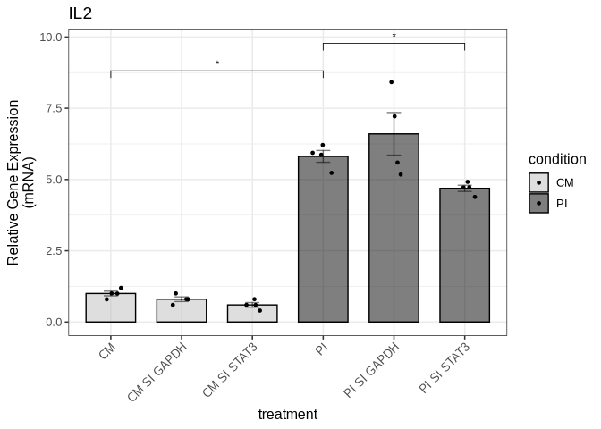

We save the figure to a PDF file in the Figure4 directory:

``` r
ggsave("output/Figure4/fig4c_il2_qpcr.pdf", fig4c, 
       width = 3, height = 6, dpi = 300, useDingbats=FALSE)
```

    Warning in wilcox.test.default(c(1, 1.2, 1, 0.8), c(6.21274, 5.93244, 5.22998,
    : cannot compute exact p-value with ties

#### Figure 4d (STAT3 protein expression levels)

We do the same for STAT3 protein levels:

``` r
fig4_stat3_protein_data <- read_xlsx("input/Figure4_data.xlsx", sheet = "STAT3_protein_20250701")
```

``` r
fig4_stat3_protein_result <- compare_protein_ratio(
  fig4_stat3_protein_data,
  group_col = "treatment",
  gene_name = "stat3",
  control_group = "CM",
  wilcox_pairs = list(c("CM", "PI"), c("PI", "PI SI STAT3"),
                      c("CM", "CM SI STAT3"))
)
```

``` r
fig4_stat3_protein_result$wilcox_results
```

    # A tibble: 3 × 4
      group1 group2      p.value statistic
      <chr>  <chr>         <dbl>     <dbl>
    1 CM     PI           0.0266        15
    2 PI     PI SI STAT3  0.0124        80
    3 CM     CM SI STAT3  0.0433        77

``` r
fig4_stat3_protein_result$all_wilcox_table
```

<div id="kuhonbhviq" style="padding-left:0px;padding-right:0px;padding-top:10px;padding-bottom:10px;overflow-x:auto;overflow-y:auto;width:auto;height:auto;">
<style>#kuhonbhviq table {
  font-family: system-ui, 'Segoe UI', Roboto, Helvetica, Arial, sans-serif, 'Apple Color Emoji', 'Segoe UI Emoji', 'Segoe UI Symbol', 'Noto Color Emoji';
  -webkit-font-smoothing: antialiased;
  -moz-osx-font-smoothing: grayscale;
}

#kuhonbhviq thead, #kuhonbhviq tbody, #kuhonbhviq tfoot, #kuhonbhviq tr, #kuhonbhviq td, #kuhonbhviq th {
  border-style: none;
}

#kuhonbhviq p {
  margin: 0;
  padding: 0;
}

#kuhonbhviq .gt_table {
  display: table;
  border-collapse: collapse;
  line-height: normal;
  margin-left: auto;
  margin-right: auto;
  color: #333333;
  font-size: 16px;
  font-weight: normal;
  font-style: normal;
  background-color: #FFFFFF;
  width: auto;
  border-top-style: solid;
  border-top-width: 2px;
  border-top-color: #A8A8A8;
  border-right-style: none;
  border-right-width: 2px;
  border-right-color: #D3D3D3;
  border-bottom-style: solid;
  border-bottom-width: 2px;
  border-bottom-color: #A8A8A8;
  border-left-style: none;
  border-left-width: 2px;
  border-left-color: #D3D3D3;
}

#kuhonbhviq .gt_caption {
  padding-top: 4px;
  padding-bottom: 4px;
}

#kuhonbhviq .gt_title {
  color: #333333;
  font-size: 125%;
  font-weight: initial;
  padding-top: 4px;
  padding-bottom: 4px;
  padding-left: 5px;
  padding-right: 5px;
  border-bottom-color: #FFFFFF;
  border-bottom-width: 0;
}

#kuhonbhviq .gt_subtitle {
  color: #333333;
  font-size: 85%;
  font-weight: initial;
  padding-top: 3px;
  padding-bottom: 5px;
  padding-left: 5px;
  padding-right: 5px;
  border-top-color: #FFFFFF;
  border-top-width: 0;
}

#kuhonbhviq .gt_heading {
  background-color: #FFFFFF;
  text-align: center;
  border-bottom-color: #FFFFFF;
  border-left-style: none;
  border-left-width: 1px;
  border-left-color: #D3D3D3;
  border-right-style: none;
  border-right-width: 1px;
  border-right-color: #D3D3D3;
}

#kuhonbhviq .gt_bottom_border {
  border-bottom-style: solid;
  border-bottom-width: 2px;
  border-bottom-color: #D3D3D3;
}

#kuhonbhviq .gt_col_headings {
  border-top-style: solid;
  border-top-width: 2px;
  border-top-color: #D3D3D3;
  border-bottom-style: solid;
  border-bottom-width: 2px;
  border-bottom-color: #D3D3D3;
  border-left-style: none;
  border-left-width: 1px;
  border-left-color: #D3D3D3;
  border-right-style: none;
  border-right-width: 1px;
  border-right-color: #D3D3D3;
}

#kuhonbhviq .gt_col_heading {
  color: #333333;
  background-color: #FFFFFF;
  font-size: 100%;
  font-weight: normal;
  text-transform: inherit;
  border-left-style: none;
  border-left-width: 1px;
  border-left-color: #D3D3D3;
  border-right-style: none;
  border-right-width: 1px;
  border-right-color: #D3D3D3;
  vertical-align: bottom;
  padding-top: 5px;
  padding-bottom: 6px;
  padding-left: 5px;
  padding-right: 5px;
  overflow-x: hidden;
}

#kuhonbhviq .gt_column_spanner_outer {
  color: #333333;
  background-color: #FFFFFF;
  font-size: 100%;
  font-weight: normal;
  text-transform: inherit;
  padding-top: 0;
  padding-bottom: 0;
  padding-left: 4px;
  padding-right: 4px;
}

#kuhonbhviq .gt_column_spanner_outer:first-child {
  padding-left: 0;
}

#kuhonbhviq .gt_column_spanner_outer:last-child {
  padding-right: 0;
}

#kuhonbhviq .gt_column_spanner {
  border-bottom-style: solid;
  border-bottom-width: 2px;
  border-bottom-color: #D3D3D3;
  vertical-align: bottom;
  padding-top: 5px;
  padding-bottom: 5px;
  overflow-x: hidden;
  display: inline-block;
  width: 100%;
}

#kuhonbhviq .gt_spanner_row {
  border-bottom-style: hidden;
}

#kuhonbhviq .gt_group_heading {
  padding-top: 8px;
  padding-bottom: 8px;
  padding-left: 5px;
  padding-right: 5px;
  color: #333333;
  background-color: #FFFFFF;
  font-size: 100%;
  font-weight: initial;
  text-transform: inherit;
  border-top-style: solid;
  border-top-width: 2px;
  border-top-color: #D3D3D3;
  border-bottom-style: solid;
  border-bottom-width: 2px;
  border-bottom-color: #D3D3D3;
  border-left-style: none;
  border-left-width: 1px;
  border-left-color: #D3D3D3;
  border-right-style: none;
  border-right-width: 1px;
  border-right-color: #D3D3D3;
  vertical-align: middle;
  text-align: left;
}

#kuhonbhviq .gt_empty_group_heading {
  padding: 0.5px;
  color: #333333;
  background-color: #FFFFFF;
  font-size: 100%;
  font-weight: initial;
  border-top-style: solid;
  border-top-width: 2px;
  border-top-color: #D3D3D3;
  border-bottom-style: solid;
  border-bottom-width: 2px;
  border-bottom-color: #D3D3D3;
  vertical-align: middle;
}

#kuhonbhviq .gt_from_md > :first-child {
  margin-top: 0;
}

#kuhonbhviq .gt_from_md > :last-child {
  margin-bottom: 0;
}

#kuhonbhviq .gt_row {
  padding-top: 8px;
  padding-bottom: 8px;
  padding-left: 5px;
  padding-right: 5px;
  margin: 10px;
  border-top-style: solid;
  border-top-width: 1px;
  border-top-color: #D3D3D3;
  border-left-style: none;
  border-left-width: 1px;
  border-left-color: #D3D3D3;
  border-right-style: none;
  border-right-width: 1px;
  border-right-color: #D3D3D3;
  vertical-align: middle;
  overflow-x: hidden;
}

#kuhonbhviq .gt_stub {
  color: #333333;
  background-color: #FFFFFF;
  font-size: 100%;
  font-weight: initial;
  text-transform: inherit;
  border-right-style: solid;
  border-right-width: 2px;
  border-right-color: #D3D3D3;
  padding-left: 5px;
  padding-right: 5px;
}

#kuhonbhviq .gt_stub_row_group {
  color: #333333;
  background-color: #FFFFFF;
  font-size: 100%;
  font-weight: initial;
  text-transform: inherit;
  border-right-style: solid;
  border-right-width: 2px;
  border-right-color: #D3D3D3;
  padding-left: 5px;
  padding-right: 5px;
  vertical-align: top;
}

#kuhonbhviq .gt_row_group_first td {
  border-top-width: 2px;
}

#kuhonbhviq .gt_row_group_first th {
  border-top-width: 2px;
}

#kuhonbhviq .gt_summary_row {
  color: #333333;
  background-color: #FFFFFF;
  text-transform: inherit;
  padding-top: 8px;
  padding-bottom: 8px;
  padding-left: 5px;
  padding-right: 5px;
}

#kuhonbhviq .gt_first_summary_row {
  border-top-style: solid;
  border-top-color: #D3D3D3;
}

#kuhonbhviq .gt_first_summary_row.thick {
  border-top-width: 2px;
}

#kuhonbhviq .gt_last_summary_row {
  padding-top: 8px;
  padding-bottom: 8px;
  padding-left: 5px;
  padding-right: 5px;
  border-bottom-style: solid;
  border-bottom-width: 2px;
  border-bottom-color: #D3D3D3;
}

#kuhonbhviq .gt_grand_summary_row {
  color: #333333;
  background-color: #FFFFFF;
  text-transform: inherit;
  padding-top: 8px;
  padding-bottom: 8px;
  padding-left: 5px;
  padding-right: 5px;
}

#kuhonbhviq .gt_first_grand_summary_row {
  padding-top: 8px;
  padding-bottom: 8px;
  padding-left: 5px;
  padding-right: 5px;
  border-top-style: double;
  border-top-width: 6px;
  border-top-color: #D3D3D3;
}

#kuhonbhviq .gt_last_grand_summary_row_top {
  padding-top: 8px;
  padding-bottom: 8px;
  padding-left: 5px;
  padding-right: 5px;
  border-bottom-style: double;
  border-bottom-width: 6px;
  border-bottom-color: #D3D3D3;
}

#kuhonbhviq .gt_striped {
  background-color: rgba(128, 128, 128, 0.05);
}

#kuhonbhviq .gt_table_body {
  border-top-style: solid;
  border-top-width: 2px;
  border-top-color: #D3D3D3;
  border-bottom-style: solid;
  border-bottom-width: 2px;
  border-bottom-color: #D3D3D3;
}

#kuhonbhviq .gt_footnotes {
  color: #333333;
  background-color: #FFFFFF;
  border-bottom-style: none;
  border-bottom-width: 2px;
  border-bottom-color: #D3D3D3;
  border-left-style: none;
  border-left-width: 2px;
  border-left-color: #D3D3D3;
  border-right-style: none;
  border-right-width: 2px;
  border-right-color: #D3D3D3;
}

#kuhonbhviq .gt_footnote {
  margin: 0px;
  font-size: 90%;
  padding-top: 4px;
  padding-bottom: 4px;
  padding-left: 5px;
  padding-right: 5px;
}

#kuhonbhviq .gt_sourcenotes {
  color: #333333;
  background-color: #FFFFFF;
  border-bottom-style: none;
  border-bottom-width: 2px;
  border-bottom-color: #D3D3D3;
  border-left-style: none;
  border-left-width: 2px;
  border-left-color: #D3D3D3;
  border-right-style: none;
  border-right-width: 2px;
  border-right-color: #D3D3D3;
}

#kuhonbhviq .gt_sourcenote {
  font-size: 90%;
  padding-top: 4px;
  padding-bottom: 4px;
  padding-left: 5px;
  padding-right: 5px;
}

#kuhonbhviq .gt_left {
  text-align: left;
}

#kuhonbhviq .gt_center {
  text-align: center;
}

#kuhonbhviq .gt_right {
  text-align: right;
  font-variant-numeric: tabular-nums;
}

#kuhonbhviq .gt_font_normal {
  font-weight: normal;
}

#kuhonbhviq .gt_font_bold {
  font-weight: bold;
}

#kuhonbhviq .gt_font_italic {
  font-style: italic;
}

#kuhonbhviq .gt_super {
  font-size: 65%;
}

#kuhonbhviq .gt_footnote_marks {
  font-size: 75%;
  vertical-align: 0.4em;
  position: initial;
}

#kuhonbhviq .gt_asterisk {
  font-size: 100%;
  vertical-align: 0;
}

#kuhonbhviq .gt_indent_1 {
  text-indent: 5px;
}

#kuhonbhviq .gt_indent_2 {
  text-indent: 10px;
}

#kuhonbhviq .gt_indent_3 {
  text-indent: 15px;
}

#kuhonbhviq .gt_indent_4 {
  text-indent: 20px;
}

#kuhonbhviq .gt_indent_5 {
  text-indent: 25px;
}
</style>
<table class="gt_table" data-quarto-disable-processing="false" data-quarto-bootstrap="false">
  <thead>
    <tr class="gt_col_headings">
      <th class="gt_col_heading gt_columns_bottom_border gt_left" rowspan="1" colspan="1" scope="col" id="Comparison">Comparison</th>
      <th class="gt_col_heading gt_columns_bottom_border gt_right" rowspan="1" colspan="1" scope="col" id="Statistic">Statistic</th>
      <th class="gt_col_heading gt_columns_bottom_border gt_right" rowspan="1" colspan="1" scope="col" id="P_value">P_value</th>
      <th class="gt_col_heading gt_columns_bottom_border gt_left" rowspan="1" colspan="1" scope="col" id="Significant">Significant</th>
    </tr>
  </thead>
  <tbody class="gt_table_body">
    <tr><td headers="Comparison" class="gt_row gt_left">CM vs CM SI GAPDH</td>
<td headers="Statistic" class="gt_row gt_right">62</td>
<td headers="P_value" class="gt_row gt_right">0.9229</td>
<td headers="Significant" class="gt_row gt_left">No</td></tr>
    <tr><td headers="Comparison" class="gt_row gt_left" style="background-color: rgba(204,230,255,0.8); color: #000000; font-weight: bold;">CM vs CM SI STAT3</td>
<td headers="Statistic" class="gt_row gt_right" style="background-color: rgba(204,230,255,0.8); color: #000000; font-weight: bold;">77</td>
<td headers="P_value" class="gt_row gt_right" style="background-color: rgba(204,230,255,0.8); color: #000000; font-weight: bold;">0.0433</td>
<td headers="Significant" class="gt_row gt_left" style="background-color: rgba(204,230,255,0.8); color: #000000; font-weight: bold;">Yes</td></tr>
    <tr><td headers="Comparison" class="gt_row gt_left" style="background-color: rgba(204,230,255,0.8); color: #000000; font-weight: bold;">CM vs PI</td>
<td headers="Statistic" class="gt_row gt_right" style="background-color: rgba(204,230,255,0.8); color: #000000; font-weight: bold;">15</td>
<td headers="P_value" class="gt_row gt_right" style="background-color: rgba(204,230,255,0.8); color: #000000; font-weight: bold;">0.0266</td>
<td headers="Significant" class="gt_row gt_left" style="background-color: rgba(204,230,255,0.8); color: #000000; font-weight: bold;">Yes</td></tr>
    <tr><td headers="Comparison" class="gt_row gt_left" style="background-color: rgba(204,230,255,0.8); color: #000000; font-weight: bold;">CM vs PI SI GAPDH</td>
<td headers="Statistic" class="gt_row gt_right" style="background-color: rgba(204,230,255,0.8); color: #000000; font-weight: bold;">12</td>
<td headers="P_value" class="gt_row gt_right" style="background-color: rgba(204,230,255,0.8); color: #000000; font-weight: bold;">0.0057</td>
<td headers="Significant" class="gt_row gt_left" style="background-color: rgba(204,230,255,0.8); color: #000000; font-weight: bold;">Yes</td></tr>
    <tr><td headers="Comparison" class="gt_row gt_left">CM vs PI SI STAT3</td>
<td headers="Statistic" class="gt_row gt_right">66</td>
<td headers="P_value" class="gt_row gt_right">0.7223</td>
<td headers="Significant" class="gt_row gt_left">No</td></tr>
    <tr><td headers="Comparison" class="gt_row gt_left">CM SI GAPDH vs CM SI STAT3</td>
<td headers="Statistic" class="gt_row gt_right">83</td>
<td headers="P_value" class="gt_row gt_right">0.1402</td>
<td headers="Significant" class="gt_row gt_left">No</td></tr>
    <tr><td headers="Comparison" class="gt_row gt_left" style="background-color: rgba(204,230,255,0.8); color: #000000; font-weight: bold;">CM SI GAPDH vs PI</td>
<td headers="Statistic" class="gt_row gt_right" style="background-color: rgba(204,230,255,0.8); color: #000000; font-weight: bold;">22</td>
<td headers="P_value" class="gt_row gt_right" style="background-color: rgba(204,230,255,0.8); color: #000000; font-weight: bold;">0.0473</td>
<td headers="Significant" class="gt_row gt_left" style="background-color: rgba(204,230,255,0.8); color: #000000; font-weight: bold;">Yes</td></tr>
    <tr><td headers="Comparison" class="gt_row gt_left" style="background-color: rgba(204,230,255,0.8); color: #000000; font-weight: bold;">CM SI GAPDH vs PI SI GAPDH</td>
<td headers="Statistic" class="gt_row gt_right" style="background-color: rgba(204,230,255,0.8); color: #000000; font-weight: bold;">16</td>
<td headers="P_value" class="gt_row gt_right" style="background-color: rgba(204,230,255,0.8); color: #000000; font-weight: bold;">0.0056</td>
<td headers="Significant" class="gt_row gt_left" style="background-color: rgba(204,230,255,0.8); color: #000000; font-weight: bold;">Yes</td></tr>
    <tr><td headers="Comparison" class="gt_row gt_left">CM SI GAPDH vs PI SI STAT3</td>
<td headers="Statistic" class="gt_row gt_right">78</td>
<td headers="P_value" class="gt_row gt_right">0.7553</td>
<td headers="Significant" class="gt_row gt_left">No</td></tr>
    <tr><td headers="Comparison" class="gt_row gt_left" style="background-color: rgba(204,230,255,0.8); color: #000000; font-weight: bold;">CM SI STAT3 vs PI</td>
<td headers="Statistic" class="gt_row gt_right" style="background-color: rgba(204,230,255,0.8); color: #000000; font-weight: bold;">0</td>
<td headers="P_value" class="gt_row gt_right" style="background-color: rgba(204,230,255,0.8); color: #000000; font-weight: bold;">0.0000</td>
<td headers="Significant" class="gt_row gt_left" style="background-color: rgba(204,230,255,0.8); color: #000000; font-weight: bold;">Yes</td></tr>
    <tr><td headers="Comparison" class="gt_row gt_left" style="background-color: rgba(204,230,255,0.8); color: #000000; font-weight: bold;">CM SI STAT3 vs PI SI GAPDH</td>
<td headers="Statistic" class="gt_row gt_right" style="background-color: rgba(204,230,255,0.8); color: #000000; font-weight: bold;">0</td>
<td headers="P_value" class="gt_row gt_right" style="background-color: rgba(204,230,255,0.8); color: #000000; font-weight: bold;">0.0000</td>
<td headers="Significant" class="gt_row gt_left" style="background-color: rgba(204,230,255,0.8); color: #000000; font-weight: bold;">Yes</td></tr>
    <tr><td headers="Comparison" class="gt_row gt_left">CM SI STAT3 vs PI SI STAT3</td>
<td headers="Statistic" class="gt_row gt_right">40</td>
<td headers="P_value" class="gt_row gt_right">0.2030</td>
<td headers="Significant" class="gt_row gt_left">No</td></tr>
    <tr><td headers="Comparison" class="gt_row gt_left">PI vs PI SI GAPDH</td>
<td headers="Statistic" class="gt_row gt_right">21</td>
<td headers="P_value" class="gt_row gt_right">0.1672</td>
<td headers="Significant" class="gt_row gt_left">No</td></tr>
    <tr><td headers="Comparison" class="gt_row gt_left" style="background-color: rgba(204,230,255,0.8); color: #000000; font-weight: bold;">PI vs PI SI STAT3</td>
<td headers="Statistic" class="gt_row gt_right" style="background-color: rgba(204,230,255,0.8); color: #000000; font-weight: bold;">80</td>
<td headers="P_value" class="gt_row gt_right" style="background-color: rgba(204,230,255,0.8); color: #000000; font-weight: bold;">0.0124</td>
<td headers="Significant" class="gt_row gt_left" style="background-color: rgba(204,230,255,0.8); color: #000000; font-weight: bold;">Yes</td></tr>
    <tr><td headers="Comparison" class="gt_row gt_left" style="background-color: rgba(204,230,255,0.8); color: #000000; font-weight: bold;">PI SI GAPDH vs PI SI STAT3</td>
<td headers="Statistic" class="gt_row gt_right" style="background-color: rgba(204,230,255,0.8); color: #000000; font-weight: bold;">95</td>
<td headers="P_value" class="gt_row gt_right" style="background-color: rgba(204,230,255,0.8); color: #000000; font-weight: bold;">0.0024</td>
<td headers="Significant" class="gt_row gt_left" style="background-color: rgba(204,230,255,0.8); color: #000000; font-weight: bold;">Yes</td></tr>
  </tbody>
  
  
</table>
</div>

``` r
fig4d <- fig4_stat3_protein_result$p
```

``` r
fig4d
```

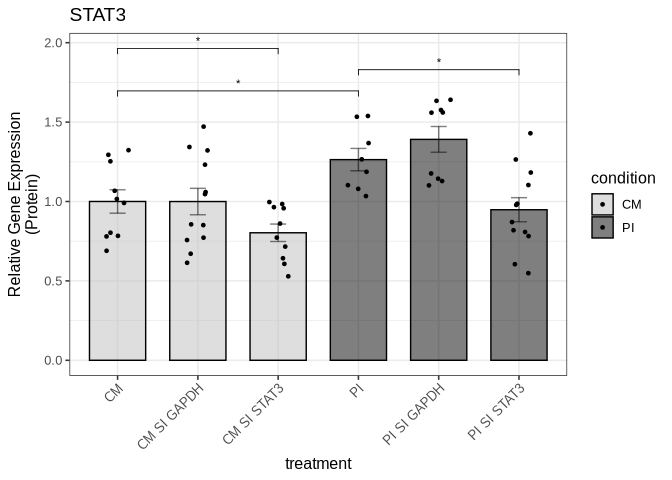

We save the figure to a PDF file in the Figure4 directory:

``` r
ggsave("output/Figure4/fig4d_stat3_protein.pdf", fig4d, 
       width = 3, height = 6, dpi = 300, useDingbats=FALSE)
```

#### Figure 4e (ETS2 protein expression levels)

We do the same for ETS2 protein levels:

``` r
fig4_ets2_protein_data <- read_xlsx("input/Figure4_data.xlsx", sheet = "ETS2_protein_20250701")
```

``` r
fig4_ets2_protein_result <- compare_protein_ratio(
  fig4_ets2_protein_data,
  group_col = "treatment",
  gene_name = "ets2",
  control_group = "CM",
  wilcox_pairs = list(c("CM", "PI"), c("PI", "PI SI STAT3"),
                      c("CM", "CM SI STAT3"))
)
```

``` r
fig4_ets2_protein_result$wilcox_results
```

    # A tibble: 3 × 4
      group1 group2      p.value statistic
      <chr>  <chr>         <dbl>     <dbl>
    1 CM     PI          0.0411         31
    2 PI     PI SI STAT3 0.00216         0
    3 CM     CM SI STAT3 0.00866         2

``` r
fig4_ets2_protein_result$all_wilcox_table
```

<div id="aepbyguqjp" style="padding-left:0px;padding-right:0px;padding-top:10px;padding-bottom:10px;overflow-x:auto;overflow-y:auto;width:auto;height:auto;">
<style>#aepbyguqjp table {
  font-family: system-ui, 'Segoe UI', Roboto, Helvetica, Arial, sans-serif, 'Apple Color Emoji', 'Segoe UI Emoji', 'Segoe UI Symbol', 'Noto Color Emoji';
  -webkit-font-smoothing: antialiased;
  -moz-osx-font-smoothing: grayscale;
}

#aepbyguqjp thead, #aepbyguqjp tbody, #aepbyguqjp tfoot, #aepbyguqjp tr, #aepbyguqjp td, #aepbyguqjp th {
  border-style: none;
}

#aepbyguqjp p {
  margin: 0;
  padding: 0;
}

#aepbyguqjp .gt_table {
  display: table;
  border-collapse: collapse;
  line-height: normal;
  margin-left: auto;
  margin-right: auto;
  color: #333333;
  font-size: 16px;
  font-weight: normal;
  font-style: normal;
  background-color: #FFFFFF;
  width: auto;
  border-top-style: solid;
  border-top-width: 2px;
  border-top-color: #A8A8A8;
  border-right-style: none;
  border-right-width: 2px;
  border-right-color: #D3D3D3;
  border-bottom-style: solid;
  border-bottom-width: 2px;
  border-bottom-color: #A8A8A8;
  border-left-style: none;
  border-left-width: 2px;
  border-left-color: #D3D3D3;
}

#aepbyguqjp .gt_caption {
  padding-top: 4px;
  padding-bottom: 4px;
}

#aepbyguqjp .gt_title {
  color: #333333;
  font-size: 125%;
  font-weight: initial;
  padding-top: 4px;
  padding-bottom: 4px;
  padding-left: 5px;
  padding-right: 5px;
  border-bottom-color: #FFFFFF;
  border-bottom-width: 0;
}

#aepbyguqjp .gt_subtitle {
  color: #333333;
  font-size: 85%;
  font-weight: initial;
  padding-top: 3px;
  padding-bottom: 5px;
  padding-left: 5px;
  padding-right: 5px;
  border-top-color: #FFFFFF;
  border-top-width: 0;
}

#aepbyguqjp .gt_heading {
  background-color: #FFFFFF;
  text-align: center;
  border-bottom-color: #FFFFFF;
  border-left-style: none;
  border-left-width: 1px;
  border-left-color: #D3D3D3;
  border-right-style: none;
  border-right-width: 1px;
  border-right-color: #D3D3D3;
}

#aepbyguqjp .gt_bottom_border {
  border-bottom-style: solid;
  border-bottom-width: 2px;
  border-bottom-color: #D3D3D3;
}

#aepbyguqjp .gt_col_headings {
  border-top-style: solid;
  border-top-width: 2px;
  border-top-color: #D3D3D3;
  border-bottom-style: solid;
  border-bottom-width: 2px;
  border-bottom-color: #D3D3D3;
  border-left-style: none;
  border-left-width: 1px;
  border-left-color: #D3D3D3;
  border-right-style: none;
  border-right-width: 1px;
  border-right-color: #D3D3D3;
}

#aepbyguqjp .gt_col_heading {
  color: #333333;
  background-color: #FFFFFF;
  font-size: 100%;
  font-weight: normal;
  text-transform: inherit;
  border-left-style: none;
  border-left-width: 1px;
  border-left-color: #D3D3D3;
  border-right-style: none;
  border-right-width: 1px;
  border-right-color: #D3D3D3;
  vertical-align: bottom;
  padding-top: 5px;
  padding-bottom: 6px;
  padding-left: 5px;
  padding-right: 5px;
  overflow-x: hidden;
}

#aepbyguqjp .gt_column_spanner_outer {
  color: #333333;
  background-color: #FFFFFF;
  font-size: 100%;
  font-weight: normal;
  text-transform: inherit;
  padding-top: 0;
  padding-bottom: 0;
  padding-left: 4px;
  padding-right: 4px;
}

#aepbyguqjp .gt_column_spanner_outer:first-child {
  padding-left: 0;
}

#aepbyguqjp .gt_column_spanner_outer:last-child {
  padding-right: 0;
}

#aepbyguqjp .gt_column_spanner {
  border-bottom-style: solid;
  border-bottom-width: 2px;
  border-bottom-color: #D3D3D3;
  vertical-align: bottom;
  padding-top: 5px;
  padding-bottom: 5px;
  overflow-x: hidden;
  display: inline-block;
  width: 100%;
}

#aepbyguqjp .gt_spanner_row {
  border-bottom-style: hidden;
}

#aepbyguqjp .gt_group_heading {
  padding-top: 8px;
  padding-bottom: 8px;
  padding-left: 5px;
  padding-right: 5px;
  color: #333333;
  background-color: #FFFFFF;
  font-size: 100%;
  font-weight: initial;
  text-transform: inherit;
  border-top-style: solid;
  border-top-width: 2px;
  border-top-color: #D3D3D3;
  border-bottom-style: solid;
  border-bottom-width: 2px;
  border-bottom-color: #D3D3D3;
  border-left-style: none;
  border-left-width: 1px;
  border-left-color: #D3D3D3;
  border-right-style: none;
  border-right-width: 1px;
  border-right-color: #D3D3D3;
  vertical-align: middle;
  text-align: left;
}

#aepbyguqjp .gt_empty_group_heading {
  padding: 0.5px;
  color: #333333;
  background-color: #FFFFFF;
  font-size: 100%;
  font-weight: initial;
  border-top-style: solid;
  border-top-width: 2px;
  border-top-color: #D3D3D3;
  border-bottom-style: solid;
  border-bottom-width: 2px;
  border-bottom-color: #D3D3D3;
  vertical-align: middle;
}

#aepbyguqjp .gt_from_md > :first-child {
  margin-top: 0;
}

#aepbyguqjp .gt_from_md > :last-child {
  margin-bottom: 0;
}

#aepbyguqjp .gt_row {
  padding-top: 8px;
  padding-bottom: 8px;
  padding-left: 5px;
  padding-right: 5px;
  margin: 10px;
  border-top-style: solid;
  border-top-width: 1px;
  border-top-color: #D3D3D3;
  border-left-style: none;
  border-left-width: 1px;
  border-left-color: #D3D3D3;
  border-right-style: none;
  border-right-width: 1px;
  border-right-color: #D3D3D3;
  vertical-align: middle;
  overflow-x: hidden;
}

#aepbyguqjp .gt_stub {
  color: #333333;
  background-color: #FFFFFF;
  font-size: 100%;
  font-weight: initial;
  text-transform: inherit;
  border-right-style: solid;
  border-right-width: 2px;
  border-right-color: #D3D3D3;
  padding-left: 5px;
  padding-right: 5px;
}

#aepbyguqjp .gt_stub_row_group {
  color: #333333;
  background-color: #FFFFFF;
  font-size: 100%;
  font-weight: initial;
  text-transform: inherit;
  border-right-style: solid;
  border-right-width: 2px;
  border-right-color: #D3D3D3;
  padding-left: 5px;
  padding-right: 5px;
  vertical-align: top;
}

#aepbyguqjp .gt_row_group_first td {
  border-top-width: 2px;
}

#aepbyguqjp .gt_row_group_first th {
  border-top-width: 2px;
}

#aepbyguqjp .gt_summary_row {
  color: #333333;
  background-color: #FFFFFF;
  text-transform: inherit;
  padding-top: 8px;
  padding-bottom: 8px;
  padding-left: 5px;
  padding-right: 5px;
}

#aepbyguqjp .gt_first_summary_row {
  border-top-style: solid;
  border-top-color: #D3D3D3;
}

#aepbyguqjp .gt_first_summary_row.thick {
  border-top-width: 2px;
}

#aepbyguqjp .gt_last_summary_row {
  padding-top: 8px;
  padding-bottom: 8px;
  padding-left: 5px;
  padding-right: 5px;
  border-bottom-style: solid;
  border-bottom-width: 2px;
  border-bottom-color: #D3D3D3;
}

#aepbyguqjp .gt_grand_summary_row {
  color: #333333;
  background-color: #FFFFFF;
  text-transform: inherit;
  padding-top: 8px;
  padding-bottom: 8px;
  padding-left: 5px;
  padding-right: 5px;
}

#aepbyguqjp .gt_first_grand_summary_row {
  padding-top: 8px;
  padding-bottom: 8px;
  padding-left: 5px;
  padding-right: 5px;
  border-top-style: double;
  border-top-width: 6px;
  border-top-color: #D3D3D3;
}

#aepbyguqjp .gt_last_grand_summary_row_top {
  padding-top: 8px;
  padding-bottom: 8px;
  padding-left: 5px;
  padding-right: 5px;
  border-bottom-style: double;
  border-bottom-width: 6px;
  border-bottom-color: #D3D3D3;
}

#aepbyguqjp .gt_striped {
  background-color: rgba(128, 128, 128, 0.05);
}

#aepbyguqjp .gt_table_body {
  border-top-style: solid;
  border-top-width: 2px;
  border-top-color: #D3D3D3;
  border-bottom-style: solid;
  border-bottom-width: 2px;
  border-bottom-color: #D3D3D3;
}

#aepbyguqjp .gt_footnotes {
  color: #333333;
  background-color: #FFFFFF;
  border-bottom-style: none;
  border-bottom-width: 2px;
  border-bottom-color: #D3D3D3;
  border-left-style: none;
  border-left-width: 2px;
  border-left-color: #D3D3D3;
  border-right-style: none;
  border-right-width: 2px;
  border-right-color: #D3D3D3;
}

#aepbyguqjp .gt_footnote {
  margin: 0px;
  font-size: 90%;
  padding-top: 4px;
  padding-bottom: 4px;
  padding-left: 5px;
  padding-right: 5px;
}

#aepbyguqjp .gt_sourcenotes {
  color: #333333;
  background-color: #FFFFFF;
  border-bottom-style: none;
  border-bottom-width: 2px;
  border-bottom-color: #D3D3D3;
  border-left-style: none;
  border-left-width: 2px;
  border-left-color: #D3D3D3;
  border-right-style: none;
  border-right-width: 2px;
  border-right-color: #D3D3D3;
}

#aepbyguqjp .gt_sourcenote {
  font-size: 90%;
  padding-top: 4px;
  padding-bottom: 4px;
  padding-left: 5px;
  padding-right: 5px;
}

#aepbyguqjp .gt_left {
  text-align: left;
}

#aepbyguqjp .gt_center {
  text-align: center;
}

#aepbyguqjp .gt_right {
  text-align: right;
  font-variant-numeric: tabular-nums;
}

#aepbyguqjp .gt_font_normal {
  font-weight: normal;
}

#aepbyguqjp .gt_font_bold {
  font-weight: bold;
}

#aepbyguqjp .gt_font_italic {
  font-style: italic;
}

#aepbyguqjp .gt_super {
  font-size: 65%;
}

#aepbyguqjp .gt_footnote_marks {
  font-size: 75%;
  vertical-align: 0.4em;
  position: initial;
}

#aepbyguqjp .gt_asterisk {
  font-size: 100%;
  vertical-align: 0;
}

#aepbyguqjp .gt_indent_1 {
  text-indent: 5px;
}

#aepbyguqjp .gt_indent_2 {
  text-indent: 10px;
}

#aepbyguqjp .gt_indent_3 {
  text-indent: 15px;
}

#aepbyguqjp .gt_indent_4 {
  text-indent: 20px;
}

#aepbyguqjp .gt_indent_5 {
  text-indent: 25px;
}
</style>
<table class="gt_table" data-quarto-disable-processing="false" data-quarto-bootstrap="false">
  <thead>
    <tr class="gt_col_headings">
      <th class="gt_col_heading gt_columns_bottom_border gt_left" rowspan="1" colspan="1" scope="col" id="Comparison">Comparison</th>
      <th class="gt_col_heading gt_columns_bottom_border gt_right" rowspan="1" colspan="1" scope="col" id="Statistic">Statistic</th>
      <th class="gt_col_heading gt_columns_bottom_border gt_right" rowspan="1" colspan="1" scope="col" id="P_value">P_value</th>
      <th class="gt_col_heading gt_columns_bottom_border gt_left" rowspan="1" colspan="1" scope="col" id="Significant">Significant</th>
    </tr>
  </thead>
  <tbody class="gt_table_body">
    <tr><td headers="Comparison" class="gt_row gt_left">CM vs CM SI GAPDH</td>
<td headers="Statistic" class="gt_row gt_right">15</td>
<td headers="P_value" class="gt_row gt_right">0.6991</td>
<td headers="Significant" class="gt_row gt_left">No</td></tr>
    <tr><td headers="Comparison" class="gt_row gt_left" style="background-color: rgba(204,230,255,0.8); color: #000000; font-weight: bold;">CM vs CM SI STAT3</td>
<td headers="Statistic" class="gt_row gt_right" style="background-color: rgba(204,230,255,0.8); color: #000000; font-weight: bold;">2</td>
<td headers="P_value" class="gt_row gt_right" style="background-color: rgba(204,230,255,0.8); color: #000000; font-weight: bold;">0.0087</td>
<td headers="Significant" class="gt_row gt_left" style="background-color: rgba(204,230,255,0.8); color: #000000; font-weight: bold;">Yes</td></tr>
    <tr><td headers="Comparison" class="gt_row gt_left" style="background-color: rgba(204,230,255,0.8); color: #000000; font-weight: bold;">CM vs PI</td>
<td headers="Statistic" class="gt_row gt_right" style="background-color: rgba(204,230,255,0.8); color: #000000; font-weight: bold;">31</td>
<td headers="P_value" class="gt_row gt_right" style="background-color: rgba(204,230,255,0.8); color: #000000; font-weight: bold;">0.0411</td>
<td headers="Significant" class="gt_row gt_left" style="background-color: rgba(204,230,255,0.8); color: #000000; font-weight: bold;">Yes</td></tr>
    <tr><td headers="Comparison" class="gt_row gt_left">CM vs PI SI GAPDH</td>
<td headers="Statistic" class="gt_row gt_right">9</td>
<td headers="P_value" class="gt_row gt_right">0.3290</td>
<td headers="Significant" class="gt_row gt_left">No</td></tr>
    <tr><td headers="Comparison" class="gt_row gt_left" style="background-color: rgba(204,230,255,0.8); color: #000000; font-weight: bold;">CM vs PI SI STAT3</td>
<td headers="Statistic" class="gt_row gt_right" style="background-color: rgba(204,230,255,0.8); color: #000000; font-weight: bold;">3</td>
<td headers="P_value" class="gt_row gt_right" style="background-color: rgba(204,230,255,0.8); color: #000000; font-weight: bold;">0.0152</td>
<td headers="Significant" class="gt_row gt_left" style="background-color: rgba(204,230,255,0.8); color: #000000; font-weight: bold;">Yes</td></tr>
    <tr><td headers="Comparison" class="gt_row gt_left">CM SI GAPDH vs CM SI STAT3</td>
<td headers="Statistic" class="gt_row gt_right">6</td>
<td headers="P_value" class="gt_row gt_right">0.0649</td>
<td headers="Significant" class="gt_row gt_left">No</td></tr>
    <tr><td headers="Comparison" class="gt_row gt_left">CM SI GAPDH vs PI</td>
<td headers="Statistic" class="gt_row gt_right">30</td>
<td headers="P_value" class="gt_row gt_right">0.0649</td>
<td headers="Significant" class="gt_row gt_left">No</td></tr>
    <tr><td headers="Comparison" class="gt_row gt_left">CM SI GAPDH vs PI SI GAPDH</td>
<td headers="Statistic" class="gt_row gt_right">12</td>
<td headers="P_value" class="gt_row gt_right">0.6623</td>
<td headers="Significant" class="gt_row gt_left">No</td></tr>
    <tr><td headers="Comparison" class="gt_row gt_left">CM SI GAPDH vs PI SI STAT3</td>
<td headers="Statistic" class="gt_row gt_right">6</td>
<td headers="P_value" class="gt_row gt_right">0.0649</td>
<td headers="Significant" class="gt_row gt_left">No</td></tr>
    <tr><td headers="Comparison" class="gt_row gt_left" style="background-color: rgba(204,230,255,0.8); color: #000000; font-weight: bold;">CM SI STAT3 vs PI</td>
<td headers="Statistic" class="gt_row gt_right" style="background-color: rgba(204,230,255,0.8); color: #000000; font-weight: bold;">36</td>
<td headers="P_value" class="gt_row gt_right" style="background-color: rgba(204,230,255,0.8); color: #000000; font-weight: bold;">0.0022</td>
<td headers="Significant" class="gt_row gt_left" style="background-color: rgba(204,230,255,0.8); color: #000000; font-weight: bold;">Yes</td></tr>
    <tr><td headers="Comparison" class="gt_row gt_left">CM SI STAT3 vs PI SI GAPDH</td>
<td headers="Statistic" class="gt_row gt_right">26</td>
<td headers="P_value" class="gt_row gt_right">0.0519</td>
<td headers="Significant" class="gt_row gt_left">No</td></tr>
    <tr><td headers="Comparison" class="gt_row gt_left">CM SI STAT3 vs PI SI STAT3</td>
<td headers="Statistic" class="gt_row gt_right">15</td>
<td headers="P_value" class="gt_row gt_right">0.6991</td>
<td headers="Significant" class="gt_row gt_left">No</td></tr>
    <tr><td headers="Comparison" class="gt_row gt_left" style="background-color: rgba(204,230,255,0.8); color: #000000; font-weight: bold;">PI vs PI SI GAPDH</td>
<td headers="Statistic" class="gt_row gt_right" style="background-color: rgba(204,230,255,0.8); color: #000000; font-weight: bold;">0</td>
<td headers="P_value" class="gt_row gt_right" style="background-color: rgba(204,230,255,0.8); color: #000000; font-weight: bold;">0.0043</td>
<td headers="Significant" class="gt_row gt_left" style="background-color: rgba(204,230,255,0.8); color: #000000; font-weight: bold;">Yes</td></tr>
    <tr><td headers="Comparison" class="gt_row gt_left" style="background-color: rgba(204,230,255,0.8); color: #000000; font-weight: bold;">PI vs PI SI STAT3</td>
<td headers="Statistic" class="gt_row gt_right" style="background-color: rgba(204,230,255,0.8); color: #000000; font-weight: bold;">0</td>
<td headers="P_value" class="gt_row gt_right" style="background-color: rgba(204,230,255,0.8); color: #000000; font-weight: bold;">0.0022</td>
<td headers="Significant" class="gt_row gt_left" style="background-color: rgba(204,230,255,0.8); color: #000000; font-weight: bold;">Yes</td></tr>
    <tr><td headers="Comparison" class="gt_row gt_left">PI SI GAPDH vs PI SI STAT3</td>
<td headers="Statistic" class="gt_row gt_right">6</td>
<td headers="P_value" class="gt_row gt_right">0.1255</td>
<td headers="Significant" class="gt_row gt_left">No</td></tr>
  </tbody>
  
  
</table>
</div>

``` r
fig4e <- fig4_ets2_protein_result$p
```

``` r
fig4e
```


We create the composite Figure 4:

``` r
composite_fig4 <- plot_grid(fig4a, fig4d, fig4b, fig4e, fig4c, fig4c,
                            ncol = 2, nrow = 3, 
                            labels = c("A", "D", "B", "E", "C", "F"), 
                            label_size = 12, 
                            align = "v")
```

``` r
composite_fig4
```

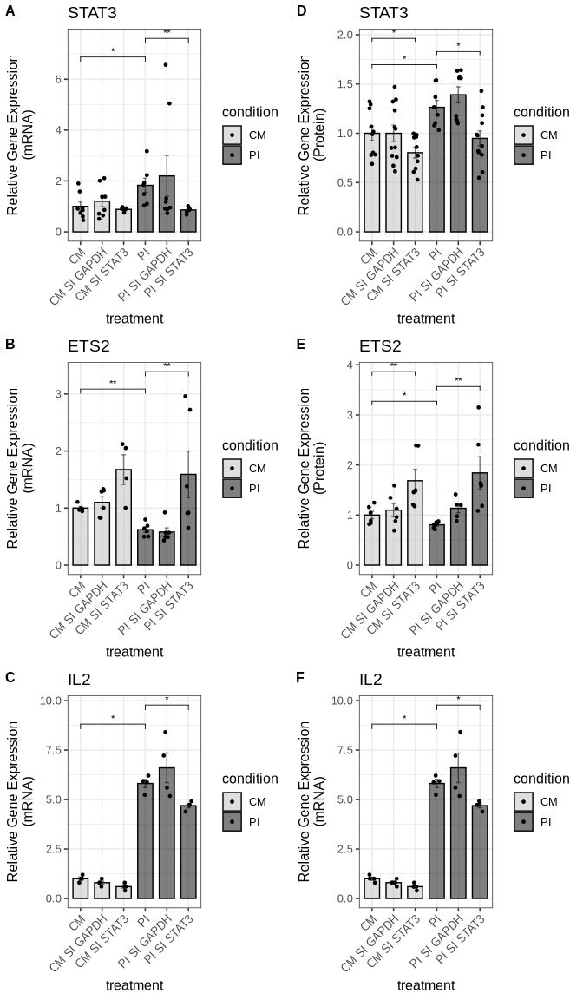

``` r
ggsave("output/Figure4/composite_fig4.pdf", composite_fig4, 
       width = 7, height = 12, dpi = 300)
```

### Figure 5

#### IL6 promoter STAT3

We import the data for IL6_promoter_control_STAT3:

``` r
fig5_il6_promoter_stat3_data <- read_xlsx("input/Figure5_data.xlsx", sheet = "IL6_prom_control_STAT3_20250709")
```

We compare the STAT3 binding to the IL6 promoter between the two
conditions:

``` r
fig5_il6_promoter_stat3_result <- compare_chipseq_groups(
  fig5_il6_promoter_stat3_data,
  group_col = "treatment",
  gene_col = "stat3",
  control_col = "control",
  control_group = "CM",
  wilcox_pairs = list(c("CM_STAT3", "PI_STAT3"), c("PI", "PI_STAT3"))
)
```

We check the results of the statistical tests:

``` r
fig5_il6_promoter_stat3_result$wilcox_results
```

    # A tibble: 2 × 4
      group1   group2   p.value statistic
      <chr>    <chr>      <dbl>     <dbl>
    1 CM_STAT3 PI_STAT3  0.0286         0
    2 PI       PI_STAT3  0.0286         0

We check the results of all the statistical tests:

``` r
fig5_il6_promoter_stat3_result$all_wilcox_table
```

<div id="bngnjphxar" style="padding-left:0px;padding-right:0px;padding-top:10px;padding-bottom:10px;overflow-x:auto;overflow-y:auto;width:auto;height:auto;">
<style>#bngnjphxar table {
  font-family: system-ui, 'Segoe UI', Roboto, Helvetica, Arial, sans-serif, 'Apple Color Emoji', 'Segoe UI Emoji', 'Segoe UI Symbol', 'Noto Color Emoji';
  -webkit-font-smoothing: antialiased;
  -moz-osx-font-smoothing: grayscale;
}

#bngnjphxar thead, #bngnjphxar tbody, #bngnjphxar tfoot, #bngnjphxar tr, #bngnjphxar td, #bngnjphxar th {
  border-style: none;
}

#bngnjphxar p {
  margin: 0;
  padding: 0;
}

#bngnjphxar .gt_table {
  display: table;
  border-collapse: collapse;
  line-height: normal;
  margin-left: auto;
  margin-right: auto;
  color: #333333;
  font-size: 16px;
  font-weight: normal;
  font-style: normal;
  background-color: #FFFFFF;
  width: auto;
  border-top-style: solid;
  border-top-width: 2px;
  border-top-color: #A8A8A8;
  border-right-style: none;
  border-right-width: 2px;
  border-right-color: #D3D3D3;
  border-bottom-style: solid;
  border-bottom-width: 2px;
  border-bottom-color: #A8A8A8;
  border-left-style: none;
  border-left-width: 2px;
  border-left-color: #D3D3D3;
}

#bngnjphxar .gt_caption {
  padding-top: 4px;
  padding-bottom: 4px;
}

#bngnjphxar .gt_title {
  color: #333333;
  font-size: 125%;
  font-weight: initial;
  padding-top: 4px;
  padding-bottom: 4px;
  padding-left: 5px;
  padding-right: 5px;
  border-bottom-color: #FFFFFF;
  border-bottom-width: 0;
}

#bngnjphxar .gt_subtitle {
  color: #333333;
  font-size: 85%;
  font-weight: initial;
  padding-top: 3px;
  padding-bottom: 5px;
  padding-left: 5px;
  padding-right: 5px;
  border-top-color: #FFFFFF;
  border-top-width: 0;
}

#bngnjphxar .gt_heading {
  background-color: #FFFFFF;
  text-align: center;
  border-bottom-color: #FFFFFF;
  border-left-style: none;
  border-left-width: 1px;
  border-left-color: #D3D3D3;
  border-right-style: none;
  border-right-width: 1px;
  border-right-color: #D3D3D3;
}

#bngnjphxar .gt_bottom_border {
  border-bottom-style: solid;
  border-bottom-width: 2px;
  border-bottom-color: #D3D3D3;
}

#bngnjphxar .gt_col_headings {
  border-top-style: solid;
  border-top-width: 2px;
  border-top-color: #D3D3D3;
  border-bottom-style: solid;
  border-bottom-width: 2px;
  border-bottom-color: #D3D3D3;
  border-left-style: none;
  border-left-width: 1px;
  border-left-color: #D3D3D3;
  border-right-style: none;
  border-right-width: 1px;
  border-right-color: #D3D3D3;
}

#bngnjphxar .gt_col_heading {
  color: #333333;
  background-color: #FFFFFF;
  font-size: 100%;
  font-weight: normal;
  text-transform: inherit;
  border-left-style: none;
  border-left-width: 1px;
  border-left-color: #D3D3D3;
  border-right-style: none;
  border-right-width: 1px;
  border-right-color: #D3D3D3;
  vertical-align: bottom;
  padding-top: 5px;
  padding-bottom: 6px;
  padding-left: 5px;
  padding-right: 5px;
  overflow-x: hidden;
}

#bngnjphxar .gt_column_spanner_outer {
  color: #333333;
  background-color: #FFFFFF;
  font-size: 100%;
  font-weight: normal;
  text-transform: inherit;
  padding-top: 0;
  padding-bottom: 0;
  padding-left: 4px;
  padding-right: 4px;
}

#bngnjphxar .gt_column_spanner_outer:first-child {
  padding-left: 0;
}

#bngnjphxar .gt_column_spanner_outer:last-child {
  padding-right: 0;
}

#bngnjphxar .gt_column_spanner {
  border-bottom-style: solid;
  border-bottom-width: 2px;
  border-bottom-color: #D3D3D3;
  vertical-align: bottom;
  padding-top: 5px;
  padding-bottom: 5px;
  overflow-x: hidden;
  display: inline-block;
  width: 100%;
}

#bngnjphxar .gt_spanner_row {
  border-bottom-style: hidden;
}

#bngnjphxar .gt_group_heading {
  padding-top: 8px;
  padding-bottom: 8px;
  padding-left: 5px;
  padding-right: 5px;
  color: #333333;
  background-color: #FFFFFF;
  font-size: 100%;
  font-weight: initial;
  text-transform: inherit;
  border-top-style: solid;
  border-top-width: 2px;
  border-top-color: #D3D3D3;
  border-bottom-style: solid;
  border-bottom-width: 2px;
  border-bottom-color: #D3D3D3;
  border-left-style: none;
  border-left-width: 1px;
  border-left-color: #D3D3D3;
  border-right-style: none;
  border-right-width: 1px;
  border-right-color: #D3D3D3;
  vertical-align: middle;
  text-align: left;
}

#bngnjphxar .gt_empty_group_heading {
  padding: 0.5px;
  color: #333333;
  background-color: #FFFFFF;
  font-size: 100%;
  font-weight: initial;
  border-top-style: solid;
  border-top-width: 2px;
  border-top-color: #D3D3D3;
  border-bottom-style: solid;
  border-bottom-width: 2px;
  border-bottom-color: #D3D3D3;
  vertical-align: middle;
}

#bngnjphxar .gt_from_md > :first-child {
  margin-top: 0;
}

#bngnjphxar .gt_from_md > :last-child {
  margin-bottom: 0;
}

#bngnjphxar .gt_row {
  padding-top: 8px;
  padding-bottom: 8px;
  padding-left: 5px;
  padding-right: 5px;
  margin: 10px;
  border-top-style: solid;
  border-top-width: 1px;
  border-top-color: #D3D3D3;
  border-left-style: none;
  border-left-width: 1px;
  border-left-color: #D3D3D3;
  border-right-style: none;
  border-right-width: 1px;
  border-right-color: #D3D3D3;
  vertical-align: middle;
  overflow-x: hidden;
}

#bngnjphxar .gt_stub {
  color: #333333;
  background-color: #FFFFFF;
  font-size: 100%;
  font-weight: initial;
  text-transform: inherit;
  border-right-style: solid;
  border-right-width: 2px;
  border-right-color: #D3D3D3;
  padding-left: 5px;
  padding-right: 5px;
}

#bngnjphxar .gt_stub_row_group {
  color: #333333;
  background-color: #FFFFFF;
  font-size: 100%;
  font-weight: initial;
  text-transform: inherit;
  border-right-style: solid;
  border-right-width: 2px;
  border-right-color: #D3D3D3;
  padding-left: 5px;
  padding-right: 5px;
  vertical-align: top;
}

#bngnjphxar .gt_row_group_first td {
  border-top-width: 2px;
}

#bngnjphxar .gt_row_group_first th {
  border-top-width: 2px;
}

#bngnjphxar .gt_summary_row {
  color: #333333;
  background-color: #FFFFFF;
  text-transform: inherit;
  padding-top: 8px;
  padding-bottom: 8px;
  padding-left: 5px;
  padding-right: 5px;
}

#bngnjphxar .gt_first_summary_row {
  border-top-style: solid;
  border-top-color: #D3D3D3;
}

#bngnjphxar .gt_first_summary_row.thick {
  border-top-width: 2px;
}

#bngnjphxar .gt_last_summary_row {
  padding-top: 8px;
  padding-bottom: 8px;
  padding-left: 5px;
  padding-right: 5px;
  border-bottom-style: solid;
  border-bottom-width: 2px;
  border-bottom-color: #D3D3D3;
}

#bngnjphxar .gt_grand_summary_row {
  color: #333333;
  background-color: #FFFFFF;
  text-transform: inherit;
  padding-top: 8px;
  padding-bottom: 8px;
  padding-left: 5px;
  padding-right: 5px;
}

#bngnjphxar .gt_first_grand_summary_row {
  padding-top: 8px;
  padding-bottom: 8px;
  padding-left: 5px;
  padding-right: 5px;
  border-top-style: double;
  border-top-width: 6px;
  border-top-color: #D3D3D3;
}

#bngnjphxar .gt_last_grand_summary_row_top {
  padding-top: 8px;
  padding-bottom: 8px;
  padding-left: 5px;
  padding-right: 5px;
  border-bottom-style: double;
  border-bottom-width: 6px;
  border-bottom-color: #D3D3D3;
}

#bngnjphxar .gt_striped {
  background-color: rgba(128, 128, 128, 0.05);
}

#bngnjphxar .gt_table_body {
  border-top-style: solid;
  border-top-width: 2px;
  border-top-color: #D3D3D3;
  border-bottom-style: solid;
  border-bottom-width: 2px;
  border-bottom-color: #D3D3D3;
}

#bngnjphxar .gt_footnotes {
  color: #333333;
  background-color: #FFFFFF;
  border-bottom-style: none;
  border-bottom-width: 2px;
  border-bottom-color: #D3D3D3;
  border-left-style: none;
  border-left-width: 2px;
  border-left-color: #D3D3D3;
  border-right-style: none;
  border-right-width: 2px;
  border-right-color: #D3D3D3;
}

#bngnjphxar .gt_footnote {
  margin: 0px;
  font-size: 90%;
  padding-top: 4px;
  padding-bottom: 4px;
  padding-left: 5px;
  padding-right: 5px;
}

#bngnjphxar .gt_sourcenotes {
  color: #333333;
  background-color: #FFFFFF;
  border-bottom-style: none;
  border-bottom-width: 2px;
  border-bottom-color: #D3D3D3;
  border-left-style: none;
  border-left-width: 2px;
  border-left-color: #D3D3D3;
  border-right-style: none;
  border-right-width: 2px;
  border-right-color: #D3D3D3;
}

#bngnjphxar .gt_sourcenote {
  font-size: 90%;
  padding-top: 4px;
  padding-bottom: 4px;
  padding-left: 5px;
  padding-right: 5px;
}

#bngnjphxar .gt_left {
  text-align: left;
}

#bngnjphxar .gt_center {
  text-align: center;
}

#bngnjphxar .gt_right {
  text-align: right;
  font-variant-numeric: tabular-nums;
}

#bngnjphxar .gt_font_normal {
  font-weight: normal;
}

#bngnjphxar .gt_font_bold {
  font-weight: bold;
}

#bngnjphxar .gt_font_italic {
  font-style: italic;
}

#bngnjphxar .gt_super {
  font-size: 65%;
}

#bngnjphxar .gt_footnote_marks {
  font-size: 75%;
  vertical-align: 0.4em;
  position: initial;
}

#bngnjphxar .gt_asterisk {
  font-size: 100%;
  vertical-align: 0;
}

#bngnjphxar .gt_indent_1 {
  text-indent: 5px;
}

#bngnjphxar .gt_indent_2 {
  text-indent: 10px;
}

#bngnjphxar .gt_indent_3 {
  text-indent: 15px;
}

#bngnjphxar .gt_indent_4 {
  text-indent: 20px;
}

#bngnjphxar .gt_indent_5 {
  text-indent: 25px;
}
</style>
<table class="gt_table" data-quarto-disable-processing="false" data-quarto-bootstrap="false">
  <thead>
    <tr class="gt_col_headings">
      <th class="gt_col_heading gt_columns_bottom_border gt_left" rowspan="1" colspan="1" scope="col" id="Comparison">Comparison</th>
      <th class="gt_col_heading gt_columns_bottom_border gt_right" rowspan="1" colspan="1" scope="col" id="Statistic">Statistic</th>
      <th class="gt_col_heading gt_columns_bottom_border gt_right" rowspan="1" colspan="1" scope="col" id="P_value">P_value</th>
      <th class="gt_col_heading gt_columns_bottom_border gt_left" rowspan="1" colspan="1" scope="col" id="Significant">Significant</th>
    </tr>
  </thead>
  <tbody class="gt_table_body">
    <tr><td headers="Comparison" class="gt_row gt_left" style="background-color: rgba(204,230,255,0.8); color: #000000; font-weight: bold;">CM vs CM_STAT3</td>
<td headers="Statistic" class="gt_row gt_right" style="background-color: rgba(204,230,255,0.8); color: #000000; font-weight: bold;">16</td>
<td headers="P_value" class="gt_row gt_right" style="background-color: rgba(204,230,255,0.8); color: #000000; font-weight: bold;">0.0286</td>
<td headers="Significant" class="gt_row gt_left" style="background-color: rgba(204,230,255,0.8); color: #000000; font-weight: bold;">Yes</td></tr>
    <tr><td headers="Comparison" class="gt_row gt_left">CM vs PI</td>
<td headers="Statistic" class="gt_row gt_right">2</td>
<td headers="P_value" class="gt_row gt_right">0.1143</td>
<td headers="Significant" class="gt_row gt_left">No</td></tr>
    <tr><td headers="Comparison" class="gt_row gt_left" style="background-color: rgba(204,230,255,0.8); color: #000000; font-weight: bold;">CM vs PI_STAT3</td>
<td headers="Statistic" class="gt_row gt_right" style="background-color: rgba(204,230,255,0.8); color: #000000; font-weight: bold;">0</td>
<td headers="P_value" class="gt_row gt_right" style="background-color: rgba(204,230,255,0.8); color: #000000; font-weight: bold;">0.0286</td>
<td headers="Significant" class="gt_row gt_left" style="background-color: rgba(204,230,255,0.8); color: #000000; font-weight: bold;">Yes</td></tr>
    <tr><td headers="Comparison" class="gt_row gt_left" style="background-color: rgba(204,230,255,0.8); color: #000000; font-weight: bold;">CM_STAT3 vs PI</td>
<td headers="Statistic" class="gt_row gt_right" style="background-color: rgba(204,230,255,0.8); color: #000000; font-weight: bold;">0</td>
<td headers="P_value" class="gt_row gt_right" style="background-color: rgba(204,230,255,0.8); color: #000000; font-weight: bold;">0.0286</td>
<td headers="Significant" class="gt_row gt_left" style="background-color: rgba(204,230,255,0.8); color: #000000; font-weight: bold;">Yes</td></tr>
    <tr><td headers="Comparison" class="gt_row gt_left" style="background-color: rgba(204,230,255,0.8); color: #000000; font-weight: bold;">CM_STAT3 vs PI_STAT3</td>
<td headers="Statistic" class="gt_row gt_right" style="background-color: rgba(204,230,255,0.8); color: #000000; font-weight: bold;">0</td>
<td headers="P_value" class="gt_row gt_right" style="background-color: rgba(204,230,255,0.8); color: #000000; font-weight: bold;">0.0286</td>
<td headers="Significant" class="gt_row gt_left" style="background-color: rgba(204,230,255,0.8); color: #000000; font-weight: bold;">Yes</td></tr>
    <tr><td headers="Comparison" class="gt_row gt_left" style="background-color: rgba(204,230,255,0.8); color: #000000; font-weight: bold;">PI vs PI_STAT3</td>
<td headers="Statistic" class="gt_row gt_right" style="background-color: rgba(204,230,255,0.8); color: #000000; font-weight: bold;">0</td>
<td headers="P_value" class="gt_row gt_right" style="background-color: rgba(204,230,255,0.8); color: #000000; font-weight: bold;">0.0286</td>
<td headers="Significant" class="gt_row gt_left" style="background-color: rgba(204,230,255,0.8); color: #000000; font-weight: bold;">Yes</td></tr>
  </tbody>
  
  
</table>
</div>

We get the graph:

``` r
fig5g <- fig5_il6_promoter_stat3_result$p
```

``` r
fig5g
```

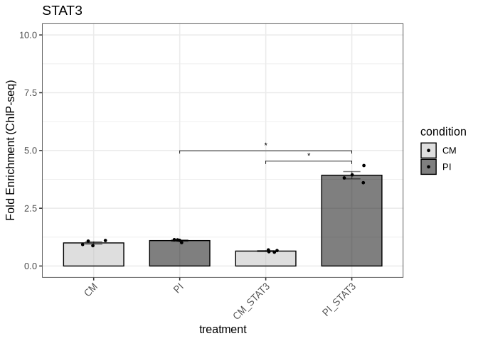

We export the figure to a PDF file in the Figure5 directory:

``` r
ggsave("output/Figure5/fig5g_il6_promoter_stat3.pdf", fig5g, 
       width = 3, height = 6, dpi = 300, useDingbats=FALSE)
```

#### IL6 promoter-STAT3P

We import the data for IL6_promoter_control_pSTAT3:

``` r
fig5_il6_promoter_pstat3_data <- read_xlsx("input/Figure5_data.xlsx", sheet = "IL6_promoter_control_STAT3P")
```

``` r
fig5_il6_promoter_pstat3_result <- compare_chipseq_groups(
  fig5_il6_promoter_pstat3_data,
  group_col = "treatment",
  gene_col = "stat3p",
  control_col = "control",
  control_group = "CM",
  wilcox_pairs = list(c("CM_STAT3P", "PI_STAT3P"), 
                      c("PI", "PI_STAT3P")) 
)
```

We check the results of the statistical tests:

``` r
fig5_il6_promoter_pstat3_result$wilcox_results
```

    # A tibble: 2 × 4
      group1    group2    p.value statistic
      <chr>     <chr>       <dbl>     <dbl>
    1 CM_STAT3P PI_STAT3P  0.0286         0
    2 PI        PI_STAT3P  0.0286         0

``` r
fig5_il6_promoter_pstat3_result$all_wilcox_table
```

<div id="urmzqndvrl" style="padding-left:0px;padding-right:0px;padding-top:10px;padding-bottom:10px;overflow-x:auto;overflow-y:auto;width:auto;height:auto;">
<style>#urmzqndvrl table {
  font-family: system-ui, 'Segoe UI', Roboto, Helvetica, Arial, sans-serif, 'Apple Color Emoji', 'Segoe UI Emoji', 'Segoe UI Symbol', 'Noto Color Emoji';
  -webkit-font-smoothing: antialiased;
  -moz-osx-font-smoothing: grayscale;
}

#urmzqndvrl thead, #urmzqndvrl tbody, #urmzqndvrl tfoot, #urmzqndvrl tr, #urmzqndvrl td, #urmzqndvrl th {
  border-style: none;
}

#urmzqndvrl p {
  margin: 0;
  padding: 0;
}

#urmzqndvrl .gt_table {
  display: table;
  border-collapse: collapse;
  line-height: normal;
  margin-left: auto;
  margin-right: auto;
  color: #333333;
  font-size: 16px;
  font-weight: normal;
  font-style: normal;
  background-color: #FFFFFF;
  width: auto;
  border-top-style: solid;
  border-top-width: 2px;
  border-top-color: #A8A8A8;
  border-right-style: none;
  border-right-width: 2px;
  border-right-color: #D3D3D3;
  border-bottom-style: solid;
  border-bottom-width: 2px;
  border-bottom-color: #A8A8A8;
  border-left-style: none;
  border-left-width: 2px;
  border-left-color: #D3D3D3;
}

#urmzqndvrl .gt_caption {
  padding-top: 4px;
  padding-bottom: 4px;
}

#urmzqndvrl .gt_title {
  color: #333333;
  font-size: 125%;
  font-weight: initial;
  padding-top: 4px;
  padding-bottom: 4px;
  padding-left: 5px;
  padding-right: 5px;
  border-bottom-color: #FFFFFF;
  border-bottom-width: 0;
}

#urmzqndvrl .gt_subtitle {
  color: #333333;
  font-size: 85%;
  font-weight: initial;
  padding-top: 3px;
  padding-bottom: 5px;
  padding-left: 5px;
  padding-right: 5px;
  border-top-color: #FFFFFF;
  border-top-width: 0;
}

#urmzqndvrl .gt_heading {
  background-color: #FFFFFF;
  text-align: center;
  border-bottom-color: #FFFFFF;
  border-left-style: none;
  border-left-width: 1px;
  border-left-color: #D3D3D3;
  border-right-style: none;
  border-right-width: 1px;
  border-right-color: #D3D3D3;
}

#urmzqndvrl .gt_bottom_border {
  border-bottom-style: solid;
  border-bottom-width: 2px;
  border-bottom-color: #D3D3D3;
}

#urmzqndvrl .gt_col_headings {
  border-top-style: solid;
  border-top-width: 2px;
  border-top-color: #D3D3D3;
  border-bottom-style: solid;
  border-bottom-width: 2px;
  border-bottom-color: #D3D3D3;
  border-left-style: none;
  border-left-width: 1px;
  border-left-color: #D3D3D3;
  border-right-style: none;
  border-right-width: 1px;
  border-right-color: #D3D3D3;
}

#urmzqndvrl .gt_col_heading {
  color: #333333;
  background-color: #FFFFFF;
  font-size: 100%;
  font-weight: normal;
  text-transform: inherit;
  border-left-style: none;
  border-left-width: 1px;
  border-left-color: #D3D3D3;
  border-right-style: none;
  border-right-width: 1px;
  border-right-color: #D3D3D3;
  vertical-align: bottom;
  padding-top: 5px;
  padding-bottom: 6px;
  padding-left: 5px;
  padding-right: 5px;
  overflow-x: hidden;
}

#urmzqndvrl .gt_column_spanner_outer {
  color: #333333;
  background-color: #FFFFFF;
  font-size: 100%;
  font-weight: normal;
  text-transform: inherit;
  padding-top: 0;
  padding-bottom: 0;
  padding-left: 4px;
  padding-right: 4px;
}

#urmzqndvrl .gt_column_spanner_outer:first-child {
  padding-left: 0;
}

#urmzqndvrl .gt_column_spanner_outer:last-child {
  padding-right: 0;
}

#urmzqndvrl .gt_column_spanner {
  border-bottom-style: solid;
  border-bottom-width: 2px;
  border-bottom-color: #D3D3D3;
  vertical-align: bottom;
  padding-top: 5px;
  padding-bottom: 5px;
  overflow-x: hidden;
  display: inline-block;
  width: 100%;
}

#urmzqndvrl .gt_spanner_row {
  border-bottom-style: hidden;
}

#urmzqndvrl .gt_group_heading {
  padding-top: 8px;
  padding-bottom: 8px;
  padding-left: 5px;
  padding-right: 5px;
  color: #333333;
  background-color: #FFFFFF;
  font-size: 100%;
  font-weight: initial;
  text-transform: inherit;
  border-top-style: solid;
  border-top-width: 2px;
  border-top-color: #D3D3D3;
  border-bottom-style: solid;
  border-bottom-width: 2px;
  border-bottom-color: #D3D3D3;
  border-left-style: none;
  border-left-width: 1px;
  border-left-color: #D3D3D3;
  border-right-style: none;
  border-right-width: 1px;
  border-right-color: #D3D3D3;
  vertical-align: middle;
  text-align: left;
}

#urmzqndvrl .gt_empty_group_heading {
  padding: 0.5px;
  color: #333333;
  background-color: #FFFFFF;
  font-size: 100%;
  font-weight: initial;
  border-top-style: solid;
  border-top-width: 2px;
  border-top-color: #D3D3D3;
  border-bottom-style: solid;
  border-bottom-width: 2px;
  border-bottom-color: #D3D3D3;
  vertical-align: middle;
}

#urmzqndvrl .gt_from_md > :first-child {
  margin-top: 0;
}

#urmzqndvrl .gt_from_md > :last-child {
  margin-bottom: 0;
}

#urmzqndvrl .gt_row {
  padding-top: 8px;
  padding-bottom: 8px;
  padding-left: 5px;
  padding-right: 5px;
  margin: 10px;
  border-top-style: solid;
  border-top-width: 1px;
  border-top-color: #D3D3D3;
  border-left-style: none;
  border-left-width: 1px;
  border-left-color: #D3D3D3;
  border-right-style: none;
  border-right-width: 1px;
  border-right-color: #D3D3D3;
  vertical-align: middle;
  overflow-x: hidden;
}

#urmzqndvrl .gt_stub {
  color: #333333;
  background-color: #FFFFFF;
  font-size: 100%;
  font-weight: initial;
  text-transform: inherit;
  border-right-style: solid;
  border-right-width: 2px;
  border-right-color: #D3D3D3;
  padding-left: 5px;
  padding-right: 5px;
}

#urmzqndvrl .gt_stub_row_group {
  color: #333333;
  background-color: #FFFFFF;
  font-size: 100%;
  font-weight: initial;
  text-transform: inherit;
  border-right-style: solid;
  border-right-width: 2px;
  border-right-color: #D3D3D3;
  padding-left: 5px;
  padding-right: 5px;
  vertical-align: top;
}

#urmzqndvrl .gt_row_group_first td {
  border-top-width: 2px;
}

#urmzqndvrl .gt_row_group_first th {
  border-top-width: 2px;
}

#urmzqndvrl .gt_summary_row {
  color: #333333;
  background-color: #FFFFFF;
  text-transform: inherit;
  padding-top: 8px;
  padding-bottom: 8px;
  padding-left: 5px;
  padding-right: 5px;
}

#urmzqndvrl .gt_first_summary_row {
  border-top-style: solid;
  border-top-color: #D3D3D3;
}

#urmzqndvrl .gt_first_summary_row.thick {
  border-top-width: 2px;
}

#urmzqndvrl .gt_last_summary_row {
  padding-top: 8px;
  padding-bottom: 8px;
  padding-left: 5px;
  padding-right: 5px;
  border-bottom-style: solid;
  border-bottom-width: 2px;
  border-bottom-color: #D3D3D3;
}

#urmzqndvrl .gt_grand_summary_row {
  color: #333333;
  background-color: #FFFFFF;
  text-transform: inherit;
  padding-top: 8px;
  padding-bottom: 8px;
  padding-left: 5px;
  padding-right: 5px;
}

#urmzqndvrl .gt_first_grand_summary_row {
  padding-top: 8px;
  padding-bottom: 8px;
  padding-left: 5px;
  padding-right: 5px;
  border-top-style: double;
  border-top-width: 6px;
  border-top-color: #D3D3D3;
}

#urmzqndvrl .gt_last_grand_summary_row_top {
  padding-top: 8px;
  padding-bottom: 8px;
  padding-left: 5px;
  padding-right: 5px;
  border-bottom-style: double;
  border-bottom-width: 6px;
  border-bottom-color: #D3D3D3;
}

#urmzqndvrl .gt_striped {
  background-color: rgba(128, 128, 128, 0.05);
}

#urmzqndvrl .gt_table_body {
  border-top-style: solid;
  border-top-width: 2px;
  border-top-color: #D3D3D3;
  border-bottom-style: solid;
  border-bottom-width: 2px;
  border-bottom-color: #D3D3D3;
}

#urmzqndvrl .gt_footnotes {
  color: #333333;
  background-color: #FFFFFF;
  border-bottom-style: none;
  border-bottom-width: 2px;
  border-bottom-color: #D3D3D3;
  border-left-style: none;
  border-left-width: 2px;
  border-left-color: #D3D3D3;
  border-right-style: none;
  border-right-width: 2px;
  border-right-color: #D3D3D3;
}

#urmzqndvrl .gt_footnote {
  margin: 0px;
  font-size: 90%;
  padding-top: 4px;
  padding-bottom: 4px;
  padding-left: 5px;
  padding-right: 5px;
}

#urmzqndvrl .gt_sourcenotes {
  color: #333333;
  background-color: #FFFFFF;
  border-bottom-style: none;
  border-bottom-width: 2px;
  border-bottom-color: #D3D3D3;
  border-left-style: none;
  border-left-width: 2px;
  border-left-color: #D3D3D3;
  border-right-style: none;
  border-right-width: 2px;
  border-right-color: #D3D3D3;
}

#urmzqndvrl .gt_sourcenote {
  font-size: 90%;
  padding-top: 4px;
  padding-bottom: 4px;
  padding-left: 5px;
  padding-right: 5px;
}

#urmzqndvrl .gt_left {
  text-align: left;
}

#urmzqndvrl .gt_center {
  text-align: center;
}

#urmzqndvrl .gt_right {
  text-align: right;
  font-variant-numeric: tabular-nums;
}

#urmzqndvrl .gt_font_normal {
  font-weight: normal;
}

#urmzqndvrl .gt_font_bold {
  font-weight: bold;
}

#urmzqndvrl .gt_font_italic {
  font-style: italic;
}

#urmzqndvrl .gt_super {
  font-size: 65%;
}

#urmzqndvrl .gt_footnote_marks {
  font-size: 75%;
  vertical-align: 0.4em;
  position: initial;
}

#urmzqndvrl .gt_asterisk {
  font-size: 100%;
  vertical-align: 0;
}

#urmzqndvrl .gt_indent_1 {
  text-indent: 5px;
}

#urmzqndvrl .gt_indent_2 {
  text-indent: 10px;
}

#urmzqndvrl .gt_indent_3 {
  text-indent: 15px;
}

#urmzqndvrl .gt_indent_4 {
  text-indent: 20px;
}

#urmzqndvrl .gt_indent_5 {
  text-indent: 25px;
}
</style>
<table class="gt_table" data-quarto-disable-processing="false" data-quarto-bootstrap="false">
  <thead>
    <tr class="gt_col_headings">
      <th class="gt_col_heading gt_columns_bottom_border gt_left" rowspan="1" colspan="1" scope="col" id="Comparison">Comparison</th>
      <th class="gt_col_heading gt_columns_bottom_border gt_right" rowspan="1" colspan="1" scope="col" id="Statistic">Statistic</th>
      <th class="gt_col_heading gt_columns_bottom_border gt_right" rowspan="1" colspan="1" scope="col" id="P_value">P_value</th>
      <th class="gt_col_heading gt_columns_bottom_border gt_left" rowspan="1" colspan="1" scope="col" id="Significant">Significant</th>
    </tr>
  </thead>
  <tbody class="gt_table_body">
    <tr><td headers="Comparison" class="gt_row gt_left">CM vs CM_STAT3P</td>
<td headers="Statistic" class="gt_row gt_right">8</td>
<td headers="P_value" class="gt_row gt_right">1.0000</td>
<td headers="Significant" class="gt_row gt_left">No</td></tr>
    <tr><td headers="Comparison" class="gt_row gt_left" style="background-color: rgba(204,230,255,0.8); color: #000000; font-weight: bold;">CM vs PI</td>
<td headers="Statistic" class="gt_row gt_right" style="background-color: rgba(204,230,255,0.8); color: #000000; font-weight: bold;">0</td>
<td headers="P_value" class="gt_row gt_right" style="background-color: rgba(204,230,255,0.8); color: #000000; font-weight: bold;">0.0286</td>
<td headers="Significant" class="gt_row gt_left" style="background-color: rgba(204,230,255,0.8); color: #000000; font-weight: bold;">Yes</td></tr>
    <tr><td headers="Comparison" class="gt_row gt_left" style="background-color: rgba(204,230,255,0.8); color: #000000; font-weight: bold;">CM vs PI_STAT3P</td>
<td headers="Statistic" class="gt_row gt_right" style="background-color: rgba(204,230,255,0.8); color: #000000; font-weight: bold;">0</td>
<td headers="P_value" class="gt_row gt_right" style="background-color: rgba(204,230,255,0.8); color: #000000; font-weight: bold;">0.0286</td>
<td headers="Significant" class="gt_row gt_left" style="background-color: rgba(204,230,255,0.8); color: #000000; font-weight: bold;">Yes</td></tr>
    <tr><td headers="Comparison" class="gt_row gt_left" style="background-color: rgba(204,230,255,0.8); color: #000000; font-weight: bold;">CM_STAT3P vs PI</td>
<td headers="Statistic" class="gt_row gt_right" style="background-color: rgba(204,230,255,0.8); color: #000000; font-weight: bold;">0</td>
<td headers="P_value" class="gt_row gt_right" style="background-color: rgba(204,230,255,0.8); color: #000000; font-weight: bold;">0.0286</td>
<td headers="Significant" class="gt_row gt_left" style="background-color: rgba(204,230,255,0.8); color: #000000; font-weight: bold;">Yes</td></tr>
    <tr><td headers="Comparison" class="gt_row gt_left" style="background-color: rgba(204,230,255,0.8); color: #000000; font-weight: bold;">CM_STAT3P vs PI_STAT3P</td>
<td headers="Statistic" class="gt_row gt_right" style="background-color: rgba(204,230,255,0.8); color: #000000; font-weight: bold;">0</td>
<td headers="P_value" class="gt_row gt_right" style="background-color: rgba(204,230,255,0.8); color: #000000; font-weight: bold;">0.0286</td>
<td headers="Significant" class="gt_row gt_left" style="background-color: rgba(204,230,255,0.8); color: #000000; font-weight: bold;">Yes</td></tr>
    <tr><td headers="Comparison" class="gt_row gt_left" style="background-color: rgba(204,230,255,0.8); color: #000000; font-weight: bold;">PI vs PI_STAT3P</td>
<td headers="Statistic" class="gt_row gt_right" style="background-color: rgba(204,230,255,0.8); color: #000000; font-weight: bold;">0</td>
<td headers="P_value" class="gt_row gt_right" style="background-color: rgba(204,230,255,0.8); color: #000000; font-weight: bold;">0.0286</td>
<td headers="Significant" class="gt_row gt_left" style="background-color: rgba(204,230,255,0.8); color: #000000; font-weight: bold;">Yes</td></tr>
  </tbody>
  
  
</table>
</div>

We get the graph:

``` r
fig5h <- fig5_il6_promoter_pstat3_result$p
```

``` r
fig5h
```

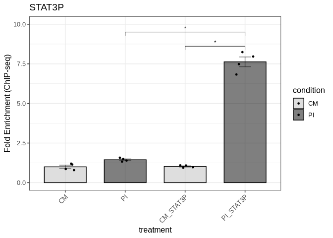

We save the figure to a PDF file in the Figure5 directory:

``` r
ggsave("output/Figure5/fig5h_il6_promoter_pstat3.pdf", fig5h, 
       width = 3, height = 6, dpi = 300, useDingbats=FALSE)
```

#### Actin promoter control STAT3

We import the data for actin_promoter_control_STAT3:

``` r
fig5_actin_promoter_stat3_data <- read_xlsx("input/Figure5_data.xlsx", sheet = "actin_promoter_control_STAT3")
```

We compare the STAT3 binding:

``` r
fig5_actin_promoter_stat3_result <- compare_chipseq_groups(
  fig5_actin_promoter_stat3_data,
  group_col = "treatment",
  gene_col = "stat3",
  control_col = "control",
  control_group = "CM"
)
```

We check the results of the statistical tests:

``` r
fig5_actin_promoter_stat3_result$all_wilcox_table
```

<div id="xlpwjcrkyl" style="padding-left:0px;padding-right:0px;padding-top:10px;padding-bottom:10px;overflow-x:auto;overflow-y:auto;width:auto;height:auto;">
<style>#xlpwjcrkyl table {
  font-family: system-ui, 'Segoe UI', Roboto, Helvetica, Arial, sans-serif, 'Apple Color Emoji', 'Segoe UI Emoji', 'Segoe UI Symbol', 'Noto Color Emoji';
  -webkit-font-smoothing: antialiased;
  -moz-osx-font-smoothing: grayscale;
}

#xlpwjcrkyl thead, #xlpwjcrkyl tbody, #xlpwjcrkyl tfoot, #xlpwjcrkyl tr, #xlpwjcrkyl td, #xlpwjcrkyl th {
  border-style: none;
}

#xlpwjcrkyl p {
  margin: 0;
  padding: 0;
}

#xlpwjcrkyl .gt_table {
  display: table;
  border-collapse: collapse;
  line-height: normal;
  margin-left: auto;
  margin-right: auto;
  color: #333333;
  font-size: 16px;
  font-weight: normal;
  font-style: normal;
  background-color: #FFFFFF;
  width: auto;
  border-top-style: solid;
  border-top-width: 2px;
  border-top-color: #A8A8A8;
  border-right-style: none;
  border-right-width: 2px;
  border-right-color: #D3D3D3;
  border-bottom-style: solid;
  border-bottom-width: 2px;
  border-bottom-color: #A8A8A8;
  border-left-style: none;
  border-left-width: 2px;
  border-left-color: #D3D3D3;
}

#xlpwjcrkyl .gt_caption {
  padding-top: 4px;
  padding-bottom: 4px;
}

#xlpwjcrkyl .gt_title {
  color: #333333;
  font-size: 125%;
  font-weight: initial;
  padding-top: 4px;
  padding-bottom: 4px;
  padding-left: 5px;
  padding-right: 5px;
  border-bottom-color: #FFFFFF;
  border-bottom-width: 0;
}

#xlpwjcrkyl .gt_subtitle {
  color: #333333;
  font-size: 85%;
  font-weight: initial;
  padding-top: 3px;
  padding-bottom: 5px;
  padding-left: 5px;
  padding-right: 5px;
  border-top-color: #FFFFFF;
  border-top-width: 0;
}

#xlpwjcrkyl .gt_heading {
  background-color: #FFFFFF;
  text-align: center;
  border-bottom-color: #FFFFFF;
  border-left-style: none;
  border-left-width: 1px;
  border-left-color: #D3D3D3;
  border-right-style: none;
  border-right-width: 1px;
  border-right-color: #D3D3D3;
}

#xlpwjcrkyl .gt_bottom_border {
  border-bottom-style: solid;
  border-bottom-width: 2px;
  border-bottom-color: #D3D3D3;
}

#xlpwjcrkyl .gt_col_headings {
  border-top-style: solid;
  border-top-width: 2px;
  border-top-color: #D3D3D3;
  border-bottom-style: solid;
  border-bottom-width: 2px;
  border-bottom-color: #D3D3D3;
  border-left-style: none;
  border-left-width: 1px;
  border-left-color: #D3D3D3;
  border-right-style: none;
  border-right-width: 1px;
  border-right-color: #D3D3D3;
}

#xlpwjcrkyl .gt_col_heading {
  color: #333333;
  background-color: #FFFFFF;
  font-size: 100%;
  font-weight: normal;
  text-transform: inherit;
  border-left-style: none;
  border-left-width: 1px;
  border-left-color: #D3D3D3;
  border-right-style: none;
  border-right-width: 1px;
  border-right-color: #D3D3D3;
  vertical-align: bottom;
  padding-top: 5px;
  padding-bottom: 6px;
  padding-left: 5px;
  padding-right: 5px;
  overflow-x: hidden;
}

#xlpwjcrkyl .gt_column_spanner_outer {
  color: #333333;
  background-color: #FFFFFF;
  font-size: 100%;
  font-weight: normal;
  text-transform: inherit;
  padding-top: 0;
  padding-bottom: 0;
  padding-left: 4px;
  padding-right: 4px;
}

#xlpwjcrkyl .gt_column_spanner_outer:first-child {
  padding-left: 0;
}

#xlpwjcrkyl .gt_column_spanner_outer:last-child {
  padding-right: 0;
}

#xlpwjcrkyl .gt_column_spanner {
  border-bottom-style: solid;
  border-bottom-width: 2px;
  border-bottom-color: #D3D3D3;
  vertical-align: bottom;
  padding-top: 5px;
  padding-bottom: 5px;
  overflow-x: hidden;
  display: inline-block;
  width: 100%;
}

#xlpwjcrkyl .gt_spanner_row {
  border-bottom-style: hidden;
}

#xlpwjcrkyl .gt_group_heading {
  padding-top: 8px;
  padding-bottom: 8px;
  padding-left: 5px;
  padding-right: 5px;
  color: #333333;
  background-color: #FFFFFF;
  font-size: 100%;
  font-weight: initial;
  text-transform: inherit;
  border-top-style: solid;
  border-top-width: 2px;
  border-top-color: #D3D3D3;
  border-bottom-style: solid;
  border-bottom-width: 2px;
  border-bottom-color: #D3D3D3;
  border-left-style: none;
  border-left-width: 1px;
  border-left-color: #D3D3D3;
  border-right-style: none;
  border-right-width: 1px;
  border-right-color: #D3D3D3;
  vertical-align: middle;
  text-align: left;
}

#xlpwjcrkyl .gt_empty_group_heading {
  padding: 0.5px;
  color: #333333;
  background-color: #FFFFFF;
  font-size: 100%;
  font-weight: initial;
  border-top-style: solid;
  border-top-width: 2px;
  border-top-color: #D3D3D3;
  border-bottom-style: solid;
  border-bottom-width: 2px;
  border-bottom-color: #D3D3D3;
  vertical-align: middle;
}

#xlpwjcrkyl .gt_from_md > :first-child {
  margin-top: 0;
}

#xlpwjcrkyl .gt_from_md > :last-child {
  margin-bottom: 0;
}

#xlpwjcrkyl .gt_row {
  padding-top: 8px;
  padding-bottom: 8px;
  padding-left: 5px;
  padding-right: 5px;
  margin: 10px;
  border-top-style: solid;
  border-top-width: 1px;
  border-top-color: #D3D3D3;
  border-left-style: none;
  border-left-width: 1px;
  border-left-color: #D3D3D3;
  border-right-style: none;
  border-right-width: 1px;
  border-right-color: #D3D3D3;
  vertical-align: middle;
  overflow-x: hidden;
}

#xlpwjcrkyl .gt_stub {
  color: #333333;
  background-color: #FFFFFF;
  font-size: 100%;
  font-weight: initial;
  text-transform: inherit;
  border-right-style: solid;
  border-right-width: 2px;
  border-right-color: #D3D3D3;
  padding-left: 5px;
  padding-right: 5px;
}

#xlpwjcrkyl .gt_stub_row_group {
  color: #333333;
  background-color: #FFFFFF;
  font-size: 100%;
  font-weight: initial;
  text-transform: inherit;
  border-right-style: solid;
  border-right-width: 2px;
  border-right-color: #D3D3D3;
  padding-left: 5px;
  padding-right: 5px;
  vertical-align: top;
}

#xlpwjcrkyl .gt_row_group_first td {
  border-top-width: 2px;
}

#xlpwjcrkyl .gt_row_group_first th {
  border-top-width: 2px;
}

#xlpwjcrkyl .gt_summary_row {
  color: #333333;
  background-color: #FFFFFF;
  text-transform: inherit;
  padding-top: 8px;
  padding-bottom: 8px;
  padding-left: 5px;
  padding-right: 5px;
}

#xlpwjcrkyl .gt_first_summary_row {
  border-top-style: solid;
  border-top-color: #D3D3D3;
}

#xlpwjcrkyl .gt_first_summary_row.thick {
  border-top-width: 2px;
}

#xlpwjcrkyl .gt_last_summary_row {
  padding-top: 8px;
  padding-bottom: 8px;
  padding-left: 5px;
  padding-right: 5px;
  border-bottom-style: solid;
  border-bottom-width: 2px;
  border-bottom-color: #D3D3D3;
}

#xlpwjcrkyl .gt_grand_summary_row {
  color: #333333;
  background-color: #FFFFFF;
  text-transform: inherit;
  padding-top: 8px;
  padding-bottom: 8px;
  padding-left: 5px;
  padding-right: 5px;
}

#xlpwjcrkyl .gt_first_grand_summary_row {
  padding-top: 8px;
  padding-bottom: 8px;
  padding-left: 5px;
  padding-right: 5px;
  border-top-style: double;
  border-top-width: 6px;
  border-top-color: #D3D3D3;
}

#xlpwjcrkyl .gt_last_grand_summary_row_top {
  padding-top: 8px;
  padding-bottom: 8px;
  padding-left: 5px;
  padding-right: 5px;
  border-bottom-style: double;
  border-bottom-width: 6px;
  border-bottom-color: #D3D3D3;
}

#xlpwjcrkyl .gt_striped {
  background-color: rgba(128, 128, 128, 0.05);
}

#xlpwjcrkyl .gt_table_body {
  border-top-style: solid;
  border-top-width: 2px;
  border-top-color: #D3D3D3;
  border-bottom-style: solid;
  border-bottom-width: 2px;
  border-bottom-color: #D3D3D3;
}

#xlpwjcrkyl .gt_footnotes {
  color: #333333;
  background-color: #FFFFFF;
  border-bottom-style: none;
  border-bottom-width: 2px;
  border-bottom-color: #D3D3D3;
  border-left-style: none;
  border-left-width: 2px;
  border-left-color: #D3D3D3;
  border-right-style: none;
  border-right-width: 2px;
  border-right-color: #D3D3D3;
}

#xlpwjcrkyl .gt_footnote {
  margin: 0px;
  font-size: 90%;
  padding-top: 4px;
  padding-bottom: 4px;
  padding-left: 5px;
  padding-right: 5px;
}

#xlpwjcrkyl .gt_sourcenotes {
  color: #333333;
  background-color: #FFFFFF;
  border-bottom-style: none;
  border-bottom-width: 2px;
  border-bottom-color: #D3D3D3;
  border-left-style: none;
  border-left-width: 2px;
  border-left-color: #D3D3D3;
  border-right-style: none;
  border-right-width: 2px;
  border-right-color: #D3D3D3;
}

#xlpwjcrkyl .gt_sourcenote {
  font-size: 90%;
  padding-top: 4px;
  padding-bottom: 4px;
  padding-left: 5px;
  padding-right: 5px;
}

#xlpwjcrkyl .gt_left {
  text-align: left;
}

#xlpwjcrkyl .gt_center {
  text-align: center;
}

#xlpwjcrkyl .gt_right {
  text-align: right;
  font-variant-numeric: tabular-nums;
}

#xlpwjcrkyl .gt_font_normal {
  font-weight: normal;
}

#xlpwjcrkyl .gt_font_bold {
  font-weight: bold;
}

#xlpwjcrkyl .gt_font_italic {
  font-style: italic;
}

#xlpwjcrkyl .gt_super {
  font-size: 65%;
}

#xlpwjcrkyl .gt_footnote_marks {
  font-size: 75%;
  vertical-align: 0.4em;
  position: initial;
}

#xlpwjcrkyl .gt_asterisk {
  font-size: 100%;
  vertical-align: 0;
}

#xlpwjcrkyl .gt_indent_1 {
  text-indent: 5px;
}

#xlpwjcrkyl .gt_indent_2 {
  text-indent: 10px;
}

#xlpwjcrkyl .gt_indent_3 {
  text-indent: 15px;
}

#xlpwjcrkyl .gt_indent_4 {
  text-indent: 20px;
}

#xlpwjcrkyl .gt_indent_5 {
  text-indent: 25px;
}
</style>
<table class="gt_table" data-quarto-disable-processing="false" data-quarto-bootstrap="false">
  <thead>
    <tr class="gt_col_headings">
      <th class="gt_col_heading gt_columns_bottom_border gt_left" rowspan="1" colspan="1" scope="col" id="Comparison">Comparison</th>
      <th class="gt_col_heading gt_columns_bottom_border gt_right" rowspan="1" colspan="1" scope="col" id="Statistic">Statistic</th>
      <th class="gt_col_heading gt_columns_bottom_border gt_right" rowspan="1" colspan="1" scope="col" id="P_value">P_value</th>
      <th class="gt_col_heading gt_columns_bottom_border gt_left" rowspan="1" colspan="1" scope="col" id="Significant">Significant</th>
    </tr>
  </thead>
  <tbody class="gt_table_body">
    <tr><td headers="Comparison" class="gt_row gt_left" style="background-color: rgba(204,230,255,0.8); color: #000000; font-weight: bold;">CM vs CM_STAT3</td>
<td headers="Statistic" class="gt_row gt_right" style="background-color: rgba(204,230,255,0.8); color: #000000; font-weight: bold;">16</td>
<td headers="P_value" class="gt_row gt_right" style="background-color: rgba(204,230,255,0.8); color: #000000; font-weight: bold;">0.0286</td>
<td headers="Significant" class="gt_row gt_left" style="background-color: rgba(204,230,255,0.8); color: #000000; font-weight: bold;">Yes</td></tr>
    <tr><td headers="Comparison" class="gt_row gt_left" style="background-color: rgba(204,230,255,0.8); color: #000000; font-weight: bold;">CM vs PI</td>
<td headers="Statistic" class="gt_row gt_right" style="background-color: rgba(204,230,255,0.8); color: #000000; font-weight: bold;">16</td>
<td headers="P_value" class="gt_row gt_right" style="background-color: rgba(204,230,255,0.8); color: #000000; font-weight: bold;">0.0286</td>
<td headers="Significant" class="gt_row gt_left" style="background-color: rgba(204,230,255,0.8); color: #000000; font-weight: bold;">Yes</td></tr>
    <tr><td headers="Comparison" class="gt_row gt_left" style="background-color: rgba(204,230,255,0.8); color: #000000; font-weight: bold;">CM vs PI_STAT3</td>
<td headers="Statistic" class="gt_row gt_right" style="background-color: rgba(204,230,255,0.8); color: #000000; font-weight: bold;">16</td>
<td headers="P_value" class="gt_row gt_right" style="background-color: rgba(204,230,255,0.8); color: #000000; font-weight: bold;">0.0286</td>
<td headers="Significant" class="gt_row gt_left" style="background-color: rgba(204,230,255,0.8); color: #000000; font-weight: bold;">Yes</td></tr>
    <tr><td headers="Comparison" class="gt_row gt_left">CM_STAT3 vs PI</td>
<td headers="Statistic" class="gt_row gt_right">1</td>
<td headers="P_value" class="gt_row gt_right">0.0571</td>
<td headers="Significant" class="gt_row gt_left">No</td></tr>
    <tr><td headers="Comparison" class="gt_row gt_left" style="background-color: rgba(204,230,255,0.8); color: #000000; font-weight: bold;">CM_STAT3 vs PI_STAT3</td>
<td headers="Statistic" class="gt_row gt_right" style="background-color: rgba(204,230,255,0.8); color: #000000; font-weight: bold;">16</td>
<td headers="P_value" class="gt_row gt_right" style="background-color: rgba(204,230,255,0.8); color: #000000; font-weight: bold;">0.0286</td>
<td headers="Significant" class="gt_row gt_left" style="background-color: rgba(204,230,255,0.8); color: #000000; font-weight: bold;">Yes</td></tr>
    <tr><td headers="Comparison" class="gt_row gt_left" style="background-color: rgba(204,230,255,0.8); color: #000000; font-weight: bold;">PI vs PI_STAT3</td>
<td headers="Statistic" class="gt_row gt_right" style="background-color: rgba(204,230,255,0.8); color: #000000; font-weight: bold;">16</td>
<td headers="P_value" class="gt_row gt_right" style="background-color: rgba(204,230,255,0.8); color: #000000; font-weight: bold;">0.0286</td>
<td headers="Significant" class="gt_row gt_left" style="background-color: rgba(204,230,255,0.8); color: #000000; font-weight: bold;">Yes</td></tr>
  </tbody>
  
  
</table>
</div>

We get the graph:

``` r
fig5i <- fig5_actin_promoter_stat3_result$p
```

``` r
fig5i
```

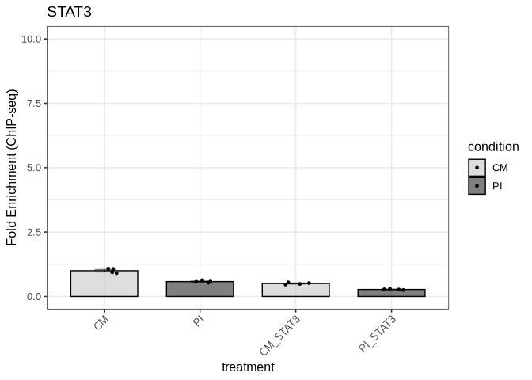

We export the figure to a PDF file in the Figure5 directory:

``` r
ggsave("output/Figure5/fig5i_actin_promoter_stat3.pdf", fig5i, 
       width = 3, height = 6, dpi = 300, useDingbats=FALSE)
```

#### Actin promoter control STAT3P

We import the data for actin_promoter_control_pSTAT3:

``` r
fig5_actin_promoter_pstat3_data <- read_xlsx("input/Figure5_data.xlsx", sheet = "actin_promoter_control_STAT3P")
```

``` r
fig5_actin_promoter_pstat3_result <- compare_chipseq_groups(
  fig5_actin_promoter_pstat3_data,
  group_col = "treatment",
  gene_col = "stat3p",
  control_col = "control",
  control_group = "CM"
)
```

We check the results of the statistical tests:

``` r
fig5_actin_promoter_pstat3_result$all_wilcox_table
```

<div id="hivvkhfrtd" style="padding-left:0px;padding-right:0px;padding-top:10px;padding-bottom:10px;overflow-x:auto;overflow-y:auto;width:auto;height:auto;">
<style>#hivvkhfrtd table {
  font-family: system-ui, 'Segoe UI', Roboto, Helvetica, Arial, sans-serif, 'Apple Color Emoji', 'Segoe UI Emoji', 'Segoe UI Symbol', 'Noto Color Emoji';
  -webkit-font-smoothing: antialiased;
  -moz-osx-font-smoothing: grayscale;
}

#hivvkhfrtd thead, #hivvkhfrtd tbody, #hivvkhfrtd tfoot, #hivvkhfrtd tr, #hivvkhfrtd td, #hivvkhfrtd th {
  border-style: none;
}

#hivvkhfrtd p {
  margin: 0;
  padding: 0;
}

#hivvkhfrtd .gt_table {
  display: table;
  border-collapse: collapse;
  line-height: normal;
  margin-left: auto;
  margin-right: auto;
  color: #333333;
  font-size: 16px;
  font-weight: normal;
  font-style: normal;
  background-color: #FFFFFF;
  width: auto;
  border-top-style: solid;
  border-top-width: 2px;
  border-top-color: #A8A8A8;
  border-right-style: none;
  border-right-width: 2px;
  border-right-color: #D3D3D3;
  border-bottom-style: solid;
  border-bottom-width: 2px;
  border-bottom-color: #A8A8A8;
  border-left-style: none;
  border-left-width: 2px;
  border-left-color: #D3D3D3;
}

#hivvkhfrtd .gt_caption {
  padding-top: 4px;
  padding-bottom: 4px;
}

#hivvkhfrtd .gt_title {
  color: #333333;
  font-size: 125%;
  font-weight: initial;
  padding-top: 4px;
  padding-bottom: 4px;
  padding-left: 5px;
  padding-right: 5px;
  border-bottom-color: #FFFFFF;
  border-bottom-width: 0;
}

#hivvkhfrtd .gt_subtitle {
  color: #333333;
  font-size: 85%;
  font-weight: initial;
  padding-top: 3px;
  padding-bottom: 5px;
  padding-left: 5px;
  padding-right: 5px;
  border-top-color: #FFFFFF;
  border-top-width: 0;
}

#hivvkhfrtd .gt_heading {
  background-color: #FFFFFF;
  text-align: center;
  border-bottom-color: #FFFFFF;
  border-left-style: none;
  border-left-width: 1px;
  border-left-color: #D3D3D3;
  border-right-style: none;
  border-right-width: 1px;
  border-right-color: #D3D3D3;
}

#hivvkhfrtd .gt_bottom_border {
  border-bottom-style: solid;
  border-bottom-width: 2px;
  border-bottom-color: #D3D3D3;
}

#hivvkhfrtd .gt_col_headings {
  border-top-style: solid;
  border-top-width: 2px;
  border-top-color: #D3D3D3;
  border-bottom-style: solid;
  border-bottom-width: 2px;
  border-bottom-color: #D3D3D3;
  border-left-style: none;
  border-left-width: 1px;
  border-left-color: #D3D3D3;
  border-right-style: none;
  border-right-width: 1px;
  border-right-color: #D3D3D3;
}

#hivvkhfrtd .gt_col_heading {
  color: #333333;
  background-color: #FFFFFF;
  font-size: 100%;
  font-weight: normal;
  text-transform: inherit;
  border-left-style: none;
  border-left-width: 1px;
  border-left-color: #D3D3D3;
  border-right-style: none;
  border-right-width: 1px;
  border-right-color: #D3D3D3;
  vertical-align: bottom;
  padding-top: 5px;
  padding-bottom: 6px;
  padding-left: 5px;
  padding-right: 5px;
  overflow-x: hidden;
}

#hivvkhfrtd .gt_column_spanner_outer {
  color: #333333;
  background-color: #FFFFFF;
  font-size: 100%;
  font-weight: normal;
  text-transform: inherit;
  padding-top: 0;
  padding-bottom: 0;
  padding-left: 4px;
  padding-right: 4px;
}

#hivvkhfrtd .gt_column_spanner_outer:first-child {
  padding-left: 0;
}

#hivvkhfrtd .gt_column_spanner_outer:last-child {
  padding-right: 0;
}

#hivvkhfrtd .gt_column_spanner {
  border-bottom-style: solid;
  border-bottom-width: 2px;
  border-bottom-color: #D3D3D3;
  vertical-align: bottom;
  padding-top: 5px;
  padding-bottom: 5px;
  overflow-x: hidden;
  display: inline-block;
  width: 100%;
}

#hivvkhfrtd .gt_spanner_row {
  border-bottom-style: hidden;
}

#hivvkhfrtd .gt_group_heading {
  padding-top: 8px;
  padding-bottom: 8px;
  padding-left: 5px;
  padding-right: 5px;
  color: #333333;
  background-color: #FFFFFF;
  font-size: 100%;
  font-weight: initial;
  text-transform: inherit;
  border-top-style: solid;
  border-top-width: 2px;
  border-top-color: #D3D3D3;
  border-bottom-style: solid;
  border-bottom-width: 2px;
  border-bottom-color: #D3D3D3;
  border-left-style: none;
  border-left-width: 1px;
  border-left-color: #D3D3D3;
  border-right-style: none;
  border-right-width: 1px;
  border-right-color: #D3D3D3;
  vertical-align: middle;
  text-align: left;
}

#hivvkhfrtd .gt_empty_group_heading {
  padding: 0.5px;
  color: #333333;
  background-color: #FFFFFF;
  font-size: 100%;
  font-weight: initial;
  border-top-style: solid;
  border-top-width: 2px;
  border-top-color: #D3D3D3;
  border-bottom-style: solid;
  border-bottom-width: 2px;
  border-bottom-color: #D3D3D3;
  vertical-align: middle;
}

#hivvkhfrtd .gt_from_md > :first-child {
  margin-top: 0;
}

#hivvkhfrtd .gt_from_md > :last-child {
  margin-bottom: 0;
}

#hivvkhfrtd .gt_row {
  padding-top: 8px;
  padding-bottom: 8px;
  padding-left: 5px;
  padding-right: 5px;
  margin: 10px;
  border-top-style: solid;
  border-top-width: 1px;
  border-top-color: #D3D3D3;
  border-left-style: none;
  border-left-width: 1px;
  border-left-color: #D3D3D3;
  border-right-style: none;
  border-right-width: 1px;
  border-right-color: #D3D3D3;
  vertical-align: middle;
  overflow-x: hidden;
}

#hivvkhfrtd .gt_stub {
  color: #333333;
  background-color: #FFFFFF;
  font-size: 100%;
  font-weight: initial;
  text-transform: inherit;
  border-right-style: solid;
  border-right-width: 2px;
  border-right-color: #D3D3D3;
  padding-left: 5px;
  padding-right: 5px;
}

#hivvkhfrtd .gt_stub_row_group {
  color: #333333;
  background-color: #FFFFFF;
  font-size: 100%;
  font-weight: initial;
  text-transform: inherit;
  border-right-style: solid;
  border-right-width: 2px;
  border-right-color: #D3D3D3;
  padding-left: 5px;
  padding-right: 5px;
  vertical-align: top;
}

#hivvkhfrtd .gt_row_group_first td {
  border-top-width: 2px;
}

#hivvkhfrtd .gt_row_group_first th {
  border-top-width: 2px;
}

#hivvkhfrtd .gt_summary_row {
  color: #333333;
  background-color: #FFFFFF;
  text-transform: inherit;
  padding-top: 8px;
  padding-bottom: 8px;
  padding-left: 5px;
  padding-right: 5px;
}

#hivvkhfrtd .gt_first_summary_row {
  border-top-style: solid;
  border-top-color: #D3D3D3;
}

#hivvkhfrtd .gt_first_summary_row.thick {
  border-top-width: 2px;
}

#hivvkhfrtd .gt_last_summary_row {
  padding-top: 8px;
  padding-bottom: 8px;
  padding-left: 5px;
  padding-right: 5px;
  border-bottom-style: solid;
  border-bottom-width: 2px;
  border-bottom-color: #D3D3D3;
}

#hivvkhfrtd .gt_grand_summary_row {
  color: #333333;
  background-color: #FFFFFF;
  text-transform: inherit;
  padding-top: 8px;
  padding-bottom: 8px;
  padding-left: 5px;
  padding-right: 5px;
}

#hivvkhfrtd .gt_first_grand_summary_row {
  padding-top: 8px;
  padding-bottom: 8px;
  padding-left: 5px;
  padding-right: 5px;
  border-top-style: double;
  border-top-width: 6px;
  border-top-color: #D3D3D3;
}

#hivvkhfrtd .gt_last_grand_summary_row_top {
  padding-top: 8px;
  padding-bottom: 8px;
  padding-left: 5px;
  padding-right: 5px;
  border-bottom-style: double;
  border-bottom-width: 6px;
  border-bottom-color: #D3D3D3;
}

#hivvkhfrtd .gt_striped {
  background-color: rgba(128, 128, 128, 0.05);
}

#hivvkhfrtd .gt_table_body {
  border-top-style: solid;
  border-top-width: 2px;
  border-top-color: #D3D3D3;
  border-bottom-style: solid;
  border-bottom-width: 2px;
  border-bottom-color: #D3D3D3;
}

#hivvkhfrtd .gt_footnotes {
  color: #333333;
  background-color: #FFFFFF;
  border-bottom-style: none;
  border-bottom-width: 2px;
  border-bottom-color: #D3D3D3;
  border-left-style: none;
  border-left-width: 2px;
  border-left-color: #D3D3D3;
  border-right-style: none;
  border-right-width: 2px;
  border-right-color: #D3D3D3;
}

#hivvkhfrtd .gt_footnote {
  margin: 0px;
  font-size: 90%;
  padding-top: 4px;
  padding-bottom: 4px;
  padding-left: 5px;
  padding-right: 5px;
}

#hivvkhfrtd .gt_sourcenotes {
  color: #333333;
  background-color: #FFFFFF;
  border-bottom-style: none;
  border-bottom-width: 2px;
  border-bottom-color: #D3D3D3;
  border-left-style: none;
  border-left-width: 2px;
  border-left-color: #D3D3D3;
  border-right-style: none;
  border-right-width: 2px;
  border-right-color: #D3D3D3;
}

#hivvkhfrtd .gt_sourcenote {
  font-size: 90%;
  padding-top: 4px;
  padding-bottom: 4px;
  padding-left: 5px;
  padding-right: 5px;
}

#hivvkhfrtd .gt_left {
  text-align: left;
}

#hivvkhfrtd .gt_center {
  text-align: center;
}

#hivvkhfrtd .gt_right {
  text-align: right;
  font-variant-numeric: tabular-nums;
}

#hivvkhfrtd .gt_font_normal {
  font-weight: normal;
}

#hivvkhfrtd .gt_font_bold {
  font-weight: bold;
}

#hivvkhfrtd .gt_font_italic {
  font-style: italic;
}

#hivvkhfrtd .gt_super {
  font-size: 65%;
}

#hivvkhfrtd .gt_footnote_marks {
  font-size: 75%;
  vertical-align: 0.4em;
  position: initial;
}

#hivvkhfrtd .gt_asterisk {
  font-size: 100%;
  vertical-align: 0;
}

#hivvkhfrtd .gt_indent_1 {
  text-indent: 5px;
}

#hivvkhfrtd .gt_indent_2 {
  text-indent: 10px;
}

#hivvkhfrtd .gt_indent_3 {
  text-indent: 15px;
}

#hivvkhfrtd .gt_indent_4 {
  text-indent: 20px;
}

#hivvkhfrtd .gt_indent_5 {
  text-indent: 25px;
}
</style>
<table class="gt_table" data-quarto-disable-processing="false" data-quarto-bootstrap="false">
  <thead>
    <tr class="gt_col_headings">
      <th class="gt_col_heading gt_columns_bottom_border gt_left" rowspan="1" colspan="1" scope="col" id="Comparison">Comparison</th>
      <th class="gt_col_heading gt_columns_bottom_border gt_right" rowspan="1" colspan="1" scope="col" id="Statistic">Statistic</th>
      <th class="gt_col_heading gt_columns_bottom_border gt_right" rowspan="1" colspan="1" scope="col" id="P_value">P_value</th>
      <th class="gt_col_heading gt_columns_bottom_border gt_left" rowspan="1" colspan="1" scope="col" id="Significant">Significant</th>
    </tr>
  </thead>
  <tbody class="gt_table_body">
    <tr><td headers="Comparison" class="gt_row gt_left" style="background-color: rgba(204,230,255,0.8); color: #000000; font-weight: bold;">CM vs CM_STAT3P</td>
<td headers="Statistic" class="gt_row gt_right" style="background-color: rgba(204,230,255,0.8); color: #000000; font-weight: bold;">16</td>
<td headers="P_value" class="gt_row gt_right" style="background-color: rgba(204,230,255,0.8); color: #000000; font-weight: bold;">0.0286</td>
<td headers="Significant" class="gt_row gt_left" style="background-color: rgba(204,230,255,0.8); color: #000000; font-weight: bold;">Yes</td></tr>
    <tr><td headers="Comparison" class="gt_row gt_left" style="background-color: rgba(204,230,255,0.8); color: #000000; font-weight: bold;">CM vs PI</td>
<td headers="Statistic" class="gt_row gt_right" style="background-color: rgba(204,230,255,0.8); color: #000000; font-weight: bold;">16</td>
<td headers="P_value" class="gt_row gt_right" style="background-color: rgba(204,230,255,0.8); color: #000000; font-weight: bold;">0.0286</td>
<td headers="Significant" class="gt_row gt_left" style="background-color: rgba(204,230,255,0.8); color: #000000; font-weight: bold;">Yes</td></tr>
    <tr><td headers="Comparison" class="gt_row gt_left" style="background-color: rgba(204,230,255,0.8); color: #000000; font-weight: bold;">CM vs PI_STAT3P</td>
<td headers="Statistic" class="gt_row gt_right" style="background-color: rgba(204,230,255,0.8); color: #000000; font-weight: bold;">16</td>
<td headers="P_value" class="gt_row gt_right" style="background-color: rgba(204,230,255,0.8); color: #000000; font-weight: bold;">0.0286</td>
<td headers="Significant" class="gt_row gt_left" style="background-color: rgba(204,230,255,0.8); color: #000000; font-weight: bold;">Yes</td></tr>
    <tr><td headers="Comparison" class="gt_row gt_left" style="background-color: rgba(204,230,255,0.8); color: #000000; font-weight: bold;">CM_STAT3P vs PI</td>
<td headers="Statistic" class="gt_row gt_right" style="background-color: rgba(204,230,255,0.8); color: #000000; font-weight: bold;">0</td>
<td headers="P_value" class="gt_row gt_right" style="background-color: rgba(204,230,255,0.8); color: #000000; font-weight: bold;">0.0286</td>
<td headers="Significant" class="gt_row gt_left" style="background-color: rgba(204,230,255,0.8); color: #000000; font-weight: bold;">Yes</td></tr>
    <tr><td headers="Comparison" class="gt_row gt_left">CM_STAT3P vs PI_STAT3P</td>
<td headers="Statistic" class="gt_row gt_right">8</td>
<td headers="P_value" class="gt_row gt_right">1.0000</td>
<td headers="Significant" class="gt_row gt_left">No</td></tr>
    <tr><td headers="Comparison" class="gt_row gt_left" style="background-color: rgba(204,230,255,0.8); color: #000000; font-weight: bold;">PI vs PI_STAT3P</td>
<td headers="Statistic" class="gt_row gt_right" style="background-color: rgba(204,230,255,0.8); color: #000000; font-weight: bold;">16</td>
<td headers="P_value" class="gt_row gt_right" style="background-color: rgba(204,230,255,0.8); color: #000000; font-weight: bold;">0.0286</td>
<td headers="Significant" class="gt_row gt_left" style="background-color: rgba(204,230,255,0.8); color: #000000; font-weight: bold;">Yes</td></tr>
  </tbody>
  
  
</table>
</div>

We get the graph:

``` r
fig5j <- fig5_actin_promoter_pstat3_result$p
```

``` r
fig5j
```

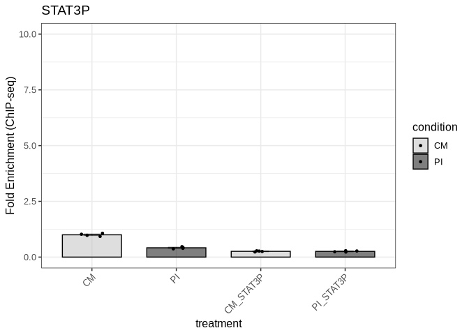

We export the figure to a PDF file in the Figure5 directory:

``` r
ggsave("output/Figure5/fig5j_actin_promoter_pstat3.pdf", fig5j, 
       width = 3, height = 6, dpi = 300, useDingbats=FALSE)
```

#### GAS1 STAT3

We import the data for GAS1_STAT3:

``` r
fig5_gas1_stat3_data <- read_xlsx("input/Figure5_data.xlsx", sheet = "GAS1_STAT3")
```

``` r
fig5_gas1_stat3_result <- compare_chipseq_groups(
  fig5_gas1_stat3_data,
  group_col = "treatment",
  gene_col = "stat3",
  control_col = "control",
  control_group = "CM"
)
```

We check the results of the statistical tests:

``` r
fig5_gas1_stat3_result$all_wilcox_table
```

<div id="vgaplxkmsx" style="padding-left:0px;padding-right:0px;padding-top:10px;padding-bottom:10px;overflow-x:auto;overflow-y:auto;width:auto;height:auto;">
<style>#vgaplxkmsx table {
  font-family: system-ui, 'Segoe UI', Roboto, Helvetica, Arial, sans-serif, 'Apple Color Emoji', 'Segoe UI Emoji', 'Segoe UI Symbol', 'Noto Color Emoji';
  -webkit-font-smoothing: antialiased;
  -moz-osx-font-smoothing: grayscale;
}

#vgaplxkmsx thead, #vgaplxkmsx tbody, #vgaplxkmsx tfoot, #vgaplxkmsx tr, #vgaplxkmsx td, #vgaplxkmsx th {
  border-style: none;
}

#vgaplxkmsx p {
  margin: 0;
  padding: 0;
}

#vgaplxkmsx .gt_table {
  display: table;
  border-collapse: collapse;
  line-height: normal;
  margin-left: auto;
  margin-right: auto;
  color: #333333;
  font-size: 16px;
  font-weight: normal;
  font-style: normal;
  background-color: #FFFFFF;
  width: auto;
  border-top-style: solid;
  border-top-width: 2px;
  border-top-color: #A8A8A8;
  border-right-style: none;
  border-right-width: 2px;
  border-right-color: #D3D3D3;
  border-bottom-style: solid;
  border-bottom-width: 2px;
  border-bottom-color: #A8A8A8;
  border-left-style: none;
  border-left-width: 2px;
  border-left-color: #D3D3D3;
}

#vgaplxkmsx .gt_caption {
  padding-top: 4px;
  padding-bottom: 4px;
}

#vgaplxkmsx .gt_title {
  color: #333333;
  font-size: 125%;
  font-weight: initial;
  padding-top: 4px;
  padding-bottom: 4px;
  padding-left: 5px;
  padding-right: 5px;
  border-bottom-color: #FFFFFF;
  border-bottom-width: 0;
}

#vgaplxkmsx .gt_subtitle {
  color: #333333;
  font-size: 85%;
  font-weight: initial;
  padding-top: 3px;
  padding-bottom: 5px;
  padding-left: 5px;
  padding-right: 5px;
  border-top-color: #FFFFFF;
  border-top-width: 0;
}

#vgaplxkmsx .gt_heading {
  background-color: #FFFFFF;
  text-align: center;
  border-bottom-color: #FFFFFF;
  border-left-style: none;
  border-left-width: 1px;
  border-left-color: #D3D3D3;
  border-right-style: none;
  border-right-width: 1px;
  border-right-color: #D3D3D3;
}

#vgaplxkmsx .gt_bottom_border {
  border-bottom-style: solid;
  border-bottom-width: 2px;
  border-bottom-color: #D3D3D3;
}

#vgaplxkmsx .gt_col_headings {
  border-top-style: solid;
  border-top-width: 2px;
  border-top-color: #D3D3D3;
  border-bottom-style: solid;
  border-bottom-width: 2px;
  border-bottom-color: #D3D3D3;
  border-left-style: none;
  border-left-width: 1px;
  border-left-color: #D3D3D3;
  border-right-style: none;
  border-right-width: 1px;
  border-right-color: #D3D3D3;
}

#vgaplxkmsx .gt_col_heading {
  color: #333333;
  background-color: #FFFFFF;
  font-size: 100%;
  font-weight: normal;
  text-transform: inherit;
  border-left-style: none;
  border-left-width: 1px;
  border-left-color: #D3D3D3;
  border-right-style: none;
  border-right-width: 1px;
  border-right-color: #D3D3D3;
  vertical-align: bottom;
  padding-top: 5px;
  padding-bottom: 6px;
  padding-left: 5px;
  padding-right: 5px;
  overflow-x: hidden;
}

#vgaplxkmsx .gt_column_spanner_outer {
  color: #333333;
  background-color: #FFFFFF;
  font-size: 100%;
  font-weight: normal;
  text-transform: inherit;
  padding-top: 0;
  padding-bottom: 0;
  padding-left: 4px;
  padding-right: 4px;
}

#vgaplxkmsx .gt_column_spanner_outer:first-child {
  padding-left: 0;
}

#vgaplxkmsx .gt_column_spanner_outer:last-child {
  padding-right: 0;
}

#vgaplxkmsx .gt_column_spanner {
  border-bottom-style: solid;
  border-bottom-width: 2px;
  border-bottom-color: #D3D3D3;
  vertical-align: bottom;
  padding-top: 5px;
  padding-bottom: 5px;
  overflow-x: hidden;
  display: inline-block;
  width: 100%;
}

#vgaplxkmsx .gt_spanner_row {
  border-bottom-style: hidden;
}

#vgaplxkmsx .gt_group_heading {
  padding-top: 8px;
  padding-bottom: 8px;
  padding-left: 5px;
  padding-right: 5px;
  color: #333333;
  background-color: #FFFFFF;
  font-size: 100%;
  font-weight: initial;
  text-transform: inherit;
  border-top-style: solid;
  border-top-width: 2px;
  border-top-color: #D3D3D3;
  border-bottom-style: solid;
  border-bottom-width: 2px;
  border-bottom-color: #D3D3D3;
  border-left-style: none;
  border-left-width: 1px;
  border-left-color: #D3D3D3;
  border-right-style: none;
  border-right-width: 1px;
  border-right-color: #D3D3D3;
  vertical-align: middle;
  text-align: left;
}

#vgaplxkmsx .gt_empty_group_heading {
  padding: 0.5px;
  color: #333333;
  background-color: #FFFFFF;
  font-size: 100%;
  font-weight: initial;
  border-top-style: solid;
  border-top-width: 2px;
  border-top-color: #D3D3D3;
  border-bottom-style: solid;
  border-bottom-width: 2px;
  border-bottom-color: #D3D3D3;
  vertical-align: middle;
}

#vgaplxkmsx .gt_from_md > :first-child {
  margin-top: 0;
}

#vgaplxkmsx .gt_from_md > :last-child {
  margin-bottom: 0;
}

#vgaplxkmsx .gt_row {
  padding-top: 8px;
  padding-bottom: 8px;
  padding-left: 5px;
  padding-right: 5px;
  margin: 10px;
  border-top-style: solid;
  border-top-width: 1px;
  border-top-color: #D3D3D3;
  border-left-style: none;
  border-left-width: 1px;
  border-left-color: #D3D3D3;
  border-right-style: none;
  border-right-width: 1px;
  border-right-color: #D3D3D3;
  vertical-align: middle;
  overflow-x: hidden;
}

#vgaplxkmsx .gt_stub {
  color: #333333;
  background-color: #FFFFFF;
  font-size: 100%;
  font-weight: initial;
  text-transform: inherit;
  border-right-style: solid;
  border-right-width: 2px;
  border-right-color: #D3D3D3;
  padding-left: 5px;
  padding-right: 5px;
}

#vgaplxkmsx .gt_stub_row_group {
  color: #333333;
  background-color: #FFFFFF;
  font-size: 100%;
  font-weight: initial;
  text-transform: inherit;
  border-right-style: solid;
  border-right-width: 2px;
  border-right-color: #D3D3D3;
  padding-left: 5px;
  padding-right: 5px;
  vertical-align: top;
}

#vgaplxkmsx .gt_row_group_first td {
  border-top-width: 2px;
}

#vgaplxkmsx .gt_row_group_first th {
  border-top-width: 2px;
}

#vgaplxkmsx .gt_summary_row {
  color: #333333;
  background-color: #FFFFFF;
  text-transform: inherit;
  padding-top: 8px;
  padding-bottom: 8px;
  padding-left: 5px;
  padding-right: 5px;
}

#vgaplxkmsx .gt_first_summary_row {
  border-top-style: solid;
  border-top-color: #D3D3D3;
}

#vgaplxkmsx .gt_first_summary_row.thick {
  border-top-width: 2px;
}

#vgaplxkmsx .gt_last_summary_row {
  padding-top: 8px;
  padding-bottom: 8px;
  padding-left: 5px;
  padding-right: 5px;
  border-bottom-style: solid;
  border-bottom-width: 2px;
  border-bottom-color: #D3D3D3;
}

#vgaplxkmsx .gt_grand_summary_row {
  color: #333333;
  background-color: #FFFFFF;
  text-transform: inherit;
  padding-top: 8px;
  padding-bottom: 8px;
  padding-left: 5px;
  padding-right: 5px;
}

#vgaplxkmsx .gt_first_grand_summary_row {
  padding-top: 8px;
  padding-bottom: 8px;
  padding-left: 5px;
  padding-right: 5px;
  border-top-style: double;
  border-top-width: 6px;
  border-top-color: #D3D3D3;
}

#vgaplxkmsx .gt_last_grand_summary_row_top {
  padding-top: 8px;
  padding-bottom: 8px;
  padding-left: 5px;
  padding-right: 5px;
  border-bottom-style: double;
  border-bottom-width: 6px;
  border-bottom-color: #D3D3D3;
}

#vgaplxkmsx .gt_striped {
  background-color: rgba(128, 128, 128, 0.05);
}

#vgaplxkmsx .gt_table_body {
  border-top-style: solid;
  border-top-width: 2px;
  border-top-color: #D3D3D3;
  border-bottom-style: solid;
  border-bottom-width: 2px;
  border-bottom-color: #D3D3D3;
}

#vgaplxkmsx .gt_footnotes {
  color: #333333;
  background-color: #FFFFFF;
  border-bottom-style: none;
  border-bottom-width: 2px;
  border-bottom-color: #D3D3D3;
  border-left-style: none;
  border-left-width: 2px;
  border-left-color: #D3D3D3;
  border-right-style: none;
  border-right-width: 2px;
  border-right-color: #D3D3D3;
}

#vgaplxkmsx .gt_footnote {
  margin: 0px;
  font-size: 90%;
  padding-top: 4px;
  padding-bottom: 4px;
  padding-left: 5px;
  padding-right: 5px;
}

#vgaplxkmsx .gt_sourcenotes {
  color: #333333;
  background-color: #FFFFFF;
  border-bottom-style: none;
  border-bottom-width: 2px;
  border-bottom-color: #D3D3D3;
  border-left-style: none;
  border-left-width: 2px;
  border-left-color: #D3D3D3;
  border-right-style: none;
  border-right-width: 2px;
  border-right-color: #D3D3D3;
}

#vgaplxkmsx .gt_sourcenote {
  font-size: 90%;
  padding-top: 4px;
  padding-bottom: 4px;
  padding-left: 5px;
  padding-right: 5px;
}

#vgaplxkmsx .gt_left {
  text-align: left;
}

#vgaplxkmsx .gt_center {
  text-align: center;
}

#vgaplxkmsx .gt_right {
  text-align: right;
  font-variant-numeric: tabular-nums;
}

#vgaplxkmsx .gt_font_normal {
  font-weight: normal;
}

#vgaplxkmsx .gt_font_bold {
  font-weight: bold;
}

#vgaplxkmsx .gt_font_italic {
  font-style: italic;
}

#vgaplxkmsx .gt_super {
  font-size: 65%;
}

#vgaplxkmsx .gt_footnote_marks {
  font-size: 75%;
  vertical-align: 0.4em;
  position: initial;
}

#vgaplxkmsx .gt_asterisk {
  font-size: 100%;
  vertical-align: 0;
}

#vgaplxkmsx .gt_indent_1 {
  text-indent: 5px;
}

#vgaplxkmsx .gt_indent_2 {
  text-indent: 10px;
}

#vgaplxkmsx .gt_indent_3 {
  text-indent: 15px;
}

#vgaplxkmsx .gt_indent_4 {
  text-indent: 20px;
}

#vgaplxkmsx .gt_indent_5 {
  text-indent: 25px;
}
</style>
<table class="gt_table" data-quarto-disable-processing="false" data-quarto-bootstrap="false">
  <thead>
    <tr class="gt_col_headings">
      <th class="gt_col_heading gt_columns_bottom_border gt_left" rowspan="1" colspan="1" scope="col" id="Comparison">Comparison</th>
      <th class="gt_col_heading gt_columns_bottom_border gt_right" rowspan="1" colspan="1" scope="col" id="Statistic">Statistic</th>
      <th class="gt_col_heading gt_columns_bottom_border gt_right" rowspan="1" colspan="1" scope="col" id="P_value">P_value</th>
      <th class="gt_col_heading gt_columns_bottom_border gt_left" rowspan="1" colspan="1" scope="col" id="Significant">Significant</th>
    </tr>
  </thead>
  <tbody class="gt_table_body">
    <tr><td headers="Comparison" class="gt_row gt_left">CM vs CM_STAT3</td>
<td headers="Statistic" class="gt_row gt_right">12</td>
<td headers="P_value" class="gt_row gt_right">0.0571</td>
<td headers="Significant" class="gt_row gt_left">No</td></tr>
    <tr><td headers="Comparison" class="gt_row gt_left">CM vs PI</td>
<td headers="Statistic" class="gt_row gt_right">12</td>
<td headers="P_value" class="gt_row gt_right">0.0571</td>
<td headers="Significant" class="gt_row gt_left">No</td></tr>
    <tr><td headers="Comparison" class="gt_row gt_left">CM vs PI_STAT3</td>
<td headers="Statistic" class="gt_row gt_right">12</td>
<td headers="P_value" class="gt_row gt_right">0.0571</td>
<td headers="Significant" class="gt_row gt_left">No</td></tr>
    <tr><td headers="Comparison" class="gt_row gt_left">CM_STAT3 vs PI</td>
<td headers="Statistic" class="gt_row gt_right">10</td>
<td headers="P_value" class="gt_row gt_right">0.6857</td>
<td headers="Significant" class="gt_row gt_left">No</td></tr>
    <tr><td headers="Comparison" class="gt_row gt_left">CM_STAT3 vs PI_STAT3</td>
<td headers="Statistic" class="gt_row gt_right">4</td>
<td headers="P_value" class="gt_row gt_right">0.3429</td>
<td headers="Significant" class="gt_row gt_left">No</td></tr>
    <tr><td headers="Comparison" class="gt_row gt_left">PI vs PI_STAT3</td>
<td headers="Statistic" class="gt_row gt_right">2</td>
<td headers="P_value" class="gt_row gt_right">0.1143</td>
<td headers="Significant" class="gt_row gt_left">No</td></tr>
  </tbody>
  
  
</table>
</div>

We get the graph:

``` r
fig5a <- fig5_gas1_stat3_result$p
```

``` r
fig5a
```

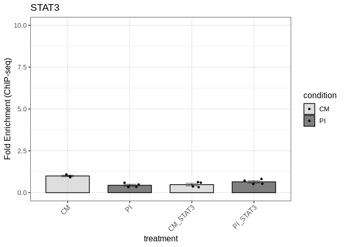

We export the figure to a PDF file in the Figure5 directory:

``` r
ggsave("output/Figure5/fig5a_gas1_stat3.pdf", fig5a, 
       width = 3, height = 6, dpi = 300, useDingbats=FALSE)
```

#### GAS1 STAT3P

We import the data for GAS1_STAT3P:

``` r
fig5_gas1_stat3p_data <- read_xlsx("input/Figure5_data.xlsx", sheet = "GAS1_STAT3P")
```

``` r
fig5_gas1_stat3p_result <- compare_chipseq_groups(
  fig5_gas1_stat3p_data,
  group_col = "treatment",
  gene_col = "stat3p",
  control_col = "control",
  control_group = "CM"
)
```

We check the results of the statistical tests:

``` r
fig5_gas1_stat3p_result$all_wilcox_table
```

<div id="saqcidtzho" style="padding-left:0px;padding-right:0px;padding-top:10px;padding-bottom:10px;overflow-x:auto;overflow-y:auto;width:auto;height:auto;">
<style>#saqcidtzho table {
  font-family: system-ui, 'Segoe UI', Roboto, Helvetica, Arial, sans-serif, 'Apple Color Emoji', 'Segoe UI Emoji', 'Segoe UI Symbol', 'Noto Color Emoji';
  -webkit-font-smoothing: antialiased;
  -moz-osx-font-smoothing: grayscale;
}

#saqcidtzho thead, #saqcidtzho tbody, #saqcidtzho tfoot, #saqcidtzho tr, #saqcidtzho td, #saqcidtzho th {
  border-style: none;
}

#saqcidtzho p {
  margin: 0;
  padding: 0;
}

#saqcidtzho .gt_table {
  display: table;
  border-collapse: collapse;
  line-height: normal;
  margin-left: auto;
  margin-right: auto;
  color: #333333;
  font-size: 16px;
  font-weight: normal;
  font-style: normal;
  background-color: #FFFFFF;
  width: auto;
  border-top-style: solid;
  border-top-width: 2px;
  border-top-color: #A8A8A8;
  border-right-style: none;
  border-right-width: 2px;
  border-right-color: #D3D3D3;
  border-bottom-style: solid;
  border-bottom-width: 2px;
  border-bottom-color: #A8A8A8;
  border-left-style: none;
  border-left-width: 2px;
  border-left-color: #D3D3D3;
}

#saqcidtzho .gt_caption {
  padding-top: 4px;
  padding-bottom: 4px;
}

#saqcidtzho .gt_title {
  color: #333333;
  font-size: 125%;
  font-weight: initial;
  padding-top: 4px;
  padding-bottom: 4px;
  padding-left: 5px;
  padding-right: 5px;
  border-bottom-color: #FFFFFF;
  border-bottom-width: 0;
}

#saqcidtzho .gt_subtitle {
  color: #333333;
  font-size: 85%;
  font-weight: initial;
  padding-top: 3px;
  padding-bottom: 5px;
  padding-left: 5px;
  padding-right: 5px;
  border-top-color: #FFFFFF;
  border-top-width: 0;
}

#saqcidtzho .gt_heading {
  background-color: #FFFFFF;
  text-align: center;
  border-bottom-color: #FFFFFF;
  border-left-style: none;
  border-left-width: 1px;
  border-left-color: #D3D3D3;
  border-right-style: none;
  border-right-width: 1px;
  border-right-color: #D3D3D3;
}

#saqcidtzho .gt_bottom_border {
  border-bottom-style: solid;
  border-bottom-width: 2px;
  border-bottom-color: #D3D3D3;
}

#saqcidtzho .gt_col_headings {
  border-top-style: solid;
  border-top-width: 2px;
  border-top-color: #D3D3D3;
  border-bottom-style: solid;
  border-bottom-width: 2px;
  border-bottom-color: #D3D3D3;
  border-left-style: none;
  border-left-width: 1px;
  border-left-color: #D3D3D3;
  border-right-style: none;
  border-right-width: 1px;
  border-right-color: #D3D3D3;
}

#saqcidtzho .gt_col_heading {
  color: #333333;
  background-color: #FFFFFF;
  font-size: 100%;
  font-weight: normal;
  text-transform: inherit;
  border-left-style: none;
  border-left-width: 1px;
  border-left-color: #D3D3D3;
  border-right-style: none;
  border-right-width: 1px;
  border-right-color: #D3D3D3;
  vertical-align: bottom;
  padding-top: 5px;
  padding-bottom: 6px;
  padding-left: 5px;
  padding-right: 5px;
  overflow-x: hidden;
}

#saqcidtzho .gt_column_spanner_outer {
  color: #333333;
  background-color: #FFFFFF;
  font-size: 100%;
  font-weight: normal;
  text-transform: inherit;
  padding-top: 0;
  padding-bottom: 0;
  padding-left: 4px;
  padding-right: 4px;
}

#saqcidtzho .gt_column_spanner_outer:first-child {
  padding-left: 0;
}

#saqcidtzho .gt_column_spanner_outer:last-child {
  padding-right: 0;
}

#saqcidtzho .gt_column_spanner {
  border-bottom-style: solid;
  border-bottom-width: 2px;
  border-bottom-color: #D3D3D3;
  vertical-align: bottom;
  padding-top: 5px;
  padding-bottom: 5px;
  overflow-x: hidden;
  display: inline-block;
  width: 100%;
}

#saqcidtzho .gt_spanner_row {
  border-bottom-style: hidden;
}

#saqcidtzho .gt_group_heading {
  padding-top: 8px;
  padding-bottom: 8px;
  padding-left: 5px;
  padding-right: 5px;
  color: #333333;
  background-color: #FFFFFF;
  font-size: 100%;
  font-weight: initial;
  text-transform: inherit;
  border-top-style: solid;
  border-top-width: 2px;
  border-top-color: #D3D3D3;
  border-bottom-style: solid;
  border-bottom-width: 2px;
  border-bottom-color: #D3D3D3;
  border-left-style: none;
  border-left-width: 1px;
  border-left-color: #D3D3D3;
  border-right-style: none;
  border-right-width: 1px;
  border-right-color: #D3D3D3;
  vertical-align: middle;
  text-align: left;
}

#saqcidtzho .gt_empty_group_heading {
  padding: 0.5px;
  color: #333333;
  background-color: #FFFFFF;
  font-size: 100%;
  font-weight: initial;
  border-top-style: solid;
  border-top-width: 2px;
  border-top-color: #D3D3D3;
  border-bottom-style: solid;
  border-bottom-width: 2px;
  border-bottom-color: #D3D3D3;
  vertical-align: middle;
}

#saqcidtzho .gt_from_md > :first-child {
  margin-top: 0;
}

#saqcidtzho .gt_from_md > :last-child {
  margin-bottom: 0;
}

#saqcidtzho .gt_row {
  padding-top: 8px;
  padding-bottom: 8px;
  padding-left: 5px;
  padding-right: 5px;
  margin: 10px;
  border-top-style: solid;
  border-top-width: 1px;
  border-top-color: #D3D3D3;
  border-left-style: none;
  border-left-width: 1px;
  border-left-color: #D3D3D3;
  border-right-style: none;
  border-right-width: 1px;
  border-right-color: #D3D3D3;
  vertical-align: middle;
  overflow-x: hidden;
}

#saqcidtzho .gt_stub {
  color: #333333;
  background-color: #FFFFFF;
  font-size: 100%;
  font-weight: initial;
  text-transform: inherit;
  border-right-style: solid;
  border-right-width: 2px;
  border-right-color: #D3D3D3;
  padding-left: 5px;
  padding-right: 5px;
}

#saqcidtzho .gt_stub_row_group {
  color: #333333;
  background-color: #FFFFFF;
  font-size: 100%;
  font-weight: initial;
  text-transform: inherit;
  border-right-style: solid;
  border-right-width: 2px;
  border-right-color: #D3D3D3;
  padding-left: 5px;
  padding-right: 5px;
  vertical-align: top;
}

#saqcidtzho .gt_row_group_first td {
  border-top-width: 2px;
}

#saqcidtzho .gt_row_group_first th {
  border-top-width: 2px;
}

#saqcidtzho .gt_summary_row {
  color: #333333;
  background-color: #FFFFFF;
  text-transform: inherit;
  padding-top: 8px;
  padding-bottom: 8px;
  padding-left: 5px;
  padding-right: 5px;
}

#saqcidtzho .gt_first_summary_row {
  border-top-style: solid;
  border-top-color: #D3D3D3;
}

#saqcidtzho .gt_first_summary_row.thick {
  border-top-width: 2px;
}

#saqcidtzho .gt_last_summary_row {
  padding-top: 8px;
  padding-bottom: 8px;
  padding-left: 5px;
  padding-right: 5px;
  border-bottom-style: solid;
  border-bottom-width: 2px;
  border-bottom-color: #D3D3D3;
}

#saqcidtzho .gt_grand_summary_row {
  color: #333333;
  background-color: #FFFFFF;
  text-transform: inherit;
  padding-top: 8px;
  padding-bottom: 8px;
  padding-left: 5px;
  padding-right: 5px;
}

#saqcidtzho .gt_first_grand_summary_row {
  padding-top: 8px;
  padding-bottom: 8px;
  padding-left: 5px;
  padding-right: 5px;
  border-top-style: double;
  border-top-width: 6px;
  border-top-color: #D3D3D3;
}

#saqcidtzho .gt_last_grand_summary_row_top {
  padding-top: 8px;
  padding-bottom: 8px;
  padding-left: 5px;
  padding-right: 5px;
  border-bottom-style: double;
  border-bottom-width: 6px;
  border-bottom-color: #D3D3D3;
}

#saqcidtzho .gt_striped {
  background-color: rgba(128, 128, 128, 0.05);
}

#saqcidtzho .gt_table_body {
  border-top-style: solid;
  border-top-width: 2px;
  border-top-color: #D3D3D3;
  border-bottom-style: solid;
  border-bottom-width: 2px;
  border-bottom-color: #D3D3D3;
}

#saqcidtzho .gt_footnotes {
  color: #333333;
  background-color: #FFFFFF;
  border-bottom-style: none;
  border-bottom-width: 2px;
  border-bottom-color: #D3D3D3;
  border-left-style: none;
  border-left-width: 2px;
  border-left-color: #D3D3D3;
  border-right-style: none;
  border-right-width: 2px;
  border-right-color: #D3D3D3;
}

#saqcidtzho .gt_footnote {
  margin: 0px;
  font-size: 90%;
  padding-top: 4px;
  padding-bottom: 4px;
  padding-left: 5px;
  padding-right: 5px;
}

#saqcidtzho .gt_sourcenotes {
  color: #333333;
  background-color: #FFFFFF;
  border-bottom-style: none;
  border-bottom-width: 2px;
  border-bottom-color: #D3D3D3;
  border-left-style: none;
  border-left-width: 2px;
  border-left-color: #D3D3D3;
  border-right-style: none;
  border-right-width: 2px;
  border-right-color: #D3D3D3;
}

#saqcidtzho .gt_sourcenote {
  font-size: 90%;
  padding-top: 4px;
  padding-bottom: 4px;
  padding-left: 5px;
  padding-right: 5px;
}

#saqcidtzho .gt_left {
  text-align: left;
}

#saqcidtzho .gt_center {
  text-align: center;
}

#saqcidtzho .gt_right {
  text-align: right;
  font-variant-numeric: tabular-nums;
}

#saqcidtzho .gt_font_normal {
  font-weight: normal;
}

#saqcidtzho .gt_font_bold {
  font-weight: bold;
}

#saqcidtzho .gt_font_italic {
  font-style: italic;
}

#saqcidtzho .gt_super {
  font-size: 65%;
}

#saqcidtzho .gt_footnote_marks {
  font-size: 75%;
  vertical-align: 0.4em;
  position: initial;
}

#saqcidtzho .gt_asterisk {
  font-size: 100%;
  vertical-align: 0;
}

#saqcidtzho .gt_indent_1 {
  text-indent: 5px;
}

#saqcidtzho .gt_indent_2 {
  text-indent: 10px;
}

#saqcidtzho .gt_indent_3 {
  text-indent: 15px;
}

#saqcidtzho .gt_indent_4 {
  text-indent: 20px;
}

#saqcidtzho .gt_indent_5 {
  text-indent: 25px;
}
</style>
<table class="gt_table" data-quarto-disable-processing="false" data-quarto-bootstrap="false">
  <thead>
    <tr class="gt_col_headings">
      <th class="gt_col_heading gt_columns_bottom_border gt_left" rowspan="1" colspan="1" scope="col" id="Comparison">Comparison</th>
      <th class="gt_col_heading gt_columns_bottom_border gt_right" rowspan="1" colspan="1" scope="col" id="Statistic">Statistic</th>
      <th class="gt_col_heading gt_columns_bottom_border gt_right" rowspan="1" colspan="1" scope="col" id="P_value">P_value</th>
      <th class="gt_col_heading gt_columns_bottom_border gt_left" rowspan="1" colspan="1" scope="col" id="Significant">Significant</th>
    </tr>
  </thead>
  <tbody class="gt_table_body">
    <tr><td headers="Comparison" class="gt_row gt_left" style="background-color: rgba(204,230,255,0.8); color: #000000; font-weight: bold;">CM vs CM_STAT3P</td>
<td headers="Statistic" class="gt_row gt_right" style="background-color: rgba(204,230,255,0.8); color: #000000; font-weight: bold;">16</td>
<td headers="P_value" class="gt_row gt_right" style="background-color: rgba(204,230,255,0.8); color: #000000; font-weight: bold;">0.0286</td>
<td headers="Significant" class="gt_row gt_left" style="background-color: rgba(204,230,255,0.8); color: #000000; font-weight: bold;">Yes</td></tr>
    <tr><td headers="Comparison" class="gt_row gt_left" style="background-color: rgba(204,230,255,0.8); color: #000000; font-weight: bold;">CM vs PI</td>
<td headers="Statistic" class="gt_row gt_right" style="background-color: rgba(204,230,255,0.8); color: #000000; font-weight: bold;">16</td>
<td headers="P_value" class="gt_row gt_right" style="background-color: rgba(204,230,255,0.8); color: #000000; font-weight: bold;">0.0286</td>
<td headers="Significant" class="gt_row gt_left" style="background-color: rgba(204,230,255,0.8); color: #000000; font-weight: bold;">Yes</td></tr>
    <tr><td headers="Comparison" class="gt_row gt_left" style="background-color: rgba(204,230,255,0.8); color: #000000; font-weight: bold;">CM vs PI_STAT3P</td>
<td headers="Statistic" class="gt_row gt_right" style="background-color: rgba(204,230,255,0.8); color: #000000; font-weight: bold;">16</td>
<td headers="P_value" class="gt_row gt_right" style="background-color: rgba(204,230,255,0.8); color: #000000; font-weight: bold;">0.0286</td>
<td headers="Significant" class="gt_row gt_left" style="background-color: rgba(204,230,255,0.8); color: #000000; font-weight: bold;">Yes</td></tr>
    <tr><td headers="Comparison" class="gt_row gt_left" style="background-color: rgba(204,230,255,0.8); color: #000000; font-weight: bold;">CM_STAT3P vs PI</td>
<td headers="Statistic" class="gt_row gt_right" style="background-color: rgba(204,230,255,0.8); color: #000000; font-weight: bold;">0</td>
<td headers="P_value" class="gt_row gt_right" style="background-color: rgba(204,230,255,0.8); color: #000000; font-weight: bold;">0.0286</td>
<td headers="Significant" class="gt_row gt_left" style="background-color: rgba(204,230,255,0.8); color: #000000; font-weight: bold;">Yes</td></tr>
    <tr><td headers="Comparison" class="gt_row gt_left">CM_STAT3P vs PI_STAT3P</td>
<td headers="Statistic" class="gt_row gt_right">14</td>
<td headers="P_value" class="gt_row gt_right">0.1143</td>
<td headers="Significant" class="gt_row gt_left">No</td></tr>
    <tr><td headers="Comparison" class="gt_row gt_left" style="background-color: rgba(204,230,255,0.8); color: #000000; font-weight: bold;">PI vs PI_STAT3P</td>
<td headers="Statistic" class="gt_row gt_right" style="background-color: rgba(204,230,255,0.8); color: #000000; font-weight: bold;">16</td>
<td headers="P_value" class="gt_row gt_right" style="background-color: rgba(204,230,255,0.8); color: #000000; font-weight: bold;">0.0286</td>
<td headers="Significant" class="gt_row gt_left" style="background-color: rgba(204,230,255,0.8); color: #000000; font-weight: bold;">Yes</td></tr>
  </tbody>
  
  
</table>
</div>

We get the graph:

``` r
fig5b <- fig5_gas1_stat3p_result$p
```

``` r
fig5b
```

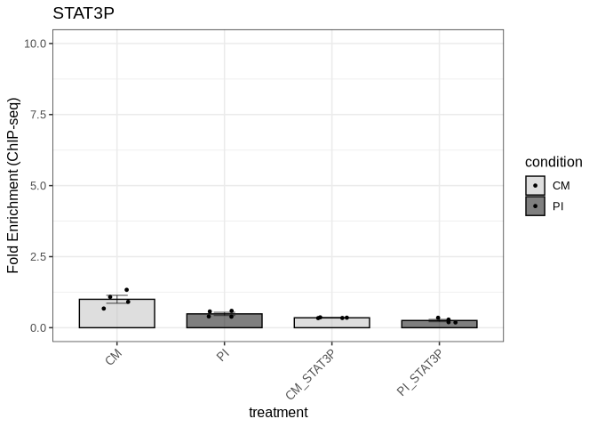

We export the figure to a PDF file in the Figure5 directory:

``` r
ggsave("output/Figure5/fig5b_gas1_stat3p.pdf", fig5b, 
       width = 3, height = 6, dpi = 300, useDingbats=FALSE)
```

#### GAS2/GAS3 STAT3

We import the data for GAS2_GAS3_STAT3:

``` r
fig5_gas2_gas3_stat3_data <- read_xlsx("input/Figure5_data.xlsx", sheet = "GAS2_GAS3_STAT3")
```

``` r
fig5_gas2_gas3_stat3_result <- compare_chipseq_groups(
  fig5_gas2_gas3_stat3_data,
  group_col = "treatment",
  gene_col = "stat3",
  control_col = "control",
  control_group = "CM"
)
```

    Warning in wilcox.test.default(vals1, vals2, alternative = "two.sided", :
    cannot compute exact p-value with ties

We check the results of the statistical tests:

``` r
fig5_gas2_gas3_stat3_result$all_wilcox_table
```

<div id="wqvwenpprb" style="padding-left:0px;padding-right:0px;padding-top:10px;padding-bottom:10px;overflow-x:auto;overflow-y:auto;width:auto;height:auto;">
<style>#wqvwenpprb table {
  font-family: system-ui, 'Segoe UI', Roboto, Helvetica, Arial, sans-serif, 'Apple Color Emoji', 'Segoe UI Emoji', 'Segoe UI Symbol', 'Noto Color Emoji';
  -webkit-font-smoothing: antialiased;
  -moz-osx-font-smoothing: grayscale;
}

#wqvwenpprb thead, #wqvwenpprb tbody, #wqvwenpprb tfoot, #wqvwenpprb tr, #wqvwenpprb td, #wqvwenpprb th {
  border-style: none;
}

#wqvwenpprb p {
  margin: 0;
  padding: 0;
}

#wqvwenpprb .gt_table {
  display: table;
  border-collapse: collapse;
  line-height: normal;
  margin-left: auto;
  margin-right: auto;
  color: #333333;
  font-size: 16px;
  font-weight: normal;
  font-style: normal;
  background-color: #FFFFFF;
  width: auto;
  border-top-style: solid;
  border-top-width: 2px;
  border-top-color: #A8A8A8;
  border-right-style: none;
  border-right-width: 2px;
  border-right-color: #D3D3D3;
  border-bottom-style: solid;
  border-bottom-width: 2px;
  border-bottom-color: #A8A8A8;
  border-left-style: none;
  border-left-width: 2px;
  border-left-color: #D3D3D3;
}

#wqvwenpprb .gt_caption {
  padding-top: 4px;
  padding-bottom: 4px;
}

#wqvwenpprb .gt_title {
  color: #333333;
  font-size: 125%;
  font-weight: initial;
  padding-top: 4px;
  padding-bottom: 4px;
  padding-left: 5px;
  padding-right: 5px;
  border-bottom-color: #FFFFFF;
  border-bottom-width: 0;
}

#wqvwenpprb .gt_subtitle {
  color: #333333;
  font-size: 85%;
  font-weight: initial;
  padding-top: 3px;
  padding-bottom: 5px;
  padding-left: 5px;
  padding-right: 5px;
  border-top-color: #FFFFFF;
  border-top-width: 0;
}

#wqvwenpprb .gt_heading {
  background-color: #FFFFFF;
  text-align: center;
  border-bottom-color: #FFFFFF;
  border-left-style: none;
  border-left-width: 1px;
  border-left-color: #D3D3D3;
  border-right-style: none;
  border-right-width: 1px;
  border-right-color: #D3D3D3;
}

#wqvwenpprb .gt_bottom_border {
  border-bottom-style: solid;
  border-bottom-width: 2px;
  border-bottom-color: #D3D3D3;
}

#wqvwenpprb .gt_col_headings {
  border-top-style: solid;
  border-top-width: 2px;
  border-top-color: #D3D3D3;
  border-bottom-style: solid;
  border-bottom-width: 2px;
  border-bottom-color: #D3D3D3;
  border-left-style: none;
  border-left-width: 1px;
  border-left-color: #D3D3D3;
  border-right-style: none;
  border-right-width: 1px;
  border-right-color: #D3D3D3;
}

#wqvwenpprb .gt_col_heading {
  color: #333333;
  background-color: #FFFFFF;
  font-size: 100%;
  font-weight: normal;
  text-transform: inherit;
  border-left-style: none;
  border-left-width: 1px;
  border-left-color: #D3D3D3;
  border-right-style: none;
  border-right-width: 1px;
  border-right-color: #D3D3D3;
  vertical-align: bottom;
  padding-top: 5px;
  padding-bottom: 6px;
  padding-left: 5px;
  padding-right: 5px;
  overflow-x: hidden;
}

#wqvwenpprb .gt_column_spanner_outer {
  color: #333333;
  background-color: #FFFFFF;
  font-size: 100%;
  font-weight: normal;
  text-transform: inherit;
  padding-top: 0;
  padding-bottom: 0;
  padding-left: 4px;
  padding-right: 4px;
}

#wqvwenpprb .gt_column_spanner_outer:first-child {
  padding-left: 0;
}

#wqvwenpprb .gt_column_spanner_outer:last-child {
  padding-right: 0;
}

#wqvwenpprb .gt_column_spanner {
  border-bottom-style: solid;
  border-bottom-width: 2px;
  border-bottom-color: #D3D3D3;
  vertical-align: bottom;
  padding-top: 5px;
  padding-bottom: 5px;
  overflow-x: hidden;
  display: inline-block;
  width: 100%;
}

#wqvwenpprb .gt_spanner_row {
  border-bottom-style: hidden;
}

#wqvwenpprb .gt_group_heading {
  padding-top: 8px;
  padding-bottom: 8px;
  padding-left: 5px;
  padding-right: 5px;
  color: #333333;
  background-color: #FFFFFF;
  font-size: 100%;
  font-weight: initial;
  text-transform: inherit;
  border-top-style: solid;
  border-top-width: 2px;
  border-top-color: #D3D3D3;
  border-bottom-style: solid;
  border-bottom-width: 2px;
  border-bottom-color: #D3D3D3;
  border-left-style: none;
  border-left-width: 1px;
  border-left-color: #D3D3D3;
  border-right-style: none;
  border-right-width: 1px;
  border-right-color: #D3D3D3;
  vertical-align: middle;
  text-align: left;
}

#wqvwenpprb .gt_empty_group_heading {
  padding: 0.5px;
  color: #333333;
  background-color: #FFFFFF;
  font-size: 100%;
  font-weight: initial;
  border-top-style: solid;
  border-top-width: 2px;
  border-top-color: #D3D3D3;
  border-bottom-style: solid;
  border-bottom-width: 2px;
  border-bottom-color: #D3D3D3;
  vertical-align: middle;
}

#wqvwenpprb .gt_from_md > :first-child {
  margin-top: 0;
}

#wqvwenpprb .gt_from_md > :last-child {
  margin-bottom: 0;
}

#wqvwenpprb .gt_row {
  padding-top: 8px;
  padding-bottom: 8px;
  padding-left: 5px;
  padding-right: 5px;
  margin: 10px;
  border-top-style: solid;
  border-top-width: 1px;
  border-top-color: #D3D3D3;
  border-left-style: none;
  border-left-width: 1px;
  border-left-color: #D3D3D3;
  border-right-style: none;
  border-right-width: 1px;
  border-right-color: #D3D3D3;
  vertical-align: middle;
  overflow-x: hidden;
}

#wqvwenpprb .gt_stub {
  color: #333333;
  background-color: #FFFFFF;
  font-size: 100%;
  font-weight: initial;
  text-transform: inherit;
  border-right-style: solid;
  border-right-width: 2px;
  border-right-color: #D3D3D3;
  padding-left: 5px;
  padding-right: 5px;
}

#wqvwenpprb .gt_stub_row_group {
  color: #333333;
  background-color: #FFFFFF;
  font-size: 100%;
  font-weight: initial;
  text-transform: inherit;
  border-right-style: solid;
  border-right-width: 2px;
  border-right-color: #D3D3D3;
  padding-left: 5px;
  padding-right: 5px;
  vertical-align: top;
}

#wqvwenpprb .gt_row_group_first td {
  border-top-width: 2px;
}

#wqvwenpprb .gt_row_group_first th {
  border-top-width: 2px;
}

#wqvwenpprb .gt_summary_row {
  color: #333333;
  background-color: #FFFFFF;
  text-transform: inherit;
  padding-top: 8px;
  padding-bottom: 8px;
  padding-left: 5px;
  padding-right: 5px;
}

#wqvwenpprb .gt_first_summary_row {
  border-top-style: solid;
  border-top-color: #D3D3D3;
}

#wqvwenpprb .gt_first_summary_row.thick {
  border-top-width: 2px;
}

#wqvwenpprb .gt_last_summary_row {
  padding-top: 8px;
  padding-bottom: 8px;
  padding-left: 5px;
  padding-right: 5px;
  border-bottom-style: solid;
  border-bottom-width: 2px;
  border-bottom-color: #D3D3D3;
}

#wqvwenpprb .gt_grand_summary_row {
  color: #333333;
  background-color: #FFFFFF;
  text-transform: inherit;
  padding-top: 8px;
  padding-bottom: 8px;
  padding-left: 5px;
  padding-right: 5px;
}

#wqvwenpprb .gt_first_grand_summary_row {
  padding-top: 8px;
  padding-bottom: 8px;
  padding-left: 5px;
  padding-right: 5px;
  border-top-style: double;
  border-top-width: 6px;
  border-top-color: #D3D3D3;
}

#wqvwenpprb .gt_last_grand_summary_row_top {
  padding-top: 8px;
  padding-bottom: 8px;
  padding-left: 5px;
  padding-right: 5px;
  border-bottom-style: double;
  border-bottom-width: 6px;
  border-bottom-color: #D3D3D3;
}

#wqvwenpprb .gt_striped {
  background-color: rgba(128, 128, 128, 0.05);
}

#wqvwenpprb .gt_table_body {
  border-top-style: solid;
  border-top-width: 2px;
  border-top-color: #D3D3D3;
  border-bottom-style: solid;
  border-bottom-width: 2px;
  border-bottom-color: #D3D3D3;
}

#wqvwenpprb .gt_footnotes {
  color: #333333;
  background-color: #FFFFFF;
  border-bottom-style: none;
  border-bottom-width: 2px;
  border-bottom-color: #D3D3D3;
  border-left-style: none;
  border-left-width: 2px;
  border-left-color: #D3D3D3;
  border-right-style: none;
  border-right-width: 2px;
  border-right-color: #D3D3D3;
}

#wqvwenpprb .gt_footnote {
  margin: 0px;
  font-size: 90%;
  padding-top: 4px;
  padding-bottom: 4px;
  padding-left: 5px;
  padding-right: 5px;
}

#wqvwenpprb .gt_sourcenotes {
  color: #333333;
  background-color: #FFFFFF;
  border-bottom-style: none;
  border-bottom-width: 2px;
  border-bottom-color: #D3D3D3;
  border-left-style: none;
  border-left-width: 2px;
  border-left-color: #D3D3D3;
  border-right-style: none;
  border-right-width: 2px;
  border-right-color: #D3D3D3;
}

#wqvwenpprb .gt_sourcenote {
  font-size: 90%;
  padding-top: 4px;
  padding-bottom: 4px;
  padding-left: 5px;
  padding-right: 5px;
}

#wqvwenpprb .gt_left {
  text-align: left;
}

#wqvwenpprb .gt_center {
  text-align: center;
}

#wqvwenpprb .gt_right {
  text-align: right;
  font-variant-numeric: tabular-nums;
}

#wqvwenpprb .gt_font_normal {
  font-weight: normal;
}

#wqvwenpprb .gt_font_bold {
  font-weight: bold;
}

#wqvwenpprb .gt_font_italic {
  font-style: italic;
}

#wqvwenpprb .gt_super {
  font-size: 65%;
}

#wqvwenpprb .gt_footnote_marks {
  font-size: 75%;
  vertical-align: 0.4em;
  position: initial;
}

#wqvwenpprb .gt_asterisk {
  font-size: 100%;
  vertical-align: 0;
}

#wqvwenpprb .gt_indent_1 {
  text-indent: 5px;
}

#wqvwenpprb .gt_indent_2 {
  text-indent: 10px;
}

#wqvwenpprb .gt_indent_3 {
  text-indent: 15px;
}

#wqvwenpprb .gt_indent_4 {
  text-indent: 20px;
}

#wqvwenpprb .gt_indent_5 {
  text-indent: 25px;
}
</style>
<table class="gt_table" data-quarto-disable-processing="false" data-quarto-bootstrap="false">
  <thead>
    <tr class="gt_col_headings">
      <th class="gt_col_heading gt_columns_bottom_border gt_left" rowspan="1" colspan="1" scope="col" id="Comparison">Comparison</th>
      <th class="gt_col_heading gt_columns_bottom_border gt_right" rowspan="1" colspan="1" scope="col" id="Statistic">Statistic</th>
      <th class="gt_col_heading gt_columns_bottom_border gt_right" rowspan="1" colspan="1" scope="col" id="P_value">P_value</th>
      <th class="gt_col_heading gt_columns_bottom_border gt_left" rowspan="1" colspan="1" scope="col" id="Significant">Significant</th>
    </tr>
  </thead>
  <tbody class="gt_table_body">
    <tr><td headers="Comparison" class="gt_row gt_left">CM vs CM_STAT3</td>
<td headers="Statistic" class="gt_row gt_right">13.5</td>
<td headers="P_value" class="gt_row gt_right">0.1465</td>
<td headers="Significant" class="gt_row gt_left">No</td></tr>
    <tr><td headers="Comparison" class="gt_row gt_left" style="background-color: rgba(204,230,255,0.8); color: #000000; font-weight: bold;">CM vs PI</td>
<td headers="Statistic" class="gt_row gt_right" style="background-color: rgba(204,230,255,0.8); color: #000000; font-weight: bold;">16.0</td>
<td headers="P_value" class="gt_row gt_right" style="background-color: rgba(204,230,255,0.8); color: #000000; font-weight: bold;">0.0286</td>
<td headers="Significant" class="gt_row gt_left" style="background-color: rgba(204,230,255,0.8); color: #000000; font-weight: bold;">Yes</td></tr>
    <tr><td headers="Comparison" class="gt_row gt_left" style="background-color: rgba(204,230,255,0.8); color: #000000; font-weight: bold;">CM vs PI_STAT3</td>
<td headers="Statistic" class="gt_row gt_right" style="background-color: rgba(204,230,255,0.8); color: #000000; font-weight: bold;">16.0</td>
<td headers="P_value" class="gt_row gt_right" style="background-color: rgba(204,230,255,0.8); color: #000000; font-weight: bold;">0.0286</td>
<td headers="Significant" class="gt_row gt_left" style="background-color: rgba(204,230,255,0.8); color: #000000; font-weight: bold;">Yes</td></tr>
    <tr><td headers="Comparison" class="gt_row gt_left" style="background-color: rgba(204,230,255,0.8); color: #000000; font-weight: bold;">CM_STAT3 vs PI</td>
<td headers="Statistic" class="gt_row gt_right" style="background-color: rgba(204,230,255,0.8); color: #000000; font-weight: bold;">16.0</td>
<td headers="P_value" class="gt_row gt_right" style="background-color: rgba(204,230,255,0.8); color: #000000; font-weight: bold;">0.0286</td>
<td headers="Significant" class="gt_row gt_left" style="background-color: rgba(204,230,255,0.8); color: #000000; font-weight: bold;">Yes</td></tr>
    <tr><td headers="Comparison" class="gt_row gt_left">CM_STAT3 vs PI_STAT3</td>
<td headers="Statistic" class="gt_row gt_right">15.0</td>
<td headers="P_value" class="gt_row gt_right">0.0571</td>
<td headers="Significant" class="gt_row gt_left">No</td></tr>
    <tr><td headers="Comparison" class="gt_row gt_left">PI vs PI_STAT3</td>
<td headers="Statistic" class="gt_row gt_right">4.0</td>
<td headers="P_value" class="gt_row gt_right">0.3429</td>
<td headers="Significant" class="gt_row gt_left">No</td></tr>
  </tbody>
  
  
</table>
</div>

We get the graph:

``` r
fig5c <- fig5_gas2_gas3_stat3_result$p
```

``` r
fig5c
```

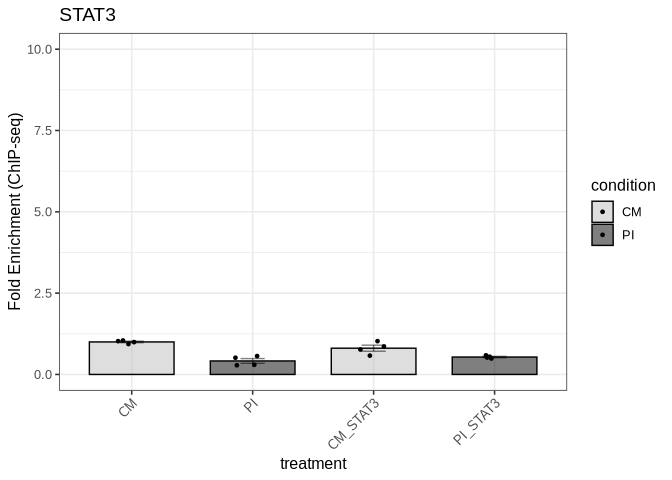

We export the figure to a PDF file in the Figure5 directory:

``` r
ggsave("output/Figure5/fig5c_gas2_gas3_stat3.pdf", fig5c, 
       width = 3, height = 6, dpi = 300, useDingbats=FALSE)
```

#### GAS2/GAS3 STAT3P

We import the data for GAS2_GAS3_STAT3P:

``` r
fig5_gas2_gas3_stat3p_data <- read_xlsx("input/Figure5_data.xlsx", sheet = "GAS2_GAS3_STAT3P")
```

``` r
fig5_gas2_gas3_stat3p_result <- compare_chipseq_groups(
  fig5_gas2_gas3_stat3p_data,
  group_col = "treatment",
  gene_col = "stat3p",
  control_col = "control",
  control_group = "CM"
)
```

We check the results of the statistical tests:

``` r
fig5_gas2_gas3_stat3p_result$all_wilcox_table
```

<div id="xbwvthmdmd" style="padding-left:0px;padding-right:0px;padding-top:10px;padding-bottom:10px;overflow-x:auto;overflow-y:auto;width:auto;height:auto;">
<style>#xbwvthmdmd table {
  font-family: system-ui, 'Segoe UI', Roboto, Helvetica, Arial, sans-serif, 'Apple Color Emoji', 'Segoe UI Emoji', 'Segoe UI Symbol', 'Noto Color Emoji';
  -webkit-font-smoothing: antialiased;
  -moz-osx-font-smoothing: grayscale;
}

#xbwvthmdmd thead, #xbwvthmdmd tbody, #xbwvthmdmd tfoot, #xbwvthmdmd tr, #xbwvthmdmd td, #xbwvthmdmd th {
  border-style: none;
}

#xbwvthmdmd p {
  margin: 0;
  padding: 0;
}

#xbwvthmdmd .gt_table {
  display: table;
  border-collapse: collapse;
  line-height: normal;
  margin-left: auto;
  margin-right: auto;
  color: #333333;
  font-size: 16px;
  font-weight: normal;
  font-style: normal;
  background-color: #FFFFFF;
  width: auto;
  border-top-style: solid;
  border-top-width: 2px;
  border-top-color: #A8A8A8;
  border-right-style: none;
  border-right-width: 2px;
  border-right-color: #D3D3D3;
  border-bottom-style: solid;
  border-bottom-width: 2px;
  border-bottom-color: #A8A8A8;
  border-left-style: none;
  border-left-width: 2px;
  border-left-color: #D3D3D3;
}

#xbwvthmdmd .gt_caption {
  padding-top: 4px;
  padding-bottom: 4px;
}

#xbwvthmdmd .gt_title {
  color: #333333;
  font-size: 125%;
  font-weight: initial;
  padding-top: 4px;
  padding-bottom: 4px;
  padding-left: 5px;
  padding-right: 5px;
  border-bottom-color: #FFFFFF;
  border-bottom-width: 0;
}

#xbwvthmdmd .gt_subtitle {
  color: #333333;
  font-size: 85%;
  font-weight: initial;
  padding-top: 3px;
  padding-bottom: 5px;
  padding-left: 5px;
  padding-right: 5px;
  border-top-color: #FFFFFF;
  border-top-width: 0;
}

#xbwvthmdmd .gt_heading {
  background-color: #FFFFFF;
  text-align: center;
  border-bottom-color: #FFFFFF;
  border-left-style: none;
  border-left-width: 1px;
  border-left-color: #D3D3D3;
  border-right-style: none;
  border-right-width: 1px;
  border-right-color: #D3D3D3;
}

#xbwvthmdmd .gt_bottom_border {
  border-bottom-style: solid;
  border-bottom-width: 2px;
  border-bottom-color: #D3D3D3;
}

#xbwvthmdmd .gt_col_headings {
  border-top-style: solid;
  border-top-width: 2px;
  border-top-color: #D3D3D3;
  border-bottom-style: solid;
  border-bottom-width: 2px;
  border-bottom-color: #D3D3D3;
  border-left-style: none;
  border-left-width: 1px;
  border-left-color: #D3D3D3;
  border-right-style: none;
  border-right-width: 1px;
  border-right-color: #D3D3D3;
}

#xbwvthmdmd .gt_col_heading {
  color: #333333;
  background-color: #FFFFFF;
  font-size: 100%;
  font-weight: normal;
  text-transform: inherit;
  border-left-style: none;
  border-left-width: 1px;
  border-left-color: #D3D3D3;
  border-right-style: none;
  border-right-width: 1px;
  border-right-color: #D3D3D3;
  vertical-align: bottom;
  padding-top: 5px;
  padding-bottom: 6px;
  padding-left: 5px;
  padding-right: 5px;
  overflow-x: hidden;
}

#xbwvthmdmd .gt_column_spanner_outer {
  color: #333333;
  background-color: #FFFFFF;
  font-size: 100%;
  font-weight: normal;
  text-transform: inherit;
  padding-top: 0;
  padding-bottom: 0;
  padding-left: 4px;
  padding-right: 4px;
}

#xbwvthmdmd .gt_column_spanner_outer:first-child {
  padding-left: 0;
}

#xbwvthmdmd .gt_column_spanner_outer:last-child {
  padding-right: 0;
}

#xbwvthmdmd .gt_column_spanner {
  border-bottom-style: solid;
  border-bottom-width: 2px;
  border-bottom-color: #D3D3D3;
  vertical-align: bottom;
  padding-top: 5px;
  padding-bottom: 5px;
  overflow-x: hidden;
  display: inline-block;
  width: 100%;
}

#xbwvthmdmd .gt_spanner_row {
  border-bottom-style: hidden;
}

#xbwvthmdmd .gt_group_heading {
  padding-top: 8px;
  padding-bottom: 8px;
  padding-left: 5px;
  padding-right: 5px;
  color: #333333;
  background-color: #FFFFFF;
  font-size: 100%;
  font-weight: initial;
  text-transform: inherit;
  border-top-style: solid;
  border-top-width: 2px;
  border-top-color: #D3D3D3;
  border-bottom-style: solid;
  border-bottom-width: 2px;
  border-bottom-color: #D3D3D3;
  border-left-style: none;
  border-left-width: 1px;
  border-left-color: #D3D3D3;
  border-right-style: none;
  border-right-width: 1px;
  border-right-color: #D3D3D3;
  vertical-align: middle;
  text-align: left;
}

#xbwvthmdmd .gt_empty_group_heading {
  padding: 0.5px;
  color: #333333;
  background-color: #FFFFFF;
  font-size: 100%;
  font-weight: initial;
  border-top-style: solid;
  border-top-width: 2px;
  border-top-color: #D3D3D3;
  border-bottom-style: solid;
  border-bottom-width: 2px;
  border-bottom-color: #D3D3D3;
  vertical-align: middle;
}

#xbwvthmdmd .gt_from_md > :first-child {
  margin-top: 0;
}

#xbwvthmdmd .gt_from_md > :last-child {
  margin-bottom: 0;
}

#xbwvthmdmd .gt_row {
  padding-top: 8px;
  padding-bottom: 8px;
  padding-left: 5px;
  padding-right: 5px;
  margin: 10px;
  border-top-style: solid;
  border-top-width: 1px;
  border-top-color: #D3D3D3;
  border-left-style: none;
  border-left-width: 1px;
  border-left-color: #D3D3D3;
  border-right-style: none;
  border-right-width: 1px;
  border-right-color: #D3D3D3;
  vertical-align: middle;
  overflow-x: hidden;
}

#xbwvthmdmd .gt_stub {
  color: #333333;
  background-color: #FFFFFF;
  font-size: 100%;
  font-weight: initial;
  text-transform: inherit;
  border-right-style: solid;
  border-right-width: 2px;
  border-right-color: #D3D3D3;
  padding-left: 5px;
  padding-right: 5px;
}

#xbwvthmdmd .gt_stub_row_group {
  color: #333333;
  background-color: #FFFFFF;
  font-size: 100%;
  font-weight: initial;
  text-transform: inherit;
  border-right-style: solid;
  border-right-width: 2px;
  border-right-color: #D3D3D3;
  padding-left: 5px;
  padding-right: 5px;
  vertical-align: top;
}

#xbwvthmdmd .gt_row_group_first td {
  border-top-width: 2px;
}

#xbwvthmdmd .gt_row_group_first th {
  border-top-width: 2px;
}

#xbwvthmdmd .gt_summary_row {
  color: #333333;
  background-color: #FFFFFF;
  text-transform: inherit;
  padding-top: 8px;
  padding-bottom: 8px;
  padding-left: 5px;
  padding-right: 5px;
}

#xbwvthmdmd .gt_first_summary_row {
  border-top-style: solid;
  border-top-color: #D3D3D3;
}

#xbwvthmdmd .gt_first_summary_row.thick {
  border-top-width: 2px;
}

#xbwvthmdmd .gt_last_summary_row {
  padding-top: 8px;
  padding-bottom: 8px;
  padding-left: 5px;
  padding-right: 5px;
  border-bottom-style: solid;
  border-bottom-width: 2px;
  border-bottom-color: #D3D3D3;
}

#xbwvthmdmd .gt_grand_summary_row {
  color: #333333;
  background-color: #FFFFFF;
  text-transform: inherit;
  padding-top: 8px;
  padding-bottom: 8px;
  padding-left: 5px;
  padding-right: 5px;
}

#xbwvthmdmd .gt_first_grand_summary_row {
  padding-top: 8px;
  padding-bottom: 8px;
  padding-left: 5px;
  padding-right: 5px;
  border-top-style: double;
  border-top-width: 6px;
  border-top-color: #D3D3D3;
}

#xbwvthmdmd .gt_last_grand_summary_row_top {
  padding-top: 8px;
  padding-bottom: 8px;
  padding-left: 5px;
  padding-right: 5px;
  border-bottom-style: double;
  border-bottom-width: 6px;
  border-bottom-color: #D3D3D3;
}

#xbwvthmdmd .gt_striped {
  background-color: rgba(128, 128, 128, 0.05);
}

#xbwvthmdmd .gt_table_body {
  border-top-style: solid;
  border-top-width: 2px;
  border-top-color: #D3D3D3;
  border-bottom-style: solid;
  border-bottom-width: 2px;
  border-bottom-color: #D3D3D3;
}

#xbwvthmdmd .gt_footnotes {
  color: #333333;
  background-color: #FFFFFF;
  border-bottom-style: none;
  border-bottom-width: 2px;
  border-bottom-color: #D3D3D3;
  border-left-style: none;
  border-left-width: 2px;
  border-left-color: #D3D3D3;
  border-right-style: none;
  border-right-width: 2px;
  border-right-color: #D3D3D3;
}

#xbwvthmdmd .gt_footnote {
  margin: 0px;
  font-size: 90%;
  padding-top: 4px;
  padding-bottom: 4px;
  padding-left: 5px;
  padding-right: 5px;
}

#xbwvthmdmd .gt_sourcenotes {
  color: #333333;
  background-color: #FFFFFF;
  border-bottom-style: none;
  border-bottom-width: 2px;
  border-bottom-color: #D3D3D3;
  border-left-style: none;
  border-left-width: 2px;
  border-left-color: #D3D3D3;
  border-right-style: none;
  border-right-width: 2px;
  border-right-color: #D3D3D3;
}

#xbwvthmdmd .gt_sourcenote {
  font-size: 90%;
  padding-top: 4px;
  padding-bottom: 4px;
  padding-left: 5px;
  padding-right: 5px;
}

#xbwvthmdmd .gt_left {
  text-align: left;
}

#xbwvthmdmd .gt_center {
  text-align: center;
}

#xbwvthmdmd .gt_right {
  text-align: right;
  font-variant-numeric: tabular-nums;
}

#xbwvthmdmd .gt_font_normal {
  font-weight: normal;
}

#xbwvthmdmd .gt_font_bold {
  font-weight: bold;
}

#xbwvthmdmd .gt_font_italic {
  font-style: italic;
}

#xbwvthmdmd .gt_super {
  font-size: 65%;
}

#xbwvthmdmd .gt_footnote_marks {
  font-size: 75%;
  vertical-align: 0.4em;
  position: initial;
}

#xbwvthmdmd .gt_asterisk {
  font-size: 100%;
  vertical-align: 0;
}

#xbwvthmdmd .gt_indent_1 {
  text-indent: 5px;
}

#xbwvthmdmd .gt_indent_2 {
  text-indent: 10px;
}

#xbwvthmdmd .gt_indent_3 {
  text-indent: 15px;
}

#xbwvthmdmd .gt_indent_4 {
  text-indent: 20px;
}

#xbwvthmdmd .gt_indent_5 {
  text-indent: 25px;
}
</style>
<table class="gt_table" data-quarto-disable-processing="false" data-quarto-bootstrap="false">
  <thead>
    <tr class="gt_col_headings">
      <th class="gt_col_heading gt_columns_bottom_border gt_left" rowspan="1" colspan="1" scope="col" id="Comparison">Comparison</th>
      <th class="gt_col_heading gt_columns_bottom_border gt_right" rowspan="1" colspan="1" scope="col" id="Statistic">Statistic</th>
      <th class="gt_col_heading gt_columns_bottom_border gt_right" rowspan="1" colspan="1" scope="col" id="P_value">P_value</th>
      <th class="gt_col_heading gt_columns_bottom_border gt_left" rowspan="1" colspan="1" scope="col" id="Significant">Significant</th>
    </tr>
  </thead>
  <tbody class="gt_table_body">
    <tr><td headers="Comparison" class="gt_row gt_left" style="background-color: rgba(204,230,255,0.8); color: #000000; font-weight: bold;">CM vs CM_STAT3P</td>
<td headers="Statistic" class="gt_row gt_right" style="background-color: rgba(204,230,255,0.8); color: #000000; font-weight: bold;">16</td>
<td headers="P_value" class="gt_row gt_right" style="background-color: rgba(204,230,255,0.8); color: #000000; font-weight: bold;">0.0286</td>
<td headers="Significant" class="gt_row gt_left" style="background-color: rgba(204,230,255,0.8); color: #000000; font-weight: bold;">Yes</td></tr>
    <tr><td headers="Comparison" class="gt_row gt_left" style="background-color: rgba(204,230,255,0.8); color: #000000; font-weight: bold;">CM vs PI</td>
<td headers="Statistic" class="gt_row gt_right" style="background-color: rgba(204,230,255,0.8); color: #000000; font-weight: bold;">16</td>
<td headers="P_value" class="gt_row gt_right" style="background-color: rgba(204,230,255,0.8); color: #000000; font-weight: bold;">0.0286</td>
<td headers="Significant" class="gt_row gt_left" style="background-color: rgba(204,230,255,0.8); color: #000000; font-weight: bold;">Yes</td></tr>
    <tr><td headers="Comparison" class="gt_row gt_left">CM vs PI_STAT3P</td>
<td headers="Statistic" class="gt_row gt_right">12</td>
<td headers="P_value" class="gt_row gt_right">0.0571</td>
<td headers="Significant" class="gt_row gt_left">No</td></tr>
    <tr><td headers="Comparison" class="gt_row gt_left" style="background-color: rgba(204,230,255,0.8); color: #000000; font-weight: bold;">CM_STAT3P vs PI</td>
<td headers="Statistic" class="gt_row gt_right" style="background-color: rgba(204,230,255,0.8); color: #000000; font-weight: bold;">0</td>
<td headers="P_value" class="gt_row gt_right" style="background-color: rgba(204,230,255,0.8); color: #000000; font-weight: bold;">0.0286</td>
<td headers="Significant" class="gt_row gt_left" style="background-color: rgba(204,230,255,0.8); color: #000000; font-weight: bold;">Yes</td></tr>
    <tr><td headers="Comparison" class="gt_row gt_left">CM_STAT3P vs PI_STAT3P</td>
<td headers="Statistic" class="gt_row gt_right">0</td>
<td headers="P_value" class="gt_row gt_right">0.0571</td>
<td headers="Significant" class="gt_row gt_left">No</td></tr>
    <tr><td headers="Comparison" class="gt_row gt_left">PI vs PI_STAT3P</td>
<td headers="Statistic" class="gt_row gt_right">0</td>
<td headers="P_value" class="gt_row gt_right">0.0571</td>
<td headers="Significant" class="gt_row gt_left">No</td></tr>
  </tbody>
  
  
</table>
</div>

We get the graph:

``` r
fig5d <- fig5_gas2_gas3_stat3p_result$p
```

``` r
fig5d
```


We export the figure to a PDF file in the Figure5 directory:

``` r
ggsave("output/Figure5/fig5d_gas2_gas3_stat3p.pdf", fig5d, 
       width = 3, height = 6, dpi = 300, useDingbats=FALSE)
```

#### GAS4 STAT3

We import the data for GAS4_STAT3:

``` r
fig5_gas4_stat3_data <- read_xlsx("input/Figure5_data.xlsx", sheet = "GAS4_STAT3")
```

``` r
fig5_gas4_stat3_result <- compare_chipseq_groups(
  fig5_gas4_stat3_data,
  group_col = "treatment",
  gene_col = "stat3",
  control_col = "control",
  control_group = "CM"
)
```

We check the results of the statistical tests:

``` r
fig5_gas4_stat3_result$all_wilcox_table
```

<div id="uhxrwiultu" style="padding-left:0px;padding-right:0px;padding-top:10px;padding-bottom:10px;overflow-x:auto;overflow-y:auto;width:auto;height:auto;">
<style>#uhxrwiultu table {
  font-family: system-ui, 'Segoe UI', Roboto, Helvetica, Arial, sans-serif, 'Apple Color Emoji', 'Segoe UI Emoji', 'Segoe UI Symbol', 'Noto Color Emoji';
  -webkit-font-smoothing: antialiased;
  -moz-osx-font-smoothing: grayscale;
}

#uhxrwiultu thead, #uhxrwiultu tbody, #uhxrwiultu tfoot, #uhxrwiultu tr, #uhxrwiultu td, #uhxrwiultu th {
  border-style: none;
}

#uhxrwiultu p {
  margin: 0;
  padding: 0;
}

#uhxrwiultu .gt_table {
  display: table;
  border-collapse: collapse;
  line-height: normal;
  margin-left: auto;
  margin-right: auto;
  color: #333333;
  font-size: 16px;
  font-weight: normal;
  font-style: normal;
  background-color: #FFFFFF;
  width: auto;
  border-top-style: solid;
  border-top-width: 2px;
  border-top-color: #A8A8A8;
  border-right-style: none;
  border-right-width: 2px;
  border-right-color: #D3D3D3;
  border-bottom-style: solid;
  border-bottom-width: 2px;
  border-bottom-color: #A8A8A8;
  border-left-style: none;
  border-left-width: 2px;
  border-left-color: #D3D3D3;
}

#uhxrwiultu .gt_caption {
  padding-top: 4px;
  padding-bottom: 4px;
}

#uhxrwiultu .gt_title {
  color: #333333;
  font-size: 125%;
  font-weight: initial;
  padding-top: 4px;
  padding-bottom: 4px;
  padding-left: 5px;
  padding-right: 5px;
  border-bottom-color: #FFFFFF;
  border-bottom-width: 0;
}

#uhxrwiultu .gt_subtitle {
  color: #333333;
  font-size: 85%;
  font-weight: initial;
  padding-top: 3px;
  padding-bottom: 5px;
  padding-left: 5px;
  padding-right: 5px;
  border-top-color: #FFFFFF;
  border-top-width: 0;
}

#uhxrwiultu .gt_heading {
  background-color: #FFFFFF;
  text-align: center;
  border-bottom-color: #FFFFFF;
  border-left-style: none;
  border-left-width: 1px;
  border-left-color: #D3D3D3;
  border-right-style: none;
  border-right-width: 1px;
  border-right-color: #D3D3D3;
}

#uhxrwiultu .gt_bottom_border {
  border-bottom-style: solid;
  border-bottom-width: 2px;
  border-bottom-color: #D3D3D3;
}

#uhxrwiultu .gt_col_headings {
  border-top-style: solid;
  border-top-width: 2px;
  border-top-color: #D3D3D3;
  border-bottom-style: solid;
  border-bottom-width: 2px;
  border-bottom-color: #D3D3D3;
  border-left-style: none;
  border-left-width: 1px;
  border-left-color: #D3D3D3;
  border-right-style: none;
  border-right-width: 1px;
  border-right-color: #D3D3D3;
}

#uhxrwiultu .gt_col_heading {
  color: #333333;
  background-color: #FFFFFF;
  font-size: 100%;
  font-weight: normal;
  text-transform: inherit;
  border-left-style: none;
  border-left-width: 1px;
  border-left-color: #D3D3D3;
  border-right-style: none;
  border-right-width: 1px;
  border-right-color: #D3D3D3;
  vertical-align: bottom;
  padding-top: 5px;
  padding-bottom: 6px;
  padding-left: 5px;
  padding-right: 5px;
  overflow-x: hidden;
}

#uhxrwiultu .gt_column_spanner_outer {
  color: #333333;
  background-color: #FFFFFF;
  font-size: 100%;
  font-weight: normal;
  text-transform: inherit;
  padding-top: 0;
  padding-bottom: 0;
  padding-left: 4px;
  padding-right: 4px;
}

#uhxrwiultu .gt_column_spanner_outer:first-child {
  padding-left: 0;
}

#uhxrwiultu .gt_column_spanner_outer:last-child {
  padding-right: 0;
}

#uhxrwiultu .gt_column_spanner {
  border-bottom-style: solid;
  border-bottom-width: 2px;
  border-bottom-color: #D3D3D3;
  vertical-align: bottom;
  padding-top: 5px;
  padding-bottom: 5px;
  overflow-x: hidden;
  display: inline-block;
  width: 100%;
}

#uhxrwiultu .gt_spanner_row {
  border-bottom-style: hidden;
}

#uhxrwiultu .gt_group_heading {
  padding-top: 8px;
  padding-bottom: 8px;
  padding-left: 5px;
  padding-right: 5px;
  color: #333333;
  background-color: #FFFFFF;
  font-size: 100%;
  font-weight: initial;
  text-transform: inherit;
  border-top-style: solid;
  border-top-width: 2px;
  border-top-color: #D3D3D3;
  border-bottom-style: solid;
  border-bottom-width: 2px;
  border-bottom-color: #D3D3D3;
  border-left-style: none;
  border-left-width: 1px;
  border-left-color: #D3D3D3;
  border-right-style: none;
  border-right-width: 1px;
  border-right-color: #D3D3D3;
  vertical-align: middle;
  text-align: left;
}

#uhxrwiultu .gt_empty_group_heading {
  padding: 0.5px;
  color: #333333;
  background-color: #FFFFFF;
  font-size: 100%;
  font-weight: initial;
  border-top-style: solid;
  border-top-width: 2px;
  border-top-color: #D3D3D3;
  border-bottom-style: solid;
  border-bottom-width: 2px;
  border-bottom-color: #D3D3D3;
  vertical-align: middle;
}

#uhxrwiultu .gt_from_md > :first-child {
  margin-top: 0;
}

#uhxrwiultu .gt_from_md > :last-child {
  margin-bottom: 0;
}

#uhxrwiultu .gt_row {
  padding-top: 8px;
  padding-bottom: 8px;
  padding-left: 5px;
  padding-right: 5px;
  margin: 10px;
  border-top-style: solid;
  border-top-width: 1px;
  border-top-color: #D3D3D3;
  border-left-style: none;
  border-left-width: 1px;
  border-left-color: #D3D3D3;
  border-right-style: none;
  border-right-width: 1px;
  border-right-color: #D3D3D3;
  vertical-align: middle;
  overflow-x: hidden;
}

#uhxrwiultu .gt_stub {
  color: #333333;
  background-color: #FFFFFF;
  font-size: 100%;
  font-weight: initial;
  text-transform: inherit;
  border-right-style: solid;
  border-right-width: 2px;
  border-right-color: #D3D3D3;
  padding-left: 5px;
  padding-right: 5px;
}

#uhxrwiultu .gt_stub_row_group {
  color: #333333;
  background-color: #FFFFFF;
  font-size: 100%;
  font-weight: initial;
  text-transform: inherit;
  border-right-style: solid;
  border-right-width: 2px;
  border-right-color: #D3D3D3;
  padding-left: 5px;
  padding-right: 5px;
  vertical-align: top;
}

#uhxrwiultu .gt_row_group_first td {
  border-top-width: 2px;
}

#uhxrwiultu .gt_row_group_first th {
  border-top-width: 2px;
}

#uhxrwiultu .gt_summary_row {
  color: #333333;
  background-color: #FFFFFF;
  text-transform: inherit;
  padding-top: 8px;
  padding-bottom: 8px;
  padding-left: 5px;
  padding-right: 5px;
}

#uhxrwiultu .gt_first_summary_row {
  border-top-style: solid;
  border-top-color: #D3D3D3;
}

#uhxrwiultu .gt_first_summary_row.thick {
  border-top-width: 2px;
}

#uhxrwiultu .gt_last_summary_row {
  padding-top: 8px;
  padding-bottom: 8px;
  padding-left: 5px;
  padding-right: 5px;
  border-bottom-style: solid;
  border-bottom-width: 2px;
  border-bottom-color: #D3D3D3;
}

#uhxrwiultu .gt_grand_summary_row {
  color: #333333;
  background-color: #FFFFFF;
  text-transform: inherit;
  padding-top: 8px;
  padding-bottom: 8px;
  padding-left: 5px;
  padding-right: 5px;
}

#uhxrwiultu .gt_first_grand_summary_row {
  padding-top: 8px;
  padding-bottom: 8px;
  padding-left: 5px;
  padding-right: 5px;
  border-top-style: double;
  border-top-width: 6px;
  border-top-color: #D3D3D3;
}

#uhxrwiultu .gt_last_grand_summary_row_top {
  padding-top: 8px;
  padding-bottom: 8px;
  padding-left: 5px;
  padding-right: 5px;
  border-bottom-style: double;
  border-bottom-width: 6px;
  border-bottom-color: #D3D3D3;
}

#uhxrwiultu .gt_striped {
  background-color: rgba(128, 128, 128, 0.05);
}

#uhxrwiultu .gt_table_body {
  border-top-style: solid;
  border-top-width: 2px;
  border-top-color: #D3D3D3;
  border-bottom-style: solid;
  border-bottom-width: 2px;
  border-bottom-color: #D3D3D3;
}

#uhxrwiultu .gt_footnotes {
  color: #333333;
  background-color: #FFFFFF;
  border-bottom-style: none;
  border-bottom-width: 2px;
  border-bottom-color: #D3D3D3;
  border-left-style: none;
  border-left-width: 2px;
  border-left-color: #D3D3D3;
  border-right-style: none;
  border-right-width: 2px;
  border-right-color: #D3D3D3;
}

#uhxrwiultu .gt_footnote {
  margin: 0px;
  font-size: 90%;
  padding-top: 4px;
  padding-bottom: 4px;
  padding-left: 5px;
  padding-right: 5px;
}

#uhxrwiultu .gt_sourcenotes {
  color: #333333;
  background-color: #FFFFFF;
  border-bottom-style: none;
  border-bottom-width: 2px;
  border-bottom-color: #D3D3D3;
  border-left-style: none;
  border-left-width: 2px;
  border-left-color: #D3D3D3;
  border-right-style: none;
  border-right-width: 2px;
  border-right-color: #D3D3D3;
}

#uhxrwiultu .gt_sourcenote {
  font-size: 90%;
  padding-top: 4px;
  padding-bottom: 4px;
  padding-left: 5px;
  padding-right: 5px;
}

#uhxrwiultu .gt_left {
  text-align: left;
}

#uhxrwiultu .gt_center {
  text-align: center;
}

#uhxrwiultu .gt_right {
  text-align: right;
  font-variant-numeric: tabular-nums;
}

#uhxrwiultu .gt_font_normal {
  font-weight: normal;
}

#uhxrwiultu .gt_font_bold {
  font-weight: bold;
}

#uhxrwiultu .gt_font_italic {
  font-style: italic;
}

#uhxrwiultu .gt_super {
  font-size: 65%;
}

#uhxrwiultu .gt_footnote_marks {
  font-size: 75%;
  vertical-align: 0.4em;
  position: initial;
}

#uhxrwiultu .gt_asterisk {
  font-size: 100%;
  vertical-align: 0;
}

#uhxrwiultu .gt_indent_1 {
  text-indent: 5px;
}

#uhxrwiultu .gt_indent_2 {
  text-indent: 10px;
}

#uhxrwiultu .gt_indent_3 {
  text-indent: 15px;
}

#uhxrwiultu .gt_indent_4 {
  text-indent: 20px;
}

#uhxrwiultu .gt_indent_5 {
  text-indent: 25px;
}
</style>
<table class="gt_table" data-quarto-disable-processing="false" data-quarto-bootstrap="false">
  <thead>
    <tr class="gt_col_headings">
      <th class="gt_col_heading gt_columns_bottom_border gt_left" rowspan="1" colspan="1" scope="col" id="Comparison">Comparison</th>
      <th class="gt_col_heading gt_columns_bottom_border gt_right" rowspan="1" colspan="1" scope="col" id="Statistic">Statistic</th>
      <th class="gt_col_heading gt_columns_bottom_border gt_right" rowspan="1" colspan="1" scope="col" id="P_value">P_value</th>
      <th class="gt_col_heading gt_columns_bottom_border gt_left" rowspan="1" colspan="1" scope="col" id="Significant">Significant</th>
    </tr>
  </thead>
  <tbody class="gt_table_body">
    <tr><td headers="Comparison" class="gt_row gt_left">CM vs CM_STAT3</td>
<td headers="Statistic" class="gt_row gt_right">2</td>
<td headers="P_value" class="gt_row gt_right">0.1143</td>
<td headers="Significant" class="gt_row gt_left">No</td></tr>
    <tr><td headers="Comparison" class="gt_row gt_left">CM vs PI</td>
<td headers="Statistic" class="gt_row gt_right">13</td>
<td headers="P_value" class="gt_row gt_right">0.2000</td>
<td headers="Significant" class="gt_row gt_left">No</td></tr>
    <tr><td headers="Comparison" class="gt_row gt_left">CM vs PI_STAT3</td>
<td headers="Statistic" class="gt_row gt_right">8</td>
<td headers="P_value" class="gt_row gt_right">1.0000</td>
<td headers="Significant" class="gt_row gt_left">No</td></tr>
    <tr><td headers="Comparison" class="gt_row gt_left">CM_STAT3 vs PI</td>
<td headers="Statistic" class="gt_row gt_right">15</td>
<td headers="P_value" class="gt_row gt_right">0.0571</td>
<td headers="Significant" class="gt_row gt_left">No</td></tr>
    <tr><td headers="Comparison" class="gt_row gt_left">CM_STAT3 vs PI_STAT3</td>
<td headers="Statistic" class="gt_row gt_right">12</td>
<td headers="P_value" class="gt_row gt_right">0.3429</td>
<td headers="Significant" class="gt_row gt_left">No</td></tr>
    <tr><td headers="Comparison" class="gt_row gt_left">PI vs PI_STAT3</td>
<td headers="Statistic" class="gt_row gt_right">4</td>
<td headers="P_value" class="gt_row gt_right">0.3429</td>
<td headers="Significant" class="gt_row gt_left">No</td></tr>
  </tbody>
  
  
</table>
</div>

We get the graph:

``` r
fig5e <- fig5_gas4_stat3_result$p
```

``` r
fig5e
```

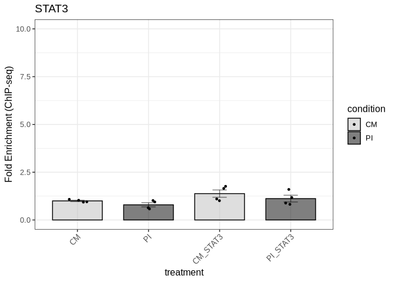

We export the figure to a PDF file in the Figure5 directory:

``` r
ggsave("output/Figure5/fig5e_gas4_stat3.pdf", fig5e, 
       width = 3, height = 6, dpi = 300, useDingbats=FALSE)
```

#### GAS4 STAT3P

We import the data for GAS4_STAT3P:

``` r
fig5_gas4_stat3p_data <- read_xlsx("input/Figure5_data.xlsx", sheet = "GAS4_STAT3P")
```

``` r
fig5_gas4_stat3p_result <- compare_chipseq_groups(
  fig5_gas4_stat3p_data,
  group_col = "treatment",
  gene_col = "stat3p",
  control_col = "control",
  control_group = "CM",
  wilcox_pairs = list(c("CM_STAT3P", "PI_STAT3P"), 
                      c("PI", "PI_STAT3P"))
)
```

    Warning in wilcox.test.default(vals1, vals2, alternative = "two.sided", :
    cannot compute exact p-value with ties

We check the results of the statistical tests:

``` r
fig5_gas4_stat3p_result$all_wilcox_table
```

<div id="ilxmighugn" style="padding-left:0px;padding-right:0px;padding-top:10px;padding-bottom:10px;overflow-x:auto;overflow-y:auto;width:auto;height:auto;">
<style>#ilxmighugn table {
  font-family: system-ui, 'Segoe UI', Roboto, Helvetica, Arial, sans-serif, 'Apple Color Emoji', 'Segoe UI Emoji', 'Segoe UI Symbol', 'Noto Color Emoji';
  -webkit-font-smoothing: antialiased;
  -moz-osx-font-smoothing: grayscale;
}

#ilxmighugn thead, #ilxmighugn tbody, #ilxmighugn tfoot, #ilxmighugn tr, #ilxmighugn td, #ilxmighugn th {
  border-style: none;
}

#ilxmighugn p {
  margin: 0;
  padding: 0;
}

#ilxmighugn .gt_table {
  display: table;
  border-collapse: collapse;
  line-height: normal;
  margin-left: auto;
  margin-right: auto;
  color: #333333;
  font-size: 16px;
  font-weight: normal;
  font-style: normal;
  background-color: #FFFFFF;
  width: auto;
  border-top-style: solid;
  border-top-width: 2px;
  border-top-color: #A8A8A8;
  border-right-style: none;
  border-right-width: 2px;
  border-right-color: #D3D3D3;
  border-bottom-style: solid;
  border-bottom-width: 2px;
  border-bottom-color: #A8A8A8;
  border-left-style: none;
  border-left-width: 2px;
  border-left-color: #D3D3D3;
}

#ilxmighugn .gt_caption {
  padding-top: 4px;
  padding-bottom: 4px;
}

#ilxmighugn .gt_title {
  color: #333333;
  font-size: 125%;
  font-weight: initial;
  padding-top: 4px;
  padding-bottom: 4px;
  padding-left: 5px;
  padding-right: 5px;
  border-bottom-color: #FFFFFF;
  border-bottom-width: 0;
}

#ilxmighugn .gt_subtitle {
  color: #333333;
  font-size: 85%;
  font-weight: initial;
  padding-top: 3px;
  padding-bottom: 5px;
  padding-left: 5px;
  padding-right: 5px;
  border-top-color: #FFFFFF;
  border-top-width: 0;
}

#ilxmighugn .gt_heading {
  background-color: #FFFFFF;
  text-align: center;
  border-bottom-color: #FFFFFF;
  border-left-style: none;
  border-left-width: 1px;
  border-left-color: #D3D3D3;
  border-right-style: none;
  border-right-width: 1px;
  border-right-color: #D3D3D3;
}

#ilxmighugn .gt_bottom_border {
  border-bottom-style: solid;
  border-bottom-width: 2px;
  border-bottom-color: #D3D3D3;
}

#ilxmighugn .gt_col_headings {
  border-top-style: solid;
  border-top-width: 2px;
  border-top-color: #D3D3D3;
  border-bottom-style: solid;
  border-bottom-width: 2px;
  border-bottom-color: #D3D3D3;
  border-left-style: none;
  border-left-width: 1px;
  border-left-color: #D3D3D3;
  border-right-style: none;
  border-right-width: 1px;
  border-right-color: #D3D3D3;
}

#ilxmighugn .gt_col_heading {
  color: #333333;
  background-color: #FFFFFF;
  font-size: 100%;
  font-weight: normal;
  text-transform: inherit;
  border-left-style: none;
  border-left-width: 1px;
  border-left-color: #D3D3D3;
  border-right-style: none;
  border-right-width: 1px;
  border-right-color: #D3D3D3;
  vertical-align: bottom;
  padding-top: 5px;
  padding-bottom: 6px;
  padding-left: 5px;
  padding-right: 5px;
  overflow-x: hidden;
}

#ilxmighugn .gt_column_spanner_outer {
  color: #333333;
  background-color: #FFFFFF;
  font-size: 100%;
  font-weight: normal;
  text-transform: inherit;
  padding-top: 0;
  padding-bottom: 0;
  padding-left: 4px;
  padding-right: 4px;
}

#ilxmighugn .gt_column_spanner_outer:first-child {
  padding-left: 0;
}

#ilxmighugn .gt_column_spanner_outer:last-child {
  padding-right: 0;
}

#ilxmighugn .gt_column_spanner {
  border-bottom-style: solid;
  border-bottom-width: 2px;
  border-bottom-color: #D3D3D3;
  vertical-align: bottom;
  padding-top: 5px;
  padding-bottom: 5px;
  overflow-x: hidden;
  display: inline-block;
  width: 100%;
}

#ilxmighugn .gt_spanner_row {
  border-bottom-style: hidden;
}

#ilxmighugn .gt_group_heading {
  padding-top: 8px;
  padding-bottom: 8px;
  padding-left: 5px;
  padding-right: 5px;
  color: #333333;
  background-color: #FFFFFF;
  font-size: 100%;
  font-weight: initial;
  text-transform: inherit;
  border-top-style: solid;
  border-top-width: 2px;
  border-top-color: #D3D3D3;
  border-bottom-style: solid;
  border-bottom-width: 2px;
  border-bottom-color: #D3D3D3;
  border-left-style: none;
  border-left-width: 1px;
  border-left-color: #D3D3D3;
  border-right-style: none;
  border-right-width: 1px;
  border-right-color: #D3D3D3;
  vertical-align: middle;
  text-align: left;
}

#ilxmighugn .gt_empty_group_heading {
  padding: 0.5px;
  color: #333333;
  background-color: #FFFFFF;
  font-size: 100%;
  font-weight: initial;
  border-top-style: solid;
  border-top-width: 2px;
  border-top-color: #D3D3D3;
  border-bottom-style: solid;
  border-bottom-width: 2px;
  border-bottom-color: #D3D3D3;
  vertical-align: middle;
}

#ilxmighugn .gt_from_md > :first-child {
  margin-top: 0;
}

#ilxmighugn .gt_from_md > :last-child {
  margin-bottom: 0;
}

#ilxmighugn .gt_row {
  padding-top: 8px;
  padding-bottom: 8px;
  padding-left: 5px;
  padding-right: 5px;
  margin: 10px;
  border-top-style: solid;
  border-top-width: 1px;
  border-top-color: #D3D3D3;
  border-left-style: none;
  border-left-width: 1px;
  border-left-color: #D3D3D3;
  border-right-style: none;
  border-right-width: 1px;
  border-right-color: #D3D3D3;
  vertical-align: middle;
  overflow-x: hidden;
}

#ilxmighugn .gt_stub {
  color: #333333;
  background-color: #FFFFFF;
  font-size: 100%;
  font-weight: initial;
  text-transform: inherit;
  border-right-style: solid;
  border-right-width: 2px;
  border-right-color: #D3D3D3;
  padding-left: 5px;
  padding-right: 5px;
}

#ilxmighugn .gt_stub_row_group {
  color: #333333;
  background-color: #FFFFFF;
  font-size: 100%;
  font-weight: initial;
  text-transform: inherit;
  border-right-style: solid;
  border-right-width: 2px;
  border-right-color: #D3D3D3;
  padding-left: 5px;
  padding-right: 5px;
  vertical-align: top;
}

#ilxmighugn .gt_row_group_first td {
  border-top-width: 2px;
}

#ilxmighugn .gt_row_group_first th {
  border-top-width: 2px;
}

#ilxmighugn .gt_summary_row {
  color: #333333;
  background-color: #FFFFFF;
  text-transform: inherit;
  padding-top: 8px;
  padding-bottom: 8px;
  padding-left: 5px;
  padding-right: 5px;
}

#ilxmighugn .gt_first_summary_row {
  border-top-style: solid;
  border-top-color: #D3D3D3;
}

#ilxmighugn .gt_first_summary_row.thick {
  border-top-width: 2px;
}

#ilxmighugn .gt_last_summary_row {
  padding-top: 8px;
  padding-bottom: 8px;
  padding-left: 5px;
  padding-right: 5px;
  border-bottom-style: solid;
  border-bottom-width: 2px;
  border-bottom-color: #D3D3D3;
}

#ilxmighugn .gt_grand_summary_row {
  color: #333333;
  background-color: #FFFFFF;
  text-transform: inherit;
  padding-top: 8px;
  padding-bottom: 8px;
  padding-left: 5px;
  padding-right: 5px;
}

#ilxmighugn .gt_first_grand_summary_row {
  padding-top: 8px;
  padding-bottom: 8px;
  padding-left: 5px;
  padding-right: 5px;
  border-top-style: double;
  border-top-width: 6px;
  border-top-color: #D3D3D3;
}

#ilxmighugn .gt_last_grand_summary_row_top {
  padding-top: 8px;
  padding-bottom: 8px;
  padding-left: 5px;
  padding-right: 5px;
  border-bottom-style: double;
  border-bottom-width: 6px;
  border-bottom-color: #D3D3D3;
}

#ilxmighugn .gt_striped {
  background-color: rgba(128, 128, 128, 0.05);
}

#ilxmighugn .gt_table_body {
  border-top-style: solid;
  border-top-width: 2px;
  border-top-color: #D3D3D3;
  border-bottom-style: solid;
  border-bottom-width: 2px;
  border-bottom-color: #D3D3D3;
}

#ilxmighugn .gt_footnotes {
  color: #333333;
  background-color: #FFFFFF;
  border-bottom-style: none;
  border-bottom-width: 2px;
  border-bottom-color: #D3D3D3;
  border-left-style: none;
  border-left-width: 2px;
  border-left-color: #D3D3D3;
  border-right-style: none;
  border-right-width: 2px;
  border-right-color: #D3D3D3;
}

#ilxmighugn .gt_footnote {
  margin: 0px;
  font-size: 90%;
  padding-top: 4px;
  padding-bottom: 4px;
  padding-left: 5px;
  padding-right: 5px;
}

#ilxmighugn .gt_sourcenotes {
  color: #333333;
  background-color: #FFFFFF;
  border-bottom-style: none;
  border-bottom-width: 2px;
  border-bottom-color: #D3D3D3;
  border-left-style: none;
  border-left-width: 2px;
  border-left-color: #D3D3D3;
  border-right-style: none;
  border-right-width: 2px;
  border-right-color: #D3D3D3;
}

#ilxmighugn .gt_sourcenote {
  font-size: 90%;
  padding-top: 4px;
  padding-bottom: 4px;
  padding-left: 5px;
  padding-right: 5px;
}

#ilxmighugn .gt_left {
  text-align: left;
}

#ilxmighugn .gt_center {
  text-align: center;
}

#ilxmighugn .gt_right {
  text-align: right;
  font-variant-numeric: tabular-nums;
}

#ilxmighugn .gt_font_normal {
  font-weight: normal;
}

#ilxmighugn .gt_font_bold {
  font-weight: bold;
}

#ilxmighugn .gt_font_italic {
  font-style: italic;
}

#ilxmighugn .gt_super {
  font-size: 65%;
}

#ilxmighugn .gt_footnote_marks {
  font-size: 75%;
  vertical-align: 0.4em;
  position: initial;
}

#ilxmighugn .gt_asterisk {
  font-size: 100%;
  vertical-align: 0;
}

#ilxmighugn .gt_indent_1 {
  text-indent: 5px;
}

#ilxmighugn .gt_indent_2 {
  text-indent: 10px;
}

#ilxmighugn .gt_indent_3 {
  text-indent: 15px;
}

#ilxmighugn .gt_indent_4 {
  text-indent: 20px;
}

#ilxmighugn .gt_indent_5 {
  text-indent: 25px;
}
</style>
<table class="gt_table" data-quarto-disable-processing="false" data-quarto-bootstrap="false">
  <thead>
    <tr class="gt_col_headings">
      <th class="gt_col_heading gt_columns_bottom_border gt_left" rowspan="1" colspan="1" scope="col" id="Comparison">Comparison</th>
      <th class="gt_col_heading gt_columns_bottom_border gt_right" rowspan="1" colspan="1" scope="col" id="Statistic">Statistic</th>
      <th class="gt_col_heading gt_columns_bottom_border gt_right" rowspan="1" colspan="1" scope="col" id="P_value">P_value</th>
      <th class="gt_col_heading gt_columns_bottom_border gt_left" rowspan="1" colspan="1" scope="col" id="Significant">Significant</th>
    </tr>
  </thead>
  <tbody class="gt_table_body">
    <tr><td headers="Comparison" class="gt_row gt_left">CM vs CM_STAT3P</td>
<td headers="Statistic" class="gt_row gt_right">4.5</td>
<td headers="P_value" class="gt_row gt_right">0.3836</td>
<td headers="Significant" class="gt_row gt_left">No</td></tr>
    <tr><td headers="Comparison" class="gt_row gt_left" style="background-color: rgba(204,230,255,0.8); color: #000000; font-weight: bold;">CM vs PI</td>
<td headers="Statistic" class="gt_row gt_right" style="background-color: rgba(204,230,255,0.8); color: #000000; font-weight: bold;">16.0</td>
<td headers="P_value" class="gt_row gt_right" style="background-color: rgba(204,230,255,0.8); color: #000000; font-weight: bold;">0.0286</td>
<td headers="Significant" class="gt_row gt_left" style="background-color: rgba(204,230,255,0.8); color: #000000; font-weight: bold;">Yes</td></tr>
    <tr><td headers="Comparison" class="gt_row gt_left" style="background-color: rgba(204,230,255,0.8); color: #000000; font-weight: bold;">CM vs PI_STAT3P</td>
<td headers="Statistic" class="gt_row gt_right" style="background-color: rgba(204,230,255,0.8); color: #000000; font-weight: bold;">0.0</td>
<td headers="P_value" class="gt_row gt_right" style="background-color: rgba(204,230,255,0.8); color: #000000; font-weight: bold;">0.0286</td>
<td headers="Significant" class="gt_row gt_left" style="background-color: rgba(204,230,255,0.8); color: #000000; font-weight: bold;">Yes</td></tr>
    <tr><td headers="Comparison" class="gt_row gt_left" style="background-color: rgba(204,230,255,0.8); color: #000000; font-weight: bold;">CM_STAT3P vs PI</td>
<td headers="Statistic" class="gt_row gt_right" style="background-color: rgba(204,230,255,0.8); color: #000000; font-weight: bold;">16.0</td>
<td headers="P_value" class="gt_row gt_right" style="background-color: rgba(204,230,255,0.8); color: #000000; font-weight: bold;">0.0286</td>
<td headers="Significant" class="gt_row gt_left" style="background-color: rgba(204,230,255,0.8); color: #000000; font-weight: bold;">Yes</td></tr>
    <tr><td headers="Comparison" class="gt_row gt_left" style="background-color: rgba(204,230,255,0.8); color: #000000; font-weight: bold;">CM_STAT3P vs PI_STAT3P</td>
<td headers="Statistic" class="gt_row gt_right" style="background-color: rgba(204,230,255,0.8); color: #000000; font-weight: bold;">0.0</td>
<td headers="P_value" class="gt_row gt_right" style="background-color: rgba(204,230,255,0.8); color: #000000; font-weight: bold;">0.0286</td>
<td headers="Significant" class="gt_row gt_left" style="background-color: rgba(204,230,255,0.8); color: #000000; font-weight: bold;">Yes</td></tr>
    <tr><td headers="Comparison" class="gt_row gt_left" style="background-color: rgba(204,230,255,0.8); color: #000000; font-weight: bold;">PI vs PI_STAT3P</td>
<td headers="Statistic" class="gt_row gt_right" style="background-color: rgba(204,230,255,0.8); color: #000000; font-weight: bold;">0.0</td>
<td headers="P_value" class="gt_row gt_right" style="background-color: rgba(204,230,255,0.8); color: #000000; font-weight: bold;">0.0286</td>
<td headers="Significant" class="gt_row gt_left" style="background-color: rgba(204,230,255,0.8); color: #000000; font-weight: bold;">Yes</td></tr>
  </tbody>
  
  
</table>
</div>

We get the graph:

``` r
fig5f <- fig5_gas4_stat3p_result$p
```

``` r
fig5f
```

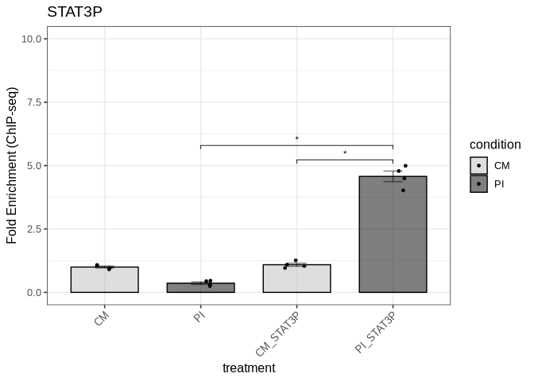

We use the `plot_grid` function to create the composite Figure 5. The
figure will have 2 rows and 5 columns, with the first row containing the
STAT3 data and the second row containing the STAT3P data:

``` r
composite_fig5 <- plot_grid(fig5a, fig5c, fig5e, fig5g, fig5i,
                            fig5b, fig5d, fig5f, fig5h, fig5j,
                            ncol = 5, nrow = 2,
                            labels = c("A", "C", "E", "G", "I",
                                       "B", "D", "F", "H", "J"),
                            label_size = 12,
                            align = "v")
```

``` r
composite_fig5
```

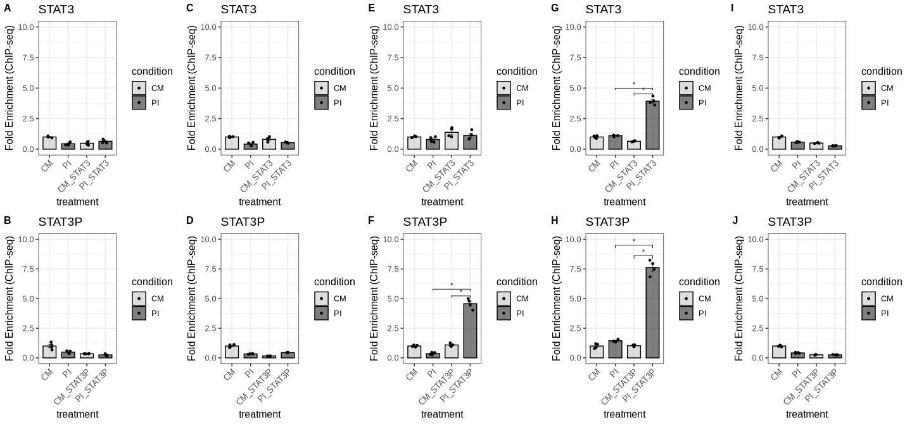

We save the composite Figure 5 to a file:

``` r
ggsave("output/Figure5/composite_fig5.pdf", composite_fig5, 
       width = 15, height = 7, dpi = 300, useDingbats=FALSE)
```

## Supplemental Data

### Supplemental Figure 1

#### Supplemental Figure 1a (STAT5B mRNA expression levels)

We import the data for STAT5B mRNA expression levels from the qPCR
experiment:

``` r
suppl1_stat5b_qpcr_data <- read_xlsx("input/Supplemental_Figure1_data.xlsx", sheet = "STAT5_mRNA")
```

We compare the STAT5B mRNA expression levels between the two conditions:

``` r
suppl1_stat5b_qpcr_result <- compare_qpcr_groups(
  suppl1_stat5b_qpcr_data,
  group_col = "treatment",
  gene_col = "stat5b",
  actin_col = "actin",
  control_group = "CM",
  wilcox_pairs = list(c("CM", "PI"))
)
```

We check all the statistical test results:

``` r
suppl1_stat5b_qpcr_result$all_wilcox_table
```

<div id="xiwhmswnaz" style="padding-left:0px;padding-right:0px;padding-top:10px;padding-bottom:10px;overflow-x:auto;overflow-y:auto;width:auto;height:auto;">
<style>#xiwhmswnaz table {
  font-family: system-ui, 'Segoe UI', Roboto, Helvetica, Arial, sans-serif, 'Apple Color Emoji', 'Segoe UI Emoji', 'Segoe UI Symbol', 'Noto Color Emoji';
  -webkit-font-smoothing: antialiased;
  -moz-osx-font-smoothing: grayscale;
}

#xiwhmswnaz thead, #xiwhmswnaz tbody, #xiwhmswnaz tfoot, #xiwhmswnaz tr, #xiwhmswnaz td, #xiwhmswnaz th {
  border-style: none;
}

#xiwhmswnaz p {
  margin: 0;
  padding: 0;
}

#xiwhmswnaz .gt_table {
  display: table;
  border-collapse: collapse;
  line-height: normal;
  margin-left: auto;
  margin-right: auto;
  color: #333333;
  font-size: 16px;
  font-weight: normal;
  font-style: normal;
  background-color: #FFFFFF;
  width: auto;
  border-top-style: solid;
  border-top-width: 2px;
  border-top-color: #A8A8A8;
  border-right-style: none;
  border-right-width: 2px;
  border-right-color: #D3D3D3;
  border-bottom-style: solid;
  border-bottom-width: 2px;
  border-bottom-color: #A8A8A8;
  border-left-style: none;
  border-left-width: 2px;
  border-left-color: #D3D3D3;
}

#xiwhmswnaz .gt_caption {
  padding-top: 4px;
  padding-bottom: 4px;
}

#xiwhmswnaz .gt_title {
  color: #333333;
  font-size: 125%;
  font-weight: initial;
  padding-top: 4px;
  padding-bottom: 4px;
  padding-left: 5px;
  padding-right: 5px;
  border-bottom-color: #FFFFFF;
  border-bottom-width: 0;
}

#xiwhmswnaz .gt_subtitle {
  color: #333333;
  font-size: 85%;
  font-weight: initial;
  padding-top: 3px;
  padding-bottom: 5px;
  padding-left: 5px;
  padding-right: 5px;
  border-top-color: #FFFFFF;
  border-top-width: 0;
}

#xiwhmswnaz .gt_heading {
  background-color: #FFFFFF;
  text-align: center;
  border-bottom-color: #FFFFFF;
  border-left-style: none;
  border-left-width: 1px;
  border-left-color: #D3D3D3;
  border-right-style: none;
  border-right-width: 1px;
  border-right-color: #D3D3D3;
}

#xiwhmswnaz .gt_bottom_border {
  border-bottom-style: solid;
  border-bottom-width: 2px;
  border-bottom-color: #D3D3D3;
}

#xiwhmswnaz .gt_col_headings {
  border-top-style: solid;
  border-top-width: 2px;
  border-top-color: #D3D3D3;
  border-bottom-style: solid;
  border-bottom-width: 2px;
  border-bottom-color: #D3D3D3;
  border-left-style: none;
  border-left-width: 1px;
  border-left-color: #D3D3D3;
  border-right-style: none;
  border-right-width: 1px;
  border-right-color: #D3D3D3;
}

#xiwhmswnaz .gt_col_heading {
  color: #333333;
  background-color: #FFFFFF;
  font-size: 100%;
  font-weight: normal;
  text-transform: inherit;
  border-left-style: none;
  border-left-width: 1px;
  border-left-color: #D3D3D3;
  border-right-style: none;
  border-right-width: 1px;
  border-right-color: #D3D3D3;
  vertical-align: bottom;
  padding-top: 5px;
  padding-bottom: 6px;
  padding-left: 5px;
  padding-right: 5px;
  overflow-x: hidden;
}

#xiwhmswnaz .gt_column_spanner_outer {
  color: #333333;
  background-color: #FFFFFF;
  font-size: 100%;
  font-weight: normal;
  text-transform: inherit;
  padding-top: 0;
  padding-bottom: 0;
  padding-left: 4px;
  padding-right: 4px;
}

#xiwhmswnaz .gt_column_spanner_outer:first-child {
  padding-left: 0;
}

#xiwhmswnaz .gt_column_spanner_outer:last-child {
  padding-right: 0;
}

#xiwhmswnaz .gt_column_spanner {
  border-bottom-style: solid;
  border-bottom-width: 2px;
  border-bottom-color: #D3D3D3;
  vertical-align: bottom;
  padding-top: 5px;
  padding-bottom: 5px;
  overflow-x: hidden;
  display: inline-block;
  width: 100%;
}

#xiwhmswnaz .gt_spanner_row {
  border-bottom-style: hidden;
}

#xiwhmswnaz .gt_group_heading {
  padding-top: 8px;
  padding-bottom: 8px;
  padding-left: 5px;
  padding-right: 5px;
  color: #333333;
  background-color: #FFFFFF;
  font-size: 100%;
  font-weight: initial;
  text-transform: inherit;
  border-top-style: solid;
  border-top-width: 2px;
  border-top-color: #D3D3D3;
  border-bottom-style: solid;
  border-bottom-width: 2px;
  border-bottom-color: #D3D3D3;
  border-left-style: none;
  border-left-width: 1px;
  border-left-color: #D3D3D3;
  border-right-style: none;
  border-right-width: 1px;
  border-right-color: #D3D3D3;
  vertical-align: middle;
  text-align: left;
}

#xiwhmswnaz .gt_empty_group_heading {
  padding: 0.5px;
  color: #333333;
  background-color: #FFFFFF;
  font-size: 100%;
  font-weight: initial;
  border-top-style: solid;
  border-top-width: 2px;
  border-top-color: #D3D3D3;
  border-bottom-style: solid;
  border-bottom-width: 2px;
  border-bottom-color: #D3D3D3;
  vertical-align: middle;
}

#xiwhmswnaz .gt_from_md > :first-child {
  margin-top: 0;
}

#xiwhmswnaz .gt_from_md > :last-child {
  margin-bottom: 0;
}

#xiwhmswnaz .gt_row {
  padding-top: 8px;
  padding-bottom: 8px;
  padding-left: 5px;
  padding-right: 5px;
  margin: 10px;
  border-top-style: solid;
  border-top-width: 1px;
  border-top-color: #D3D3D3;
  border-left-style: none;
  border-left-width: 1px;
  border-left-color: #D3D3D3;
  border-right-style: none;
  border-right-width: 1px;
  border-right-color: #D3D3D3;
  vertical-align: middle;
  overflow-x: hidden;
}

#xiwhmswnaz .gt_stub {
  color: #333333;
  background-color: #FFFFFF;
  font-size: 100%;
  font-weight: initial;
  text-transform: inherit;
  border-right-style: solid;
  border-right-width: 2px;
  border-right-color: #D3D3D3;
  padding-left: 5px;
  padding-right: 5px;
}

#xiwhmswnaz .gt_stub_row_group {
  color: #333333;
  background-color: #FFFFFF;
  font-size: 100%;
  font-weight: initial;
  text-transform: inherit;
  border-right-style: solid;
  border-right-width: 2px;
  border-right-color: #D3D3D3;
  padding-left: 5px;
  padding-right: 5px;
  vertical-align: top;
}

#xiwhmswnaz .gt_row_group_first td {
  border-top-width: 2px;
}

#xiwhmswnaz .gt_row_group_first th {
  border-top-width: 2px;
}

#xiwhmswnaz .gt_summary_row {
  color: #333333;
  background-color: #FFFFFF;
  text-transform: inherit;
  padding-top: 8px;
  padding-bottom: 8px;
  padding-left: 5px;
  padding-right: 5px;
}

#xiwhmswnaz .gt_first_summary_row {
  border-top-style: solid;
  border-top-color: #D3D3D3;
}

#xiwhmswnaz .gt_first_summary_row.thick {
  border-top-width: 2px;
}

#xiwhmswnaz .gt_last_summary_row {
  padding-top: 8px;
  padding-bottom: 8px;
  padding-left: 5px;
  padding-right: 5px;
  border-bottom-style: solid;
  border-bottom-width: 2px;
  border-bottom-color: #D3D3D3;
}

#xiwhmswnaz .gt_grand_summary_row {
  color: #333333;
  background-color: #FFFFFF;
  text-transform: inherit;
  padding-top: 8px;
  padding-bottom: 8px;
  padding-left: 5px;
  padding-right: 5px;
}

#xiwhmswnaz .gt_first_grand_summary_row {
  padding-top: 8px;
  padding-bottom: 8px;
  padding-left: 5px;
  padding-right: 5px;
  border-top-style: double;
  border-top-width: 6px;
  border-top-color: #D3D3D3;
}

#xiwhmswnaz .gt_last_grand_summary_row_top {
  padding-top: 8px;
  padding-bottom: 8px;
  padding-left: 5px;
  padding-right: 5px;
  border-bottom-style: double;
  border-bottom-width: 6px;
  border-bottom-color: #D3D3D3;
}

#xiwhmswnaz .gt_striped {
  background-color: rgba(128, 128, 128, 0.05);
}

#xiwhmswnaz .gt_table_body {
  border-top-style: solid;
  border-top-width: 2px;
  border-top-color: #D3D3D3;
  border-bottom-style: solid;
  border-bottom-width: 2px;
  border-bottom-color: #D3D3D3;
}

#xiwhmswnaz .gt_footnotes {
  color: #333333;
  background-color: #FFFFFF;
  border-bottom-style: none;
  border-bottom-width: 2px;
  border-bottom-color: #D3D3D3;
  border-left-style: none;
  border-left-width: 2px;
  border-left-color: #D3D3D3;
  border-right-style: none;
  border-right-width: 2px;
  border-right-color: #D3D3D3;
}

#xiwhmswnaz .gt_footnote {
  margin: 0px;
  font-size: 90%;
  padding-top: 4px;
  padding-bottom: 4px;
  padding-left: 5px;
  padding-right: 5px;
}

#xiwhmswnaz .gt_sourcenotes {
  color: #333333;
  background-color: #FFFFFF;
  border-bottom-style: none;
  border-bottom-width: 2px;
  border-bottom-color: #D3D3D3;
  border-left-style: none;
  border-left-width: 2px;
  border-left-color: #D3D3D3;
  border-right-style: none;
  border-right-width: 2px;
  border-right-color: #D3D3D3;
}

#xiwhmswnaz .gt_sourcenote {
  font-size: 90%;
  padding-top: 4px;
  padding-bottom: 4px;
  padding-left: 5px;
  padding-right: 5px;
}

#xiwhmswnaz .gt_left {
  text-align: left;
}

#xiwhmswnaz .gt_center {
  text-align: center;
}

#xiwhmswnaz .gt_right {
  text-align: right;
  font-variant-numeric: tabular-nums;
}

#xiwhmswnaz .gt_font_normal {
  font-weight: normal;
}

#xiwhmswnaz .gt_font_bold {
  font-weight: bold;
}

#xiwhmswnaz .gt_font_italic {
  font-style: italic;
}

#xiwhmswnaz .gt_super {
  font-size: 65%;
}

#xiwhmswnaz .gt_footnote_marks {
  font-size: 75%;
  vertical-align: 0.4em;
  position: initial;
}

#xiwhmswnaz .gt_asterisk {
  font-size: 100%;
  vertical-align: 0;
}

#xiwhmswnaz .gt_indent_1 {
  text-indent: 5px;
}

#xiwhmswnaz .gt_indent_2 {
  text-indent: 10px;
}

#xiwhmswnaz .gt_indent_3 {
  text-indent: 15px;
}

#xiwhmswnaz .gt_indent_4 {
  text-indent: 20px;
}

#xiwhmswnaz .gt_indent_5 {
  text-indent: 25px;
}
</style>
<table class="gt_table" data-quarto-disable-processing="false" data-quarto-bootstrap="false">
  <thead>
    <tr class="gt_col_headings">
      <th class="gt_col_heading gt_columns_bottom_border gt_left" rowspan="1" colspan="1" scope="col" id="Comparison">Comparison</th>
      <th class="gt_col_heading gt_columns_bottom_border gt_right" rowspan="1" colspan="1" scope="col" id="Statistic">Statistic</th>
      <th class="gt_col_heading gt_columns_bottom_border gt_right" rowspan="1" colspan="1" scope="col" id="P_value">P_value</th>
      <th class="gt_col_heading gt_columns_bottom_border gt_left" rowspan="1" colspan="1" scope="col" id="Significant">Significant</th>
    </tr>
  </thead>
  <tbody class="gt_table_body">
    <tr><td headers="Comparison" class="gt_row gt_left" style="background-color: rgba(204,230,255,0.8); color: #000000; font-weight: bold;">CM vs PI</td>
<td headers="Statistic" class="gt_row gt_right" style="background-color: rgba(204,230,255,0.8); color: #000000; font-weight: bold;">0</td>
<td headers="P_value" class="gt_row gt_right" style="background-color: rgba(204,230,255,0.8); color: #000000; font-weight: bold;">0.0022</td>
<td headers="Significant" class="gt_row gt_left" style="background-color: rgba(204,230,255,0.8); color: #000000; font-weight: bold;">Yes</td></tr>
  </tbody>
  
  
</table>
</div>

We plot the results:

``` r
suppl_fig1a <- suppl1_stat5b_qpcr_result$p
```

``` r
suppl_fig1a
```

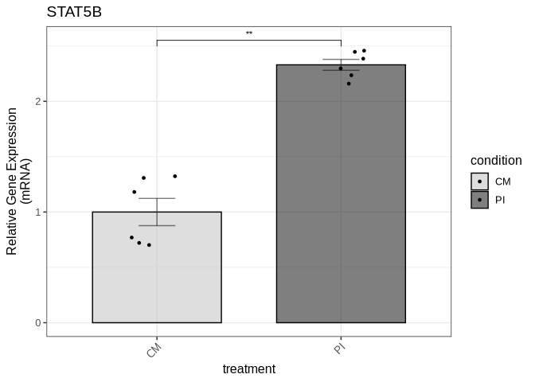

We save the figure to a PDF file in the Supplemental Figure 1 directory:

``` r
ggsave("output/Supplemental_Figure1/suppl_fig1a_stat5b_qpcr.pdf", suppl_fig1a, 
       width = 3, height = 6, dpi = 300, useDingbats=FALSE)
```

#### Supplemental Figure 1b (STAT5B protein expression levels)

We do the same for STAT5B protein levels:

``` r
suppl1_stat5b_protein_data <- read_xlsx("input/Supplemental_Figure1_data.xlsx", sheet = "STAT5_protein")
```

``` r
suppl1_stat5b_protein_result <- compare_protein_groups(
  suppl1_stat5b_protein_data,
  group_col = "treatment",
  gene_col = "stat5b",
  actin_col = "actin",
  control_group = "CM",
  wilcox_pairs = list(c("CM", "PI"))
)
```

``` r
suppl1_stat5b_protein_result$all_wilcox_table
```

<div id="grtpwmhntf" style="padding-left:0px;padding-right:0px;padding-top:10px;padding-bottom:10px;overflow-x:auto;overflow-y:auto;width:auto;height:auto;">
<style>#grtpwmhntf table {
  font-family: system-ui, 'Segoe UI', Roboto, Helvetica, Arial, sans-serif, 'Apple Color Emoji', 'Segoe UI Emoji', 'Segoe UI Symbol', 'Noto Color Emoji';
  -webkit-font-smoothing: antialiased;
  -moz-osx-font-smoothing: grayscale;
}

#grtpwmhntf thead, #grtpwmhntf tbody, #grtpwmhntf tfoot, #grtpwmhntf tr, #grtpwmhntf td, #grtpwmhntf th {
  border-style: none;
}

#grtpwmhntf p {
  margin: 0;
  padding: 0;
}

#grtpwmhntf .gt_table {
  display: table;
  border-collapse: collapse;
  line-height: normal;
  margin-left: auto;
  margin-right: auto;
  color: #333333;
  font-size: 16px;
  font-weight: normal;
  font-style: normal;
  background-color: #FFFFFF;
  width: auto;
  border-top-style: solid;
  border-top-width: 2px;
  border-top-color: #A8A8A8;
  border-right-style: none;
  border-right-width: 2px;
  border-right-color: #D3D3D3;
  border-bottom-style: solid;
  border-bottom-width: 2px;
  border-bottom-color: #A8A8A8;
  border-left-style: none;
  border-left-width: 2px;
  border-left-color: #D3D3D3;
}

#grtpwmhntf .gt_caption {
  padding-top: 4px;
  padding-bottom: 4px;
}

#grtpwmhntf .gt_title {
  color: #333333;
  font-size: 125%;
  font-weight: initial;
  padding-top: 4px;
  padding-bottom: 4px;
  padding-left: 5px;
  padding-right: 5px;
  border-bottom-color: #FFFFFF;
  border-bottom-width: 0;
}

#grtpwmhntf .gt_subtitle {
  color: #333333;
  font-size: 85%;
  font-weight: initial;
  padding-top: 3px;
  padding-bottom: 5px;
  padding-left: 5px;
  padding-right: 5px;
  border-top-color: #FFFFFF;
  border-top-width: 0;
}

#grtpwmhntf .gt_heading {
  background-color: #FFFFFF;
  text-align: center;
  border-bottom-color: #FFFFFF;
  border-left-style: none;
  border-left-width: 1px;
  border-left-color: #D3D3D3;
  border-right-style: none;
  border-right-width: 1px;
  border-right-color: #D3D3D3;
}

#grtpwmhntf .gt_bottom_border {
  border-bottom-style: solid;
  border-bottom-width: 2px;
  border-bottom-color: #D3D3D3;
}

#grtpwmhntf .gt_col_headings {
  border-top-style: solid;
  border-top-width: 2px;
  border-top-color: #D3D3D3;
  border-bottom-style: solid;
  border-bottom-width: 2px;
  border-bottom-color: #D3D3D3;
  border-left-style: none;
  border-left-width: 1px;
  border-left-color: #D3D3D3;
  border-right-style: none;
  border-right-width: 1px;
  border-right-color: #D3D3D3;
}

#grtpwmhntf .gt_col_heading {
  color: #333333;
  background-color: #FFFFFF;
  font-size: 100%;
  font-weight: normal;
  text-transform: inherit;
  border-left-style: none;
  border-left-width: 1px;
  border-left-color: #D3D3D3;
  border-right-style: none;
  border-right-width: 1px;
  border-right-color: #D3D3D3;
  vertical-align: bottom;
  padding-top: 5px;
  padding-bottom: 6px;
  padding-left: 5px;
  padding-right: 5px;
  overflow-x: hidden;
}

#grtpwmhntf .gt_column_spanner_outer {
  color: #333333;
  background-color: #FFFFFF;
  font-size: 100%;
  font-weight: normal;
  text-transform: inherit;
  padding-top: 0;
  padding-bottom: 0;
  padding-left: 4px;
  padding-right: 4px;
}

#grtpwmhntf .gt_column_spanner_outer:first-child {
  padding-left: 0;
}

#grtpwmhntf .gt_column_spanner_outer:last-child {
  padding-right: 0;
}

#grtpwmhntf .gt_column_spanner {
  border-bottom-style: solid;
  border-bottom-width: 2px;
  border-bottom-color: #D3D3D3;
  vertical-align: bottom;
  padding-top: 5px;
  padding-bottom: 5px;
  overflow-x: hidden;
  display: inline-block;
  width: 100%;
}

#grtpwmhntf .gt_spanner_row {
  border-bottom-style: hidden;
}

#grtpwmhntf .gt_group_heading {
  padding-top: 8px;
  padding-bottom: 8px;
  padding-left: 5px;
  padding-right: 5px;
  color: #333333;
  background-color: #FFFFFF;
  font-size: 100%;
  font-weight: initial;
  text-transform: inherit;
  border-top-style: solid;
  border-top-width: 2px;
  border-top-color: #D3D3D3;
  border-bottom-style: solid;
  border-bottom-width: 2px;
  border-bottom-color: #D3D3D3;
  border-left-style: none;
  border-left-width: 1px;
  border-left-color: #D3D3D3;
  border-right-style: none;
  border-right-width: 1px;
  border-right-color: #D3D3D3;
  vertical-align: middle;
  text-align: left;
}

#grtpwmhntf .gt_empty_group_heading {
  padding: 0.5px;
  color: #333333;
  background-color: #FFFFFF;
  font-size: 100%;
  font-weight: initial;
  border-top-style: solid;
  border-top-width: 2px;
  border-top-color: #D3D3D3;
  border-bottom-style: solid;
  border-bottom-width: 2px;
  border-bottom-color: #D3D3D3;
  vertical-align: middle;
}

#grtpwmhntf .gt_from_md > :first-child {
  margin-top: 0;
}

#grtpwmhntf .gt_from_md > :last-child {
  margin-bottom: 0;
}

#grtpwmhntf .gt_row {
  padding-top: 8px;
  padding-bottom: 8px;
  padding-left: 5px;
  padding-right: 5px;
  margin: 10px;
  border-top-style: solid;
  border-top-width: 1px;
  border-top-color: #D3D3D3;
  border-left-style: none;
  border-left-width: 1px;
  border-left-color: #D3D3D3;
  border-right-style: none;
  border-right-width: 1px;
  border-right-color: #D3D3D3;
  vertical-align: middle;
  overflow-x: hidden;
}

#grtpwmhntf .gt_stub {
  color: #333333;
  background-color: #FFFFFF;
  font-size: 100%;
  font-weight: initial;
  text-transform: inherit;
  border-right-style: solid;
  border-right-width: 2px;
  border-right-color: #D3D3D3;
  padding-left: 5px;
  padding-right: 5px;
}

#grtpwmhntf .gt_stub_row_group {
  color: #333333;
  background-color: #FFFFFF;
  font-size: 100%;
  font-weight: initial;
  text-transform: inherit;
  border-right-style: solid;
  border-right-width: 2px;
  border-right-color: #D3D3D3;
  padding-left: 5px;
  padding-right: 5px;
  vertical-align: top;
}

#grtpwmhntf .gt_row_group_first td {
  border-top-width: 2px;
}

#grtpwmhntf .gt_row_group_first th {
  border-top-width: 2px;
}

#grtpwmhntf .gt_summary_row {
  color: #333333;
  background-color: #FFFFFF;
  text-transform: inherit;
  padding-top: 8px;
  padding-bottom: 8px;
  padding-left: 5px;
  padding-right: 5px;
}

#grtpwmhntf .gt_first_summary_row {
  border-top-style: solid;
  border-top-color: #D3D3D3;
}

#grtpwmhntf .gt_first_summary_row.thick {
  border-top-width: 2px;
}

#grtpwmhntf .gt_last_summary_row {
  padding-top: 8px;
  padding-bottom: 8px;
  padding-left: 5px;
  padding-right: 5px;
  border-bottom-style: solid;
  border-bottom-width: 2px;
  border-bottom-color: #D3D3D3;
}

#grtpwmhntf .gt_grand_summary_row {
  color: #333333;
  background-color: #FFFFFF;
  text-transform: inherit;
  padding-top: 8px;
  padding-bottom: 8px;
  padding-left: 5px;
  padding-right: 5px;
}

#grtpwmhntf .gt_first_grand_summary_row {
  padding-top: 8px;
  padding-bottom: 8px;
  padding-left: 5px;
  padding-right: 5px;
  border-top-style: double;
  border-top-width: 6px;
  border-top-color: #D3D3D3;
}

#grtpwmhntf .gt_last_grand_summary_row_top {
  padding-top: 8px;
  padding-bottom: 8px;
  padding-left: 5px;
  padding-right: 5px;
  border-bottom-style: double;
  border-bottom-width: 6px;
  border-bottom-color: #D3D3D3;
}

#grtpwmhntf .gt_striped {
  background-color: rgba(128, 128, 128, 0.05);
}

#grtpwmhntf .gt_table_body {
  border-top-style: solid;
  border-top-width: 2px;
  border-top-color: #D3D3D3;
  border-bottom-style: solid;
  border-bottom-width: 2px;
  border-bottom-color: #D3D3D3;
}

#grtpwmhntf .gt_footnotes {
  color: #333333;
  background-color: #FFFFFF;
  border-bottom-style: none;
  border-bottom-width: 2px;
  border-bottom-color: #D3D3D3;
  border-left-style: none;
  border-left-width: 2px;
  border-left-color: #D3D3D3;
  border-right-style: none;
  border-right-width: 2px;
  border-right-color: #D3D3D3;
}

#grtpwmhntf .gt_footnote {
  margin: 0px;
  font-size: 90%;
  padding-top: 4px;
  padding-bottom: 4px;
  padding-left: 5px;
  padding-right: 5px;
}

#grtpwmhntf .gt_sourcenotes {
  color: #333333;
  background-color: #FFFFFF;
  border-bottom-style: none;
  border-bottom-width: 2px;
  border-bottom-color: #D3D3D3;
  border-left-style: none;
  border-left-width: 2px;
  border-left-color: #D3D3D3;
  border-right-style: none;
  border-right-width: 2px;
  border-right-color: #D3D3D3;
}

#grtpwmhntf .gt_sourcenote {
  font-size: 90%;
  padding-top: 4px;
  padding-bottom: 4px;
  padding-left: 5px;
  padding-right: 5px;
}

#grtpwmhntf .gt_left {
  text-align: left;
}

#grtpwmhntf .gt_center {
  text-align: center;
}

#grtpwmhntf .gt_right {
  text-align: right;
  font-variant-numeric: tabular-nums;
}

#grtpwmhntf .gt_font_normal {
  font-weight: normal;
}

#grtpwmhntf .gt_font_bold {
  font-weight: bold;
}

#grtpwmhntf .gt_font_italic {
  font-style: italic;
}

#grtpwmhntf .gt_super {
  font-size: 65%;
}

#grtpwmhntf .gt_footnote_marks {
  font-size: 75%;
  vertical-align: 0.4em;
  position: initial;
}

#grtpwmhntf .gt_asterisk {
  font-size: 100%;
  vertical-align: 0;
}

#grtpwmhntf .gt_indent_1 {
  text-indent: 5px;
}

#grtpwmhntf .gt_indent_2 {
  text-indent: 10px;
}

#grtpwmhntf .gt_indent_3 {
  text-indent: 15px;
}

#grtpwmhntf .gt_indent_4 {
  text-indent: 20px;
}

#grtpwmhntf .gt_indent_5 {
  text-indent: 25px;
}
</style>
<table class="gt_table" data-quarto-disable-processing="false" data-quarto-bootstrap="false">
  <thead>
    <tr class="gt_col_headings">
      <th class="gt_col_heading gt_columns_bottom_border gt_left" rowspan="1" colspan="1" scope="col" id="Comparison">Comparison</th>
      <th class="gt_col_heading gt_columns_bottom_border gt_right" rowspan="1" colspan="1" scope="col" id="Statistic">Statistic</th>
      <th class="gt_col_heading gt_columns_bottom_border gt_right" rowspan="1" colspan="1" scope="col" id="P_value">P_value</th>
      <th class="gt_col_heading gt_columns_bottom_border gt_left" rowspan="1" colspan="1" scope="col" id="Significant">Significant</th>
    </tr>
  </thead>
  <tbody class="gt_table_body">
    <tr><td headers="Comparison" class="gt_row gt_left" style="background-color: rgba(204,230,255,0.8); color: #000000; font-weight: bold;">CM vs PI</td>
<td headers="Statistic" class="gt_row gt_right" style="background-color: rgba(204,230,255,0.8); color: #000000; font-weight: bold;">0</td>
<td headers="P_value" class="gt_row gt_right" style="background-color: rgba(204,230,255,0.8); color: #000000; font-weight: bold;">0.0286</td>
<td headers="Significant" class="gt_row gt_left" style="background-color: rgba(204,230,255,0.8); color: #000000; font-weight: bold;">Yes</td></tr>
  </tbody>
  
  
</table>
</div>

We plot the results:

``` r
suppl_fig1b <- suppl1_stat5b_protein_result$p
```

``` r
suppl_fig1b
```

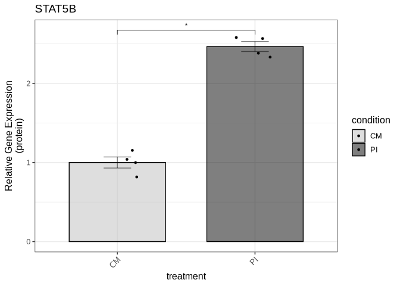

We save the figure to a PDF file in the Supplemental Figure 1 directory:

``` r
ggsave("output/Supplemental_Figure1/suppl_fig1b_stat5b_protein.pdf", suppl_fig1b, 
       width = 3, height = 6, dpi = 300, useDingbats=FALSE)
```

We create the composite Supplemental Figure 1 using fig1b as placeholder
for the Western blots:

``` r
composite_suppl1 <- plot_grid(suppl_fig1a, suppl_fig1b, suppl_fig1b,
                              ncol = 1, nrow = 3, 
                              labels = c("A", "B", "C"), 
                              label_size = 12, 
                              align = "v")
```

``` r
composite_suppl1
```

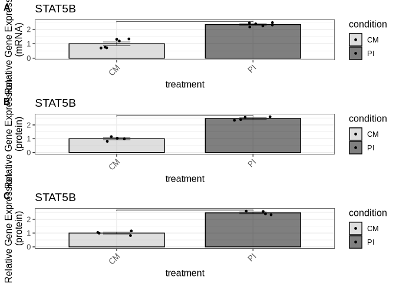

We save the composite Supplemental Figure 1:

``` r
ggsave("output/Supplemental_Figure1/composite_suppl_fig1.pdf", composite_suppl1, 
       width = 4, height = 12, dpi = 300)
```

### Supplemental Figure 2

#### Supplemental Figure 2a (ETS2 mRNA expression levels)

``` r
suppl2_ets2_qpcr_data <- read_xlsx("input/Supplemental_Figure2_data.xlsx", sheet = "ETS2_mRNA")
```

``` r
suppl2_ets2_qpcr_result <- compare_qpcr_groups(
  suppl2_ets2_qpcr_data,
  group_col = "treatment",
  gene_col = "ets2",
  actin_col = "actin",
  control_group = "CM",
  wilcox_pairs = list(c("PI", "PI_250"),
                      c("PI", "PI_1000"), c("PI", "PI_1500"))
)
```

``` r
suppl2_ets2_qpcr_result$all_wilcox_table
```

<div id="bcixnvdytp" style="padding-left:0px;padding-right:0px;padding-top:10px;padding-bottom:10px;overflow-x:auto;overflow-y:auto;width:auto;height:auto;">
<style>#bcixnvdytp table {
  font-family: system-ui, 'Segoe UI', Roboto, Helvetica, Arial, sans-serif, 'Apple Color Emoji', 'Segoe UI Emoji', 'Segoe UI Symbol', 'Noto Color Emoji';
  -webkit-font-smoothing: antialiased;
  -moz-osx-font-smoothing: grayscale;
}

#bcixnvdytp thead, #bcixnvdytp tbody, #bcixnvdytp tfoot, #bcixnvdytp tr, #bcixnvdytp td, #bcixnvdytp th {
  border-style: none;
}

#bcixnvdytp p {
  margin: 0;
  padding: 0;
}

#bcixnvdytp .gt_table {
  display: table;
  border-collapse: collapse;
  line-height: normal;
  margin-left: auto;
  margin-right: auto;
  color: #333333;
  font-size: 16px;
  font-weight: normal;
  font-style: normal;
  background-color: #FFFFFF;
  width: auto;
  border-top-style: solid;
  border-top-width: 2px;
  border-top-color: #A8A8A8;
  border-right-style: none;
  border-right-width: 2px;
  border-right-color: #D3D3D3;
  border-bottom-style: solid;
  border-bottom-width: 2px;
  border-bottom-color: #A8A8A8;
  border-left-style: none;
  border-left-width: 2px;
  border-left-color: #D3D3D3;
}

#bcixnvdytp .gt_caption {
  padding-top: 4px;
  padding-bottom: 4px;
}

#bcixnvdytp .gt_title {
  color: #333333;
  font-size: 125%;
  font-weight: initial;
  padding-top: 4px;
  padding-bottom: 4px;
  padding-left: 5px;
  padding-right: 5px;
  border-bottom-color: #FFFFFF;
  border-bottom-width: 0;
}

#bcixnvdytp .gt_subtitle {
  color: #333333;
  font-size: 85%;
  font-weight: initial;
  padding-top: 3px;
  padding-bottom: 5px;
  padding-left: 5px;
  padding-right: 5px;
  border-top-color: #FFFFFF;
  border-top-width: 0;
}

#bcixnvdytp .gt_heading {
  background-color: #FFFFFF;
  text-align: center;
  border-bottom-color: #FFFFFF;
  border-left-style: none;
  border-left-width: 1px;
  border-left-color: #D3D3D3;
  border-right-style: none;
  border-right-width: 1px;
  border-right-color: #D3D3D3;
}

#bcixnvdytp .gt_bottom_border {
  border-bottom-style: solid;
  border-bottom-width: 2px;
  border-bottom-color: #D3D3D3;
}

#bcixnvdytp .gt_col_headings {
  border-top-style: solid;
  border-top-width: 2px;
  border-top-color: #D3D3D3;
  border-bottom-style: solid;
  border-bottom-width: 2px;
  border-bottom-color: #D3D3D3;
  border-left-style: none;
  border-left-width: 1px;
  border-left-color: #D3D3D3;
  border-right-style: none;
  border-right-width: 1px;
  border-right-color: #D3D3D3;
}

#bcixnvdytp .gt_col_heading {
  color: #333333;
  background-color: #FFFFFF;
  font-size: 100%;
  font-weight: normal;
  text-transform: inherit;
  border-left-style: none;
  border-left-width: 1px;
  border-left-color: #D3D3D3;
  border-right-style: none;
  border-right-width: 1px;
  border-right-color: #D3D3D3;
  vertical-align: bottom;
  padding-top: 5px;
  padding-bottom: 6px;
  padding-left: 5px;
  padding-right: 5px;
  overflow-x: hidden;
}

#bcixnvdytp .gt_column_spanner_outer {
  color: #333333;
  background-color: #FFFFFF;
  font-size: 100%;
  font-weight: normal;
  text-transform: inherit;
  padding-top: 0;
  padding-bottom: 0;
  padding-left: 4px;
  padding-right: 4px;
}

#bcixnvdytp .gt_column_spanner_outer:first-child {
  padding-left: 0;
}

#bcixnvdytp .gt_column_spanner_outer:last-child {
  padding-right: 0;
}

#bcixnvdytp .gt_column_spanner {
  border-bottom-style: solid;
  border-bottom-width: 2px;
  border-bottom-color: #D3D3D3;
  vertical-align: bottom;
  padding-top: 5px;
  padding-bottom: 5px;
  overflow-x: hidden;
  display: inline-block;
  width: 100%;
}

#bcixnvdytp .gt_spanner_row {
  border-bottom-style: hidden;
}

#bcixnvdytp .gt_group_heading {
  padding-top: 8px;
  padding-bottom: 8px;
  padding-left: 5px;
  padding-right: 5px;
  color: #333333;
  background-color: #FFFFFF;
  font-size: 100%;
  font-weight: initial;
  text-transform: inherit;
  border-top-style: solid;
  border-top-width: 2px;
  border-top-color: #D3D3D3;
  border-bottom-style: solid;
  border-bottom-width: 2px;
  border-bottom-color: #D3D3D3;
  border-left-style: none;
  border-left-width: 1px;
  border-left-color: #D3D3D3;
  border-right-style: none;
  border-right-width: 1px;
  border-right-color: #D3D3D3;
  vertical-align: middle;
  text-align: left;
}

#bcixnvdytp .gt_empty_group_heading {
  padding: 0.5px;
  color: #333333;
  background-color: #FFFFFF;
  font-size: 100%;
  font-weight: initial;
  border-top-style: solid;
  border-top-width: 2px;
  border-top-color: #D3D3D3;
  border-bottom-style: solid;
  border-bottom-width: 2px;
  border-bottom-color: #D3D3D3;
  vertical-align: middle;
}

#bcixnvdytp .gt_from_md > :first-child {
  margin-top: 0;
}

#bcixnvdytp .gt_from_md > :last-child {
  margin-bottom: 0;
}

#bcixnvdytp .gt_row {
  padding-top: 8px;
  padding-bottom: 8px;
  padding-left: 5px;
  padding-right: 5px;
  margin: 10px;
  border-top-style: solid;
  border-top-width: 1px;
  border-top-color: #D3D3D3;
  border-left-style: none;
  border-left-width: 1px;
  border-left-color: #D3D3D3;
  border-right-style: none;
  border-right-width: 1px;
  border-right-color: #D3D3D3;
  vertical-align: middle;
  overflow-x: hidden;
}

#bcixnvdytp .gt_stub {
  color: #333333;
  background-color: #FFFFFF;
  font-size: 100%;
  font-weight: initial;
  text-transform: inherit;
  border-right-style: solid;
  border-right-width: 2px;
  border-right-color: #D3D3D3;
  padding-left: 5px;
  padding-right: 5px;
}

#bcixnvdytp .gt_stub_row_group {
  color: #333333;
  background-color: #FFFFFF;
  font-size: 100%;
  font-weight: initial;
  text-transform: inherit;
  border-right-style: solid;
  border-right-width: 2px;
  border-right-color: #D3D3D3;
  padding-left: 5px;
  padding-right: 5px;
  vertical-align: top;
}

#bcixnvdytp .gt_row_group_first td {
  border-top-width: 2px;
}

#bcixnvdytp .gt_row_group_first th {
  border-top-width: 2px;
}

#bcixnvdytp .gt_summary_row {
  color: #333333;
  background-color: #FFFFFF;
  text-transform: inherit;
  padding-top: 8px;
  padding-bottom: 8px;
  padding-left: 5px;
  padding-right: 5px;
}

#bcixnvdytp .gt_first_summary_row {
  border-top-style: solid;
  border-top-color: #D3D3D3;
}

#bcixnvdytp .gt_first_summary_row.thick {
  border-top-width: 2px;
}

#bcixnvdytp .gt_last_summary_row {
  padding-top: 8px;
  padding-bottom: 8px;
  padding-left: 5px;
  padding-right: 5px;
  border-bottom-style: solid;
  border-bottom-width: 2px;
  border-bottom-color: #D3D3D3;
}

#bcixnvdytp .gt_grand_summary_row {
  color: #333333;
  background-color: #FFFFFF;
  text-transform: inherit;
  padding-top: 8px;
  padding-bottom: 8px;
  padding-left: 5px;
  padding-right: 5px;
}

#bcixnvdytp .gt_first_grand_summary_row {
  padding-top: 8px;
  padding-bottom: 8px;
  padding-left: 5px;
  padding-right: 5px;
  border-top-style: double;
  border-top-width: 6px;
  border-top-color: #D3D3D3;
}

#bcixnvdytp .gt_last_grand_summary_row_top {
  padding-top: 8px;
  padding-bottom: 8px;
  padding-left: 5px;
  padding-right: 5px;
  border-bottom-style: double;
  border-bottom-width: 6px;
  border-bottom-color: #D3D3D3;
}

#bcixnvdytp .gt_striped {
  background-color: rgba(128, 128, 128, 0.05);
}

#bcixnvdytp .gt_table_body {
  border-top-style: solid;
  border-top-width: 2px;
  border-top-color: #D3D3D3;
  border-bottom-style: solid;
  border-bottom-width: 2px;
  border-bottom-color: #D3D3D3;
}

#bcixnvdytp .gt_footnotes {
  color: #333333;
  background-color: #FFFFFF;
  border-bottom-style: none;
  border-bottom-width: 2px;
  border-bottom-color: #D3D3D3;
  border-left-style: none;
  border-left-width: 2px;
  border-left-color: #D3D3D3;
  border-right-style: none;
  border-right-width: 2px;
  border-right-color: #D3D3D3;
}

#bcixnvdytp .gt_footnote {
  margin: 0px;
  font-size: 90%;
  padding-top: 4px;
  padding-bottom: 4px;
  padding-left: 5px;
  padding-right: 5px;
}

#bcixnvdytp .gt_sourcenotes {
  color: #333333;
  background-color: #FFFFFF;
  border-bottom-style: none;
  border-bottom-width: 2px;
  border-bottom-color: #D3D3D3;
  border-left-style: none;
  border-left-width: 2px;
  border-left-color: #D3D3D3;
  border-right-style: none;
  border-right-width: 2px;
  border-right-color: #D3D3D3;
}

#bcixnvdytp .gt_sourcenote {
  font-size: 90%;
  padding-top: 4px;
  padding-bottom: 4px;
  padding-left: 5px;
  padding-right: 5px;
}

#bcixnvdytp .gt_left {
  text-align: left;
}

#bcixnvdytp .gt_center {
  text-align: center;
}

#bcixnvdytp .gt_right {
  text-align: right;
  font-variant-numeric: tabular-nums;
}

#bcixnvdytp .gt_font_normal {
  font-weight: normal;
}

#bcixnvdytp .gt_font_bold {
  font-weight: bold;
}

#bcixnvdytp .gt_font_italic {
  font-style: italic;
}

#bcixnvdytp .gt_super {
  font-size: 65%;
}

#bcixnvdytp .gt_footnote_marks {
  font-size: 75%;
  vertical-align: 0.4em;
  position: initial;
}

#bcixnvdytp .gt_asterisk {
  font-size: 100%;
  vertical-align: 0;
}

#bcixnvdytp .gt_indent_1 {
  text-indent: 5px;
}

#bcixnvdytp .gt_indent_2 {
  text-indent: 10px;
}

#bcixnvdytp .gt_indent_3 {
  text-indent: 15px;
}

#bcixnvdytp .gt_indent_4 {
  text-indent: 20px;
}

#bcixnvdytp .gt_indent_5 {
  text-indent: 25px;
}
</style>
<table class="gt_table" data-quarto-disable-processing="false" data-quarto-bootstrap="false">
  <thead>
    <tr class="gt_col_headings">
      <th class="gt_col_heading gt_columns_bottom_border gt_left" rowspan="1" colspan="1" scope="col" id="Comparison">Comparison</th>
      <th class="gt_col_heading gt_columns_bottom_border gt_right" rowspan="1" colspan="1" scope="col" id="Statistic">Statistic</th>
      <th class="gt_col_heading gt_columns_bottom_border gt_right" rowspan="1" colspan="1" scope="col" id="P_value">P_value</th>
      <th class="gt_col_heading gt_columns_bottom_border gt_left" rowspan="1" colspan="1" scope="col" id="Significant">Significant</th>
    </tr>
  </thead>
  <tbody class="gt_table_body">
    <tr><td headers="Comparison" class="gt_row gt_left">CM vs CM_VCT</td>
<td headers="Statistic" class="gt_row gt_right">12.0</td>
<td headers="P_value" class="gt_row gt_right">0.3429</td>
<td headers="Significant" class="gt_row gt_left">No</td></tr>
    <tr><td headers="Comparison" class="gt_row gt_left">CM vs CM_100</td>
<td headers="Statistic" class="gt_row gt_right">7.0</td>
<td headers="P_value" class="gt_row gt_right">0.8857</td>
<td headers="Significant" class="gt_row gt_left">No</td></tr>
    <tr><td headers="Comparison" class="gt_row gt_left">CM vs CM_250</td>
<td headers="Statistic" class="gt_row gt_right">5.0</td>
<td headers="P_value" class="gt_row gt_right">0.4857</td>
<td headers="Significant" class="gt_row gt_left">No</td></tr>
    <tr><td headers="Comparison" class="gt_row gt_left">CM vs CM_500</td>
<td headers="Statistic" class="gt_row gt_right">3.0</td>
<td headers="P_value" class="gt_row gt_right">0.2000</td>
<td headers="Significant" class="gt_row gt_left">No</td></tr>
    <tr><td headers="Comparison" class="gt_row gt_left">CM vs CM_1000</td>
<td headers="Statistic" class="gt_row gt_right">8.0</td>
<td headers="P_value" class="gt_row gt_right">1.0000</td>
<td headers="Significant" class="gt_row gt_left">No</td></tr>
    <tr><td headers="Comparison" class="gt_row gt_left">CM vs CM_1500</td>
<td headers="Statistic" class="gt_row gt_right">3.0</td>
<td headers="P_value" class="gt_row gt_right">0.2000</td>
<td headers="Significant" class="gt_row gt_left">No</td></tr>
    <tr><td headers="Comparison" class="gt_row gt_left">CM vs PI</td>
<td headers="Statistic" class="gt_row gt_right">15.0</td>
<td headers="P_value" class="gt_row gt_right">0.0571</td>
<td headers="Significant" class="gt_row gt_left">No</td></tr>
    <tr><td headers="Comparison" class="gt_row gt_left">CM vs PI_VCT</td>
<td headers="Statistic" class="gt_row gt_right">12.0</td>
<td headers="P_value" class="gt_row gt_right">0.3094</td>
<td headers="Significant" class="gt_row gt_left">No</td></tr>
    <tr><td headers="Comparison" class="gt_row gt_left">CM vs PI_100</td>
<td headers="Statistic" class="gt_row gt_right">8.0</td>
<td headers="P_value" class="gt_row gt_right">1.0000</td>
<td headers="Significant" class="gt_row gt_left">No</td></tr>
    <tr><td headers="Comparison" class="gt_row gt_left">CM vs PI_250</td>
<td headers="Statistic" class="gt_row gt_right">1.0</td>
<td headers="P_value" class="gt_row gt_right">0.0571</td>
<td headers="Significant" class="gt_row gt_left">No</td></tr>
    <tr><td headers="Comparison" class="gt_row gt_left">CM vs PI_500</td>
<td headers="Statistic" class="gt_row gt_right">1.0</td>
<td headers="P_value" class="gt_row gt_right">0.1143</td>
<td headers="Significant" class="gt_row gt_left">No</td></tr>
    <tr><td headers="Comparison" class="gt_row gt_left" style="background-color: rgba(204,230,255,0.8); color: #000000; font-weight: bold;">CM vs PI_1000</td>
<td headers="Statistic" class="gt_row gt_right" style="background-color: rgba(204,230,255,0.8); color: #000000; font-weight: bold;">0.0</td>
<td headers="P_value" class="gt_row gt_right" style="background-color: rgba(204,230,255,0.8); color: #000000; font-weight: bold;">0.0286</td>
<td headers="Significant" class="gt_row gt_left" style="background-color: rgba(204,230,255,0.8); color: #000000; font-weight: bold;">Yes</td></tr>
    <tr><td headers="Comparison" class="gt_row gt_left">CM vs PI_1500</td>
<td headers="Statistic" class="gt_row gt_right">4.0</td>
<td headers="P_value" class="gt_row gt_right">0.3429</td>
<td headers="Significant" class="gt_row gt_left">No</td></tr>
    <tr><td headers="Comparison" class="gt_row gt_left">CM_VCT vs CM_100</td>
<td headers="Statistic" class="gt_row gt_right">4.0</td>
<td headers="P_value" class="gt_row gt_right">0.3429</td>
<td headers="Significant" class="gt_row gt_left">No</td></tr>
    <tr><td headers="Comparison" class="gt_row gt_left">CM_VCT vs CM_250</td>
<td headers="Statistic" class="gt_row gt_right">2.5</td>
<td headers="P_value" class="gt_row gt_right">0.1465</td>
<td headers="Significant" class="gt_row gt_left">No</td></tr>
    <tr><td headers="Comparison" class="gt_row gt_left" style="background-color: rgba(204,230,255,0.8); color: #000000; font-weight: bold;">CM_VCT vs CM_500</td>
<td headers="Statistic" class="gt_row gt_right" style="background-color: rgba(204,230,255,0.8); color: #000000; font-weight: bold;">0.0</td>
<td headers="P_value" class="gt_row gt_right" style="background-color: rgba(204,230,255,0.8); color: #000000; font-weight: bold;">0.0286</td>
<td headers="Significant" class="gt_row gt_left" style="background-color: rgba(204,230,255,0.8); color: #000000; font-weight: bold;">Yes</td></tr>
    <tr><td headers="Comparison" class="gt_row gt_left">CM_VCT vs CM_1000</td>
<td headers="Statistic" class="gt_row gt_right">6.0</td>
<td headers="P_value" class="gt_row gt_right">0.6857</td>
<td headers="Significant" class="gt_row gt_left">No</td></tr>
    <tr><td headers="Comparison" class="gt_row gt_left">CM_VCT vs CM_1500</td>
<td headers="Statistic" class="gt_row gt_right">1.0</td>
<td headers="P_value" class="gt_row gt_right">0.0571</td>
<td headers="Significant" class="gt_row gt_left">No</td></tr>
    <tr><td headers="Comparison" class="gt_row gt_left">CM_VCT vs PI</td>
<td headers="Statistic" class="gt_row gt_right">13.0</td>
<td headers="P_value" class="gt_row gt_right">0.2000</td>
<td headers="Significant" class="gt_row gt_left">No</td></tr>
    <tr><td headers="Comparison" class="gt_row gt_left">CM_VCT vs PI_VCT</td>
<td headers="Statistic" class="gt_row gt_right">12.0</td>
<td headers="P_value" class="gt_row gt_right">0.3094</td>
<td headers="Significant" class="gt_row gt_left">No</td></tr>
    <tr><td headers="Comparison" class="gt_row gt_left">CM_VCT vs PI_100</td>
<td headers="Statistic" class="gt_row gt_right">6.0</td>
<td headers="P_value" class="gt_row gt_right">0.6857</td>
<td headers="Significant" class="gt_row gt_left">No</td></tr>
    <tr><td headers="Comparison" class="gt_row gt_left" style="background-color: rgba(204,230,255,0.8); color: #000000; font-weight: bold;">CM_VCT vs PI_250</td>
<td headers="Statistic" class="gt_row gt_right" style="background-color: rgba(204,230,255,0.8); color: #000000; font-weight: bold;">0.0</td>
<td headers="P_value" class="gt_row gt_right" style="background-color: rgba(204,230,255,0.8); color: #000000; font-weight: bold;">0.0286</td>
<td headers="Significant" class="gt_row gt_left" style="background-color: rgba(204,230,255,0.8); color: #000000; font-weight: bold;">Yes</td></tr>
    <tr><td headers="Comparison" class="gt_row gt_left">CM_VCT vs PI_500</td>
<td headers="Statistic" class="gt_row gt_right">0.0</td>
<td headers="P_value" class="gt_row gt_right">0.0571</td>
<td headers="Significant" class="gt_row gt_left">No</td></tr>
    <tr><td headers="Comparison" class="gt_row gt_left" style="background-color: rgba(204,230,255,0.8); color: #000000; font-weight: bold;">CM_VCT vs PI_1000</td>
<td headers="Statistic" class="gt_row gt_right" style="background-color: rgba(204,230,255,0.8); color: #000000; font-weight: bold;">0.0</td>
<td headers="P_value" class="gt_row gt_right" style="background-color: rgba(204,230,255,0.8); color: #000000; font-weight: bold;">0.0286</td>
<td headers="Significant" class="gt_row gt_left" style="background-color: rgba(204,230,255,0.8); color: #000000; font-weight: bold;">Yes</td></tr>
    <tr><td headers="Comparison" class="gt_row gt_left">CM_VCT vs PI_1500</td>
<td headers="Statistic" class="gt_row gt_right">1.0</td>
<td headers="P_value" class="gt_row gt_right">0.0571</td>
<td headers="Significant" class="gt_row gt_left">No</td></tr>
    <tr><td headers="Comparison" class="gt_row gt_left">CM_100 vs CM_250</td>
<td headers="Statistic" class="gt_row gt_right">8.0</td>
<td headers="P_value" class="gt_row gt_right">1.0000</td>
<td headers="Significant" class="gt_row gt_left">No</td></tr>
    <tr><td headers="Comparison" class="gt_row gt_left">CM_100 vs CM_500</td>
<td headers="Statistic" class="gt_row gt_right">6.0</td>
<td headers="P_value" class="gt_row gt_right">0.6857</td>
<td headers="Significant" class="gt_row gt_left">No</td></tr>
    <tr><td headers="Comparison" class="gt_row gt_left">CM_100 vs CM_1000</td>
<td headers="Statistic" class="gt_row gt_right">10.0</td>
<td headers="P_value" class="gt_row gt_right">0.6857</td>
<td headers="Significant" class="gt_row gt_left">No</td></tr>
    <tr><td headers="Comparison" class="gt_row gt_left">CM_100 vs CM_1500</td>
<td headers="Statistic" class="gt_row gt_right">7.0</td>
<td headers="P_value" class="gt_row gt_right">0.8857</td>
<td headers="Significant" class="gt_row gt_left">No</td></tr>
    <tr><td headers="Comparison" class="gt_row gt_left">CM_100 vs PI</td>
<td headers="Statistic" class="gt_row gt_right">14.0</td>
<td headers="P_value" class="gt_row gt_right">0.1143</td>
<td headers="Significant" class="gt_row gt_left">No</td></tr>
    <tr><td headers="Comparison" class="gt_row gt_left">CM_100 vs PI_VCT</td>
<td headers="Statistic" class="gt_row gt_right">13.0</td>
<td headers="P_value" class="gt_row gt_right">0.1913</td>
<td headers="Significant" class="gt_row gt_left">No</td></tr>
    <tr><td headers="Comparison" class="gt_row gt_left">CM_100 vs PI_100</td>
<td headers="Statistic" class="gt_row gt_right">10.0</td>
<td headers="P_value" class="gt_row gt_right">0.6857</td>
<td headers="Significant" class="gt_row gt_left">No</td></tr>
    <tr><td headers="Comparison" class="gt_row gt_left">CM_100 vs PI_250</td>
<td headers="Statistic" class="gt_row gt_right">4.0</td>
<td headers="P_value" class="gt_row gt_right">0.3429</td>
<td headers="Significant" class="gt_row gt_left">No</td></tr>
    <tr><td headers="Comparison" class="gt_row gt_left">CM_100 vs PI_500</td>
<td headers="Statistic" class="gt_row gt_right">4.0</td>
<td headers="P_value" class="gt_row gt_right">0.6286</td>
<td headers="Significant" class="gt_row gt_left">No</td></tr>
    <tr><td headers="Comparison" class="gt_row gt_left">CM_100 vs PI_1000</td>
<td headers="Statistic" class="gt_row gt_right">2.0</td>
<td headers="P_value" class="gt_row gt_right">0.1143</td>
<td headers="Significant" class="gt_row gt_left">No</td></tr>
    <tr><td headers="Comparison" class="gt_row gt_left">CM_100 vs PI_1500</td>
<td headers="Statistic" class="gt_row gt_right">7.0</td>
<td headers="P_value" class="gt_row gt_right">0.8857</td>
<td headers="Significant" class="gt_row gt_left">No</td></tr>
    <tr><td headers="Comparison" class="gt_row gt_left">CM_250 vs CM_500</td>
<td headers="Statistic" class="gt_row gt_right">4.0</td>
<td headers="P_value" class="gt_row gt_right">0.3429</td>
<td headers="Significant" class="gt_row gt_left">No</td></tr>
    <tr><td headers="Comparison" class="gt_row gt_left">CM_250 vs CM_1000</td>
<td headers="Statistic" class="gt_row gt_right">9.0</td>
<td headers="P_value" class="gt_row gt_right">0.8857</td>
<td headers="Significant" class="gt_row gt_left">No</td></tr>
    <tr><td headers="Comparison" class="gt_row gt_left">CM_250 vs CM_1500</td>
<td headers="Statistic" class="gt_row gt_right">7.0</td>
<td headers="P_value" class="gt_row gt_right">0.8857</td>
<td headers="Significant" class="gt_row gt_left">No</td></tr>
    <tr><td headers="Comparison" class="gt_row gt_left" style="background-color: rgba(204,230,255,0.8); color: #000000; font-weight: bold;">CM_250 vs PI</td>
<td headers="Statistic" class="gt_row gt_right" style="background-color: rgba(204,230,255,0.8); color: #000000; font-weight: bold;">16.0</td>
<td headers="P_value" class="gt_row gt_right" style="background-color: rgba(204,230,255,0.8); color: #000000; font-weight: bold;">0.0286</td>
<td headers="Significant" class="gt_row gt_left" style="background-color: rgba(204,230,255,0.8); color: #000000; font-weight: bold;">Yes</td></tr>
    <tr><td headers="Comparison" class="gt_row gt_left">CM_250 vs PI_VCT</td>
<td headers="Statistic" class="gt_row gt_right">12.0</td>
<td headers="P_value" class="gt_row gt_right">0.3094</td>
<td headers="Significant" class="gt_row gt_left">No</td></tr>
    <tr><td headers="Comparison" class="gt_row gt_left">CM_250 vs PI_100</td>
<td headers="Statistic" class="gt_row gt_right">10.0</td>
<td headers="P_value" class="gt_row gt_right">0.6857</td>
<td headers="Significant" class="gt_row gt_left">No</td></tr>
    <tr><td headers="Comparison" class="gt_row gt_left">CM_250 vs PI_250</td>
<td headers="Statistic" class="gt_row gt_right">2.0</td>
<td headers="P_value" class="gt_row gt_right">0.1143</td>
<td headers="Significant" class="gt_row gt_left">No</td></tr>
    <tr><td headers="Comparison" class="gt_row gt_left">CM_250 vs PI_500</td>
<td headers="Statistic" class="gt_row gt_right">2.0</td>
<td headers="P_value" class="gt_row gt_right">0.2286</td>
<td headers="Significant" class="gt_row gt_left">No</td></tr>
    <tr><td headers="Comparison" class="gt_row gt_left" style="background-color: rgba(204,230,255,0.8); color: #000000; font-weight: bold;">CM_250 vs PI_1000</td>
<td headers="Statistic" class="gt_row gt_right" style="background-color: rgba(204,230,255,0.8); color: #000000; font-weight: bold;">0.0</td>
<td headers="P_value" class="gt_row gt_right" style="background-color: rgba(204,230,255,0.8); color: #000000; font-weight: bold;">0.0286</td>
<td headers="Significant" class="gt_row gt_left" style="background-color: rgba(204,230,255,0.8); color: #000000; font-weight: bold;">Yes</td></tr>
    <tr><td headers="Comparison" class="gt_row gt_left">CM_250 vs PI_1500</td>
<td headers="Statistic" class="gt_row gt_right">7.0</td>
<td headers="P_value" class="gt_row gt_right">0.8857</td>
<td headers="Significant" class="gt_row gt_left">No</td></tr>
    <tr><td headers="Comparison" class="gt_row gt_left">CM_500 vs CM_1000</td>
<td headers="Statistic" class="gt_row gt_right">14.0</td>
<td headers="P_value" class="gt_row gt_right">0.1143</td>
<td headers="Significant" class="gt_row gt_left">No</td></tr>
    <tr><td headers="Comparison" class="gt_row gt_left">CM_500 vs CM_1500</td>
<td headers="Statistic" class="gt_row gt_right">11.0</td>
<td headers="P_value" class="gt_row gt_right">0.4857</td>
<td headers="Significant" class="gt_row gt_left">No</td></tr>
    <tr><td headers="Comparison" class="gt_row gt_left" style="background-color: rgba(204,230,255,0.8); color: #000000; font-weight: bold;">CM_500 vs PI</td>
<td headers="Statistic" class="gt_row gt_right" style="background-color: rgba(204,230,255,0.8); color: #000000; font-weight: bold;">16.0</td>
<td headers="P_value" class="gt_row gt_right" style="background-color: rgba(204,230,255,0.8); color: #000000; font-weight: bold;">0.0286</td>
<td headers="Significant" class="gt_row gt_left" style="background-color: rgba(204,230,255,0.8); color: #000000; font-weight: bold;">Yes</td></tr>
    <tr><td headers="Comparison" class="gt_row gt_left">CM_500 vs PI_VCT</td>
<td headers="Statistic" class="gt_row gt_right">14.0</td>
<td headers="P_value" class="gt_row gt_right">0.1102</td>
<td headers="Significant" class="gt_row gt_left">No</td></tr>
    <tr><td headers="Comparison" class="gt_row gt_left">CM_500 vs PI_100</td>
<td headers="Statistic" class="gt_row gt_right">12.0</td>
<td headers="P_value" class="gt_row gt_right">0.3429</td>
<td headers="Significant" class="gt_row gt_left">No</td></tr>
    <tr><td headers="Comparison" class="gt_row gt_left">CM_500 vs PI_250</td>
<td headers="Statistic" class="gt_row gt_right">7.0</td>
<td headers="P_value" class="gt_row gt_right">0.8857</td>
<td headers="Significant" class="gt_row gt_left">No</td></tr>
    <tr><td headers="Comparison" class="gt_row gt_left">CM_500 vs PI_500</td>
<td headers="Statistic" class="gt_row gt_right">4.0</td>
<td headers="P_value" class="gt_row gt_right">0.6286</td>
<td headers="Significant" class="gt_row gt_left">No</td></tr>
    <tr><td headers="Comparison" class="gt_row gt_left">CM_500 vs PI_1000</td>
<td headers="Statistic" class="gt_row gt_right">2.0</td>
<td headers="P_value" class="gt_row gt_right">0.1143</td>
<td headers="Significant" class="gt_row gt_left">No</td></tr>
    <tr><td headers="Comparison" class="gt_row gt_left">CM_500 vs PI_1500</td>
<td headers="Statistic" class="gt_row gt_right">12.0</td>
<td headers="P_value" class="gt_row gt_right">0.3429</td>
<td headers="Significant" class="gt_row gt_left">No</td></tr>
    <tr><td headers="Comparison" class="gt_row gt_left">CM_1000 vs CM_1500</td>
<td headers="Statistic" class="gt_row gt_right">5.0</td>
<td headers="P_value" class="gt_row gt_right">0.4857</td>
<td headers="Significant" class="gt_row gt_left">No</td></tr>
    <tr><td headers="Comparison" class="gt_row gt_left">CM_1000 vs PI</td>
<td headers="Statistic" class="gt_row gt_right">12.0</td>
<td headers="P_value" class="gt_row gt_right">0.3429</td>
<td headers="Significant" class="gt_row gt_left">No</td></tr>
    <tr><td headers="Comparison" class="gt_row gt_left">CM_1000 vs PI_VCT</td>
<td headers="Statistic" class="gt_row gt_right">9.0</td>
<td headers="P_value" class="gt_row gt_right">0.8845</td>
<td headers="Significant" class="gt_row gt_left">No</td></tr>
    <tr><td headers="Comparison" class="gt_row gt_left">CM_1000 vs PI_100</td>
<td headers="Statistic" class="gt_row gt_right">7.0</td>
<td headers="P_value" class="gt_row gt_right">0.8857</td>
<td headers="Significant" class="gt_row gt_left">No</td></tr>
    <tr><td headers="Comparison" class="gt_row gt_left">CM_1000 vs PI_250</td>
<td headers="Statistic" class="gt_row gt_right">1.0</td>
<td headers="P_value" class="gt_row gt_right">0.0571</td>
<td headers="Significant" class="gt_row gt_left">No</td></tr>
    <tr><td headers="Comparison" class="gt_row gt_left">CM_1000 vs PI_500</td>
<td headers="Statistic" class="gt_row gt_right">1.0</td>
<td headers="P_value" class="gt_row gt_right">0.1143</td>
<td headers="Significant" class="gt_row gt_left">No</td></tr>
    <tr><td headers="Comparison" class="gt_row gt_left" style="background-color: rgba(204,230,255,0.8); color: #000000; font-weight: bold;">CM_1000 vs PI_1000</td>
<td headers="Statistic" class="gt_row gt_right" style="background-color: rgba(204,230,255,0.8); color: #000000; font-weight: bold;">0.0</td>
<td headers="P_value" class="gt_row gt_right" style="background-color: rgba(204,230,255,0.8); color: #000000; font-weight: bold;">0.0286</td>
<td headers="Significant" class="gt_row gt_left" style="background-color: rgba(204,230,255,0.8); color: #000000; font-weight: bold;">Yes</td></tr>
    <tr><td headers="Comparison" class="gt_row gt_left">CM_1000 vs PI_1500</td>
<td headers="Statistic" class="gt_row gt_right">5.0</td>
<td headers="P_value" class="gt_row gt_right">0.4857</td>
<td headers="Significant" class="gt_row gt_left">No</td></tr>
    <tr><td headers="Comparison" class="gt_row gt_left" style="background-color: rgba(204,230,255,0.8); color: #000000; font-weight: bold;">CM_1500 vs PI</td>
<td headers="Statistic" class="gt_row gt_right" style="background-color: rgba(204,230,255,0.8); color: #000000; font-weight: bold;">16.0</td>
<td headers="P_value" class="gt_row gt_right" style="background-color: rgba(204,230,255,0.8); color: #000000; font-weight: bold;">0.0286</td>
<td headers="Significant" class="gt_row gt_left" style="background-color: rgba(204,230,255,0.8); color: #000000; font-weight: bold;">Yes</td></tr>
    <tr><td headers="Comparison" class="gt_row gt_left">CM_1500 vs PI_VCT</td>
<td headers="Statistic" class="gt_row gt_right">12.0</td>
<td headers="P_value" class="gt_row gt_right">0.3094</td>
<td headers="Significant" class="gt_row gt_left">No</td></tr>
    <tr><td headers="Comparison" class="gt_row gt_left">CM_1500 vs PI_100</td>
<td headers="Statistic" class="gt_row gt_right">11.0</td>
<td headers="P_value" class="gt_row gt_right">0.4857</td>
<td headers="Significant" class="gt_row gt_left">No</td></tr>
    <tr><td headers="Comparison" class="gt_row gt_left">CM_1500 vs PI_250</td>
<td headers="Statistic" class="gt_row gt_right">2.0</td>
<td headers="P_value" class="gt_row gt_right">0.1143</td>
<td headers="Significant" class="gt_row gt_left">No</td></tr>
    <tr><td headers="Comparison" class="gt_row gt_left">CM_1500 vs PI_500</td>
<td headers="Statistic" class="gt_row gt_right">2.5</td>
<td headers="P_value" class="gt_row gt_right">0.2845</td>
<td headers="Significant" class="gt_row gt_left">No</td></tr>
    <tr><td headers="Comparison" class="gt_row gt_left" style="background-color: rgba(204,230,255,0.8); color: #000000; font-weight: bold;">CM_1500 vs PI_1000</td>
<td headers="Statistic" class="gt_row gt_right" style="background-color: rgba(204,230,255,0.8); color: #000000; font-weight: bold;">0.0</td>
<td headers="P_value" class="gt_row gt_right" style="background-color: rgba(204,230,255,0.8); color: #000000; font-weight: bold;">0.0286</td>
<td headers="Significant" class="gt_row gt_left" style="background-color: rgba(204,230,255,0.8); color: #000000; font-weight: bold;">Yes</td></tr>
    <tr><td headers="Comparison" class="gt_row gt_left">CM_1500 vs PI_1500</td>
<td headers="Statistic" class="gt_row gt_right">7.5</td>
<td headers="P_value" class="gt_row gt_right">1.0000</td>
<td headers="Significant" class="gt_row gt_left">No</td></tr>
    <tr><td headers="Comparison" class="gt_row gt_left">PI vs PI_VCT</td>
<td headers="Statistic" class="gt_row gt_right">8.0</td>
<td headers="P_value" class="gt_row gt_right">1.0000</td>
<td headers="Significant" class="gt_row gt_left">No</td></tr>
    <tr><td headers="Comparison" class="gt_row gt_left">PI vs PI_100</td>
<td headers="Statistic" class="gt_row gt_right">3.0</td>
<td headers="P_value" class="gt_row gt_right">0.2000</td>
<td headers="Significant" class="gt_row gt_left">No</td></tr>
    <tr><td headers="Comparison" class="gt_row gt_left" style="background-color: rgba(204,230,255,0.8); color: #000000; font-weight: bold;">PI vs PI_250</td>
<td headers="Statistic" class="gt_row gt_right" style="background-color: rgba(204,230,255,0.8); color: #000000; font-weight: bold;">0.0</td>
<td headers="P_value" class="gt_row gt_right" style="background-color: rgba(204,230,255,0.8); color: #000000; font-weight: bold;">0.0286</td>
<td headers="Significant" class="gt_row gt_left" style="background-color: rgba(204,230,255,0.8); color: #000000; font-weight: bold;">Yes</td></tr>
    <tr><td headers="Comparison" class="gt_row gt_left">PI vs PI_500</td>
<td headers="Statistic" class="gt_row gt_right">0.0</td>
<td headers="P_value" class="gt_row gt_right">0.0571</td>
<td headers="Significant" class="gt_row gt_left">No</td></tr>
    <tr><td headers="Comparison" class="gt_row gt_left" style="background-color: rgba(204,230,255,0.8); color: #000000; font-weight: bold;">PI vs PI_1000</td>
<td headers="Statistic" class="gt_row gt_right" style="background-color: rgba(204,230,255,0.8); color: #000000; font-weight: bold;">0.0</td>
<td headers="P_value" class="gt_row gt_right" style="background-color: rgba(204,230,255,0.8); color: #000000; font-weight: bold;">0.0286</td>
<td headers="Significant" class="gt_row gt_left" style="background-color: rgba(204,230,255,0.8); color: #000000; font-weight: bold;">Yes</td></tr>
    <tr><td headers="Comparison" class="gt_row gt_left" style="background-color: rgba(204,230,255,0.8); color: #000000; font-weight: bold;">PI vs PI_1500</td>
<td headers="Statistic" class="gt_row gt_right" style="background-color: rgba(204,230,255,0.8); color: #000000; font-weight: bold;">0.0</td>
<td headers="P_value" class="gt_row gt_right" style="background-color: rgba(204,230,255,0.8); color: #000000; font-weight: bold;">0.0286</td>
<td headers="Significant" class="gt_row gt_left" style="background-color: rgba(204,230,255,0.8); color: #000000; font-weight: bold;">Yes</td></tr>
    <tr><td headers="Comparison" class="gt_row gt_left">PI_VCT vs PI_100</td>
<td headers="Statistic" class="gt_row gt_right">6.0</td>
<td headers="P_value" class="gt_row gt_right">0.6631</td>
<td headers="Significant" class="gt_row gt_left">No</td></tr>
    <tr><td headers="Comparison" class="gt_row gt_left">PI_VCT vs PI_250</td>
<td headers="Statistic" class="gt_row gt_right">3.0</td>
<td headers="P_value" class="gt_row gt_right">0.1913</td>
<td headers="Significant" class="gt_row gt_left">No</td></tr>
    <tr><td headers="Comparison" class="gt_row gt_left">PI_VCT vs PI_500</td>
<td headers="Statistic" class="gt_row gt_right">1.0</td>
<td headers="P_value" class="gt_row gt_right">0.1084</td>
<td headers="Significant" class="gt_row gt_left">No</td></tr>
    <tr><td headers="Comparison" class="gt_row gt_left" style="background-color: rgba(204,230,255,0.8); color: #000000; font-weight: bold;">PI_VCT vs PI_1000</td>
<td headers="Statistic" class="gt_row gt_right" style="background-color: rgba(204,230,255,0.8); color: #000000; font-weight: bold;">0.0</td>
<td headers="P_value" class="gt_row gt_right" style="background-color: rgba(204,230,255,0.8); color: #000000; font-weight: bold;">0.0294</td>
<td headers="Significant" class="gt_row gt_left" style="background-color: rgba(204,230,255,0.8); color: #000000; font-weight: bold;">Yes</td></tr>
    <tr><td headers="Comparison" class="gt_row gt_left">PI_VCT vs PI_1500</td>
<td headers="Statistic" class="gt_row gt_right">4.0</td>
<td headers="P_value" class="gt_row gt_right">0.3094</td>
<td headers="Significant" class="gt_row gt_left">No</td></tr>
    <tr><td headers="Comparison" class="gt_row gt_left">PI_100 vs PI_250</td>
<td headers="Statistic" class="gt_row gt_right">3.0</td>
<td headers="P_value" class="gt_row gt_right">0.2000</td>
<td headers="Significant" class="gt_row gt_left">No</td></tr>
    <tr><td headers="Comparison" class="gt_row gt_left">PI_100 vs PI_500</td>
<td headers="Statistic" class="gt_row gt_right">1.0</td>
<td headers="P_value" class="gt_row gt_right">0.1143</td>
<td headers="Significant" class="gt_row gt_left">No</td></tr>
    <tr><td headers="Comparison" class="gt_row gt_left" style="background-color: rgba(204,230,255,0.8); color: #000000; font-weight: bold;">PI_100 vs PI_1000</td>
<td headers="Statistic" class="gt_row gt_right" style="background-color: rgba(204,230,255,0.8); color: #000000; font-weight: bold;">0.0</td>
<td headers="P_value" class="gt_row gt_right" style="background-color: rgba(204,230,255,0.8); color: #000000; font-weight: bold;">0.0286</td>
<td headers="Significant" class="gt_row gt_left" style="background-color: rgba(204,230,255,0.8); color: #000000; font-weight: bold;">Yes</td></tr>
    <tr><td headers="Comparison" class="gt_row gt_left">PI_100 vs PI_1500</td>
<td headers="Statistic" class="gt_row gt_right">6.0</td>
<td headers="P_value" class="gt_row gt_right">0.6857</td>
<td headers="Significant" class="gt_row gt_left">No</td></tr>
    <tr><td headers="Comparison" class="gt_row gt_left">PI_250 vs PI_500</td>
<td headers="Statistic" class="gt_row gt_right">5.0</td>
<td headers="P_value" class="gt_row gt_right">0.8571</td>
<td headers="Significant" class="gt_row gt_left">No</td></tr>
    <tr><td headers="Comparison" class="gt_row gt_left">PI_250 vs PI_1000</td>
<td headers="Statistic" class="gt_row gt_right">1.5</td>
<td headers="P_value" class="gt_row gt_right">0.0814</td>
<td headers="Significant" class="gt_row gt_left">No</td></tr>
    <tr><td headers="Comparison" class="gt_row gt_left">PI_250 vs PI_1500</td>
<td headers="Statistic" class="gt_row gt_right">14.0</td>
<td headers="P_value" class="gt_row gt_right">0.1143</td>
<td headers="Significant" class="gt_row gt_left">No</td></tr>
    <tr><td headers="Comparison" class="gt_row gt_left">PI_500 vs PI_1000</td>
<td headers="Statistic" class="gt_row gt_right">3.0</td>
<td headers="P_value" class="gt_row gt_right">0.4000</td>
<td headers="Significant" class="gt_row gt_left">No</td></tr>
    <tr><td headers="Comparison" class="gt_row gt_left">PI_500 vs PI_1500</td>
<td headers="Statistic" class="gt_row gt_right">10.0</td>
<td headers="P_value" class="gt_row gt_right">0.2286</td>
<td headers="Significant" class="gt_row gt_left">No</td></tr>
    <tr><td headers="Comparison" class="gt_row gt_left" style="background-color: rgba(204,230,255,0.8); color: #000000; font-weight: bold;">PI_1000 vs PI_1500</td>
<td headers="Statistic" class="gt_row gt_right" style="background-color: rgba(204,230,255,0.8); color: #000000; font-weight: bold;">16.0</td>
<td headers="P_value" class="gt_row gt_right" style="background-color: rgba(204,230,255,0.8); color: #000000; font-weight: bold;">0.0286</td>
<td headers="Significant" class="gt_row gt_left" style="background-color: rgba(204,230,255,0.8); color: #000000; font-weight: bold;">Yes</td></tr>
  </tbody>
  
  
</table>
</div>

``` r
suppl_fig2a <- suppl2_ets2_qpcr_result$p
```

``` r
suppl_fig2a
```

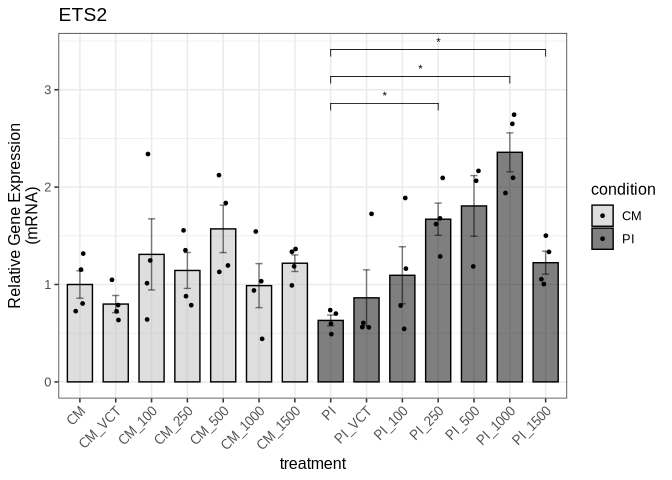

We save the figure to a PDF file in the Supplemental Figure 2 directory:

``` r
ggsave("output/Supplemental_Figure2/suppl_fig2a_ets2_qpcr.pdf", suppl_fig2a, 
       width = 6, height = 6, dpi = 300, useDingbats=FALSE)
```

#### Supplemental Figure 2b (ETS2 protein expression levels)

We do the same for ETS2 (protein) levels:

``` r
suppl2_ets2_protein_data <- read_xlsx("input/Supplemental_Figure2_data.xlsx", sheet = "ETS2_protein_new_data")
```

``` r
suppl2_ets2_protein_result <- compare_protein_groups(suppl2_ets2_protein_data,
  group_col = "treatment",
  gene_col = "ets2",
  control_group = "CM",
  wilcox_pairs = list(c("PI", "PI_1500"),
                      c("CM", "CM_250"))
)
```

``` r
suppl2_ets2_protein_result$all_wilcox_table
```

<div id="jnddedfpzr" style="padding-left:0px;padding-right:0px;padding-top:10px;padding-bottom:10px;overflow-x:auto;overflow-y:auto;width:auto;height:auto;">
<style>#jnddedfpzr table {
  font-family: system-ui, 'Segoe UI', Roboto, Helvetica, Arial, sans-serif, 'Apple Color Emoji', 'Segoe UI Emoji', 'Segoe UI Symbol', 'Noto Color Emoji';
  -webkit-font-smoothing: antialiased;
  -moz-osx-font-smoothing: grayscale;
}

#jnddedfpzr thead, #jnddedfpzr tbody, #jnddedfpzr tfoot, #jnddedfpzr tr, #jnddedfpzr td, #jnddedfpzr th {
  border-style: none;
}

#jnddedfpzr p {
  margin: 0;
  padding: 0;
}

#jnddedfpzr .gt_table {
  display: table;
  border-collapse: collapse;
  line-height: normal;
  margin-left: auto;
  margin-right: auto;
  color: #333333;
  font-size: 16px;
  font-weight: normal;
  font-style: normal;
  background-color: #FFFFFF;
  width: auto;
  border-top-style: solid;
  border-top-width: 2px;
  border-top-color: #A8A8A8;
  border-right-style: none;
  border-right-width: 2px;
  border-right-color: #D3D3D3;
  border-bottom-style: solid;
  border-bottom-width: 2px;
  border-bottom-color: #A8A8A8;
  border-left-style: none;
  border-left-width: 2px;
  border-left-color: #D3D3D3;
}

#jnddedfpzr .gt_caption {
  padding-top: 4px;
  padding-bottom: 4px;
}

#jnddedfpzr .gt_title {
  color: #333333;
  font-size: 125%;
  font-weight: initial;
  padding-top: 4px;
  padding-bottom: 4px;
  padding-left: 5px;
  padding-right: 5px;
  border-bottom-color: #FFFFFF;
  border-bottom-width: 0;
}

#jnddedfpzr .gt_subtitle {
  color: #333333;
  font-size: 85%;
  font-weight: initial;
  padding-top: 3px;
  padding-bottom: 5px;
  padding-left: 5px;
  padding-right: 5px;
  border-top-color: #FFFFFF;
  border-top-width: 0;
}

#jnddedfpzr .gt_heading {
  background-color: #FFFFFF;
  text-align: center;
  border-bottom-color: #FFFFFF;
  border-left-style: none;
  border-left-width: 1px;
  border-left-color: #D3D3D3;
  border-right-style: none;
  border-right-width: 1px;
  border-right-color: #D3D3D3;
}

#jnddedfpzr .gt_bottom_border {
  border-bottom-style: solid;
  border-bottom-width: 2px;
  border-bottom-color: #D3D3D3;
}

#jnddedfpzr .gt_col_headings {
  border-top-style: solid;
  border-top-width: 2px;
  border-top-color: #D3D3D3;
  border-bottom-style: solid;
  border-bottom-width: 2px;
  border-bottom-color: #D3D3D3;
  border-left-style: none;
  border-left-width: 1px;
  border-left-color: #D3D3D3;
  border-right-style: none;
  border-right-width: 1px;
  border-right-color: #D3D3D3;
}

#jnddedfpzr .gt_col_heading {
  color: #333333;
  background-color: #FFFFFF;
  font-size: 100%;
  font-weight: normal;
  text-transform: inherit;
  border-left-style: none;
  border-left-width: 1px;
  border-left-color: #D3D3D3;
  border-right-style: none;
  border-right-width: 1px;
  border-right-color: #D3D3D3;
  vertical-align: bottom;
  padding-top: 5px;
  padding-bottom: 6px;
  padding-left: 5px;
  padding-right: 5px;
  overflow-x: hidden;
}

#jnddedfpzr .gt_column_spanner_outer {
  color: #333333;
  background-color: #FFFFFF;
  font-size: 100%;
  font-weight: normal;
  text-transform: inherit;
  padding-top: 0;
  padding-bottom: 0;
  padding-left: 4px;
  padding-right: 4px;
}

#jnddedfpzr .gt_column_spanner_outer:first-child {
  padding-left: 0;
}

#jnddedfpzr .gt_column_spanner_outer:last-child {
  padding-right: 0;
}

#jnddedfpzr .gt_column_spanner {
  border-bottom-style: solid;
  border-bottom-width: 2px;
  border-bottom-color: #D3D3D3;
  vertical-align: bottom;
  padding-top: 5px;
  padding-bottom: 5px;
  overflow-x: hidden;
  display: inline-block;
  width: 100%;
}

#jnddedfpzr .gt_spanner_row {
  border-bottom-style: hidden;
}

#jnddedfpzr .gt_group_heading {
  padding-top: 8px;
  padding-bottom: 8px;
  padding-left: 5px;
  padding-right: 5px;
  color: #333333;
  background-color: #FFFFFF;
  font-size: 100%;
  font-weight: initial;
  text-transform: inherit;
  border-top-style: solid;
  border-top-width: 2px;
  border-top-color: #D3D3D3;
  border-bottom-style: solid;
  border-bottom-width: 2px;
  border-bottom-color: #D3D3D3;
  border-left-style: none;
  border-left-width: 1px;
  border-left-color: #D3D3D3;
  border-right-style: none;
  border-right-width: 1px;
  border-right-color: #D3D3D3;
  vertical-align: middle;
  text-align: left;
}

#jnddedfpzr .gt_empty_group_heading {
  padding: 0.5px;
  color: #333333;
  background-color: #FFFFFF;
  font-size: 100%;
  font-weight: initial;
  border-top-style: solid;
  border-top-width: 2px;
  border-top-color: #D3D3D3;
  border-bottom-style: solid;
  border-bottom-width: 2px;
  border-bottom-color: #D3D3D3;
  vertical-align: middle;
}

#jnddedfpzr .gt_from_md > :first-child {
  margin-top: 0;
}

#jnddedfpzr .gt_from_md > :last-child {
  margin-bottom: 0;
}

#jnddedfpzr .gt_row {
  padding-top: 8px;
  padding-bottom: 8px;
  padding-left: 5px;
  padding-right: 5px;
  margin: 10px;
  border-top-style: solid;
  border-top-width: 1px;
  border-top-color: #D3D3D3;
  border-left-style: none;
  border-left-width: 1px;
  border-left-color: #D3D3D3;
  border-right-style: none;
  border-right-width: 1px;
  border-right-color: #D3D3D3;
  vertical-align: middle;
  overflow-x: hidden;
}

#jnddedfpzr .gt_stub {
  color: #333333;
  background-color: #FFFFFF;
  font-size: 100%;
  font-weight: initial;
  text-transform: inherit;
  border-right-style: solid;
  border-right-width: 2px;
  border-right-color: #D3D3D3;
  padding-left: 5px;
  padding-right: 5px;
}

#jnddedfpzr .gt_stub_row_group {
  color: #333333;
  background-color: #FFFFFF;
  font-size: 100%;
  font-weight: initial;
  text-transform: inherit;
  border-right-style: solid;
  border-right-width: 2px;
  border-right-color: #D3D3D3;
  padding-left: 5px;
  padding-right: 5px;
  vertical-align: top;
}

#jnddedfpzr .gt_row_group_first td {
  border-top-width: 2px;
}

#jnddedfpzr .gt_row_group_first th {
  border-top-width: 2px;
}

#jnddedfpzr .gt_summary_row {
  color: #333333;
  background-color: #FFFFFF;
  text-transform: inherit;
  padding-top: 8px;
  padding-bottom: 8px;
  padding-left: 5px;
  padding-right: 5px;
}

#jnddedfpzr .gt_first_summary_row {
  border-top-style: solid;
  border-top-color: #D3D3D3;
}

#jnddedfpzr .gt_first_summary_row.thick {
  border-top-width: 2px;
}

#jnddedfpzr .gt_last_summary_row {
  padding-top: 8px;
  padding-bottom: 8px;
  padding-left: 5px;
  padding-right: 5px;
  border-bottom-style: solid;
  border-bottom-width: 2px;
  border-bottom-color: #D3D3D3;
}

#jnddedfpzr .gt_grand_summary_row {
  color: #333333;
  background-color: #FFFFFF;
  text-transform: inherit;
  padding-top: 8px;
  padding-bottom: 8px;
  padding-left: 5px;
  padding-right: 5px;
}

#jnddedfpzr .gt_first_grand_summary_row {
  padding-top: 8px;
  padding-bottom: 8px;
  padding-left: 5px;
  padding-right: 5px;
  border-top-style: double;
  border-top-width: 6px;
  border-top-color: #D3D3D3;
}

#jnddedfpzr .gt_last_grand_summary_row_top {
  padding-top: 8px;
  padding-bottom: 8px;
  padding-left: 5px;
  padding-right: 5px;
  border-bottom-style: double;
  border-bottom-width: 6px;
  border-bottom-color: #D3D3D3;
}

#jnddedfpzr .gt_striped {
  background-color: rgba(128, 128, 128, 0.05);
}

#jnddedfpzr .gt_table_body {
  border-top-style: solid;
  border-top-width: 2px;
  border-top-color: #D3D3D3;
  border-bottom-style: solid;
  border-bottom-width: 2px;
  border-bottom-color: #D3D3D3;
}

#jnddedfpzr .gt_footnotes {
  color: #333333;
  background-color: #FFFFFF;
  border-bottom-style: none;
  border-bottom-width: 2px;
  border-bottom-color: #D3D3D3;
  border-left-style: none;
  border-left-width: 2px;
  border-left-color: #D3D3D3;
  border-right-style: none;
  border-right-width: 2px;
  border-right-color: #D3D3D3;
}

#jnddedfpzr .gt_footnote {
  margin: 0px;
  font-size: 90%;
  padding-top: 4px;
  padding-bottom: 4px;
  padding-left: 5px;
  padding-right: 5px;
}

#jnddedfpzr .gt_sourcenotes {
  color: #333333;
  background-color: #FFFFFF;
  border-bottom-style: none;
  border-bottom-width: 2px;
  border-bottom-color: #D3D3D3;
  border-left-style: none;
  border-left-width: 2px;
  border-left-color: #D3D3D3;
  border-right-style: none;
  border-right-width: 2px;
  border-right-color: #D3D3D3;
}

#jnddedfpzr .gt_sourcenote {
  font-size: 90%;
  padding-top: 4px;
  padding-bottom: 4px;
  padding-left: 5px;
  padding-right: 5px;
}

#jnddedfpzr .gt_left {
  text-align: left;
}

#jnddedfpzr .gt_center {
  text-align: center;
}

#jnddedfpzr .gt_right {
  text-align: right;
  font-variant-numeric: tabular-nums;
}

#jnddedfpzr .gt_font_normal {
  font-weight: normal;
}

#jnddedfpzr .gt_font_bold {
  font-weight: bold;
}

#jnddedfpzr .gt_font_italic {
  font-style: italic;
}

#jnddedfpzr .gt_super {
  font-size: 65%;
}

#jnddedfpzr .gt_footnote_marks {
  font-size: 75%;
  vertical-align: 0.4em;
  position: initial;
}

#jnddedfpzr .gt_asterisk {
  font-size: 100%;
  vertical-align: 0;
}

#jnddedfpzr .gt_indent_1 {
  text-indent: 5px;
}

#jnddedfpzr .gt_indent_2 {
  text-indent: 10px;
}

#jnddedfpzr .gt_indent_3 {
  text-indent: 15px;
}

#jnddedfpzr .gt_indent_4 {
  text-indent: 20px;
}

#jnddedfpzr .gt_indent_5 {
  text-indent: 25px;
}
</style>
<table class="gt_table" data-quarto-disable-processing="false" data-quarto-bootstrap="false">
  <thead>
    <tr class="gt_col_headings">
      <th class="gt_col_heading gt_columns_bottom_border gt_left" rowspan="1" colspan="1" scope="col" id="Comparison">Comparison</th>
      <th class="gt_col_heading gt_columns_bottom_border gt_right" rowspan="1" colspan="1" scope="col" id="Statistic">Statistic</th>
      <th class="gt_col_heading gt_columns_bottom_border gt_right" rowspan="1" colspan="1" scope="col" id="P_value">P_value</th>
      <th class="gt_col_heading gt_columns_bottom_border gt_left" rowspan="1" colspan="1" scope="col" id="Significant">Significant</th>
    </tr>
  </thead>
  <tbody class="gt_table_body">
    <tr><td headers="Comparison" class="gt_row gt_left">CM vs CM_VCT</td>
<td headers="Statistic" class="gt_row gt_right">10</td>
<td headers="P_value" class="gt_row gt_right">0.6857</td>
<td headers="Significant" class="gt_row gt_left">No</td></tr>
    <tr><td headers="Comparison" class="gt_row gt_left">CM vs CM_100</td>
<td headers="Statistic" class="gt_row gt_right">8</td>
<td headers="P_value" class="gt_row gt_right">1.0000</td>
<td headers="Significant" class="gt_row gt_left">No</td></tr>
    <tr><td headers="Comparison" class="gt_row gt_left" style="background-color: rgba(204,230,255,0.8); color: #000000; font-weight: bold;">CM vs CM_250</td>
<td headers="Statistic" class="gt_row gt_right" style="background-color: rgba(204,230,255,0.8); color: #000000; font-weight: bold;">0</td>
<td headers="P_value" class="gt_row gt_right" style="background-color: rgba(204,230,255,0.8); color: #000000; font-weight: bold;">0.0286</td>
<td headers="Significant" class="gt_row gt_left" style="background-color: rgba(204,230,255,0.8); color: #000000; font-weight: bold;">Yes</td></tr>
    <tr><td headers="Comparison" class="gt_row gt_left">CM vs CM_500</td>
<td headers="Statistic" class="gt_row gt_right">3</td>
<td headers="P_value" class="gt_row gt_right">0.2000</td>
<td headers="Significant" class="gt_row gt_left">No</td></tr>
    <tr><td headers="Comparison" class="gt_row gt_left">CM vs CM_1000</td>
<td headers="Statistic" class="gt_row gt_right">4</td>
<td headers="P_value" class="gt_row gt_right">0.3429</td>
<td headers="Significant" class="gt_row gt_left">No</td></tr>
    <tr><td headers="Comparison" class="gt_row gt_left">CM vs CM_1500</td>
<td headers="Statistic" class="gt_row gt_right">4</td>
<td headers="P_value" class="gt_row gt_right">0.3429</td>
<td headers="Significant" class="gt_row gt_left">No</td></tr>
    <tr><td headers="Comparison" class="gt_row gt_left">CM vs PI</td>
<td headers="Statistic" class="gt_row gt_right">13</td>
<td headers="P_value" class="gt_row gt_right">0.2000</td>
<td headers="Significant" class="gt_row gt_left">No</td></tr>
    <tr><td headers="Comparison" class="gt_row gt_left">CM vs PI_VCT</td>
<td headers="Statistic" class="gt_row gt_right">10</td>
<td headers="P_value" class="gt_row gt_right">0.6857</td>
<td headers="Significant" class="gt_row gt_left">No</td></tr>
    <tr><td headers="Comparison" class="gt_row gt_left">CM vs PI_100</td>
<td headers="Statistic" class="gt_row gt_right">10</td>
<td headers="P_value" class="gt_row gt_right">0.6857</td>
<td headers="Significant" class="gt_row gt_left">No</td></tr>
    <tr><td headers="Comparison" class="gt_row gt_left" style="background-color: rgba(204,230,255,0.8); color: #000000; font-weight: bold;">CM vs PI_250</td>
<td headers="Statistic" class="gt_row gt_right" style="background-color: rgba(204,230,255,0.8); color: #000000; font-weight: bold;">16</td>
<td headers="P_value" class="gt_row gt_right" style="background-color: rgba(204,230,255,0.8); color: #000000; font-weight: bold;">0.0286</td>
<td headers="Significant" class="gt_row gt_left" style="background-color: rgba(204,230,255,0.8); color: #000000; font-weight: bold;">Yes</td></tr>
    <tr><td headers="Comparison" class="gt_row gt_left">CM vs PI_500</td>
<td headers="Statistic" class="gt_row gt_right">10</td>
<td headers="P_value" class="gt_row gt_right">0.6857</td>
<td headers="Significant" class="gt_row gt_left">No</td></tr>
    <tr><td headers="Comparison" class="gt_row gt_left">CM vs PI_1000</td>
<td headers="Statistic" class="gt_row gt_right">12</td>
<td headers="P_value" class="gt_row gt_right">0.3429</td>
<td headers="Significant" class="gt_row gt_left">No</td></tr>
    <tr><td headers="Comparison" class="gt_row gt_left">CM vs PI_1500</td>
<td headers="Statistic" class="gt_row gt_right">4</td>
<td headers="P_value" class="gt_row gt_right">0.3429</td>
<td headers="Significant" class="gt_row gt_left">No</td></tr>
    <tr><td headers="Comparison" class="gt_row gt_left">CM_VCT vs CM_100</td>
<td headers="Statistic" class="gt_row gt_right">7</td>
<td headers="P_value" class="gt_row gt_right">0.8857</td>
<td headers="Significant" class="gt_row gt_left">No</td></tr>
    <tr><td headers="Comparison" class="gt_row gt_left">CM_VCT vs CM_250</td>
<td headers="Statistic" class="gt_row gt_right">1</td>
<td headers="P_value" class="gt_row gt_right">0.0571</td>
<td headers="Significant" class="gt_row gt_left">No</td></tr>
    <tr><td headers="Comparison" class="gt_row gt_left">CM_VCT vs CM_500</td>
<td headers="Statistic" class="gt_row gt_right">3</td>
<td headers="P_value" class="gt_row gt_right">0.2000</td>
<td headers="Significant" class="gt_row gt_left">No</td></tr>
    <tr><td headers="Comparison" class="gt_row gt_left">CM_VCT vs CM_1000</td>
<td headers="Statistic" class="gt_row gt_right">3</td>
<td headers="P_value" class="gt_row gt_right">0.2000</td>
<td headers="Significant" class="gt_row gt_left">No</td></tr>
    <tr><td headers="Comparison" class="gt_row gt_left">CM_VCT vs CM_1500</td>
<td headers="Statistic" class="gt_row gt_right">2</td>
<td headers="P_value" class="gt_row gt_right">0.1143</td>
<td headers="Significant" class="gt_row gt_left">No</td></tr>
    <tr><td headers="Comparison" class="gt_row gt_left">CM_VCT vs PI</td>
<td headers="Statistic" class="gt_row gt_right">7</td>
<td headers="P_value" class="gt_row gt_right">0.8857</td>
<td headers="Significant" class="gt_row gt_left">No</td></tr>
    <tr><td headers="Comparison" class="gt_row gt_left">CM_VCT vs PI_VCT</td>
<td headers="Statistic" class="gt_row gt_right">10</td>
<td headers="P_value" class="gt_row gt_right">0.6857</td>
<td headers="Significant" class="gt_row gt_left">No</td></tr>
    <tr><td headers="Comparison" class="gt_row gt_left">CM_VCT vs PI_100</td>
<td headers="Statistic" class="gt_row gt_right">9</td>
<td headers="P_value" class="gt_row gt_right">0.8857</td>
<td headers="Significant" class="gt_row gt_left">No</td></tr>
    <tr><td headers="Comparison" class="gt_row gt_left">CM_VCT vs PI_250</td>
<td headers="Statistic" class="gt_row gt_right">12</td>
<td headers="P_value" class="gt_row gt_right">0.3429</td>
<td headers="Significant" class="gt_row gt_left">No</td></tr>
    <tr><td headers="Comparison" class="gt_row gt_left">CM_VCT vs PI_500</td>
<td headers="Statistic" class="gt_row gt_right">7</td>
<td headers="P_value" class="gt_row gt_right">0.8857</td>
<td headers="Significant" class="gt_row gt_left">No</td></tr>
    <tr><td headers="Comparison" class="gt_row gt_left">CM_VCT vs PI_1000</td>
<td headers="Statistic" class="gt_row gt_right">10</td>
<td headers="P_value" class="gt_row gt_right">0.6857</td>
<td headers="Significant" class="gt_row gt_left">No</td></tr>
    <tr><td headers="Comparison" class="gt_row gt_left">CM_VCT vs PI_1500</td>
<td headers="Statistic" class="gt_row gt_right">4</td>
<td headers="P_value" class="gt_row gt_right">0.3429</td>
<td headers="Significant" class="gt_row gt_left">No</td></tr>
    <tr><td headers="Comparison" class="gt_row gt_left">CM_100 vs CM_250</td>
<td headers="Statistic" class="gt_row gt_right">6</td>
<td headers="P_value" class="gt_row gt_right">0.6857</td>
<td headers="Significant" class="gt_row gt_left">No</td></tr>
    <tr><td headers="Comparison" class="gt_row gt_left">CM_100 vs CM_500</td>
<td headers="Statistic" class="gt_row gt_right">8</td>
<td headers="P_value" class="gt_row gt_right">1.0000</td>
<td headers="Significant" class="gt_row gt_left">No</td></tr>
    <tr><td headers="Comparison" class="gt_row gt_left">CM_100 vs CM_1000</td>
<td headers="Statistic" class="gt_row gt_right">8</td>
<td headers="P_value" class="gt_row gt_right">1.0000</td>
<td headers="Significant" class="gt_row gt_left">No</td></tr>
    <tr><td headers="Comparison" class="gt_row gt_left">CM_100 vs CM_1500</td>
<td headers="Statistic" class="gt_row gt_right">8</td>
<td headers="P_value" class="gt_row gt_right">1.0000</td>
<td headers="Significant" class="gt_row gt_left">No</td></tr>
    <tr><td headers="Comparison" class="gt_row gt_left">CM_100 vs PI</td>
<td headers="Statistic" class="gt_row gt_right">8</td>
<td headers="P_value" class="gt_row gt_right">1.0000</td>
<td headers="Significant" class="gt_row gt_left">No</td></tr>
    <tr><td headers="Comparison" class="gt_row gt_left">CM_100 vs PI_VCT</td>
<td headers="Statistic" class="gt_row gt_right">12</td>
<td headers="P_value" class="gt_row gt_right">0.3429</td>
<td headers="Significant" class="gt_row gt_left">No</td></tr>
    <tr><td headers="Comparison" class="gt_row gt_left">CM_100 vs PI_100</td>
<td headers="Statistic" class="gt_row gt_right">12</td>
<td headers="P_value" class="gt_row gt_right">0.3429</td>
<td headers="Significant" class="gt_row gt_left">No</td></tr>
    <tr><td headers="Comparison" class="gt_row gt_left">CM_100 vs PI_250</td>
<td headers="Statistic" class="gt_row gt_right">12</td>
<td headers="P_value" class="gt_row gt_right">0.3429</td>
<td headers="Significant" class="gt_row gt_left">No</td></tr>
    <tr><td headers="Comparison" class="gt_row gt_left">CM_100 vs PI_500</td>
<td headers="Statistic" class="gt_row gt_right">8</td>
<td headers="P_value" class="gt_row gt_right">1.0000</td>
<td headers="Significant" class="gt_row gt_left">No</td></tr>
    <tr><td headers="Comparison" class="gt_row gt_left">CM_100 vs PI_1000</td>
<td headers="Statistic" class="gt_row gt_right">9</td>
<td headers="P_value" class="gt_row gt_right">0.8857</td>
<td headers="Significant" class="gt_row gt_left">No</td></tr>
    <tr><td headers="Comparison" class="gt_row gt_left">CM_100 vs PI_1500</td>
<td headers="Statistic" class="gt_row gt_right">8</td>
<td headers="P_value" class="gt_row gt_right">1.0000</td>
<td headers="Significant" class="gt_row gt_left">No</td></tr>
    <tr><td headers="Comparison" class="gt_row gt_left">CM_250 vs CM_500</td>
<td headers="Statistic" class="gt_row gt_right">13</td>
<td headers="P_value" class="gt_row gt_right">0.2000</td>
<td headers="Significant" class="gt_row gt_left">No</td></tr>
    <tr><td headers="Comparison" class="gt_row gt_left">CM_250 vs CM_1000</td>
<td headers="Statistic" class="gt_row gt_right">13</td>
<td headers="P_value" class="gt_row gt_right">0.2000</td>
<td headers="Significant" class="gt_row gt_left">No</td></tr>
    <tr><td headers="Comparison" class="gt_row gt_left">CM_250 vs CM_1500</td>
<td headers="Statistic" class="gt_row gt_right">12</td>
<td headers="P_value" class="gt_row gt_right">0.3429</td>
<td headers="Significant" class="gt_row gt_left">No</td></tr>
    <tr><td headers="Comparison" class="gt_row gt_left" style="background-color: rgba(204,230,255,0.8); color: #000000; font-weight: bold;">CM_250 vs PI</td>
<td headers="Statistic" class="gt_row gt_right" style="background-color: rgba(204,230,255,0.8); color: #000000; font-weight: bold;">16</td>
<td headers="P_value" class="gt_row gt_right" style="background-color: rgba(204,230,255,0.8); color: #000000; font-weight: bold;">0.0286</td>
<td headers="Significant" class="gt_row gt_left" style="background-color: rgba(204,230,255,0.8); color: #000000; font-weight: bold;">Yes</td></tr>
    <tr><td headers="Comparison" class="gt_row gt_left">CM_250 vs PI_VCT</td>
<td headers="Statistic" class="gt_row gt_right">15</td>
<td headers="P_value" class="gt_row gt_right">0.0571</td>
<td headers="Significant" class="gt_row gt_left">No</td></tr>
    <tr><td headers="Comparison" class="gt_row gt_left">CM_250 vs PI_100</td>
<td headers="Statistic" class="gt_row gt_right">14</td>
<td headers="P_value" class="gt_row gt_right">0.1143</td>
<td headers="Significant" class="gt_row gt_left">No</td></tr>
    <tr><td headers="Comparison" class="gt_row gt_left" style="background-color: rgba(204,230,255,0.8); color: #000000; font-weight: bold;">CM_250 vs PI_250</td>
<td headers="Statistic" class="gt_row gt_right" style="background-color: rgba(204,230,255,0.8); color: #000000; font-weight: bold;">16</td>
<td headers="P_value" class="gt_row gt_right" style="background-color: rgba(204,230,255,0.8); color: #000000; font-weight: bold;">0.0286</td>
<td headers="Significant" class="gt_row gt_left" style="background-color: rgba(204,230,255,0.8); color: #000000; font-weight: bold;">Yes</td></tr>
    <tr><td headers="Comparison" class="gt_row gt_left" style="background-color: rgba(204,230,255,0.8); color: #000000; font-weight: bold;">CM_250 vs PI_500</td>
<td headers="Statistic" class="gt_row gt_right" style="background-color: rgba(204,230,255,0.8); color: #000000; font-weight: bold;">16</td>
<td headers="P_value" class="gt_row gt_right" style="background-color: rgba(204,230,255,0.8); color: #000000; font-weight: bold;">0.0286</td>
<td headers="Significant" class="gt_row gt_left" style="background-color: rgba(204,230,255,0.8); color: #000000; font-weight: bold;">Yes</td></tr>
    <tr><td headers="Comparison" class="gt_row gt_left" style="background-color: rgba(204,230,255,0.8); color: #000000; font-weight: bold;">CM_250 vs PI_1000</td>
<td headers="Statistic" class="gt_row gt_right" style="background-color: rgba(204,230,255,0.8); color: #000000; font-weight: bold;">16</td>
<td headers="P_value" class="gt_row gt_right" style="background-color: rgba(204,230,255,0.8); color: #000000; font-weight: bold;">0.0286</td>
<td headers="Significant" class="gt_row gt_left" style="background-color: rgba(204,230,255,0.8); color: #000000; font-weight: bold;">Yes</td></tr>
    <tr><td headers="Comparison" class="gt_row gt_left">CM_250 vs PI_1500</td>
<td headers="Statistic" class="gt_row gt_right">14</td>
<td headers="P_value" class="gt_row gt_right">0.1143</td>
<td headers="Significant" class="gt_row gt_left">No</td></tr>
    <tr><td headers="Comparison" class="gt_row gt_left">CM_500 vs CM_1000</td>
<td headers="Statistic" class="gt_row gt_right">9</td>
<td headers="P_value" class="gt_row gt_right">0.8857</td>
<td headers="Significant" class="gt_row gt_left">No</td></tr>
    <tr><td headers="Comparison" class="gt_row gt_left">CM_500 vs CM_1500</td>
<td headers="Statistic" class="gt_row gt_right">6</td>
<td headers="P_value" class="gt_row gt_right">0.6857</td>
<td headers="Significant" class="gt_row gt_left">No</td></tr>
    <tr><td headers="Comparison" class="gt_row gt_left" style="background-color: rgba(204,230,255,0.8); color: #000000; font-weight: bold;">CM_500 vs PI</td>
<td headers="Statistic" class="gt_row gt_right" style="background-color: rgba(204,230,255,0.8); color: #000000; font-weight: bold;">16</td>
<td headers="P_value" class="gt_row gt_right" style="background-color: rgba(204,230,255,0.8); color: #000000; font-weight: bold;">0.0286</td>
<td headers="Significant" class="gt_row gt_left" style="background-color: rgba(204,230,255,0.8); color: #000000; font-weight: bold;">Yes</td></tr>
    <tr><td headers="Comparison" class="gt_row gt_left">CM_500 vs PI_VCT</td>
<td headers="Statistic" class="gt_row gt_right">13</td>
<td headers="P_value" class="gt_row gt_right">0.2000</td>
<td headers="Significant" class="gt_row gt_left">No</td></tr>
    <tr><td headers="Comparison" class="gt_row gt_left">CM_500 vs PI_100</td>
<td headers="Statistic" class="gt_row gt_right">11</td>
<td headers="P_value" class="gt_row gt_right">0.4857</td>
<td headers="Significant" class="gt_row gt_left">No</td></tr>
    <tr><td headers="Comparison" class="gt_row gt_left" style="background-color: rgba(204,230,255,0.8); color: #000000; font-weight: bold;">CM_500 vs PI_250</td>
<td headers="Statistic" class="gt_row gt_right" style="background-color: rgba(204,230,255,0.8); color: #000000; font-weight: bold;">16</td>
<td headers="P_value" class="gt_row gt_right" style="background-color: rgba(204,230,255,0.8); color: #000000; font-weight: bold;">0.0286</td>
<td headers="Significant" class="gt_row gt_left" style="background-color: rgba(204,230,255,0.8); color: #000000; font-weight: bold;">Yes</td></tr>
    <tr><td headers="Comparison" class="gt_row gt_left" style="background-color: rgba(204,230,255,0.8); color: #000000; font-weight: bold;">CM_500 vs PI_500</td>
<td headers="Statistic" class="gt_row gt_right" style="background-color: rgba(204,230,255,0.8); color: #000000; font-weight: bold;">16</td>
<td headers="P_value" class="gt_row gt_right" style="background-color: rgba(204,230,255,0.8); color: #000000; font-weight: bold;">0.0286</td>
<td headers="Significant" class="gt_row gt_left" style="background-color: rgba(204,230,255,0.8); color: #000000; font-weight: bold;">Yes</td></tr>
    <tr><td headers="Comparison" class="gt_row gt_left">CM_500 vs PI_1000</td>
<td headers="Statistic" class="gt_row gt_right">15</td>
<td headers="P_value" class="gt_row gt_right">0.0571</td>
<td headers="Significant" class="gt_row gt_left">No</td></tr>
    <tr><td headers="Comparison" class="gt_row gt_left">CM_500 vs PI_1500</td>
<td headers="Statistic" class="gt_row gt_right">11</td>
<td headers="P_value" class="gt_row gt_right">0.4857</td>
<td headers="Significant" class="gt_row gt_left">No</td></tr>
    <tr><td headers="Comparison" class="gt_row gt_left">CM_1000 vs CM_1500</td>
<td headers="Statistic" class="gt_row gt_right">6</td>
<td headers="P_value" class="gt_row gt_right">0.6857</td>
<td headers="Significant" class="gt_row gt_left">No</td></tr>
    <tr><td headers="Comparison" class="gt_row gt_left">CM_1000 vs PI</td>
<td headers="Statistic" class="gt_row gt_right">14</td>
<td headers="P_value" class="gt_row gt_right">0.1143</td>
<td headers="Significant" class="gt_row gt_left">No</td></tr>
    <tr><td headers="Comparison" class="gt_row gt_left">CM_1000 vs PI_VCT</td>
<td headers="Statistic" class="gt_row gt_right">12</td>
<td headers="P_value" class="gt_row gt_right">0.3429</td>
<td headers="Significant" class="gt_row gt_left">No</td></tr>
    <tr><td headers="Comparison" class="gt_row gt_left">CM_1000 vs PI_100</td>
<td headers="Statistic" class="gt_row gt_right">11</td>
<td headers="P_value" class="gt_row gt_right">0.4857</td>
<td headers="Significant" class="gt_row gt_left">No</td></tr>
    <tr><td headers="Comparison" class="gt_row gt_left" style="background-color: rgba(204,230,255,0.8); color: #000000; font-weight: bold;">CM_1000 vs PI_250</td>
<td headers="Statistic" class="gt_row gt_right" style="background-color: rgba(204,230,255,0.8); color: #000000; font-weight: bold;">16</td>
<td headers="P_value" class="gt_row gt_right" style="background-color: rgba(204,230,255,0.8); color: #000000; font-weight: bold;">0.0286</td>
<td headers="Significant" class="gt_row gt_left" style="background-color: rgba(204,230,255,0.8); color: #000000; font-weight: bold;">Yes</td></tr>
    <tr><td headers="Comparison" class="gt_row gt_left">CM_1000 vs PI_500</td>
<td headers="Statistic" class="gt_row gt_right">14</td>
<td headers="P_value" class="gt_row gt_right">0.1143</td>
<td headers="Significant" class="gt_row gt_left">No</td></tr>
    <tr><td headers="Comparison" class="gt_row gt_left">CM_1000 vs PI_1000</td>
<td headers="Statistic" class="gt_row gt_right">13</td>
<td headers="P_value" class="gt_row gt_right">0.2000</td>
<td headers="Significant" class="gt_row gt_left">No</td></tr>
    <tr><td headers="Comparison" class="gt_row gt_left">CM_1000 vs PI_1500</td>
<td headers="Statistic" class="gt_row gt_right">8</td>
<td headers="P_value" class="gt_row gt_right">1.0000</td>
<td headers="Significant" class="gt_row gt_left">No</td></tr>
    <tr><td headers="Comparison" class="gt_row gt_left" style="background-color: rgba(204,230,255,0.8); color: #000000; font-weight: bold;">CM_1500 vs PI</td>
<td headers="Statistic" class="gt_row gt_right" style="background-color: rgba(204,230,255,0.8); color: #000000; font-weight: bold;">16</td>
<td headers="P_value" class="gt_row gt_right" style="background-color: rgba(204,230,255,0.8); color: #000000; font-weight: bold;">0.0286</td>
<td headers="Significant" class="gt_row gt_left" style="background-color: rgba(204,230,255,0.8); color: #000000; font-weight: bold;">Yes</td></tr>
    <tr><td headers="Comparison" class="gt_row gt_left">CM_1500 vs PI_VCT</td>
<td headers="Statistic" class="gt_row gt_right">12</td>
<td headers="P_value" class="gt_row gt_right">0.3429</td>
<td headers="Significant" class="gt_row gt_left">No</td></tr>
    <tr><td headers="Comparison" class="gt_row gt_left">CM_1500 vs PI_100</td>
<td headers="Statistic" class="gt_row gt_right">12</td>
<td headers="P_value" class="gt_row gt_right">0.3429</td>
<td headers="Significant" class="gt_row gt_left">No</td></tr>
    <tr><td headers="Comparison" class="gt_row gt_left" style="background-color: rgba(204,230,255,0.8); color: #000000; font-weight: bold;">CM_1500 vs PI_250</td>
<td headers="Statistic" class="gt_row gt_right" style="background-color: rgba(204,230,255,0.8); color: #000000; font-weight: bold;">16</td>
<td headers="P_value" class="gt_row gt_right" style="background-color: rgba(204,230,255,0.8); color: #000000; font-weight: bold;">0.0286</td>
<td headers="Significant" class="gt_row gt_left" style="background-color: rgba(204,230,255,0.8); color: #000000; font-weight: bold;">Yes</td></tr>
    <tr><td headers="Comparison" class="gt_row gt_left" style="background-color: rgba(204,230,255,0.8); color: #000000; font-weight: bold;">CM_1500 vs PI_500</td>
<td headers="Statistic" class="gt_row gt_right" style="background-color: rgba(204,230,255,0.8); color: #000000; font-weight: bold;">16</td>
<td headers="P_value" class="gt_row gt_right" style="background-color: rgba(204,230,255,0.8); color: #000000; font-weight: bold;">0.0286</td>
<td headers="Significant" class="gt_row gt_left" style="background-color: rgba(204,230,255,0.8); color: #000000; font-weight: bold;">Yes</td></tr>
    <tr><td headers="Comparison" class="gt_row gt_left" style="background-color: rgba(204,230,255,0.8); color: #000000; font-weight: bold;">CM_1500 vs PI_1000</td>
<td headers="Statistic" class="gt_row gt_right" style="background-color: rgba(204,230,255,0.8); color: #000000; font-weight: bold;">16</td>
<td headers="P_value" class="gt_row gt_right" style="background-color: rgba(204,230,255,0.8); color: #000000; font-weight: bold;">0.0286</td>
<td headers="Significant" class="gt_row gt_left" style="background-color: rgba(204,230,255,0.8); color: #000000; font-weight: bold;">Yes</td></tr>
    <tr><td headers="Comparison" class="gt_row gt_left">CM_1500 vs PI_1500</td>
<td headers="Statistic" class="gt_row gt_right">12</td>
<td headers="P_value" class="gt_row gt_right">0.3429</td>
<td headers="Significant" class="gt_row gt_left">No</td></tr>
    <tr><td headers="Comparison" class="gt_row gt_left">PI vs PI_VCT</td>
<td headers="Statistic" class="gt_row gt_right">8</td>
<td headers="P_value" class="gt_row gt_right">1.0000</td>
<td headers="Significant" class="gt_row gt_left">No</td></tr>
    <tr><td headers="Comparison" class="gt_row gt_left">PI vs PI_100</td>
<td headers="Statistic" class="gt_row gt_right">8</td>
<td headers="P_value" class="gt_row gt_right">1.0000</td>
<td headers="Significant" class="gt_row gt_left">No</td></tr>
    <tr><td headers="Comparison" class="gt_row gt_left">PI vs PI_250</td>
<td headers="Statistic" class="gt_row gt_right">12</td>
<td headers="P_value" class="gt_row gt_right">0.3429</td>
<td headers="Significant" class="gt_row gt_left">No</td></tr>
    <tr><td headers="Comparison" class="gt_row gt_left">PI vs PI_500</td>
<td headers="Statistic" class="gt_row gt_right">5</td>
<td headers="P_value" class="gt_row gt_right">0.4857</td>
<td headers="Significant" class="gt_row gt_left">No</td></tr>
    <tr><td headers="Comparison" class="gt_row gt_left">PI vs PI_1000</td>
<td headers="Statistic" class="gt_row gt_right">9</td>
<td headers="P_value" class="gt_row gt_right">0.8857</td>
<td headers="Significant" class="gt_row gt_left">No</td></tr>
    <tr><td headers="Comparison" class="gt_row gt_left" style="background-color: rgba(204,230,255,0.8); color: #000000; font-weight: bold;">PI vs PI_1500</td>
<td headers="Statistic" class="gt_row gt_right" style="background-color: rgba(204,230,255,0.8); color: #000000; font-weight: bold;">0</td>
<td headers="P_value" class="gt_row gt_right" style="background-color: rgba(204,230,255,0.8); color: #000000; font-weight: bold;">0.0286</td>
<td headers="Significant" class="gt_row gt_left" style="background-color: rgba(204,230,255,0.8); color: #000000; font-weight: bold;">Yes</td></tr>
    <tr><td headers="Comparison" class="gt_row gt_left">PI_VCT vs PI_100</td>
<td headers="Statistic" class="gt_row gt_right">6</td>
<td headers="P_value" class="gt_row gt_right">0.6857</td>
<td headers="Significant" class="gt_row gt_left">No</td></tr>
    <tr><td headers="Comparison" class="gt_row gt_left">PI_VCT vs PI_250</td>
<td headers="Statistic" class="gt_row gt_right">8</td>
<td headers="P_value" class="gt_row gt_right">1.0000</td>
<td headers="Significant" class="gt_row gt_left">No</td></tr>
    <tr><td headers="Comparison" class="gt_row gt_left">PI_VCT vs PI_500</td>
<td headers="Statistic" class="gt_row gt_right">8</td>
<td headers="P_value" class="gt_row gt_right">1.0000</td>
<td headers="Significant" class="gt_row gt_left">No</td></tr>
    <tr><td headers="Comparison" class="gt_row gt_left">PI_VCT vs PI_1000</td>
<td headers="Statistic" class="gt_row gt_right">8</td>
<td headers="P_value" class="gt_row gt_right">1.0000</td>
<td headers="Significant" class="gt_row gt_left">No</td></tr>
    <tr><td headers="Comparison" class="gt_row gt_left">PI_VCT vs PI_1500</td>
<td headers="Statistic" class="gt_row gt_right">4</td>
<td headers="P_value" class="gt_row gt_right">0.3429</td>
<td headers="Significant" class="gt_row gt_left">No</td></tr>
    <tr><td headers="Comparison" class="gt_row gt_left">PI_100 vs PI_250</td>
<td headers="Statistic" class="gt_row gt_right">8</td>
<td headers="P_value" class="gt_row gt_right">1.0000</td>
<td headers="Significant" class="gt_row gt_left">No</td></tr>
    <tr><td headers="Comparison" class="gt_row gt_left">PI_100 vs PI_500</td>
<td headers="Statistic" class="gt_row gt_right">8</td>
<td headers="P_value" class="gt_row gt_right">1.0000</td>
<td headers="Significant" class="gt_row gt_left">No</td></tr>
    <tr><td headers="Comparison" class="gt_row gt_left">PI_100 vs PI_1000</td>
<td headers="Statistic" class="gt_row gt_right">8</td>
<td headers="P_value" class="gt_row gt_right">1.0000</td>
<td headers="Significant" class="gt_row gt_left">No</td></tr>
    <tr><td headers="Comparison" class="gt_row gt_left">PI_100 vs PI_1500</td>
<td headers="Statistic" class="gt_row gt_right">6</td>
<td headers="P_value" class="gt_row gt_right">0.6857</td>
<td headers="Significant" class="gt_row gt_left">No</td></tr>
    <tr><td headers="Comparison" class="gt_row gt_left" style="background-color: rgba(204,230,255,0.8); color: #000000; font-weight: bold;">PI_250 vs PI_500</td>
<td headers="Statistic" class="gt_row gt_right" style="background-color: rgba(204,230,255,0.8); color: #000000; font-weight: bold;">0</td>
<td headers="P_value" class="gt_row gt_right" style="background-color: rgba(204,230,255,0.8); color: #000000; font-weight: bold;">0.0286</td>
<td headers="Significant" class="gt_row gt_left" style="background-color: rgba(204,230,255,0.8); color: #000000; font-weight: bold;">Yes</td></tr>
    <tr><td headers="Comparison" class="gt_row gt_left">PI_250 vs PI_1000</td>
<td headers="Statistic" class="gt_row gt_right">4</td>
<td headers="P_value" class="gt_row gt_right">0.3429</td>
<td headers="Significant" class="gt_row gt_left">No</td></tr>
    <tr><td headers="Comparison" class="gt_row gt_left" style="background-color: rgba(204,230,255,0.8); color: #000000; font-weight: bold;">PI_250 vs PI_1500</td>
<td headers="Statistic" class="gt_row gt_right" style="background-color: rgba(204,230,255,0.8); color: #000000; font-weight: bold;">0</td>
<td headers="P_value" class="gt_row gt_right" style="background-color: rgba(204,230,255,0.8); color: #000000; font-weight: bold;">0.0286</td>
<td headers="Significant" class="gt_row gt_left" style="background-color: rgba(204,230,255,0.8); color: #000000; font-weight: bold;">Yes</td></tr>
    <tr><td headers="Comparison" class="gt_row gt_left">PI_500 vs PI_1000</td>
<td headers="Statistic" class="gt_row gt_right">10</td>
<td headers="P_value" class="gt_row gt_right">0.6857</td>
<td headers="Significant" class="gt_row gt_left">No</td></tr>
    <tr><td headers="Comparison" class="gt_row gt_left" style="background-color: rgba(204,230,255,0.8); color: #000000; font-weight: bold;">PI_500 vs PI_1500</td>
<td headers="Statistic" class="gt_row gt_right" style="background-color: rgba(204,230,255,0.8); color: #000000; font-weight: bold;">0</td>
<td headers="P_value" class="gt_row gt_right" style="background-color: rgba(204,230,255,0.8); color: #000000; font-weight: bold;">0.0286</td>
<td headers="Significant" class="gt_row gt_left" style="background-color: rgba(204,230,255,0.8); color: #000000; font-weight: bold;">Yes</td></tr>
    <tr><td headers="Comparison" class="gt_row gt_left">PI_1000 vs PI_1500</td>
<td headers="Statistic" class="gt_row gt_right">2</td>
<td headers="P_value" class="gt_row gt_right">0.1143</td>
<td headers="Significant" class="gt_row gt_left">No</td></tr>
  </tbody>
  
  
</table>
</div>

``` r
suppl_fig2b <- suppl2_ets2_protein_result$p
```

``` r
suppl_fig2b
```


We save the figure to a PDF file in the Supplemental Figure 2 directory:

``` r
ggsave("output/Supplemental_Figure2/suppl_fig2b_ets2_protein.pdf", suppl_fig2b, 
       width = 6, height = 6, dpi = 300, useDingbats=FALSE)
```

#### Supplemental Figure 2d (STAT5B protein levels)

We repeat the same for STAT5B protein levels:

``` r
suppl2_stat5b_protein_data <- read_xlsx("input/Supplemental_Figure2_data.xlsx", sheet = "STAT5B_protein_new_data")
```

``` r
suppl2_stat5b_protein_result <- compare_protein_groups(suppl2_stat5b_protein_data,
  group_col = "treatment",
  gene_col = "stat5b",
  control_group = "CM",
  wilcox_pairs = list(c("CM", "PI"),
                      c("CM", "CM_500"), c("CM", "CM_1000"), c("CM", "CM_1500"),
                      c("PI", "PI_1000"), c("PI", "PI_1500"))
)
```

``` r
suppl2_stat5b_protein_result$all_wilcox_table
```

<div id="tjieicogmc" style="padding-left:0px;padding-right:0px;padding-top:10px;padding-bottom:10px;overflow-x:auto;overflow-y:auto;width:auto;height:auto;">
<style>#tjieicogmc table {
  font-family: system-ui, 'Segoe UI', Roboto, Helvetica, Arial, sans-serif, 'Apple Color Emoji', 'Segoe UI Emoji', 'Segoe UI Symbol', 'Noto Color Emoji';
  -webkit-font-smoothing: antialiased;
  -moz-osx-font-smoothing: grayscale;
}

#tjieicogmc thead, #tjieicogmc tbody, #tjieicogmc tfoot, #tjieicogmc tr, #tjieicogmc td, #tjieicogmc th {
  border-style: none;
}

#tjieicogmc p {
  margin: 0;
  padding: 0;
}

#tjieicogmc .gt_table {
  display: table;
  border-collapse: collapse;
  line-height: normal;
  margin-left: auto;
  margin-right: auto;
  color: #333333;
  font-size: 16px;
  font-weight: normal;
  font-style: normal;
  background-color: #FFFFFF;
  width: auto;
  border-top-style: solid;
  border-top-width: 2px;
  border-top-color: #A8A8A8;
  border-right-style: none;
  border-right-width: 2px;
  border-right-color: #D3D3D3;
  border-bottom-style: solid;
  border-bottom-width: 2px;
  border-bottom-color: #A8A8A8;
  border-left-style: none;
  border-left-width: 2px;
  border-left-color: #D3D3D3;
}

#tjieicogmc .gt_caption {
  padding-top: 4px;
  padding-bottom: 4px;
}

#tjieicogmc .gt_title {
  color: #333333;
  font-size: 125%;
  font-weight: initial;
  padding-top: 4px;
  padding-bottom: 4px;
  padding-left: 5px;
  padding-right: 5px;
  border-bottom-color: #FFFFFF;
  border-bottom-width: 0;
}

#tjieicogmc .gt_subtitle {
  color: #333333;
  font-size: 85%;
  font-weight: initial;
  padding-top: 3px;
  padding-bottom: 5px;
  padding-left: 5px;
  padding-right: 5px;
  border-top-color: #FFFFFF;
  border-top-width: 0;
}

#tjieicogmc .gt_heading {
  background-color: #FFFFFF;
  text-align: center;
  border-bottom-color: #FFFFFF;
  border-left-style: none;
  border-left-width: 1px;
  border-left-color: #D3D3D3;
  border-right-style: none;
  border-right-width: 1px;
  border-right-color: #D3D3D3;
}

#tjieicogmc .gt_bottom_border {
  border-bottom-style: solid;
  border-bottom-width: 2px;
  border-bottom-color: #D3D3D3;
}

#tjieicogmc .gt_col_headings {
  border-top-style: solid;
  border-top-width: 2px;
  border-top-color: #D3D3D3;
  border-bottom-style: solid;
  border-bottom-width: 2px;
  border-bottom-color: #D3D3D3;
  border-left-style: none;
  border-left-width: 1px;
  border-left-color: #D3D3D3;
  border-right-style: none;
  border-right-width: 1px;
  border-right-color: #D3D3D3;
}

#tjieicogmc .gt_col_heading {
  color: #333333;
  background-color: #FFFFFF;
  font-size: 100%;
  font-weight: normal;
  text-transform: inherit;
  border-left-style: none;
  border-left-width: 1px;
  border-left-color: #D3D3D3;
  border-right-style: none;
  border-right-width: 1px;
  border-right-color: #D3D3D3;
  vertical-align: bottom;
  padding-top: 5px;
  padding-bottom: 6px;
  padding-left: 5px;
  padding-right: 5px;
  overflow-x: hidden;
}

#tjieicogmc .gt_column_spanner_outer {
  color: #333333;
  background-color: #FFFFFF;
  font-size: 100%;
  font-weight: normal;
  text-transform: inherit;
  padding-top: 0;
  padding-bottom: 0;
  padding-left: 4px;
  padding-right: 4px;
}

#tjieicogmc .gt_column_spanner_outer:first-child {
  padding-left: 0;
}

#tjieicogmc .gt_column_spanner_outer:last-child {
  padding-right: 0;
}

#tjieicogmc .gt_column_spanner {
  border-bottom-style: solid;
  border-bottom-width: 2px;
  border-bottom-color: #D3D3D3;
  vertical-align: bottom;
  padding-top: 5px;
  padding-bottom: 5px;
  overflow-x: hidden;
  display: inline-block;
  width: 100%;
}

#tjieicogmc .gt_spanner_row {
  border-bottom-style: hidden;
}

#tjieicogmc .gt_group_heading {
  padding-top: 8px;
  padding-bottom: 8px;
  padding-left: 5px;
  padding-right: 5px;
  color: #333333;
  background-color: #FFFFFF;
  font-size: 100%;
  font-weight: initial;
  text-transform: inherit;
  border-top-style: solid;
  border-top-width: 2px;
  border-top-color: #D3D3D3;
  border-bottom-style: solid;
  border-bottom-width: 2px;
  border-bottom-color: #D3D3D3;
  border-left-style: none;
  border-left-width: 1px;
  border-left-color: #D3D3D3;
  border-right-style: none;
  border-right-width: 1px;
  border-right-color: #D3D3D3;
  vertical-align: middle;
  text-align: left;
}

#tjieicogmc .gt_empty_group_heading {
  padding: 0.5px;
  color: #333333;
  background-color: #FFFFFF;
  font-size: 100%;
  font-weight: initial;
  border-top-style: solid;
  border-top-width: 2px;
  border-top-color: #D3D3D3;
  border-bottom-style: solid;
  border-bottom-width: 2px;
  border-bottom-color: #D3D3D3;
  vertical-align: middle;
}

#tjieicogmc .gt_from_md > :first-child {
  margin-top: 0;
}

#tjieicogmc .gt_from_md > :last-child {
  margin-bottom: 0;
}

#tjieicogmc .gt_row {
  padding-top: 8px;
  padding-bottom: 8px;
  padding-left: 5px;
  padding-right: 5px;
  margin: 10px;
  border-top-style: solid;
  border-top-width: 1px;
  border-top-color: #D3D3D3;
  border-left-style: none;
  border-left-width: 1px;
  border-left-color: #D3D3D3;
  border-right-style: none;
  border-right-width: 1px;
  border-right-color: #D3D3D3;
  vertical-align: middle;
  overflow-x: hidden;
}

#tjieicogmc .gt_stub {
  color: #333333;
  background-color: #FFFFFF;
  font-size: 100%;
  font-weight: initial;
  text-transform: inherit;
  border-right-style: solid;
  border-right-width: 2px;
  border-right-color: #D3D3D3;
  padding-left: 5px;
  padding-right: 5px;
}

#tjieicogmc .gt_stub_row_group {
  color: #333333;
  background-color: #FFFFFF;
  font-size: 100%;
  font-weight: initial;
  text-transform: inherit;
  border-right-style: solid;
  border-right-width: 2px;
  border-right-color: #D3D3D3;
  padding-left: 5px;
  padding-right: 5px;
  vertical-align: top;
}

#tjieicogmc .gt_row_group_first td {
  border-top-width: 2px;
}

#tjieicogmc .gt_row_group_first th {
  border-top-width: 2px;
}

#tjieicogmc .gt_summary_row {
  color: #333333;
  background-color: #FFFFFF;
  text-transform: inherit;
  padding-top: 8px;
  padding-bottom: 8px;
  padding-left: 5px;
  padding-right: 5px;
}

#tjieicogmc .gt_first_summary_row {
  border-top-style: solid;
  border-top-color: #D3D3D3;
}

#tjieicogmc .gt_first_summary_row.thick {
  border-top-width: 2px;
}

#tjieicogmc .gt_last_summary_row {
  padding-top: 8px;
  padding-bottom: 8px;
  padding-left: 5px;
  padding-right: 5px;
  border-bottom-style: solid;
  border-bottom-width: 2px;
  border-bottom-color: #D3D3D3;
}

#tjieicogmc .gt_grand_summary_row {
  color: #333333;
  background-color: #FFFFFF;
  text-transform: inherit;
  padding-top: 8px;
  padding-bottom: 8px;
  padding-left: 5px;
  padding-right: 5px;
}

#tjieicogmc .gt_first_grand_summary_row {
  padding-top: 8px;
  padding-bottom: 8px;
  padding-left: 5px;
  padding-right: 5px;
  border-top-style: double;
  border-top-width: 6px;
  border-top-color: #D3D3D3;
}

#tjieicogmc .gt_last_grand_summary_row_top {
  padding-top: 8px;
  padding-bottom: 8px;
  padding-left: 5px;
  padding-right: 5px;
  border-bottom-style: double;
  border-bottom-width: 6px;
  border-bottom-color: #D3D3D3;
}

#tjieicogmc .gt_striped {
  background-color: rgba(128, 128, 128, 0.05);
}

#tjieicogmc .gt_table_body {
  border-top-style: solid;
  border-top-width: 2px;
  border-top-color: #D3D3D3;
  border-bottom-style: solid;
  border-bottom-width: 2px;
  border-bottom-color: #D3D3D3;
}

#tjieicogmc .gt_footnotes {
  color: #333333;
  background-color: #FFFFFF;
  border-bottom-style: none;
  border-bottom-width: 2px;
  border-bottom-color: #D3D3D3;
  border-left-style: none;
  border-left-width: 2px;
  border-left-color: #D3D3D3;
  border-right-style: none;
  border-right-width: 2px;
  border-right-color: #D3D3D3;
}

#tjieicogmc .gt_footnote {
  margin: 0px;
  font-size: 90%;
  padding-top: 4px;
  padding-bottom: 4px;
  padding-left: 5px;
  padding-right: 5px;
}

#tjieicogmc .gt_sourcenotes {
  color: #333333;
  background-color: #FFFFFF;
  border-bottom-style: none;
  border-bottom-width: 2px;
  border-bottom-color: #D3D3D3;
  border-left-style: none;
  border-left-width: 2px;
  border-left-color: #D3D3D3;
  border-right-style: none;
  border-right-width: 2px;
  border-right-color: #D3D3D3;
}

#tjieicogmc .gt_sourcenote {
  font-size: 90%;
  padding-top: 4px;
  padding-bottom: 4px;
  padding-left: 5px;
  padding-right: 5px;
}

#tjieicogmc .gt_left {
  text-align: left;
}

#tjieicogmc .gt_center {
  text-align: center;
}

#tjieicogmc .gt_right {
  text-align: right;
  font-variant-numeric: tabular-nums;
}

#tjieicogmc .gt_font_normal {
  font-weight: normal;
}

#tjieicogmc .gt_font_bold {
  font-weight: bold;
}

#tjieicogmc .gt_font_italic {
  font-style: italic;
}

#tjieicogmc .gt_super {
  font-size: 65%;
}

#tjieicogmc .gt_footnote_marks {
  font-size: 75%;
  vertical-align: 0.4em;
  position: initial;
}

#tjieicogmc .gt_asterisk {
  font-size: 100%;
  vertical-align: 0;
}

#tjieicogmc .gt_indent_1 {
  text-indent: 5px;
}

#tjieicogmc .gt_indent_2 {
  text-indent: 10px;
}

#tjieicogmc .gt_indent_3 {
  text-indent: 15px;
}

#tjieicogmc .gt_indent_4 {
  text-indent: 20px;
}

#tjieicogmc .gt_indent_5 {
  text-indent: 25px;
}
</style>
<table class="gt_table" data-quarto-disable-processing="false" data-quarto-bootstrap="false">
  <thead>
    <tr class="gt_col_headings">
      <th class="gt_col_heading gt_columns_bottom_border gt_left" rowspan="1" colspan="1" scope="col" id="Comparison">Comparison</th>
      <th class="gt_col_heading gt_columns_bottom_border gt_right" rowspan="1" colspan="1" scope="col" id="Statistic">Statistic</th>
      <th class="gt_col_heading gt_columns_bottom_border gt_right" rowspan="1" colspan="1" scope="col" id="P_value">P_value</th>
      <th class="gt_col_heading gt_columns_bottom_border gt_left" rowspan="1" colspan="1" scope="col" id="Significant">Significant</th>
    </tr>
  </thead>
  <tbody class="gt_table_body">
    <tr><td headers="Comparison" class="gt_row gt_left">CM vs CM_VCT</td>
<td headers="Statistic" class="gt_row gt_right">9</td>
<td headers="P_value" class="gt_row gt_right">0.8857</td>
<td headers="Significant" class="gt_row gt_left">No</td></tr>
    <tr><td headers="Comparison" class="gt_row gt_left" style="background-color: rgba(204,230,255,0.8); color: #000000; font-weight: bold;">CM vs CM_100</td>
<td headers="Statistic" class="gt_row gt_right" style="background-color: rgba(204,230,255,0.8); color: #000000; font-weight: bold;">0</td>
<td headers="P_value" class="gt_row gt_right" style="background-color: rgba(204,230,255,0.8); color: #000000; font-weight: bold;">0.0286</td>
<td headers="Significant" class="gt_row gt_left" style="background-color: rgba(204,230,255,0.8); color: #000000; font-weight: bold;">Yes</td></tr>
    <tr><td headers="Comparison" class="gt_row gt_left" style="background-color: rgba(204,230,255,0.8); color: #000000; font-weight: bold;">CM vs CM_250</td>
<td headers="Statistic" class="gt_row gt_right" style="background-color: rgba(204,230,255,0.8); color: #000000; font-weight: bold;">0</td>
<td headers="P_value" class="gt_row gt_right" style="background-color: rgba(204,230,255,0.8); color: #000000; font-weight: bold;">0.0286</td>
<td headers="Significant" class="gt_row gt_left" style="background-color: rgba(204,230,255,0.8); color: #000000; font-weight: bold;">Yes</td></tr>
    <tr><td headers="Comparison" class="gt_row gt_left" style="background-color: rgba(204,230,255,0.8); color: #000000; font-weight: bold;">CM vs CM_500</td>
<td headers="Statistic" class="gt_row gt_right" style="background-color: rgba(204,230,255,0.8); color: #000000; font-weight: bold;">0</td>
<td headers="P_value" class="gt_row gt_right" style="background-color: rgba(204,230,255,0.8); color: #000000; font-weight: bold;">0.0286</td>
<td headers="Significant" class="gt_row gt_left" style="background-color: rgba(204,230,255,0.8); color: #000000; font-weight: bold;">Yes</td></tr>
    <tr><td headers="Comparison" class="gt_row gt_left" style="background-color: rgba(204,230,255,0.8); color: #000000; font-weight: bold;">CM vs CM_1000</td>
<td headers="Statistic" class="gt_row gt_right" style="background-color: rgba(204,230,255,0.8); color: #000000; font-weight: bold;">0</td>
<td headers="P_value" class="gt_row gt_right" style="background-color: rgba(204,230,255,0.8); color: #000000; font-weight: bold;">0.0286</td>
<td headers="Significant" class="gt_row gt_left" style="background-color: rgba(204,230,255,0.8); color: #000000; font-weight: bold;">Yes</td></tr>
    <tr><td headers="Comparison" class="gt_row gt_left" style="background-color: rgba(204,230,255,0.8); color: #000000; font-weight: bold;">CM vs CM_1500</td>
<td headers="Statistic" class="gt_row gt_right" style="background-color: rgba(204,230,255,0.8); color: #000000; font-weight: bold;">0</td>
<td headers="P_value" class="gt_row gt_right" style="background-color: rgba(204,230,255,0.8); color: #000000; font-weight: bold;">0.0286</td>
<td headers="Significant" class="gt_row gt_left" style="background-color: rgba(204,230,255,0.8); color: #000000; font-weight: bold;">Yes</td></tr>
    <tr><td headers="Comparison" class="gt_row gt_left" style="background-color: rgba(204,230,255,0.8); color: #000000; font-weight: bold;">CM vs PI</td>
<td headers="Statistic" class="gt_row gt_right" style="background-color: rgba(204,230,255,0.8); color: #000000; font-weight: bold;">0</td>
<td headers="P_value" class="gt_row gt_right" style="background-color: rgba(204,230,255,0.8); color: #000000; font-weight: bold;">0.0286</td>
<td headers="Significant" class="gt_row gt_left" style="background-color: rgba(204,230,255,0.8); color: #000000; font-weight: bold;">Yes</td></tr>
    <tr><td headers="Comparison" class="gt_row gt_left" style="background-color: rgba(204,230,255,0.8); color: #000000; font-weight: bold;">CM vs PI_VCT</td>
<td headers="Statistic" class="gt_row gt_right" style="background-color: rgba(204,230,255,0.8); color: #000000; font-weight: bold;">0</td>
<td headers="P_value" class="gt_row gt_right" style="background-color: rgba(204,230,255,0.8); color: #000000; font-weight: bold;">0.0286</td>
<td headers="Significant" class="gt_row gt_left" style="background-color: rgba(204,230,255,0.8); color: #000000; font-weight: bold;">Yes</td></tr>
    <tr><td headers="Comparison" class="gt_row gt_left" style="background-color: rgba(204,230,255,0.8); color: #000000; font-weight: bold;">CM vs PI_100</td>
<td headers="Statistic" class="gt_row gt_right" style="background-color: rgba(204,230,255,0.8); color: #000000; font-weight: bold;">0</td>
<td headers="P_value" class="gt_row gt_right" style="background-color: rgba(204,230,255,0.8); color: #000000; font-weight: bold;">0.0286</td>
<td headers="Significant" class="gt_row gt_left" style="background-color: rgba(204,230,255,0.8); color: #000000; font-weight: bold;">Yes</td></tr>
    <tr><td headers="Comparison" class="gt_row gt_left">CM vs PI_250</td>
<td headers="Statistic" class="gt_row gt_right">0</td>
<td headers="P_value" class="gt_row gt_right">0.0571</td>
<td headers="Significant" class="gt_row gt_left">No</td></tr>
    <tr><td headers="Comparison" class="gt_row gt_left" style="background-color: rgba(204,230,255,0.8); color: #000000; font-weight: bold;">CM vs PI_500</td>
<td headers="Statistic" class="gt_row gt_right" style="background-color: rgba(204,230,255,0.8); color: #000000; font-weight: bold;">0</td>
<td headers="P_value" class="gt_row gt_right" style="background-color: rgba(204,230,255,0.8); color: #000000; font-weight: bold;">0.0286</td>
<td headers="Significant" class="gt_row gt_left" style="background-color: rgba(204,230,255,0.8); color: #000000; font-weight: bold;">Yes</td></tr>
    <tr><td headers="Comparison" class="gt_row gt_left" style="background-color: rgba(204,230,255,0.8); color: #000000; font-weight: bold;">CM vs PI_1000</td>
<td headers="Statistic" class="gt_row gt_right" style="background-color: rgba(204,230,255,0.8); color: #000000; font-weight: bold;">0</td>
<td headers="P_value" class="gt_row gt_right" style="background-color: rgba(204,230,255,0.8); color: #000000; font-weight: bold;">0.0286</td>
<td headers="Significant" class="gt_row gt_left" style="background-color: rgba(204,230,255,0.8); color: #000000; font-weight: bold;">Yes</td></tr>
    <tr><td headers="Comparison" class="gt_row gt_left" style="background-color: rgba(204,230,255,0.8); color: #000000; font-weight: bold;">CM vs PI_1500</td>
<td headers="Statistic" class="gt_row gt_right" style="background-color: rgba(204,230,255,0.8); color: #000000; font-weight: bold;">0</td>
<td headers="P_value" class="gt_row gt_right" style="background-color: rgba(204,230,255,0.8); color: #000000; font-weight: bold;">0.0286</td>
<td headers="Significant" class="gt_row gt_left" style="background-color: rgba(204,230,255,0.8); color: #000000; font-weight: bold;">Yes</td></tr>
    <tr><td headers="Comparison" class="gt_row gt_left" style="background-color: rgba(204,230,255,0.8); color: #000000; font-weight: bold;">CM_VCT vs CM_100</td>
<td headers="Statistic" class="gt_row gt_right" style="background-color: rgba(204,230,255,0.8); color: #000000; font-weight: bold;">0</td>
<td headers="P_value" class="gt_row gt_right" style="background-color: rgba(204,230,255,0.8); color: #000000; font-weight: bold;">0.0286</td>
<td headers="Significant" class="gt_row gt_left" style="background-color: rgba(204,230,255,0.8); color: #000000; font-weight: bold;">Yes</td></tr>
    <tr><td headers="Comparison" class="gt_row gt_left" style="background-color: rgba(204,230,255,0.8); color: #000000; font-weight: bold;">CM_VCT vs CM_250</td>
<td headers="Statistic" class="gt_row gt_right" style="background-color: rgba(204,230,255,0.8); color: #000000; font-weight: bold;">0</td>
<td headers="P_value" class="gt_row gt_right" style="background-color: rgba(204,230,255,0.8); color: #000000; font-weight: bold;">0.0286</td>
<td headers="Significant" class="gt_row gt_left" style="background-color: rgba(204,230,255,0.8); color: #000000; font-weight: bold;">Yes</td></tr>
    <tr><td headers="Comparison" class="gt_row gt_left" style="background-color: rgba(204,230,255,0.8); color: #000000; font-weight: bold;">CM_VCT vs CM_500</td>
<td headers="Statistic" class="gt_row gt_right" style="background-color: rgba(204,230,255,0.8); color: #000000; font-weight: bold;">0</td>
<td headers="P_value" class="gt_row gt_right" style="background-color: rgba(204,230,255,0.8); color: #000000; font-weight: bold;">0.0286</td>
<td headers="Significant" class="gt_row gt_left" style="background-color: rgba(204,230,255,0.8); color: #000000; font-weight: bold;">Yes</td></tr>
    <tr><td headers="Comparison" class="gt_row gt_left" style="background-color: rgba(204,230,255,0.8); color: #000000; font-weight: bold;">CM_VCT vs CM_1000</td>
<td headers="Statistic" class="gt_row gt_right" style="background-color: rgba(204,230,255,0.8); color: #000000; font-weight: bold;">0</td>
<td headers="P_value" class="gt_row gt_right" style="background-color: rgba(204,230,255,0.8); color: #000000; font-weight: bold;">0.0286</td>
<td headers="Significant" class="gt_row gt_left" style="background-color: rgba(204,230,255,0.8); color: #000000; font-weight: bold;">Yes</td></tr>
    <tr><td headers="Comparison" class="gt_row gt_left" style="background-color: rgba(204,230,255,0.8); color: #000000; font-weight: bold;">CM_VCT vs CM_1500</td>
<td headers="Statistic" class="gt_row gt_right" style="background-color: rgba(204,230,255,0.8); color: #000000; font-weight: bold;">0</td>
<td headers="P_value" class="gt_row gt_right" style="background-color: rgba(204,230,255,0.8); color: #000000; font-weight: bold;">0.0286</td>
<td headers="Significant" class="gt_row gt_left" style="background-color: rgba(204,230,255,0.8); color: #000000; font-weight: bold;">Yes</td></tr>
    <tr><td headers="Comparison" class="gt_row gt_left" style="background-color: rgba(204,230,255,0.8); color: #000000; font-weight: bold;">CM_VCT vs PI</td>
<td headers="Statistic" class="gt_row gt_right" style="background-color: rgba(204,230,255,0.8); color: #000000; font-weight: bold;">0</td>
<td headers="P_value" class="gt_row gt_right" style="background-color: rgba(204,230,255,0.8); color: #000000; font-weight: bold;">0.0286</td>
<td headers="Significant" class="gt_row gt_left" style="background-color: rgba(204,230,255,0.8); color: #000000; font-weight: bold;">Yes</td></tr>
    <tr><td headers="Comparison" class="gt_row gt_left" style="background-color: rgba(204,230,255,0.8); color: #000000; font-weight: bold;">CM_VCT vs PI_VCT</td>
<td headers="Statistic" class="gt_row gt_right" style="background-color: rgba(204,230,255,0.8); color: #000000; font-weight: bold;">0</td>
<td headers="P_value" class="gt_row gt_right" style="background-color: rgba(204,230,255,0.8); color: #000000; font-weight: bold;">0.0286</td>
<td headers="Significant" class="gt_row gt_left" style="background-color: rgba(204,230,255,0.8); color: #000000; font-weight: bold;">Yes</td></tr>
    <tr><td headers="Comparison" class="gt_row gt_left" style="background-color: rgba(204,230,255,0.8); color: #000000; font-weight: bold;">CM_VCT vs PI_100</td>
<td headers="Statistic" class="gt_row gt_right" style="background-color: rgba(204,230,255,0.8); color: #000000; font-weight: bold;">0</td>
<td headers="P_value" class="gt_row gt_right" style="background-color: rgba(204,230,255,0.8); color: #000000; font-weight: bold;">0.0286</td>
<td headers="Significant" class="gt_row gt_left" style="background-color: rgba(204,230,255,0.8); color: #000000; font-weight: bold;">Yes</td></tr>
    <tr><td headers="Comparison" class="gt_row gt_left">CM_VCT vs PI_250</td>
<td headers="Statistic" class="gt_row gt_right">0</td>
<td headers="P_value" class="gt_row gt_right">0.0571</td>
<td headers="Significant" class="gt_row gt_left">No</td></tr>
    <tr><td headers="Comparison" class="gt_row gt_left" style="background-color: rgba(204,230,255,0.8); color: #000000; font-weight: bold;">CM_VCT vs PI_500</td>
<td headers="Statistic" class="gt_row gt_right" style="background-color: rgba(204,230,255,0.8); color: #000000; font-weight: bold;">0</td>
<td headers="P_value" class="gt_row gt_right" style="background-color: rgba(204,230,255,0.8); color: #000000; font-weight: bold;">0.0286</td>
<td headers="Significant" class="gt_row gt_left" style="background-color: rgba(204,230,255,0.8); color: #000000; font-weight: bold;">Yes</td></tr>
    <tr><td headers="Comparison" class="gt_row gt_left" style="background-color: rgba(204,230,255,0.8); color: #000000; font-weight: bold;">CM_VCT vs PI_1000</td>
<td headers="Statistic" class="gt_row gt_right" style="background-color: rgba(204,230,255,0.8); color: #000000; font-weight: bold;">0</td>
<td headers="P_value" class="gt_row gt_right" style="background-color: rgba(204,230,255,0.8); color: #000000; font-weight: bold;">0.0286</td>
<td headers="Significant" class="gt_row gt_left" style="background-color: rgba(204,230,255,0.8); color: #000000; font-weight: bold;">Yes</td></tr>
    <tr><td headers="Comparison" class="gt_row gt_left" style="background-color: rgba(204,230,255,0.8); color: #000000; font-weight: bold;">CM_VCT vs PI_1500</td>
<td headers="Statistic" class="gt_row gt_right" style="background-color: rgba(204,230,255,0.8); color: #000000; font-weight: bold;">0</td>
<td headers="P_value" class="gt_row gt_right" style="background-color: rgba(204,230,255,0.8); color: #000000; font-weight: bold;">0.0286</td>
<td headers="Significant" class="gt_row gt_left" style="background-color: rgba(204,230,255,0.8); color: #000000; font-weight: bold;">Yes</td></tr>
    <tr><td headers="Comparison" class="gt_row gt_left" style="background-color: rgba(204,230,255,0.8); color: #000000; font-weight: bold;">CM_100 vs CM_250</td>
<td headers="Statistic" class="gt_row gt_right" style="background-color: rgba(204,230,255,0.8); color: #000000; font-weight: bold;">0</td>
<td headers="P_value" class="gt_row gt_right" style="background-color: rgba(204,230,255,0.8); color: #000000; font-weight: bold;">0.0286</td>
<td headers="Significant" class="gt_row gt_left" style="background-color: rgba(204,230,255,0.8); color: #000000; font-weight: bold;">Yes</td></tr>
    <tr><td headers="Comparison" class="gt_row gt_left" style="background-color: rgba(204,230,255,0.8); color: #000000; font-weight: bold;">CM_100 vs CM_500</td>
<td headers="Statistic" class="gt_row gt_right" style="background-color: rgba(204,230,255,0.8); color: #000000; font-weight: bold;">0</td>
<td headers="P_value" class="gt_row gt_right" style="background-color: rgba(204,230,255,0.8); color: #000000; font-weight: bold;">0.0286</td>
<td headers="Significant" class="gt_row gt_left" style="background-color: rgba(204,230,255,0.8); color: #000000; font-weight: bold;">Yes</td></tr>
    <tr><td headers="Comparison" class="gt_row gt_left" style="background-color: rgba(204,230,255,0.8); color: #000000; font-weight: bold;">CM_100 vs CM_1000</td>
<td headers="Statistic" class="gt_row gt_right" style="background-color: rgba(204,230,255,0.8); color: #000000; font-weight: bold;">0</td>
<td headers="P_value" class="gt_row gt_right" style="background-color: rgba(204,230,255,0.8); color: #000000; font-weight: bold;">0.0286</td>
<td headers="Significant" class="gt_row gt_left" style="background-color: rgba(204,230,255,0.8); color: #000000; font-weight: bold;">Yes</td></tr>
    <tr><td headers="Comparison" class="gt_row gt_left" style="background-color: rgba(204,230,255,0.8); color: #000000; font-weight: bold;">CM_100 vs CM_1500</td>
<td headers="Statistic" class="gt_row gt_right" style="background-color: rgba(204,230,255,0.8); color: #000000; font-weight: bold;">0</td>
<td headers="P_value" class="gt_row gt_right" style="background-color: rgba(204,230,255,0.8); color: #000000; font-weight: bold;">0.0286</td>
<td headers="Significant" class="gt_row gt_left" style="background-color: rgba(204,230,255,0.8); color: #000000; font-weight: bold;">Yes</td></tr>
    <tr><td headers="Comparison" class="gt_row gt_left" style="background-color: rgba(204,230,255,0.8); color: #000000; font-weight: bold;">CM_100 vs PI</td>
<td headers="Statistic" class="gt_row gt_right" style="background-color: rgba(204,230,255,0.8); color: #000000; font-weight: bold;">0</td>
<td headers="P_value" class="gt_row gt_right" style="background-color: rgba(204,230,255,0.8); color: #000000; font-weight: bold;">0.0286</td>
<td headers="Significant" class="gt_row gt_left" style="background-color: rgba(204,230,255,0.8); color: #000000; font-weight: bold;">Yes</td></tr>
    <tr><td headers="Comparison" class="gt_row gt_left" style="background-color: rgba(204,230,255,0.8); color: #000000; font-weight: bold;">CM_100 vs PI_VCT</td>
<td headers="Statistic" class="gt_row gt_right" style="background-color: rgba(204,230,255,0.8); color: #000000; font-weight: bold;">0</td>
<td headers="P_value" class="gt_row gt_right" style="background-color: rgba(204,230,255,0.8); color: #000000; font-weight: bold;">0.0286</td>
<td headers="Significant" class="gt_row gt_left" style="background-color: rgba(204,230,255,0.8); color: #000000; font-weight: bold;">Yes</td></tr>
    <tr><td headers="Comparison" class="gt_row gt_left" style="background-color: rgba(204,230,255,0.8); color: #000000; font-weight: bold;">CM_100 vs PI_100</td>
<td headers="Statistic" class="gt_row gt_right" style="background-color: rgba(204,230,255,0.8); color: #000000; font-weight: bold;">0</td>
<td headers="P_value" class="gt_row gt_right" style="background-color: rgba(204,230,255,0.8); color: #000000; font-weight: bold;">0.0286</td>
<td headers="Significant" class="gt_row gt_left" style="background-color: rgba(204,230,255,0.8); color: #000000; font-weight: bold;">Yes</td></tr>
    <tr><td headers="Comparison" class="gt_row gt_left">CM_100 vs PI_250</td>
<td headers="Statistic" class="gt_row gt_right">0</td>
<td headers="P_value" class="gt_row gt_right">0.0571</td>
<td headers="Significant" class="gt_row gt_left">No</td></tr>
    <tr><td headers="Comparison" class="gt_row gt_left" style="background-color: rgba(204,230,255,0.8); color: #000000; font-weight: bold;">CM_100 vs PI_500</td>
<td headers="Statistic" class="gt_row gt_right" style="background-color: rgba(204,230,255,0.8); color: #000000; font-weight: bold;">0</td>
<td headers="P_value" class="gt_row gt_right" style="background-color: rgba(204,230,255,0.8); color: #000000; font-weight: bold;">0.0286</td>
<td headers="Significant" class="gt_row gt_left" style="background-color: rgba(204,230,255,0.8); color: #000000; font-weight: bold;">Yes</td></tr>
    <tr><td headers="Comparison" class="gt_row gt_left" style="background-color: rgba(204,230,255,0.8); color: #000000; font-weight: bold;">CM_100 vs PI_1000</td>
<td headers="Statistic" class="gt_row gt_right" style="background-color: rgba(204,230,255,0.8); color: #000000; font-weight: bold;">0</td>
<td headers="P_value" class="gt_row gt_right" style="background-color: rgba(204,230,255,0.8); color: #000000; font-weight: bold;">0.0286</td>
<td headers="Significant" class="gt_row gt_left" style="background-color: rgba(204,230,255,0.8); color: #000000; font-weight: bold;">Yes</td></tr>
    <tr><td headers="Comparison" class="gt_row gt_left" style="background-color: rgba(204,230,255,0.8); color: #000000; font-weight: bold;">CM_100 vs PI_1500</td>
<td headers="Statistic" class="gt_row gt_right" style="background-color: rgba(204,230,255,0.8); color: #000000; font-weight: bold;">0</td>
<td headers="P_value" class="gt_row gt_right" style="background-color: rgba(204,230,255,0.8); color: #000000; font-weight: bold;">0.0286</td>
<td headers="Significant" class="gt_row gt_left" style="background-color: rgba(204,230,255,0.8); color: #000000; font-weight: bold;">Yes</td></tr>
    <tr><td headers="Comparison" class="gt_row gt_left">CM_250 vs CM_500</td>
<td headers="Statistic" class="gt_row gt_right">7</td>
<td headers="P_value" class="gt_row gt_right">0.8857</td>
<td headers="Significant" class="gt_row gt_left">No</td></tr>
    <tr><td headers="Comparison" class="gt_row gt_left">CM_250 vs CM_1000</td>
<td headers="Statistic" class="gt_row gt_right">6</td>
<td headers="P_value" class="gt_row gt_right">0.6857</td>
<td headers="Significant" class="gt_row gt_left">No</td></tr>
    <tr><td headers="Comparison" class="gt_row gt_left">CM_250 vs CM_1500</td>
<td headers="Statistic" class="gt_row gt_right">2</td>
<td headers="P_value" class="gt_row gt_right">0.1143</td>
<td headers="Significant" class="gt_row gt_left">No</td></tr>
    <tr><td headers="Comparison" class="gt_row gt_left">CM_250 vs PI</td>
<td headers="Statistic" class="gt_row gt_right">1</td>
<td headers="P_value" class="gt_row gt_right">0.0571</td>
<td headers="Significant" class="gt_row gt_left">No</td></tr>
    <tr><td headers="Comparison" class="gt_row gt_left">CM_250 vs PI_VCT</td>
<td headers="Statistic" class="gt_row gt_right">2</td>
<td headers="P_value" class="gt_row gt_right">0.1143</td>
<td headers="Significant" class="gt_row gt_left">No</td></tr>
    <tr><td headers="Comparison" class="gt_row gt_left">CM_250 vs PI_100</td>
<td headers="Statistic" class="gt_row gt_right">1</td>
<td headers="P_value" class="gt_row gt_right">0.0571</td>
<td headers="Significant" class="gt_row gt_left">No</td></tr>
    <tr><td headers="Comparison" class="gt_row gt_left">CM_250 vs PI_250</td>
<td headers="Statistic" class="gt_row gt_right">6</td>
<td headers="P_value" class="gt_row gt_right">1.0000</td>
<td headers="Significant" class="gt_row gt_left">No</td></tr>
    <tr><td headers="Comparison" class="gt_row gt_left" style="background-color: rgba(204,230,255,0.8); color: #000000; font-weight: bold;">CM_250 vs PI_500</td>
<td headers="Statistic" class="gt_row gt_right" style="background-color: rgba(204,230,255,0.8); color: #000000; font-weight: bold;">0</td>
<td headers="P_value" class="gt_row gt_right" style="background-color: rgba(204,230,255,0.8); color: #000000; font-weight: bold;">0.0286</td>
<td headers="Significant" class="gt_row gt_left" style="background-color: rgba(204,230,255,0.8); color: #000000; font-weight: bold;">Yes</td></tr>
    <tr><td headers="Comparison" class="gt_row gt_left" style="background-color: rgba(204,230,255,0.8); color: #000000; font-weight: bold;">CM_250 vs PI_1000</td>
<td headers="Statistic" class="gt_row gt_right" style="background-color: rgba(204,230,255,0.8); color: #000000; font-weight: bold;">0</td>
<td headers="P_value" class="gt_row gt_right" style="background-color: rgba(204,230,255,0.8); color: #000000; font-weight: bold;">0.0286</td>
<td headers="Significant" class="gt_row gt_left" style="background-color: rgba(204,230,255,0.8); color: #000000; font-weight: bold;">Yes</td></tr>
    <tr><td headers="Comparison" class="gt_row gt_left" style="background-color: rgba(204,230,255,0.8); color: #000000; font-weight: bold;">CM_250 vs PI_1500</td>
<td headers="Statistic" class="gt_row gt_right" style="background-color: rgba(204,230,255,0.8); color: #000000; font-weight: bold;">0</td>
<td headers="P_value" class="gt_row gt_right" style="background-color: rgba(204,230,255,0.8); color: #000000; font-weight: bold;">0.0286</td>
<td headers="Significant" class="gt_row gt_left" style="background-color: rgba(204,230,255,0.8); color: #000000; font-weight: bold;">Yes</td></tr>
    <tr><td headers="Comparison" class="gt_row gt_left">CM_500 vs CM_1000</td>
<td headers="Statistic" class="gt_row gt_right">7</td>
<td headers="P_value" class="gt_row gt_right">0.8857</td>
<td headers="Significant" class="gt_row gt_left">No</td></tr>
    <tr><td headers="Comparison" class="gt_row gt_left">CM_500 vs CM_1500</td>
<td headers="Statistic" class="gt_row gt_right">2</td>
<td headers="P_value" class="gt_row gt_right">0.1143</td>
<td headers="Significant" class="gt_row gt_left">No</td></tr>
    <tr><td headers="Comparison" class="gt_row gt_left" style="background-color: rgba(204,230,255,0.8); color: #000000; font-weight: bold;">CM_500 vs PI</td>
<td headers="Statistic" class="gt_row gt_right" style="background-color: rgba(204,230,255,0.8); color: #000000; font-weight: bold;">0</td>
<td headers="P_value" class="gt_row gt_right" style="background-color: rgba(204,230,255,0.8); color: #000000; font-weight: bold;">0.0286</td>
<td headers="Significant" class="gt_row gt_left" style="background-color: rgba(204,230,255,0.8); color: #000000; font-weight: bold;">Yes</td></tr>
    <tr><td headers="Comparison" class="gt_row gt_left">CM_500 vs PI_VCT</td>
<td headers="Statistic" class="gt_row gt_right">1</td>
<td headers="P_value" class="gt_row gt_right">0.0571</td>
<td headers="Significant" class="gt_row gt_left">No</td></tr>
    <tr><td headers="Comparison" class="gt_row gt_left" style="background-color: rgba(204,230,255,0.8); color: #000000; font-weight: bold;">CM_500 vs PI_100</td>
<td headers="Statistic" class="gt_row gt_right" style="background-color: rgba(204,230,255,0.8); color: #000000; font-weight: bold;">0</td>
<td headers="P_value" class="gt_row gt_right" style="background-color: rgba(204,230,255,0.8); color: #000000; font-weight: bold;">0.0286</td>
<td headers="Significant" class="gt_row gt_left" style="background-color: rgba(204,230,255,0.8); color: #000000; font-weight: bold;">Yes</td></tr>
    <tr><td headers="Comparison" class="gt_row gt_left">CM_500 vs PI_250</td>
<td headers="Statistic" class="gt_row gt_right">8</td>
<td headers="P_value" class="gt_row gt_right">0.6286</td>
<td headers="Significant" class="gt_row gt_left">No</td></tr>
    <tr><td headers="Comparison" class="gt_row gt_left" style="background-color: rgba(204,230,255,0.8); color: #000000; font-weight: bold;">CM_500 vs PI_500</td>
<td headers="Statistic" class="gt_row gt_right" style="background-color: rgba(204,230,255,0.8); color: #000000; font-weight: bold;">0</td>
<td headers="P_value" class="gt_row gt_right" style="background-color: rgba(204,230,255,0.8); color: #000000; font-weight: bold;">0.0286</td>
<td headers="Significant" class="gt_row gt_left" style="background-color: rgba(204,230,255,0.8); color: #000000; font-weight: bold;">Yes</td></tr>
    <tr><td headers="Comparison" class="gt_row gt_left" style="background-color: rgba(204,230,255,0.8); color: #000000; font-weight: bold;">CM_500 vs PI_1000</td>
<td headers="Statistic" class="gt_row gt_right" style="background-color: rgba(204,230,255,0.8); color: #000000; font-weight: bold;">0</td>
<td headers="P_value" class="gt_row gt_right" style="background-color: rgba(204,230,255,0.8); color: #000000; font-weight: bold;">0.0286</td>
<td headers="Significant" class="gt_row gt_left" style="background-color: rgba(204,230,255,0.8); color: #000000; font-weight: bold;">Yes</td></tr>
    <tr><td headers="Comparison" class="gt_row gt_left" style="background-color: rgba(204,230,255,0.8); color: #000000; font-weight: bold;">CM_500 vs PI_1500</td>
<td headers="Statistic" class="gt_row gt_right" style="background-color: rgba(204,230,255,0.8); color: #000000; font-weight: bold;">0</td>
<td headers="P_value" class="gt_row gt_right" style="background-color: rgba(204,230,255,0.8); color: #000000; font-weight: bold;">0.0286</td>
<td headers="Significant" class="gt_row gt_left" style="background-color: rgba(204,230,255,0.8); color: #000000; font-weight: bold;">Yes</td></tr>
    <tr><td headers="Comparison" class="gt_row gt_left">CM_1000 vs CM_1500</td>
<td headers="Statistic" class="gt_row gt_right">4</td>
<td headers="P_value" class="gt_row gt_right">0.3429</td>
<td headers="Significant" class="gt_row gt_left">No</td></tr>
    <tr><td headers="Comparison" class="gt_row gt_left">CM_1000 vs PI</td>
<td headers="Statistic" class="gt_row gt_right">8</td>
<td headers="P_value" class="gt_row gt_right">1.0000</td>
<td headers="Significant" class="gt_row gt_left">No</td></tr>
    <tr><td headers="Comparison" class="gt_row gt_left">CM_1000 vs PI_VCT</td>
<td headers="Statistic" class="gt_row gt_right">8</td>
<td headers="P_value" class="gt_row gt_right">1.0000</td>
<td headers="Significant" class="gt_row gt_left">No</td></tr>
    <tr><td headers="Comparison" class="gt_row gt_left">CM_1000 vs PI_100</td>
<td headers="Statistic" class="gt_row gt_right">5</td>
<td headers="P_value" class="gt_row gt_right">0.4857</td>
<td headers="Significant" class="gt_row gt_left">No</td></tr>
    <tr><td headers="Comparison" class="gt_row gt_left">CM_1000 vs PI_250</td>
<td headers="Statistic" class="gt_row gt_right">8</td>
<td headers="P_value" class="gt_row gt_right">0.6286</td>
<td headers="Significant" class="gt_row gt_left">No</td></tr>
    <tr><td headers="Comparison" class="gt_row gt_left">CM_1000 vs PI_500</td>
<td headers="Statistic" class="gt_row gt_right">8</td>
<td headers="P_value" class="gt_row gt_right">1.0000</td>
<td headers="Significant" class="gt_row gt_left">No</td></tr>
    <tr><td headers="Comparison" class="gt_row gt_left">CM_1000 vs PI_1000</td>
<td headers="Statistic" class="gt_row gt_right">2</td>
<td headers="P_value" class="gt_row gt_right">0.1143</td>
<td headers="Significant" class="gt_row gt_left">No</td></tr>
    <tr><td headers="Comparison" class="gt_row gt_left" style="background-color: rgba(204,230,255,0.8); color: #000000; font-weight: bold;">CM_1000 vs PI_1500</td>
<td headers="Statistic" class="gt_row gt_right" style="background-color: rgba(204,230,255,0.8); color: #000000; font-weight: bold;">0</td>
<td headers="P_value" class="gt_row gt_right" style="background-color: rgba(204,230,255,0.8); color: #000000; font-weight: bold;">0.0286</td>
<td headers="Significant" class="gt_row gt_left" style="background-color: rgba(204,230,255,0.8); color: #000000; font-weight: bold;">Yes</td></tr>
    <tr><td headers="Comparison" class="gt_row gt_left">CM_1500 vs PI</td>
<td headers="Statistic" class="gt_row gt_right">8</td>
<td headers="P_value" class="gt_row gt_right">1.0000</td>
<td headers="Significant" class="gt_row gt_left">No</td></tr>
    <tr><td headers="Comparison" class="gt_row gt_left">CM_1500 vs PI_VCT</td>
<td headers="Statistic" class="gt_row gt_right">10</td>
<td headers="P_value" class="gt_row gt_right">0.6857</td>
<td headers="Significant" class="gt_row gt_left">No</td></tr>
    <tr><td headers="Comparison" class="gt_row gt_left">CM_1500 vs PI_100</td>
<td headers="Statistic" class="gt_row gt_right">8</td>
<td headers="P_value" class="gt_row gt_right">1.0000</td>
<td headers="Significant" class="gt_row gt_left">No</td></tr>
    <tr><td headers="Comparison" class="gt_row gt_left">CM_1500 vs PI_250</td>
<td headers="Statistic" class="gt_row gt_right">12</td>
<td headers="P_value" class="gt_row gt_right">0.0571</td>
<td headers="Significant" class="gt_row gt_left">No</td></tr>
    <tr><td headers="Comparison" class="gt_row gt_left">CM_1500 vs PI_500</td>
<td headers="Statistic" class="gt_row gt_right">8</td>
<td headers="P_value" class="gt_row gt_right">1.0000</td>
<td headers="Significant" class="gt_row gt_left">No</td></tr>
    <tr><td headers="Comparison" class="gt_row gt_left">CM_1500 vs PI_1000</td>
<td headers="Statistic" class="gt_row gt_right">8</td>
<td headers="P_value" class="gt_row gt_right">1.0000</td>
<td headers="Significant" class="gt_row gt_left">No</td></tr>
    <tr><td headers="Comparison" class="gt_row gt_left">CM_1500 vs PI_1500</td>
<td headers="Statistic" class="gt_row gt_right">4</td>
<td headers="P_value" class="gt_row gt_right">0.3429</td>
<td headers="Significant" class="gt_row gt_left">No</td></tr>
    <tr><td headers="Comparison" class="gt_row gt_left">PI vs PI_VCT</td>
<td headers="Statistic" class="gt_row gt_right">10</td>
<td headers="P_value" class="gt_row gt_right">0.6857</td>
<td headers="Significant" class="gt_row gt_left">No</td></tr>
    <tr><td headers="Comparison" class="gt_row gt_left">PI vs PI_100</td>
<td headers="Statistic" class="gt_row gt_right">3</td>
<td headers="P_value" class="gt_row gt_right">0.2000</td>
<td headers="Significant" class="gt_row gt_left">No</td></tr>
    <tr><td headers="Comparison" class="gt_row gt_left">PI vs PI_250</td>
<td headers="Statistic" class="gt_row gt_right">12</td>
<td headers="P_value" class="gt_row gt_right">0.0571</td>
<td headers="Significant" class="gt_row gt_left">No</td></tr>
    <tr><td headers="Comparison" class="gt_row gt_left">PI vs PI_500</td>
<td headers="Statistic" class="gt_row gt_right">1</td>
<td headers="P_value" class="gt_row gt_right">0.0571</td>
<td headers="Significant" class="gt_row gt_left">No</td></tr>
    <tr><td headers="Comparison" class="gt_row gt_left" style="background-color: rgba(204,230,255,0.8); color: #000000; font-weight: bold;">PI vs PI_1000</td>
<td headers="Statistic" class="gt_row gt_right" style="background-color: rgba(204,230,255,0.8); color: #000000; font-weight: bold;">0</td>
<td headers="P_value" class="gt_row gt_right" style="background-color: rgba(204,230,255,0.8); color: #000000; font-weight: bold;">0.0286</td>
<td headers="Significant" class="gt_row gt_left" style="background-color: rgba(204,230,255,0.8); color: #000000; font-weight: bold;">Yes</td></tr>
    <tr><td headers="Comparison" class="gt_row gt_left" style="background-color: rgba(204,230,255,0.8); color: #000000; font-weight: bold;">PI vs PI_1500</td>
<td headers="Statistic" class="gt_row gt_right" style="background-color: rgba(204,230,255,0.8); color: #000000; font-weight: bold;">0</td>
<td headers="P_value" class="gt_row gt_right" style="background-color: rgba(204,230,255,0.8); color: #000000; font-weight: bold;">0.0286</td>
<td headers="Significant" class="gt_row gt_left" style="background-color: rgba(204,230,255,0.8); color: #000000; font-weight: bold;">Yes</td></tr>
    <tr><td headers="Comparison" class="gt_row gt_left">PI_VCT vs PI_100</td>
<td headers="Statistic" class="gt_row gt_right">2</td>
<td headers="P_value" class="gt_row gt_right">0.1143</td>
<td headers="Significant" class="gt_row gt_left">No</td></tr>
    <tr><td headers="Comparison" class="gt_row gt_left">PI_VCT vs PI_250</td>
<td headers="Statistic" class="gt_row gt_right">12</td>
<td headers="P_value" class="gt_row gt_right">0.0571</td>
<td headers="Significant" class="gt_row gt_left">No</td></tr>
    <tr><td headers="Comparison" class="gt_row gt_left">PI_VCT vs PI_500</td>
<td headers="Statistic" class="gt_row gt_right">1</td>
<td headers="P_value" class="gt_row gt_right">0.0571</td>
<td headers="Significant" class="gt_row gt_left">No</td></tr>
    <tr><td headers="Comparison" class="gt_row gt_left" style="background-color: rgba(204,230,255,0.8); color: #000000; font-weight: bold;">PI_VCT vs PI_1000</td>
<td headers="Statistic" class="gt_row gt_right" style="background-color: rgba(204,230,255,0.8); color: #000000; font-weight: bold;">0</td>
<td headers="P_value" class="gt_row gt_right" style="background-color: rgba(204,230,255,0.8); color: #000000; font-weight: bold;">0.0286</td>
<td headers="Significant" class="gt_row gt_left" style="background-color: rgba(204,230,255,0.8); color: #000000; font-weight: bold;">Yes</td></tr>
    <tr><td headers="Comparison" class="gt_row gt_left" style="background-color: rgba(204,230,255,0.8); color: #000000; font-weight: bold;">PI_VCT vs PI_1500</td>
<td headers="Statistic" class="gt_row gt_right" style="background-color: rgba(204,230,255,0.8); color: #000000; font-weight: bold;">0</td>
<td headers="P_value" class="gt_row gt_right" style="background-color: rgba(204,230,255,0.8); color: #000000; font-weight: bold;">0.0286</td>
<td headers="Significant" class="gt_row gt_left" style="background-color: rgba(204,230,255,0.8); color: #000000; font-weight: bold;">Yes</td></tr>
    <tr><td headers="Comparison" class="gt_row gt_left">PI_100 vs PI_250</td>
<td headers="Statistic" class="gt_row gt_right">12</td>
<td headers="P_value" class="gt_row gt_right">0.0571</td>
<td headers="Significant" class="gt_row gt_left">No</td></tr>
    <tr><td headers="Comparison" class="gt_row gt_left">PI_100 vs PI_500</td>
<td headers="Statistic" class="gt_row gt_right">9</td>
<td headers="P_value" class="gt_row gt_right">0.8857</td>
<td headers="Significant" class="gt_row gt_left">No</td></tr>
    <tr><td headers="Comparison" class="gt_row gt_left">PI_100 vs PI_1000</td>
<td headers="Statistic" class="gt_row gt_right">2</td>
<td headers="P_value" class="gt_row gt_right">0.1143</td>
<td headers="Significant" class="gt_row gt_left">No</td></tr>
    <tr><td headers="Comparison" class="gt_row gt_left" style="background-color: rgba(204,230,255,0.8); color: #000000; font-weight: bold;">PI_100 vs PI_1500</td>
<td headers="Statistic" class="gt_row gt_right" style="background-color: rgba(204,230,255,0.8); color: #000000; font-weight: bold;">0</td>
<td headers="P_value" class="gt_row gt_right" style="background-color: rgba(204,230,255,0.8); color: #000000; font-weight: bold;">0.0286</td>
<td headers="Significant" class="gt_row gt_left" style="background-color: rgba(204,230,255,0.8); color: #000000; font-weight: bold;">Yes</td></tr>
    <tr><td headers="Comparison" class="gt_row gt_left">PI_250 vs PI_500</td>
<td headers="Statistic" class="gt_row gt_right">0</td>
<td headers="P_value" class="gt_row gt_right">0.0571</td>
<td headers="Significant" class="gt_row gt_left">No</td></tr>
    <tr><td headers="Comparison" class="gt_row gt_left">PI_250 vs PI_1000</td>
<td headers="Statistic" class="gt_row gt_right">0</td>
<td headers="P_value" class="gt_row gt_right">0.0571</td>
<td headers="Significant" class="gt_row gt_left">No</td></tr>
    <tr><td headers="Comparison" class="gt_row gt_left">PI_250 vs PI_1500</td>
<td headers="Statistic" class="gt_row gt_right">0</td>
<td headers="P_value" class="gt_row gt_right">0.0571</td>
<td headers="Significant" class="gt_row gt_left">No</td></tr>
    <tr><td headers="Comparison" class="gt_row gt_left" style="background-color: rgba(204,230,255,0.8); color: #000000; font-weight: bold;">PI_500 vs PI_1000</td>
<td headers="Statistic" class="gt_row gt_right" style="background-color: rgba(204,230,255,0.8); color: #000000; font-weight: bold;">0</td>
<td headers="P_value" class="gt_row gt_right" style="background-color: rgba(204,230,255,0.8); color: #000000; font-weight: bold;">0.0286</td>
<td headers="Significant" class="gt_row gt_left" style="background-color: rgba(204,230,255,0.8); color: #000000; font-weight: bold;">Yes</td></tr>
    <tr><td headers="Comparison" class="gt_row gt_left" style="background-color: rgba(204,230,255,0.8); color: #000000; font-weight: bold;">PI_500 vs PI_1500</td>
<td headers="Statistic" class="gt_row gt_right" style="background-color: rgba(204,230,255,0.8); color: #000000; font-weight: bold;">0</td>
<td headers="P_value" class="gt_row gt_right" style="background-color: rgba(204,230,255,0.8); color: #000000; font-weight: bold;">0.0286</td>
<td headers="Significant" class="gt_row gt_left" style="background-color: rgba(204,230,255,0.8); color: #000000; font-weight: bold;">Yes</td></tr>
    <tr><td headers="Comparison" class="gt_row gt_left" style="background-color: rgba(204,230,255,0.8); color: #000000; font-weight: bold;">PI_1000 vs PI_1500</td>
<td headers="Statistic" class="gt_row gt_right" style="background-color: rgba(204,230,255,0.8); color: #000000; font-weight: bold;">0</td>
<td headers="P_value" class="gt_row gt_right" style="background-color: rgba(204,230,255,0.8); color: #000000; font-weight: bold;">0.0286</td>
<td headers="Significant" class="gt_row gt_left" style="background-color: rgba(204,230,255,0.8); color: #000000; font-weight: bold;">Yes</td></tr>
  </tbody>
  
  
</table>
</div>

``` r
suppl_fig2d <- suppl2_stat5b_protein_result$p
```

``` r
suppl_fig2d
```

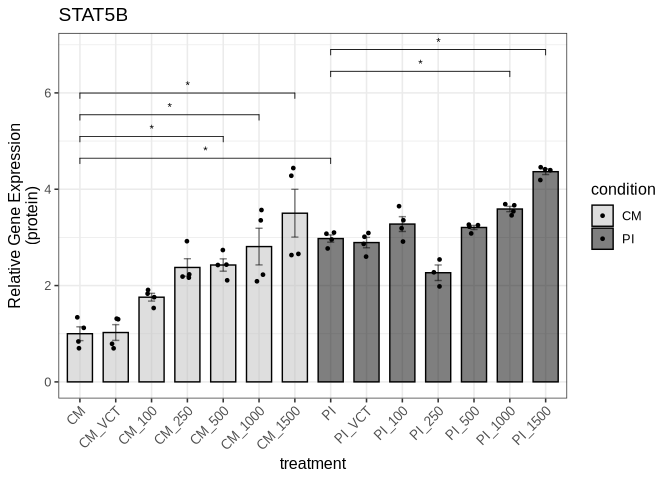

We save the figure to a PDF file in the Supplemental Figure 2 directory:

``` r
ggsave("output/Supplemental_Figure2/suppl_fig2d_stat5b_protein.pdf", suppl_fig2d, 
       width = 6, height = 6, dpi = 300, useDingbats=FALSE)
```

#### Supplemental Figure 2f (IL2 mRNA expression levels)

We do the same for IL2 mRNA expression levels (qPCR):

``` r
suppl2_il2_qpcr_data <- read_xlsx("input/Supplemental_Figure2_data.xlsx", sheet = "IL2_mRNA_new_data")
```

``` r
suppl2_il2_qpcr_result <- compare_qpcr_groups_with_ratio(
  suppl2_il2_qpcr_data,
  group_col = "treatment",
  actin_col = "actin",
  gene_col = "il2",
  ratio_col = "ratio",
  control_group = "CM"
)
```

``` r
suppl2_il2_qpcr_result$all_wilcox_table
```

<div id="byucsgiccm" style="padding-left:0px;padding-right:0px;padding-top:10px;padding-bottom:10px;overflow-x:auto;overflow-y:auto;width:auto;height:auto;">
<style>#byucsgiccm table {
  font-family: system-ui, 'Segoe UI', Roboto, Helvetica, Arial, sans-serif, 'Apple Color Emoji', 'Segoe UI Emoji', 'Segoe UI Symbol', 'Noto Color Emoji';
  -webkit-font-smoothing: antialiased;
  -moz-osx-font-smoothing: grayscale;
}

#byucsgiccm thead, #byucsgiccm tbody, #byucsgiccm tfoot, #byucsgiccm tr, #byucsgiccm td, #byucsgiccm th {
  border-style: none;
}

#byucsgiccm p {
  margin: 0;
  padding: 0;
}

#byucsgiccm .gt_table {
  display: table;
  border-collapse: collapse;
  line-height: normal;
  margin-left: auto;
  margin-right: auto;
  color: #333333;
  font-size: 16px;
  font-weight: normal;
  font-style: normal;
  background-color: #FFFFFF;
  width: auto;
  border-top-style: solid;
  border-top-width: 2px;
  border-top-color: #A8A8A8;
  border-right-style: none;
  border-right-width: 2px;
  border-right-color: #D3D3D3;
  border-bottom-style: solid;
  border-bottom-width: 2px;
  border-bottom-color: #A8A8A8;
  border-left-style: none;
  border-left-width: 2px;
  border-left-color: #D3D3D3;
}

#byucsgiccm .gt_caption {
  padding-top: 4px;
  padding-bottom: 4px;
}

#byucsgiccm .gt_title {
  color: #333333;
  font-size: 125%;
  font-weight: initial;
  padding-top: 4px;
  padding-bottom: 4px;
  padding-left: 5px;
  padding-right: 5px;
  border-bottom-color: #FFFFFF;
  border-bottom-width: 0;
}

#byucsgiccm .gt_subtitle {
  color: #333333;
  font-size: 85%;
  font-weight: initial;
  padding-top: 3px;
  padding-bottom: 5px;
  padding-left: 5px;
  padding-right: 5px;
  border-top-color: #FFFFFF;
  border-top-width: 0;
}

#byucsgiccm .gt_heading {
  background-color: #FFFFFF;
  text-align: center;
  border-bottom-color: #FFFFFF;
  border-left-style: none;
  border-left-width: 1px;
  border-left-color: #D3D3D3;
  border-right-style: none;
  border-right-width: 1px;
  border-right-color: #D3D3D3;
}

#byucsgiccm .gt_bottom_border {
  border-bottom-style: solid;
  border-bottom-width: 2px;
  border-bottom-color: #D3D3D3;
}

#byucsgiccm .gt_col_headings {
  border-top-style: solid;
  border-top-width: 2px;
  border-top-color: #D3D3D3;
  border-bottom-style: solid;
  border-bottom-width: 2px;
  border-bottom-color: #D3D3D3;
  border-left-style: none;
  border-left-width: 1px;
  border-left-color: #D3D3D3;
  border-right-style: none;
  border-right-width: 1px;
  border-right-color: #D3D3D3;
}

#byucsgiccm .gt_col_heading {
  color: #333333;
  background-color: #FFFFFF;
  font-size: 100%;
  font-weight: normal;
  text-transform: inherit;
  border-left-style: none;
  border-left-width: 1px;
  border-left-color: #D3D3D3;
  border-right-style: none;
  border-right-width: 1px;
  border-right-color: #D3D3D3;
  vertical-align: bottom;
  padding-top: 5px;
  padding-bottom: 6px;
  padding-left: 5px;
  padding-right: 5px;
  overflow-x: hidden;
}

#byucsgiccm .gt_column_spanner_outer {
  color: #333333;
  background-color: #FFFFFF;
  font-size: 100%;
  font-weight: normal;
  text-transform: inherit;
  padding-top: 0;
  padding-bottom: 0;
  padding-left: 4px;
  padding-right: 4px;
}

#byucsgiccm .gt_column_spanner_outer:first-child {
  padding-left: 0;
}

#byucsgiccm .gt_column_spanner_outer:last-child {
  padding-right: 0;
}

#byucsgiccm .gt_column_spanner {
  border-bottom-style: solid;
  border-bottom-width: 2px;
  border-bottom-color: #D3D3D3;
  vertical-align: bottom;
  padding-top: 5px;
  padding-bottom: 5px;
  overflow-x: hidden;
  display: inline-block;
  width: 100%;
}

#byucsgiccm .gt_spanner_row {
  border-bottom-style: hidden;
}

#byucsgiccm .gt_group_heading {
  padding-top: 8px;
  padding-bottom: 8px;
  padding-left: 5px;
  padding-right: 5px;
  color: #333333;
  background-color: #FFFFFF;
  font-size: 100%;
  font-weight: initial;
  text-transform: inherit;
  border-top-style: solid;
  border-top-width: 2px;
  border-top-color: #D3D3D3;
  border-bottom-style: solid;
  border-bottom-width: 2px;
  border-bottom-color: #D3D3D3;
  border-left-style: none;
  border-left-width: 1px;
  border-left-color: #D3D3D3;
  border-right-style: none;
  border-right-width: 1px;
  border-right-color: #D3D3D3;
  vertical-align: middle;
  text-align: left;
}

#byucsgiccm .gt_empty_group_heading {
  padding: 0.5px;
  color: #333333;
  background-color: #FFFFFF;
  font-size: 100%;
  font-weight: initial;
  border-top-style: solid;
  border-top-width: 2px;
  border-top-color: #D3D3D3;
  border-bottom-style: solid;
  border-bottom-width: 2px;
  border-bottom-color: #D3D3D3;
  vertical-align: middle;
}

#byucsgiccm .gt_from_md > :first-child {
  margin-top: 0;
}

#byucsgiccm .gt_from_md > :last-child {
  margin-bottom: 0;
}

#byucsgiccm .gt_row {
  padding-top: 8px;
  padding-bottom: 8px;
  padding-left: 5px;
  padding-right: 5px;
  margin: 10px;
  border-top-style: solid;
  border-top-width: 1px;
  border-top-color: #D3D3D3;
  border-left-style: none;
  border-left-width: 1px;
  border-left-color: #D3D3D3;
  border-right-style: none;
  border-right-width: 1px;
  border-right-color: #D3D3D3;
  vertical-align: middle;
  overflow-x: hidden;
}

#byucsgiccm .gt_stub {
  color: #333333;
  background-color: #FFFFFF;
  font-size: 100%;
  font-weight: initial;
  text-transform: inherit;
  border-right-style: solid;
  border-right-width: 2px;
  border-right-color: #D3D3D3;
  padding-left: 5px;
  padding-right: 5px;
}

#byucsgiccm .gt_stub_row_group {
  color: #333333;
  background-color: #FFFFFF;
  font-size: 100%;
  font-weight: initial;
  text-transform: inherit;
  border-right-style: solid;
  border-right-width: 2px;
  border-right-color: #D3D3D3;
  padding-left: 5px;
  padding-right: 5px;
  vertical-align: top;
}

#byucsgiccm .gt_row_group_first td {
  border-top-width: 2px;
}

#byucsgiccm .gt_row_group_first th {
  border-top-width: 2px;
}

#byucsgiccm .gt_summary_row {
  color: #333333;
  background-color: #FFFFFF;
  text-transform: inherit;
  padding-top: 8px;
  padding-bottom: 8px;
  padding-left: 5px;
  padding-right: 5px;
}

#byucsgiccm .gt_first_summary_row {
  border-top-style: solid;
  border-top-color: #D3D3D3;
}

#byucsgiccm .gt_first_summary_row.thick {
  border-top-width: 2px;
}

#byucsgiccm .gt_last_summary_row {
  padding-top: 8px;
  padding-bottom: 8px;
  padding-left: 5px;
  padding-right: 5px;
  border-bottom-style: solid;
  border-bottom-width: 2px;
  border-bottom-color: #D3D3D3;
}

#byucsgiccm .gt_grand_summary_row {
  color: #333333;
  background-color: #FFFFFF;
  text-transform: inherit;
  padding-top: 8px;
  padding-bottom: 8px;
  padding-left: 5px;
  padding-right: 5px;
}

#byucsgiccm .gt_first_grand_summary_row {
  padding-top: 8px;
  padding-bottom: 8px;
  padding-left: 5px;
  padding-right: 5px;
  border-top-style: double;
  border-top-width: 6px;
  border-top-color: #D3D3D3;
}

#byucsgiccm .gt_last_grand_summary_row_top {
  padding-top: 8px;
  padding-bottom: 8px;
  padding-left: 5px;
  padding-right: 5px;
  border-bottom-style: double;
  border-bottom-width: 6px;
  border-bottom-color: #D3D3D3;
}

#byucsgiccm .gt_striped {
  background-color: rgba(128, 128, 128, 0.05);
}

#byucsgiccm .gt_table_body {
  border-top-style: solid;
  border-top-width: 2px;
  border-top-color: #D3D3D3;
  border-bottom-style: solid;
  border-bottom-width: 2px;
  border-bottom-color: #D3D3D3;
}

#byucsgiccm .gt_footnotes {
  color: #333333;
  background-color: #FFFFFF;
  border-bottom-style: none;
  border-bottom-width: 2px;
  border-bottom-color: #D3D3D3;
  border-left-style: none;
  border-left-width: 2px;
  border-left-color: #D3D3D3;
  border-right-style: none;
  border-right-width: 2px;
  border-right-color: #D3D3D3;
}

#byucsgiccm .gt_footnote {
  margin: 0px;
  font-size: 90%;
  padding-top: 4px;
  padding-bottom: 4px;
  padding-left: 5px;
  padding-right: 5px;
}

#byucsgiccm .gt_sourcenotes {
  color: #333333;
  background-color: #FFFFFF;
  border-bottom-style: none;
  border-bottom-width: 2px;
  border-bottom-color: #D3D3D3;
  border-left-style: none;
  border-left-width: 2px;
  border-left-color: #D3D3D3;
  border-right-style: none;
  border-right-width: 2px;
  border-right-color: #D3D3D3;
}

#byucsgiccm .gt_sourcenote {
  font-size: 90%;
  padding-top: 4px;
  padding-bottom: 4px;
  padding-left: 5px;
  padding-right: 5px;
}

#byucsgiccm .gt_left {
  text-align: left;
}

#byucsgiccm .gt_center {
  text-align: center;
}

#byucsgiccm .gt_right {
  text-align: right;
  font-variant-numeric: tabular-nums;
}

#byucsgiccm .gt_font_normal {
  font-weight: normal;
}

#byucsgiccm .gt_font_bold {
  font-weight: bold;
}

#byucsgiccm .gt_font_italic {
  font-style: italic;
}

#byucsgiccm .gt_super {
  font-size: 65%;
}

#byucsgiccm .gt_footnote_marks {
  font-size: 75%;
  vertical-align: 0.4em;
  position: initial;
}

#byucsgiccm .gt_asterisk {
  font-size: 100%;
  vertical-align: 0;
}

#byucsgiccm .gt_indent_1 {
  text-indent: 5px;
}

#byucsgiccm .gt_indent_2 {
  text-indent: 10px;
}

#byucsgiccm .gt_indent_3 {
  text-indent: 15px;
}

#byucsgiccm .gt_indent_4 {
  text-indent: 20px;
}

#byucsgiccm .gt_indent_5 {
  text-indent: 25px;
}
</style>
<table class="gt_table" data-quarto-disable-processing="false" data-quarto-bootstrap="false">
  <thead>
    <tr class="gt_col_headings">
      <th class="gt_col_heading gt_columns_bottom_border gt_left" rowspan="1" colspan="1" scope="col" id="Comparison">Comparison</th>
      <th class="gt_col_heading gt_columns_bottom_border gt_right" rowspan="1" colspan="1" scope="col" id="Statistic">Statistic</th>
      <th class="gt_col_heading gt_columns_bottom_border gt_right" rowspan="1" colspan="1" scope="col" id="P_value">P_value</th>
      <th class="gt_col_heading gt_columns_bottom_border gt_left" rowspan="1" colspan="1" scope="col" id="Significant">Significant</th>
    </tr>
  </thead>
  <tbody class="gt_table_body">
    <tr><td headers="Comparison" class="gt_row gt_left">CM vs PI</td>
<td headers="Statistic" class="gt_row gt_right">0</td>
<td headers="P_value" class="gt_row gt_right">0.1000</td>
<td headers="Significant" class="gt_row gt_left">No</td></tr>
    <tr><td headers="Comparison" class="gt_row gt_left">CM vs PI_VCT</td>
<td headers="Statistic" class="gt_row gt_right">0</td>
<td headers="P_value" class="gt_row gt_right">0.1000</td>
<td headers="Significant" class="gt_row gt_left">No</td></tr>
    <tr><td headers="Comparison" class="gt_row gt_left">CM vs PI_100</td>
<td headers="Statistic" class="gt_row gt_right">0</td>
<td headers="P_value" class="gt_row gt_right">0.1000</td>
<td headers="Significant" class="gt_row gt_left">No</td></tr>
    <tr><td headers="Comparison" class="gt_row gt_left">CM vs PI_250</td>
<td headers="Statistic" class="gt_row gt_right">0</td>
<td headers="P_value" class="gt_row gt_right">0.1000</td>
<td headers="Significant" class="gt_row gt_left">No</td></tr>
    <tr><td headers="Comparison" class="gt_row gt_left">CM vs PI_500</td>
<td headers="Statistic" class="gt_row gt_right">0</td>
<td headers="P_value" class="gt_row gt_right">0.1000</td>
<td headers="Significant" class="gt_row gt_left">No</td></tr>
    <tr><td headers="Comparison" class="gt_row gt_left">CM vs PI_1000</td>
<td headers="Statistic" class="gt_row gt_right">0</td>
<td headers="P_value" class="gt_row gt_right">0.1000</td>
<td headers="Significant" class="gt_row gt_left">No</td></tr>
    <tr><td headers="Comparison" class="gt_row gt_left">CM vs PI_1500</td>
<td headers="Statistic" class="gt_row gt_right">0</td>
<td headers="P_value" class="gt_row gt_right">0.1000</td>
<td headers="Significant" class="gt_row gt_left">No</td></tr>
    <tr><td headers="Comparison" class="gt_row gt_left">PI vs PI_VCT</td>
<td headers="Statistic" class="gt_row gt_right">3</td>
<td headers="P_value" class="gt_row gt_right">0.7000</td>
<td headers="Significant" class="gt_row gt_left">No</td></tr>
    <tr><td headers="Comparison" class="gt_row gt_left">PI vs PI_100</td>
<td headers="Statistic" class="gt_row gt_right">4</td>
<td headers="P_value" class="gt_row gt_right">1.0000</td>
<td headers="Significant" class="gt_row gt_left">No</td></tr>
    <tr><td headers="Comparison" class="gt_row gt_left">PI vs PI_250</td>
<td headers="Statistic" class="gt_row gt_right">9</td>
<td headers="P_value" class="gt_row gt_right">0.1000</td>
<td headers="Significant" class="gt_row gt_left">No</td></tr>
    <tr><td headers="Comparison" class="gt_row gt_left">PI vs PI_500</td>
<td headers="Statistic" class="gt_row gt_right">9</td>
<td headers="P_value" class="gt_row gt_right">0.1000</td>
<td headers="Significant" class="gt_row gt_left">No</td></tr>
    <tr><td headers="Comparison" class="gt_row gt_left">PI vs PI_1000</td>
<td headers="Statistic" class="gt_row gt_right">9</td>
<td headers="P_value" class="gt_row gt_right">0.1000</td>
<td headers="Significant" class="gt_row gt_left">No</td></tr>
    <tr><td headers="Comparison" class="gt_row gt_left">PI vs PI_1500</td>
<td headers="Statistic" class="gt_row gt_right">9</td>
<td headers="P_value" class="gt_row gt_right">0.1000</td>
<td headers="Significant" class="gt_row gt_left">No</td></tr>
    <tr><td headers="Comparison" class="gt_row gt_left">PI_VCT vs PI_100</td>
<td headers="Statistic" class="gt_row gt_right">5</td>
<td headers="P_value" class="gt_row gt_right">1.0000</td>
<td headers="Significant" class="gt_row gt_left">No</td></tr>
    <tr><td headers="Comparison" class="gt_row gt_left">PI_VCT vs PI_250</td>
<td headers="Statistic" class="gt_row gt_right">9</td>
<td headers="P_value" class="gt_row gt_right">0.1000</td>
<td headers="Significant" class="gt_row gt_left">No</td></tr>
    <tr><td headers="Comparison" class="gt_row gt_left">PI_VCT vs PI_500</td>
<td headers="Statistic" class="gt_row gt_right">9</td>
<td headers="P_value" class="gt_row gt_right">0.1000</td>
<td headers="Significant" class="gt_row gt_left">No</td></tr>
    <tr><td headers="Comparison" class="gt_row gt_left">PI_VCT vs PI_1000</td>
<td headers="Statistic" class="gt_row gt_right">9</td>
<td headers="P_value" class="gt_row gt_right">0.1000</td>
<td headers="Significant" class="gt_row gt_left">No</td></tr>
    <tr><td headers="Comparison" class="gt_row gt_left">PI_VCT vs PI_1500</td>
<td headers="Statistic" class="gt_row gt_right">9</td>
<td headers="P_value" class="gt_row gt_right">0.1000</td>
<td headers="Significant" class="gt_row gt_left">No</td></tr>
    <tr><td headers="Comparison" class="gt_row gt_left">PI_100 vs PI_250</td>
<td headers="Statistic" class="gt_row gt_right">9</td>
<td headers="P_value" class="gt_row gt_right">0.1000</td>
<td headers="Significant" class="gt_row gt_left">No</td></tr>
    <tr><td headers="Comparison" class="gt_row gt_left">PI_100 vs PI_500</td>
<td headers="Statistic" class="gt_row gt_right">9</td>
<td headers="P_value" class="gt_row gt_right">0.1000</td>
<td headers="Significant" class="gt_row gt_left">No</td></tr>
    <tr><td headers="Comparison" class="gt_row gt_left">PI_100 vs PI_1000</td>
<td headers="Statistic" class="gt_row gt_right">9</td>
<td headers="P_value" class="gt_row gt_right">0.1000</td>
<td headers="Significant" class="gt_row gt_left">No</td></tr>
    <tr><td headers="Comparison" class="gt_row gt_left">PI_100 vs PI_1500</td>
<td headers="Statistic" class="gt_row gt_right">9</td>
<td headers="P_value" class="gt_row gt_right">0.1000</td>
<td headers="Significant" class="gt_row gt_left">No</td></tr>
    <tr><td headers="Comparison" class="gt_row gt_left">PI_250 vs PI_500</td>
<td headers="Statistic" class="gt_row gt_right">2</td>
<td headers="P_value" class="gt_row gt_right">0.4000</td>
<td headers="Significant" class="gt_row gt_left">No</td></tr>
    <tr><td headers="Comparison" class="gt_row gt_left">PI_250 vs PI_1000</td>
<td headers="Statistic" class="gt_row gt_right">8</td>
<td headers="P_value" class="gt_row gt_right">0.2000</td>
<td headers="Significant" class="gt_row gt_left">No</td></tr>
    <tr><td headers="Comparison" class="gt_row gt_left">PI_250 vs PI_1500</td>
<td headers="Statistic" class="gt_row gt_right">9</td>
<td headers="P_value" class="gt_row gt_right">0.1000</td>
<td headers="Significant" class="gt_row gt_left">No</td></tr>
    <tr><td headers="Comparison" class="gt_row gt_left">PI_500 vs PI_1000</td>
<td headers="Statistic" class="gt_row gt_right">9</td>
<td headers="P_value" class="gt_row gt_right">0.1000</td>
<td headers="Significant" class="gt_row gt_left">No</td></tr>
    <tr><td headers="Comparison" class="gt_row gt_left">PI_500 vs PI_1500</td>
<td headers="Statistic" class="gt_row gt_right">9</td>
<td headers="P_value" class="gt_row gt_right">0.1000</td>
<td headers="Significant" class="gt_row gt_left">No</td></tr>
    <tr><td headers="Comparison" class="gt_row gt_left">PI_1000 vs PI_1500</td>
<td headers="Statistic" class="gt_row gt_right">8</td>
<td headers="P_value" class="gt_row gt_right">0.2000</td>
<td headers="Significant" class="gt_row gt_left">No</td></tr>
  </tbody>
  
  
</table>
</div>

``` r
suppl_fig2f <- suppl2_il2_qpcr_result$p
```

``` r
suppl_fig2f
```

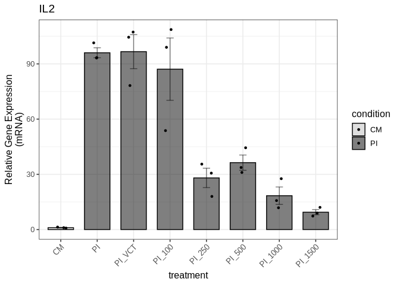

We save the figure to a PDF file in the Supplemental Figure 2 directory:

``` r
ggsave("output/Supplemental_Figure2/suppl_fig2f_il2_qpcr.pdf", suppl_fig2f, 
       width = 6, height = 6, dpi = 300, useDingbats=FALSE)
```

We create the composite Supplemental Figure 2:

``` r
composite_suppl2 <- plot_grid(suppl_fig2a, suppl_fig2b, suppl_fig2d, suppl_fig2f, 
                              ncol = 2, nrow = 2, 
                              labels = c("A", "B", "D", "F"), 
                              label_size = 12, 
                              align = "v")
```

We save the composite Supplemental Figure 2:

``` r
ggsave("output/Supplemental_Figure2/composite_suppl_fig2.pdf", composite_suppl2, 
       width = 8, height = 10, dpi = 300)
```

### Supplemental Figure 3

#### Supplemental Figure 3a (STAT3 protein levels)

We import the data for STAT3 protein levels from the Western blot
experiment:

``` r
suppl3_stat3_protein_data <- read_xlsx("input/Supplemental_Figure3_data.xlsx", sheet = "STAT3_protein")
```

We compare the STAT3 protein levels between the two conditions:

``` r
suppl3_stat3_protein_result <- compare_protein_groups(
  suppl3_stat3_protein_data,
  group_col = "treatment",
  gene_col = "stat3",
  actin_col = "actin",
  control_group = "CM",
  wilcox_pairs = list(c("CM", "PI"))
)
```

``` r
suppl3_stat3_protein_result$all_wilcox_table
```

<div id="vkvrvdjvme" style="padding-left:0px;padding-right:0px;padding-top:10px;padding-bottom:10px;overflow-x:auto;overflow-y:auto;width:auto;height:auto;">
<style>#vkvrvdjvme table {
  font-family: system-ui, 'Segoe UI', Roboto, Helvetica, Arial, sans-serif, 'Apple Color Emoji', 'Segoe UI Emoji', 'Segoe UI Symbol', 'Noto Color Emoji';
  -webkit-font-smoothing: antialiased;
  -moz-osx-font-smoothing: grayscale;
}

#vkvrvdjvme thead, #vkvrvdjvme tbody, #vkvrvdjvme tfoot, #vkvrvdjvme tr, #vkvrvdjvme td, #vkvrvdjvme th {
  border-style: none;
}

#vkvrvdjvme p {
  margin: 0;
  padding: 0;
}

#vkvrvdjvme .gt_table {
  display: table;
  border-collapse: collapse;
  line-height: normal;
  margin-left: auto;
  margin-right: auto;
  color: #333333;
  font-size: 16px;
  font-weight: normal;
  font-style: normal;
  background-color: #FFFFFF;
  width: auto;
  border-top-style: solid;
  border-top-width: 2px;
  border-top-color: #A8A8A8;
  border-right-style: none;
  border-right-width: 2px;
  border-right-color: #D3D3D3;
  border-bottom-style: solid;
  border-bottom-width: 2px;
  border-bottom-color: #A8A8A8;
  border-left-style: none;
  border-left-width: 2px;
  border-left-color: #D3D3D3;
}

#vkvrvdjvme .gt_caption {
  padding-top: 4px;
  padding-bottom: 4px;
}

#vkvrvdjvme .gt_title {
  color: #333333;
  font-size: 125%;
  font-weight: initial;
  padding-top: 4px;
  padding-bottom: 4px;
  padding-left: 5px;
  padding-right: 5px;
  border-bottom-color: #FFFFFF;
  border-bottom-width: 0;
}

#vkvrvdjvme .gt_subtitle {
  color: #333333;
  font-size: 85%;
  font-weight: initial;
  padding-top: 3px;
  padding-bottom: 5px;
  padding-left: 5px;
  padding-right: 5px;
  border-top-color: #FFFFFF;
  border-top-width: 0;
}

#vkvrvdjvme .gt_heading {
  background-color: #FFFFFF;
  text-align: center;
  border-bottom-color: #FFFFFF;
  border-left-style: none;
  border-left-width: 1px;
  border-left-color: #D3D3D3;
  border-right-style: none;
  border-right-width: 1px;
  border-right-color: #D3D3D3;
}

#vkvrvdjvme .gt_bottom_border {
  border-bottom-style: solid;
  border-bottom-width: 2px;
  border-bottom-color: #D3D3D3;
}

#vkvrvdjvme .gt_col_headings {
  border-top-style: solid;
  border-top-width: 2px;
  border-top-color: #D3D3D3;
  border-bottom-style: solid;
  border-bottom-width: 2px;
  border-bottom-color: #D3D3D3;
  border-left-style: none;
  border-left-width: 1px;
  border-left-color: #D3D3D3;
  border-right-style: none;
  border-right-width: 1px;
  border-right-color: #D3D3D3;
}

#vkvrvdjvme .gt_col_heading {
  color: #333333;
  background-color: #FFFFFF;
  font-size: 100%;
  font-weight: normal;
  text-transform: inherit;
  border-left-style: none;
  border-left-width: 1px;
  border-left-color: #D3D3D3;
  border-right-style: none;
  border-right-width: 1px;
  border-right-color: #D3D3D3;
  vertical-align: bottom;
  padding-top: 5px;
  padding-bottom: 6px;
  padding-left: 5px;
  padding-right: 5px;
  overflow-x: hidden;
}

#vkvrvdjvme .gt_column_spanner_outer {
  color: #333333;
  background-color: #FFFFFF;
  font-size: 100%;
  font-weight: normal;
  text-transform: inherit;
  padding-top: 0;
  padding-bottom: 0;
  padding-left: 4px;
  padding-right: 4px;
}

#vkvrvdjvme .gt_column_spanner_outer:first-child {
  padding-left: 0;
}

#vkvrvdjvme .gt_column_spanner_outer:last-child {
  padding-right: 0;
}

#vkvrvdjvme .gt_column_spanner {
  border-bottom-style: solid;
  border-bottom-width: 2px;
  border-bottom-color: #D3D3D3;
  vertical-align: bottom;
  padding-top: 5px;
  padding-bottom: 5px;
  overflow-x: hidden;
  display: inline-block;
  width: 100%;
}

#vkvrvdjvme .gt_spanner_row {
  border-bottom-style: hidden;
}

#vkvrvdjvme .gt_group_heading {
  padding-top: 8px;
  padding-bottom: 8px;
  padding-left: 5px;
  padding-right: 5px;
  color: #333333;
  background-color: #FFFFFF;
  font-size: 100%;
  font-weight: initial;
  text-transform: inherit;
  border-top-style: solid;
  border-top-width: 2px;
  border-top-color: #D3D3D3;
  border-bottom-style: solid;
  border-bottom-width: 2px;
  border-bottom-color: #D3D3D3;
  border-left-style: none;
  border-left-width: 1px;
  border-left-color: #D3D3D3;
  border-right-style: none;
  border-right-width: 1px;
  border-right-color: #D3D3D3;
  vertical-align: middle;
  text-align: left;
}

#vkvrvdjvme .gt_empty_group_heading {
  padding: 0.5px;
  color: #333333;
  background-color: #FFFFFF;
  font-size: 100%;
  font-weight: initial;
  border-top-style: solid;
  border-top-width: 2px;
  border-top-color: #D3D3D3;
  border-bottom-style: solid;
  border-bottom-width: 2px;
  border-bottom-color: #D3D3D3;
  vertical-align: middle;
}

#vkvrvdjvme .gt_from_md > :first-child {
  margin-top: 0;
}

#vkvrvdjvme .gt_from_md > :last-child {
  margin-bottom: 0;
}

#vkvrvdjvme .gt_row {
  padding-top: 8px;
  padding-bottom: 8px;
  padding-left: 5px;
  padding-right: 5px;
  margin: 10px;
  border-top-style: solid;
  border-top-width: 1px;
  border-top-color: #D3D3D3;
  border-left-style: none;
  border-left-width: 1px;
  border-left-color: #D3D3D3;
  border-right-style: none;
  border-right-width: 1px;
  border-right-color: #D3D3D3;
  vertical-align: middle;
  overflow-x: hidden;
}

#vkvrvdjvme .gt_stub {
  color: #333333;
  background-color: #FFFFFF;
  font-size: 100%;
  font-weight: initial;
  text-transform: inherit;
  border-right-style: solid;
  border-right-width: 2px;
  border-right-color: #D3D3D3;
  padding-left: 5px;
  padding-right: 5px;
}

#vkvrvdjvme .gt_stub_row_group {
  color: #333333;
  background-color: #FFFFFF;
  font-size: 100%;
  font-weight: initial;
  text-transform: inherit;
  border-right-style: solid;
  border-right-width: 2px;
  border-right-color: #D3D3D3;
  padding-left: 5px;
  padding-right: 5px;
  vertical-align: top;
}

#vkvrvdjvme .gt_row_group_first td {
  border-top-width: 2px;
}

#vkvrvdjvme .gt_row_group_first th {
  border-top-width: 2px;
}

#vkvrvdjvme .gt_summary_row {
  color: #333333;
  background-color: #FFFFFF;
  text-transform: inherit;
  padding-top: 8px;
  padding-bottom: 8px;
  padding-left: 5px;
  padding-right: 5px;
}

#vkvrvdjvme .gt_first_summary_row {
  border-top-style: solid;
  border-top-color: #D3D3D3;
}

#vkvrvdjvme .gt_first_summary_row.thick {
  border-top-width: 2px;
}

#vkvrvdjvme .gt_last_summary_row {
  padding-top: 8px;
  padding-bottom: 8px;
  padding-left: 5px;
  padding-right: 5px;
  border-bottom-style: solid;
  border-bottom-width: 2px;
  border-bottom-color: #D3D3D3;
}

#vkvrvdjvme .gt_grand_summary_row {
  color: #333333;
  background-color: #FFFFFF;
  text-transform: inherit;
  padding-top: 8px;
  padding-bottom: 8px;
  padding-left: 5px;
  padding-right: 5px;
}

#vkvrvdjvme .gt_first_grand_summary_row {
  padding-top: 8px;
  padding-bottom: 8px;
  padding-left: 5px;
  padding-right: 5px;
  border-top-style: double;
  border-top-width: 6px;
  border-top-color: #D3D3D3;
}

#vkvrvdjvme .gt_last_grand_summary_row_top {
  padding-top: 8px;
  padding-bottom: 8px;
  padding-left: 5px;
  padding-right: 5px;
  border-bottom-style: double;
  border-bottom-width: 6px;
  border-bottom-color: #D3D3D3;
}

#vkvrvdjvme .gt_striped {
  background-color: rgba(128, 128, 128, 0.05);
}

#vkvrvdjvme .gt_table_body {
  border-top-style: solid;
  border-top-width: 2px;
  border-top-color: #D3D3D3;
  border-bottom-style: solid;
  border-bottom-width: 2px;
  border-bottom-color: #D3D3D3;
}

#vkvrvdjvme .gt_footnotes {
  color: #333333;
  background-color: #FFFFFF;
  border-bottom-style: none;
  border-bottom-width: 2px;
  border-bottom-color: #D3D3D3;
  border-left-style: none;
  border-left-width: 2px;
  border-left-color: #D3D3D3;
  border-right-style: none;
  border-right-width: 2px;
  border-right-color: #D3D3D3;
}

#vkvrvdjvme .gt_footnote {
  margin: 0px;
  font-size: 90%;
  padding-top: 4px;
  padding-bottom: 4px;
  padding-left: 5px;
  padding-right: 5px;
}

#vkvrvdjvme .gt_sourcenotes {
  color: #333333;
  background-color: #FFFFFF;
  border-bottom-style: none;
  border-bottom-width: 2px;
  border-bottom-color: #D3D3D3;
  border-left-style: none;
  border-left-width: 2px;
  border-left-color: #D3D3D3;
  border-right-style: none;
  border-right-width: 2px;
  border-right-color: #D3D3D3;
}

#vkvrvdjvme .gt_sourcenote {
  font-size: 90%;
  padding-top: 4px;
  padding-bottom: 4px;
  padding-left: 5px;
  padding-right: 5px;
}

#vkvrvdjvme .gt_left {
  text-align: left;
}

#vkvrvdjvme .gt_center {
  text-align: center;
}

#vkvrvdjvme .gt_right {
  text-align: right;
  font-variant-numeric: tabular-nums;
}

#vkvrvdjvme .gt_font_normal {
  font-weight: normal;
}

#vkvrvdjvme .gt_font_bold {
  font-weight: bold;
}

#vkvrvdjvme .gt_font_italic {
  font-style: italic;
}

#vkvrvdjvme .gt_super {
  font-size: 65%;
}

#vkvrvdjvme .gt_footnote_marks {
  font-size: 75%;
  vertical-align: 0.4em;
  position: initial;
}

#vkvrvdjvme .gt_asterisk {
  font-size: 100%;
  vertical-align: 0;
}

#vkvrvdjvme .gt_indent_1 {
  text-indent: 5px;
}

#vkvrvdjvme .gt_indent_2 {
  text-indent: 10px;
}

#vkvrvdjvme .gt_indent_3 {
  text-indent: 15px;
}

#vkvrvdjvme .gt_indent_4 {
  text-indent: 20px;
}

#vkvrvdjvme .gt_indent_5 {
  text-indent: 25px;
}
</style>
<table class="gt_table" data-quarto-disable-processing="false" data-quarto-bootstrap="false">
  <thead>
    <tr class="gt_col_headings">
      <th class="gt_col_heading gt_columns_bottom_border gt_left" rowspan="1" colspan="1" scope="col" id="Comparison">Comparison</th>
      <th class="gt_col_heading gt_columns_bottom_border gt_right" rowspan="1" colspan="1" scope="col" id="Statistic">Statistic</th>
      <th class="gt_col_heading gt_columns_bottom_border gt_right" rowspan="1" colspan="1" scope="col" id="P_value">P_value</th>
      <th class="gt_col_heading gt_columns_bottom_border gt_left" rowspan="1" colspan="1" scope="col" id="Significant">Significant</th>
    </tr>
  </thead>
  <tbody class="gt_table_body">
    <tr><td headers="Comparison" class="gt_row gt_left" style="background-color: rgba(204,230,255,0.8); color: #000000; font-weight: bold;">CM vs PI</td>
<td headers="Statistic" class="gt_row gt_right" style="background-color: rgba(204,230,255,0.8); color: #000000; font-weight: bold;">0</td>
<td headers="P_value" class="gt_row gt_right" style="background-color: rgba(204,230,255,0.8); color: #000000; font-weight: bold;">0.0286</td>
<td headers="Significant" class="gt_row gt_left" style="background-color: rgba(204,230,255,0.8); color: #000000; font-weight: bold;">Yes</td></tr>
  </tbody>
  
  
</table>
</div>

``` r
suppl_fig3a <- suppl3_stat3_protein_result$p
```

``` r
suppl_fig3a
```


We save the figure to a PDF file in the Supplemental Figure 3 directory:

``` r
ggsave("output/Supplemental_Figure3/suppl_fig3a_stat3_protein.pdf", suppl_fig3a, 
       width = 3, height = 6, dpi = 300, useDingbats=FALSE)
```

#### Supplemental Figure 3b (phosphorylated STAT3 protein levels)

We do the same for the levels of phosphorylated STAT3 (pSTAT3):

``` r
suppl3_phospho_stat3_protein_data <- read_xlsx("input/Supplemental_Figure3_data.xlsx", sheet = "STAT3p_protein")
```

``` r
suppl3_phospho_stat3_protein_result <- compare_protein_groups(
  suppl3_phospho_stat3_protein_data,
  group_col = "treatment",
  gene_col = "stat3p",
  actin_col = "actin",
  control_group = "CM",
  wilcox_pairs = list(c("CM", "PI"))
)
```

``` r
suppl3_phospho_stat3_protein_result$all_wilcox_table
```

<div id="tjralkuvkc" style="padding-left:0px;padding-right:0px;padding-top:10px;padding-bottom:10px;overflow-x:auto;overflow-y:auto;width:auto;height:auto;">
<style>#tjralkuvkc table {
  font-family: system-ui, 'Segoe UI', Roboto, Helvetica, Arial, sans-serif, 'Apple Color Emoji', 'Segoe UI Emoji', 'Segoe UI Symbol', 'Noto Color Emoji';
  -webkit-font-smoothing: antialiased;
  -moz-osx-font-smoothing: grayscale;
}

#tjralkuvkc thead, #tjralkuvkc tbody, #tjralkuvkc tfoot, #tjralkuvkc tr, #tjralkuvkc td, #tjralkuvkc th {
  border-style: none;
}

#tjralkuvkc p {
  margin: 0;
  padding: 0;
}

#tjralkuvkc .gt_table {
  display: table;
  border-collapse: collapse;
  line-height: normal;
  margin-left: auto;
  margin-right: auto;
  color: #333333;
  font-size: 16px;
  font-weight: normal;
  font-style: normal;
  background-color: #FFFFFF;
  width: auto;
  border-top-style: solid;
  border-top-width: 2px;
  border-top-color: #A8A8A8;
  border-right-style: none;
  border-right-width: 2px;
  border-right-color: #D3D3D3;
  border-bottom-style: solid;
  border-bottom-width: 2px;
  border-bottom-color: #A8A8A8;
  border-left-style: none;
  border-left-width: 2px;
  border-left-color: #D3D3D3;
}

#tjralkuvkc .gt_caption {
  padding-top: 4px;
  padding-bottom: 4px;
}

#tjralkuvkc .gt_title {
  color: #333333;
  font-size: 125%;
  font-weight: initial;
  padding-top: 4px;
  padding-bottom: 4px;
  padding-left: 5px;
  padding-right: 5px;
  border-bottom-color: #FFFFFF;
  border-bottom-width: 0;
}

#tjralkuvkc .gt_subtitle {
  color: #333333;
  font-size: 85%;
  font-weight: initial;
  padding-top: 3px;
  padding-bottom: 5px;
  padding-left: 5px;
  padding-right: 5px;
  border-top-color: #FFFFFF;
  border-top-width: 0;
}

#tjralkuvkc .gt_heading {
  background-color: #FFFFFF;
  text-align: center;
  border-bottom-color: #FFFFFF;
  border-left-style: none;
  border-left-width: 1px;
  border-left-color: #D3D3D3;
  border-right-style: none;
  border-right-width: 1px;
  border-right-color: #D3D3D3;
}

#tjralkuvkc .gt_bottom_border {
  border-bottom-style: solid;
  border-bottom-width: 2px;
  border-bottom-color: #D3D3D3;
}

#tjralkuvkc .gt_col_headings {
  border-top-style: solid;
  border-top-width: 2px;
  border-top-color: #D3D3D3;
  border-bottom-style: solid;
  border-bottom-width: 2px;
  border-bottom-color: #D3D3D3;
  border-left-style: none;
  border-left-width: 1px;
  border-left-color: #D3D3D3;
  border-right-style: none;
  border-right-width: 1px;
  border-right-color: #D3D3D3;
}

#tjralkuvkc .gt_col_heading {
  color: #333333;
  background-color: #FFFFFF;
  font-size: 100%;
  font-weight: normal;
  text-transform: inherit;
  border-left-style: none;
  border-left-width: 1px;
  border-left-color: #D3D3D3;
  border-right-style: none;
  border-right-width: 1px;
  border-right-color: #D3D3D3;
  vertical-align: bottom;
  padding-top: 5px;
  padding-bottom: 6px;
  padding-left: 5px;
  padding-right: 5px;
  overflow-x: hidden;
}

#tjralkuvkc .gt_column_spanner_outer {
  color: #333333;
  background-color: #FFFFFF;
  font-size: 100%;
  font-weight: normal;
  text-transform: inherit;
  padding-top: 0;
  padding-bottom: 0;
  padding-left: 4px;
  padding-right: 4px;
}

#tjralkuvkc .gt_column_spanner_outer:first-child {
  padding-left: 0;
}

#tjralkuvkc .gt_column_spanner_outer:last-child {
  padding-right: 0;
}

#tjralkuvkc .gt_column_spanner {
  border-bottom-style: solid;
  border-bottom-width: 2px;
  border-bottom-color: #D3D3D3;
  vertical-align: bottom;
  padding-top: 5px;
  padding-bottom: 5px;
  overflow-x: hidden;
  display: inline-block;
  width: 100%;
}

#tjralkuvkc .gt_spanner_row {
  border-bottom-style: hidden;
}

#tjralkuvkc .gt_group_heading {
  padding-top: 8px;
  padding-bottom: 8px;
  padding-left: 5px;
  padding-right: 5px;
  color: #333333;
  background-color: #FFFFFF;
  font-size: 100%;
  font-weight: initial;
  text-transform: inherit;
  border-top-style: solid;
  border-top-width: 2px;
  border-top-color: #D3D3D3;
  border-bottom-style: solid;
  border-bottom-width: 2px;
  border-bottom-color: #D3D3D3;
  border-left-style: none;
  border-left-width: 1px;
  border-left-color: #D3D3D3;
  border-right-style: none;
  border-right-width: 1px;
  border-right-color: #D3D3D3;
  vertical-align: middle;
  text-align: left;
}

#tjralkuvkc .gt_empty_group_heading {
  padding: 0.5px;
  color: #333333;
  background-color: #FFFFFF;
  font-size: 100%;
  font-weight: initial;
  border-top-style: solid;
  border-top-width: 2px;
  border-top-color: #D3D3D3;
  border-bottom-style: solid;
  border-bottom-width: 2px;
  border-bottom-color: #D3D3D3;
  vertical-align: middle;
}

#tjralkuvkc .gt_from_md > :first-child {
  margin-top: 0;
}

#tjralkuvkc .gt_from_md > :last-child {
  margin-bottom: 0;
}

#tjralkuvkc .gt_row {
  padding-top: 8px;
  padding-bottom: 8px;
  padding-left: 5px;
  padding-right: 5px;
  margin: 10px;
  border-top-style: solid;
  border-top-width: 1px;
  border-top-color: #D3D3D3;
  border-left-style: none;
  border-left-width: 1px;
  border-left-color: #D3D3D3;
  border-right-style: none;
  border-right-width: 1px;
  border-right-color: #D3D3D3;
  vertical-align: middle;
  overflow-x: hidden;
}

#tjralkuvkc .gt_stub {
  color: #333333;
  background-color: #FFFFFF;
  font-size: 100%;
  font-weight: initial;
  text-transform: inherit;
  border-right-style: solid;
  border-right-width: 2px;
  border-right-color: #D3D3D3;
  padding-left: 5px;
  padding-right: 5px;
}

#tjralkuvkc .gt_stub_row_group {
  color: #333333;
  background-color: #FFFFFF;
  font-size: 100%;
  font-weight: initial;
  text-transform: inherit;
  border-right-style: solid;
  border-right-width: 2px;
  border-right-color: #D3D3D3;
  padding-left: 5px;
  padding-right: 5px;
  vertical-align: top;
}

#tjralkuvkc .gt_row_group_first td {
  border-top-width: 2px;
}

#tjralkuvkc .gt_row_group_first th {
  border-top-width: 2px;
}

#tjralkuvkc .gt_summary_row {
  color: #333333;
  background-color: #FFFFFF;
  text-transform: inherit;
  padding-top: 8px;
  padding-bottom: 8px;
  padding-left: 5px;
  padding-right: 5px;
}

#tjralkuvkc .gt_first_summary_row {
  border-top-style: solid;
  border-top-color: #D3D3D3;
}

#tjralkuvkc .gt_first_summary_row.thick {
  border-top-width: 2px;
}

#tjralkuvkc .gt_last_summary_row {
  padding-top: 8px;
  padding-bottom: 8px;
  padding-left: 5px;
  padding-right: 5px;
  border-bottom-style: solid;
  border-bottom-width: 2px;
  border-bottom-color: #D3D3D3;
}

#tjralkuvkc .gt_grand_summary_row {
  color: #333333;
  background-color: #FFFFFF;
  text-transform: inherit;
  padding-top: 8px;
  padding-bottom: 8px;
  padding-left: 5px;
  padding-right: 5px;
}

#tjralkuvkc .gt_first_grand_summary_row {
  padding-top: 8px;
  padding-bottom: 8px;
  padding-left: 5px;
  padding-right: 5px;
  border-top-style: double;
  border-top-width: 6px;
  border-top-color: #D3D3D3;
}

#tjralkuvkc .gt_last_grand_summary_row_top {
  padding-top: 8px;
  padding-bottom: 8px;
  padding-left: 5px;
  padding-right: 5px;
  border-bottom-style: double;
  border-bottom-width: 6px;
  border-bottom-color: #D3D3D3;
}

#tjralkuvkc .gt_striped {
  background-color: rgba(128, 128, 128, 0.05);
}

#tjralkuvkc .gt_table_body {
  border-top-style: solid;
  border-top-width: 2px;
  border-top-color: #D3D3D3;
  border-bottom-style: solid;
  border-bottom-width: 2px;
  border-bottom-color: #D3D3D3;
}

#tjralkuvkc .gt_footnotes {
  color: #333333;
  background-color: #FFFFFF;
  border-bottom-style: none;
  border-bottom-width: 2px;
  border-bottom-color: #D3D3D3;
  border-left-style: none;
  border-left-width: 2px;
  border-left-color: #D3D3D3;
  border-right-style: none;
  border-right-width: 2px;
  border-right-color: #D3D3D3;
}

#tjralkuvkc .gt_footnote {
  margin: 0px;
  font-size: 90%;
  padding-top: 4px;
  padding-bottom: 4px;
  padding-left: 5px;
  padding-right: 5px;
}

#tjralkuvkc .gt_sourcenotes {
  color: #333333;
  background-color: #FFFFFF;
  border-bottom-style: none;
  border-bottom-width: 2px;
  border-bottom-color: #D3D3D3;
  border-left-style: none;
  border-left-width: 2px;
  border-left-color: #D3D3D3;
  border-right-style: none;
  border-right-width: 2px;
  border-right-color: #D3D3D3;
}

#tjralkuvkc .gt_sourcenote {
  font-size: 90%;
  padding-top: 4px;
  padding-bottom: 4px;
  padding-left: 5px;
  padding-right: 5px;
}

#tjralkuvkc .gt_left {
  text-align: left;
}

#tjralkuvkc .gt_center {
  text-align: center;
}

#tjralkuvkc .gt_right {
  text-align: right;
  font-variant-numeric: tabular-nums;
}

#tjralkuvkc .gt_font_normal {
  font-weight: normal;
}

#tjralkuvkc .gt_font_bold {
  font-weight: bold;
}

#tjralkuvkc .gt_font_italic {
  font-style: italic;
}

#tjralkuvkc .gt_super {
  font-size: 65%;
}

#tjralkuvkc .gt_footnote_marks {
  font-size: 75%;
  vertical-align: 0.4em;
  position: initial;
}

#tjralkuvkc .gt_asterisk {
  font-size: 100%;
  vertical-align: 0;
}

#tjralkuvkc .gt_indent_1 {
  text-indent: 5px;
}

#tjralkuvkc .gt_indent_2 {
  text-indent: 10px;
}

#tjralkuvkc .gt_indent_3 {
  text-indent: 15px;
}

#tjralkuvkc .gt_indent_4 {
  text-indent: 20px;
}

#tjralkuvkc .gt_indent_5 {
  text-indent: 25px;
}
</style>
<table class="gt_table" data-quarto-disable-processing="false" data-quarto-bootstrap="false">
  <thead>
    <tr class="gt_col_headings">
      <th class="gt_col_heading gt_columns_bottom_border gt_left" rowspan="1" colspan="1" scope="col" id="Comparison">Comparison</th>
      <th class="gt_col_heading gt_columns_bottom_border gt_right" rowspan="1" colspan="1" scope="col" id="Statistic">Statistic</th>
      <th class="gt_col_heading gt_columns_bottom_border gt_right" rowspan="1" colspan="1" scope="col" id="P_value">P_value</th>
      <th class="gt_col_heading gt_columns_bottom_border gt_left" rowspan="1" colspan="1" scope="col" id="Significant">Significant</th>
    </tr>
  </thead>
  <tbody class="gt_table_body">
    <tr><td headers="Comparison" class="gt_row gt_left" style="background-color: rgba(204,230,255,0.8); color: #000000; font-weight: bold;">CM vs PI</td>
<td headers="Statistic" class="gt_row gt_right" style="background-color: rgba(204,230,255,0.8); color: #000000; font-weight: bold;">0</td>
<td headers="P_value" class="gt_row gt_right" style="background-color: rgba(204,230,255,0.8); color: #000000; font-weight: bold;">0.0286</td>
<td headers="Significant" class="gt_row gt_left" style="background-color: rgba(204,230,255,0.8); color: #000000; font-weight: bold;">Yes</td></tr>
  </tbody>
  
  
</table>
</div>

``` r
suppl_fig3b <- suppl3_phospho_stat3_protein_result$p
```

``` r
suppl_fig3b
```


We save the figure to a PDF file in the Supplemental Figure 3 directory:

``` r
ggsave("output/Supplemental_Figure3/suppl_fig3b_phospho_stat3_protein.pdf", suppl_fig3b, 
       width = 3, height = 6, dpi = 300, useDingbats=FALSE)
```

We create the composite Supplemental Figure 3 and create a placeholder
for the Western blot in the third panel:

``` r
composite_suppl3 <- plot_grid(suppl_fig3a, suppl_fig3b, suppl_fig3b,
                              ncol = 1, nrow = 3, 
                              labels = c("A", "B", "C"), 
                              label_size = 12, 
                              align = "v")
```

``` r
composite_suppl3
```


We save the composite Supplemental Figure 3:

``` r
ggsave("output/Supplemental_Figure3/composite_suppl_fig3.pdf", composite_suppl3, 
       width = 6, height = 10, dpi = 300)
```

## Computational environment

The computational environment including the R version and all the
packages used for this analysis is provided below:

``` r
sessionInfo()
```

    R version 4.4.1 (2024-06-14)
    Platform: x86_64-pc-linux-gnu
    Running under: Red Hat Enterprise Linux 8.8 (Ootpa)

    Matrix products: default
    BLAS/LAPACK: FlexiBLAS OPENBLAS;  LAPACK version 3.11.0

    locale:
     [1] LC_CTYPE=en_US.UTF-8       LC_NUMERIC=C              
     [3] LC_TIME=en_US.UTF-8        LC_COLLATE=en_US.UTF-8    
     [5] LC_MONETARY=en_US.UTF-8    LC_MESSAGES=en_US.UTF-8   
     [7] LC_PAPER=en_US.UTF-8       LC_NAME=C                 
     [9] LC_ADDRESS=C               LC_TELEPHONE=C            
    [11] LC_MEASUREMENT=en_US.UTF-8 LC_IDENTIFICATION=C       

    time zone: America/New_York
    tzcode source: system (glibc)

    attached base packages:
    [1] stats     graphics  grDevices utils     datasets  methods   base     

    other attached packages:
     [1] gtExtras_0.6.0  gt_0.10.1       cowplot_1.1.3   readxl_1.4.3   
     [5] lubridate_1.9.3 forcats_1.0.0   stringr_1.5.1   dplyr_1.1.4    
     [9] purrr_1.0.4     readr_2.1.5     tidyr_1.3.1     tibble_3.2.1   
    [13] tidyverse_2.0.0 ggpubr_0.6.0    ggplot2_3.5.2  

    loaded via a namespace (and not attached):
     [1] gtable_0.3.6       xfun_0.51          rstatix_0.7.2      paletteer_1.6.0   
     [5] tzdb_0.4.0         vctrs_0.6.5        tools_4.4.1        generics_0.1.4    
     [9] pkgconfig_2.0.3    RColorBrewer_1.1-3 lifecycle_1.0.4    compiler_4.4.1    
    [13] farver_2.1.2       textshaping_1.0.1  fontawesome_0.5.3  carData_3.0-5     
    [17] htmltools_0.5.8.1  sass_0.4.10        yaml_2.3.10        Formula_1.2-5     
    [21] pillar_1.10.2      car_3.1-3          abind_1.4-8        tidyselect_1.2.1  
    [25] digest_0.6.37      stringi_1.8.7      rematch2_2.1.2     labeling_0.4.3    
    [29] fastmap_1.2.0      grid_4.4.1         cli_3.6.3          magrittr_2.0.3    
    [33] utf8_1.2.5         dichromat_2.0-0.1  broom_1.0.8        withr_3.0.2       
    [37] scales_1.4.0       backports_1.5.0    timechange_0.3.0   rmarkdown_2.29    
    [41] ggsignif_0.6.4     cellranger_1.1.0   ragg_1.4.0         hms_1.1.3         
    [45] evaluate_1.0.3     knitr_1.50         rlang_1.1.6        glue_1.8.0        
    [49] xml2_1.3.6         rstudioapi_0.17.1  jsonlite_2.0.0     R6_2.6.1          
    [53] systemfonts_1.2.3 
