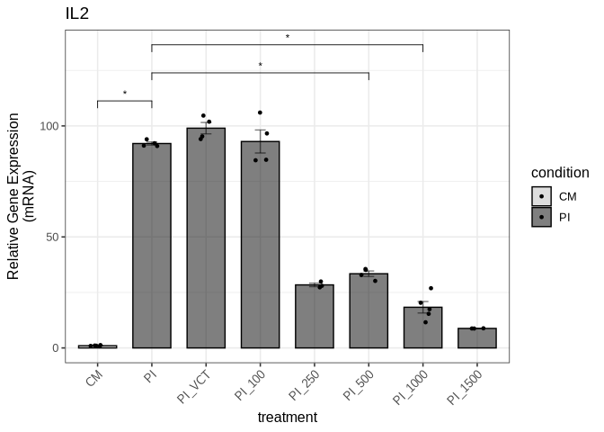

STAT3 acts as a suppressor of the transcription factor Ets-2 in
activated T helper cells-Data Analysis
================
Charalampos Lazaris

## Purpose

The purpose of this document is to provide a reproducible environment
and generate all the graphs included in the manuscript “STAT3 acts as a
suppressor of the transcription factor Ets-2 in activated T helper
cells” by Theodoraki et al., along with the statistical analysis.

## Analysis

We load the required libraries/packages:

``` r
library(ggpubr) # For plotting and statistical tests
```

    Loading required package: ggplot2

``` r
library(tidyverse) # For data wrangling and summarizing
```

    ── Attaching core tidyverse packages ──────────────────────── tidyverse 2.0.0 ──
    ✔ dplyr     1.1.4     ✔ readr     2.1.5
    ✔ forcats   1.0.0     ✔ stringr   1.5.1
    ✔ lubridate 1.9.3     ✔ tibble    3.2.1
    ✔ purrr     1.0.4     ✔ tidyr     1.3.1

    ── Conflicts ────────────────────────────────────────── tidyverse_conflicts() ──
    ✖ dplyr::filter() masks stats::filter()
    ✖ dplyr::lag()    masks stats::lag()
    ℹ Use the conflicted package (<http://conflicted.r-lib.org/>) to force all conflicts to become errors

``` r
library(readxl)  # To read excel files
library(cowplot) # To create composite figures
```


    Attaching package: 'cowplot'

    The following object is masked from 'package:lubridate':

        stamp

    The following object is masked from 'package:ggpubr':

        get_legend

``` r
library(gt) # For creating tables
library(gtExtras) # For additional gt features
```

### Helper functions

Function to calculate change in expression levels (mRNA) between groups
based on qPCR data:

``` r
compare_qpcr_groups <- function(df, group_col = "treatment", 
                                gene_col = "stat3", actin_col = "actin", 
                                control_group = "CM", 
                                wilcox_pairs = list(c("CM", "PI"))) {
  
  # Define a function to identify outliers and remove them
  remove_outliers <- function(data, column, group) {
    data %>%
    group_by(!!rlang::sym(group)) %>%
    mutate(
      Q1 = quantile(!!rlang::sym(column), 0.25, na.rm = TRUE),
      Q3 = quantile(!!rlang::sym(column), 0.75, na.rm = TRUE),
      IQR = Q3 - Q1,
      Lower = Q1 - 1.5 * IQR,
      Upper = Q3 + 1.5 * IQR
    ) %>%
    filter(!!rlang::sym(column) >= Lower & !!rlang::sym(column) <= Upper) %>%
    ungroup() %>%
    select(-Q1, -Q3, -IQR, -Lower, -Upper)  # Remove helper columns
  }

  # Remove the outliers
  df <- remove_outliers(data = df, column = gene_col, group = group_col)
  
  # ΔCt calculation
  df <- df %>%
    mutate(DeltaCt = .data[[gene_col]] - .data[[actin_col]])
  
  # Mean ΔCt for control
  mean_DeltaCt_control <- mean(df$DeltaCt[df[[group_col]] == control_group], na.rm = TRUE)

  # ΔΔCt and FoldChange
  df <- df %>%
    mutate(
      mean_DeltaCt_control = mean_DeltaCt_control,
      DeltaDeltaCt = DeltaCt - mean_DeltaCt_control,
      FoldChange = 2^(-DeltaDeltaCt)
    )
  
  # Normalize so control mean = 1
  norm_factor <- 1 / mean(df$FoldChange[df[[group_col]] == control_group], na.rm = TRUE)
  
  # Get the df with the normalized values
  df <- df %>%
    mutate(norm_factor = norm_factor,
      NormFoldChange = FoldChange * norm_factor)

  # Mann-Whitney tests (non-parametric test for comparing two independent samples)
  wilcox_results <- map_dfr(
    wilcox_pairs,
    function(pair) {
      group1 <- pair[1]
      group2 <- pair[2]
      vals1 <- df$NormFoldChange[df[[group_col]] == group1]
      vals2 <- df$NormFoldChange[df[[group_col]] == group2]
      test <- wilcox.test(vals1, vals2, alternative = "two.sided", paired = FALSE)
      tibble(
        group1 = group1,
        group2 = group2,
        p.value = test$p.value,
        statistic = test$statistic
      )
    }
  )
  
  # Perform all pairwise Mann-Whitney tests
  group_levels <- unique(as.character(df[[group_col]]))
  all_pairs <- combn(group_levels, 2, simplify = FALSE)
  all_wilcox <- map_dfr(
    all_pairs,
    function(pair) {
      group1 <- pair[1]
      group2 <- pair[2]
      vals1 <- df$NormFoldChange[df[[group_col]] == group1]
      vals2 <- df$NormFoldChange[df[[group_col]] == group2]
      test <- wilcox.test(vals1, vals2, alternative = "two.sided", paired = FALSE)
      tibble(
        Comparison = paste(group1, "vs", group2),
        Statistic = test$statistic,
        P_value = test$p.value,
        Significant = ifelse(test$p.value < 0.05, "Yes", "No")
      )
    }
  )
  
  # Table with all pairwise comparisons
  wilcox_table <- all_wilcox %>%
    gt()
  
  # Convert condition to a factor()
  df$condition <- factor(df$condition, levels = c('CM', 'PI'))
  
  # Set group_col as a factor with all levels present in the data
  df[[group_col]] <- factor(df[[group_col]], levels = unique(df[[group_col]]))

  
  # Plot
  p <- ggplot(df, aes(x = !!rlang::sym(group_col), y = NormFoldChange, color = condition, fill = condition)) +
  stat_summary(fun = mean, geom = "bar", color = "black", alpha = 0.5, width = 0.7) +
  stat_summary(fun.data = mean_se, geom = "errorbar", width = 0.2, color = "black", alpha = 0.5) +
  geom_jitter(width = 0.15, color = "black", size = 1) +
  scale_fill_manual(values = c("gray", "black")) +
  theme_bw(base_size = 12) +
  theme(axis.text.x = element_text(angle = 45, hjust = 1)) +
  labs(
    title = toupper(gene_col),
    x = group_col,
    y = "Relative Gene Expression\n(mRNA)"
  ) +
  stat_compare_means(
    comparisons = wilcox_pairs,
    method = "wilcox.test",
    hide.ns = TRUE,
    label = "p.signif",
    size = 3
  )
  
  # Return the results
  return(list(df = df, p = p, wilcox_results = wilcox_results, all_wilcox_table = wilcox_table))
}
```

We create a function to compare qPCR results only when ratios and actin
measurements are available:

``` r
compare_qpcr_groups_with_ratio <- function(df, group_col = "treatment", 
                                gene_col = "stat3", actin_col = "actin", 
                                ratio_col = "ratio",
                                control_group = "CM", 
                                wilcox_pairs = NULL) {
  
  # Calculate gene_col based on actin_col and ratio_col
  df <- df %>%
    mutate(!!rlang::sym(gene_col) := .data[[actin_col]] * .data[[ratio_col]])
  
  # Define a function to identify outliers and remove them
  remove_outliers <- function(data, column, group) {
    data %>%
    group_by(!!rlang::sym(group)) %>%
    mutate(
      Q1 = quantile(!!rlang::sym(column), 0.25, na.rm = TRUE),
      Q3 = quantile(!!rlang::sym(column), 0.75, na.rm = TRUE),
      IQR = Q3 - Q1,
      Lower = Q1 - 1.5 * IQR,
      Upper = Q3 + 1.5 * IQR
    ) %>%
    filter(!!rlang::sym(column) >= Lower & !!rlang::sym(column) <= Upper) %>%
    ungroup() %>%
    select(-Q1, -Q3, -IQR, -Lower, -Upper)  # Remove helper columns
   }

  # Remove the outliers
  df <- remove_outliers(data = df, column = gene_col, group = group_col)
  
  # Calculate the FoldChange based on the actin control
  df <- df %>%
    mutate(FoldChange = .data[[gene_col]] / .data[[actin_col]])
  
  # Normalize so control mean = 1
  norm_factor <- 1 / mean(df$FoldChange[df[[group_col]] == control_group], na.rm = TRUE)

  # Get the df with the normalized values
  df <- df %>%
    mutate(norm_factor = norm_factor,
      NormFoldChange = FoldChange * norm_factor
    )

  # Calculate summary statistics by treatment group
  df <- df %>%
    group_by(.data[[group_col]]) %>%
    mutate(
      Mean_NormFoldChange = mean(NormFoldChange, na.rm = TRUE),
      SEM_NormFoldChange = sd(NormFoldChange, na.rm = TRUE) / sqrt(n())
    ) 
  
  # Mann-Whitney tests for specified pairs (only if wilcox_pairs is provided)
  wilcox_results <- NULL
  if (!is.null(wilcox_pairs)) {
    wilcox_results <- map_dfr(
      wilcox_pairs,
      function(pair) {
        group1 <- pair[1]
        group2 <- pair[2]
        vals1 <- df$NormFoldChange[df[[group_col]] == group1]
        vals2 <- df$NormFoldChange[df[[group_col]] == group2]
        test <- wilcox.test(vals1, vals2, alternative = "two.sided", paired = FALSE)
        tibble(
          group1 = group1,
          group2 = group2,
          p.value = test$p.value,
          statistic = test$statistic
        )
      }
    )
  }
  
  # Perform all pairwise Mann-Whitney tests
  group_levels <- unique(as.character(df[[group_col]]))
  all_pairs <- combn(group_levels, 2, simplify = FALSE)
  all_wilcox <- map_dfr(
    all_pairs,
    function(pair) {
      group1 <- pair[1]
      group2 <- pair[2]
      vals1 <- df$NormFoldChange[df[[group_col]] == group1]
      vals2 <- df$NormFoldChange[df[[group_col]] == group2]
      test <- wilcox.test(vals1, vals2, alternative = "two.sided", paired = FALSE)
      tibble(
        Comparison = paste(group1, "vs", group2),
        Statistic = test$statistic,
        P_value = test$p.value,
        Significant = ifelse(test$p.value < 0.05, "Yes", "No")
      )
    }
  )
  
  # Table with all pairwise comparisons
  wilcox_table <- all_wilcox %>%
    gt()

  # Convert condition to a factor()
  df$condition <- factor(df$condition, levels = c('CM', 'PI'))
  
  # Set group_col (treatment) as a factor with all levels present in the data
  df[[group_col]] <- factor(df[[group_col]], levels = unique(df[[group_col]]))
  
  # Plot
  p <- ggplot(df, aes(x = !!rlang::sym(group_col), y = NormFoldChange, color = condition, fill = condition)) +
  stat_summary(fun = mean, geom = "bar", color = "black", alpha = 0.5, width = 0.7) +
  stat_summary(fun.data = mean_se, geom = "errorbar", width = 0.2, color = "black", alpha = 0.5) +
  geom_jitter(width = 0.15, color = "black", size = 1) +
  scale_fill_manual(values = c("gray", "black")) +
  theme_bw(base_size = 12) +
  theme(axis.text.x = element_text(angle = 45, hjust = 1)) +
  labs(
    title = toupper(gene_col),
    x = group_col,
    y = "Relative Gene Expression\n(mRNA)"
  ) +
  stat_compare_means(
    comparisons = wilcox_pairs,
    method = "wilcox.test",
    hide.ns = TRUE,
    label = "p.signif",
    size = 3
  )
  
  # Return the results
  return(list(df = df, p = p, wilcox_results = wilcox_results, all_wilcox_table = wilcox_table))
}
```

``` r
compare_qpcr_groups_with_only_ratio <- function(df, group_col = "treatment", 
                                ratio_col = "ratio",
                                control_group = "CM", 
                                wilcox_pairs = NULL) {
  
  # Define a function to identify outliers and remove them
  remove_outliers <- function(data, column, group) {
    data %>%
    group_by(!!rlang::sym(group)) %>%
    mutate(
      Q1 = quantile(!!rlang::sym(column), 0.25, na.rm = TRUE),
      Q3 = quantile(!!rlang::sym(column), 0.75, na.rm = TRUE),
      IQR = Q3 - Q1,
      Lower = Q1 - 1.5 * IQR,
      Upper = Q3 + 1.5 * IQR
    ) %>%
    filter(!!rlang::sym(column) >= Lower & !!rlang::sym(column) <= Upper) %>%
    ungroup() %>%
    select(-Q1, -Q3, -IQR, -Lower, -Upper)  # Remove helper columns
   }

  # Remove the outliers from ratio column
  df <- remove_outliers(data = df, column = ratio_col, group = group_col)
  
  # Calculate the FoldChange based on the ratio column
  df <- df %>%
    mutate(FoldChange = .data[[ratio_col]])
  
  # Normalize so control mean = 1
  norm_factor <- 1 / mean(df$FoldChange[df[[group_col]] == control_group], na.rm = TRUE)

  # Get the df with the normalized values
  df <- df %>%
    mutate(norm_factor = norm_factor,
      NormFoldChange = FoldChange * norm_factor
    )

  # Calculate summary statistics by treatment group
  df <- df %>%
    group_by(.data[[group_col]]) %>%
    mutate(
      Mean_NormFoldChange = mean(NormFoldChange, na.rm = TRUE),
      SEM_NormFoldChange = sd(NormFoldChange, na.rm = TRUE) / sqrt(n())
    ) 
  
  # Mann-Whitney tests for specified pairs (only if wilcox_pairs is provided)
  wilcox_results <- NULL
  if (!is.null(wilcox_pairs)) {
    wilcox_results <- map_dfr(
      wilcox_pairs,
      function(pair) {
        group1 <- pair[1]
        group2 <- pair[2]
        vals1 <- df$NormFoldChange[df[[group_col]] == group1]
        vals2 <- df$NormFoldChange[df[[group_col]] == group2]
        test <- wilcox.test(vals1, vals2, alternative = "two.sided", paired = FALSE)
        tibble(
          group1 = group1,
          group2 = group2,
          p.value = test$p.value,
          statistic = test$statistic
        )
      }
    )
  }
  
  # Perform all pairwise Mann-Whitney tests
  group_levels <- unique(as.character(df[[group_col]]))
  all_pairs <- combn(group_levels, 2, simplify = FALSE)
  all_wilcox <- map_dfr(
    all_pairs,
    function(pair) {
      group1 <- pair[1]
      group2 <- pair[2]
      vals1 <- df$NormFoldChange[df[[group_col]] == group1]
      vals2 <- df$NormFoldChange[df[[group_col]] == group2]
      test <- wilcox.test(vals1, vals2, alternative = "two.sided", paired = FALSE)
      tibble(
        Comparison = paste(group1, "vs", group2),
        Statistic = test$statistic,
        P_value = test$p.value,
        Significant = ifelse(test$p.value < 0.05, "Yes", "No")
      )
    }
  )
  
  # Table with all pairwise comparisons
  wilcox_table <- all_wilcox %>%
    gt() 

  # Convert condition to a factor()
  df$condition <- factor(df$condition, levels = c('CM', 'PI'))
  
  # Set group_col (treatment) as a factor with all levels present in the data
  df[[group_col]] <- factor(df[[group_col]], levels = unique(df[[group_col]]))
  
  # Plot
  p <- ggplot(df, aes(x = !!rlang::sym(group_col), y = NormFoldChange, color = condition, fill = condition)) +
  stat_summary(fun = mean, geom = "bar", color = "black", alpha = 0.5, width = 0.7) +
  stat_summary(fun.data = mean_se, geom = "errorbar", width = 0.2, color = "black", alpha = 0.5) +
  geom_jitter(width = 0.15, color = "black", size = 1) +
  scale_fill_manual(values = c("gray", "black")) +
  theme_bw(base_size = 12) +
  theme(axis.text.x = element_text(angle = 45, hjust = 1)) +
  labs(
    title = "IL2",
    x = group_col,
    y = "Relative Gene Expression\n(mRNA)"
  ) +
  stat_compare_means(
    comparisons = wilcox_pairs,
    method = "wilcox.test",
    hide.ns = TRUE,
    label = "p.signif",
    size = 3
  )
  
  # Return the results
  return(list(df = df, p = p, wilcox_results = wilcox_results, all_wilcox_table = wilcox_table))
}
```

We create another function to calculate changes in gene expression
levels (protein) based only on the ratio:

``` r
compare_protein_ratio <- function(df, 
                               ratio_col = "ratio",
                               group_col = "treatment", 
                               gene_name = "STAT3",
                               control_group = "CM", 
                               wilcox_pairs = list(c("CM", "PI"))) {
  
  # FoldChange is essentially the ratio
  df <- df %>%
    mutate(FoldChange = .data[[ratio_col]])
  
  # Normalize so control mean = 1
  norm_factor <- 1 / mean(df$FoldChange[df[[group_col]] == control_group], na.rm = TRUE)

  # Get the df with the normalized values
  # Normalized fold change is calculated by the ratio multiplied by the norm_factor
  df <- df %>%
    mutate(norm_factor = norm_factor,
      NormFoldChange = .data[[ratio_col]] * norm_factor
    )

  # Calculate summary statistics by treatment group
  df <- df %>%
    group_by(.data[[group_col]]) %>%
    mutate(
      Mean_NormFoldChange = mean(NormFoldChange, na.rm = TRUE),
      SEM_NormFoldChange = sd(NormFoldChange, na.rm = TRUE) / sqrt(n())
    ) 
  
  # Mann-Whitney tests (non-parametric test for comparing two independent samples)
  wilcox_results <- map_dfr(
    wilcox_pairs,
    function(pair) {
      group1 <- pair[1]
      group2 <- pair[2]
      vals1 <- df$NormFoldChange[df[[group_col]] == group1]
      vals2 <- df$NormFoldChange[df[[group_col]] == group2]
      test <- wilcox.test(vals1, vals2, alternative = "two.sided", paired = FALSE)
      tibble(
        group1 = group1,
        group2 = group2,
        p.value = test$p.value,
        statistic = test$statistic
      )
    }
  )
  
  # Perform all pairwise Mann-Whitney tests
  group_levels <- unique(as.character(df[[group_col]]))
  all_pairs <- combn(group_levels, 2, simplify = FALSE)
  all_wilcox <- map_dfr(
    all_pairs,
    function(pair) {
      group1 <- pair[1]
      group2 <- pair[2]
      vals1 <- df$NormFoldChange[df[[group_col]] == group1]
      vals2 <- df$NormFoldChange[df[[group_col]] == group2]
      test <- wilcox.test(vals1, vals2, alternative = "two.sided", paired = FALSE)
      tibble(
        Comparison = paste(group1, "vs", group2),
        Statistic = test$statistic,
        P_value = test$p.value,
        Significant = ifelse(test$p.value < 0.05, "Yes", "No")
      )
    }
  )
  
  # Table with all pairwise comparisons
  wilcox_table <- all_wilcox %>%
    gt() 

  # Convert condition to a factor() - assuming condition column exists
  if("condition" %in% names(df)) {
    df$condition <- factor(df$condition, levels = c('CM', 'PI'))
  }
  
  # Set group_col (treatment) as a factor with all levels present in the data
  df[[group_col]] <- factor(df[[group_col]], levels = unique(df[[group_col]]))
  
  # Plot with gene name as title
  p <- ggplot(df, aes(x = !!rlang::sym(group_col), y = NormFoldChange)) +
  {if("condition" %in% names(df)) 
    aes(color = condition, fill = condition)
  } +
  stat_summary(fun = mean, geom = "bar", color = "black", alpha = 0.5, width = 0.7) +
  stat_summary(fun.data = mean_se, geom = "errorbar", width = 0.2, color = "black", alpha = 0.5) +
  geom_jitter(width = 0.15, color = "black", size = 1) +
  {if("condition" %in% names(df)) 
    scale_fill_manual(values = c("gray", "black"))
  } +
  theme_bw(base_size = 12) +
  theme(axis.text.x = element_text(angle = 45, hjust = 1)) +
  labs(
    title = toupper(gene_name),
    x = group_col,
    y = "Relative Gene Expression\n(Protein)"
  ) +
  stat_compare_means(
    comparisons = wilcox_pairs,
    method = "wilcox.test",
    hide.ns = TRUE,
    label = "p.signif",
    size = 3
  )
  
  # Return the results
  return(list(df = df, p = p, wilcox_results = wilcox_results, all_wilcox_table = wilcox_table))
}
```

We modify the function to work for PCR with only ratio column:

``` r
compare_qpcr_ratio <- function(df, 
                               ratio_col = "ratio",
                               group_col = "treatment", 
                               gene_name = "IL2",
                               control_group = "CM", 
                               wilcox_pairs = NULL) {
  
  # FoldChange is essentially the ratio
  df <- df %>%
    mutate(FoldChange = .data[[ratio_col]])
  
  # Normalize so control mean = 1
  norm_factor <- 1 / mean(df$FoldChange[df[[group_col]] == control_group], na.rm = TRUE)

  # Get the df with the normalized values
  # Normalized fold change is calculated by the ratio multiplied by the norm_factor
  df <- df %>%
    mutate(norm_factor = norm_factor,
      NormFoldChange = .data[[ratio_col]] * norm_factor
    )

  # Calculate summary statistics by treatment group
  df <- df %>%
    group_by(.data[[group_col]]) %>%
    mutate(
      Mean_NormFoldChange = mean(NormFoldChange, na.rm = TRUE),
      SEM_NormFoldChange = sd(NormFoldChange, na.rm = TRUE) / sqrt(n())
    ) 
  
  # Mann-Whitney tests for specified pairs (only if wilcox_pairs is provided)
  wilcox_results <- NULL
  if (!is.null(wilcox_pairs)) {
    wilcox_results <- map_dfr(
      wilcox_pairs,
      function(pair) {
        group1 <- pair[1]
        group2 <- pair[2]
        vals1 <- df$NormFoldChange[df[[group_col]] == group1]
        vals2 <- df$NormFoldChange[df[[group_col]] == group2]
        test <- wilcox.test(vals1, vals2, alternative = "two.sided", paired = FALSE)
        tibble(
          group1 = group1,
          group2 = group2,
          p.value = test$p.value,
          statistic = test$statistic
        )
      }
    )
  }
  
  # Perform all pairwise Mann-Whitney tests
  group_levels <- unique(as.character(df[[group_col]]))
  all_pairs <- combn(group_levels, 2, simplify = FALSE)
  all_wilcox <- map_dfr(
    all_pairs,
    function(pair) {
      group1 <- pair[1]
      group2 <- pair[2]
      vals1 <- df$NormFoldChange[df[[group_col]] == group1]
      vals2 <- df$NormFoldChange[df[[group_col]] == group2]
      test <- wilcox.test(vals1, vals2, alternative = "two.sided", paired = FALSE)
      tibble(
        Comparison = paste(group1, "vs", group2),
        Statistic = test$statistic,
        P_value = test$p.value,
        Significant = ifelse(test$p.value < 0.05, "Yes", "No")
      )
    }
  )
  
  # Table with all pairwise comparisons
  wilcox_table <- all_wilcox %>%
    gt() 
  
  # Convert condition to a factor() - assuming condition column exists
  if("condition" %in% names(df)) {
    df$condition <- factor(df$condition, levels = c('CM', 'PI'))
  }
  
  # Set group_col (treatment) as a factor with all levels present in the data
  df[[group_col]] <- factor(df[[group_col]], levels = unique(df[[group_col]]))
  
  # Plot with gene name as title
  p <- ggplot(df, aes(x = !!rlang::sym(group_col), y = NormFoldChange)) +
  {if("condition" %in% names(df)) 
    aes(color = condition, fill = condition)
  } +
  stat_summary(fun = mean, geom = "bar", color = "black", alpha = 0.5, width = 0.7) +
  stat_summary(fun.data = mean_se, geom = "errorbar", width = 0.2, color = "black", alpha = 0.5) +
  geom_jitter(width = 0.15, color = "black", size = 1) +
  {if("condition" %in% names(df)) 
    scale_fill_manual(values = c("gray", "black"))
  } +
  theme_bw(base_size = 12) +
  theme(axis.text.x = element_text(angle = 45, hjust = 1)) +
  labs(
    title = toupper(gene_name),
    x = group_col,
    y = "Relative Gene Expression\n(mRNA)"
  ) +
  stat_compare_means(
    comparisons = wilcox_pairs,
    method = "wilcox.test",
    hide.ns = TRUE,
    label = "p.signif",
    size = 3
  )
  
  # Return the results
  return(list(df = df, p = p, wilcox_results = wilcox_results, all_wilcox_table = wilcox_table))
}
```

We create a function to calculate changes in protein levels between
groups based on Western blot data:

``` r
compare_protein_groups <- function(df, group_col = "treatment", 
                                gene_col = "stat3", actin_col = "actin", 
                                control_group = "CM", 
                                wilcox_pairs = list(c("CM", "PI"))) {
  
  # Define a function to identify outliers and remove them
  remove_outliers <- function(data, column, group) {
    data %>%
    group_by(!!rlang::sym(group)) %>%
    mutate(
      Q1 = quantile(!!rlang::sym(column), 0.25, na.rm = TRUE),
      Q3 = quantile(!!rlang::sym(column), 0.75, na.rm = TRUE),
      IQR = Q3 - Q1,
      Lower = Q1 - 1.5 * IQR,
      Upper = Q3 + 1.5 * IQR
    ) %>%
    filter(!!rlang::sym(column) >= Lower & !!rlang::sym(column) <= Upper) %>%
    ungroup() %>%
    select(-Q1, -Q3, -IQR, -Lower, -Upper)  # Remove helper columns
   }

  # Remove the outliers
  df <- remove_outliers(data = df, column = gene_col, group = group_col)
  
  # Calculate the FoldChange based on the actin control
  df <- df %>%
    mutate(FoldChange = .data[[gene_col]] / .data[[actin_col]])
  
  # Normalize so control mean = 1
  norm_factor <- 1 / mean(df$FoldChange[df[[group_col]] == control_group], na.rm = TRUE)

  # Get the df with the normalized values
  df <- df %>%
    mutate(norm_factor = norm_factor,
      NormFoldChange = FoldChange * norm_factor
    )

  # Calculate summary statistics by treatment group
  df <- df %>%
    group_by(.data[[group_col]]) %>%
    mutate(
      Mean_NormFoldChange = mean(NormFoldChange, na.rm = TRUE),
      SEM_NormFoldChange = sd(NormFoldChange, na.rm = TRUE) / sqrt(n())
    ) 
  
  # Mann-Whitney tests (non-parametric test for comparing two independent samples)
  wilcox_results <- map_dfr(
    wilcox_pairs,
    function(pair) {
      group1 <- pair[1]
      group2 <- pair[2]
      vals1 <- df$NormFoldChange[df[[group_col]] == group1]
      vals2 <- df$NormFoldChange[df[[group_col]] == group2]
      test <- wilcox.test(vals1, vals2, alternative = "two.sided", paired = FALSE)
      tibble(
        group1 = group1,
        group2 = group2,
        p.value = test$p.value,
        statistic = test$statistic
      )
    }
  )
  
  # Perform all pairwise Mann-Whitney tests
  group_levels <- unique(as.character(df[[group_col]]))
  all_pairs <- combn(group_levels, 2, simplify = FALSE)
  all_wilcox <- map_dfr(
    all_pairs,
    function(pair) {
      group1 <- pair[1]
      group2 <- pair[2]
      vals1 <- df$NormFoldChange[df[[group_col]] == group1]
      vals2 <- df$NormFoldChange[df[[group_col]] == group2]
      test <- wilcox.test(vals1, vals2, alternative = "two.sided", paired = FALSE)
      tibble(
        Comparison = paste(group1, "vs", group2),
        Statistic = test$statistic,
        P_value = test$p.value,
        Significant = ifelse(test$p.value < 0.05, "Yes", "No")
      )
    }
  )
  
  # Table with all pairwise comparisons
  wilcox_table <- all_wilcox %>%
    gt() 

  # Convert condition to a factor()
  df$condition <- factor(df$condition, levels = c('CM', 'PI'))
  
  # Set group_col (treatment) as a factor with all levels present in the data
  df[[group_col]] <- factor(df[[group_col]], levels = unique(df[[group_col]]))
  
  # Plot
  p <- ggplot(df, aes(x = !!rlang::sym(group_col), y = NormFoldChange, color = condition, fill = condition)) +
  stat_summary(fun = mean, geom = "bar", color = "black", alpha = 0.5, width = 0.7) +
  stat_summary(fun.data = mean_se, geom = "errorbar", width = 0.2, color = "black", alpha = 0.5) +
  geom_jitter(width = 0.15, color = "black", size = 1) +
  scale_fill_manual(values = c("gray", "black")) +
  theme_bw(base_size = 12) +
  theme(axis.text.x = element_text(angle = 45, hjust = 1)) +
  labs(
    title = toupper(gene_col),
    x = group_col,
    y = "Relative Gene Expression\n(protein)"
  ) +
  stat_compare_means(
    comparisons = wilcox_pairs,
    method = "wilcox.test",
    hide.ns = TRUE,
    label = "p.signif",
    size = 3
  )
  
  # Return the results
  return(list(df = df, p = p, wilcox_results = wilcox_results, all_wilcox_table = wilcox_table))
}
```

We modify the first one of the helper functions, to compare ChIP-seq
data:

``` r
compare_chipseq_groups <- function(df, group_col = "treatment", 
                                gene_col = "stat3", control_col = "control", 
                                control_group = "CM", 
                                wilcox_pairs = NULL) {
  
  # Populate the control column with the sum of the gene_col and dct
  df <- df %>%
    mutate(!!rlang::sym(control_col) := .data[[gene_col]] - .data[["dct"]])
  
  # Define a function to identify outliers and remove them
  remove_outliers <- function(data, column, group) {
    data %>%
    group_by(!!rlang::sym(group)) %>%
    mutate(
      Q1 = quantile(!!rlang::sym(column), 0.25, na.rm = TRUE),
      Q3 = quantile(!!rlang::sym(column), 0.75, na.rm = TRUE),
      IQR = Q3 - Q1,
      Lower = Q1 - 1.5 * IQR,
      Upper = Q3 + 1.5 * IQR
    ) %>%
    filter(!!rlang::sym(column) >= Lower & !!rlang::sym(column) <= Upper) %>%
    ungroup() %>%
    select(-Q1, -Q3, -IQR, -Lower, -Upper)  # Remove helper columns
  }

  # Remove the outliers
  df <- remove_outliers(data = df, column = gene_col, group = group_col)
  
  # ΔCt calculation
  df <- df %>%
    mutate(DeltaCt = .data[[gene_col]] - .data[[control_col]])
  
  # Mean ΔCt for control
  mean_DeltaCt_control <- mean(df$DeltaCt[df[[group_col]] == control_group], na.rm = TRUE)

  # ΔΔCt and FoldChange
  df <- df %>%
    mutate(
      mean_DeltaCt_control = mean_DeltaCt_control,
      DeltaDeltaCt = DeltaCt - mean_DeltaCt_control,
      FoldChange = 2^(-DeltaDeltaCt)
    )
  
  # Normalize so control mean = 1
  norm_factor <- 1 / mean(df$FoldChange[df[[group_col]] == control_group], na.rm = TRUE)
  
  # Get the df with the normalized values
  df <- df %>%
    mutate(norm_factor = norm_factor,
      NormFoldChange = FoldChange * norm_factor)

  # Mann-Whitney tests for specified pairs (only if wilcox_pairs is provided)
  wilcox_results <- NULL
  if (!is.null(wilcox_pairs)) {
    wilcox_results <- map_dfr(
      wilcox_pairs,
      function(pair) {
        group1 <- pair[1]
        group2 <- pair[2]
        vals1 <- df$NormFoldChange[df[[group_col]] == group1]
        vals2 <- df$NormFoldChange[df[[group_col]] == group2]
        test <- wilcox.test(vals1, vals2, alternative = "two.sided", paired = FALSE)
        tibble(
          group1 = group1,
          group2 = group2,
          p.value = test$p.value,
          statistic = test$statistic
        )
      }
    )
  }
  
  # Perform all pairwise Mann-Whitney tests
  group_levels <- unique(as.character(df[[group_col]]))
  all_pairs <- combn(group_levels, 2, simplify = FALSE)
  all_wilcox <- map_dfr(
    all_pairs,
    function(pair) {
      group1 <- pair[1]
      group2 <- pair[2]
      vals1 <- df$NormFoldChange[df[[group_col]] == group1]
      vals2 <- df$NormFoldChange[df[[group_col]] == group2]
      test <- wilcox.test(vals1, vals2, alternative = "two.sided", paired = FALSE)
      tibble(
        Comparison = paste(group1, "vs", group2),
        Statistic = test$statistic,
        P_value = test$p.value,
        Significant = ifelse(test$p.value < 0.05, "Yes", "No")
      )
    }
  )
  
  # Table with all pairwise comparisons
  wilcox_table <- all_wilcox %>%
    gt() 
  
  # Convert condition to a factor()
  df$condition <- factor(df$condition, levels = c('CM', 'PI'))
  
  # Set group_col as a factor with all levels present in the data
  # in the desired order
  
  # Create custom factor levels with desired order
  create_custom_order <- function(levels) {
    cm_base <- levels[levels == "CM"]
    pi_base <- levels[levels == "PI"]
    cm_stat <- levels[grepl("^CM_STAT", levels)]
    pi_stat <- levels[grepl("^PI_STAT", levels)]
  
    cm_stat <- sort(cm_stat)
    pi_stat <- sort(pi_stat)
  
    return(c(cm_base, pi_base, cm_stat, pi_stat))
  }

  #  Apply custom ordering to the group_col
  group_levels <- unique(as.character(df[[group_col]]))
  custom_levels <- create_custom_order(group_levels)
  
  # Set the group_col as a factor with the custom levels
  df[[group_col]] <- factor(df[[group_col]], levels = custom_levels)

  # Create base plot
  p <- ggplot(df, aes(x = !!rlang::sym(group_col), y = NormFoldChange, color = condition, fill = condition)) +
    stat_summary(fun = mean, geom = "bar", color = "black", alpha = 0.5, width = 0.7) +
    stat_summary(fun.data = mean_se, geom = "errorbar", width = 0.2, color = "black", alpha = 0.5) +
    geom_jitter(width = 0.15, color = "black", size = 1) +
    scale_fill_manual(values = c("gray", "black")) +
    theme_bw(base_size = 12) +
    theme(axis.text.x = element_text(angle = 45, hjust = 1)) +
    labs(
      title = toupper(gene_col),
      x = group_col,
      y = "Fold Enrichment (ChIP-seq)"
    ) +
    ylim(0, 10)
  
  # Add statistical comparisons only if wilcox_pairs is provided
  if (!is.null(wilcox_pairs)) {
    p <- p + stat_compare_means(
      comparisons = wilcox_pairs,
      method = "wilcox.test",
      hide.ns = TRUE,
      label = "p.signif",
      size = 3
    )
  }
  
  # Return the results
  return(list(df = df, p = p, wilcox_results = wilcox_results, all_wilcox_table = wilcox_table))
}
```

### Figure 2

#### Figure 2a (ETS2 mRNA expression levels)

We import the data for ETS2 mRNA expression levels from the qPCR
experiment:

``` r
fig2_ets2_qpcr_data <- read_xlsx("input/Figure2_data.xlsx", sheet = "ETS2_mRNA")
```

``` r
fig2_ets2_qpcr_result <- compare_qpcr_groups(
  fig2_ets2_qpcr_data,
  group_col = "treatment",
  gene_col = "ets2",
  actin_col = "actin",
  control_group = "CM",
  wilcox_pairs = list(c("CM", "PI"))
)
```

``` r
fig2_ets2_qpcr_result$all_wilcox_table
```

<div id="wnlcbsesfb" style="padding-left:0px;padding-right:0px;padding-top:10px;padding-bottom:10px;overflow-x:auto;overflow-y:auto;width:auto;height:auto;">
<style>#wnlcbsesfb table {
  font-family: system-ui, 'Segoe UI', Roboto, Helvetica, Arial, sans-serif, 'Apple Color Emoji', 'Segoe UI Emoji', 'Segoe UI Symbol', 'Noto Color Emoji';
  -webkit-font-smoothing: antialiased;
  -moz-osx-font-smoothing: grayscale;
}

#wnlcbsesfb thead, #wnlcbsesfb tbody, #wnlcbsesfb tfoot, #wnlcbsesfb tr, #wnlcbsesfb td, #wnlcbsesfb th {
  border-style: none;
}

#wnlcbsesfb p {
  margin: 0;
  padding: 0;
}

#wnlcbsesfb .gt_table {
  display: table;
  border-collapse: collapse;
  line-height: normal;
  margin-left: auto;
  margin-right: auto;
  color: #333333;
  font-size: 16px;
  font-weight: normal;
  font-style: normal;
  background-color: #FFFFFF;
  width: auto;
  border-top-style: solid;
  border-top-width: 2px;
  border-top-color: #A8A8A8;
  border-right-style: none;
  border-right-width: 2px;
  border-right-color: #D3D3D3;
  border-bottom-style: solid;
  border-bottom-width: 2px;
  border-bottom-color: #A8A8A8;
  border-left-style: none;
  border-left-width: 2px;
  border-left-color: #D3D3D3;
}

#wnlcbsesfb .gt_caption {
  padding-top: 4px;
  padding-bottom: 4px;
}

#wnlcbsesfb .gt_title {
  color: #333333;
  font-size: 125%;
  font-weight: initial;
  padding-top: 4px;
  padding-bottom: 4px;
  padding-left: 5px;
  padding-right: 5px;
  border-bottom-color: #FFFFFF;
  border-bottom-width: 0;
}

#wnlcbsesfb .gt_subtitle {
  color: #333333;
  font-size: 85%;
  font-weight: initial;
  padding-top: 3px;
  padding-bottom: 5px;
  padding-left: 5px;
  padding-right: 5px;
  border-top-color: #FFFFFF;
  border-top-width: 0;
}

#wnlcbsesfb .gt_heading {
  background-color: #FFFFFF;
  text-align: center;
  border-bottom-color: #FFFFFF;
  border-left-style: none;
  border-left-width: 1px;
  border-left-color: #D3D3D3;
  border-right-style: none;
  border-right-width: 1px;
  border-right-color: #D3D3D3;
}

#wnlcbsesfb .gt_bottom_border {
  border-bottom-style: solid;
  border-bottom-width: 2px;
  border-bottom-color: #D3D3D3;
}

#wnlcbsesfb .gt_col_headings {
  border-top-style: solid;
  border-top-width: 2px;
  border-top-color: #D3D3D3;
  border-bottom-style: solid;
  border-bottom-width: 2px;
  border-bottom-color: #D3D3D3;
  border-left-style: none;
  border-left-width: 1px;
  border-left-color: #D3D3D3;
  border-right-style: none;
  border-right-width: 1px;
  border-right-color: #D3D3D3;
}

#wnlcbsesfb .gt_col_heading {
  color: #333333;
  background-color: #FFFFFF;
  font-size: 100%;
  font-weight: normal;
  text-transform: inherit;
  border-left-style: none;
  border-left-width: 1px;
  border-left-color: #D3D3D3;
  border-right-style: none;
  border-right-width: 1px;
  border-right-color: #D3D3D3;
  vertical-align: bottom;
  padding-top: 5px;
  padding-bottom: 6px;
  padding-left: 5px;
  padding-right: 5px;
  overflow-x: hidden;
}

#wnlcbsesfb .gt_column_spanner_outer {
  color: #333333;
  background-color: #FFFFFF;
  font-size: 100%;
  font-weight: normal;
  text-transform: inherit;
  padding-top: 0;
  padding-bottom: 0;
  padding-left: 4px;
  padding-right: 4px;
}

#wnlcbsesfb .gt_column_spanner_outer:first-child {
  padding-left: 0;
}

#wnlcbsesfb .gt_column_spanner_outer:last-child {
  padding-right: 0;
}

#wnlcbsesfb .gt_column_spanner {
  border-bottom-style: solid;
  border-bottom-width: 2px;
  border-bottom-color: #D3D3D3;
  vertical-align: bottom;
  padding-top: 5px;
  padding-bottom: 5px;
  overflow-x: hidden;
  display: inline-block;
  width: 100%;
}

#wnlcbsesfb .gt_spanner_row {
  border-bottom-style: hidden;
}

#wnlcbsesfb .gt_group_heading {
  padding-top: 8px;
  padding-bottom: 8px;
  padding-left: 5px;
  padding-right: 5px;
  color: #333333;
  background-color: #FFFFFF;
  font-size: 100%;
  font-weight: initial;
  text-transform: inherit;
  border-top-style: solid;
  border-top-width: 2px;
  border-top-color: #D3D3D3;
  border-bottom-style: solid;
  border-bottom-width: 2px;
  border-bottom-color: #D3D3D3;
  border-left-style: none;
  border-left-width: 1px;
  border-left-color: #D3D3D3;
  border-right-style: none;
  border-right-width: 1px;
  border-right-color: #D3D3D3;
  vertical-align: middle;
  text-align: left;
}

#wnlcbsesfb .gt_empty_group_heading {
  padding: 0.5px;
  color: #333333;
  background-color: #FFFFFF;
  font-size: 100%;
  font-weight: initial;
  border-top-style: solid;
  border-top-width: 2px;
  border-top-color: #D3D3D3;
  border-bottom-style: solid;
  border-bottom-width: 2px;
  border-bottom-color: #D3D3D3;
  vertical-align: middle;
}

#wnlcbsesfb .gt_from_md > :first-child {
  margin-top: 0;
}

#wnlcbsesfb .gt_from_md > :last-child {
  margin-bottom: 0;
}

#wnlcbsesfb .gt_row {
  padding-top: 8px;
  padding-bottom: 8px;
  padding-left: 5px;
  padding-right: 5px;
  margin: 10px;
  border-top-style: solid;
  border-top-width: 1px;
  border-top-color: #D3D3D3;
  border-left-style: none;
  border-left-width: 1px;
  border-left-color: #D3D3D3;
  border-right-style: none;
  border-right-width: 1px;
  border-right-color: #D3D3D3;
  vertical-align: middle;
  overflow-x: hidden;
}

#wnlcbsesfb .gt_stub {
  color: #333333;
  background-color: #FFFFFF;
  font-size: 100%;
  font-weight: initial;
  text-transform: inherit;
  border-right-style: solid;
  border-right-width: 2px;
  border-right-color: #D3D3D3;
  padding-left: 5px;
  padding-right: 5px;
}

#wnlcbsesfb .gt_stub_row_group {
  color: #333333;
  background-color: #FFFFFF;
  font-size: 100%;
  font-weight: initial;
  text-transform: inherit;
  border-right-style: solid;
  border-right-width: 2px;
  border-right-color: #D3D3D3;
  padding-left: 5px;
  padding-right: 5px;
  vertical-align: top;
}

#wnlcbsesfb .gt_row_group_first td {
  border-top-width: 2px;
}

#wnlcbsesfb .gt_row_group_first th {
  border-top-width: 2px;
}

#wnlcbsesfb .gt_summary_row {
  color: #333333;
  background-color: #FFFFFF;
  text-transform: inherit;
  padding-top: 8px;
  padding-bottom: 8px;
  padding-left: 5px;
  padding-right: 5px;
}

#wnlcbsesfb .gt_first_summary_row {
  border-top-style: solid;
  border-top-color: #D3D3D3;
}

#wnlcbsesfb .gt_first_summary_row.thick {
  border-top-width: 2px;
}

#wnlcbsesfb .gt_last_summary_row {
  padding-top: 8px;
  padding-bottom: 8px;
  padding-left: 5px;
  padding-right: 5px;
  border-bottom-style: solid;
  border-bottom-width: 2px;
  border-bottom-color: #D3D3D3;
}

#wnlcbsesfb .gt_grand_summary_row {
  color: #333333;
  background-color: #FFFFFF;
  text-transform: inherit;
  padding-top: 8px;
  padding-bottom: 8px;
  padding-left: 5px;
  padding-right: 5px;
}

#wnlcbsesfb .gt_first_grand_summary_row {
  padding-top: 8px;
  padding-bottom: 8px;
  padding-left: 5px;
  padding-right: 5px;
  border-top-style: double;
  border-top-width: 6px;
  border-top-color: #D3D3D3;
}

#wnlcbsesfb .gt_last_grand_summary_row_top {
  padding-top: 8px;
  padding-bottom: 8px;
  padding-left: 5px;
  padding-right: 5px;
  border-bottom-style: double;
  border-bottom-width: 6px;
  border-bottom-color: #D3D3D3;
}

#wnlcbsesfb .gt_striped {
  background-color: rgba(128, 128, 128, 0.05);
}

#wnlcbsesfb .gt_table_body {
  border-top-style: solid;
  border-top-width: 2px;
  border-top-color: #D3D3D3;
  border-bottom-style: solid;
  border-bottom-width: 2px;
  border-bottom-color: #D3D3D3;
}

#wnlcbsesfb .gt_footnotes {
  color: #333333;
  background-color: #FFFFFF;
  border-bottom-style: none;
  border-bottom-width: 2px;
  border-bottom-color: #D3D3D3;
  border-left-style: none;
  border-left-width: 2px;
  border-left-color: #D3D3D3;
  border-right-style: none;
  border-right-width: 2px;
  border-right-color: #D3D3D3;
}

#wnlcbsesfb .gt_footnote {
  margin: 0px;
  font-size: 90%;
  padding-top: 4px;
  padding-bottom: 4px;
  padding-left: 5px;
  padding-right: 5px;
}

#wnlcbsesfb .gt_sourcenotes {
  color: #333333;
  background-color: #FFFFFF;
  border-bottom-style: none;
  border-bottom-width: 2px;
  border-bottom-color: #D3D3D3;
  border-left-style: none;
  border-left-width: 2px;
  border-left-color: #D3D3D3;
  border-right-style: none;
  border-right-width: 2px;
  border-right-color: #D3D3D3;
}

#wnlcbsesfb .gt_sourcenote {
  font-size: 90%;
  padding-top: 4px;
  padding-bottom: 4px;
  padding-left: 5px;
  padding-right: 5px;
}

#wnlcbsesfb .gt_left {
  text-align: left;
}

#wnlcbsesfb .gt_center {
  text-align: center;
}

#wnlcbsesfb .gt_right {
  text-align: right;
  font-variant-numeric: tabular-nums;
}

#wnlcbsesfb .gt_font_normal {
  font-weight: normal;
}

#wnlcbsesfb .gt_font_bold {
  font-weight: bold;
}

#wnlcbsesfb .gt_font_italic {
  font-style: italic;
}

#wnlcbsesfb .gt_super {
  font-size: 65%;
}

#wnlcbsesfb .gt_footnote_marks {
  font-size: 75%;
  vertical-align: 0.4em;
  position: initial;
}

#wnlcbsesfb .gt_asterisk {
  font-size: 100%;
  vertical-align: 0;
}

#wnlcbsesfb .gt_indent_1 {
  text-indent: 5px;
}

#wnlcbsesfb .gt_indent_2 {
  text-indent: 10px;
}

#wnlcbsesfb .gt_indent_3 {
  text-indent: 15px;
}

#wnlcbsesfb .gt_indent_4 {
  text-indent: 20px;
}

#wnlcbsesfb .gt_indent_5 {
  text-indent: 25px;
}
</style>
<table class="gt_table" data-quarto-disable-processing="false" data-quarto-bootstrap="false">
  <thead>
    <tr class="gt_col_headings">
      <th class="gt_col_heading gt_columns_bottom_border gt_left" rowspan="1" colspan="1" scope="col" id="Comparison">Comparison</th>
      <th class="gt_col_heading gt_columns_bottom_border gt_right" rowspan="1" colspan="1" scope="col" id="Statistic">Statistic</th>
      <th class="gt_col_heading gt_columns_bottom_border gt_right" rowspan="1" colspan="1" scope="col" id="P_value">P_value</th>
      <th class="gt_col_heading gt_columns_bottom_border gt_left" rowspan="1" colspan="1" scope="col" id="Significant">Significant</th>
    </tr>
  </thead>
  <tbody class="gt_table_body">
    <tr><td headers="Comparison" class="gt_row gt_left">CM vs PI</td>
<td headers="Statistic" class="gt_row gt_right">44</td>
<td headers="P_value" class="gt_row gt_right">0.04955045</td>
<td headers="Significant" class="gt_row gt_left">Yes</td></tr>
  </tbody>
  
  
</table>
</div>

``` r
fig2a <- fig2_ets2_qpcr_result$p
```

``` r
fig2a 
```


We export the figure to a PDF file in the Figure2 directory:

``` r
ggsave("output/Figure2/fig2a_ets2_qpcr.pdf", fig2a, 
       width = 3, height = 6, dpi = 300, useDingbats=FALSE)
```

#### Figure 2b (STAT3 mRNA expression levels)

We run the function for the STAT3 data:

``` r
fig2_stat3_qpcr_data <- read_xlsx("input/Figure2_data.xlsx", sheet = "STAT3_mRNA")
```

``` r
fig2_stat3_qpcr_result <- compare_qpcr_groups(
  fig2_stat3_qpcr_data,
  group_col = "treatment",
  gene_col = "stat3",
  actin_col = "actin",
  control_group = "CM",
  wilcox_pairs = list(c("CM", "PI"))
)
```

``` r
fig2_stat3_qpcr_result$all_wilcox_table
```

<div id="goqgsbxooe" style="padding-left:0px;padding-right:0px;padding-top:10px;padding-bottom:10px;overflow-x:auto;overflow-y:auto;width:auto;height:auto;">
<style>#goqgsbxooe table {
  font-family: system-ui, 'Segoe UI', Roboto, Helvetica, Arial, sans-serif, 'Apple Color Emoji', 'Segoe UI Emoji', 'Segoe UI Symbol', 'Noto Color Emoji';
  -webkit-font-smoothing: antialiased;
  -moz-osx-font-smoothing: grayscale;
}

#goqgsbxooe thead, #goqgsbxooe tbody, #goqgsbxooe tfoot, #goqgsbxooe tr, #goqgsbxooe td, #goqgsbxooe th {
  border-style: none;
}

#goqgsbxooe p {
  margin: 0;
  padding: 0;
}

#goqgsbxooe .gt_table {
  display: table;
  border-collapse: collapse;
  line-height: normal;
  margin-left: auto;
  margin-right: auto;
  color: #333333;
  font-size: 16px;
  font-weight: normal;
  font-style: normal;
  background-color: #FFFFFF;
  width: auto;
  border-top-style: solid;
  border-top-width: 2px;
  border-top-color: #A8A8A8;
  border-right-style: none;
  border-right-width: 2px;
  border-right-color: #D3D3D3;
  border-bottom-style: solid;
  border-bottom-width: 2px;
  border-bottom-color: #A8A8A8;
  border-left-style: none;
  border-left-width: 2px;
  border-left-color: #D3D3D3;
}

#goqgsbxooe .gt_caption {
  padding-top: 4px;
  padding-bottom: 4px;
}

#goqgsbxooe .gt_title {
  color: #333333;
  font-size: 125%;
  font-weight: initial;
  padding-top: 4px;
  padding-bottom: 4px;
  padding-left: 5px;
  padding-right: 5px;
  border-bottom-color: #FFFFFF;
  border-bottom-width: 0;
}

#goqgsbxooe .gt_subtitle {
  color: #333333;
  font-size: 85%;
  font-weight: initial;
  padding-top: 3px;
  padding-bottom: 5px;
  padding-left: 5px;
  padding-right: 5px;
  border-top-color: #FFFFFF;
  border-top-width: 0;
}

#goqgsbxooe .gt_heading {
  background-color: #FFFFFF;
  text-align: center;
  border-bottom-color: #FFFFFF;
  border-left-style: none;
  border-left-width: 1px;
  border-left-color: #D3D3D3;
  border-right-style: none;
  border-right-width: 1px;
  border-right-color: #D3D3D3;
}

#goqgsbxooe .gt_bottom_border {
  border-bottom-style: solid;
  border-bottom-width: 2px;
  border-bottom-color: #D3D3D3;
}

#goqgsbxooe .gt_col_headings {
  border-top-style: solid;
  border-top-width: 2px;
  border-top-color: #D3D3D3;
  border-bottom-style: solid;
  border-bottom-width: 2px;
  border-bottom-color: #D3D3D3;
  border-left-style: none;
  border-left-width: 1px;
  border-left-color: #D3D3D3;
  border-right-style: none;
  border-right-width: 1px;
  border-right-color: #D3D3D3;
}

#goqgsbxooe .gt_col_heading {
  color: #333333;
  background-color: #FFFFFF;
  font-size: 100%;
  font-weight: normal;
  text-transform: inherit;
  border-left-style: none;
  border-left-width: 1px;
  border-left-color: #D3D3D3;
  border-right-style: none;
  border-right-width: 1px;
  border-right-color: #D3D3D3;
  vertical-align: bottom;
  padding-top: 5px;
  padding-bottom: 6px;
  padding-left: 5px;
  padding-right: 5px;
  overflow-x: hidden;
}

#goqgsbxooe .gt_column_spanner_outer {
  color: #333333;
  background-color: #FFFFFF;
  font-size: 100%;
  font-weight: normal;
  text-transform: inherit;
  padding-top: 0;
  padding-bottom: 0;
  padding-left: 4px;
  padding-right: 4px;
}

#goqgsbxooe .gt_column_spanner_outer:first-child {
  padding-left: 0;
}

#goqgsbxooe .gt_column_spanner_outer:last-child {
  padding-right: 0;
}

#goqgsbxooe .gt_column_spanner {
  border-bottom-style: solid;
  border-bottom-width: 2px;
  border-bottom-color: #D3D3D3;
  vertical-align: bottom;
  padding-top: 5px;
  padding-bottom: 5px;
  overflow-x: hidden;
  display: inline-block;
  width: 100%;
}

#goqgsbxooe .gt_spanner_row {
  border-bottom-style: hidden;
}

#goqgsbxooe .gt_group_heading {
  padding-top: 8px;
  padding-bottom: 8px;
  padding-left: 5px;
  padding-right: 5px;
  color: #333333;
  background-color: #FFFFFF;
  font-size: 100%;
  font-weight: initial;
  text-transform: inherit;
  border-top-style: solid;
  border-top-width: 2px;
  border-top-color: #D3D3D3;
  border-bottom-style: solid;
  border-bottom-width: 2px;
  border-bottom-color: #D3D3D3;
  border-left-style: none;
  border-left-width: 1px;
  border-left-color: #D3D3D3;
  border-right-style: none;
  border-right-width: 1px;
  border-right-color: #D3D3D3;
  vertical-align: middle;
  text-align: left;
}

#goqgsbxooe .gt_empty_group_heading {
  padding: 0.5px;
  color: #333333;
  background-color: #FFFFFF;
  font-size: 100%;
  font-weight: initial;
  border-top-style: solid;
  border-top-width: 2px;
  border-top-color: #D3D3D3;
  border-bottom-style: solid;
  border-bottom-width: 2px;
  border-bottom-color: #D3D3D3;
  vertical-align: middle;
}

#goqgsbxooe .gt_from_md > :first-child {
  margin-top: 0;
}

#goqgsbxooe .gt_from_md > :last-child {
  margin-bottom: 0;
}

#goqgsbxooe .gt_row {
  padding-top: 8px;
  padding-bottom: 8px;
  padding-left: 5px;
  padding-right: 5px;
  margin: 10px;
  border-top-style: solid;
  border-top-width: 1px;
  border-top-color: #D3D3D3;
  border-left-style: none;
  border-left-width: 1px;
  border-left-color: #D3D3D3;
  border-right-style: none;
  border-right-width: 1px;
  border-right-color: #D3D3D3;
  vertical-align: middle;
  overflow-x: hidden;
}

#goqgsbxooe .gt_stub {
  color: #333333;
  background-color: #FFFFFF;
  font-size: 100%;
  font-weight: initial;
  text-transform: inherit;
  border-right-style: solid;
  border-right-width: 2px;
  border-right-color: #D3D3D3;
  padding-left: 5px;
  padding-right: 5px;
}

#goqgsbxooe .gt_stub_row_group {
  color: #333333;
  background-color: #FFFFFF;
  font-size: 100%;
  font-weight: initial;
  text-transform: inherit;
  border-right-style: solid;
  border-right-width: 2px;
  border-right-color: #D3D3D3;
  padding-left: 5px;
  padding-right: 5px;
  vertical-align: top;
}

#goqgsbxooe .gt_row_group_first td {
  border-top-width: 2px;
}

#goqgsbxooe .gt_row_group_first th {
  border-top-width: 2px;
}

#goqgsbxooe .gt_summary_row {
  color: #333333;
  background-color: #FFFFFF;
  text-transform: inherit;
  padding-top: 8px;
  padding-bottom: 8px;
  padding-left: 5px;
  padding-right: 5px;
}

#goqgsbxooe .gt_first_summary_row {
  border-top-style: solid;
  border-top-color: #D3D3D3;
}

#goqgsbxooe .gt_first_summary_row.thick {
  border-top-width: 2px;
}

#goqgsbxooe .gt_last_summary_row {
  padding-top: 8px;
  padding-bottom: 8px;
  padding-left: 5px;
  padding-right: 5px;
  border-bottom-style: solid;
  border-bottom-width: 2px;
  border-bottom-color: #D3D3D3;
}

#goqgsbxooe .gt_grand_summary_row {
  color: #333333;
  background-color: #FFFFFF;
  text-transform: inherit;
  padding-top: 8px;
  padding-bottom: 8px;
  padding-left: 5px;
  padding-right: 5px;
}

#goqgsbxooe .gt_first_grand_summary_row {
  padding-top: 8px;
  padding-bottom: 8px;
  padding-left: 5px;
  padding-right: 5px;
  border-top-style: double;
  border-top-width: 6px;
  border-top-color: #D3D3D3;
}

#goqgsbxooe .gt_last_grand_summary_row_top {
  padding-top: 8px;
  padding-bottom: 8px;
  padding-left: 5px;
  padding-right: 5px;
  border-bottom-style: double;
  border-bottom-width: 6px;
  border-bottom-color: #D3D3D3;
}

#goqgsbxooe .gt_striped {
  background-color: rgba(128, 128, 128, 0.05);
}

#goqgsbxooe .gt_table_body {
  border-top-style: solid;
  border-top-width: 2px;
  border-top-color: #D3D3D3;
  border-bottom-style: solid;
  border-bottom-width: 2px;
  border-bottom-color: #D3D3D3;
}

#goqgsbxooe .gt_footnotes {
  color: #333333;
  background-color: #FFFFFF;
  border-bottom-style: none;
  border-bottom-width: 2px;
  border-bottom-color: #D3D3D3;
  border-left-style: none;
  border-left-width: 2px;
  border-left-color: #D3D3D3;
  border-right-style: none;
  border-right-width: 2px;
  border-right-color: #D3D3D3;
}

#goqgsbxooe .gt_footnote {
  margin: 0px;
  font-size: 90%;
  padding-top: 4px;
  padding-bottom: 4px;
  padding-left: 5px;
  padding-right: 5px;
}

#goqgsbxooe .gt_sourcenotes {
  color: #333333;
  background-color: #FFFFFF;
  border-bottom-style: none;
  border-bottom-width: 2px;
  border-bottom-color: #D3D3D3;
  border-left-style: none;
  border-left-width: 2px;
  border-left-color: #D3D3D3;
  border-right-style: none;
  border-right-width: 2px;
  border-right-color: #D3D3D3;
}

#goqgsbxooe .gt_sourcenote {
  font-size: 90%;
  padding-top: 4px;
  padding-bottom: 4px;
  padding-left: 5px;
  padding-right: 5px;
}

#goqgsbxooe .gt_left {
  text-align: left;
}

#goqgsbxooe .gt_center {
  text-align: center;
}

#goqgsbxooe .gt_right {
  text-align: right;
  font-variant-numeric: tabular-nums;
}

#goqgsbxooe .gt_font_normal {
  font-weight: normal;
}

#goqgsbxooe .gt_font_bold {
  font-weight: bold;
}

#goqgsbxooe .gt_font_italic {
  font-style: italic;
}

#goqgsbxooe .gt_super {
  font-size: 65%;
}

#goqgsbxooe .gt_footnote_marks {
  font-size: 75%;
  vertical-align: 0.4em;
  position: initial;
}

#goqgsbxooe .gt_asterisk {
  font-size: 100%;
  vertical-align: 0;
}

#goqgsbxooe .gt_indent_1 {
  text-indent: 5px;
}

#goqgsbxooe .gt_indent_2 {
  text-indent: 10px;
}

#goqgsbxooe .gt_indent_3 {
  text-indent: 15px;
}

#goqgsbxooe .gt_indent_4 {
  text-indent: 20px;
}

#goqgsbxooe .gt_indent_5 {
  text-indent: 25px;
}
</style>
<table class="gt_table" data-quarto-disable-processing="false" data-quarto-bootstrap="false">
  <thead>
    <tr class="gt_col_headings">
      <th class="gt_col_heading gt_columns_bottom_border gt_left" rowspan="1" colspan="1" scope="col" id="Comparison">Comparison</th>
      <th class="gt_col_heading gt_columns_bottom_border gt_right" rowspan="1" colspan="1" scope="col" id="Statistic">Statistic</th>
      <th class="gt_col_heading gt_columns_bottom_border gt_right" rowspan="1" colspan="1" scope="col" id="P_value">P_value</th>
      <th class="gt_col_heading gt_columns_bottom_border gt_left" rowspan="1" colspan="1" scope="col" id="Significant">Significant</th>
    </tr>
  </thead>
  <tbody class="gt_table_body">
    <tr><td headers="Comparison" class="gt_row gt_left">CM vs PI</td>
<td headers="Statistic" class="gt_row gt_right">5</td>
<td headers="P_value" class="gt_row gt_right">0.04112554</td>
<td headers="Significant" class="gt_row gt_left">Yes</td></tr>
  </tbody>
  
  
</table>
</div>

``` r
fig2b <- fig2_stat3_qpcr_result$p
```

``` r
fig2b
```


We export the figure to a PDF file in the Figure2 directory:

``` r
ggsave("output/Figure2/fig2b_stat3_qpcr.pdf", fig2b, 
       width = 3, height = 6, dpi = 300, useDingbats=FALSE)
```

#### Figure 2c (IL2 mRNA expression levels)

We calculate the relative expression levels for IL2 between the two
conditions, based on qPCR data:

``` r
fig2_il2_qpcr_data <- read_xlsx("input/Figure2_data.xlsx", sheet = "IL2_mRNA")
```

``` r
fig2_il2_qpcr_result <- compare_qpcr_groups_with_ratio(
  fig2_il2_qpcr_data,
  group_col = "treatment",
  gene_col = "il2",
  actin_col = "actin",
  ratio_col = "ratio",
  control_group = "CM",
  wilcox_pairs = list(c("CM", "PI"))
)
```

``` r
fig2_il2_qpcr_result$all_wilcox_table
```

<div id="iwkvhqethl" style="padding-left:0px;padding-right:0px;padding-top:10px;padding-bottom:10px;overflow-x:auto;overflow-y:auto;width:auto;height:auto;">
<style>#iwkvhqethl table {
  font-family: system-ui, 'Segoe UI', Roboto, Helvetica, Arial, sans-serif, 'Apple Color Emoji', 'Segoe UI Emoji', 'Segoe UI Symbol', 'Noto Color Emoji';
  -webkit-font-smoothing: antialiased;
  -moz-osx-font-smoothing: grayscale;
}

#iwkvhqethl thead, #iwkvhqethl tbody, #iwkvhqethl tfoot, #iwkvhqethl tr, #iwkvhqethl td, #iwkvhqethl th {
  border-style: none;
}

#iwkvhqethl p {
  margin: 0;
  padding: 0;
}

#iwkvhqethl .gt_table {
  display: table;
  border-collapse: collapse;
  line-height: normal;
  margin-left: auto;
  margin-right: auto;
  color: #333333;
  font-size: 16px;
  font-weight: normal;
  font-style: normal;
  background-color: #FFFFFF;
  width: auto;
  border-top-style: solid;
  border-top-width: 2px;
  border-top-color: #A8A8A8;
  border-right-style: none;
  border-right-width: 2px;
  border-right-color: #D3D3D3;
  border-bottom-style: solid;
  border-bottom-width: 2px;
  border-bottom-color: #A8A8A8;
  border-left-style: none;
  border-left-width: 2px;
  border-left-color: #D3D3D3;
}

#iwkvhqethl .gt_caption {
  padding-top: 4px;
  padding-bottom: 4px;
}

#iwkvhqethl .gt_title {
  color: #333333;
  font-size: 125%;
  font-weight: initial;
  padding-top: 4px;
  padding-bottom: 4px;
  padding-left: 5px;
  padding-right: 5px;
  border-bottom-color: #FFFFFF;
  border-bottom-width: 0;
}

#iwkvhqethl .gt_subtitle {
  color: #333333;
  font-size: 85%;
  font-weight: initial;
  padding-top: 3px;
  padding-bottom: 5px;
  padding-left: 5px;
  padding-right: 5px;
  border-top-color: #FFFFFF;
  border-top-width: 0;
}

#iwkvhqethl .gt_heading {
  background-color: #FFFFFF;
  text-align: center;
  border-bottom-color: #FFFFFF;
  border-left-style: none;
  border-left-width: 1px;
  border-left-color: #D3D3D3;
  border-right-style: none;
  border-right-width: 1px;
  border-right-color: #D3D3D3;
}

#iwkvhqethl .gt_bottom_border {
  border-bottom-style: solid;
  border-bottom-width: 2px;
  border-bottom-color: #D3D3D3;
}

#iwkvhqethl .gt_col_headings {
  border-top-style: solid;
  border-top-width: 2px;
  border-top-color: #D3D3D3;
  border-bottom-style: solid;
  border-bottom-width: 2px;
  border-bottom-color: #D3D3D3;
  border-left-style: none;
  border-left-width: 1px;
  border-left-color: #D3D3D3;
  border-right-style: none;
  border-right-width: 1px;
  border-right-color: #D3D3D3;
}

#iwkvhqethl .gt_col_heading {
  color: #333333;
  background-color: #FFFFFF;
  font-size: 100%;
  font-weight: normal;
  text-transform: inherit;
  border-left-style: none;
  border-left-width: 1px;
  border-left-color: #D3D3D3;
  border-right-style: none;
  border-right-width: 1px;
  border-right-color: #D3D3D3;
  vertical-align: bottom;
  padding-top: 5px;
  padding-bottom: 6px;
  padding-left: 5px;
  padding-right: 5px;
  overflow-x: hidden;
}

#iwkvhqethl .gt_column_spanner_outer {
  color: #333333;
  background-color: #FFFFFF;
  font-size: 100%;
  font-weight: normal;
  text-transform: inherit;
  padding-top: 0;
  padding-bottom: 0;
  padding-left: 4px;
  padding-right: 4px;
}

#iwkvhqethl .gt_column_spanner_outer:first-child {
  padding-left: 0;
}

#iwkvhqethl .gt_column_spanner_outer:last-child {
  padding-right: 0;
}

#iwkvhqethl .gt_column_spanner {
  border-bottom-style: solid;
  border-bottom-width: 2px;
  border-bottom-color: #D3D3D3;
  vertical-align: bottom;
  padding-top: 5px;
  padding-bottom: 5px;
  overflow-x: hidden;
  display: inline-block;
  width: 100%;
}

#iwkvhqethl .gt_spanner_row {
  border-bottom-style: hidden;
}

#iwkvhqethl .gt_group_heading {
  padding-top: 8px;
  padding-bottom: 8px;
  padding-left: 5px;
  padding-right: 5px;
  color: #333333;
  background-color: #FFFFFF;
  font-size: 100%;
  font-weight: initial;
  text-transform: inherit;
  border-top-style: solid;
  border-top-width: 2px;
  border-top-color: #D3D3D3;
  border-bottom-style: solid;
  border-bottom-width: 2px;
  border-bottom-color: #D3D3D3;
  border-left-style: none;
  border-left-width: 1px;
  border-left-color: #D3D3D3;
  border-right-style: none;
  border-right-width: 1px;
  border-right-color: #D3D3D3;
  vertical-align: middle;
  text-align: left;
}

#iwkvhqethl .gt_empty_group_heading {
  padding: 0.5px;
  color: #333333;
  background-color: #FFFFFF;
  font-size: 100%;
  font-weight: initial;
  border-top-style: solid;
  border-top-width: 2px;
  border-top-color: #D3D3D3;
  border-bottom-style: solid;
  border-bottom-width: 2px;
  border-bottom-color: #D3D3D3;
  vertical-align: middle;
}

#iwkvhqethl .gt_from_md > :first-child {
  margin-top: 0;
}

#iwkvhqethl .gt_from_md > :last-child {
  margin-bottom: 0;
}

#iwkvhqethl .gt_row {
  padding-top: 8px;
  padding-bottom: 8px;
  padding-left: 5px;
  padding-right: 5px;
  margin: 10px;
  border-top-style: solid;
  border-top-width: 1px;
  border-top-color: #D3D3D3;
  border-left-style: none;
  border-left-width: 1px;
  border-left-color: #D3D3D3;
  border-right-style: none;
  border-right-width: 1px;
  border-right-color: #D3D3D3;
  vertical-align: middle;
  overflow-x: hidden;
}

#iwkvhqethl .gt_stub {
  color: #333333;
  background-color: #FFFFFF;
  font-size: 100%;
  font-weight: initial;
  text-transform: inherit;
  border-right-style: solid;
  border-right-width: 2px;
  border-right-color: #D3D3D3;
  padding-left: 5px;
  padding-right: 5px;
}

#iwkvhqethl .gt_stub_row_group {
  color: #333333;
  background-color: #FFFFFF;
  font-size: 100%;
  font-weight: initial;
  text-transform: inherit;
  border-right-style: solid;
  border-right-width: 2px;
  border-right-color: #D3D3D3;
  padding-left: 5px;
  padding-right: 5px;
  vertical-align: top;
}

#iwkvhqethl .gt_row_group_first td {
  border-top-width: 2px;
}

#iwkvhqethl .gt_row_group_first th {
  border-top-width: 2px;
}

#iwkvhqethl .gt_summary_row {
  color: #333333;
  background-color: #FFFFFF;
  text-transform: inherit;
  padding-top: 8px;
  padding-bottom: 8px;
  padding-left: 5px;
  padding-right: 5px;
}

#iwkvhqethl .gt_first_summary_row {
  border-top-style: solid;
  border-top-color: #D3D3D3;
}

#iwkvhqethl .gt_first_summary_row.thick {
  border-top-width: 2px;
}

#iwkvhqethl .gt_last_summary_row {
  padding-top: 8px;
  padding-bottom: 8px;
  padding-left: 5px;
  padding-right: 5px;
  border-bottom-style: solid;
  border-bottom-width: 2px;
  border-bottom-color: #D3D3D3;
}

#iwkvhqethl .gt_grand_summary_row {
  color: #333333;
  background-color: #FFFFFF;
  text-transform: inherit;
  padding-top: 8px;
  padding-bottom: 8px;
  padding-left: 5px;
  padding-right: 5px;
}

#iwkvhqethl .gt_first_grand_summary_row {
  padding-top: 8px;
  padding-bottom: 8px;
  padding-left: 5px;
  padding-right: 5px;
  border-top-style: double;
  border-top-width: 6px;
  border-top-color: #D3D3D3;
}

#iwkvhqethl .gt_last_grand_summary_row_top {
  padding-top: 8px;
  padding-bottom: 8px;
  padding-left: 5px;
  padding-right: 5px;
  border-bottom-style: double;
  border-bottom-width: 6px;
  border-bottom-color: #D3D3D3;
}

#iwkvhqethl .gt_striped {
  background-color: rgba(128, 128, 128, 0.05);
}

#iwkvhqethl .gt_table_body {
  border-top-style: solid;
  border-top-width: 2px;
  border-top-color: #D3D3D3;
  border-bottom-style: solid;
  border-bottom-width: 2px;
  border-bottom-color: #D3D3D3;
}

#iwkvhqethl .gt_footnotes {
  color: #333333;
  background-color: #FFFFFF;
  border-bottom-style: none;
  border-bottom-width: 2px;
  border-bottom-color: #D3D3D3;
  border-left-style: none;
  border-left-width: 2px;
  border-left-color: #D3D3D3;
  border-right-style: none;
  border-right-width: 2px;
  border-right-color: #D3D3D3;
}

#iwkvhqethl .gt_footnote {
  margin: 0px;
  font-size: 90%;
  padding-top: 4px;
  padding-bottom: 4px;
  padding-left: 5px;
  padding-right: 5px;
}

#iwkvhqethl .gt_sourcenotes {
  color: #333333;
  background-color: #FFFFFF;
  border-bottom-style: none;
  border-bottom-width: 2px;
  border-bottom-color: #D3D3D3;
  border-left-style: none;
  border-left-width: 2px;
  border-left-color: #D3D3D3;
  border-right-style: none;
  border-right-width: 2px;
  border-right-color: #D3D3D3;
}

#iwkvhqethl .gt_sourcenote {
  font-size: 90%;
  padding-top: 4px;
  padding-bottom: 4px;
  padding-left: 5px;
  padding-right: 5px;
}

#iwkvhqethl .gt_left {
  text-align: left;
}

#iwkvhqethl .gt_center {
  text-align: center;
}

#iwkvhqethl .gt_right {
  text-align: right;
  font-variant-numeric: tabular-nums;
}

#iwkvhqethl .gt_font_normal {
  font-weight: normal;
}

#iwkvhqethl .gt_font_bold {
  font-weight: bold;
}

#iwkvhqethl .gt_font_italic {
  font-style: italic;
}

#iwkvhqethl .gt_super {
  font-size: 65%;
}

#iwkvhqethl .gt_footnote_marks {
  font-size: 75%;
  vertical-align: 0.4em;
  position: initial;
}

#iwkvhqethl .gt_asterisk {
  font-size: 100%;
  vertical-align: 0;
}

#iwkvhqethl .gt_indent_1 {
  text-indent: 5px;
}

#iwkvhqethl .gt_indent_2 {
  text-indent: 10px;
}

#iwkvhqethl .gt_indent_3 {
  text-indent: 15px;
}

#iwkvhqethl .gt_indent_4 {
  text-indent: 20px;
}

#iwkvhqethl .gt_indent_5 {
  text-indent: 25px;
}
</style>
<table class="gt_table" data-quarto-disable-processing="false" data-quarto-bootstrap="false">
  <thead>
    <tr class="gt_col_headings">
      <th class="gt_col_heading gt_columns_bottom_border gt_left" rowspan="1" colspan="1" scope="col" id="Comparison">Comparison</th>
      <th class="gt_col_heading gt_columns_bottom_border gt_right" rowspan="1" colspan="1" scope="col" id="Statistic">Statistic</th>
      <th class="gt_col_heading gt_columns_bottom_border gt_right" rowspan="1" colspan="1" scope="col" id="P_value">P_value</th>
      <th class="gt_col_heading gt_columns_bottom_border gt_left" rowspan="1" colspan="1" scope="col" id="Significant">Significant</th>
    </tr>
  </thead>
  <tbody class="gt_table_body">
    <tr><td headers="Comparison" class="gt_row gt_left">CM vs PI</td>
<td headers="Statistic" class="gt_row gt_right">0</td>
<td headers="P_value" class="gt_row gt_right">0.007936508</td>
<td headers="Significant" class="gt_row gt_left">Yes</td></tr>
  </tbody>
  
  
</table>
</div>

``` r
fig2c <- fig2_il2_qpcr_result$p
```

``` r
fig2c
```


We export the figure to a PDF file in the Figure2 directory:

``` r
ggsave("output/Figure2/fig2c_il2_qpcr.pdf", fig2c, 
       width = 3, height = 6, dpi = 300, useDingbats=FALSE)
```

#### Figure 2d (ETS2 protein expression levels)

We calculate the relative expression levels for ETS2 and STAT3 proteins
between the two conditions, based on Western blot data:

``` r
fig2_ets2_protein_data <- read_xlsx("input/Figure2_data.xlsx", sheet = "ETS2_protein_new")
```

``` r
fig2_ets2_protein_result <- compare_protein_groups(
  fig2_ets2_protein_data,
  group_col = "treatment",
  gene_col = "ets2",
  actin_col = "actin",
  control_group = "CM",
  wilcox_pairs = list(c("CM", "PI"))
)
```

``` r
fig2_ets2_protein_result$all_wilcox_table
```

<div id="ksrdpojxcg" style="padding-left:0px;padding-right:0px;padding-top:10px;padding-bottom:10px;overflow-x:auto;overflow-y:auto;width:auto;height:auto;">
<style>#ksrdpojxcg table {
  font-family: system-ui, 'Segoe UI', Roboto, Helvetica, Arial, sans-serif, 'Apple Color Emoji', 'Segoe UI Emoji', 'Segoe UI Symbol', 'Noto Color Emoji';
  -webkit-font-smoothing: antialiased;
  -moz-osx-font-smoothing: grayscale;
}

#ksrdpojxcg thead, #ksrdpojxcg tbody, #ksrdpojxcg tfoot, #ksrdpojxcg tr, #ksrdpojxcg td, #ksrdpojxcg th {
  border-style: none;
}

#ksrdpojxcg p {
  margin: 0;
  padding: 0;
}

#ksrdpojxcg .gt_table {
  display: table;
  border-collapse: collapse;
  line-height: normal;
  margin-left: auto;
  margin-right: auto;
  color: #333333;
  font-size: 16px;
  font-weight: normal;
  font-style: normal;
  background-color: #FFFFFF;
  width: auto;
  border-top-style: solid;
  border-top-width: 2px;
  border-top-color: #A8A8A8;
  border-right-style: none;
  border-right-width: 2px;
  border-right-color: #D3D3D3;
  border-bottom-style: solid;
  border-bottom-width: 2px;
  border-bottom-color: #A8A8A8;
  border-left-style: none;
  border-left-width: 2px;
  border-left-color: #D3D3D3;
}

#ksrdpojxcg .gt_caption {
  padding-top: 4px;
  padding-bottom: 4px;
}

#ksrdpojxcg .gt_title {
  color: #333333;
  font-size: 125%;
  font-weight: initial;
  padding-top: 4px;
  padding-bottom: 4px;
  padding-left: 5px;
  padding-right: 5px;
  border-bottom-color: #FFFFFF;
  border-bottom-width: 0;
}

#ksrdpojxcg .gt_subtitle {
  color: #333333;
  font-size: 85%;
  font-weight: initial;
  padding-top: 3px;
  padding-bottom: 5px;
  padding-left: 5px;
  padding-right: 5px;
  border-top-color: #FFFFFF;
  border-top-width: 0;
}

#ksrdpojxcg .gt_heading {
  background-color: #FFFFFF;
  text-align: center;
  border-bottom-color: #FFFFFF;
  border-left-style: none;
  border-left-width: 1px;
  border-left-color: #D3D3D3;
  border-right-style: none;
  border-right-width: 1px;
  border-right-color: #D3D3D3;
}

#ksrdpojxcg .gt_bottom_border {
  border-bottom-style: solid;
  border-bottom-width: 2px;
  border-bottom-color: #D3D3D3;
}

#ksrdpojxcg .gt_col_headings {
  border-top-style: solid;
  border-top-width: 2px;
  border-top-color: #D3D3D3;
  border-bottom-style: solid;
  border-bottom-width: 2px;
  border-bottom-color: #D3D3D3;
  border-left-style: none;
  border-left-width: 1px;
  border-left-color: #D3D3D3;
  border-right-style: none;
  border-right-width: 1px;
  border-right-color: #D3D3D3;
}

#ksrdpojxcg .gt_col_heading {
  color: #333333;
  background-color: #FFFFFF;
  font-size: 100%;
  font-weight: normal;
  text-transform: inherit;
  border-left-style: none;
  border-left-width: 1px;
  border-left-color: #D3D3D3;
  border-right-style: none;
  border-right-width: 1px;
  border-right-color: #D3D3D3;
  vertical-align: bottom;
  padding-top: 5px;
  padding-bottom: 6px;
  padding-left: 5px;
  padding-right: 5px;
  overflow-x: hidden;
}

#ksrdpojxcg .gt_column_spanner_outer {
  color: #333333;
  background-color: #FFFFFF;
  font-size: 100%;
  font-weight: normal;
  text-transform: inherit;
  padding-top: 0;
  padding-bottom: 0;
  padding-left: 4px;
  padding-right: 4px;
}

#ksrdpojxcg .gt_column_spanner_outer:first-child {
  padding-left: 0;
}

#ksrdpojxcg .gt_column_spanner_outer:last-child {
  padding-right: 0;
}

#ksrdpojxcg .gt_column_spanner {
  border-bottom-style: solid;
  border-bottom-width: 2px;
  border-bottom-color: #D3D3D3;
  vertical-align: bottom;
  padding-top: 5px;
  padding-bottom: 5px;
  overflow-x: hidden;
  display: inline-block;
  width: 100%;
}

#ksrdpojxcg .gt_spanner_row {
  border-bottom-style: hidden;
}

#ksrdpojxcg .gt_group_heading {
  padding-top: 8px;
  padding-bottom: 8px;
  padding-left: 5px;
  padding-right: 5px;
  color: #333333;
  background-color: #FFFFFF;
  font-size: 100%;
  font-weight: initial;
  text-transform: inherit;
  border-top-style: solid;
  border-top-width: 2px;
  border-top-color: #D3D3D3;
  border-bottom-style: solid;
  border-bottom-width: 2px;
  border-bottom-color: #D3D3D3;
  border-left-style: none;
  border-left-width: 1px;
  border-left-color: #D3D3D3;
  border-right-style: none;
  border-right-width: 1px;
  border-right-color: #D3D3D3;
  vertical-align: middle;
  text-align: left;
}

#ksrdpojxcg .gt_empty_group_heading {
  padding: 0.5px;
  color: #333333;
  background-color: #FFFFFF;
  font-size: 100%;
  font-weight: initial;
  border-top-style: solid;
  border-top-width: 2px;
  border-top-color: #D3D3D3;
  border-bottom-style: solid;
  border-bottom-width: 2px;
  border-bottom-color: #D3D3D3;
  vertical-align: middle;
}

#ksrdpojxcg .gt_from_md > :first-child {
  margin-top: 0;
}

#ksrdpojxcg .gt_from_md > :last-child {
  margin-bottom: 0;
}

#ksrdpojxcg .gt_row {
  padding-top: 8px;
  padding-bottom: 8px;
  padding-left: 5px;
  padding-right: 5px;
  margin: 10px;
  border-top-style: solid;
  border-top-width: 1px;
  border-top-color: #D3D3D3;
  border-left-style: none;
  border-left-width: 1px;
  border-left-color: #D3D3D3;
  border-right-style: none;
  border-right-width: 1px;
  border-right-color: #D3D3D3;
  vertical-align: middle;
  overflow-x: hidden;
}

#ksrdpojxcg .gt_stub {
  color: #333333;
  background-color: #FFFFFF;
  font-size: 100%;
  font-weight: initial;
  text-transform: inherit;
  border-right-style: solid;
  border-right-width: 2px;
  border-right-color: #D3D3D3;
  padding-left: 5px;
  padding-right: 5px;
}

#ksrdpojxcg .gt_stub_row_group {
  color: #333333;
  background-color: #FFFFFF;
  font-size: 100%;
  font-weight: initial;
  text-transform: inherit;
  border-right-style: solid;
  border-right-width: 2px;
  border-right-color: #D3D3D3;
  padding-left: 5px;
  padding-right: 5px;
  vertical-align: top;
}

#ksrdpojxcg .gt_row_group_first td {
  border-top-width: 2px;
}

#ksrdpojxcg .gt_row_group_first th {
  border-top-width: 2px;
}

#ksrdpojxcg .gt_summary_row {
  color: #333333;
  background-color: #FFFFFF;
  text-transform: inherit;
  padding-top: 8px;
  padding-bottom: 8px;
  padding-left: 5px;
  padding-right: 5px;
}

#ksrdpojxcg .gt_first_summary_row {
  border-top-style: solid;
  border-top-color: #D3D3D3;
}

#ksrdpojxcg .gt_first_summary_row.thick {
  border-top-width: 2px;
}

#ksrdpojxcg .gt_last_summary_row {
  padding-top: 8px;
  padding-bottom: 8px;
  padding-left: 5px;
  padding-right: 5px;
  border-bottom-style: solid;
  border-bottom-width: 2px;
  border-bottom-color: #D3D3D3;
}

#ksrdpojxcg .gt_grand_summary_row {
  color: #333333;
  background-color: #FFFFFF;
  text-transform: inherit;
  padding-top: 8px;
  padding-bottom: 8px;
  padding-left: 5px;
  padding-right: 5px;
}

#ksrdpojxcg .gt_first_grand_summary_row {
  padding-top: 8px;
  padding-bottom: 8px;
  padding-left: 5px;
  padding-right: 5px;
  border-top-style: double;
  border-top-width: 6px;
  border-top-color: #D3D3D3;
}

#ksrdpojxcg .gt_last_grand_summary_row_top {
  padding-top: 8px;
  padding-bottom: 8px;
  padding-left: 5px;
  padding-right: 5px;
  border-bottom-style: double;
  border-bottom-width: 6px;
  border-bottom-color: #D3D3D3;
}

#ksrdpojxcg .gt_striped {
  background-color: rgba(128, 128, 128, 0.05);
}

#ksrdpojxcg .gt_table_body {
  border-top-style: solid;
  border-top-width: 2px;
  border-top-color: #D3D3D3;
  border-bottom-style: solid;
  border-bottom-width: 2px;
  border-bottom-color: #D3D3D3;
}

#ksrdpojxcg .gt_footnotes {
  color: #333333;
  background-color: #FFFFFF;
  border-bottom-style: none;
  border-bottom-width: 2px;
  border-bottom-color: #D3D3D3;
  border-left-style: none;
  border-left-width: 2px;
  border-left-color: #D3D3D3;
  border-right-style: none;
  border-right-width: 2px;
  border-right-color: #D3D3D3;
}

#ksrdpojxcg .gt_footnote {
  margin: 0px;
  font-size: 90%;
  padding-top: 4px;
  padding-bottom: 4px;
  padding-left: 5px;
  padding-right: 5px;
}

#ksrdpojxcg .gt_sourcenotes {
  color: #333333;
  background-color: #FFFFFF;
  border-bottom-style: none;
  border-bottom-width: 2px;
  border-bottom-color: #D3D3D3;
  border-left-style: none;
  border-left-width: 2px;
  border-left-color: #D3D3D3;
  border-right-style: none;
  border-right-width: 2px;
  border-right-color: #D3D3D3;
}

#ksrdpojxcg .gt_sourcenote {
  font-size: 90%;
  padding-top: 4px;
  padding-bottom: 4px;
  padding-left: 5px;
  padding-right: 5px;
}

#ksrdpojxcg .gt_left {
  text-align: left;
}

#ksrdpojxcg .gt_center {
  text-align: center;
}

#ksrdpojxcg .gt_right {
  text-align: right;
  font-variant-numeric: tabular-nums;
}

#ksrdpojxcg .gt_font_normal {
  font-weight: normal;
}

#ksrdpojxcg .gt_font_bold {
  font-weight: bold;
}

#ksrdpojxcg .gt_font_italic {
  font-style: italic;
}

#ksrdpojxcg .gt_super {
  font-size: 65%;
}

#ksrdpojxcg .gt_footnote_marks {
  font-size: 75%;
  vertical-align: 0.4em;
  position: initial;
}

#ksrdpojxcg .gt_asterisk {
  font-size: 100%;
  vertical-align: 0;
}

#ksrdpojxcg .gt_indent_1 {
  text-indent: 5px;
}

#ksrdpojxcg .gt_indent_2 {
  text-indent: 10px;
}

#ksrdpojxcg .gt_indent_3 {
  text-indent: 15px;
}

#ksrdpojxcg .gt_indent_4 {
  text-indent: 20px;
}

#ksrdpojxcg .gt_indent_5 {
  text-indent: 25px;
}
</style>
<table class="gt_table" data-quarto-disable-processing="false" data-quarto-bootstrap="false">
  <thead>
    <tr class="gt_col_headings">
      <th class="gt_col_heading gt_columns_bottom_border gt_left" rowspan="1" colspan="1" scope="col" id="Comparison">Comparison</th>
      <th class="gt_col_heading gt_columns_bottom_border gt_right" rowspan="1" colspan="1" scope="col" id="Statistic">Statistic</th>
      <th class="gt_col_heading gt_columns_bottom_border gt_right" rowspan="1" colspan="1" scope="col" id="P_value">P_value</th>
      <th class="gt_col_heading gt_columns_bottom_border gt_left" rowspan="1" colspan="1" scope="col" id="Significant">Significant</th>
    </tr>
  </thead>
  <tbody class="gt_table_body">
    <tr><td headers="Comparison" class="gt_row gt_left">CM vs PI</td>
<td headers="Statistic" class="gt_row gt_right">16</td>
<td headers="P_value" class="gt_row gt_right">0.02857143</td>
<td headers="Significant" class="gt_row gt_left">Yes</td></tr>
  </tbody>
  
  
</table>
</div>

``` r
fig2d <- fig2_ets2_protein_result$p
```

``` r
fig2d 
```


We export the figure to a PDF file in the Figure2 directory:

``` r
ggsave("output/Figure2/fig2d_ets2_protein.pdf", fig2d, 
       width = 3, height = 6, dpi = 300, useDingbats=FALSE)
```

#### Figure 2e (STAT3 protein expression levels)

We do the same for STAT3:

``` r
fig2_stat3_protein_data <- read_xlsx("input/Figure2_data.xlsx", sheet = "STAT3_protein")
```

``` r
fig2_stat3_protein_result <- compare_protein_groups(
  fig2_stat3_protein_data,
  group_col = "treatment",
  gene_col = "stat3",
  actin_col = "actin",
  control_group = "CM",
  wilcox_pairs = list(c("CM", "PI"))
)
```

``` r
fig2_stat3_protein_result$all_wilcox_table
```

<div id="eklxmlkmul" style="padding-left:0px;padding-right:0px;padding-top:10px;padding-bottom:10px;overflow-x:auto;overflow-y:auto;width:auto;height:auto;">
<style>#eklxmlkmul table {
  font-family: system-ui, 'Segoe UI', Roboto, Helvetica, Arial, sans-serif, 'Apple Color Emoji', 'Segoe UI Emoji', 'Segoe UI Symbol', 'Noto Color Emoji';
  -webkit-font-smoothing: antialiased;
  -moz-osx-font-smoothing: grayscale;
}

#eklxmlkmul thead, #eklxmlkmul tbody, #eklxmlkmul tfoot, #eklxmlkmul tr, #eklxmlkmul td, #eklxmlkmul th {
  border-style: none;
}

#eklxmlkmul p {
  margin: 0;
  padding: 0;
}

#eklxmlkmul .gt_table {
  display: table;
  border-collapse: collapse;
  line-height: normal;
  margin-left: auto;
  margin-right: auto;
  color: #333333;
  font-size: 16px;
  font-weight: normal;
  font-style: normal;
  background-color: #FFFFFF;
  width: auto;
  border-top-style: solid;
  border-top-width: 2px;
  border-top-color: #A8A8A8;
  border-right-style: none;
  border-right-width: 2px;
  border-right-color: #D3D3D3;
  border-bottom-style: solid;
  border-bottom-width: 2px;
  border-bottom-color: #A8A8A8;
  border-left-style: none;
  border-left-width: 2px;
  border-left-color: #D3D3D3;
}

#eklxmlkmul .gt_caption {
  padding-top: 4px;
  padding-bottom: 4px;
}

#eklxmlkmul .gt_title {
  color: #333333;
  font-size: 125%;
  font-weight: initial;
  padding-top: 4px;
  padding-bottom: 4px;
  padding-left: 5px;
  padding-right: 5px;
  border-bottom-color: #FFFFFF;
  border-bottom-width: 0;
}

#eklxmlkmul .gt_subtitle {
  color: #333333;
  font-size: 85%;
  font-weight: initial;
  padding-top: 3px;
  padding-bottom: 5px;
  padding-left: 5px;
  padding-right: 5px;
  border-top-color: #FFFFFF;
  border-top-width: 0;
}

#eklxmlkmul .gt_heading {
  background-color: #FFFFFF;
  text-align: center;
  border-bottom-color: #FFFFFF;
  border-left-style: none;
  border-left-width: 1px;
  border-left-color: #D3D3D3;
  border-right-style: none;
  border-right-width: 1px;
  border-right-color: #D3D3D3;
}

#eklxmlkmul .gt_bottom_border {
  border-bottom-style: solid;
  border-bottom-width: 2px;
  border-bottom-color: #D3D3D3;
}

#eklxmlkmul .gt_col_headings {
  border-top-style: solid;
  border-top-width: 2px;
  border-top-color: #D3D3D3;
  border-bottom-style: solid;
  border-bottom-width: 2px;
  border-bottom-color: #D3D3D3;
  border-left-style: none;
  border-left-width: 1px;
  border-left-color: #D3D3D3;
  border-right-style: none;
  border-right-width: 1px;
  border-right-color: #D3D3D3;
}

#eklxmlkmul .gt_col_heading {
  color: #333333;
  background-color: #FFFFFF;
  font-size: 100%;
  font-weight: normal;
  text-transform: inherit;
  border-left-style: none;
  border-left-width: 1px;
  border-left-color: #D3D3D3;
  border-right-style: none;
  border-right-width: 1px;
  border-right-color: #D3D3D3;
  vertical-align: bottom;
  padding-top: 5px;
  padding-bottom: 6px;
  padding-left: 5px;
  padding-right: 5px;
  overflow-x: hidden;
}

#eklxmlkmul .gt_column_spanner_outer {
  color: #333333;
  background-color: #FFFFFF;
  font-size: 100%;
  font-weight: normal;
  text-transform: inherit;
  padding-top: 0;
  padding-bottom: 0;
  padding-left: 4px;
  padding-right: 4px;
}

#eklxmlkmul .gt_column_spanner_outer:first-child {
  padding-left: 0;
}

#eklxmlkmul .gt_column_spanner_outer:last-child {
  padding-right: 0;
}

#eklxmlkmul .gt_column_spanner {
  border-bottom-style: solid;
  border-bottom-width: 2px;
  border-bottom-color: #D3D3D3;
  vertical-align: bottom;
  padding-top: 5px;
  padding-bottom: 5px;
  overflow-x: hidden;
  display: inline-block;
  width: 100%;
}

#eklxmlkmul .gt_spanner_row {
  border-bottom-style: hidden;
}

#eklxmlkmul .gt_group_heading {
  padding-top: 8px;
  padding-bottom: 8px;
  padding-left: 5px;
  padding-right: 5px;
  color: #333333;
  background-color: #FFFFFF;
  font-size: 100%;
  font-weight: initial;
  text-transform: inherit;
  border-top-style: solid;
  border-top-width: 2px;
  border-top-color: #D3D3D3;
  border-bottom-style: solid;
  border-bottom-width: 2px;
  border-bottom-color: #D3D3D3;
  border-left-style: none;
  border-left-width: 1px;
  border-left-color: #D3D3D3;
  border-right-style: none;
  border-right-width: 1px;
  border-right-color: #D3D3D3;
  vertical-align: middle;
  text-align: left;
}

#eklxmlkmul .gt_empty_group_heading {
  padding: 0.5px;
  color: #333333;
  background-color: #FFFFFF;
  font-size: 100%;
  font-weight: initial;
  border-top-style: solid;
  border-top-width: 2px;
  border-top-color: #D3D3D3;
  border-bottom-style: solid;
  border-bottom-width: 2px;
  border-bottom-color: #D3D3D3;
  vertical-align: middle;
}

#eklxmlkmul .gt_from_md > :first-child {
  margin-top: 0;
}

#eklxmlkmul .gt_from_md > :last-child {
  margin-bottom: 0;
}

#eklxmlkmul .gt_row {
  padding-top: 8px;
  padding-bottom: 8px;
  padding-left: 5px;
  padding-right: 5px;
  margin: 10px;
  border-top-style: solid;
  border-top-width: 1px;
  border-top-color: #D3D3D3;
  border-left-style: none;
  border-left-width: 1px;
  border-left-color: #D3D3D3;
  border-right-style: none;
  border-right-width: 1px;
  border-right-color: #D3D3D3;
  vertical-align: middle;
  overflow-x: hidden;
}

#eklxmlkmul .gt_stub {
  color: #333333;
  background-color: #FFFFFF;
  font-size: 100%;
  font-weight: initial;
  text-transform: inherit;
  border-right-style: solid;
  border-right-width: 2px;
  border-right-color: #D3D3D3;
  padding-left: 5px;
  padding-right: 5px;
}

#eklxmlkmul .gt_stub_row_group {
  color: #333333;
  background-color: #FFFFFF;
  font-size: 100%;
  font-weight: initial;
  text-transform: inherit;
  border-right-style: solid;
  border-right-width: 2px;
  border-right-color: #D3D3D3;
  padding-left: 5px;
  padding-right: 5px;
  vertical-align: top;
}

#eklxmlkmul .gt_row_group_first td {
  border-top-width: 2px;
}

#eklxmlkmul .gt_row_group_first th {
  border-top-width: 2px;
}

#eklxmlkmul .gt_summary_row {
  color: #333333;
  background-color: #FFFFFF;
  text-transform: inherit;
  padding-top: 8px;
  padding-bottom: 8px;
  padding-left: 5px;
  padding-right: 5px;
}

#eklxmlkmul .gt_first_summary_row {
  border-top-style: solid;
  border-top-color: #D3D3D3;
}

#eklxmlkmul .gt_first_summary_row.thick {
  border-top-width: 2px;
}

#eklxmlkmul .gt_last_summary_row {
  padding-top: 8px;
  padding-bottom: 8px;
  padding-left: 5px;
  padding-right: 5px;
  border-bottom-style: solid;
  border-bottom-width: 2px;
  border-bottom-color: #D3D3D3;
}

#eklxmlkmul .gt_grand_summary_row {
  color: #333333;
  background-color: #FFFFFF;
  text-transform: inherit;
  padding-top: 8px;
  padding-bottom: 8px;
  padding-left: 5px;
  padding-right: 5px;
}

#eklxmlkmul .gt_first_grand_summary_row {
  padding-top: 8px;
  padding-bottom: 8px;
  padding-left: 5px;
  padding-right: 5px;
  border-top-style: double;
  border-top-width: 6px;
  border-top-color: #D3D3D3;
}

#eklxmlkmul .gt_last_grand_summary_row_top {
  padding-top: 8px;
  padding-bottom: 8px;
  padding-left: 5px;
  padding-right: 5px;
  border-bottom-style: double;
  border-bottom-width: 6px;
  border-bottom-color: #D3D3D3;
}

#eklxmlkmul .gt_striped {
  background-color: rgba(128, 128, 128, 0.05);
}

#eklxmlkmul .gt_table_body {
  border-top-style: solid;
  border-top-width: 2px;
  border-top-color: #D3D3D3;
  border-bottom-style: solid;
  border-bottom-width: 2px;
  border-bottom-color: #D3D3D3;
}

#eklxmlkmul .gt_footnotes {
  color: #333333;
  background-color: #FFFFFF;
  border-bottom-style: none;
  border-bottom-width: 2px;
  border-bottom-color: #D3D3D3;
  border-left-style: none;
  border-left-width: 2px;
  border-left-color: #D3D3D3;
  border-right-style: none;
  border-right-width: 2px;
  border-right-color: #D3D3D3;
}

#eklxmlkmul .gt_footnote {
  margin: 0px;
  font-size: 90%;
  padding-top: 4px;
  padding-bottom: 4px;
  padding-left: 5px;
  padding-right: 5px;
}

#eklxmlkmul .gt_sourcenotes {
  color: #333333;
  background-color: #FFFFFF;
  border-bottom-style: none;
  border-bottom-width: 2px;
  border-bottom-color: #D3D3D3;
  border-left-style: none;
  border-left-width: 2px;
  border-left-color: #D3D3D3;
  border-right-style: none;
  border-right-width: 2px;
  border-right-color: #D3D3D3;
}

#eklxmlkmul .gt_sourcenote {
  font-size: 90%;
  padding-top: 4px;
  padding-bottom: 4px;
  padding-left: 5px;
  padding-right: 5px;
}

#eklxmlkmul .gt_left {
  text-align: left;
}

#eklxmlkmul .gt_center {
  text-align: center;
}

#eklxmlkmul .gt_right {
  text-align: right;
  font-variant-numeric: tabular-nums;
}

#eklxmlkmul .gt_font_normal {
  font-weight: normal;
}

#eklxmlkmul .gt_font_bold {
  font-weight: bold;
}

#eklxmlkmul .gt_font_italic {
  font-style: italic;
}

#eklxmlkmul .gt_super {
  font-size: 65%;
}

#eklxmlkmul .gt_footnote_marks {
  font-size: 75%;
  vertical-align: 0.4em;
  position: initial;
}

#eklxmlkmul .gt_asterisk {
  font-size: 100%;
  vertical-align: 0;
}

#eklxmlkmul .gt_indent_1 {
  text-indent: 5px;
}

#eklxmlkmul .gt_indent_2 {
  text-indent: 10px;
}

#eklxmlkmul .gt_indent_3 {
  text-indent: 15px;
}

#eklxmlkmul .gt_indent_4 {
  text-indent: 20px;
}

#eklxmlkmul .gt_indent_5 {
  text-indent: 25px;
}
</style>
<table class="gt_table" data-quarto-disable-processing="false" data-quarto-bootstrap="false">
  <thead>
    <tr class="gt_col_headings">
      <th class="gt_col_heading gt_columns_bottom_border gt_left" rowspan="1" colspan="1" scope="col" id="Comparison">Comparison</th>
      <th class="gt_col_heading gt_columns_bottom_border gt_right" rowspan="1" colspan="1" scope="col" id="Statistic">Statistic</th>
      <th class="gt_col_heading gt_columns_bottom_border gt_right" rowspan="1" colspan="1" scope="col" id="P_value">P_value</th>
      <th class="gt_col_heading gt_columns_bottom_border gt_left" rowspan="1" colspan="1" scope="col" id="Significant">Significant</th>
    </tr>
  </thead>
  <tbody class="gt_table_body">
    <tr><td headers="Comparison" class="gt_row gt_left">CM vs PI</td>
<td headers="Statistic" class="gt_row gt_right">0</td>
<td headers="P_value" class="gt_row gt_right">0.02857143</td>
<td headers="Significant" class="gt_row gt_left">Yes</td></tr>
  </tbody>
  
  
</table>
</div>

``` r
fig2e <- fig2_stat3_protein_result$p
```

``` r
fig2e
```


We export the figure to a PDF file in the Figure2 directory:

``` r
ggsave("output/Figure2/fig2e_stat3_protein.pdf", fig2e, 
       width = 3, height = 6, dpi = 300, useDingbats=FALSE)
```

We create the composite figure for Figure 2, which includes all the
individual panels. For convenience, we repeat one panel to replace by
the Western blot:

``` r
composite_fig2 <- plot_grid(fig2a, fig2d, fig2b, fig2e, fig2c, fig2c,
                            ncol = 2, nrow = 3, 
                            labels = c("A", "D", "B", "E", "C", "F"), 
                            label_size = 12, 
                            align = "v") 
```

``` r
composite_fig2
```


``` r
ggsave("output/Figure2/composite_fig2.pdf", composite_fig2, 
       width = 6, height = 9, dpi = 300)
```

### Figure 3

#### Figure 3a (ETS2 mRNA expression levels)

We import the expression data (qPCR) for ETS2:

``` r
fig3_ets2_qpcr_data <- read_xlsx("input/Figure3_data.xlsx", sheet = "ETS2_mRNA")
```

``` r
fig3_ets2_qpcr_result <- compare_qpcr_groups(
  fig3_ets2_qpcr_data,
  group_col = "treatment",
  gene_col = "ets2",
  actin_col = "actin",
  control_group = "CM",
  wilcox_pairs = list(c("CM", "PI"), c("CM", "CM_500"), c("CM", "CM_1000"), c("PI", "PI_500"), 
                      c("PI", "PI_1000"), c("PI", "PI_1500"))
)
```

``` r
fig3_ets2_qpcr_result$wilcox_results
```

    # A tibble: 6 × 4
      group1 group2  p.value statistic
      <chr>  <chr>     <dbl>     <dbl>
    1 CM     PI      0.0260         32
    2 CM     CM_500  0.0260         32
    3 CM     CM_1000 0.0411         31
    4 PI     PI_500  0.00216        36
    5 PI     PI_1000 0.00433        30
    6 PI     PI_1500 0.00216        36

``` r
fig3_ets2_qpcr_result$all_wilcox_table
```

<div id="eajsjvhwer" style="padding-left:0px;padding-right:0px;padding-top:10px;padding-bottom:10px;overflow-x:auto;overflow-y:auto;width:auto;height:auto;">
<style>#eajsjvhwer table {
  font-family: system-ui, 'Segoe UI', Roboto, Helvetica, Arial, sans-serif, 'Apple Color Emoji', 'Segoe UI Emoji', 'Segoe UI Symbol', 'Noto Color Emoji';
  -webkit-font-smoothing: antialiased;
  -moz-osx-font-smoothing: grayscale;
}

#eajsjvhwer thead, #eajsjvhwer tbody, #eajsjvhwer tfoot, #eajsjvhwer tr, #eajsjvhwer td, #eajsjvhwer th {
  border-style: none;
}

#eajsjvhwer p {
  margin: 0;
  padding: 0;
}

#eajsjvhwer .gt_table {
  display: table;
  border-collapse: collapse;
  line-height: normal;
  margin-left: auto;
  margin-right: auto;
  color: #333333;
  font-size: 16px;
  font-weight: normal;
  font-style: normal;
  background-color: #FFFFFF;
  width: auto;
  border-top-style: solid;
  border-top-width: 2px;
  border-top-color: #A8A8A8;
  border-right-style: none;
  border-right-width: 2px;
  border-right-color: #D3D3D3;
  border-bottom-style: solid;
  border-bottom-width: 2px;
  border-bottom-color: #A8A8A8;
  border-left-style: none;
  border-left-width: 2px;
  border-left-color: #D3D3D3;
}

#eajsjvhwer .gt_caption {
  padding-top: 4px;
  padding-bottom: 4px;
}

#eajsjvhwer .gt_title {
  color: #333333;
  font-size: 125%;
  font-weight: initial;
  padding-top: 4px;
  padding-bottom: 4px;
  padding-left: 5px;
  padding-right: 5px;
  border-bottom-color: #FFFFFF;
  border-bottom-width: 0;
}

#eajsjvhwer .gt_subtitle {
  color: #333333;
  font-size: 85%;
  font-weight: initial;
  padding-top: 3px;
  padding-bottom: 5px;
  padding-left: 5px;
  padding-right: 5px;
  border-top-color: #FFFFFF;
  border-top-width: 0;
}

#eajsjvhwer .gt_heading {
  background-color: #FFFFFF;
  text-align: center;
  border-bottom-color: #FFFFFF;
  border-left-style: none;
  border-left-width: 1px;
  border-left-color: #D3D3D3;
  border-right-style: none;
  border-right-width: 1px;
  border-right-color: #D3D3D3;
}

#eajsjvhwer .gt_bottom_border {
  border-bottom-style: solid;
  border-bottom-width: 2px;
  border-bottom-color: #D3D3D3;
}

#eajsjvhwer .gt_col_headings {
  border-top-style: solid;
  border-top-width: 2px;
  border-top-color: #D3D3D3;
  border-bottom-style: solid;
  border-bottom-width: 2px;
  border-bottom-color: #D3D3D3;
  border-left-style: none;
  border-left-width: 1px;
  border-left-color: #D3D3D3;
  border-right-style: none;
  border-right-width: 1px;
  border-right-color: #D3D3D3;
}

#eajsjvhwer .gt_col_heading {
  color: #333333;
  background-color: #FFFFFF;
  font-size: 100%;
  font-weight: normal;
  text-transform: inherit;
  border-left-style: none;
  border-left-width: 1px;
  border-left-color: #D3D3D3;
  border-right-style: none;
  border-right-width: 1px;
  border-right-color: #D3D3D3;
  vertical-align: bottom;
  padding-top: 5px;
  padding-bottom: 6px;
  padding-left: 5px;
  padding-right: 5px;
  overflow-x: hidden;
}

#eajsjvhwer .gt_column_spanner_outer {
  color: #333333;
  background-color: #FFFFFF;
  font-size: 100%;
  font-weight: normal;
  text-transform: inherit;
  padding-top: 0;
  padding-bottom: 0;
  padding-left: 4px;
  padding-right: 4px;
}

#eajsjvhwer .gt_column_spanner_outer:first-child {
  padding-left: 0;
}

#eajsjvhwer .gt_column_spanner_outer:last-child {
  padding-right: 0;
}

#eajsjvhwer .gt_column_spanner {
  border-bottom-style: solid;
  border-bottom-width: 2px;
  border-bottom-color: #D3D3D3;
  vertical-align: bottom;
  padding-top: 5px;
  padding-bottom: 5px;
  overflow-x: hidden;
  display: inline-block;
  width: 100%;
}

#eajsjvhwer .gt_spanner_row {
  border-bottom-style: hidden;
}

#eajsjvhwer .gt_group_heading {
  padding-top: 8px;
  padding-bottom: 8px;
  padding-left: 5px;
  padding-right: 5px;
  color: #333333;
  background-color: #FFFFFF;
  font-size: 100%;
  font-weight: initial;
  text-transform: inherit;
  border-top-style: solid;
  border-top-width: 2px;
  border-top-color: #D3D3D3;
  border-bottom-style: solid;
  border-bottom-width: 2px;
  border-bottom-color: #D3D3D3;
  border-left-style: none;
  border-left-width: 1px;
  border-left-color: #D3D3D3;
  border-right-style: none;
  border-right-width: 1px;
  border-right-color: #D3D3D3;
  vertical-align: middle;
  text-align: left;
}

#eajsjvhwer .gt_empty_group_heading {
  padding: 0.5px;
  color: #333333;
  background-color: #FFFFFF;
  font-size: 100%;
  font-weight: initial;
  border-top-style: solid;
  border-top-width: 2px;
  border-top-color: #D3D3D3;
  border-bottom-style: solid;
  border-bottom-width: 2px;
  border-bottom-color: #D3D3D3;
  vertical-align: middle;
}

#eajsjvhwer .gt_from_md > :first-child {
  margin-top: 0;
}

#eajsjvhwer .gt_from_md > :last-child {
  margin-bottom: 0;
}

#eajsjvhwer .gt_row {
  padding-top: 8px;
  padding-bottom: 8px;
  padding-left: 5px;
  padding-right: 5px;
  margin: 10px;
  border-top-style: solid;
  border-top-width: 1px;
  border-top-color: #D3D3D3;
  border-left-style: none;
  border-left-width: 1px;
  border-left-color: #D3D3D3;
  border-right-style: none;
  border-right-width: 1px;
  border-right-color: #D3D3D3;
  vertical-align: middle;
  overflow-x: hidden;
}

#eajsjvhwer .gt_stub {
  color: #333333;
  background-color: #FFFFFF;
  font-size: 100%;
  font-weight: initial;
  text-transform: inherit;
  border-right-style: solid;
  border-right-width: 2px;
  border-right-color: #D3D3D3;
  padding-left: 5px;
  padding-right: 5px;
}

#eajsjvhwer .gt_stub_row_group {
  color: #333333;
  background-color: #FFFFFF;
  font-size: 100%;
  font-weight: initial;
  text-transform: inherit;
  border-right-style: solid;
  border-right-width: 2px;
  border-right-color: #D3D3D3;
  padding-left: 5px;
  padding-right: 5px;
  vertical-align: top;
}

#eajsjvhwer .gt_row_group_first td {
  border-top-width: 2px;
}

#eajsjvhwer .gt_row_group_first th {
  border-top-width: 2px;
}

#eajsjvhwer .gt_summary_row {
  color: #333333;
  background-color: #FFFFFF;
  text-transform: inherit;
  padding-top: 8px;
  padding-bottom: 8px;
  padding-left: 5px;
  padding-right: 5px;
}

#eajsjvhwer .gt_first_summary_row {
  border-top-style: solid;
  border-top-color: #D3D3D3;
}

#eajsjvhwer .gt_first_summary_row.thick {
  border-top-width: 2px;
}

#eajsjvhwer .gt_last_summary_row {
  padding-top: 8px;
  padding-bottom: 8px;
  padding-left: 5px;
  padding-right: 5px;
  border-bottom-style: solid;
  border-bottom-width: 2px;
  border-bottom-color: #D3D3D3;
}

#eajsjvhwer .gt_grand_summary_row {
  color: #333333;
  background-color: #FFFFFF;
  text-transform: inherit;
  padding-top: 8px;
  padding-bottom: 8px;
  padding-left: 5px;
  padding-right: 5px;
}

#eajsjvhwer .gt_first_grand_summary_row {
  padding-top: 8px;
  padding-bottom: 8px;
  padding-left: 5px;
  padding-right: 5px;
  border-top-style: double;
  border-top-width: 6px;
  border-top-color: #D3D3D3;
}

#eajsjvhwer .gt_last_grand_summary_row_top {
  padding-top: 8px;
  padding-bottom: 8px;
  padding-left: 5px;
  padding-right: 5px;
  border-bottom-style: double;
  border-bottom-width: 6px;
  border-bottom-color: #D3D3D3;
}

#eajsjvhwer .gt_striped {
  background-color: rgba(128, 128, 128, 0.05);
}

#eajsjvhwer .gt_table_body {
  border-top-style: solid;
  border-top-width: 2px;
  border-top-color: #D3D3D3;
  border-bottom-style: solid;
  border-bottom-width: 2px;
  border-bottom-color: #D3D3D3;
}

#eajsjvhwer .gt_footnotes {
  color: #333333;
  background-color: #FFFFFF;
  border-bottom-style: none;
  border-bottom-width: 2px;
  border-bottom-color: #D3D3D3;
  border-left-style: none;
  border-left-width: 2px;
  border-left-color: #D3D3D3;
  border-right-style: none;
  border-right-width: 2px;
  border-right-color: #D3D3D3;
}

#eajsjvhwer .gt_footnote {
  margin: 0px;
  font-size: 90%;
  padding-top: 4px;
  padding-bottom: 4px;
  padding-left: 5px;
  padding-right: 5px;
}

#eajsjvhwer .gt_sourcenotes {
  color: #333333;
  background-color: #FFFFFF;
  border-bottom-style: none;
  border-bottom-width: 2px;
  border-bottom-color: #D3D3D3;
  border-left-style: none;
  border-left-width: 2px;
  border-left-color: #D3D3D3;
  border-right-style: none;
  border-right-width: 2px;
  border-right-color: #D3D3D3;
}

#eajsjvhwer .gt_sourcenote {
  font-size: 90%;
  padding-top: 4px;
  padding-bottom: 4px;
  padding-left: 5px;
  padding-right: 5px;
}

#eajsjvhwer .gt_left {
  text-align: left;
}

#eajsjvhwer .gt_center {
  text-align: center;
}

#eajsjvhwer .gt_right {
  text-align: right;
  font-variant-numeric: tabular-nums;
}

#eajsjvhwer .gt_font_normal {
  font-weight: normal;
}

#eajsjvhwer .gt_font_bold {
  font-weight: bold;
}

#eajsjvhwer .gt_font_italic {
  font-style: italic;
}

#eajsjvhwer .gt_super {
  font-size: 65%;
}

#eajsjvhwer .gt_footnote_marks {
  font-size: 75%;
  vertical-align: 0.4em;
  position: initial;
}

#eajsjvhwer .gt_asterisk {
  font-size: 100%;
  vertical-align: 0;
}

#eajsjvhwer .gt_indent_1 {
  text-indent: 5px;
}

#eajsjvhwer .gt_indent_2 {
  text-indent: 10px;
}

#eajsjvhwer .gt_indent_3 {
  text-indent: 15px;
}

#eajsjvhwer .gt_indent_4 {
  text-indent: 20px;
}

#eajsjvhwer .gt_indent_5 {
  text-indent: 25px;
}
</style>
<table class="gt_table" data-quarto-disable-processing="false" data-quarto-bootstrap="false">
  <thead>
    <tr class="gt_col_headings">
      <th class="gt_col_heading gt_columns_bottom_border gt_left" rowspan="1" colspan="1" scope="col" id="Comparison">Comparison</th>
      <th class="gt_col_heading gt_columns_bottom_border gt_right" rowspan="1" colspan="1" scope="col" id="Statistic">Statistic</th>
      <th class="gt_col_heading gt_columns_bottom_border gt_right" rowspan="1" colspan="1" scope="col" id="P_value">P_value</th>
      <th class="gt_col_heading gt_columns_bottom_border gt_left" rowspan="1" colspan="1" scope="col" id="Significant">Significant</th>
    </tr>
  </thead>
  <tbody class="gt_table_body">
    <tr><td headers="Comparison" class="gt_row gt_left">CM vs CM_VCT</td>
<td headers="Statistic" class="gt_row gt_right">12.0</td>
<td headers="P_value" class="gt_row gt_right">0.393939394</td>
<td headers="Significant" class="gt_row gt_left">No</td></tr>
    <tr><td headers="Comparison" class="gt_row gt_left">CM vs CM_100</td>
<td headers="Statistic" class="gt_row gt_right">17.0</td>
<td headers="P_value" class="gt_row gt_right">0.792207792</td>
<td headers="Significant" class="gt_row gt_left">No</td></tr>
    <tr><td headers="Comparison" class="gt_row gt_left">CM vs CM_250</td>
<td headers="Statistic" class="gt_row gt_right">18.0</td>
<td headers="P_value" class="gt_row gt_right">1.000000000</td>
<td headers="Significant" class="gt_row gt_left">No</td></tr>
    <tr><td headers="Comparison" class="gt_row gt_left">CM vs CM_500</td>
<td headers="Statistic" class="gt_row gt_right">32.0</td>
<td headers="P_value" class="gt_row gt_right">0.025974026</td>
<td headers="Significant" class="gt_row gt_left">Yes</td></tr>
    <tr><td headers="Comparison" class="gt_row gt_left">CM vs CM_1000</td>
<td headers="Statistic" class="gt_row gt_right">31.0</td>
<td headers="P_value" class="gt_row gt_right">0.041125541</td>
<td headers="Significant" class="gt_row gt_left">Yes</td></tr>
    <tr><td headers="Comparison" class="gt_row gt_left">CM vs CM_1500</td>
<td headers="Statistic" class="gt_row gt_right">29.0</td>
<td headers="P_value" class="gt_row gt_right">0.093073593</td>
<td headers="Significant" class="gt_row gt_left">No</td></tr>
    <tr><td headers="Comparison" class="gt_row gt_left">CM vs PI</td>
<td headers="Statistic" class="gt_row gt_right">32.0</td>
<td headers="P_value" class="gt_row gt_right">0.025974026</td>
<td headers="Significant" class="gt_row gt_left">Yes</td></tr>
    <tr><td headers="Comparison" class="gt_row gt_left">CM vs PI_VCT</td>
<td headers="Statistic" class="gt_row gt_right">26.0</td>
<td headers="P_value" class="gt_row gt_right">0.240259740</td>
<td headers="Significant" class="gt_row gt_left">No</td></tr>
    <tr><td headers="Comparison" class="gt_row gt_left">CM vs PI_100</td>
<td headers="Statistic" class="gt_row gt_right">23.0</td>
<td headers="P_value" class="gt_row gt_right">0.019047619</td>
<td headers="Significant" class="gt_row gt_left">Yes</td></tr>
    <tr><td headers="Comparison" class="gt_row gt_left">CM vs PI_250</td>
<td headers="Statistic" class="gt_row gt_right">35.0</td>
<td headers="P_value" class="gt_row gt_right">0.004329004</td>
<td headers="Significant" class="gt_row gt_left">Yes</td></tr>
    <tr><td headers="Comparison" class="gt_row gt_left">CM vs PI_500</td>
<td headers="Statistic" class="gt_row gt_right">36.0</td>
<td headers="P_value" class="gt_row gt_right">0.002164502</td>
<td headers="Significant" class="gt_row gt_left">Yes</td></tr>
    <tr><td headers="Comparison" class="gt_row gt_left">CM vs PI_1000</td>
<td headers="Statistic" class="gt_row gt_right">30.0</td>
<td headers="P_value" class="gt_row gt_right">0.004329004</td>
<td headers="Significant" class="gt_row gt_left">Yes</td></tr>
    <tr><td headers="Comparison" class="gt_row gt_left">CM vs PI_1500</td>
<td headers="Statistic" class="gt_row gt_right">36.0</td>
<td headers="P_value" class="gt_row gt_right">0.002164502</td>
<td headers="Significant" class="gt_row gt_left">Yes</td></tr>
    <tr><td headers="Comparison" class="gt_row gt_left">CM_VCT vs CM_100</td>
<td headers="Statistic" class="gt_row gt_right">16.0</td>
<td headers="P_value" class="gt_row gt_right">0.930735931</td>
<td headers="Significant" class="gt_row gt_left">No</td></tr>
    <tr><td headers="Comparison" class="gt_row gt_left">CM_VCT vs CM_250</td>
<td headers="Statistic" class="gt_row gt_right">18.5</td>
<td headers="P_value" class="gt_row gt_right">1.000000000</td>
<td headers="Significant" class="gt_row gt_left">No</td></tr>
    <tr><td headers="Comparison" class="gt_row gt_left">CM_VCT vs CM_500</td>
<td headers="Statistic" class="gt_row gt_right">24.0</td>
<td headers="P_value" class="gt_row gt_right">0.393939394</td>
<td headers="Significant" class="gt_row gt_left">No</td></tr>
    <tr><td headers="Comparison" class="gt_row gt_left">CM_VCT vs CM_1000</td>
<td headers="Statistic" class="gt_row gt_right">24.0</td>
<td headers="P_value" class="gt_row gt_right">0.393939394</td>
<td headers="Significant" class="gt_row gt_left">No</td></tr>
    <tr><td headers="Comparison" class="gt_row gt_left">CM_VCT vs CM_1500</td>
<td headers="Statistic" class="gt_row gt_right">24.0</td>
<td headers="P_value" class="gt_row gt_right">0.393939394</td>
<td headers="Significant" class="gt_row gt_left">No</td></tr>
    <tr><td headers="Comparison" class="gt_row gt_left">CM_VCT vs PI</td>
<td headers="Statistic" class="gt_row gt_right">24.0</td>
<td headers="P_value" class="gt_row gt_right">0.393939394</td>
<td headers="Significant" class="gt_row gt_left">No</td></tr>
    <tr><td headers="Comparison" class="gt_row gt_left">CM_VCT vs PI_VCT</td>
<td headers="Statistic" class="gt_row gt_right">23.0</td>
<td headers="P_value" class="gt_row gt_right">0.484848485</td>
<td headers="Significant" class="gt_row gt_left">No</td></tr>
    <tr><td headers="Comparison" class="gt_row gt_left">CM_VCT vs PI_100</td>
<td headers="Statistic" class="gt_row gt_right">16.0</td>
<td headers="P_value" class="gt_row gt_right">0.476190476</td>
<td headers="Significant" class="gt_row gt_left">No</td></tr>
    <tr><td headers="Comparison" class="gt_row gt_left">CM_VCT vs PI_250</td>
<td headers="Statistic" class="gt_row gt_right">26.0</td>
<td headers="P_value" class="gt_row gt_right">0.240259740</td>
<td headers="Significant" class="gt_row gt_left">No</td></tr>
    <tr><td headers="Comparison" class="gt_row gt_left">CM_VCT vs PI_500</td>
<td headers="Statistic" class="gt_row gt_right">27.0</td>
<td headers="P_value" class="gt_row gt_right">0.179653680</td>
<td headers="Significant" class="gt_row gt_left">No</td></tr>
    <tr><td headers="Comparison" class="gt_row gt_left">CM_VCT vs PI_1000</td>
<td headers="Statistic" class="gt_row gt_right">21.0</td>
<td headers="P_value" class="gt_row gt_right">0.329004329</td>
<td headers="Significant" class="gt_row gt_left">No</td></tr>
    <tr><td headers="Comparison" class="gt_row gt_left">CM_VCT vs PI_1500</td>
<td headers="Statistic" class="gt_row gt_right">28.0</td>
<td headers="P_value" class="gt_row gt_right">0.132034632</td>
<td headers="Significant" class="gt_row gt_left">No</td></tr>
    <tr><td headers="Comparison" class="gt_row gt_left">CM_100 vs CM_250</td>
<td headers="Statistic" class="gt_row gt_right">15.0</td>
<td headers="P_value" class="gt_row gt_right">1.000000000</td>
<td headers="Significant" class="gt_row gt_left">No</td></tr>
    <tr><td headers="Comparison" class="gt_row gt_left">CM_100 vs CM_500</td>
<td headers="Statistic" class="gt_row gt_right">17.0</td>
<td headers="P_value" class="gt_row gt_right">0.792207792</td>
<td headers="Significant" class="gt_row gt_left">No</td></tr>
    <tr><td headers="Comparison" class="gt_row gt_left">CM_100 vs CM_1000</td>
<td headers="Statistic" class="gt_row gt_right">23.0</td>
<td headers="P_value" class="gt_row gt_right">0.177489177</td>
<td headers="Significant" class="gt_row gt_left">No</td></tr>
    <tr><td headers="Comparison" class="gt_row gt_left">CM_100 vs CM_1500</td>
<td headers="Statistic" class="gt_row gt_right">22.0</td>
<td headers="P_value" class="gt_row gt_right">0.246753247</td>
<td headers="Significant" class="gt_row gt_left">No</td></tr>
    <tr><td headers="Comparison" class="gt_row gt_left">CM_100 vs PI</td>
<td headers="Statistic" class="gt_row gt_right">18.0</td>
<td headers="P_value" class="gt_row gt_right">0.662337662</td>
<td headers="Significant" class="gt_row gt_left">No</td></tr>
    <tr><td headers="Comparison" class="gt_row gt_left">CM_100 vs PI_VCT</td>
<td headers="Statistic" class="gt_row gt_right">18.0</td>
<td headers="P_value" class="gt_row gt_right">0.662337662</td>
<td headers="Significant" class="gt_row gt_left">No</td></tr>
    <tr><td headers="Comparison" class="gt_row gt_left">CM_100 vs PI_100</td>
<td headers="Statistic" class="gt_row gt_right">15.0</td>
<td headers="P_value" class="gt_row gt_right">0.285714286</td>
<td headers="Significant" class="gt_row gt_left">No</td></tr>
    <tr><td headers="Comparison" class="gt_row gt_left">CM_100 vs PI_250</td>
<td headers="Statistic" class="gt_row gt_right">26.0</td>
<td headers="P_value" class="gt_row gt_right">0.051948052</td>
<td headers="Significant" class="gt_row gt_left">No</td></tr>
    <tr><td headers="Comparison" class="gt_row gt_left">CM_100 vs PI_500</td>
<td headers="Statistic" class="gt_row gt_right">28.0</td>
<td headers="P_value" class="gt_row gt_right">0.017316017</td>
<td headers="Significant" class="gt_row gt_left">Yes</td></tr>
    <tr><td headers="Comparison" class="gt_row gt_left">CM_100 vs PI_1000</td>
<td headers="Statistic" class="gt_row gt_right">22.0</td>
<td headers="P_value" class="gt_row gt_right">0.055555556</td>
<td headers="Significant" class="gt_row gt_left">No</td></tr>
    <tr><td headers="Comparison" class="gt_row gt_left">CM_100 vs PI_1500</td>
<td headers="Statistic" class="gt_row gt_right">29.5</td>
<td headers="P_value" class="gt_row gt_right">0.010411098</td>
<td headers="Significant" class="gt_row gt_left">Yes</td></tr>
    <tr><td headers="Comparison" class="gt_row gt_left">CM_250 vs CM_500</td>
<td headers="Statistic" class="gt_row gt_right">18.0</td>
<td headers="P_value" class="gt_row gt_right">1.000000000</td>
<td headers="Significant" class="gt_row gt_left">No</td></tr>
    <tr><td headers="Comparison" class="gt_row gt_left">CM_250 vs CM_1000</td>
<td headers="Statistic" class="gt_row gt_right">24.0</td>
<td headers="P_value" class="gt_row gt_right">0.393939394</td>
<td headers="Significant" class="gt_row gt_left">No</td></tr>
    <tr><td headers="Comparison" class="gt_row gt_left">CM_250 vs CM_1500</td>
<td headers="Statistic" class="gt_row gt_right">25.0</td>
<td headers="P_value" class="gt_row gt_right">0.309523810</td>
<td headers="Significant" class="gt_row gt_left">No</td></tr>
    <tr><td headers="Comparison" class="gt_row gt_left">CM_250 vs PI</td>
<td headers="Statistic" class="gt_row gt_right">18.0</td>
<td headers="P_value" class="gt_row gt_right">1.000000000</td>
<td headers="Significant" class="gt_row gt_left">No</td></tr>
    <tr><td headers="Comparison" class="gt_row gt_left">CM_250 vs PI_VCT</td>
<td headers="Statistic" class="gt_row gt_right">19.0</td>
<td headers="P_value" class="gt_row gt_right">0.937229437</td>
<td headers="Significant" class="gt_row gt_left">No</td></tr>
    <tr><td headers="Comparison" class="gt_row gt_left">CM_250 vs PI_100</td>
<td headers="Statistic" class="gt_row gt_right">16.0</td>
<td headers="P_value" class="gt_row gt_right">0.476190476</td>
<td headers="Significant" class="gt_row gt_left">No</td></tr>
    <tr><td headers="Comparison" class="gt_row gt_left">CM_250 vs PI_250</td>
<td headers="Statistic" class="gt_row gt_right">29.0</td>
<td headers="P_value" class="gt_row gt_right">0.093073593</td>
<td headers="Significant" class="gt_row gt_left">No</td></tr>
    <tr><td headers="Comparison" class="gt_row gt_left">CM_250 vs PI_500</td>
<td headers="Statistic" class="gt_row gt_right">30.0</td>
<td headers="P_value" class="gt_row gt_right">0.064935065</td>
<td headers="Significant" class="gt_row gt_left">No</td></tr>
    <tr><td headers="Comparison" class="gt_row gt_left">CM_250 vs PI_1000</td>
<td headers="Statistic" class="gt_row gt_right">24.0</td>
<td headers="P_value" class="gt_row gt_right">0.125541126</td>
<td headers="Significant" class="gt_row gt_left">No</td></tr>
    <tr><td headers="Comparison" class="gt_row gt_left">CM_250 vs PI_1500</td>
<td headers="Statistic" class="gt_row gt_right">32.0</td>
<td headers="P_value" class="gt_row gt_right">0.025974026</td>
<td headers="Significant" class="gt_row gt_left">Yes</td></tr>
    <tr><td headers="Comparison" class="gt_row gt_left">CM_500 vs CM_1000</td>
<td headers="Statistic" class="gt_row gt_right">23.0</td>
<td headers="P_value" class="gt_row gt_right">0.484848485</td>
<td headers="Significant" class="gt_row gt_left">No</td></tr>
    <tr><td headers="Comparison" class="gt_row gt_left">CM_500 vs CM_1500</td>
<td headers="Statistic" class="gt_row gt_right">24.0</td>
<td headers="P_value" class="gt_row gt_right">0.393939394</td>
<td headers="Significant" class="gt_row gt_left">No</td></tr>
    <tr><td headers="Comparison" class="gt_row gt_left">CM_500 vs PI</td>
<td headers="Statistic" class="gt_row gt_right">19.5</td>
<td headers="P_value" class="gt_row gt_right">0.872559031</td>
<td headers="Significant" class="gt_row gt_left">No</td></tr>
    <tr><td headers="Comparison" class="gt_row gt_left">CM_500 vs PI_VCT</td>
<td headers="Statistic" class="gt_row gt_right">17.0</td>
<td headers="P_value" class="gt_row gt_right">0.937229437</td>
<td headers="Significant" class="gt_row gt_left">No</td></tr>
    <tr><td headers="Comparison" class="gt_row gt_left">CM_500 vs PI_100</td>
<td headers="Statistic" class="gt_row gt_right">17.0</td>
<td headers="P_value" class="gt_row gt_right">0.352380952</td>
<td headers="Significant" class="gt_row gt_left">No</td></tr>
    <tr><td headers="Comparison" class="gt_row gt_left">CM_500 vs PI_250</td>
<td headers="Statistic" class="gt_row gt_right">30.0</td>
<td headers="P_value" class="gt_row gt_right">0.064935065</td>
<td headers="Significant" class="gt_row gt_left">No</td></tr>
    <tr><td headers="Comparison" class="gt_row gt_left">CM_500 vs PI_500</td>
<td headers="Statistic" class="gt_row gt_right">34.0</td>
<td headers="P_value" class="gt_row gt_right">0.008658009</td>
<td headers="Significant" class="gt_row gt_left">Yes</td></tr>
    <tr><td headers="Comparison" class="gt_row gt_left">CM_500 vs PI_1000</td>
<td headers="Statistic" class="gt_row gt_right">30.0</td>
<td headers="P_value" class="gt_row gt_right">0.004329004</td>
<td headers="Significant" class="gt_row gt_left">Yes</td></tr>
    <tr><td headers="Comparison" class="gt_row gt_left">CM_500 vs PI_1500</td>
<td headers="Statistic" class="gt_row gt_right">36.0</td>
<td headers="P_value" class="gt_row gt_right">0.002164502</td>
<td headers="Significant" class="gt_row gt_left">Yes</td></tr>
    <tr><td headers="Comparison" class="gt_row gt_left">CM_1000 vs CM_1500</td>
<td headers="Statistic" class="gt_row gt_right">14.0</td>
<td headers="P_value" class="gt_row gt_right">0.588744589</td>
<td headers="Significant" class="gt_row gt_left">No</td></tr>
    <tr><td headers="Comparison" class="gt_row gt_left">CM_1000 vs PI</td>
<td headers="Statistic" class="gt_row gt_right">11.0</td>
<td headers="P_value" class="gt_row gt_right">0.309523810</td>
<td headers="Significant" class="gt_row gt_left">No</td></tr>
    <tr><td headers="Comparison" class="gt_row gt_left">CM_1000 vs PI_VCT</td>
<td headers="Statistic" class="gt_row gt_right">13.0</td>
<td headers="P_value" class="gt_row gt_right">0.484848485</td>
<td headers="Significant" class="gt_row gt_left">No</td></tr>
    <tr><td headers="Comparison" class="gt_row gt_left">CM_1000 vs PI_100</td>
<td headers="Statistic" class="gt_row gt_right">10.0</td>
<td headers="P_value" class="gt_row gt_right">0.761904762</td>
<td headers="Significant" class="gt_row gt_left">No</td></tr>
    <tr><td headers="Comparison" class="gt_row gt_left">CM_1000 vs PI_250</td>
<td headers="Statistic" class="gt_row gt_right">20.5</td>
<td headers="P_value" class="gt_row gt_right">0.748348569</td>
<td headers="Significant" class="gt_row gt_left">No</td></tr>
    <tr><td headers="Comparison" class="gt_row gt_left">CM_1000 vs PI_500</td>
<td headers="Statistic" class="gt_row gt_right">28.0</td>
<td headers="P_value" class="gt_row gt_right">0.132034632</td>
<td headers="Significant" class="gt_row gt_left">No</td></tr>
    <tr><td headers="Comparison" class="gt_row gt_left">CM_1000 vs PI_1000</td>
<td headers="Statistic" class="gt_row gt_right">24.0</td>
<td headers="P_value" class="gt_row gt_right">0.125541126</td>
<td headers="Significant" class="gt_row gt_left">No</td></tr>
    <tr><td headers="Comparison" class="gt_row gt_left">CM_1000 vs PI_1500</td>
<td headers="Statistic" class="gt_row gt_right">25.0</td>
<td headers="P_value" class="gt_row gt_right">0.309523810</td>
<td headers="Significant" class="gt_row gt_left">No</td></tr>
    <tr><td headers="Comparison" class="gt_row gt_left">CM_1500 vs PI</td>
<td headers="Statistic" class="gt_row gt_right">12.0</td>
<td headers="P_value" class="gt_row gt_right">0.393939394</td>
<td headers="Significant" class="gt_row gt_left">No</td></tr>
    <tr><td headers="Comparison" class="gt_row gt_left">CM_1500 vs PI_VCT</td>
<td headers="Statistic" class="gt_row gt_right">14.0</td>
<td headers="P_value" class="gt_row gt_right">0.588744589</td>
<td headers="Significant" class="gt_row gt_left">No</td></tr>
    <tr><td headers="Comparison" class="gt_row gt_left">CM_1500 vs PI_100</td>
<td headers="Statistic" class="gt_row gt_right">16.0</td>
<td headers="P_value" class="gt_row gt_right">0.476190476</td>
<td headers="Significant" class="gt_row gt_left">No</td></tr>
    <tr><td headers="Comparison" class="gt_row gt_left">CM_1500 vs PI_250</td>
<td headers="Statistic" class="gt_row gt_right">26.0</td>
<td headers="P_value" class="gt_row gt_right">0.240259740</td>
<td headers="Significant" class="gt_row gt_left">No</td></tr>
    <tr><td headers="Comparison" class="gt_row gt_left">CM_1500 vs PI_500</td>
<td headers="Statistic" class="gt_row gt_right">30.0</td>
<td headers="P_value" class="gt_row gt_right">0.064935065</td>
<td headers="Significant" class="gt_row gt_left">No</td></tr>
    <tr><td headers="Comparison" class="gt_row gt_left">CM_1500 vs PI_1000</td>
<td headers="Statistic" class="gt_row gt_right">23.0</td>
<td headers="P_value" class="gt_row gt_right">0.177489177</td>
<td headers="Significant" class="gt_row gt_left">No</td></tr>
    <tr><td headers="Comparison" class="gt_row gt_left">CM_1500 vs PI_1500</td>
<td headers="Statistic" class="gt_row gt_right">30.0</td>
<td headers="P_value" class="gt_row gt_right">0.064935065</td>
<td headers="Significant" class="gt_row gt_left">No</td></tr>
    <tr><td headers="Comparison" class="gt_row gt_left">PI vs PI_VCT</td>
<td headers="Statistic" class="gt_row gt_right">17.0</td>
<td headers="P_value" class="gt_row gt_right">0.937229437</td>
<td headers="Significant" class="gt_row gt_left">No</td></tr>
    <tr><td headers="Comparison" class="gt_row gt_left">PI vs PI_100</td>
<td headers="Statistic" class="gt_row gt_right">16.0</td>
<td headers="P_value" class="gt_row gt_right">0.476190476</td>
<td headers="Significant" class="gt_row gt_left">No</td></tr>
    <tr><td headers="Comparison" class="gt_row gt_left">PI vs PI_250</td>
<td headers="Statistic" class="gt_row gt_right">30.0</td>
<td headers="P_value" class="gt_row gt_right">0.064935065</td>
<td headers="Significant" class="gt_row gt_left">No</td></tr>
    <tr><td headers="Comparison" class="gt_row gt_left">PI vs PI_500</td>
<td headers="Statistic" class="gt_row gt_right">36.0</td>
<td headers="P_value" class="gt_row gt_right">0.002164502</td>
<td headers="Significant" class="gt_row gt_left">Yes</td></tr>
    <tr><td headers="Comparison" class="gt_row gt_left">PI vs PI_1000</td>
<td headers="Statistic" class="gt_row gt_right">30.0</td>
<td headers="P_value" class="gt_row gt_right">0.004329004</td>
<td headers="Significant" class="gt_row gt_left">Yes</td></tr>
    <tr><td headers="Comparison" class="gt_row gt_left">PI vs PI_1500</td>
<td headers="Statistic" class="gt_row gt_right">36.0</td>
<td headers="P_value" class="gt_row gt_right">0.002164502</td>
<td headers="Significant" class="gt_row gt_left">Yes</td></tr>
    <tr><td headers="Comparison" class="gt_row gt_left">PI_VCT vs PI_100</td>
<td headers="Statistic" class="gt_row gt_right">16.0</td>
<td headers="P_value" class="gt_row gt_right">0.476190476</td>
<td headers="Significant" class="gt_row gt_left">No</td></tr>
    <tr><td headers="Comparison" class="gt_row gt_left">PI_VCT vs PI_250</td>
<td headers="Statistic" class="gt_row gt_right">28.0</td>
<td headers="P_value" class="gt_row gt_right">0.132034632</td>
<td headers="Significant" class="gt_row gt_left">No</td></tr>
    <tr><td headers="Comparison" class="gt_row gt_left">PI_VCT vs PI_500</td>
<td headers="Statistic" class="gt_row gt_right">32.0</td>
<td headers="P_value" class="gt_row gt_right">0.025974026</td>
<td headers="Significant" class="gt_row gt_left">Yes</td></tr>
    <tr><td headers="Comparison" class="gt_row gt_left">PI_VCT vs PI_1000</td>
<td headers="Statistic" class="gt_row gt_right">27.0</td>
<td headers="P_value" class="gt_row gt_right">0.030303030</td>
<td headers="Significant" class="gt_row gt_left">Yes</td></tr>
    <tr><td headers="Comparison" class="gt_row gt_left">PI_VCT vs PI_1500</td>
<td headers="Statistic" class="gt_row gt_right">32.0</td>
<td headers="P_value" class="gt_row gt_right">0.025974026</td>
<td headers="Significant" class="gt_row gt_left">Yes</td></tr>
    <tr><td headers="Comparison" class="gt_row gt_left">PI_100 vs PI_250</td>
<td headers="Statistic" class="gt_row gt_right">14.0</td>
<td headers="P_value" class="gt_row gt_right">0.761904762</td>
<td headers="Significant" class="gt_row gt_left">No</td></tr>
    <tr><td headers="Comparison" class="gt_row gt_left">PI_100 vs PI_500</td>
<td headers="Statistic" class="gt_row gt_right">19.0</td>
<td headers="P_value" class="gt_row gt_right">0.171428571</td>
<td headers="Significant" class="gt_row gt_left">No</td></tr>
    <tr><td headers="Comparison" class="gt_row gt_left">PI_100 vs PI_1000</td>
<td headers="Statistic" class="gt_row gt_right">16.0</td>
<td headers="P_value" class="gt_row gt_right">0.190476190</td>
<td headers="Significant" class="gt_row gt_left">No</td></tr>
    <tr><td headers="Comparison" class="gt_row gt_left">PI_100 vs PI_1500</td>
<td headers="Statistic" class="gt_row gt_right">17.0</td>
<td headers="P_value" class="gt_row gt_right">0.352380952</td>
<td headers="Significant" class="gt_row gt_left">No</td></tr>
    <tr><td headers="Comparison" class="gt_row gt_left">PI_250 vs PI_500</td>
<td headers="Statistic" class="gt_row gt_right">24.0</td>
<td headers="P_value" class="gt_row gt_right">0.393939394</td>
<td headers="Significant" class="gt_row gt_left">No</td></tr>
    <tr><td headers="Comparison" class="gt_row gt_left">PI_250 vs PI_1000</td>
<td headers="Statistic" class="gt_row gt_right">17.0</td>
<td headers="P_value" class="gt_row gt_right">0.792207792</td>
<td headers="Significant" class="gt_row gt_left">No</td></tr>
    <tr><td headers="Comparison" class="gt_row gt_left">PI_250 vs PI_1500</td>
<td headers="Statistic" class="gt_row gt_right">22.0</td>
<td headers="P_value" class="gt_row gt_right">0.588744589</td>
<td headers="Significant" class="gt_row gt_left">No</td></tr>
    <tr><td headers="Comparison" class="gt_row gt_left">PI_500 vs PI_1000</td>
<td headers="Statistic" class="gt_row gt_right">14.0</td>
<td headers="P_value" class="gt_row gt_right">0.930735931</td>
<td headers="Significant" class="gt_row gt_left">No</td></tr>
    <tr><td headers="Comparison" class="gt_row gt_left">PI_500 vs PI_1500</td>
<td headers="Statistic" class="gt_row gt_right">16.0</td>
<td headers="P_value" class="gt_row gt_right">0.818181818</td>
<td headers="Significant" class="gt_row gt_left">No</td></tr>
    <tr><td headers="Comparison" class="gt_row gt_left">PI_1000 vs PI_1500</td>
<td headers="Statistic" class="gt_row gt_right">18.0</td>
<td headers="P_value" class="gt_row gt_right">0.662337662</td>
<td headers="Significant" class="gt_row gt_left">No</td></tr>
  </tbody>
  
  
</table>
</div>

``` r
fig3a <- fig3_ets2_qpcr_result$p
```

``` r
fig3a
```


We export the figure to a PDF file in the Figure3 directory:

``` r
ggsave("output/Figure3/fig3a_ets2_qpcr.pdf", fig3a, 
       width = 6, height = 6, dpi = 300, useDingbats=FALSE)
```

#### Figure 3b (ETS2 protein expression levels)

We do the same using the new ETS2 protein data:

``` r
fig3_ets2_protein_data_new <- read_xlsx("input/Figure3_data.xlsx", sheet = "ETS2_protein_new")
```

``` r
fig3_ets2_protein_result_new <- compare_protein_groups(
  fig3_ets2_protein_data_new,
  group_col = "treatment",
  gene_col = "ets2",
  actin_col = "actin",
  control_group = "CM",
  wilcox_pairs = list(c("CM", "CM_500"), c("CM", "CM_1000"), c("CM", "CM_1500"),
                      c("PI", "PI_250"), c("PI", "PI_500"), 
                      c("PI", "PI_1000"))
)
```

``` r
fig3_ets2_protein_result_new$all_wilcox_table
```

<div id="kravymllfr" style="padding-left:0px;padding-right:0px;padding-top:10px;padding-bottom:10px;overflow-x:auto;overflow-y:auto;width:auto;height:auto;">
<style>#kravymllfr table {
  font-family: system-ui, 'Segoe UI', Roboto, Helvetica, Arial, sans-serif, 'Apple Color Emoji', 'Segoe UI Emoji', 'Segoe UI Symbol', 'Noto Color Emoji';
  -webkit-font-smoothing: antialiased;
  -moz-osx-font-smoothing: grayscale;
}

#kravymllfr thead, #kravymllfr tbody, #kravymllfr tfoot, #kravymllfr tr, #kravymllfr td, #kravymllfr th {
  border-style: none;
}

#kravymllfr p {
  margin: 0;
  padding: 0;
}

#kravymllfr .gt_table {
  display: table;
  border-collapse: collapse;
  line-height: normal;
  margin-left: auto;
  margin-right: auto;
  color: #333333;
  font-size: 16px;
  font-weight: normal;
  font-style: normal;
  background-color: #FFFFFF;
  width: auto;
  border-top-style: solid;
  border-top-width: 2px;
  border-top-color: #A8A8A8;
  border-right-style: none;
  border-right-width: 2px;
  border-right-color: #D3D3D3;
  border-bottom-style: solid;
  border-bottom-width: 2px;
  border-bottom-color: #A8A8A8;
  border-left-style: none;
  border-left-width: 2px;
  border-left-color: #D3D3D3;
}

#kravymllfr .gt_caption {
  padding-top: 4px;
  padding-bottom: 4px;
}

#kravymllfr .gt_title {
  color: #333333;
  font-size: 125%;
  font-weight: initial;
  padding-top: 4px;
  padding-bottom: 4px;
  padding-left: 5px;
  padding-right: 5px;
  border-bottom-color: #FFFFFF;
  border-bottom-width: 0;
}

#kravymllfr .gt_subtitle {
  color: #333333;
  font-size: 85%;
  font-weight: initial;
  padding-top: 3px;
  padding-bottom: 5px;
  padding-left: 5px;
  padding-right: 5px;
  border-top-color: #FFFFFF;
  border-top-width: 0;
}

#kravymllfr .gt_heading {
  background-color: #FFFFFF;
  text-align: center;
  border-bottom-color: #FFFFFF;
  border-left-style: none;
  border-left-width: 1px;
  border-left-color: #D3D3D3;
  border-right-style: none;
  border-right-width: 1px;
  border-right-color: #D3D3D3;
}

#kravymllfr .gt_bottom_border {
  border-bottom-style: solid;
  border-bottom-width: 2px;
  border-bottom-color: #D3D3D3;
}

#kravymllfr .gt_col_headings {
  border-top-style: solid;
  border-top-width: 2px;
  border-top-color: #D3D3D3;
  border-bottom-style: solid;
  border-bottom-width: 2px;
  border-bottom-color: #D3D3D3;
  border-left-style: none;
  border-left-width: 1px;
  border-left-color: #D3D3D3;
  border-right-style: none;
  border-right-width: 1px;
  border-right-color: #D3D3D3;
}

#kravymllfr .gt_col_heading {
  color: #333333;
  background-color: #FFFFFF;
  font-size: 100%;
  font-weight: normal;
  text-transform: inherit;
  border-left-style: none;
  border-left-width: 1px;
  border-left-color: #D3D3D3;
  border-right-style: none;
  border-right-width: 1px;
  border-right-color: #D3D3D3;
  vertical-align: bottom;
  padding-top: 5px;
  padding-bottom: 6px;
  padding-left: 5px;
  padding-right: 5px;
  overflow-x: hidden;
}

#kravymllfr .gt_column_spanner_outer {
  color: #333333;
  background-color: #FFFFFF;
  font-size: 100%;
  font-weight: normal;
  text-transform: inherit;
  padding-top: 0;
  padding-bottom: 0;
  padding-left: 4px;
  padding-right: 4px;
}

#kravymllfr .gt_column_spanner_outer:first-child {
  padding-left: 0;
}

#kravymllfr .gt_column_spanner_outer:last-child {
  padding-right: 0;
}

#kravymllfr .gt_column_spanner {
  border-bottom-style: solid;
  border-bottom-width: 2px;
  border-bottom-color: #D3D3D3;
  vertical-align: bottom;
  padding-top: 5px;
  padding-bottom: 5px;
  overflow-x: hidden;
  display: inline-block;
  width: 100%;
}

#kravymllfr .gt_spanner_row {
  border-bottom-style: hidden;
}

#kravymllfr .gt_group_heading {
  padding-top: 8px;
  padding-bottom: 8px;
  padding-left: 5px;
  padding-right: 5px;
  color: #333333;
  background-color: #FFFFFF;
  font-size: 100%;
  font-weight: initial;
  text-transform: inherit;
  border-top-style: solid;
  border-top-width: 2px;
  border-top-color: #D3D3D3;
  border-bottom-style: solid;
  border-bottom-width: 2px;
  border-bottom-color: #D3D3D3;
  border-left-style: none;
  border-left-width: 1px;
  border-left-color: #D3D3D3;
  border-right-style: none;
  border-right-width: 1px;
  border-right-color: #D3D3D3;
  vertical-align: middle;
  text-align: left;
}

#kravymllfr .gt_empty_group_heading {
  padding: 0.5px;
  color: #333333;
  background-color: #FFFFFF;
  font-size: 100%;
  font-weight: initial;
  border-top-style: solid;
  border-top-width: 2px;
  border-top-color: #D3D3D3;
  border-bottom-style: solid;
  border-bottom-width: 2px;
  border-bottom-color: #D3D3D3;
  vertical-align: middle;
}

#kravymllfr .gt_from_md > :first-child {
  margin-top: 0;
}

#kravymllfr .gt_from_md > :last-child {
  margin-bottom: 0;
}

#kravymllfr .gt_row {
  padding-top: 8px;
  padding-bottom: 8px;
  padding-left: 5px;
  padding-right: 5px;
  margin: 10px;
  border-top-style: solid;
  border-top-width: 1px;
  border-top-color: #D3D3D3;
  border-left-style: none;
  border-left-width: 1px;
  border-left-color: #D3D3D3;
  border-right-style: none;
  border-right-width: 1px;
  border-right-color: #D3D3D3;
  vertical-align: middle;
  overflow-x: hidden;
}

#kravymllfr .gt_stub {
  color: #333333;
  background-color: #FFFFFF;
  font-size: 100%;
  font-weight: initial;
  text-transform: inherit;
  border-right-style: solid;
  border-right-width: 2px;
  border-right-color: #D3D3D3;
  padding-left: 5px;
  padding-right: 5px;
}

#kravymllfr .gt_stub_row_group {
  color: #333333;
  background-color: #FFFFFF;
  font-size: 100%;
  font-weight: initial;
  text-transform: inherit;
  border-right-style: solid;
  border-right-width: 2px;
  border-right-color: #D3D3D3;
  padding-left: 5px;
  padding-right: 5px;
  vertical-align: top;
}

#kravymllfr .gt_row_group_first td {
  border-top-width: 2px;
}

#kravymllfr .gt_row_group_first th {
  border-top-width: 2px;
}

#kravymllfr .gt_summary_row {
  color: #333333;
  background-color: #FFFFFF;
  text-transform: inherit;
  padding-top: 8px;
  padding-bottom: 8px;
  padding-left: 5px;
  padding-right: 5px;
}

#kravymllfr .gt_first_summary_row {
  border-top-style: solid;
  border-top-color: #D3D3D3;
}

#kravymllfr .gt_first_summary_row.thick {
  border-top-width: 2px;
}

#kravymllfr .gt_last_summary_row {
  padding-top: 8px;
  padding-bottom: 8px;
  padding-left: 5px;
  padding-right: 5px;
  border-bottom-style: solid;
  border-bottom-width: 2px;
  border-bottom-color: #D3D3D3;
}

#kravymllfr .gt_grand_summary_row {
  color: #333333;
  background-color: #FFFFFF;
  text-transform: inherit;
  padding-top: 8px;
  padding-bottom: 8px;
  padding-left: 5px;
  padding-right: 5px;
}

#kravymllfr .gt_first_grand_summary_row {
  padding-top: 8px;
  padding-bottom: 8px;
  padding-left: 5px;
  padding-right: 5px;
  border-top-style: double;
  border-top-width: 6px;
  border-top-color: #D3D3D3;
}

#kravymllfr .gt_last_grand_summary_row_top {
  padding-top: 8px;
  padding-bottom: 8px;
  padding-left: 5px;
  padding-right: 5px;
  border-bottom-style: double;
  border-bottom-width: 6px;
  border-bottom-color: #D3D3D3;
}

#kravymllfr .gt_striped {
  background-color: rgba(128, 128, 128, 0.05);
}

#kravymllfr .gt_table_body {
  border-top-style: solid;
  border-top-width: 2px;
  border-top-color: #D3D3D3;
  border-bottom-style: solid;
  border-bottom-width: 2px;
  border-bottom-color: #D3D3D3;
}

#kravymllfr .gt_footnotes {
  color: #333333;
  background-color: #FFFFFF;
  border-bottom-style: none;
  border-bottom-width: 2px;
  border-bottom-color: #D3D3D3;
  border-left-style: none;
  border-left-width: 2px;
  border-left-color: #D3D3D3;
  border-right-style: none;
  border-right-width: 2px;
  border-right-color: #D3D3D3;
}

#kravymllfr .gt_footnote {
  margin: 0px;
  font-size: 90%;
  padding-top: 4px;
  padding-bottom: 4px;
  padding-left: 5px;
  padding-right: 5px;
}

#kravymllfr .gt_sourcenotes {
  color: #333333;
  background-color: #FFFFFF;
  border-bottom-style: none;
  border-bottom-width: 2px;
  border-bottom-color: #D3D3D3;
  border-left-style: none;
  border-left-width: 2px;
  border-left-color: #D3D3D3;
  border-right-style: none;
  border-right-width: 2px;
  border-right-color: #D3D3D3;
}

#kravymllfr .gt_sourcenote {
  font-size: 90%;
  padding-top: 4px;
  padding-bottom: 4px;
  padding-left: 5px;
  padding-right: 5px;
}

#kravymllfr .gt_left {
  text-align: left;
}

#kravymllfr .gt_center {
  text-align: center;
}

#kravymllfr .gt_right {
  text-align: right;
  font-variant-numeric: tabular-nums;
}

#kravymllfr .gt_font_normal {
  font-weight: normal;
}

#kravymllfr .gt_font_bold {
  font-weight: bold;
}

#kravymllfr .gt_font_italic {
  font-style: italic;
}

#kravymllfr .gt_super {
  font-size: 65%;
}

#kravymllfr .gt_footnote_marks {
  font-size: 75%;
  vertical-align: 0.4em;
  position: initial;
}

#kravymllfr .gt_asterisk {
  font-size: 100%;
  vertical-align: 0;
}

#kravymllfr .gt_indent_1 {
  text-indent: 5px;
}

#kravymllfr .gt_indent_2 {
  text-indent: 10px;
}

#kravymllfr .gt_indent_3 {
  text-indent: 15px;
}

#kravymllfr .gt_indent_4 {
  text-indent: 20px;
}

#kravymllfr .gt_indent_5 {
  text-indent: 25px;
}
</style>
<table class="gt_table" data-quarto-disable-processing="false" data-quarto-bootstrap="false">
  <thead>
    <tr class="gt_col_headings">
      <th class="gt_col_heading gt_columns_bottom_border gt_left" rowspan="1" colspan="1" scope="col" id="Comparison">Comparison</th>
      <th class="gt_col_heading gt_columns_bottom_border gt_right" rowspan="1" colspan="1" scope="col" id="Statistic">Statistic</th>
      <th class="gt_col_heading gt_columns_bottom_border gt_right" rowspan="1" colspan="1" scope="col" id="P_value">P_value</th>
      <th class="gt_col_heading gt_columns_bottom_border gt_left" rowspan="1" colspan="1" scope="col" id="Significant">Significant</th>
    </tr>
  </thead>
  <tbody class="gt_table_body">
    <tr><td headers="Comparison" class="gt_row gt_left">CM vs CM_VCT</td>
<td headers="Statistic" class="gt_row gt_right">23</td>
<td headers="P_value" class="gt_row gt_right">0.484848485</td>
<td headers="Significant" class="gt_row gt_left">No</td></tr>
    <tr><td headers="Comparison" class="gt_row gt_left">CM vs CM_100</td>
<td headers="Statistic" class="gt_row gt_right">28</td>
<td headers="P_value" class="gt_row gt_right">0.132034632</td>
<td headers="Significant" class="gt_row gt_left">No</td></tr>
    <tr><td headers="Comparison" class="gt_row gt_left">CM vs CM_250</td>
<td headers="Statistic" class="gt_row gt_right">32</td>
<td headers="P_value" class="gt_row gt_right">0.025974026</td>
<td headers="Significant" class="gt_row gt_left">Yes</td></tr>
    <tr><td headers="Comparison" class="gt_row gt_left">CM vs CM_500</td>
<td headers="Statistic" class="gt_row gt_right">32</td>
<td headers="P_value" class="gt_row gt_right">0.025974026</td>
<td headers="Significant" class="gt_row gt_left">Yes</td></tr>
    <tr><td headers="Comparison" class="gt_row gt_left">CM vs CM_1000</td>
<td headers="Statistic" class="gt_row gt_right">34</td>
<td headers="P_value" class="gt_row gt_right">0.008658009</td>
<td headers="Significant" class="gt_row gt_left">Yes</td></tr>
    <tr><td headers="Comparison" class="gt_row gt_left">CM vs CM_1500</td>
<td headers="Statistic" class="gt_row gt_right">36</td>
<td headers="P_value" class="gt_row gt_right">0.002164502</td>
<td headers="Significant" class="gt_row gt_left">Yes</td></tr>
    <tr><td headers="Comparison" class="gt_row gt_left">CM vs PI</td>
<td headers="Statistic" class="gt_row gt_right">28</td>
<td headers="P_value" class="gt_row gt_right">0.132034632</td>
<td headers="Significant" class="gt_row gt_left">No</td></tr>
    <tr><td headers="Comparison" class="gt_row gt_left">CM vs PI_VCT</td>
<td headers="Statistic" class="gt_row gt_right">28</td>
<td headers="P_value" class="gt_row gt_right">0.132034632</td>
<td headers="Significant" class="gt_row gt_left">No</td></tr>
    <tr><td headers="Comparison" class="gt_row gt_left">CM vs PI_100</td>
<td headers="Statistic" class="gt_row gt_right">36</td>
<td headers="P_value" class="gt_row gt_right">0.002164502</td>
<td headers="Significant" class="gt_row gt_left">Yes</td></tr>
    <tr><td headers="Comparison" class="gt_row gt_left">CM vs PI_250</td>
<td headers="Statistic" class="gt_row gt_right">36</td>
<td headers="P_value" class="gt_row gt_right">0.002164502</td>
<td headers="Significant" class="gt_row gt_left">Yes</td></tr>
    <tr><td headers="Comparison" class="gt_row gt_left">CM vs PI_500</td>
<td headers="Statistic" class="gt_row gt_right">36</td>
<td headers="P_value" class="gt_row gt_right">0.002164502</td>
<td headers="Significant" class="gt_row gt_left">Yes</td></tr>
    <tr><td headers="Comparison" class="gt_row gt_left">CM vs PI_1000</td>
<td headers="Statistic" class="gt_row gt_right">36</td>
<td headers="P_value" class="gt_row gt_right">0.002164502</td>
<td headers="Significant" class="gt_row gt_left">Yes</td></tr>
    <tr><td headers="Comparison" class="gt_row gt_left">CM vs PI_1500</td>
<td headers="Statistic" class="gt_row gt_right">36</td>
<td headers="P_value" class="gt_row gt_right">0.002164502</td>
<td headers="Significant" class="gt_row gt_left">Yes</td></tr>
    <tr><td headers="Comparison" class="gt_row gt_left">CM_VCT vs CM_100</td>
<td headers="Statistic" class="gt_row gt_right">27</td>
<td headers="P_value" class="gt_row gt_right">0.179653680</td>
<td headers="Significant" class="gt_row gt_left">No</td></tr>
    <tr><td headers="Comparison" class="gt_row gt_left">CM_VCT vs CM_250</td>
<td headers="Statistic" class="gt_row gt_right">32</td>
<td headers="P_value" class="gt_row gt_right">0.025974026</td>
<td headers="Significant" class="gt_row gt_left">Yes</td></tr>
    <tr><td headers="Comparison" class="gt_row gt_left">CM_VCT vs CM_500</td>
<td headers="Statistic" class="gt_row gt_right">32</td>
<td headers="P_value" class="gt_row gt_right">0.025974026</td>
<td headers="Significant" class="gt_row gt_left">Yes</td></tr>
    <tr><td headers="Comparison" class="gt_row gt_left">CM_VCT vs CM_1000</td>
<td headers="Statistic" class="gt_row gt_right">32</td>
<td headers="P_value" class="gt_row gt_right">0.025974026</td>
<td headers="Significant" class="gt_row gt_left">Yes</td></tr>
    <tr><td headers="Comparison" class="gt_row gt_left">CM_VCT vs CM_1500</td>
<td headers="Statistic" class="gt_row gt_right">35</td>
<td headers="P_value" class="gt_row gt_right">0.004329004</td>
<td headers="Significant" class="gt_row gt_left">Yes</td></tr>
    <tr><td headers="Comparison" class="gt_row gt_left">CM_VCT vs PI</td>
<td headers="Statistic" class="gt_row gt_right">28</td>
<td headers="P_value" class="gt_row gt_right">0.132034632</td>
<td headers="Significant" class="gt_row gt_left">No</td></tr>
    <tr><td headers="Comparison" class="gt_row gt_left">CM_VCT vs PI_VCT</td>
<td headers="Statistic" class="gt_row gt_right">28</td>
<td headers="P_value" class="gt_row gt_right">0.132034632</td>
<td headers="Significant" class="gt_row gt_left">No</td></tr>
    <tr><td headers="Comparison" class="gt_row gt_left">CM_VCT vs PI_100</td>
<td headers="Statistic" class="gt_row gt_right">36</td>
<td headers="P_value" class="gt_row gt_right">0.002164502</td>
<td headers="Significant" class="gt_row gt_left">Yes</td></tr>
    <tr><td headers="Comparison" class="gt_row gt_left">CM_VCT vs PI_250</td>
<td headers="Statistic" class="gt_row gt_right">36</td>
<td headers="P_value" class="gt_row gt_right">0.002164502</td>
<td headers="Significant" class="gt_row gt_left">Yes</td></tr>
    <tr><td headers="Comparison" class="gt_row gt_left">CM_VCT vs PI_500</td>
<td headers="Statistic" class="gt_row gt_right">36</td>
<td headers="P_value" class="gt_row gt_right">0.002164502</td>
<td headers="Significant" class="gt_row gt_left">Yes</td></tr>
    <tr><td headers="Comparison" class="gt_row gt_left">CM_VCT vs PI_1000</td>
<td headers="Statistic" class="gt_row gt_right">36</td>
<td headers="P_value" class="gt_row gt_right">0.002164502</td>
<td headers="Significant" class="gt_row gt_left">Yes</td></tr>
    <tr><td headers="Comparison" class="gt_row gt_left">CM_VCT vs PI_1500</td>
<td headers="Statistic" class="gt_row gt_right">36</td>
<td headers="P_value" class="gt_row gt_right">0.002164502</td>
<td headers="Significant" class="gt_row gt_left">Yes</td></tr>
    <tr><td headers="Comparison" class="gt_row gt_left">CM_100 vs CM_250</td>
<td headers="Statistic" class="gt_row gt_right">28</td>
<td headers="P_value" class="gt_row gt_right">0.132034632</td>
<td headers="Significant" class="gt_row gt_left">No</td></tr>
    <tr><td headers="Comparison" class="gt_row gt_left">CM_100 vs CM_500</td>
<td headers="Statistic" class="gt_row gt_right">28</td>
<td headers="P_value" class="gt_row gt_right">0.132034632</td>
<td headers="Significant" class="gt_row gt_left">No</td></tr>
    <tr><td headers="Comparison" class="gt_row gt_left">CM_100 vs CM_1000</td>
<td headers="Statistic" class="gt_row gt_right">32</td>
<td headers="P_value" class="gt_row gt_right">0.025974026</td>
<td headers="Significant" class="gt_row gt_left">Yes</td></tr>
    <tr><td headers="Comparison" class="gt_row gt_left">CM_100 vs CM_1500</td>
<td headers="Statistic" class="gt_row gt_right">28</td>
<td headers="P_value" class="gt_row gt_right">0.132034632</td>
<td headers="Significant" class="gt_row gt_left">No</td></tr>
    <tr><td headers="Comparison" class="gt_row gt_left">CM_100 vs PI</td>
<td headers="Statistic" class="gt_row gt_right">22</td>
<td headers="P_value" class="gt_row gt_right">0.588744589</td>
<td headers="Significant" class="gt_row gt_left">No</td></tr>
    <tr><td headers="Comparison" class="gt_row gt_left">CM_100 vs PI_VCT</td>
<td headers="Statistic" class="gt_row gt_right">25</td>
<td headers="P_value" class="gt_row gt_right">0.309523810</td>
<td headers="Significant" class="gt_row gt_left">No</td></tr>
    <tr><td headers="Comparison" class="gt_row gt_left">CM_100 vs PI_100</td>
<td headers="Statistic" class="gt_row gt_right">36</td>
<td headers="P_value" class="gt_row gt_right">0.002164502</td>
<td headers="Significant" class="gt_row gt_left">Yes</td></tr>
    <tr><td headers="Comparison" class="gt_row gt_left">CM_100 vs PI_250</td>
<td headers="Statistic" class="gt_row gt_right">36</td>
<td headers="P_value" class="gt_row gt_right">0.002164502</td>
<td headers="Significant" class="gt_row gt_left">Yes</td></tr>
    <tr><td headers="Comparison" class="gt_row gt_left">CM_100 vs PI_500</td>
<td headers="Statistic" class="gt_row gt_right">36</td>
<td headers="P_value" class="gt_row gt_right">0.002164502</td>
<td headers="Significant" class="gt_row gt_left">Yes</td></tr>
    <tr><td headers="Comparison" class="gt_row gt_left">CM_100 vs PI_1000</td>
<td headers="Statistic" class="gt_row gt_right">36</td>
<td headers="P_value" class="gt_row gt_right">0.002164502</td>
<td headers="Significant" class="gt_row gt_left">Yes</td></tr>
    <tr><td headers="Comparison" class="gt_row gt_left">CM_100 vs PI_1500</td>
<td headers="Statistic" class="gt_row gt_right">36</td>
<td headers="P_value" class="gt_row gt_right">0.002164502</td>
<td headers="Significant" class="gt_row gt_left">Yes</td></tr>
    <tr><td headers="Comparison" class="gt_row gt_left">CM_250 vs CM_500</td>
<td headers="Statistic" class="gt_row gt_right">8</td>
<td headers="P_value" class="gt_row gt_right">0.132034632</td>
<td headers="Significant" class="gt_row gt_left">No</td></tr>
    <tr><td headers="Comparison" class="gt_row gt_left">CM_250 vs CM_1000</td>
<td headers="Statistic" class="gt_row gt_right">12</td>
<td headers="P_value" class="gt_row gt_right">0.393939394</td>
<td headers="Significant" class="gt_row gt_left">No</td></tr>
    <tr><td headers="Comparison" class="gt_row gt_left">CM_250 vs CM_1500</td>
<td headers="Statistic" class="gt_row gt_right">20</td>
<td headers="P_value" class="gt_row gt_right">0.818181818</td>
<td headers="Significant" class="gt_row gt_left">No</td></tr>
    <tr><td headers="Comparison" class="gt_row gt_left">CM_250 vs PI</td>
<td headers="Statistic" class="gt_row gt_right">20</td>
<td headers="P_value" class="gt_row gt_right">0.818181818</td>
<td headers="Significant" class="gt_row gt_left">No</td></tr>
    <tr><td headers="Comparison" class="gt_row gt_left">CM_250 vs PI_VCT</td>
<td headers="Statistic" class="gt_row gt_right">18</td>
<td headers="P_value" class="gt_row gt_right">1.000000000</td>
<td headers="Significant" class="gt_row gt_left">No</td></tr>
    <tr><td headers="Comparison" class="gt_row gt_left">CM_250 vs PI_100</td>
<td headers="Statistic" class="gt_row gt_right">20</td>
<td headers="P_value" class="gt_row gt_right">0.818181818</td>
<td headers="Significant" class="gt_row gt_left">No</td></tr>
    <tr><td headers="Comparison" class="gt_row gt_left">CM_250 vs PI_250</td>
<td headers="Statistic" class="gt_row gt_right">36</td>
<td headers="P_value" class="gt_row gt_right">0.002164502</td>
<td headers="Significant" class="gt_row gt_left">Yes</td></tr>
    <tr><td headers="Comparison" class="gt_row gt_left">CM_250 vs PI_500</td>
<td headers="Statistic" class="gt_row gt_right">36</td>
<td headers="P_value" class="gt_row gt_right">0.002164502</td>
<td headers="Significant" class="gt_row gt_left">Yes</td></tr>
    <tr><td headers="Comparison" class="gt_row gt_left">CM_250 vs PI_1000</td>
<td headers="Statistic" class="gt_row gt_right">28</td>
<td headers="P_value" class="gt_row gt_right">0.132034632</td>
<td headers="Significant" class="gt_row gt_left">No</td></tr>
    <tr><td headers="Comparison" class="gt_row gt_left">CM_250 vs PI_1500</td>
<td headers="Statistic" class="gt_row gt_right">20</td>
<td headers="P_value" class="gt_row gt_right">0.818181818</td>
<td headers="Significant" class="gt_row gt_left">No</td></tr>
    <tr><td headers="Comparison" class="gt_row gt_left">CM_500 vs CM_1000</td>
<td headers="Statistic" class="gt_row gt_right">28</td>
<td headers="P_value" class="gt_row gt_right">0.132034632</td>
<td headers="Significant" class="gt_row gt_left">No</td></tr>
    <tr><td headers="Comparison" class="gt_row gt_left">CM_500 vs CM_1500</td>
<td headers="Statistic" class="gt_row gt_right">20</td>
<td headers="P_value" class="gt_row gt_right">0.818181818</td>
<td headers="Significant" class="gt_row gt_left">No</td></tr>
    <tr><td headers="Comparison" class="gt_row gt_left">CM_500 vs PI</td>
<td headers="Statistic" class="gt_row gt_right">20</td>
<td headers="P_value" class="gt_row gt_right">0.818181818</td>
<td headers="Significant" class="gt_row gt_left">No</td></tr>
    <tr><td headers="Comparison" class="gt_row gt_left">CM_500 vs PI_VCT</td>
<td headers="Statistic" class="gt_row gt_right">20</td>
<td headers="P_value" class="gt_row gt_right">0.818181818</td>
<td headers="Significant" class="gt_row gt_left">No</td></tr>
    <tr><td headers="Comparison" class="gt_row gt_left">CM_500 vs PI_100</td>
<td headers="Statistic" class="gt_row gt_right">36</td>
<td headers="P_value" class="gt_row gt_right">0.002164502</td>
<td headers="Significant" class="gt_row gt_left">Yes</td></tr>
    <tr><td headers="Comparison" class="gt_row gt_left">CM_500 vs PI_250</td>
<td headers="Statistic" class="gt_row gt_right">36</td>
<td headers="P_value" class="gt_row gt_right">0.002164502</td>
<td headers="Significant" class="gt_row gt_left">Yes</td></tr>
    <tr><td headers="Comparison" class="gt_row gt_left">CM_500 vs PI_500</td>
<td headers="Statistic" class="gt_row gt_right">36</td>
<td headers="P_value" class="gt_row gt_right">0.002164502</td>
<td headers="Significant" class="gt_row gt_left">Yes</td></tr>
    <tr><td headers="Comparison" class="gt_row gt_left">CM_500 vs PI_1000</td>
<td headers="Statistic" class="gt_row gt_right">36</td>
<td headers="P_value" class="gt_row gt_right">0.002164502</td>
<td headers="Significant" class="gt_row gt_left">Yes</td></tr>
    <tr><td headers="Comparison" class="gt_row gt_left">CM_500 vs PI_1500</td>
<td headers="Statistic" class="gt_row gt_right">36</td>
<td headers="P_value" class="gt_row gt_right">0.002164502</td>
<td headers="Significant" class="gt_row gt_left">Yes</td></tr>
    <tr><td headers="Comparison" class="gt_row gt_left">CM_1000 vs CM_1500</td>
<td headers="Statistic" class="gt_row gt_right">20</td>
<td headers="P_value" class="gt_row gt_right">0.818181818</td>
<td headers="Significant" class="gt_row gt_left">No</td></tr>
    <tr><td headers="Comparison" class="gt_row gt_left">CM_1000 vs PI</td>
<td headers="Statistic" class="gt_row gt_right">12</td>
<td headers="P_value" class="gt_row gt_right">0.393939394</td>
<td headers="Significant" class="gt_row gt_left">No</td></tr>
    <tr><td headers="Comparison" class="gt_row gt_left">CM_1000 vs PI_VCT</td>
<td headers="Statistic" class="gt_row gt_right">12</td>
<td headers="P_value" class="gt_row gt_right">0.393939394</td>
<td headers="Significant" class="gt_row gt_left">No</td></tr>
    <tr><td headers="Comparison" class="gt_row gt_left">CM_1000 vs PI_100</td>
<td headers="Statistic" class="gt_row gt_right">36</td>
<td headers="P_value" class="gt_row gt_right">0.002164502</td>
<td headers="Significant" class="gt_row gt_left">Yes</td></tr>
    <tr><td headers="Comparison" class="gt_row gt_left">CM_1000 vs PI_250</td>
<td headers="Statistic" class="gt_row gt_right">36</td>
<td headers="P_value" class="gt_row gt_right">0.002164502</td>
<td headers="Significant" class="gt_row gt_left">Yes</td></tr>
    <tr><td headers="Comparison" class="gt_row gt_left">CM_1000 vs PI_500</td>
<td headers="Statistic" class="gt_row gt_right">36</td>
<td headers="P_value" class="gt_row gt_right">0.002164502</td>
<td headers="Significant" class="gt_row gt_left">Yes</td></tr>
    <tr><td headers="Comparison" class="gt_row gt_left">CM_1000 vs PI_1000</td>
<td headers="Statistic" class="gt_row gt_right">36</td>
<td headers="P_value" class="gt_row gt_right">0.002164502</td>
<td headers="Significant" class="gt_row gt_left">Yes</td></tr>
    <tr><td headers="Comparison" class="gt_row gt_left">CM_1000 vs PI_1500</td>
<td headers="Statistic" class="gt_row gt_right">25</td>
<td headers="P_value" class="gt_row gt_right">0.309523810</td>
<td headers="Significant" class="gt_row gt_left">No</td></tr>
    <tr><td headers="Comparison" class="gt_row gt_left">CM_1500 vs PI</td>
<td headers="Statistic" class="gt_row gt_right">8</td>
<td headers="P_value" class="gt_row gt_right">0.132034632</td>
<td headers="Significant" class="gt_row gt_left">No</td></tr>
    <tr><td headers="Comparison" class="gt_row gt_left">CM_1500 vs PI_VCT</td>
<td headers="Statistic" class="gt_row gt_right">8</td>
<td headers="P_value" class="gt_row gt_right">0.132034632</td>
<td headers="Significant" class="gt_row gt_left">No</td></tr>
    <tr><td headers="Comparison" class="gt_row gt_left">CM_1500 vs PI_100</td>
<td headers="Statistic" class="gt_row gt_right">24</td>
<td headers="P_value" class="gt_row gt_right">0.393939394</td>
<td headers="Significant" class="gt_row gt_left">No</td></tr>
    <tr><td headers="Comparison" class="gt_row gt_left">CM_1500 vs PI_250</td>
<td headers="Statistic" class="gt_row gt_right">30</td>
<td headers="P_value" class="gt_row gt_right">0.064935065</td>
<td headers="Significant" class="gt_row gt_left">No</td></tr>
    <tr><td headers="Comparison" class="gt_row gt_left">CM_1500 vs PI_500</td>
<td headers="Statistic" class="gt_row gt_right">24</td>
<td headers="P_value" class="gt_row gt_right">0.393939394</td>
<td headers="Significant" class="gt_row gt_left">No</td></tr>
    <tr><td headers="Comparison" class="gt_row gt_left">CM_1500 vs PI_1000</td>
<td headers="Statistic" class="gt_row gt_right">28</td>
<td headers="P_value" class="gt_row gt_right">0.132034632</td>
<td headers="Significant" class="gt_row gt_left">No</td></tr>
    <tr><td headers="Comparison" class="gt_row gt_left">CM_1500 vs PI_1500</td>
<td headers="Statistic" class="gt_row gt_right">24</td>
<td headers="P_value" class="gt_row gt_right">0.393939394</td>
<td headers="Significant" class="gt_row gt_left">No</td></tr>
    <tr><td headers="Comparison" class="gt_row gt_left">PI vs PI_VCT</td>
<td headers="Statistic" class="gt_row gt_right">23</td>
<td headers="P_value" class="gt_row gt_right">0.484848485</td>
<td headers="Significant" class="gt_row gt_left">No</td></tr>
    <tr><td headers="Comparison" class="gt_row gt_left">PI vs PI_100</td>
<td headers="Statistic" class="gt_row gt_right">28</td>
<td headers="P_value" class="gt_row gt_right">0.132034632</td>
<td headers="Significant" class="gt_row gt_left">No</td></tr>
    <tr><td headers="Comparison" class="gt_row gt_left">PI vs PI_250</td>
<td headers="Statistic" class="gt_row gt_right">36</td>
<td headers="P_value" class="gt_row gt_right">0.002164502</td>
<td headers="Significant" class="gt_row gt_left">Yes</td></tr>
    <tr><td headers="Comparison" class="gt_row gt_left">PI vs PI_500</td>
<td headers="Statistic" class="gt_row gt_right">36</td>
<td headers="P_value" class="gt_row gt_right">0.002164502</td>
<td headers="Significant" class="gt_row gt_left">Yes</td></tr>
    <tr><td headers="Comparison" class="gt_row gt_left">PI vs PI_1000</td>
<td headers="Statistic" class="gt_row gt_right">32</td>
<td headers="P_value" class="gt_row gt_right">0.025974026</td>
<td headers="Significant" class="gt_row gt_left">Yes</td></tr>
    <tr><td headers="Comparison" class="gt_row gt_left">PI vs PI_1500</td>
<td headers="Statistic" class="gt_row gt_right">28</td>
<td headers="P_value" class="gt_row gt_right">0.132034632</td>
<td headers="Significant" class="gt_row gt_left">No</td></tr>
    <tr><td headers="Comparison" class="gt_row gt_left">PI_VCT vs PI_100</td>
<td headers="Statistic" class="gt_row gt_right">28</td>
<td headers="P_value" class="gt_row gt_right">0.132034632</td>
<td headers="Significant" class="gt_row gt_left">No</td></tr>
    <tr><td headers="Comparison" class="gt_row gt_left">PI_VCT vs PI_250</td>
<td headers="Statistic" class="gt_row gt_right">36</td>
<td headers="P_value" class="gt_row gt_right">0.002164502</td>
<td headers="Significant" class="gt_row gt_left">Yes</td></tr>
    <tr><td headers="Comparison" class="gt_row gt_left">PI_VCT vs PI_500</td>
<td headers="Statistic" class="gt_row gt_right">36</td>
<td headers="P_value" class="gt_row gt_right">0.002164502</td>
<td headers="Significant" class="gt_row gt_left">Yes</td></tr>
    <tr><td headers="Comparison" class="gt_row gt_left">PI_VCT vs PI_1000</td>
<td headers="Statistic" class="gt_row gt_right">32</td>
<td headers="P_value" class="gt_row gt_right">0.025974026</td>
<td headers="Significant" class="gt_row gt_left">Yes</td></tr>
    <tr><td headers="Comparison" class="gt_row gt_left">PI_VCT vs PI_1500</td>
<td headers="Statistic" class="gt_row gt_right">28</td>
<td headers="P_value" class="gt_row gt_right">0.132034632</td>
<td headers="Significant" class="gt_row gt_left">No</td></tr>
    <tr><td headers="Comparison" class="gt_row gt_left">PI_100 vs PI_250</td>
<td headers="Statistic" class="gt_row gt_right">32</td>
<td headers="P_value" class="gt_row gt_right">0.025974026</td>
<td headers="Significant" class="gt_row gt_left">Yes</td></tr>
    <tr><td headers="Comparison" class="gt_row gt_left">PI_100 vs PI_500</td>
<td headers="Statistic" class="gt_row gt_right">24</td>
<td headers="P_value" class="gt_row gt_right">0.393939394</td>
<td headers="Significant" class="gt_row gt_left">No</td></tr>
    <tr><td headers="Comparison" class="gt_row gt_left">PI_100 vs PI_1000</td>
<td headers="Statistic" class="gt_row gt_right">28</td>
<td headers="P_value" class="gt_row gt_right">0.132034632</td>
<td headers="Significant" class="gt_row gt_left">No</td></tr>
    <tr><td headers="Comparison" class="gt_row gt_left">PI_100 vs PI_1500</td>
<td headers="Statistic" class="gt_row gt_right">8</td>
<td headers="P_value" class="gt_row gt_right">0.132034632</td>
<td headers="Significant" class="gt_row gt_left">No</td></tr>
    <tr><td headers="Comparison" class="gt_row gt_left">PI_250 vs PI_500</td>
<td headers="Statistic" class="gt_row gt_right">12</td>
<td headers="P_value" class="gt_row gt_right">0.393939394</td>
<td headers="Significant" class="gt_row gt_left">No</td></tr>
    <tr><td headers="Comparison" class="gt_row gt_left">PI_250 vs PI_1000</td>
<td headers="Statistic" class="gt_row gt_right">12</td>
<td headers="P_value" class="gt_row gt_right">0.393939394</td>
<td headers="Significant" class="gt_row gt_left">No</td></tr>
    <tr><td headers="Comparison" class="gt_row gt_left">PI_250 vs PI_1500</td>
<td headers="Statistic" class="gt_row gt_right">4</td>
<td headers="P_value" class="gt_row gt_right">0.025974026</td>
<td headers="Significant" class="gt_row gt_left">Yes</td></tr>
    <tr><td headers="Comparison" class="gt_row gt_left">PI_500 vs PI_1000</td>
<td headers="Statistic" class="gt_row gt_right">24</td>
<td headers="P_value" class="gt_row gt_right">0.393939394</td>
<td headers="Significant" class="gt_row gt_left">No</td></tr>
    <tr><td headers="Comparison" class="gt_row gt_left">PI_500 vs PI_1500</td>
<td headers="Statistic" class="gt_row gt_right">3</td>
<td headers="P_value" class="gt_row gt_right">0.015151515</td>
<td headers="Significant" class="gt_row gt_left">Yes</td></tr>
    <tr><td headers="Comparison" class="gt_row gt_left">PI_1000 vs PI_1500</td>
<td headers="Statistic" class="gt_row gt_right">4</td>
<td headers="P_value" class="gt_row gt_right">0.025974026</td>
<td headers="Significant" class="gt_row gt_left">Yes</td></tr>
  </tbody>
  
  
</table>
</div>

``` r
fig3b_new <- fig3_ets2_protein_result_new$p
```

``` r
fig3b_new
```


We export the figure to a PDF file in the Figure3 directory:

``` r
ggsave("output/Figure3/fig3b_ets2_protein.pdf", fig3b_new, 
       width = 6, height = 6, dpi = 300, useDingbats=FALSE)
```

#### Figure 3d (STAT3 protein expression levels)

We get the relative expression levels for STAT3 (protein):

``` r
fig3_stat3_protein_data <- read_xlsx("input/Figure3_data.xlsx", sheet = "STAT3_protein")
```

``` r
fig3_stat3_protein_result <- compare_protein_groups(
  fig3_stat3_protein_data,
  group_col = "treatment",
  gene_col = "stat3",
  actin_col = "actin",
  control_group = "CM",
  wilcox_pairs = list(c("CM", "PI"),
                      c("PI", "PI_250"), c("PI", "PI_500"), 
                      c("PI", "PI_1000"), c("PI", "PI_1500"))
)
```

``` r
fig3_stat3_protein_result$all_wilcox_table
```

<div id="qftldseagb" style="padding-left:0px;padding-right:0px;padding-top:10px;padding-bottom:10px;overflow-x:auto;overflow-y:auto;width:auto;height:auto;">
<style>#qftldseagb table {
  font-family: system-ui, 'Segoe UI', Roboto, Helvetica, Arial, sans-serif, 'Apple Color Emoji', 'Segoe UI Emoji', 'Segoe UI Symbol', 'Noto Color Emoji';
  -webkit-font-smoothing: antialiased;
  -moz-osx-font-smoothing: grayscale;
}

#qftldseagb thead, #qftldseagb tbody, #qftldseagb tfoot, #qftldseagb tr, #qftldseagb td, #qftldseagb th {
  border-style: none;
}

#qftldseagb p {
  margin: 0;
  padding: 0;
}

#qftldseagb .gt_table {
  display: table;
  border-collapse: collapse;
  line-height: normal;
  margin-left: auto;
  margin-right: auto;
  color: #333333;
  font-size: 16px;
  font-weight: normal;
  font-style: normal;
  background-color: #FFFFFF;
  width: auto;
  border-top-style: solid;
  border-top-width: 2px;
  border-top-color: #A8A8A8;
  border-right-style: none;
  border-right-width: 2px;
  border-right-color: #D3D3D3;
  border-bottom-style: solid;
  border-bottom-width: 2px;
  border-bottom-color: #A8A8A8;
  border-left-style: none;
  border-left-width: 2px;
  border-left-color: #D3D3D3;
}

#qftldseagb .gt_caption {
  padding-top: 4px;
  padding-bottom: 4px;
}

#qftldseagb .gt_title {
  color: #333333;
  font-size: 125%;
  font-weight: initial;
  padding-top: 4px;
  padding-bottom: 4px;
  padding-left: 5px;
  padding-right: 5px;
  border-bottom-color: #FFFFFF;
  border-bottom-width: 0;
}

#qftldseagb .gt_subtitle {
  color: #333333;
  font-size: 85%;
  font-weight: initial;
  padding-top: 3px;
  padding-bottom: 5px;
  padding-left: 5px;
  padding-right: 5px;
  border-top-color: #FFFFFF;
  border-top-width: 0;
}

#qftldseagb .gt_heading {
  background-color: #FFFFFF;
  text-align: center;
  border-bottom-color: #FFFFFF;
  border-left-style: none;
  border-left-width: 1px;
  border-left-color: #D3D3D3;
  border-right-style: none;
  border-right-width: 1px;
  border-right-color: #D3D3D3;
}

#qftldseagb .gt_bottom_border {
  border-bottom-style: solid;
  border-bottom-width: 2px;
  border-bottom-color: #D3D3D3;
}

#qftldseagb .gt_col_headings {
  border-top-style: solid;
  border-top-width: 2px;
  border-top-color: #D3D3D3;
  border-bottom-style: solid;
  border-bottom-width: 2px;
  border-bottom-color: #D3D3D3;
  border-left-style: none;
  border-left-width: 1px;
  border-left-color: #D3D3D3;
  border-right-style: none;
  border-right-width: 1px;
  border-right-color: #D3D3D3;
}

#qftldseagb .gt_col_heading {
  color: #333333;
  background-color: #FFFFFF;
  font-size: 100%;
  font-weight: normal;
  text-transform: inherit;
  border-left-style: none;
  border-left-width: 1px;
  border-left-color: #D3D3D3;
  border-right-style: none;
  border-right-width: 1px;
  border-right-color: #D3D3D3;
  vertical-align: bottom;
  padding-top: 5px;
  padding-bottom: 6px;
  padding-left: 5px;
  padding-right: 5px;
  overflow-x: hidden;
}

#qftldseagb .gt_column_spanner_outer {
  color: #333333;
  background-color: #FFFFFF;
  font-size: 100%;
  font-weight: normal;
  text-transform: inherit;
  padding-top: 0;
  padding-bottom: 0;
  padding-left: 4px;
  padding-right: 4px;
}

#qftldseagb .gt_column_spanner_outer:first-child {
  padding-left: 0;
}

#qftldseagb .gt_column_spanner_outer:last-child {
  padding-right: 0;
}

#qftldseagb .gt_column_spanner {
  border-bottom-style: solid;
  border-bottom-width: 2px;
  border-bottom-color: #D3D3D3;
  vertical-align: bottom;
  padding-top: 5px;
  padding-bottom: 5px;
  overflow-x: hidden;
  display: inline-block;
  width: 100%;
}

#qftldseagb .gt_spanner_row {
  border-bottom-style: hidden;
}

#qftldseagb .gt_group_heading {
  padding-top: 8px;
  padding-bottom: 8px;
  padding-left: 5px;
  padding-right: 5px;
  color: #333333;
  background-color: #FFFFFF;
  font-size: 100%;
  font-weight: initial;
  text-transform: inherit;
  border-top-style: solid;
  border-top-width: 2px;
  border-top-color: #D3D3D3;
  border-bottom-style: solid;
  border-bottom-width: 2px;
  border-bottom-color: #D3D3D3;
  border-left-style: none;
  border-left-width: 1px;
  border-left-color: #D3D3D3;
  border-right-style: none;
  border-right-width: 1px;
  border-right-color: #D3D3D3;
  vertical-align: middle;
  text-align: left;
}

#qftldseagb .gt_empty_group_heading {
  padding: 0.5px;
  color: #333333;
  background-color: #FFFFFF;
  font-size: 100%;
  font-weight: initial;
  border-top-style: solid;
  border-top-width: 2px;
  border-top-color: #D3D3D3;
  border-bottom-style: solid;
  border-bottom-width: 2px;
  border-bottom-color: #D3D3D3;
  vertical-align: middle;
}

#qftldseagb .gt_from_md > :first-child {
  margin-top: 0;
}

#qftldseagb .gt_from_md > :last-child {
  margin-bottom: 0;
}

#qftldseagb .gt_row {
  padding-top: 8px;
  padding-bottom: 8px;
  padding-left: 5px;
  padding-right: 5px;
  margin: 10px;
  border-top-style: solid;
  border-top-width: 1px;
  border-top-color: #D3D3D3;
  border-left-style: none;
  border-left-width: 1px;
  border-left-color: #D3D3D3;
  border-right-style: none;
  border-right-width: 1px;
  border-right-color: #D3D3D3;
  vertical-align: middle;
  overflow-x: hidden;
}

#qftldseagb .gt_stub {
  color: #333333;
  background-color: #FFFFFF;
  font-size: 100%;
  font-weight: initial;
  text-transform: inherit;
  border-right-style: solid;
  border-right-width: 2px;
  border-right-color: #D3D3D3;
  padding-left: 5px;
  padding-right: 5px;
}

#qftldseagb .gt_stub_row_group {
  color: #333333;
  background-color: #FFFFFF;
  font-size: 100%;
  font-weight: initial;
  text-transform: inherit;
  border-right-style: solid;
  border-right-width: 2px;
  border-right-color: #D3D3D3;
  padding-left: 5px;
  padding-right: 5px;
  vertical-align: top;
}

#qftldseagb .gt_row_group_first td {
  border-top-width: 2px;
}

#qftldseagb .gt_row_group_first th {
  border-top-width: 2px;
}

#qftldseagb .gt_summary_row {
  color: #333333;
  background-color: #FFFFFF;
  text-transform: inherit;
  padding-top: 8px;
  padding-bottom: 8px;
  padding-left: 5px;
  padding-right: 5px;
}

#qftldseagb .gt_first_summary_row {
  border-top-style: solid;
  border-top-color: #D3D3D3;
}

#qftldseagb .gt_first_summary_row.thick {
  border-top-width: 2px;
}

#qftldseagb .gt_last_summary_row {
  padding-top: 8px;
  padding-bottom: 8px;
  padding-left: 5px;
  padding-right: 5px;
  border-bottom-style: solid;
  border-bottom-width: 2px;
  border-bottom-color: #D3D3D3;
}

#qftldseagb .gt_grand_summary_row {
  color: #333333;
  background-color: #FFFFFF;
  text-transform: inherit;
  padding-top: 8px;
  padding-bottom: 8px;
  padding-left: 5px;
  padding-right: 5px;
}

#qftldseagb .gt_first_grand_summary_row {
  padding-top: 8px;
  padding-bottom: 8px;
  padding-left: 5px;
  padding-right: 5px;
  border-top-style: double;
  border-top-width: 6px;
  border-top-color: #D3D3D3;
}

#qftldseagb .gt_last_grand_summary_row_top {
  padding-top: 8px;
  padding-bottom: 8px;
  padding-left: 5px;
  padding-right: 5px;
  border-bottom-style: double;
  border-bottom-width: 6px;
  border-bottom-color: #D3D3D3;
}

#qftldseagb .gt_striped {
  background-color: rgba(128, 128, 128, 0.05);
}

#qftldseagb .gt_table_body {
  border-top-style: solid;
  border-top-width: 2px;
  border-top-color: #D3D3D3;
  border-bottom-style: solid;
  border-bottom-width: 2px;
  border-bottom-color: #D3D3D3;
}

#qftldseagb .gt_footnotes {
  color: #333333;
  background-color: #FFFFFF;
  border-bottom-style: none;
  border-bottom-width: 2px;
  border-bottom-color: #D3D3D3;
  border-left-style: none;
  border-left-width: 2px;
  border-left-color: #D3D3D3;
  border-right-style: none;
  border-right-width: 2px;
  border-right-color: #D3D3D3;
}

#qftldseagb .gt_footnote {
  margin: 0px;
  font-size: 90%;
  padding-top: 4px;
  padding-bottom: 4px;
  padding-left: 5px;
  padding-right: 5px;
}

#qftldseagb .gt_sourcenotes {
  color: #333333;
  background-color: #FFFFFF;
  border-bottom-style: none;
  border-bottom-width: 2px;
  border-bottom-color: #D3D3D3;
  border-left-style: none;
  border-left-width: 2px;
  border-left-color: #D3D3D3;
  border-right-style: none;
  border-right-width: 2px;
  border-right-color: #D3D3D3;
}

#qftldseagb .gt_sourcenote {
  font-size: 90%;
  padding-top: 4px;
  padding-bottom: 4px;
  padding-left: 5px;
  padding-right: 5px;
}

#qftldseagb .gt_left {
  text-align: left;
}

#qftldseagb .gt_center {
  text-align: center;
}

#qftldseagb .gt_right {
  text-align: right;
  font-variant-numeric: tabular-nums;
}

#qftldseagb .gt_font_normal {
  font-weight: normal;
}

#qftldseagb .gt_font_bold {
  font-weight: bold;
}

#qftldseagb .gt_font_italic {
  font-style: italic;
}

#qftldseagb .gt_super {
  font-size: 65%;
}

#qftldseagb .gt_footnote_marks {
  font-size: 75%;
  vertical-align: 0.4em;
  position: initial;
}

#qftldseagb .gt_asterisk {
  font-size: 100%;
  vertical-align: 0;
}

#qftldseagb .gt_indent_1 {
  text-indent: 5px;
}

#qftldseagb .gt_indent_2 {
  text-indent: 10px;
}

#qftldseagb .gt_indent_3 {
  text-indent: 15px;
}

#qftldseagb .gt_indent_4 {
  text-indent: 20px;
}

#qftldseagb .gt_indent_5 {
  text-indent: 25px;
}
</style>
<table class="gt_table" data-quarto-disable-processing="false" data-quarto-bootstrap="false">
  <thead>
    <tr class="gt_col_headings">
      <th class="gt_col_heading gt_columns_bottom_border gt_left" rowspan="1" colspan="1" scope="col" id="Comparison">Comparison</th>
      <th class="gt_col_heading gt_columns_bottom_border gt_right" rowspan="1" colspan="1" scope="col" id="Statistic">Statistic</th>
      <th class="gt_col_heading gt_columns_bottom_border gt_right" rowspan="1" colspan="1" scope="col" id="P_value">P_value</th>
      <th class="gt_col_heading gt_columns_bottom_border gt_left" rowspan="1" colspan="1" scope="col" id="Significant">Significant</th>
    </tr>
  </thead>
  <tbody class="gt_table_body">
    <tr><td headers="Comparison" class="gt_row gt_left">CM vs CM_VCT</td>
<td headers="Statistic" class="gt_row gt_right">6</td>
<td headers="P_value" class="gt_row gt_right">1.00000000</td>
<td headers="Significant" class="gt_row gt_left">No</td></tr>
    <tr><td headers="Comparison" class="gt_row gt_left">CM vs CM_100</td>
<td headers="Statistic" class="gt_row gt_right">3</td>
<td headers="P_value" class="gt_row gt_right">0.40000000</td>
<td headers="Significant" class="gt_row gt_left">No</td></tr>
    <tr><td headers="Comparison" class="gt_row gt_left">CM vs CM_250</td>
<td headers="Statistic" class="gt_row gt_right">9</td>
<td headers="P_value" class="gt_row gt_right">0.40000000</td>
<td headers="Significant" class="gt_row gt_left">No</td></tr>
    <tr><td headers="Comparison" class="gt_row gt_left">CM vs CM_500</td>
<td headers="Statistic" class="gt_row gt_right">7</td>
<td headers="P_value" class="gt_row gt_right">0.85714286</td>
<td headers="Significant" class="gt_row gt_left">No</td></tr>
    <tr><td headers="Comparison" class="gt_row gt_left">CM vs CM_1000</td>
<td headers="Statistic" class="gt_row gt_right">2</td>
<td headers="P_value" class="gt_row gt_right">0.11428571</td>
<td headers="Significant" class="gt_row gt_left">No</td></tr>
    <tr><td headers="Comparison" class="gt_row gt_left">CM vs CM_1500</td>
<td headers="Statistic" class="gt_row gt_right">3</td>
<td headers="P_value" class="gt_row gt_right">0.20000000</td>
<td headers="Significant" class="gt_row gt_left">No</td></tr>
    <tr><td headers="Comparison" class="gt_row gt_left">CM vs PI</td>
<td headers="Statistic" class="gt_row gt_right">0</td>
<td headers="P_value" class="gt_row gt_right">0.02857143</td>
<td headers="Significant" class="gt_row gt_left">Yes</td></tr>
    <tr><td headers="Comparison" class="gt_row gt_left">CM vs PI_VCT</td>
<td headers="Statistic" class="gt_row gt_right">4</td>
<td headers="P_value" class="gt_row gt_right">0.34285714</td>
<td headers="Significant" class="gt_row gt_left">No</td></tr>
    <tr><td headers="Comparison" class="gt_row gt_left">CM vs PI_100</td>
<td headers="Statistic" class="gt_row gt_right">0</td>
<td headers="P_value" class="gt_row gt_right">0.02857143</td>
<td headers="Significant" class="gt_row gt_left">Yes</td></tr>
    <tr><td headers="Comparison" class="gt_row gt_left">CM vs PI_250</td>
<td headers="Statistic" class="gt_row gt_right">0</td>
<td headers="P_value" class="gt_row gt_right">0.02857143</td>
<td headers="Significant" class="gt_row gt_left">Yes</td></tr>
    <tr><td headers="Comparison" class="gt_row gt_left">CM vs PI_500</td>
<td headers="Statistic" class="gt_row gt_right">0</td>
<td headers="P_value" class="gt_row gt_right">0.02857143</td>
<td headers="Significant" class="gt_row gt_left">Yes</td></tr>
    <tr><td headers="Comparison" class="gt_row gt_left">CM vs PI_1000</td>
<td headers="Statistic" class="gt_row gt_right">0</td>
<td headers="P_value" class="gt_row gt_right">0.02857143</td>
<td headers="Significant" class="gt_row gt_left">Yes</td></tr>
    <tr><td headers="Comparison" class="gt_row gt_left">CM vs PI_1500</td>
<td headers="Statistic" class="gt_row gt_right">0</td>
<td headers="P_value" class="gt_row gt_right">0.02857143</td>
<td headers="Significant" class="gt_row gt_left">Yes</td></tr>
    <tr><td headers="Comparison" class="gt_row gt_left">CM_VCT vs CM_100</td>
<td headers="Statistic" class="gt_row gt_right">0</td>
<td headers="P_value" class="gt_row gt_right">0.10000000</td>
<td headers="Significant" class="gt_row gt_left">No</td></tr>
    <tr><td headers="Comparison" class="gt_row gt_left">CM_VCT vs CM_250</td>
<td headers="Statistic" class="gt_row gt_right">6</td>
<td headers="P_value" class="gt_row gt_right">0.70000000</td>
<td headers="Significant" class="gt_row gt_left">No</td></tr>
    <tr><td headers="Comparison" class="gt_row gt_left">CM_VCT vs CM_500</td>
<td headers="Statistic" class="gt_row gt_right">6</td>
<td headers="P_value" class="gt_row gt_right">0.70000000</td>
<td headers="Significant" class="gt_row gt_left">No</td></tr>
    <tr><td headers="Comparison" class="gt_row gt_left">CM_VCT vs CM_1000</td>
<td headers="Statistic" class="gt_row gt_right">0</td>
<td headers="P_value" class="gt_row gt_right">0.05714286</td>
<td headers="Significant" class="gt_row gt_left">No</td></tr>
    <tr><td headers="Comparison" class="gt_row gt_left">CM_VCT vs CM_1500</td>
<td headers="Statistic" class="gt_row gt_right">0</td>
<td headers="P_value" class="gt_row gt_right">0.05714286</td>
<td headers="Significant" class="gt_row gt_left">No</td></tr>
    <tr><td headers="Comparison" class="gt_row gt_left">CM_VCT vs PI</td>
<td headers="Statistic" class="gt_row gt_right">0</td>
<td headers="P_value" class="gt_row gt_right">0.05714286</td>
<td headers="Significant" class="gt_row gt_left">No</td></tr>
    <tr><td headers="Comparison" class="gt_row gt_left">CM_VCT vs PI_VCT</td>
<td headers="Statistic" class="gt_row gt_right">0</td>
<td headers="P_value" class="gt_row gt_right">0.05714286</td>
<td headers="Significant" class="gt_row gt_left">No</td></tr>
    <tr><td headers="Comparison" class="gt_row gt_left">CM_VCT vs PI_100</td>
<td headers="Statistic" class="gt_row gt_right">0</td>
<td headers="P_value" class="gt_row gt_right">0.05714286</td>
<td headers="Significant" class="gt_row gt_left">No</td></tr>
    <tr><td headers="Comparison" class="gt_row gt_left">CM_VCT vs PI_250</td>
<td headers="Statistic" class="gt_row gt_right">0</td>
<td headers="P_value" class="gt_row gt_right">0.05714286</td>
<td headers="Significant" class="gt_row gt_left">No</td></tr>
    <tr><td headers="Comparison" class="gt_row gt_left">CM_VCT vs PI_500</td>
<td headers="Statistic" class="gt_row gt_right">0</td>
<td headers="P_value" class="gt_row gt_right">0.05714286</td>
<td headers="Significant" class="gt_row gt_left">No</td></tr>
    <tr><td headers="Comparison" class="gt_row gt_left">CM_VCT vs PI_1000</td>
<td headers="Statistic" class="gt_row gt_right">0</td>
<td headers="P_value" class="gt_row gt_right">0.05714286</td>
<td headers="Significant" class="gt_row gt_left">No</td></tr>
    <tr><td headers="Comparison" class="gt_row gt_left">CM_VCT vs PI_1500</td>
<td headers="Statistic" class="gt_row gt_right">0</td>
<td headers="P_value" class="gt_row gt_right">0.05714286</td>
<td headers="Significant" class="gt_row gt_left">No</td></tr>
    <tr><td headers="Comparison" class="gt_row gt_left">CM_100 vs CM_250</td>
<td headers="Statistic" class="gt_row gt_right">9</td>
<td headers="P_value" class="gt_row gt_right">0.10000000</td>
<td headers="Significant" class="gt_row gt_left">No</td></tr>
    <tr><td headers="Comparison" class="gt_row gt_left">CM_100 vs CM_500</td>
<td headers="Statistic" class="gt_row gt_right">7</td>
<td headers="P_value" class="gt_row gt_right">0.40000000</td>
<td headers="Significant" class="gt_row gt_left">No</td></tr>
    <tr><td headers="Comparison" class="gt_row gt_left">CM_100 vs CM_1000</td>
<td headers="Statistic" class="gt_row gt_right">3</td>
<td headers="P_value" class="gt_row gt_right">0.40000000</td>
<td headers="Significant" class="gt_row gt_left">No</td></tr>
    <tr><td headers="Comparison" class="gt_row gt_left">CM_100 vs CM_1500</td>
<td headers="Statistic" class="gt_row gt_right">5</td>
<td headers="P_value" class="gt_row gt_right">0.85714286</td>
<td headers="Significant" class="gt_row gt_left">No</td></tr>
    <tr><td headers="Comparison" class="gt_row gt_left">CM_100 vs PI</td>
<td headers="Statistic" class="gt_row gt_right">0</td>
<td headers="P_value" class="gt_row gt_right">0.05714286</td>
<td headers="Significant" class="gt_row gt_left">No</td></tr>
    <tr><td headers="Comparison" class="gt_row gt_left">CM_100 vs PI_VCT</td>
<td headers="Statistic" class="gt_row gt_right">6</td>
<td headers="P_value" class="gt_row gt_right">1.00000000</td>
<td headers="Significant" class="gt_row gt_left">No</td></tr>
    <tr><td headers="Comparison" class="gt_row gt_left">CM_100 vs PI_100</td>
<td headers="Statistic" class="gt_row gt_right">2</td>
<td headers="P_value" class="gt_row gt_right">0.22857143</td>
<td headers="Significant" class="gt_row gt_left">No</td></tr>
    <tr><td headers="Comparison" class="gt_row gt_left">CM_100 vs PI_250</td>
<td headers="Statistic" class="gt_row gt_right">0</td>
<td headers="P_value" class="gt_row gt_right">0.05714286</td>
<td headers="Significant" class="gt_row gt_left">No</td></tr>
    <tr><td headers="Comparison" class="gt_row gt_left">CM_100 vs PI_500</td>
<td headers="Statistic" class="gt_row gt_right">0</td>
<td headers="P_value" class="gt_row gt_right">0.05714286</td>
<td headers="Significant" class="gt_row gt_left">No</td></tr>
    <tr><td headers="Comparison" class="gt_row gt_left">CM_100 vs PI_1000</td>
<td headers="Statistic" class="gt_row gt_right">0</td>
<td headers="P_value" class="gt_row gt_right">0.05714286</td>
<td headers="Significant" class="gt_row gt_left">No</td></tr>
    <tr><td headers="Comparison" class="gt_row gt_left">CM_100 vs PI_1500</td>
<td headers="Statistic" class="gt_row gt_right">0</td>
<td headers="P_value" class="gt_row gt_right">0.05714286</td>
<td headers="Significant" class="gt_row gt_left">No</td></tr>
    <tr><td headers="Comparison" class="gt_row gt_left">CM_250 vs CM_500</td>
<td headers="Statistic" class="gt_row gt_right">4</td>
<td headers="P_value" class="gt_row gt_right">1.00000000</td>
<td headers="Significant" class="gt_row gt_left">No</td></tr>
    <tr><td headers="Comparison" class="gt_row gt_left">CM_250 vs CM_1000</td>
<td headers="Statistic" class="gt_row gt_right">0</td>
<td headers="P_value" class="gt_row gt_right">0.05714286</td>
<td headers="Significant" class="gt_row gt_left">No</td></tr>
    <tr><td headers="Comparison" class="gt_row gt_left">CM_250 vs CM_1500</td>
<td headers="Statistic" class="gt_row gt_right">0</td>
<td headers="P_value" class="gt_row gt_right">0.05714286</td>
<td headers="Significant" class="gt_row gt_left">No</td></tr>
    <tr><td headers="Comparison" class="gt_row gt_left">CM_250 vs PI</td>
<td headers="Statistic" class="gt_row gt_right">0</td>
<td headers="P_value" class="gt_row gt_right">0.05714286</td>
<td headers="Significant" class="gt_row gt_left">No</td></tr>
    <tr><td headers="Comparison" class="gt_row gt_left">CM_250 vs PI_VCT</td>
<td headers="Statistic" class="gt_row gt_right">0</td>
<td headers="P_value" class="gt_row gt_right">0.05714286</td>
<td headers="Significant" class="gt_row gt_left">No</td></tr>
    <tr><td headers="Comparison" class="gt_row gt_left">CM_250 vs PI_100</td>
<td headers="Statistic" class="gt_row gt_right">0</td>
<td headers="P_value" class="gt_row gt_right">0.05714286</td>
<td headers="Significant" class="gt_row gt_left">No</td></tr>
    <tr><td headers="Comparison" class="gt_row gt_left">CM_250 vs PI_250</td>
<td headers="Statistic" class="gt_row gt_right">0</td>
<td headers="P_value" class="gt_row gt_right">0.05714286</td>
<td headers="Significant" class="gt_row gt_left">No</td></tr>
    <tr><td headers="Comparison" class="gt_row gt_left">CM_250 vs PI_500</td>
<td headers="Statistic" class="gt_row gt_right">0</td>
<td headers="P_value" class="gt_row gt_right">0.05714286</td>
<td headers="Significant" class="gt_row gt_left">No</td></tr>
    <tr><td headers="Comparison" class="gt_row gt_left">CM_250 vs PI_1000</td>
<td headers="Statistic" class="gt_row gt_right">0</td>
<td headers="P_value" class="gt_row gt_right">0.05714286</td>
<td headers="Significant" class="gt_row gt_left">No</td></tr>
    <tr><td headers="Comparison" class="gt_row gt_left">CM_250 vs PI_1500</td>
<td headers="Statistic" class="gt_row gt_right">0</td>
<td headers="P_value" class="gt_row gt_right">0.05714286</td>
<td headers="Significant" class="gt_row gt_left">No</td></tr>
    <tr><td headers="Comparison" class="gt_row gt_left">CM_500 vs CM_1000</td>
<td headers="Statistic" class="gt_row gt_right">1</td>
<td headers="P_value" class="gt_row gt_right">0.11428571</td>
<td headers="Significant" class="gt_row gt_left">No</td></tr>
    <tr><td headers="Comparison" class="gt_row gt_left">CM_500 vs CM_1500</td>
<td headers="Statistic" class="gt_row gt_right">1</td>
<td headers="P_value" class="gt_row gt_right">0.11428571</td>
<td headers="Significant" class="gt_row gt_left">No</td></tr>
    <tr><td headers="Comparison" class="gt_row gt_left">CM_500 vs PI</td>
<td headers="Statistic" class="gt_row gt_right">0</td>
<td headers="P_value" class="gt_row gt_right">0.05714286</td>
<td headers="Significant" class="gt_row gt_left">No</td></tr>
    <tr><td headers="Comparison" class="gt_row gt_left">CM_500 vs PI_VCT</td>
<td headers="Statistic" class="gt_row gt_right">2</td>
<td headers="P_value" class="gt_row gt_right">0.22857143</td>
<td headers="Significant" class="gt_row gt_left">No</td></tr>
    <tr><td headers="Comparison" class="gt_row gt_left">CM_500 vs PI_100</td>
<td headers="Statistic" class="gt_row gt_right">0</td>
<td headers="P_value" class="gt_row gt_right">0.05714286</td>
<td headers="Significant" class="gt_row gt_left">No</td></tr>
    <tr><td headers="Comparison" class="gt_row gt_left">CM_500 vs PI_250</td>
<td headers="Statistic" class="gt_row gt_right">0</td>
<td headers="P_value" class="gt_row gt_right">0.05714286</td>
<td headers="Significant" class="gt_row gt_left">No</td></tr>
    <tr><td headers="Comparison" class="gt_row gt_left">CM_500 vs PI_500</td>
<td headers="Statistic" class="gt_row gt_right">0</td>
<td headers="P_value" class="gt_row gt_right">0.05714286</td>
<td headers="Significant" class="gt_row gt_left">No</td></tr>
    <tr><td headers="Comparison" class="gt_row gt_left">CM_500 vs PI_1000</td>
<td headers="Statistic" class="gt_row gt_right">0</td>
<td headers="P_value" class="gt_row gt_right">0.05714286</td>
<td headers="Significant" class="gt_row gt_left">No</td></tr>
    <tr><td headers="Comparison" class="gt_row gt_left">CM_500 vs PI_1500</td>
<td headers="Statistic" class="gt_row gt_right">0</td>
<td headers="P_value" class="gt_row gt_right">0.05714286</td>
<td headers="Significant" class="gt_row gt_left">No</td></tr>
    <tr><td headers="Comparison" class="gt_row gt_left">CM_1000 vs CM_1500</td>
<td headers="Statistic" class="gt_row gt_right">11</td>
<td headers="P_value" class="gt_row gt_right">0.48571429</td>
<td headers="Significant" class="gt_row gt_left">No</td></tr>
    <tr><td headers="Comparison" class="gt_row gt_left">CM_1000 vs PI</td>
<td headers="Statistic" class="gt_row gt_right">6</td>
<td headers="P_value" class="gt_row gt_right">0.68571429</td>
<td headers="Significant" class="gt_row gt_left">No</td></tr>
    <tr><td headers="Comparison" class="gt_row gt_left">CM_1000 vs PI_VCT</td>
<td headers="Statistic" class="gt_row gt_right">10</td>
<td headers="P_value" class="gt_row gt_right">0.68571429</td>
<td headers="Significant" class="gt_row gt_left">No</td></tr>
    <tr><td headers="Comparison" class="gt_row gt_left">CM_1000 vs PI_100</td>
<td headers="Statistic" class="gt_row gt_right">6</td>
<td headers="P_value" class="gt_row gt_right">0.68571429</td>
<td headers="Significant" class="gt_row gt_left">No</td></tr>
    <tr><td headers="Comparison" class="gt_row gt_left">CM_1000 vs PI_250</td>
<td headers="Statistic" class="gt_row gt_right">0</td>
<td headers="P_value" class="gt_row gt_right">0.02857143</td>
<td headers="Significant" class="gt_row gt_left">Yes</td></tr>
    <tr><td headers="Comparison" class="gt_row gt_left">CM_1000 vs PI_500</td>
<td headers="Statistic" class="gt_row gt_right">0</td>
<td headers="P_value" class="gt_row gt_right">0.02857143</td>
<td headers="Significant" class="gt_row gt_left">Yes</td></tr>
    <tr><td headers="Comparison" class="gt_row gt_left">CM_1000 vs PI_1000</td>
<td headers="Statistic" class="gt_row gt_right">0</td>
<td headers="P_value" class="gt_row gt_right">0.02857143</td>
<td headers="Significant" class="gt_row gt_left">Yes</td></tr>
    <tr><td headers="Comparison" class="gt_row gt_left">CM_1000 vs PI_1500</td>
<td headers="Statistic" class="gt_row gt_right">0</td>
<td headers="P_value" class="gt_row gt_right">0.02857143</td>
<td headers="Significant" class="gt_row gt_left">Yes</td></tr>
    <tr><td headers="Comparison" class="gt_row gt_left">CM_1500 vs PI</td>
<td headers="Statistic" class="gt_row gt_right">2</td>
<td headers="P_value" class="gt_row gt_right">0.11428571</td>
<td headers="Significant" class="gt_row gt_left">No</td></tr>
    <tr><td headers="Comparison" class="gt_row gt_left">CM_1500 vs PI_VCT</td>
<td headers="Statistic" class="gt_row gt_right">10</td>
<td headers="P_value" class="gt_row gt_right">0.68571429</td>
<td headers="Significant" class="gt_row gt_left">No</td></tr>
    <tr><td headers="Comparison" class="gt_row gt_left">CM_1500 vs PI_100</td>
<td headers="Statistic" class="gt_row gt_right">4</td>
<td headers="P_value" class="gt_row gt_right">0.34285714</td>
<td headers="Significant" class="gt_row gt_left">No</td></tr>
    <tr><td headers="Comparison" class="gt_row gt_left">CM_1500 vs PI_250</td>
<td headers="Statistic" class="gt_row gt_right">0</td>
<td headers="P_value" class="gt_row gt_right">0.02857143</td>
<td headers="Significant" class="gt_row gt_left">Yes</td></tr>
    <tr><td headers="Comparison" class="gt_row gt_left">CM_1500 vs PI_500</td>
<td headers="Statistic" class="gt_row gt_right">0</td>
<td headers="P_value" class="gt_row gt_right">0.02857143</td>
<td headers="Significant" class="gt_row gt_left">Yes</td></tr>
    <tr><td headers="Comparison" class="gt_row gt_left">CM_1500 vs PI_1000</td>
<td headers="Statistic" class="gt_row gt_right">0</td>
<td headers="P_value" class="gt_row gt_right">0.02857143</td>
<td headers="Significant" class="gt_row gt_left">Yes</td></tr>
    <tr><td headers="Comparison" class="gt_row gt_left">CM_1500 vs PI_1500</td>
<td headers="Statistic" class="gt_row gt_right">0</td>
<td headers="P_value" class="gt_row gt_right">0.02857143</td>
<td headers="Significant" class="gt_row gt_left">Yes</td></tr>
    <tr><td headers="Comparison" class="gt_row gt_left">PI vs PI_VCT</td>
<td headers="Statistic" class="gt_row gt_right">12</td>
<td headers="P_value" class="gt_row gt_right">0.34285714</td>
<td headers="Significant" class="gt_row gt_left">No</td></tr>
    <tr><td headers="Comparison" class="gt_row gt_left">PI vs PI_100</td>
<td headers="Statistic" class="gt_row gt_right">8</td>
<td headers="P_value" class="gt_row gt_right">1.00000000</td>
<td headers="Significant" class="gt_row gt_left">No</td></tr>
    <tr><td headers="Comparison" class="gt_row gt_left">PI vs PI_250</td>
<td headers="Statistic" class="gt_row gt_right">0</td>
<td headers="P_value" class="gt_row gt_right">0.02857143</td>
<td headers="Significant" class="gt_row gt_left">Yes</td></tr>
    <tr><td headers="Comparison" class="gt_row gt_left">PI vs PI_500</td>
<td headers="Statistic" class="gt_row gt_right">0</td>
<td headers="P_value" class="gt_row gt_right">0.02857143</td>
<td headers="Significant" class="gt_row gt_left">Yes</td></tr>
    <tr><td headers="Comparison" class="gt_row gt_left">PI vs PI_1000</td>
<td headers="Statistic" class="gt_row gt_right">0</td>
<td headers="P_value" class="gt_row gt_right">0.02857143</td>
<td headers="Significant" class="gt_row gt_left">Yes</td></tr>
    <tr><td headers="Comparison" class="gt_row gt_left">PI vs PI_1500</td>
<td headers="Statistic" class="gt_row gt_right">0</td>
<td headers="P_value" class="gt_row gt_right">0.02857143</td>
<td headers="Significant" class="gt_row gt_left">Yes</td></tr>
    <tr><td headers="Comparison" class="gt_row gt_left">PI_VCT vs PI_100</td>
<td headers="Statistic" class="gt_row gt_right">4</td>
<td headers="P_value" class="gt_row gt_right">0.34285714</td>
<td headers="Significant" class="gt_row gt_left">No</td></tr>
    <tr><td headers="Comparison" class="gt_row gt_left">PI_VCT vs PI_250</td>
<td headers="Statistic" class="gt_row gt_right">0</td>
<td headers="P_value" class="gt_row gt_right">0.02857143</td>
<td headers="Significant" class="gt_row gt_left">Yes</td></tr>
    <tr><td headers="Comparison" class="gt_row gt_left">PI_VCT vs PI_500</td>
<td headers="Statistic" class="gt_row gt_right">0</td>
<td headers="P_value" class="gt_row gt_right">0.02857143</td>
<td headers="Significant" class="gt_row gt_left">Yes</td></tr>
    <tr><td headers="Comparison" class="gt_row gt_left">PI_VCT vs PI_1000</td>
<td headers="Statistic" class="gt_row gt_right">0</td>
<td headers="P_value" class="gt_row gt_right">0.02857143</td>
<td headers="Significant" class="gt_row gt_left">Yes</td></tr>
    <tr><td headers="Comparison" class="gt_row gt_left">PI_VCT vs PI_1500</td>
<td headers="Statistic" class="gt_row gt_right">0</td>
<td headers="P_value" class="gt_row gt_right">0.02857143</td>
<td headers="Significant" class="gt_row gt_left">Yes</td></tr>
    <tr><td headers="Comparison" class="gt_row gt_left">PI_100 vs PI_250</td>
<td headers="Statistic" class="gt_row gt_right">8</td>
<td headers="P_value" class="gt_row gt_right">1.00000000</td>
<td headers="Significant" class="gt_row gt_left">No</td></tr>
    <tr><td headers="Comparison" class="gt_row gt_left">PI_100 vs PI_500</td>
<td headers="Statistic" class="gt_row gt_right">4</td>
<td headers="P_value" class="gt_row gt_right">0.34285714</td>
<td headers="Significant" class="gt_row gt_left">No</td></tr>
    <tr><td headers="Comparison" class="gt_row gt_left">PI_100 vs PI_1000</td>
<td headers="Statistic" class="gt_row gt_right">0</td>
<td headers="P_value" class="gt_row gt_right">0.02857143</td>
<td headers="Significant" class="gt_row gt_left">Yes</td></tr>
    <tr><td headers="Comparison" class="gt_row gt_left">PI_100 vs PI_1500</td>
<td headers="Statistic" class="gt_row gt_right">4</td>
<td headers="P_value" class="gt_row gt_right">0.34285714</td>
<td headers="Significant" class="gt_row gt_left">No</td></tr>
    <tr><td headers="Comparison" class="gt_row gt_left">PI_250 vs PI_500</td>
<td headers="Statistic" class="gt_row gt_right">4</td>
<td headers="P_value" class="gt_row gt_right">0.34285714</td>
<td headers="Significant" class="gt_row gt_left">No</td></tr>
    <tr><td headers="Comparison" class="gt_row gt_left">PI_250 vs PI_1000</td>
<td headers="Statistic" class="gt_row gt_right">0</td>
<td headers="P_value" class="gt_row gt_right">0.02857143</td>
<td headers="Significant" class="gt_row gt_left">Yes</td></tr>
    <tr><td headers="Comparison" class="gt_row gt_left">PI_250 vs PI_1500</td>
<td headers="Statistic" class="gt_row gt_right">8</td>
<td headers="P_value" class="gt_row gt_right">1.00000000</td>
<td headers="Significant" class="gt_row gt_left">No</td></tr>
    <tr><td headers="Comparison" class="gt_row gt_left">PI_500 vs PI_1000</td>
<td headers="Statistic" class="gt_row gt_right">0</td>
<td headers="P_value" class="gt_row gt_right">0.02857143</td>
<td headers="Significant" class="gt_row gt_left">Yes</td></tr>
    <tr><td headers="Comparison" class="gt_row gt_left">PI_500 vs PI_1500</td>
<td headers="Statistic" class="gt_row gt_right">8</td>
<td headers="P_value" class="gt_row gt_right">1.00000000</td>
<td headers="Significant" class="gt_row gt_left">No</td></tr>
    <tr><td headers="Comparison" class="gt_row gt_left">PI_1000 vs PI_1500</td>
<td headers="Statistic" class="gt_row gt_right">16</td>
<td headers="P_value" class="gt_row gt_right">0.02857143</td>
<td headers="Significant" class="gt_row gt_left">Yes</td></tr>
  </tbody>
  
  
</table>
</div>

``` r
fig3d <- fig3_stat3_protein_result$p
```

``` r
fig3d
```


We export the figure to a PDF file in the Figure3 directory:

``` r
ggsave("output/Figure3/fig3d_stat3_protein.pdf", fig3d, 
       width = 6, height = 6, dpi = 300, useDingbats=FALSE)
```

#### Figure 3f (IL2 mRNA expression levels)

We do the same for IL2 expression levels (mRNA):

``` r
fig3_il2_qpcr_data <- read_xlsx("input/Figure3_data.xlsx", sheet = "IL2_mRNA")
```

``` r
fig3_il2_qpcr_result <- compare_qpcr_groups_with_ratio(
  fig3_il2_qpcr_data,
  group_col = "treatment",
  gene_col = "il2",
  actin_col = "actin",
  ratio_col = "ratio",
  control_group = "CM",
  wilcox_pairs = list(c("CM", "PI"),
                      c("PI", "PI_1500"))
)
```

``` r
fig3_il2_qpcr_result$all_wilcox_table
```

<div id="ozcplrathe" style="padding-left:0px;padding-right:0px;padding-top:10px;padding-bottom:10px;overflow-x:auto;overflow-y:auto;width:auto;height:auto;">
<style>#ozcplrathe table {
  font-family: system-ui, 'Segoe UI', Roboto, Helvetica, Arial, sans-serif, 'Apple Color Emoji', 'Segoe UI Emoji', 'Segoe UI Symbol', 'Noto Color Emoji';
  -webkit-font-smoothing: antialiased;
  -moz-osx-font-smoothing: grayscale;
}

#ozcplrathe thead, #ozcplrathe tbody, #ozcplrathe tfoot, #ozcplrathe tr, #ozcplrathe td, #ozcplrathe th {
  border-style: none;
}

#ozcplrathe p {
  margin: 0;
  padding: 0;
}

#ozcplrathe .gt_table {
  display: table;
  border-collapse: collapse;
  line-height: normal;
  margin-left: auto;
  margin-right: auto;
  color: #333333;
  font-size: 16px;
  font-weight: normal;
  font-style: normal;
  background-color: #FFFFFF;
  width: auto;
  border-top-style: solid;
  border-top-width: 2px;
  border-top-color: #A8A8A8;
  border-right-style: none;
  border-right-width: 2px;
  border-right-color: #D3D3D3;
  border-bottom-style: solid;
  border-bottom-width: 2px;
  border-bottom-color: #A8A8A8;
  border-left-style: none;
  border-left-width: 2px;
  border-left-color: #D3D3D3;
}

#ozcplrathe .gt_caption {
  padding-top: 4px;
  padding-bottom: 4px;
}

#ozcplrathe .gt_title {
  color: #333333;
  font-size: 125%;
  font-weight: initial;
  padding-top: 4px;
  padding-bottom: 4px;
  padding-left: 5px;
  padding-right: 5px;
  border-bottom-color: #FFFFFF;
  border-bottom-width: 0;
}

#ozcplrathe .gt_subtitle {
  color: #333333;
  font-size: 85%;
  font-weight: initial;
  padding-top: 3px;
  padding-bottom: 5px;
  padding-left: 5px;
  padding-right: 5px;
  border-top-color: #FFFFFF;
  border-top-width: 0;
}

#ozcplrathe .gt_heading {
  background-color: #FFFFFF;
  text-align: center;
  border-bottom-color: #FFFFFF;
  border-left-style: none;
  border-left-width: 1px;
  border-left-color: #D3D3D3;
  border-right-style: none;
  border-right-width: 1px;
  border-right-color: #D3D3D3;
}

#ozcplrathe .gt_bottom_border {
  border-bottom-style: solid;
  border-bottom-width: 2px;
  border-bottom-color: #D3D3D3;
}

#ozcplrathe .gt_col_headings {
  border-top-style: solid;
  border-top-width: 2px;
  border-top-color: #D3D3D3;
  border-bottom-style: solid;
  border-bottom-width: 2px;
  border-bottom-color: #D3D3D3;
  border-left-style: none;
  border-left-width: 1px;
  border-left-color: #D3D3D3;
  border-right-style: none;
  border-right-width: 1px;
  border-right-color: #D3D3D3;
}

#ozcplrathe .gt_col_heading {
  color: #333333;
  background-color: #FFFFFF;
  font-size: 100%;
  font-weight: normal;
  text-transform: inherit;
  border-left-style: none;
  border-left-width: 1px;
  border-left-color: #D3D3D3;
  border-right-style: none;
  border-right-width: 1px;
  border-right-color: #D3D3D3;
  vertical-align: bottom;
  padding-top: 5px;
  padding-bottom: 6px;
  padding-left: 5px;
  padding-right: 5px;
  overflow-x: hidden;
}

#ozcplrathe .gt_column_spanner_outer {
  color: #333333;
  background-color: #FFFFFF;
  font-size: 100%;
  font-weight: normal;
  text-transform: inherit;
  padding-top: 0;
  padding-bottom: 0;
  padding-left: 4px;
  padding-right: 4px;
}

#ozcplrathe .gt_column_spanner_outer:first-child {
  padding-left: 0;
}

#ozcplrathe .gt_column_spanner_outer:last-child {
  padding-right: 0;
}

#ozcplrathe .gt_column_spanner {
  border-bottom-style: solid;
  border-bottom-width: 2px;
  border-bottom-color: #D3D3D3;
  vertical-align: bottom;
  padding-top: 5px;
  padding-bottom: 5px;
  overflow-x: hidden;
  display: inline-block;
  width: 100%;
}

#ozcplrathe .gt_spanner_row {
  border-bottom-style: hidden;
}

#ozcplrathe .gt_group_heading {
  padding-top: 8px;
  padding-bottom: 8px;
  padding-left: 5px;
  padding-right: 5px;
  color: #333333;
  background-color: #FFFFFF;
  font-size: 100%;
  font-weight: initial;
  text-transform: inherit;
  border-top-style: solid;
  border-top-width: 2px;
  border-top-color: #D3D3D3;
  border-bottom-style: solid;
  border-bottom-width: 2px;
  border-bottom-color: #D3D3D3;
  border-left-style: none;
  border-left-width: 1px;
  border-left-color: #D3D3D3;
  border-right-style: none;
  border-right-width: 1px;
  border-right-color: #D3D3D3;
  vertical-align: middle;
  text-align: left;
}

#ozcplrathe .gt_empty_group_heading {
  padding: 0.5px;
  color: #333333;
  background-color: #FFFFFF;
  font-size: 100%;
  font-weight: initial;
  border-top-style: solid;
  border-top-width: 2px;
  border-top-color: #D3D3D3;
  border-bottom-style: solid;
  border-bottom-width: 2px;
  border-bottom-color: #D3D3D3;
  vertical-align: middle;
}

#ozcplrathe .gt_from_md > :first-child {
  margin-top: 0;
}

#ozcplrathe .gt_from_md > :last-child {
  margin-bottom: 0;
}

#ozcplrathe .gt_row {
  padding-top: 8px;
  padding-bottom: 8px;
  padding-left: 5px;
  padding-right: 5px;
  margin: 10px;
  border-top-style: solid;
  border-top-width: 1px;
  border-top-color: #D3D3D3;
  border-left-style: none;
  border-left-width: 1px;
  border-left-color: #D3D3D3;
  border-right-style: none;
  border-right-width: 1px;
  border-right-color: #D3D3D3;
  vertical-align: middle;
  overflow-x: hidden;
}

#ozcplrathe .gt_stub {
  color: #333333;
  background-color: #FFFFFF;
  font-size: 100%;
  font-weight: initial;
  text-transform: inherit;
  border-right-style: solid;
  border-right-width: 2px;
  border-right-color: #D3D3D3;
  padding-left: 5px;
  padding-right: 5px;
}

#ozcplrathe .gt_stub_row_group {
  color: #333333;
  background-color: #FFFFFF;
  font-size: 100%;
  font-weight: initial;
  text-transform: inherit;
  border-right-style: solid;
  border-right-width: 2px;
  border-right-color: #D3D3D3;
  padding-left: 5px;
  padding-right: 5px;
  vertical-align: top;
}

#ozcplrathe .gt_row_group_first td {
  border-top-width: 2px;
}

#ozcplrathe .gt_row_group_first th {
  border-top-width: 2px;
}

#ozcplrathe .gt_summary_row {
  color: #333333;
  background-color: #FFFFFF;
  text-transform: inherit;
  padding-top: 8px;
  padding-bottom: 8px;
  padding-left: 5px;
  padding-right: 5px;
}

#ozcplrathe .gt_first_summary_row {
  border-top-style: solid;
  border-top-color: #D3D3D3;
}

#ozcplrathe .gt_first_summary_row.thick {
  border-top-width: 2px;
}

#ozcplrathe .gt_last_summary_row {
  padding-top: 8px;
  padding-bottom: 8px;
  padding-left: 5px;
  padding-right: 5px;
  border-bottom-style: solid;
  border-bottom-width: 2px;
  border-bottom-color: #D3D3D3;
}

#ozcplrathe .gt_grand_summary_row {
  color: #333333;
  background-color: #FFFFFF;
  text-transform: inherit;
  padding-top: 8px;
  padding-bottom: 8px;
  padding-left: 5px;
  padding-right: 5px;
}

#ozcplrathe .gt_first_grand_summary_row {
  padding-top: 8px;
  padding-bottom: 8px;
  padding-left: 5px;
  padding-right: 5px;
  border-top-style: double;
  border-top-width: 6px;
  border-top-color: #D3D3D3;
}

#ozcplrathe .gt_last_grand_summary_row_top {
  padding-top: 8px;
  padding-bottom: 8px;
  padding-left: 5px;
  padding-right: 5px;
  border-bottom-style: double;
  border-bottom-width: 6px;
  border-bottom-color: #D3D3D3;
}

#ozcplrathe .gt_striped {
  background-color: rgba(128, 128, 128, 0.05);
}

#ozcplrathe .gt_table_body {
  border-top-style: solid;
  border-top-width: 2px;
  border-top-color: #D3D3D3;
  border-bottom-style: solid;
  border-bottom-width: 2px;
  border-bottom-color: #D3D3D3;
}

#ozcplrathe .gt_footnotes {
  color: #333333;
  background-color: #FFFFFF;
  border-bottom-style: none;
  border-bottom-width: 2px;
  border-bottom-color: #D3D3D3;
  border-left-style: none;
  border-left-width: 2px;
  border-left-color: #D3D3D3;
  border-right-style: none;
  border-right-width: 2px;
  border-right-color: #D3D3D3;
}

#ozcplrathe .gt_footnote {
  margin: 0px;
  font-size: 90%;
  padding-top: 4px;
  padding-bottom: 4px;
  padding-left: 5px;
  padding-right: 5px;
}

#ozcplrathe .gt_sourcenotes {
  color: #333333;
  background-color: #FFFFFF;
  border-bottom-style: none;
  border-bottom-width: 2px;
  border-bottom-color: #D3D3D3;
  border-left-style: none;
  border-left-width: 2px;
  border-left-color: #D3D3D3;
  border-right-style: none;
  border-right-width: 2px;
  border-right-color: #D3D3D3;
}

#ozcplrathe .gt_sourcenote {
  font-size: 90%;
  padding-top: 4px;
  padding-bottom: 4px;
  padding-left: 5px;
  padding-right: 5px;
}

#ozcplrathe .gt_left {
  text-align: left;
}

#ozcplrathe .gt_center {
  text-align: center;
}

#ozcplrathe .gt_right {
  text-align: right;
  font-variant-numeric: tabular-nums;
}

#ozcplrathe .gt_font_normal {
  font-weight: normal;
}

#ozcplrathe .gt_font_bold {
  font-weight: bold;
}

#ozcplrathe .gt_font_italic {
  font-style: italic;
}

#ozcplrathe .gt_super {
  font-size: 65%;
}

#ozcplrathe .gt_footnote_marks {
  font-size: 75%;
  vertical-align: 0.4em;
  position: initial;
}

#ozcplrathe .gt_asterisk {
  font-size: 100%;
  vertical-align: 0;
}

#ozcplrathe .gt_indent_1 {
  text-indent: 5px;
}

#ozcplrathe .gt_indent_2 {
  text-indent: 10px;
}

#ozcplrathe .gt_indent_3 {
  text-indent: 15px;
}

#ozcplrathe .gt_indent_4 {
  text-indent: 20px;
}

#ozcplrathe .gt_indent_5 {
  text-indent: 25px;
}
</style>
<table class="gt_table" data-quarto-disable-processing="false" data-quarto-bootstrap="false">
  <thead>
    <tr class="gt_col_headings">
      <th class="gt_col_heading gt_columns_bottom_border gt_left" rowspan="1" colspan="1" scope="col" id="Comparison">Comparison</th>
      <th class="gt_col_heading gt_columns_bottom_border gt_right" rowspan="1" colspan="1" scope="col" id="Statistic">Statistic</th>
      <th class="gt_col_heading gt_columns_bottom_border gt_right" rowspan="1" colspan="1" scope="col" id="P_value">P_value</th>
      <th class="gt_col_heading gt_columns_bottom_border gt_left" rowspan="1" colspan="1" scope="col" id="Significant">Significant</th>
    </tr>
  </thead>
  <tbody class="gt_table_body">
    <tr><td headers="Comparison" class="gt_row gt_left">CM vs PI</td>
<td headers="Statistic" class="gt_row gt_right">0</td>
<td headers="P_value" class="gt_row gt_right">0.02857143</td>
<td headers="Significant" class="gt_row gt_left">Yes</td></tr>
    <tr><td headers="Comparison" class="gt_row gt_left">CM vs PI_VCT</td>
<td headers="Statistic" class="gt_row gt_right">0</td>
<td headers="P_value" class="gt_row gt_right">0.02857143</td>
<td headers="Significant" class="gt_row gt_left">Yes</td></tr>
    <tr><td headers="Comparison" class="gt_row gt_left">CM vs PI_100</td>
<td headers="Statistic" class="gt_row gt_right">0</td>
<td headers="P_value" class="gt_row gt_right">0.02857143</td>
<td headers="Significant" class="gt_row gt_left">Yes</td></tr>
    <tr><td headers="Comparison" class="gt_row gt_left">CM vs PI_250</td>
<td headers="Statistic" class="gt_row gt_right">0</td>
<td headers="P_value" class="gt_row gt_right">0.05714286</td>
<td headers="Significant" class="gt_row gt_left">No</td></tr>
    <tr><td headers="Comparison" class="gt_row gt_left">CM vs PI_500</td>
<td headers="Statistic" class="gt_row gt_right">0</td>
<td headers="P_value" class="gt_row gt_right">0.02857143</td>
<td headers="Significant" class="gt_row gt_left">Yes</td></tr>
    <tr><td headers="Comparison" class="gt_row gt_left">CM vs PI_1000</td>
<td headers="Statistic" class="gt_row gt_right">0</td>
<td headers="P_value" class="gt_row gt_right">0.02857143</td>
<td headers="Significant" class="gt_row gt_left">Yes</td></tr>
    <tr><td headers="Comparison" class="gt_row gt_left">CM vs PI_1500</td>
<td headers="Statistic" class="gt_row gt_right">0</td>
<td headers="P_value" class="gt_row gt_right">0.02857143</td>
<td headers="Significant" class="gt_row gt_left">Yes</td></tr>
    <tr><td headers="Comparison" class="gt_row gt_left">PI vs PI_VCT</td>
<td headers="Statistic" class="gt_row gt_right">7</td>
<td headers="P_value" class="gt_row gt_right">0.88571429</td>
<td headers="Significant" class="gt_row gt_left">No</td></tr>
    <tr><td headers="Comparison" class="gt_row gt_left">PI vs PI_100</td>
<td headers="Statistic" class="gt_row gt_right">6</td>
<td headers="P_value" class="gt_row gt_right">0.68571429</td>
<td headers="Significant" class="gt_row gt_left">No</td></tr>
    <tr><td headers="Comparison" class="gt_row gt_left">PI vs PI_250</td>
<td headers="Statistic" class="gt_row gt_right">4</td>
<td headers="P_value" class="gt_row gt_right">0.62857143</td>
<td headers="Significant" class="gt_row gt_left">No</td></tr>
    <tr><td headers="Comparison" class="gt_row gt_left">PI vs PI_500</td>
<td headers="Statistic" class="gt_row gt_right">1</td>
<td headers="P_value" class="gt_row gt_right">0.05714286</td>
<td headers="Significant" class="gt_row gt_left">No</td></tr>
    <tr><td headers="Comparison" class="gt_row gt_left">PI vs PI_1000</td>
<td headers="Statistic" class="gt_row gt_right">4</td>
<td headers="P_value" class="gt_row gt_right">0.34285714</td>
<td headers="Significant" class="gt_row gt_left">No</td></tr>
    <tr><td headers="Comparison" class="gt_row gt_left">PI vs PI_1500</td>
<td headers="Statistic" class="gt_row gt_right">0</td>
<td headers="P_value" class="gt_row gt_right">0.02857143</td>
<td headers="Significant" class="gt_row gt_left">Yes</td></tr>
    <tr><td headers="Comparison" class="gt_row gt_left">PI_VCT vs PI_100</td>
<td headers="Statistic" class="gt_row gt_right">8</td>
<td headers="P_value" class="gt_row gt_right">1.00000000</td>
<td headers="Significant" class="gt_row gt_left">No</td></tr>
    <tr><td headers="Comparison" class="gt_row gt_left">PI_VCT vs PI_250</td>
<td headers="Statistic" class="gt_row gt_right">5</td>
<td headers="P_value" class="gt_row gt_right">0.85714286</td>
<td headers="Significant" class="gt_row gt_left">No</td></tr>
    <tr><td headers="Comparison" class="gt_row gt_left">PI_VCT vs PI_500</td>
<td headers="Statistic" class="gt_row gt_right">1</td>
<td headers="P_value" class="gt_row gt_right">0.05714286</td>
<td headers="Significant" class="gt_row gt_left">No</td></tr>
    <tr><td headers="Comparison" class="gt_row gt_left">PI_VCT vs PI_1000</td>
<td headers="Statistic" class="gt_row gt_right">8</td>
<td headers="P_value" class="gt_row gt_right">1.00000000</td>
<td headers="Significant" class="gt_row gt_left">No</td></tr>
    <tr><td headers="Comparison" class="gt_row gt_left">PI_VCT vs PI_1500</td>
<td headers="Statistic" class="gt_row gt_right">0</td>
<td headers="P_value" class="gt_row gt_right">0.02857143</td>
<td headers="Significant" class="gt_row gt_left">Yes</td></tr>
    <tr><td headers="Comparison" class="gt_row gt_left">PI_100 vs PI_250</td>
<td headers="Statistic" class="gt_row gt_right">6</td>
<td headers="P_value" class="gt_row gt_right">1.00000000</td>
<td headers="Significant" class="gt_row gt_left">No</td></tr>
    <tr><td headers="Comparison" class="gt_row gt_left">PI_100 vs PI_500</td>
<td headers="Statistic" class="gt_row gt_right">8</td>
<td headers="P_value" class="gt_row gt_right">1.00000000</td>
<td headers="Significant" class="gt_row gt_left">No</td></tr>
    <tr><td headers="Comparison" class="gt_row gt_left">PI_100 vs PI_1000</td>
<td headers="Statistic" class="gt_row gt_right">4</td>
<td headers="P_value" class="gt_row gt_right">0.34285714</td>
<td headers="Significant" class="gt_row gt_left">No</td></tr>
    <tr><td headers="Comparison" class="gt_row gt_left">PI_100 vs PI_1500</td>
<td headers="Statistic" class="gt_row gt_right">0</td>
<td headers="P_value" class="gt_row gt_right">0.02857143</td>
<td headers="Significant" class="gt_row gt_left">Yes</td></tr>
    <tr><td headers="Comparison" class="gt_row gt_left">PI_250 vs PI_500</td>
<td headers="Statistic" class="gt_row gt_right">1</td>
<td headers="P_value" class="gt_row gt_right">0.11428571</td>
<td headers="Significant" class="gt_row gt_left">No</td></tr>
    <tr><td headers="Comparison" class="gt_row gt_left">PI_250 vs PI_1000</td>
<td headers="Statistic" class="gt_row gt_right">6</td>
<td headers="P_value" class="gt_row gt_right">1.00000000</td>
<td headers="Significant" class="gt_row gt_left">No</td></tr>
    <tr><td headers="Comparison" class="gt_row gt_left">PI_250 vs PI_1500</td>
<td headers="Statistic" class="gt_row gt_right">0</td>
<td headers="P_value" class="gt_row gt_right">0.05714286</td>
<td headers="Significant" class="gt_row gt_left">No</td></tr>
    <tr><td headers="Comparison" class="gt_row gt_left">PI_500 vs PI_1000</td>
<td headers="Statistic" class="gt_row gt_right">8</td>
<td headers="P_value" class="gt_row gt_right">1.00000000</td>
<td headers="Significant" class="gt_row gt_left">No</td></tr>
    <tr><td headers="Comparison" class="gt_row gt_left">PI_500 vs PI_1500</td>
<td headers="Statistic" class="gt_row gt_right">0</td>
<td headers="P_value" class="gt_row gt_right">0.02857143</td>
<td headers="Significant" class="gt_row gt_left">Yes</td></tr>
    <tr><td headers="Comparison" class="gt_row gt_left">PI_1000 vs PI_1500</td>
<td headers="Statistic" class="gt_row gt_right">0</td>
<td headers="P_value" class="gt_row gt_right">0.02857143</td>
<td headers="Significant" class="gt_row gt_left">Yes</td></tr>
  </tbody>
  
  
</table>
</div>

``` r
fig3f <- fig3_il2_qpcr_result$p
```

``` r
fig3f
```


We export the figure to a PDF file in the Figure3 directory:

``` r
ggsave("output/Figure3/fig3f_il2_qpcr.pdf", fig3f, 
       width = 6, height = 6, dpi = 300, useDingbats=FALSE)
```

We create the composite Figure 3 and add two panels (fig3f copies) as
placeholders for Western blots:

``` r
composite_fig3 <- plot_grid(fig3a, fig3d, fig3b_new, fig3f, fig3f, fig3f,
                            ncol = 2, nrow = 3, 
                            labels = c("A", "D", "B", "E", "C", "F"), 
                            label_size = 12, 
                            align = "v")
```

``` r
composite_fig3
```


We save the composite Figure 3 to a file:

``` r
ggsave("output/Figure3/composite_fig3.pdf", composite_fig3, 
       width = 8, height = 9, dpi = 300)
```

### Figure 4

#### Figure 4a (STAT3 mRNA expression levels)

We import the expression data (qPCR) for STAT3:

``` r
fig4_stat3_qpcr_data <- read_xlsx("input/Figure4_data.xlsx", sheet = "STAT3_mRNA")
```

``` r
fig4_stat3_qpcr_result <- compare_qpcr_groups(
  fig4_stat3_qpcr_data,
  group_col = "treatment",
  gene_col = "stat3",
  actin_col = "actin",
  control_group = "CM",
  wilcox_pairs = list(c("CM", "PI"),
                      c("PI", "PI SI STAT3"))
)
```

``` r
fig4_stat3_qpcr_result$wilcox_results
```

    # A tibble: 2 × 4
      group1 group2      p.value statistic
      <chr>  <chr>         <dbl>     <dbl>
    1 CM     PI          0.0140          7
    2 PI     PI SI STAT3 0.00117        42

``` r
fig4a <- fig4_stat3_qpcr_result$p
```

``` r
fig4a
```


We save the figure to a PDF file in the Figure4 directory:

``` r
ggsave("output/Figure4/fig4a_stat3_qpcr.pdf", fig4a, 
       width = 3, height = 6, dpi = 300, useDingbats=FALSE)
```

#### Figure 4b (ETS2 mRNA expression levels)

We do the same for ETS2:

``` r
fig4_ets2_qpcr_data <- read_xlsx("input/Figure4_data.xlsx", sheet = "ETS2_mRNA_20250709")
```

``` r
fig4_ets2_qpcr_result <- compare_qpcr_groups(
  fig4_ets2_qpcr_data,
  group_col = "treatment",
  gene_col = "ets2",
  actin_col = "actin",
  control_group = "CM",
  wilcox_pairs = list(c("CM", "PI"), c("PI", "PI SI STAT3"))
)
```

``` r
fig4_ets2_qpcr_result$wilcox_results
```

    # A tibble: 2 × 4
      group1 group2      p.value statistic
      <chr>  <chr>         <dbl>     <dbl>
    1 CM     PI          0.00433        30
    2 PI     PI SI STAT3 0.00866         2

``` r
fig4_ets2_qpcr_result$all_wilcox_table
```

<div id="yuduowrhzq" style="padding-left:0px;padding-right:0px;padding-top:10px;padding-bottom:10px;overflow-x:auto;overflow-y:auto;width:auto;height:auto;">
<style>#yuduowrhzq table {
  font-family: system-ui, 'Segoe UI', Roboto, Helvetica, Arial, sans-serif, 'Apple Color Emoji', 'Segoe UI Emoji', 'Segoe UI Symbol', 'Noto Color Emoji';
  -webkit-font-smoothing: antialiased;
  -moz-osx-font-smoothing: grayscale;
}

#yuduowrhzq thead, #yuduowrhzq tbody, #yuduowrhzq tfoot, #yuduowrhzq tr, #yuduowrhzq td, #yuduowrhzq th {
  border-style: none;
}

#yuduowrhzq p {
  margin: 0;
  padding: 0;
}

#yuduowrhzq .gt_table {
  display: table;
  border-collapse: collapse;
  line-height: normal;
  margin-left: auto;
  margin-right: auto;
  color: #333333;
  font-size: 16px;
  font-weight: normal;
  font-style: normal;
  background-color: #FFFFFF;
  width: auto;
  border-top-style: solid;
  border-top-width: 2px;
  border-top-color: #A8A8A8;
  border-right-style: none;
  border-right-width: 2px;
  border-right-color: #D3D3D3;
  border-bottom-style: solid;
  border-bottom-width: 2px;
  border-bottom-color: #A8A8A8;
  border-left-style: none;
  border-left-width: 2px;
  border-left-color: #D3D3D3;
}

#yuduowrhzq .gt_caption {
  padding-top: 4px;
  padding-bottom: 4px;
}

#yuduowrhzq .gt_title {
  color: #333333;
  font-size: 125%;
  font-weight: initial;
  padding-top: 4px;
  padding-bottom: 4px;
  padding-left: 5px;
  padding-right: 5px;
  border-bottom-color: #FFFFFF;
  border-bottom-width: 0;
}

#yuduowrhzq .gt_subtitle {
  color: #333333;
  font-size: 85%;
  font-weight: initial;
  padding-top: 3px;
  padding-bottom: 5px;
  padding-left: 5px;
  padding-right: 5px;
  border-top-color: #FFFFFF;
  border-top-width: 0;
}

#yuduowrhzq .gt_heading {
  background-color: #FFFFFF;
  text-align: center;
  border-bottom-color: #FFFFFF;
  border-left-style: none;
  border-left-width: 1px;
  border-left-color: #D3D3D3;
  border-right-style: none;
  border-right-width: 1px;
  border-right-color: #D3D3D3;
}

#yuduowrhzq .gt_bottom_border {
  border-bottom-style: solid;
  border-bottom-width: 2px;
  border-bottom-color: #D3D3D3;
}

#yuduowrhzq .gt_col_headings {
  border-top-style: solid;
  border-top-width: 2px;
  border-top-color: #D3D3D3;
  border-bottom-style: solid;
  border-bottom-width: 2px;
  border-bottom-color: #D3D3D3;
  border-left-style: none;
  border-left-width: 1px;
  border-left-color: #D3D3D3;
  border-right-style: none;
  border-right-width: 1px;
  border-right-color: #D3D3D3;
}

#yuduowrhzq .gt_col_heading {
  color: #333333;
  background-color: #FFFFFF;
  font-size: 100%;
  font-weight: normal;
  text-transform: inherit;
  border-left-style: none;
  border-left-width: 1px;
  border-left-color: #D3D3D3;
  border-right-style: none;
  border-right-width: 1px;
  border-right-color: #D3D3D3;
  vertical-align: bottom;
  padding-top: 5px;
  padding-bottom: 6px;
  padding-left: 5px;
  padding-right: 5px;
  overflow-x: hidden;
}

#yuduowrhzq .gt_column_spanner_outer {
  color: #333333;
  background-color: #FFFFFF;
  font-size: 100%;
  font-weight: normal;
  text-transform: inherit;
  padding-top: 0;
  padding-bottom: 0;
  padding-left: 4px;
  padding-right: 4px;
}

#yuduowrhzq .gt_column_spanner_outer:first-child {
  padding-left: 0;
}

#yuduowrhzq .gt_column_spanner_outer:last-child {
  padding-right: 0;
}

#yuduowrhzq .gt_column_spanner {
  border-bottom-style: solid;
  border-bottom-width: 2px;
  border-bottom-color: #D3D3D3;
  vertical-align: bottom;
  padding-top: 5px;
  padding-bottom: 5px;
  overflow-x: hidden;
  display: inline-block;
  width: 100%;
}

#yuduowrhzq .gt_spanner_row {
  border-bottom-style: hidden;
}

#yuduowrhzq .gt_group_heading {
  padding-top: 8px;
  padding-bottom: 8px;
  padding-left: 5px;
  padding-right: 5px;
  color: #333333;
  background-color: #FFFFFF;
  font-size: 100%;
  font-weight: initial;
  text-transform: inherit;
  border-top-style: solid;
  border-top-width: 2px;
  border-top-color: #D3D3D3;
  border-bottom-style: solid;
  border-bottom-width: 2px;
  border-bottom-color: #D3D3D3;
  border-left-style: none;
  border-left-width: 1px;
  border-left-color: #D3D3D3;
  border-right-style: none;
  border-right-width: 1px;
  border-right-color: #D3D3D3;
  vertical-align: middle;
  text-align: left;
}

#yuduowrhzq .gt_empty_group_heading {
  padding: 0.5px;
  color: #333333;
  background-color: #FFFFFF;
  font-size: 100%;
  font-weight: initial;
  border-top-style: solid;
  border-top-width: 2px;
  border-top-color: #D3D3D3;
  border-bottom-style: solid;
  border-bottom-width: 2px;
  border-bottom-color: #D3D3D3;
  vertical-align: middle;
}

#yuduowrhzq .gt_from_md > :first-child {
  margin-top: 0;
}

#yuduowrhzq .gt_from_md > :last-child {
  margin-bottom: 0;
}

#yuduowrhzq .gt_row {
  padding-top: 8px;
  padding-bottom: 8px;
  padding-left: 5px;
  padding-right: 5px;
  margin: 10px;
  border-top-style: solid;
  border-top-width: 1px;
  border-top-color: #D3D3D3;
  border-left-style: none;
  border-left-width: 1px;
  border-left-color: #D3D3D3;
  border-right-style: none;
  border-right-width: 1px;
  border-right-color: #D3D3D3;
  vertical-align: middle;
  overflow-x: hidden;
}

#yuduowrhzq .gt_stub {
  color: #333333;
  background-color: #FFFFFF;
  font-size: 100%;
  font-weight: initial;
  text-transform: inherit;
  border-right-style: solid;
  border-right-width: 2px;
  border-right-color: #D3D3D3;
  padding-left: 5px;
  padding-right: 5px;
}

#yuduowrhzq .gt_stub_row_group {
  color: #333333;
  background-color: #FFFFFF;
  font-size: 100%;
  font-weight: initial;
  text-transform: inherit;
  border-right-style: solid;
  border-right-width: 2px;
  border-right-color: #D3D3D3;
  padding-left: 5px;
  padding-right: 5px;
  vertical-align: top;
}

#yuduowrhzq .gt_row_group_first td {
  border-top-width: 2px;
}

#yuduowrhzq .gt_row_group_first th {
  border-top-width: 2px;
}

#yuduowrhzq .gt_summary_row {
  color: #333333;
  background-color: #FFFFFF;
  text-transform: inherit;
  padding-top: 8px;
  padding-bottom: 8px;
  padding-left: 5px;
  padding-right: 5px;
}

#yuduowrhzq .gt_first_summary_row {
  border-top-style: solid;
  border-top-color: #D3D3D3;
}

#yuduowrhzq .gt_first_summary_row.thick {
  border-top-width: 2px;
}

#yuduowrhzq .gt_last_summary_row {
  padding-top: 8px;
  padding-bottom: 8px;
  padding-left: 5px;
  padding-right: 5px;
  border-bottom-style: solid;
  border-bottom-width: 2px;
  border-bottom-color: #D3D3D3;
}

#yuduowrhzq .gt_grand_summary_row {
  color: #333333;
  background-color: #FFFFFF;
  text-transform: inherit;
  padding-top: 8px;
  padding-bottom: 8px;
  padding-left: 5px;
  padding-right: 5px;
}

#yuduowrhzq .gt_first_grand_summary_row {
  padding-top: 8px;
  padding-bottom: 8px;
  padding-left: 5px;
  padding-right: 5px;
  border-top-style: double;
  border-top-width: 6px;
  border-top-color: #D3D3D3;
}

#yuduowrhzq .gt_last_grand_summary_row_top {
  padding-top: 8px;
  padding-bottom: 8px;
  padding-left: 5px;
  padding-right: 5px;
  border-bottom-style: double;
  border-bottom-width: 6px;
  border-bottom-color: #D3D3D3;
}

#yuduowrhzq .gt_striped {
  background-color: rgba(128, 128, 128, 0.05);
}

#yuduowrhzq .gt_table_body {
  border-top-style: solid;
  border-top-width: 2px;
  border-top-color: #D3D3D3;
  border-bottom-style: solid;
  border-bottom-width: 2px;
  border-bottom-color: #D3D3D3;
}

#yuduowrhzq .gt_footnotes {
  color: #333333;
  background-color: #FFFFFF;
  border-bottom-style: none;
  border-bottom-width: 2px;
  border-bottom-color: #D3D3D3;
  border-left-style: none;
  border-left-width: 2px;
  border-left-color: #D3D3D3;
  border-right-style: none;
  border-right-width: 2px;
  border-right-color: #D3D3D3;
}

#yuduowrhzq .gt_footnote {
  margin: 0px;
  font-size: 90%;
  padding-top: 4px;
  padding-bottom: 4px;
  padding-left: 5px;
  padding-right: 5px;
}

#yuduowrhzq .gt_sourcenotes {
  color: #333333;
  background-color: #FFFFFF;
  border-bottom-style: none;
  border-bottom-width: 2px;
  border-bottom-color: #D3D3D3;
  border-left-style: none;
  border-left-width: 2px;
  border-left-color: #D3D3D3;
  border-right-style: none;
  border-right-width: 2px;
  border-right-color: #D3D3D3;
}

#yuduowrhzq .gt_sourcenote {
  font-size: 90%;
  padding-top: 4px;
  padding-bottom: 4px;
  padding-left: 5px;
  padding-right: 5px;
}

#yuduowrhzq .gt_left {
  text-align: left;
}

#yuduowrhzq .gt_center {
  text-align: center;
}

#yuduowrhzq .gt_right {
  text-align: right;
  font-variant-numeric: tabular-nums;
}

#yuduowrhzq .gt_font_normal {
  font-weight: normal;
}

#yuduowrhzq .gt_font_bold {
  font-weight: bold;
}

#yuduowrhzq .gt_font_italic {
  font-style: italic;
}

#yuduowrhzq .gt_super {
  font-size: 65%;
}

#yuduowrhzq .gt_footnote_marks {
  font-size: 75%;
  vertical-align: 0.4em;
  position: initial;
}

#yuduowrhzq .gt_asterisk {
  font-size: 100%;
  vertical-align: 0;
}

#yuduowrhzq .gt_indent_1 {
  text-indent: 5px;
}

#yuduowrhzq .gt_indent_2 {
  text-indent: 10px;
}

#yuduowrhzq .gt_indent_3 {
  text-indent: 15px;
}

#yuduowrhzq .gt_indent_4 {
  text-indent: 20px;
}

#yuduowrhzq .gt_indent_5 {
  text-indent: 25px;
}
</style>
<table class="gt_table" data-quarto-disable-processing="false" data-quarto-bootstrap="false">
  <thead>
    <tr class="gt_col_headings">
      <th class="gt_col_heading gt_columns_bottom_border gt_left" rowspan="1" colspan="1" scope="col" id="Comparison">Comparison</th>
      <th class="gt_col_heading gt_columns_bottom_border gt_right" rowspan="1" colspan="1" scope="col" id="Statistic">Statistic</th>
      <th class="gt_col_heading gt_columns_bottom_border gt_right" rowspan="1" colspan="1" scope="col" id="P_value">P_value</th>
      <th class="gt_col_heading gt_columns_bottom_border gt_left" rowspan="1" colspan="1" scope="col" id="Significant">Significant</th>
    </tr>
  </thead>
  <tbody class="gt_table_body">
    <tr><td headers="Comparison" class="gt_row gt_left">CM vs CM SI GAPDH</td>
<td headers="Statistic" class="gt_row gt_right">11.0</td>
<td headers="P_value" class="gt_row gt_right">0.536796537</td>
<td headers="Significant" class="gt_row gt_left">No</td></tr>
    <tr><td headers="Comparison" class="gt_row gt_left">CM vs CM SI STAT3</td>
<td headers="Statistic" class="gt_row gt_right">1.0</td>
<td headers="P_value" class="gt_row gt_right">0.031746032</td>
<td headers="Significant" class="gt_row gt_left">Yes</td></tr>
    <tr><td headers="Comparison" class="gt_row gt_left">CM vs PI</td>
<td headers="Statistic" class="gt_row gt_right">30.0</td>
<td headers="P_value" class="gt_row gt_right">0.004329004</td>
<td headers="Significant" class="gt_row gt_left">Yes</td></tr>
    <tr><td headers="Comparison" class="gt_row gt_left">CM vs PI SI GAPDH</td>
<td headers="Statistic" class="gt_row gt_right">30.0</td>
<td headers="P_value" class="gt_row gt_right">0.007969413</td>
<td headers="Significant" class="gt_row gt_left">Yes</td></tr>
    <tr><td headers="Comparison" class="gt_row gt_left">CM vs PI SI STAT3</td>
<td headers="Statistic" class="gt_row gt_right">15.0</td>
<td headers="P_value" class="gt_row gt_right">1.000000000</td>
<td headers="Significant" class="gt_row gt_left">No</td></tr>
    <tr><td headers="Comparison" class="gt_row gt_left">CM SI GAPDH vs CM SI STAT3</td>
<td headers="Statistic" class="gt_row gt_right">3.5</td>
<td headers="P_value" class="gt_row gt_right">0.087118437</td>
<td headers="Significant" class="gt_row gt_left">No</td></tr>
    <tr><td headers="Comparison" class="gt_row gt_left">CM SI GAPDH vs PI</td>
<td headers="Statistic" class="gt_row gt_right">36.0</td>
<td headers="P_value" class="gt_row gt_right">0.002164502</td>
<td headers="Significant" class="gt_row gt_left">Yes</td></tr>
    <tr><td headers="Comparison" class="gt_row gt_left">CM SI GAPDH vs PI SI GAPDH</td>
<td headers="Statistic" class="gt_row gt_right">34.0</td>
<td headers="P_value" class="gt_row gt_right">0.012906570</td>
<td headers="Significant" class="gt_row gt_left">Yes</td></tr>
    <tr><td headers="Comparison" class="gt_row gt_left">CM SI GAPDH vs PI SI STAT3</td>
<td headers="Statistic" class="gt_row gt_right">14.0</td>
<td headers="P_value" class="gt_row gt_right">0.588744589</td>
<td headers="Significant" class="gt_row gt_left">No</td></tr>
    <tr><td headers="Comparison" class="gt_row gt_left">CM SI STAT3 vs PI</td>
<td headers="Statistic" class="gt_row gt_right">24.0</td>
<td headers="P_value" class="gt_row gt_right">0.009523810</td>
<td headers="Significant" class="gt_row gt_left">Yes</td></tr>
    <tr><td headers="Comparison" class="gt_row gt_left">CM SI STAT3 vs PI SI GAPDH</td>
<td headers="Statistic" class="gt_row gt_right">24.0</td>
<td headers="P_value" class="gt_row gt_right">0.013921913</td>
<td headers="Significant" class="gt_row gt_left">Yes</td></tr>
    <tr><td headers="Comparison" class="gt_row gt_left">CM SI STAT3 vs PI SI STAT3</td>
<td headers="Statistic" class="gt_row gt_right">15.0</td>
<td headers="P_value" class="gt_row gt_right">0.609523810</td>
<td headers="Significant" class="gt_row gt_left">No</td></tr>
    <tr><td headers="Comparison" class="gt_row gt_left">PI vs PI SI GAPDH</td>
<td headers="Statistic" class="gt_row gt_right">26.0</td>
<td headers="P_value" class="gt_row gt_right">0.228950681</td>
<td headers="Significant" class="gt_row gt_left">No</td></tr>
    <tr><td headers="Comparison" class="gt_row gt_left">PI vs PI SI STAT3</td>
<td headers="Statistic" class="gt_row gt_right">2.0</td>
<td headers="P_value" class="gt_row gt_right">0.008658009</td>
<td headers="Significant" class="gt_row gt_left">Yes</td></tr>
    <tr><td headers="Comparison" class="gt_row gt_left">PI SI GAPDH vs PI SI STAT3</td>
<td headers="Statistic" class="gt_row gt_right">3.0</td>
<td headers="P_value" class="gt_row gt_right">0.020022387</td>
<td headers="Significant" class="gt_row gt_left">Yes</td></tr>
  </tbody>
  
  
</table>
</div>

``` r
fig4b <- fig4_ets2_qpcr_result$p
```

``` r
fig4b
```


We save the figure to a PDF file in the Figure4 directory:

``` r
ggsave("output/Figure4/fig4b_ets2_qpcr.pdf", fig4b, 
       width = 3, height = 6, dpi = 300, useDingbats=FALSE)
```

#### Figure 4c (IL2 expression levels)

We do the same for IL2 expression levels:

``` r
fig4_il2_qpcr_data <- read_xlsx("input/Figure4_data.xlsx", sheet = "IL2_mRNA")
```

``` r
fig4_il2_qpcr_result <- compare_qpcr_ratio(
  fig4_il2_qpcr_data,
  group_col = "treatment",
  gene_name = "il2",
  ratio_col = "ratio",
  control_group = "CM",
  wilcox_pairs = list(c("CM", "PI"), c("PI", "PI SI STAT3"))
)
```

``` r
fig4_il2_qpcr_result$wilcox_results
```

    # A tibble: 2 × 4
      group1 group2      p.value statistic
      <chr>  <chr>         <dbl>     <dbl>
    1 CM     PI           0.0294         0
    2 PI     PI SI STAT3  0.0286        16

``` r
fig4_il2_qpcr_result$all_wilcox_table
```

<div id="llalzxtpus" style="padding-left:0px;padding-right:0px;padding-top:10px;padding-bottom:10px;overflow-x:auto;overflow-y:auto;width:auto;height:auto;">
<style>#llalzxtpus table {
  font-family: system-ui, 'Segoe UI', Roboto, Helvetica, Arial, sans-serif, 'Apple Color Emoji', 'Segoe UI Emoji', 'Segoe UI Symbol', 'Noto Color Emoji';
  -webkit-font-smoothing: antialiased;
  -moz-osx-font-smoothing: grayscale;
}

#llalzxtpus thead, #llalzxtpus tbody, #llalzxtpus tfoot, #llalzxtpus tr, #llalzxtpus td, #llalzxtpus th {
  border-style: none;
}

#llalzxtpus p {
  margin: 0;
  padding: 0;
}

#llalzxtpus .gt_table {
  display: table;
  border-collapse: collapse;
  line-height: normal;
  margin-left: auto;
  margin-right: auto;
  color: #333333;
  font-size: 16px;
  font-weight: normal;
  font-style: normal;
  background-color: #FFFFFF;
  width: auto;
  border-top-style: solid;
  border-top-width: 2px;
  border-top-color: #A8A8A8;
  border-right-style: none;
  border-right-width: 2px;
  border-right-color: #D3D3D3;
  border-bottom-style: solid;
  border-bottom-width: 2px;
  border-bottom-color: #A8A8A8;
  border-left-style: none;
  border-left-width: 2px;
  border-left-color: #D3D3D3;
}

#llalzxtpus .gt_caption {
  padding-top: 4px;
  padding-bottom: 4px;
}

#llalzxtpus .gt_title {
  color: #333333;
  font-size: 125%;
  font-weight: initial;
  padding-top: 4px;
  padding-bottom: 4px;
  padding-left: 5px;
  padding-right: 5px;
  border-bottom-color: #FFFFFF;
  border-bottom-width: 0;
}

#llalzxtpus .gt_subtitle {
  color: #333333;
  font-size: 85%;
  font-weight: initial;
  padding-top: 3px;
  padding-bottom: 5px;
  padding-left: 5px;
  padding-right: 5px;
  border-top-color: #FFFFFF;
  border-top-width: 0;
}

#llalzxtpus .gt_heading {
  background-color: #FFFFFF;
  text-align: center;
  border-bottom-color: #FFFFFF;
  border-left-style: none;
  border-left-width: 1px;
  border-left-color: #D3D3D3;
  border-right-style: none;
  border-right-width: 1px;
  border-right-color: #D3D3D3;
}

#llalzxtpus .gt_bottom_border {
  border-bottom-style: solid;
  border-bottom-width: 2px;
  border-bottom-color: #D3D3D3;
}

#llalzxtpus .gt_col_headings {
  border-top-style: solid;
  border-top-width: 2px;
  border-top-color: #D3D3D3;
  border-bottom-style: solid;
  border-bottom-width: 2px;
  border-bottom-color: #D3D3D3;
  border-left-style: none;
  border-left-width: 1px;
  border-left-color: #D3D3D3;
  border-right-style: none;
  border-right-width: 1px;
  border-right-color: #D3D3D3;
}

#llalzxtpus .gt_col_heading {
  color: #333333;
  background-color: #FFFFFF;
  font-size: 100%;
  font-weight: normal;
  text-transform: inherit;
  border-left-style: none;
  border-left-width: 1px;
  border-left-color: #D3D3D3;
  border-right-style: none;
  border-right-width: 1px;
  border-right-color: #D3D3D3;
  vertical-align: bottom;
  padding-top: 5px;
  padding-bottom: 6px;
  padding-left: 5px;
  padding-right: 5px;
  overflow-x: hidden;
}

#llalzxtpus .gt_column_spanner_outer {
  color: #333333;
  background-color: #FFFFFF;
  font-size: 100%;
  font-weight: normal;
  text-transform: inherit;
  padding-top: 0;
  padding-bottom: 0;
  padding-left: 4px;
  padding-right: 4px;
}

#llalzxtpus .gt_column_spanner_outer:first-child {
  padding-left: 0;
}

#llalzxtpus .gt_column_spanner_outer:last-child {
  padding-right: 0;
}

#llalzxtpus .gt_column_spanner {
  border-bottom-style: solid;
  border-bottom-width: 2px;
  border-bottom-color: #D3D3D3;
  vertical-align: bottom;
  padding-top: 5px;
  padding-bottom: 5px;
  overflow-x: hidden;
  display: inline-block;
  width: 100%;
}

#llalzxtpus .gt_spanner_row {
  border-bottom-style: hidden;
}

#llalzxtpus .gt_group_heading {
  padding-top: 8px;
  padding-bottom: 8px;
  padding-left: 5px;
  padding-right: 5px;
  color: #333333;
  background-color: #FFFFFF;
  font-size: 100%;
  font-weight: initial;
  text-transform: inherit;
  border-top-style: solid;
  border-top-width: 2px;
  border-top-color: #D3D3D3;
  border-bottom-style: solid;
  border-bottom-width: 2px;
  border-bottom-color: #D3D3D3;
  border-left-style: none;
  border-left-width: 1px;
  border-left-color: #D3D3D3;
  border-right-style: none;
  border-right-width: 1px;
  border-right-color: #D3D3D3;
  vertical-align: middle;
  text-align: left;
}

#llalzxtpus .gt_empty_group_heading {
  padding: 0.5px;
  color: #333333;
  background-color: #FFFFFF;
  font-size: 100%;
  font-weight: initial;
  border-top-style: solid;
  border-top-width: 2px;
  border-top-color: #D3D3D3;
  border-bottom-style: solid;
  border-bottom-width: 2px;
  border-bottom-color: #D3D3D3;
  vertical-align: middle;
}

#llalzxtpus .gt_from_md > :first-child {
  margin-top: 0;
}

#llalzxtpus .gt_from_md > :last-child {
  margin-bottom: 0;
}

#llalzxtpus .gt_row {
  padding-top: 8px;
  padding-bottom: 8px;
  padding-left: 5px;
  padding-right: 5px;
  margin: 10px;
  border-top-style: solid;
  border-top-width: 1px;
  border-top-color: #D3D3D3;
  border-left-style: none;
  border-left-width: 1px;
  border-left-color: #D3D3D3;
  border-right-style: none;
  border-right-width: 1px;
  border-right-color: #D3D3D3;
  vertical-align: middle;
  overflow-x: hidden;
}

#llalzxtpus .gt_stub {
  color: #333333;
  background-color: #FFFFFF;
  font-size: 100%;
  font-weight: initial;
  text-transform: inherit;
  border-right-style: solid;
  border-right-width: 2px;
  border-right-color: #D3D3D3;
  padding-left: 5px;
  padding-right: 5px;
}

#llalzxtpus .gt_stub_row_group {
  color: #333333;
  background-color: #FFFFFF;
  font-size: 100%;
  font-weight: initial;
  text-transform: inherit;
  border-right-style: solid;
  border-right-width: 2px;
  border-right-color: #D3D3D3;
  padding-left: 5px;
  padding-right: 5px;
  vertical-align: top;
}

#llalzxtpus .gt_row_group_first td {
  border-top-width: 2px;
}

#llalzxtpus .gt_row_group_first th {
  border-top-width: 2px;
}

#llalzxtpus .gt_summary_row {
  color: #333333;
  background-color: #FFFFFF;
  text-transform: inherit;
  padding-top: 8px;
  padding-bottom: 8px;
  padding-left: 5px;
  padding-right: 5px;
}

#llalzxtpus .gt_first_summary_row {
  border-top-style: solid;
  border-top-color: #D3D3D3;
}

#llalzxtpus .gt_first_summary_row.thick {
  border-top-width: 2px;
}

#llalzxtpus .gt_last_summary_row {
  padding-top: 8px;
  padding-bottom: 8px;
  padding-left: 5px;
  padding-right: 5px;
  border-bottom-style: solid;
  border-bottom-width: 2px;
  border-bottom-color: #D3D3D3;
}

#llalzxtpus .gt_grand_summary_row {
  color: #333333;
  background-color: #FFFFFF;
  text-transform: inherit;
  padding-top: 8px;
  padding-bottom: 8px;
  padding-left: 5px;
  padding-right: 5px;
}

#llalzxtpus .gt_first_grand_summary_row {
  padding-top: 8px;
  padding-bottom: 8px;
  padding-left: 5px;
  padding-right: 5px;
  border-top-style: double;
  border-top-width: 6px;
  border-top-color: #D3D3D3;
}

#llalzxtpus .gt_last_grand_summary_row_top {
  padding-top: 8px;
  padding-bottom: 8px;
  padding-left: 5px;
  padding-right: 5px;
  border-bottom-style: double;
  border-bottom-width: 6px;
  border-bottom-color: #D3D3D3;
}

#llalzxtpus .gt_striped {
  background-color: rgba(128, 128, 128, 0.05);
}

#llalzxtpus .gt_table_body {
  border-top-style: solid;
  border-top-width: 2px;
  border-top-color: #D3D3D3;
  border-bottom-style: solid;
  border-bottom-width: 2px;
  border-bottom-color: #D3D3D3;
}

#llalzxtpus .gt_footnotes {
  color: #333333;
  background-color: #FFFFFF;
  border-bottom-style: none;
  border-bottom-width: 2px;
  border-bottom-color: #D3D3D3;
  border-left-style: none;
  border-left-width: 2px;
  border-left-color: #D3D3D3;
  border-right-style: none;
  border-right-width: 2px;
  border-right-color: #D3D3D3;
}

#llalzxtpus .gt_footnote {
  margin: 0px;
  font-size: 90%;
  padding-top: 4px;
  padding-bottom: 4px;
  padding-left: 5px;
  padding-right: 5px;
}

#llalzxtpus .gt_sourcenotes {
  color: #333333;
  background-color: #FFFFFF;
  border-bottom-style: none;
  border-bottom-width: 2px;
  border-bottom-color: #D3D3D3;
  border-left-style: none;
  border-left-width: 2px;
  border-left-color: #D3D3D3;
  border-right-style: none;
  border-right-width: 2px;
  border-right-color: #D3D3D3;
}

#llalzxtpus .gt_sourcenote {
  font-size: 90%;
  padding-top: 4px;
  padding-bottom: 4px;
  padding-left: 5px;
  padding-right: 5px;
}

#llalzxtpus .gt_left {
  text-align: left;
}

#llalzxtpus .gt_center {
  text-align: center;
}

#llalzxtpus .gt_right {
  text-align: right;
  font-variant-numeric: tabular-nums;
}

#llalzxtpus .gt_font_normal {
  font-weight: normal;
}

#llalzxtpus .gt_font_bold {
  font-weight: bold;
}

#llalzxtpus .gt_font_italic {
  font-style: italic;
}

#llalzxtpus .gt_super {
  font-size: 65%;
}

#llalzxtpus .gt_footnote_marks {
  font-size: 75%;
  vertical-align: 0.4em;
  position: initial;
}

#llalzxtpus .gt_asterisk {
  font-size: 100%;
  vertical-align: 0;
}

#llalzxtpus .gt_indent_1 {
  text-indent: 5px;
}

#llalzxtpus .gt_indent_2 {
  text-indent: 10px;
}

#llalzxtpus .gt_indent_3 {
  text-indent: 15px;
}

#llalzxtpus .gt_indent_4 {
  text-indent: 20px;
}

#llalzxtpus .gt_indent_5 {
  text-indent: 25px;
}
</style>
<table class="gt_table" data-quarto-disable-processing="false" data-quarto-bootstrap="false">
  <thead>
    <tr class="gt_col_headings">
      <th class="gt_col_heading gt_columns_bottom_border gt_left" rowspan="1" colspan="1" scope="col" id="Comparison">Comparison</th>
      <th class="gt_col_heading gt_columns_bottom_border gt_right" rowspan="1" colspan="1" scope="col" id="Statistic">Statistic</th>
      <th class="gt_col_heading gt_columns_bottom_border gt_right" rowspan="1" colspan="1" scope="col" id="P_value">P_value</th>
      <th class="gt_col_heading gt_columns_bottom_border gt_left" rowspan="1" colspan="1" scope="col" id="Significant">Significant</th>
    </tr>
  </thead>
  <tbody class="gt_table_body">
    <tr><td headers="Comparison" class="gt_row gt_left">CM vs CM SI GAPDH</td>
<td headers="Statistic" class="gt_row gt_right">13.0</td>
<td headers="P_value" class="gt_row gt_right">0.17203371</td>
<td headers="Significant" class="gt_row gt_left">No</td></tr>
    <tr><td headers="Comparison" class="gt_row gt_left">CM vs CM SI STAT3</td>
<td headers="Statistic" class="gt_row gt_right">15.5</td>
<td headers="P_value" class="gt_row gt_right">0.03960870</td>
<td headers="Significant" class="gt_row gt_left">Yes</td></tr>
    <tr><td headers="Comparison" class="gt_row gt_left">CM vs PI</td>
<td headers="Statistic" class="gt_row gt_right">0.0</td>
<td headers="P_value" class="gt_row gt_right">0.02940105</td>
<td headers="Significant" class="gt_row gt_left">Yes</td></tr>
    <tr><td headers="Comparison" class="gt_row gt_left">CM vs PI SI GAPDH</td>
<td headers="Statistic" class="gt_row gt_right">0.0</td>
<td headers="P_value" class="gt_row gt_right">0.02940105</td>
<td headers="Significant" class="gt_row gt_left">Yes</td></tr>
    <tr><td headers="Comparison" class="gt_row gt_left">CM vs PI SI STAT3</td>
<td headers="Statistic" class="gt_row gt_right">0.0</td>
<td headers="P_value" class="gt_row gt_right">0.02940105</td>
<td headers="Significant" class="gt_row gt_left">Yes</td></tr>
    <tr><td headers="Comparison" class="gt_row gt_left">CM SI GAPDH vs CM SI STAT3</td>
<td headers="Statistic" class="gt_row gt_right">13.0</td>
<td headers="P_value" class="gt_row gt_right">0.17203371</td>
<td headers="Significant" class="gt_row gt_left">No</td></tr>
    <tr><td headers="Comparison" class="gt_row gt_left">CM SI GAPDH vs PI</td>
<td headers="Statistic" class="gt_row gt_right">0.0</td>
<td headers="P_value" class="gt_row gt_right">0.02940105</td>
<td headers="Significant" class="gt_row gt_left">Yes</td></tr>
    <tr><td headers="Comparison" class="gt_row gt_left">CM SI GAPDH vs PI SI GAPDH</td>
<td headers="Statistic" class="gt_row gt_right">0.0</td>
<td headers="P_value" class="gt_row gt_right">0.02940105</td>
<td headers="Significant" class="gt_row gt_left">Yes</td></tr>
    <tr><td headers="Comparison" class="gt_row gt_left">CM SI GAPDH vs PI SI STAT3</td>
<td headers="Statistic" class="gt_row gt_right">0.0</td>
<td headers="P_value" class="gt_row gt_right">0.02940105</td>
<td headers="Significant" class="gt_row gt_left">Yes</td></tr>
    <tr><td headers="Comparison" class="gt_row gt_left">CM SI STAT3 vs PI</td>
<td headers="Statistic" class="gt_row gt_right">0.0</td>
<td headers="P_value" class="gt_row gt_right">0.02940105</td>
<td headers="Significant" class="gt_row gt_left">Yes</td></tr>
    <tr><td headers="Comparison" class="gt_row gt_left">CM SI STAT3 vs PI SI GAPDH</td>
<td headers="Statistic" class="gt_row gt_right">0.0</td>
<td headers="P_value" class="gt_row gt_right">0.02940105</td>
<td headers="Significant" class="gt_row gt_left">Yes</td></tr>
    <tr><td headers="Comparison" class="gt_row gt_left">CM SI STAT3 vs PI SI STAT3</td>
<td headers="Statistic" class="gt_row gt_right">0.0</td>
<td headers="P_value" class="gt_row gt_right">0.02940105</td>
<td headers="Significant" class="gt_row gt_left">Yes</td></tr>
    <tr><td headers="Comparison" class="gt_row gt_left">PI vs PI SI GAPDH</td>
<td headers="Statistic" class="gt_row gt_right">7.0</td>
<td headers="P_value" class="gt_row gt_right">0.88571429</td>
<td headers="Significant" class="gt_row gt_left">No</td></tr>
    <tr><td headers="Comparison" class="gt_row gt_left">PI vs PI SI STAT3</td>
<td headers="Statistic" class="gt_row gt_right">16.0</td>
<td headers="P_value" class="gt_row gt_right">0.02857143</td>
<td headers="Significant" class="gt_row gt_left">Yes</td></tr>
    <tr><td headers="Comparison" class="gt_row gt_left">PI SI GAPDH vs PI SI STAT3</td>
<td headers="Statistic" class="gt_row gt_right">16.0</td>
<td headers="P_value" class="gt_row gt_right">0.02857143</td>
<td headers="Significant" class="gt_row gt_left">Yes</td></tr>
  </tbody>
  
  
</table>
</div>

``` r
fig4c <- fig4_il2_qpcr_result$p
```

``` r
fig4c
```


We save the figure to a PDF file in the Figure4 directory:

``` r
ggsave("output/Figure4/fig4c_il2_qpcr.pdf", fig4c, 
       width = 3, height = 6, dpi = 300, useDingbats=FALSE)
```

    Warning in wilcox.test.default(c(1, 1.2, 1, 0.8), c(6.21274, 5.93244, 5.22998,
    : cannot compute exact p-value with ties

#### Figure 4d (STAT3 protein expression levels)

We do the same for STAT3 protein levels:

``` r
fig4_stat3_protein_data <- read_xlsx("input/Figure4_data.xlsx", sheet = "STAT3_protein_20250701")
```

``` r
fig4_stat3_protein_result <- compare_protein_ratio(
  fig4_stat3_protein_data,
  group_col = "treatment",
  gene_name = "stat3",
  control_group = "CM",
  wilcox_pairs = list(c("CM", "PI"), c("PI", "PI SI STAT3"),
                      c("CM", "CM SI STAT3"))
)
```

``` r
fig4_stat3_protein_result$wilcox_results
```

    # A tibble: 3 × 4
      group1 group2      p.value statistic
      <chr>  <chr>         <dbl>     <dbl>
    1 CM     PI           0.0266        15
    2 PI     PI SI STAT3  0.0124        80
    3 CM     CM SI STAT3  0.0433        77

``` r
fig4_stat3_protein_result$all_wilcox_table
```

<div id="krvbpnamgt" style="padding-left:0px;padding-right:0px;padding-top:10px;padding-bottom:10px;overflow-x:auto;overflow-y:auto;width:auto;height:auto;">
<style>#krvbpnamgt table {
  font-family: system-ui, 'Segoe UI', Roboto, Helvetica, Arial, sans-serif, 'Apple Color Emoji', 'Segoe UI Emoji', 'Segoe UI Symbol', 'Noto Color Emoji';
  -webkit-font-smoothing: antialiased;
  -moz-osx-font-smoothing: grayscale;
}

#krvbpnamgt thead, #krvbpnamgt tbody, #krvbpnamgt tfoot, #krvbpnamgt tr, #krvbpnamgt td, #krvbpnamgt th {
  border-style: none;
}

#krvbpnamgt p {
  margin: 0;
  padding: 0;
}

#krvbpnamgt .gt_table {
  display: table;
  border-collapse: collapse;
  line-height: normal;
  margin-left: auto;
  margin-right: auto;
  color: #333333;
  font-size: 16px;
  font-weight: normal;
  font-style: normal;
  background-color: #FFFFFF;
  width: auto;
  border-top-style: solid;
  border-top-width: 2px;
  border-top-color: #A8A8A8;
  border-right-style: none;
  border-right-width: 2px;
  border-right-color: #D3D3D3;
  border-bottom-style: solid;
  border-bottom-width: 2px;
  border-bottom-color: #A8A8A8;
  border-left-style: none;
  border-left-width: 2px;
  border-left-color: #D3D3D3;
}

#krvbpnamgt .gt_caption {
  padding-top: 4px;
  padding-bottom: 4px;
}

#krvbpnamgt .gt_title {
  color: #333333;
  font-size: 125%;
  font-weight: initial;
  padding-top: 4px;
  padding-bottom: 4px;
  padding-left: 5px;
  padding-right: 5px;
  border-bottom-color: #FFFFFF;
  border-bottom-width: 0;
}

#krvbpnamgt .gt_subtitle {
  color: #333333;
  font-size: 85%;
  font-weight: initial;
  padding-top: 3px;
  padding-bottom: 5px;
  padding-left: 5px;
  padding-right: 5px;
  border-top-color: #FFFFFF;
  border-top-width: 0;
}

#krvbpnamgt .gt_heading {
  background-color: #FFFFFF;
  text-align: center;
  border-bottom-color: #FFFFFF;
  border-left-style: none;
  border-left-width: 1px;
  border-left-color: #D3D3D3;
  border-right-style: none;
  border-right-width: 1px;
  border-right-color: #D3D3D3;
}

#krvbpnamgt .gt_bottom_border {
  border-bottom-style: solid;
  border-bottom-width: 2px;
  border-bottom-color: #D3D3D3;
}

#krvbpnamgt .gt_col_headings {
  border-top-style: solid;
  border-top-width: 2px;
  border-top-color: #D3D3D3;
  border-bottom-style: solid;
  border-bottom-width: 2px;
  border-bottom-color: #D3D3D3;
  border-left-style: none;
  border-left-width: 1px;
  border-left-color: #D3D3D3;
  border-right-style: none;
  border-right-width: 1px;
  border-right-color: #D3D3D3;
}

#krvbpnamgt .gt_col_heading {
  color: #333333;
  background-color: #FFFFFF;
  font-size: 100%;
  font-weight: normal;
  text-transform: inherit;
  border-left-style: none;
  border-left-width: 1px;
  border-left-color: #D3D3D3;
  border-right-style: none;
  border-right-width: 1px;
  border-right-color: #D3D3D3;
  vertical-align: bottom;
  padding-top: 5px;
  padding-bottom: 6px;
  padding-left: 5px;
  padding-right: 5px;
  overflow-x: hidden;
}

#krvbpnamgt .gt_column_spanner_outer {
  color: #333333;
  background-color: #FFFFFF;
  font-size: 100%;
  font-weight: normal;
  text-transform: inherit;
  padding-top: 0;
  padding-bottom: 0;
  padding-left: 4px;
  padding-right: 4px;
}

#krvbpnamgt .gt_column_spanner_outer:first-child {
  padding-left: 0;
}

#krvbpnamgt .gt_column_spanner_outer:last-child {
  padding-right: 0;
}

#krvbpnamgt .gt_column_spanner {
  border-bottom-style: solid;
  border-bottom-width: 2px;
  border-bottom-color: #D3D3D3;
  vertical-align: bottom;
  padding-top: 5px;
  padding-bottom: 5px;
  overflow-x: hidden;
  display: inline-block;
  width: 100%;
}

#krvbpnamgt .gt_spanner_row {
  border-bottom-style: hidden;
}

#krvbpnamgt .gt_group_heading {
  padding-top: 8px;
  padding-bottom: 8px;
  padding-left: 5px;
  padding-right: 5px;
  color: #333333;
  background-color: #FFFFFF;
  font-size: 100%;
  font-weight: initial;
  text-transform: inherit;
  border-top-style: solid;
  border-top-width: 2px;
  border-top-color: #D3D3D3;
  border-bottom-style: solid;
  border-bottom-width: 2px;
  border-bottom-color: #D3D3D3;
  border-left-style: none;
  border-left-width: 1px;
  border-left-color: #D3D3D3;
  border-right-style: none;
  border-right-width: 1px;
  border-right-color: #D3D3D3;
  vertical-align: middle;
  text-align: left;
}

#krvbpnamgt .gt_empty_group_heading {
  padding: 0.5px;
  color: #333333;
  background-color: #FFFFFF;
  font-size: 100%;
  font-weight: initial;
  border-top-style: solid;
  border-top-width: 2px;
  border-top-color: #D3D3D3;
  border-bottom-style: solid;
  border-bottom-width: 2px;
  border-bottom-color: #D3D3D3;
  vertical-align: middle;
}

#krvbpnamgt .gt_from_md > :first-child {
  margin-top: 0;
}

#krvbpnamgt .gt_from_md > :last-child {
  margin-bottom: 0;
}

#krvbpnamgt .gt_row {
  padding-top: 8px;
  padding-bottom: 8px;
  padding-left: 5px;
  padding-right: 5px;
  margin: 10px;
  border-top-style: solid;
  border-top-width: 1px;
  border-top-color: #D3D3D3;
  border-left-style: none;
  border-left-width: 1px;
  border-left-color: #D3D3D3;
  border-right-style: none;
  border-right-width: 1px;
  border-right-color: #D3D3D3;
  vertical-align: middle;
  overflow-x: hidden;
}

#krvbpnamgt .gt_stub {
  color: #333333;
  background-color: #FFFFFF;
  font-size: 100%;
  font-weight: initial;
  text-transform: inherit;
  border-right-style: solid;
  border-right-width: 2px;
  border-right-color: #D3D3D3;
  padding-left: 5px;
  padding-right: 5px;
}

#krvbpnamgt .gt_stub_row_group {
  color: #333333;
  background-color: #FFFFFF;
  font-size: 100%;
  font-weight: initial;
  text-transform: inherit;
  border-right-style: solid;
  border-right-width: 2px;
  border-right-color: #D3D3D3;
  padding-left: 5px;
  padding-right: 5px;
  vertical-align: top;
}

#krvbpnamgt .gt_row_group_first td {
  border-top-width: 2px;
}

#krvbpnamgt .gt_row_group_first th {
  border-top-width: 2px;
}

#krvbpnamgt .gt_summary_row {
  color: #333333;
  background-color: #FFFFFF;
  text-transform: inherit;
  padding-top: 8px;
  padding-bottom: 8px;
  padding-left: 5px;
  padding-right: 5px;
}

#krvbpnamgt .gt_first_summary_row {
  border-top-style: solid;
  border-top-color: #D3D3D3;
}

#krvbpnamgt .gt_first_summary_row.thick {
  border-top-width: 2px;
}

#krvbpnamgt .gt_last_summary_row {
  padding-top: 8px;
  padding-bottom: 8px;
  padding-left: 5px;
  padding-right: 5px;
  border-bottom-style: solid;
  border-bottom-width: 2px;
  border-bottom-color: #D3D3D3;
}

#krvbpnamgt .gt_grand_summary_row {
  color: #333333;
  background-color: #FFFFFF;
  text-transform: inherit;
  padding-top: 8px;
  padding-bottom: 8px;
  padding-left: 5px;
  padding-right: 5px;
}

#krvbpnamgt .gt_first_grand_summary_row {
  padding-top: 8px;
  padding-bottom: 8px;
  padding-left: 5px;
  padding-right: 5px;
  border-top-style: double;
  border-top-width: 6px;
  border-top-color: #D3D3D3;
}

#krvbpnamgt .gt_last_grand_summary_row_top {
  padding-top: 8px;
  padding-bottom: 8px;
  padding-left: 5px;
  padding-right: 5px;
  border-bottom-style: double;
  border-bottom-width: 6px;
  border-bottom-color: #D3D3D3;
}

#krvbpnamgt .gt_striped {
  background-color: rgba(128, 128, 128, 0.05);
}

#krvbpnamgt .gt_table_body {
  border-top-style: solid;
  border-top-width: 2px;
  border-top-color: #D3D3D3;
  border-bottom-style: solid;
  border-bottom-width: 2px;
  border-bottom-color: #D3D3D3;
}

#krvbpnamgt .gt_footnotes {
  color: #333333;
  background-color: #FFFFFF;
  border-bottom-style: none;
  border-bottom-width: 2px;
  border-bottom-color: #D3D3D3;
  border-left-style: none;
  border-left-width: 2px;
  border-left-color: #D3D3D3;
  border-right-style: none;
  border-right-width: 2px;
  border-right-color: #D3D3D3;
}

#krvbpnamgt .gt_footnote {
  margin: 0px;
  font-size: 90%;
  padding-top: 4px;
  padding-bottom: 4px;
  padding-left: 5px;
  padding-right: 5px;
}

#krvbpnamgt .gt_sourcenotes {
  color: #333333;
  background-color: #FFFFFF;
  border-bottom-style: none;
  border-bottom-width: 2px;
  border-bottom-color: #D3D3D3;
  border-left-style: none;
  border-left-width: 2px;
  border-left-color: #D3D3D3;
  border-right-style: none;
  border-right-width: 2px;
  border-right-color: #D3D3D3;
}

#krvbpnamgt .gt_sourcenote {
  font-size: 90%;
  padding-top: 4px;
  padding-bottom: 4px;
  padding-left: 5px;
  padding-right: 5px;
}

#krvbpnamgt .gt_left {
  text-align: left;
}

#krvbpnamgt .gt_center {
  text-align: center;
}

#krvbpnamgt .gt_right {
  text-align: right;
  font-variant-numeric: tabular-nums;
}

#krvbpnamgt .gt_font_normal {
  font-weight: normal;
}

#krvbpnamgt .gt_font_bold {
  font-weight: bold;
}

#krvbpnamgt .gt_font_italic {
  font-style: italic;
}

#krvbpnamgt .gt_super {
  font-size: 65%;
}

#krvbpnamgt .gt_footnote_marks {
  font-size: 75%;
  vertical-align: 0.4em;
  position: initial;
}

#krvbpnamgt .gt_asterisk {
  font-size: 100%;
  vertical-align: 0;
}

#krvbpnamgt .gt_indent_1 {
  text-indent: 5px;
}

#krvbpnamgt .gt_indent_2 {
  text-indent: 10px;
}

#krvbpnamgt .gt_indent_3 {
  text-indent: 15px;
}

#krvbpnamgt .gt_indent_4 {
  text-indent: 20px;
}

#krvbpnamgt .gt_indent_5 {
  text-indent: 25px;
}
</style>
<table class="gt_table" data-quarto-disable-processing="false" data-quarto-bootstrap="false">
  <thead>
    <tr class="gt_col_headings">
      <th class="gt_col_heading gt_columns_bottom_border gt_left" rowspan="1" colspan="1" scope="col" id="Comparison">Comparison</th>
      <th class="gt_col_heading gt_columns_bottom_border gt_right" rowspan="1" colspan="1" scope="col" id="Statistic">Statistic</th>
      <th class="gt_col_heading gt_columns_bottom_border gt_right" rowspan="1" colspan="1" scope="col" id="P_value">P_value</th>
      <th class="gt_col_heading gt_columns_bottom_border gt_left" rowspan="1" colspan="1" scope="col" id="Significant">Significant</th>
    </tr>
  </thead>
  <tbody class="gt_table_body">
    <tr><td headers="Comparison" class="gt_row gt_left">CM vs CM SI GAPDH</td>
<td headers="Statistic" class="gt_row gt_right">62</td>
<td headers="P_value" class="gt_row gt_right">9.228697e-01</td>
<td headers="Significant" class="gt_row gt_left">No</td></tr>
    <tr><td headers="Comparison" class="gt_row gt_left">CM vs CM SI STAT3</td>
<td headers="Statistic" class="gt_row gt_right">77</td>
<td headers="P_value" class="gt_row gt_right">4.325705e-02</td>
<td headers="Significant" class="gt_row gt_left">Yes</td></tr>
    <tr><td headers="Comparison" class="gt_row gt_left">CM vs PI</td>
<td headers="Statistic" class="gt_row gt_right">15</td>
<td headers="P_value" class="gt_row gt_right">2.664656e-02</td>
<td headers="Significant" class="gt_row gt_left">Yes</td></tr>
    <tr><td headers="Comparison" class="gt_row gt_left">CM vs PI SI GAPDH</td>
<td headers="Statistic" class="gt_row gt_right">12</td>
<td headers="P_value" class="gt_row gt_right">5.672346e-03</td>
<td headers="Significant" class="gt_row gt_left">Yes</td></tr>
    <tr><td headers="Comparison" class="gt_row gt_left">CM vs PI SI STAT3</td>
<td headers="Statistic" class="gt_row gt_right">66</td>
<td headers="P_value" class="gt_row gt_right">7.223427e-01</td>
<td headers="Significant" class="gt_row gt_left">No</td></tr>
    <tr><td headers="Comparison" class="gt_row gt_left">CM SI GAPDH vs CM SI STAT3</td>
<td headers="Statistic" class="gt_row gt_right">83</td>
<td headers="P_value" class="gt_row gt_right">1.402375e-01</td>
<td headers="Significant" class="gt_row gt_left">No</td></tr>
    <tr><td headers="Comparison" class="gt_row gt_left">CM SI GAPDH vs PI</td>
<td headers="Statistic" class="gt_row gt_right">22</td>
<td headers="P_value" class="gt_row gt_right">4.734461e-02</td>
<td headers="Significant" class="gt_row gt_left">Yes</td></tr>
    <tr><td headers="Comparison" class="gt_row gt_left">CM SI GAPDH vs PI SI GAPDH</td>
<td headers="Statistic" class="gt_row gt_right">16</td>
<td headers="P_value" class="gt_row gt_right">5.620386e-03</td>
<td headers="Significant" class="gt_row gt_left">Yes</td></tr>
    <tr><td headers="Comparison" class="gt_row gt_left">CM SI GAPDH vs PI SI STAT3</td>
<td headers="Statistic" class="gt_row gt_right">78</td>
<td headers="P_value" class="gt_row gt_right">7.552848e-01</td>
<td headers="Significant" class="gt_row gt_left">No</td></tr>
    <tr><td headers="Comparison" class="gt_row gt_left">CM SI STAT3 vs PI</td>
<td headers="Statistic" class="gt_row gt_right">0</td>
<td headers="P_value" class="gt_row gt_right">4.570593e-05</td>
<td headers="Significant" class="gt_row gt_left">Yes</td></tr>
    <tr><td headers="Comparison" class="gt_row gt_left">CM SI STAT3 vs PI SI GAPDH</td>
<td headers="Statistic" class="gt_row gt_right">0</td>
<td headers="P_value" class="gt_row gt_right">2.165018e-05</td>
<td headers="Significant" class="gt_row gt_left">Yes</td></tr>
    <tr><td headers="Comparison" class="gt_row gt_left">CM SI STAT3 vs PI SI STAT3</td>
<td headers="Statistic" class="gt_row gt_right">40</td>
<td headers="P_value" class="gt_row gt_right">2.029673e-01</td>
<td headers="Significant" class="gt_row gt_left">No</td></tr>
    <tr><td headers="Comparison" class="gt_row gt_left">PI vs PI SI GAPDH</td>
<td headers="Statistic" class="gt_row gt_right">21</td>
<td headers="P_value" class="gt_row gt_right">1.671740e-01</td>
<td headers="Significant" class="gt_row gt_left">No</td></tr>
    <tr><td headers="Comparison" class="gt_row gt_left">PI vs PI SI STAT3</td>
<td headers="Statistic" class="gt_row gt_right">80</td>
<td headers="P_value" class="gt_row gt_right">1.239978e-02</td>
<td headers="Significant" class="gt_row gt_left">Yes</td></tr>
    <tr><td headers="Comparison" class="gt_row gt_left">PI SI GAPDH vs PI SI STAT3</td>
<td headers="Statistic" class="gt_row gt_right">95</td>
<td headers="P_value" class="gt_row gt_right">2.435954e-03</td>
<td headers="Significant" class="gt_row gt_left">Yes</td></tr>
  </tbody>
  
  
</table>
</div>

``` r
fig4d <- fig4_stat3_protein_result$p
```

``` r
fig4d
```


We save the figure to a PDF file in the Figure4 directory:

``` r
ggsave("output/Figure4/fig4d_stat3_protein.pdf", fig4d, 
       width = 3, height = 6, dpi = 300, useDingbats=FALSE)
```

#### Figure 4e (ETS2 protein expression levels)

We do the same for ETS2 protein levels:

``` r
fig4_ets2_protein_data <- read_xlsx("input/Figure4_data.xlsx", sheet = "ETS2_protein_20250701")
```

``` r
fig4_ets2_protein_result <- compare_protein_ratio(
  fig4_ets2_protein_data,
  group_col = "treatment",
  gene_name = "ets2",
  control_group = "CM",
  wilcox_pairs = list(c("CM", "PI"), c("PI", "PI SI STAT3"),
                      c("CM", "CM SI STAT3"))
)
```

``` r
fig4_ets2_protein_result$wilcox_results
```

    # A tibble: 3 × 4
      group1 group2      p.value statistic
      <chr>  <chr>         <dbl>     <dbl>
    1 CM     PI          0.0411         31
    2 PI     PI SI STAT3 0.00216         0
    3 CM     CM SI STAT3 0.00866         2

``` r
fig4_ets2_protein_result$all_wilcox_table
```

<div id="jocdjvhzjk" style="padding-left:0px;padding-right:0px;padding-top:10px;padding-bottom:10px;overflow-x:auto;overflow-y:auto;width:auto;height:auto;">
<style>#jocdjvhzjk table {
  font-family: system-ui, 'Segoe UI', Roboto, Helvetica, Arial, sans-serif, 'Apple Color Emoji', 'Segoe UI Emoji', 'Segoe UI Symbol', 'Noto Color Emoji';
  -webkit-font-smoothing: antialiased;
  -moz-osx-font-smoothing: grayscale;
}

#jocdjvhzjk thead, #jocdjvhzjk tbody, #jocdjvhzjk tfoot, #jocdjvhzjk tr, #jocdjvhzjk td, #jocdjvhzjk th {
  border-style: none;
}

#jocdjvhzjk p {
  margin: 0;
  padding: 0;
}

#jocdjvhzjk .gt_table {
  display: table;
  border-collapse: collapse;
  line-height: normal;
  margin-left: auto;
  margin-right: auto;
  color: #333333;
  font-size: 16px;
  font-weight: normal;
  font-style: normal;
  background-color: #FFFFFF;
  width: auto;
  border-top-style: solid;
  border-top-width: 2px;
  border-top-color: #A8A8A8;
  border-right-style: none;
  border-right-width: 2px;
  border-right-color: #D3D3D3;
  border-bottom-style: solid;
  border-bottom-width: 2px;
  border-bottom-color: #A8A8A8;
  border-left-style: none;
  border-left-width: 2px;
  border-left-color: #D3D3D3;
}

#jocdjvhzjk .gt_caption {
  padding-top: 4px;
  padding-bottom: 4px;
}

#jocdjvhzjk .gt_title {
  color: #333333;
  font-size: 125%;
  font-weight: initial;
  padding-top: 4px;
  padding-bottom: 4px;
  padding-left: 5px;
  padding-right: 5px;
  border-bottom-color: #FFFFFF;
  border-bottom-width: 0;
}

#jocdjvhzjk .gt_subtitle {
  color: #333333;
  font-size: 85%;
  font-weight: initial;
  padding-top: 3px;
  padding-bottom: 5px;
  padding-left: 5px;
  padding-right: 5px;
  border-top-color: #FFFFFF;
  border-top-width: 0;
}

#jocdjvhzjk .gt_heading {
  background-color: #FFFFFF;
  text-align: center;
  border-bottom-color: #FFFFFF;
  border-left-style: none;
  border-left-width: 1px;
  border-left-color: #D3D3D3;
  border-right-style: none;
  border-right-width: 1px;
  border-right-color: #D3D3D3;
}

#jocdjvhzjk .gt_bottom_border {
  border-bottom-style: solid;
  border-bottom-width: 2px;
  border-bottom-color: #D3D3D3;
}

#jocdjvhzjk .gt_col_headings {
  border-top-style: solid;
  border-top-width: 2px;
  border-top-color: #D3D3D3;
  border-bottom-style: solid;
  border-bottom-width: 2px;
  border-bottom-color: #D3D3D3;
  border-left-style: none;
  border-left-width: 1px;
  border-left-color: #D3D3D3;
  border-right-style: none;
  border-right-width: 1px;
  border-right-color: #D3D3D3;
}

#jocdjvhzjk .gt_col_heading {
  color: #333333;
  background-color: #FFFFFF;
  font-size: 100%;
  font-weight: normal;
  text-transform: inherit;
  border-left-style: none;
  border-left-width: 1px;
  border-left-color: #D3D3D3;
  border-right-style: none;
  border-right-width: 1px;
  border-right-color: #D3D3D3;
  vertical-align: bottom;
  padding-top: 5px;
  padding-bottom: 6px;
  padding-left: 5px;
  padding-right: 5px;
  overflow-x: hidden;
}

#jocdjvhzjk .gt_column_spanner_outer {
  color: #333333;
  background-color: #FFFFFF;
  font-size: 100%;
  font-weight: normal;
  text-transform: inherit;
  padding-top: 0;
  padding-bottom: 0;
  padding-left: 4px;
  padding-right: 4px;
}

#jocdjvhzjk .gt_column_spanner_outer:first-child {
  padding-left: 0;
}

#jocdjvhzjk .gt_column_spanner_outer:last-child {
  padding-right: 0;
}

#jocdjvhzjk .gt_column_spanner {
  border-bottom-style: solid;
  border-bottom-width: 2px;
  border-bottom-color: #D3D3D3;
  vertical-align: bottom;
  padding-top: 5px;
  padding-bottom: 5px;
  overflow-x: hidden;
  display: inline-block;
  width: 100%;
}

#jocdjvhzjk .gt_spanner_row {
  border-bottom-style: hidden;
}

#jocdjvhzjk .gt_group_heading {
  padding-top: 8px;
  padding-bottom: 8px;
  padding-left: 5px;
  padding-right: 5px;
  color: #333333;
  background-color: #FFFFFF;
  font-size: 100%;
  font-weight: initial;
  text-transform: inherit;
  border-top-style: solid;
  border-top-width: 2px;
  border-top-color: #D3D3D3;
  border-bottom-style: solid;
  border-bottom-width: 2px;
  border-bottom-color: #D3D3D3;
  border-left-style: none;
  border-left-width: 1px;
  border-left-color: #D3D3D3;
  border-right-style: none;
  border-right-width: 1px;
  border-right-color: #D3D3D3;
  vertical-align: middle;
  text-align: left;
}

#jocdjvhzjk .gt_empty_group_heading {
  padding: 0.5px;
  color: #333333;
  background-color: #FFFFFF;
  font-size: 100%;
  font-weight: initial;
  border-top-style: solid;
  border-top-width: 2px;
  border-top-color: #D3D3D3;
  border-bottom-style: solid;
  border-bottom-width: 2px;
  border-bottom-color: #D3D3D3;
  vertical-align: middle;
}

#jocdjvhzjk .gt_from_md > :first-child {
  margin-top: 0;
}

#jocdjvhzjk .gt_from_md > :last-child {
  margin-bottom: 0;
}

#jocdjvhzjk .gt_row {
  padding-top: 8px;
  padding-bottom: 8px;
  padding-left: 5px;
  padding-right: 5px;
  margin: 10px;
  border-top-style: solid;
  border-top-width: 1px;
  border-top-color: #D3D3D3;
  border-left-style: none;
  border-left-width: 1px;
  border-left-color: #D3D3D3;
  border-right-style: none;
  border-right-width: 1px;
  border-right-color: #D3D3D3;
  vertical-align: middle;
  overflow-x: hidden;
}

#jocdjvhzjk .gt_stub {
  color: #333333;
  background-color: #FFFFFF;
  font-size: 100%;
  font-weight: initial;
  text-transform: inherit;
  border-right-style: solid;
  border-right-width: 2px;
  border-right-color: #D3D3D3;
  padding-left: 5px;
  padding-right: 5px;
}

#jocdjvhzjk .gt_stub_row_group {
  color: #333333;
  background-color: #FFFFFF;
  font-size: 100%;
  font-weight: initial;
  text-transform: inherit;
  border-right-style: solid;
  border-right-width: 2px;
  border-right-color: #D3D3D3;
  padding-left: 5px;
  padding-right: 5px;
  vertical-align: top;
}

#jocdjvhzjk .gt_row_group_first td {
  border-top-width: 2px;
}

#jocdjvhzjk .gt_row_group_first th {
  border-top-width: 2px;
}

#jocdjvhzjk .gt_summary_row {
  color: #333333;
  background-color: #FFFFFF;
  text-transform: inherit;
  padding-top: 8px;
  padding-bottom: 8px;
  padding-left: 5px;
  padding-right: 5px;
}

#jocdjvhzjk .gt_first_summary_row {
  border-top-style: solid;
  border-top-color: #D3D3D3;
}

#jocdjvhzjk .gt_first_summary_row.thick {
  border-top-width: 2px;
}

#jocdjvhzjk .gt_last_summary_row {
  padding-top: 8px;
  padding-bottom: 8px;
  padding-left: 5px;
  padding-right: 5px;
  border-bottom-style: solid;
  border-bottom-width: 2px;
  border-bottom-color: #D3D3D3;
}

#jocdjvhzjk .gt_grand_summary_row {
  color: #333333;
  background-color: #FFFFFF;
  text-transform: inherit;
  padding-top: 8px;
  padding-bottom: 8px;
  padding-left: 5px;
  padding-right: 5px;
}

#jocdjvhzjk .gt_first_grand_summary_row {
  padding-top: 8px;
  padding-bottom: 8px;
  padding-left: 5px;
  padding-right: 5px;
  border-top-style: double;
  border-top-width: 6px;
  border-top-color: #D3D3D3;
}

#jocdjvhzjk .gt_last_grand_summary_row_top {
  padding-top: 8px;
  padding-bottom: 8px;
  padding-left: 5px;
  padding-right: 5px;
  border-bottom-style: double;
  border-bottom-width: 6px;
  border-bottom-color: #D3D3D3;
}

#jocdjvhzjk .gt_striped {
  background-color: rgba(128, 128, 128, 0.05);
}

#jocdjvhzjk .gt_table_body {
  border-top-style: solid;
  border-top-width: 2px;
  border-top-color: #D3D3D3;
  border-bottom-style: solid;
  border-bottom-width: 2px;
  border-bottom-color: #D3D3D3;
}

#jocdjvhzjk .gt_footnotes {
  color: #333333;
  background-color: #FFFFFF;
  border-bottom-style: none;
  border-bottom-width: 2px;
  border-bottom-color: #D3D3D3;
  border-left-style: none;
  border-left-width: 2px;
  border-left-color: #D3D3D3;
  border-right-style: none;
  border-right-width: 2px;
  border-right-color: #D3D3D3;
}

#jocdjvhzjk .gt_footnote {
  margin: 0px;
  font-size: 90%;
  padding-top: 4px;
  padding-bottom: 4px;
  padding-left: 5px;
  padding-right: 5px;
}

#jocdjvhzjk .gt_sourcenotes {
  color: #333333;
  background-color: #FFFFFF;
  border-bottom-style: none;
  border-bottom-width: 2px;
  border-bottom-color: #D3D3D3;
  border-left-style: none;
  border-left-width: 2px;
  border-left-color: #D3D3D3;
  border-right-style: none;
  border-right-width: 2px;
  border-right-color: #D3D3D3;
}

#jocdjvhzjk .gt_sourcenote {
  font-size: 90%;
  padding-top: 4px;
  padding-bottom: 4px;
  padding-left: 5px;
  padding-right: 5px;
}

#jocdjvhzjk .gt_left {
  text-align: left;
}

#jocdjvhzjk .gt_center {
  text-align: center;
}

#jocdjvhzjk .gt_right {
  text-align: right;
  font-variant-numeric: tabular-nums;
}

#jocdjvhzjk .gt_font_normal {
  font-weight: normal;
}

#jocdjvhzjk .gt_font_bold {
  font-weight: bold;
}

#jocdjvhzjk .gt_font_italic {
  font-style: italic;
}

#jocdjvhzjk .gt_super {
  font-size: 65%;
}

#jocdjvhzjk .gt_footnote_marks {
  font-size: 75%;
  vertical-align: 0.4em;
  position: initial;
}

#jocdjvhzjk .gt_asterisk {
  font-size: 100%;
  vertical-align: 0;
}

#jocdjvhzjk .gt_indent_1 {
  text-indent: 5px;
}

#jocdjvhzjk .gt_indent_2 {
  text-indent: 10px;
}

#jocdjvhzjk .gt_indent_3 {
  text-indent: 15px;
}

#jocdjvhzjk .gt_indent_4 {
  text-indent: 20px;
}

#jocdjvhzjk .gt_indent_5 {
  text-indent: 25px;
}
</style>
<table class="gt_table" data-quarto-disable-processing="false" data-quarto-bootstrap="false">
  <thead>
    <tr class="gt_col_headings">
      <th class="gt_col_heading gt_columns_bottom_border gt_left" rowspan="1" colspan="1" scope="col" id="Comparison">Comparison</th>
      <th class="gt_col_heading gt_columns_bottom_border gt_right" rowspan="1" colspan="1" scope="col" id="Statistic">Statistic</th>
      <th class="gt_col_heading gt_columns_bottom_border gt_right" rowspan="1" colspan="1" scope="col" id="P_value">P_value</th>
      <th class="gt_col_heading gt_columns_bottom_border gt_left" rowspan="1" colspan="1" scope="col" id="Significant">Significant</th>
    </tr>
  </thead>
  <tbody class="gt_table_body">
    <tr><td headers="Comparison" class="gt_row gt_left">CM vs CM SI GAPDH</td>
<td headers="Statistic" class="gt_row gt_right">15</td>
<td headers="P_value" class="gt_row gt_right">0.699134199</td>
<td headers="Significant" class="gt_row gt_left">No</td></tr>
    <tr><td headers="Comparison" class="gt_row gt_left">CM vs CM SI STAT3</td>
<td headers="Statistic" class="gt_row gt_right">2</td>
<td headers="P_value" class="gt_row gt_right">0.008658009</td>
<td headers="Significant" class="gt_row gt_left">Yes</td></tr>
    <tr><td headers="Comparison" class="gt_row gt_left">CM vs PI</td>
<td headers="Statistic" class="gt_row gt_right">31</td>
<td headers="P_value" class="gt_row gt_right">0.041125541</td>
<td headers="Significant" class="gt_row gt_left">Yes</td></tr>
    <tr><td headers="Comparison" class="gt_row gt_left">CM vs PI SI GAPDH</td>
<td headers="Statistic" class="gt_row gt_right">9</td>
<td headers="P_value" class="gt_row gt_right">0.329004329</td>
<td headers="Significant" class="gt_row gt_left">No</td></tr>
    <tr><td headers="Comparison" class="gt_row gt_left">CM vs PI SI STAT3</td>
<td headers="Statistic" class="gt_row gt_right">3</td>
<td headers="P_value" class="gt_row gt_right">0.015151515</td>
<td headers="Significant" class="gt_row gt_left">Yes</td></tr>
    <tr><td headers="Comparison" class="gt_row gt_left">CM SI GAPDH vs CM SI STAT3</td>
<td headers="Statistic" class="gt_row gt_right">6</td>
<td headers="P_value" class="gt_row gt_right">0.064935065</td>
<td headers="Significant" class="gt_row gt_left">No</td></tr>
    <tr><td headers="Comparison" class="gt_row gt_left">CM SI GAPDH vs PI</td>
<td headers="Statistic" class="gt_row gt_right">30</td>
<td headers="P_value" class="gt_row gt_right">0.064935065</td>
<td headers="Significant" class="gt_row gt_left">No</td></tr>
    <tr><td headers="Comparison" class="gt_row gt_left">CM SI GAPDH vs PI SI GAPDH</td>
<td headers="Statistic" class="gt_row gt_right">12</td>
<td headers="P_value" class="gt_row gt_right">0.662337662</td>
<td headers="Significant" class="gt_row gt_left">No</td></tr>
    <tr><td headers="Comparison" class="gt_row gt_left">CM SI GAPDH vs PI SI STAT3</td>
<td headers="Statistic" class="gt_row gt_right">6</td>
<td headers="P_value" class="gt_row gt_right">0.064935065</td>
<td headers="Significant" class="gt_row gt_left">No</td></tr>
    <tr><td headers="Comparison" class="gt_row gt_left">CM SI STAT3 vs PI</td>
<td headers="Statistic" class="gt_row gt_right">36</td>
<td headers="P_value" class="gt_row gt_right">0.002164502</td>
<td headers="Significant" class="gt_row gt_left">Yes</td></tr>
    <tr><td headers="Comparison" class="gt_row gt_left">CM SI STAT3 vs PI SI GAPDH</td>
<td headers="Statistic" class="gt_row gt_right">26</td>
<td headers="P_value" class="gt_row gt_right">0.051948052</td>
<td headers="Significant" class="gt_row gt_left">No</td></tr>
    <tr><td headers="Comparison" class="gt_row gt_left">CM SI STAT3 vs PI SI STAT3</td>
<td headers="Statistic" class="gt_row gt_right">15</td>
<td headers="P_value" class="gt_row gt_right">0.699134199</td>
<td headers="Significant" class="gt_row gt_left">No</td></tr>
    <tr><td headers="Comparison" class="gt_row gt_left">PI vs PI SI GAPDH</td>
<td headers="Statistic" class="gt_row gt_right">0</td>
<td headers="P_value" class="gt_row gt_right">0.004329004</td>
<td headers="Significant" class="gt_row gt_left">Yes</td></tr>
    <tr><td headers="Comparison" class="gt_row gt_left">PI vs PI SI STAT3</td>
<td headers="Statistic" class="gt_row gt_right">0</td>
<td headers="P_value" class="gt_row gt_right">0.002164502</td>
<td headers="Significant" class="gt_row gt_left">Yes</td></tr>
    <tr><td headers="Comparison" class="gt_row gt_left">PI SI GAPDH vs PI SI STAT3</td>
<td headers="Statistic" class="gt_row gt_right">6</td>
<td headers="P_value" class="gt_row gt_right">0.125541126</td>
<td headers="Significant" class="gt_row gt_left">No</td></tr>
  </tbody>
  
  
</table>
</div>

``` r
fig4e <- fig4_ets2_protein_result$p
```

``` r
fig4e
```


We create the composite Figure 4:

``` r
composite_fig4 <- plot_grid(fig4a, fig4d, fig4b, fig4e, fig4c, fig4c,
                            ncol = 2, nrow = 3, 
                            labels = c("A", "D", "B", "E", "C", "F"), 
                            label_size = 12, 
                            align = "v")
```

``` r
composite_fig4
```


``` r
ggsave("output/Figure4/composite_fig4.pdf", composite_fig4, 
       width = 7, height = 12, dpi = 300)
```

### Figure 5

#### IL6 promoter STAT3

We import the data for IL6_promoter_control_STAT3:

``` r
fig5_il6_promoter_stat3_data <- read_xlsx("input/Figure5_data.xlsx", sheet = "IL6_prom_control_STAT3_20250709")
```

We compare the STAT3 binding to the IL6 promoter between the two
conditions:

``` r
fig5_il6_promoter_stat3_result <- compare_chipseq_groups(
  fig5_il6_promoter_stat3_data,
  group_col = "treatment",
  gene_col = "stat3",
  control_col = "control",
  control_group = "CM",
  wilcox_pairs = list(c("CM_STAT3", "PI_STAT3"), c("PI", "PI_STAT3"))
)
```

We check the results of the statistical tests:

``` r
fig5_il6_promoter_stat3_result$wilcox_results
```

    # A tibble: 2 × 4
      group1   group2   p.value statistic
      <chr>    <chr>      <dbl>     <dbl>
    1 CM_STAT3 PI_STAT3  0.0286         0
    2 PI       PI_STAT3  0.0286         0

We check the results of all the statistical tests:

``` r
fig5_il6_promoter_stat3_result$all_wilcox_table
```

<div id="hpmdiuxgzl" style="padding-left:0px;padding-right:0px;padding-top:10px;padding-bottom:10px;overflow-x:auto;overflow-y:auto;width:auto;height:auto;">
<style>#hpmdiuxgzl table {
  font-family: system-ui, 'Segoe UI', Roboto, Helvetica, Arial, sans-serif, 'Apple Color Emoji', 'Segoe UI Emoji', 'Segoe UI Symbol', 'Noto Color Emoji';
  -webkit-font-smoothing: antialiased;
  -moz-osx-font-smoothing: grayscale;
}

#hpmdiuxgzl thead, #hpmdiuxgzl tbody, #hpmdiuxgzl tfoot, #hpmdiuxgzl tr, #hpmdiuxgzl td, #hpmdiuxgzl th {
  border-style: none;
}

#hpmdiuxgzl p {
  margin: 0;
  padding: 0;
}

#hpmdiuxgzl .gt_table {
  display: table;
  border-collapse: collapse;
  line-height: normal;
  margin-left: auto;
  margin-right: auto;
  color: #333333;
  font-size: 16px;
  font-weight: normal;
  font-style: normal;
  background-color: #FFFFFF;
  width: auto;
  border-top-style: solid;
  border-top-width: 2px;
  border-top-color: #A8A8A8;
  border-right-style: none;
  border-right-width: 2px;
  border-right-color: #D3D3D3;
  border-bottom-style: solid;
  border-bottom-width: 2px;
  border-bottom-color: #A8A8A8;
  border-left-style: none;
  border-left-width: 2px;
  border-left-color: #D3D3D3;
}

#hpmdiuxgzl .gt_caption {
  padding-top: 4px;
  padding-bottom: 4px;
}

#hpmdiuxgzl .gt_title {
  color: #333333;
  font-size: 125%;
  font-weight: initial;
  padding-top: 4px;
  padding-bottom: 4px;
  padding-left: 5px;
  padding-right: 5px;
  border-bottom-color: #FFFFFF;
  border-bottom-width: 0;
}

#hpmdiuxgzl .gt_subtitle {
  color: #333333;
  font-size: 85%;
  font-weight: initial;
  padding-top: 3px;
  padding-bottom: 5px;
  padding-left: 5px;
  padding-right: 5px;
  border-top-color: #FFFFFF;
  border-top-width: 0;
}

#hpmdiuxgzl .gt_heading {
  background-color: #FFFFFF;
  text-align: center;
  border-bottom-color: #FFFFFF;
  border-left-style: none;
  border-left-width: 1px;
  border-left-color: #D3D3D3;
  border-right-style: none;
  border-right-width: 1px;
  border-right-color: #D3D3D3;
}

#hpmdiuxgzl .gt_bottom_border {
  border-bottom-style: solid;
  border-bottom-width: 2px;
  border-bottom-color: #D3D3D3;
}

#hpmdiuxgzl .gt_col_headings {
  border-top-style: solid;
  border-top-width: 2px;
  border-top-color: #D3D3D3;
  border-bottom-style: solid;
  border-bottom-width: 2px;
  border-bottom-color: #D3D3D3;
  border-left-style: none;
  border-left-width: 1px;
  border-left-color: #D3D3D3;
  border-right-style: none;
  border-right-width: 1px;
  border-right-color: #D3D3D3;
}

#hpmdiuxgzl .gt_col_heading {
  color: #333333;
  background-color: #FFFFFF;
  font-size: 100%;
  font-weight: normal;
  text-transform: inherit;
  border-left-style: none;
  border-left-width: 1px;
  border-left-color: #D3D3D3;
  border-right-style: none;
  border-right-width: 1px;
  border-right-color: #D3D3D3;
  vertical-align: bottom;
  padding-top: 5px;
  padding-bottom: 6px;
  padding-left: 5px;
  padding-right: 5px;
  overflow-x: hidden;
}

#hpmdiuxgzl .gt_column_spanner_outer {
  color: #333333;
  background-color: #FFFFFF;
  font-size: 100%;
  font-weight: normal;
  text-transform: inherit;
  padding-top: 0;
  padding-bottom: 0;
  padding-left: 4px;
  padding-right: 4px;
}

#hpmdiuxgzl .gt_column_spanner_outer:first-child {
  padding-left: 0;
}

#hpmdiuxgzl .gt_column_spanner_outer:last-child {
  padding-right: 0;
}

#hpmdiuxgzl .gt_column_spanner {
  border-bottom-style: solid;
  border-bottom-width: 2px;
  border-bottom-color: #D3D3D3;
  vertical-align: bottom;
  padding-top: 5px;
  padding-bottom: 5px;
  overflow-x: hidden;
  display: inline-block;
  width: 100%;
}

#hpmdiuxgzl .gt_spanner_row {
  border-bottom-style: hidden;
}

#hpmdiuxgzl .gt_group_heading {
  padding-top: 8px;
  padding-bottom: 8px;
  padding-left: 5px;
  padding-right: 5px;
  color: #333333;
  background-color: #FFFFFF;
  font-size: 100%;
  font-weight: initial;
  text-transform: inherit;
  border-top-style: solid;
  border-top-width: 2px;
  border-top-color: #D3D3D3;
  border-bottom-style: solid;
  border-bottom-width: 2px;
  border-bottom-color: #D3D3D3;
  border-left-style: none;
  border-left-width: 1px;
  border-left-color: #D3D3D3;
  border-right-style: none;
  border-right-width: 1px;
  border-right-color: #D3D3D3;
  vertical-align: middle;
  text-align: left;
}

#hpmdiuxgzl .gt_empty_group_heading {
  padding: 0.5px;
  color: #333333;
  background-color: #FFFFFF;
  font-size: 100%;
  font-weight: initial;
  border-top-style: solid;
  border-top-width: 2px;
  border-top-color: #D3D3D3;
  border-bottom-style: solid;
  border-bottom-width: 2px;
  border-bottom-color: #D3D3D3;
  vertical-align: middle;
}

#hpmdiuxgzl .gt_from_md > :first-child {
  margin-top: 0;
}

#hpmdiuxgzl .gt_from_md > :last-child {
  margin-bottom: 0;
}

#hpmdiuxgzl .gt_row {
  padding-top: 8px;
  padding-bottom: 8px;
  padding-left: 5px;
  padding-right: 5px;
  margin: 10px;
  border-top-style: solid;
  border-top-width: 1px;
  border-top-color: #D3D3D3;
  border-left-style: none;
  border-left-width: 1px;
  border-left-color: #D3D3D3;
  border-right-style: none;
  border-right-width: 1px;
  border-right-color: #D3D3D3;
  vertical-align: middle;
  overflow-x: hidden;
}

#hpmdiuxgzl .gt_stub {
  color: #333333;
  background-color: #FFFFFF;
  font-size: 100%;
  font-weight: initial;
  text-transform: inherit;
  border-right-style: solid;
  border-right-width: 2px;
  border-right-color: #D3D3D3;
  padding-left: 5px;
  padding-right: 5px;
}

#hpmdiuxgzl .gt_stub_row_group {
  color: #333333;
  background-color: #FFFFFF;
  font-size: 100%;
  font-weight: initial;
  text-transform: inherit;
  border-right-style: solid;
  border-right-width: 2px;
  border-right-color: #D3D3D3;
  padding-left: 5px;
  padding-right: 5px;
  vertical-align: top;
}

#hpmdiuxgzl .gt_row_group_first td {
  border-top-width: 2px;
}

#hpmdiuxgzl .gt_row_group_first th {
  border-top-width: 2px;
}

#hpmdiuxgzl .gt_summary_row {
  color: #333333;
  background-color: #FFFFFF;
  text-transform: inherit;
  padding-top: 8px;
  padding-bottom: 8px;
  padding-left: 5px;
  padding-right: 5px;
}

#hpmdiuxgzl .gt_first_summary_row {
  border-top-style: solid;
  border-top-color: #D3D3D3;
}

#hpmdiuxgzl .gt_first_summary_row.thick {
  border-top-width: 2px;
}

#hpmdiuxgzl .gt_last_summary_row {
  padding-top: 8px;
  padding-bottom: 8px;
  padding-left: 5px;
  padding-right: 5px;
  border-bottom-style: solid;
  border-bottom-width: 2px;
  border-bottom-color: #D3D3D3;
}

#hpmdiuxgzl .gt_grand_summary_row {
  color: #333333;
  background-color: #FFFFFF;
  text-transform: inherit;
  padding-top: 8px;
  padding-bottom: 8px;
  padding-left: 5px;
  padding-right: 5px;
}

#hpmdiuxgzl .gt_first_grand_summary_row {
  padding-top: 8px;
  padding-bottom: 8px;
  padding-left: 5px;
  padding-right: 5px;
  border-top-style: double;
  border-top-width: 6px;
  border-top-color: #D3D3D3;
}

#hpmdiuxgzl .gt_last_grand_summary_row_top {
  padding-top: 8px;
  padding-bottom: 8px;
  padding-left: 5px;
  padding-right: 5px;
  border-bottom-style: double;
  border-bottom-width: 6px;
  border-bottom-color: #D3D3D3;
}

#hpmdiuxgzl .gt_striped {
  background-color: rgba(128, 128, 128, 0.05);
}

#hpmdiuxgzl .gt_table_body {
  border-top-style: solid;
  border-top-width: 2px;
  border-top-color: #D3D3D3;
  border-bottom-style: solid;
  border-bottom-width: 2px;
  border-bottom-color: #D3D3D3;
}

#hpmdiuxgzl .gt_footnotes {
  color: #333333;
  background-color: #FFFFFF;
  border-bottom-style: none;
  border-bottom-width: 2px;
  border-bottom-color: #D3D3D3;
  border-left-style: none;
  border-left-width: 2px;
  border-left-color: #D3D3D3;
  border-right-style: none;
  border-right-width: 2px;
  border-right-color: #D3D3D3;
}

#hpmdiuxgzl .gt_footnote {
  margin: 0px;
  font-size: 90%;
  padding-top: 4px;
  padding-bottom: 4px;
  padding-left: 5px;
  padding-right: 5px;
}

#hpmdiuxgzl .gt_sourcenotes {
  color: #333333;
  background-color: #FFFFFF;
  border-bottom-style: none;
  border-bottom-width: 2px;
  border-bottom-color: #D3D3D3;
  border-left-style: none;
  border-left-width: 2px;
  border-left-color: #D3D3D3;
  border-right-style: none;
  border-right-width: 2px;
  border-right-color: #D3D3D3;
}

#hpmdiuxgzl .gt_sourcenote {
  font-size: 90%;
  padding-top: 4px;
  padding-bottom: 4px;
  padding-left: 5px;
  padding-right: 5px;
}

#hpmdiuxgzl .gt_left {
  text-align: left;
}

#hpmdiuxgzl .gt_center {
  text-align: center;
}

#hpmdiuxgzl .gt_right {
  text-align: right;
  font-variant-numeric: tabular-nums;
}

#hpmdiuxgzl .gt_font_normal {
  font-weight: normal;
}

#hpmdiuxgzl .gt_font_bold {
  font-weight: bold;
}

#hpmdiuxgzl .gt_font_italic {
  font-style: italic;
}

#hpmdiuxgzl .gt_super {
  font-size: 65%;
}

#hpmdiuxgzl .gt_footnote_marks {
  font-size: 75%;
  vertical-align: 0.4em;
  position: initial;
}

#hpmdiuxgzl .gt_asterisk {
  font-size: 100%;
  vertical-align: 0;
}

#hpmdiuxgzl .gt_indent_1 {
  text-indent: 5px;
}

#hpmdiuxgzl .gt_indent_2 {
  text-indent: 10px;
}

#hpmdiuxgzl .gt_indent_3 {
  text-indent: 15px;
}

#hpmdiuxgzl .gt_indent_4 {
  text-indent: 20px;
}

#hpmdiuxgzl .gt_indent_5 {
  text-indent: 25px;
}
</style>
<table class="gt_table" data-quarto-disable-processing="false" data-quarto-bootstrap="false">
  <thead>
    <tr class="gt_col_headings">
      <th class="gt_col_heading gt_columns_bottom_border gt_left" rowspan="1" colspan="1" scope="col" id="Comparison">Comparison</th>
      <th class="gt_col_heading gt_columns_bottom_border gt_right" rowspan="1" colspan="1" scope="col" id="Statistic">Statistic</th>
      <th class="gt_col_heading gt_columns_bottom_border gt_right" rowspan="1" colspan="1" scope="col" id="P_value">P_value</th>
      <th class="gt_col_heading gt_columns_bottom_border gt_left" rowspan="1" colspan="1" scope="col" id="Significant">Significant</th>
    </tr>
  </thead>
  <tbody class="gt_table_body">
    <tr><td headers="Comparison" class="gt_row gt_left">CM vs CM_STAT3</td>
<td headers="Statistic" class="gt_row gt_right">16</td>
<td headers="P_value" class="gt_row gt_right">0.02857143</td>
<td headers="Significant" class="gt_row gt_left">Yes</td></tr>
    <tr><td headers="Comparison" class="gt_row gt_left">CM vs PI</td>
<td headers="Statistic" class="gt_row gt_right">2</td>
<td headers="P_value" class="gt_row gt_right">0.11428571</td>
<td headers="Significant" class="gt_row gt_left">No</td></tr>
    <tr><td headers="Comparison" class="gt_row gt_left">CM vs PI_STAT3</td>
<td headers="Statistic" class="gt_row gt_right">0</td>
<td headers="P_value" class="gt_row gt_right">0.02857143</td>
<td headers="Significant" class="gt_row gt_left">Yes</td></tr>
    <tr><td headers="Comparison" class="gt_row gt_left">CM_STAT3 vs PI</td>
<td headers="Statistic" class="gt_row gt_right">0</td>
<td headers="P_value" class="gt_row gt_right">0.02857143</td>
<td headers="Significant" class="gt_row gt_left">Yes</td></tr>
    <tr><td headers="Comparison" class="gt_row gt_left">CM_STAT3 vs PI_STAT3</td>
<td headers="Statistic" class="gt_row gt_right">0</td>
<td headers="P_value" class="gt_row gt_right">0.02857143</td>
<td headers="Significant" class="gt_row gt_left">Yes</td></tr>
    <tr><td headers="Comparison" class="gt_row gt_left">PI vs PI_STAT3</td>
<td headers="Statistic" class="gt_row gt_right">0</td>
<td headers="P_value" class="gt_row gt_right">0.02857143</td>
<td headers="Significant" class="gt_row gt_left">Yes</td></tr>
  </tbody>
  
  
</table>
</div>

We get the graph:

``` r
fig5g <- fig5_il6_promoter_stat3_result$p
```

``` r
fig5g
```


We export the figure to a PDF file in the Figure5 directory:

``` r
ggsave("output/Figure5/fig5g_il6_promoter_stat3.pdf", fig5g, 
       width = 3, height = 6, dpi = 300, useDingbats=FALSE)
```

#### IL6 promoter-STAT3P

We import the data for IL6_promoter_control_pSTAT3:

``` r
fig5_il6_promoter_pstat3_data <- read_xlsx("input/Figure5_data.xlsx", sheet = "IL6_promoter_control_STAT3P")
```

``` r
fig5_il6_promoter_pstat3_result <- compare_chipseq_groups(
  fig5_il6_promoter_pstat3_data,
  group_col = "treatment",
  gene_col = "stat3p",
  control_col = "control",
  control_group = "CM",
  wilcox_pairs = list(c("CM_STAT3P", "PI_STAT3P"), 
                      c("PI", "PI_STAT3P")) 
)
```

We check the results of the statistical tests:

``` r
fig5_il6_promoter_pstat3_result$wilcox_results
```

    # A tibble: 2 × 4
      group1    group2    p.value statistic
      <chr>     <chr>       <dbl>     <dbl>
    1 CM_STAT3P PI_STAT3P  0.0286         0
    2 PI        PI_STAT3P  0.0286         0

``` r
fig5_il6_promoter_pstat3_result$all_wilcox_table
```

<div id="mvoephofuy" style="padding-left:0px;padding-right:0px;padding-top:10px;padding-bottom:10px;overflow-x:auto;overflow-y:auto;width:auto;height:auto;">
<style>#mvoephofuy table {
  font-family: system-ui, 'Segoe UI', Roboto, Helvetica, Arial, sans-serif, 'Apple Color Emoji', 'Segoe UI Emoji', 'Segoe UI Symbol', 'Noto Color Emoji';
  -webkit-font-smoothing: antialiased;
  -moz-osx-font-smoothing: grayscale;
}

#mvoephofuy thead, #mvoephofuy tbody, #mvoephofuy tfoot, #mvoephofuy tr, #mvoephofuy td, #mvoephofuy th {
  border-style: none;
}

#mvoephofuy p {
  margin: 0;
  padding: 0;
}

#mvoephofuy .gt_table {
  display: table;
  border-collapse: collapse;
  line-height: normal;
  margin-left: auto;
  margin-right: auto;
  color: #333333;
  font-size: 16px;
  font-weight: normal;
  font-style: normal;
  background-color: #FFFFFF;
  width: auto;
  border-top-style: solid;
  border-top-width: 2px;
  border-top-color: #A8A8A8;
  border-right-style: none;
  border-right-width: 2px;
  border-right-color: #D3D3D3;
  border-bottom-style: solid;
  border-bottom-width: 2px;
  border-bottom-color: #A8A8A8;
  border-left-style: none;
  border-left-width: 2px;
  border-left-color: #D3D3D3;
}

#mvoephofuy .gt_caption {
  padding-top: 4px;
  padding-bottom: 4px;
}

#mvoephofuy .gt_title {
  color: #333333;
  font-size: 125%;
  font-weight: initial;
  padding-top: 4px;
  padding-bottom: 4px;
  padding-left: 5px;
  padding-right: 5px;
  border-bottom-color: #FFFFFF;
  border-bottom-width: 0;
}

#mvoephofuy .gt_subtitle {
  color: #333333;
  font-size: 85%;
  font-weight: initial;
  padding-top: 3px;
  padding-bottom: 5px;
  padding-left: 5px;
  padding-right: 5px;
  border-top-color: #FFFFFF;
  border-top-width: 0;
}

#mvoephofuy .gt_heading {
  background-color: #FFFFFF;
  text-align: center;
  border-bottom-color: #FFFFFF;
  border-left-style: none;
  border-left-width: 1px;
  border-left-color: #D3D3D3;
  border-right-style: none;
  border-right-width: 1px;
  border-right-color: #D3D3D3;
}

#mvoephofuy .gt_bottom_border {
  border-bottom-style: solid;
  border-bottom-width: 2px;
  border-bottom-color: #D3D3D3;
}

#mvoephofuy .gt_col_headings {
  border-top-style: solid;
  border-top-width: 2px;
  border-top-color: #D3D3D3;
  border-bottom-style: solid;
  border-bottom-width: 2px;
  border-bottom-color: #D3D3D3;
  border-left-style: none;
  border-left-width: 1px;
  border-left-color: #D3D3D3;
  border-right-style: none;
  border-right-width: 1px;
  border-right-color: #D3D3D3;
}

#mvoephofuy .gt_col_heading {
  color: #333333;
  background-color: #FFFFFF;
  font-size: 100%;
  font-weight: normal;
  text-transform: inherit;
  border-left-style: none;
  border-left-width: 1px;
  border-left-color: #D3D3D3;
  border-right-style: none;
  border-right-width: 1px;
  border-right-color: #D3D3D3;
  vertical-align: bottom;
  padding-top: 5px;
  padding-bottom: 6px;
  padding-left: 5px;
  padding-right: 5px;
  overflow-x: hidden;
}

#mvoephofuy .gt_column_spanner_outer {
  color: #333333;
  background-color: #FFFFFF;
  font-size: 100%;
  font-weight: normal;
  text-transform: inherit;
  padding-top: 0;
  padding-bottom: 0;
  padding-left: 4px;
  padding-right: 4px;
}

#mvoephofuy .gt_column_spanner_outer:first-child {
  padding-left: 0;
}

#mvoephofuy .gt_column_spanner_outer:last-child {
  padding-right: 0;
}

#mvoephofuy .gt_column_spanner {
  border-bottom-style: solid;
  border-bottom-width: 2px;
  border-bottom-color: #D3D3D3;
  vertical-align: bottom;
  padding-top: 5px;
  padding-bottom: 5px;
  overflow-x: hidden;
  display: inline-block;
  width: 100%;
}

#mvoephofuy .gt_spanner_row {
  border-bottom-style: hidden;
}

#mvoephofuy .gt_group_heading {
  padding-top: 8px;
  padding-bottom: 8px;
  padding-left: 5px;
  padding-right: 5px;
  color: #333333;
  background-color: #FFFFFF;
  font-size: 100%;
  font-weight: initial;
  text-transform: inherit;
  border-top-style: solid;
  border-top-width: 2px;
  border-top-color: #D3D3D3;
  border-bottom-style: solid;
  border-bottom-width: 2px;
  border-bottom-color: #D3D3D3;
  border-left-style: none;
  border-left-width: 1px;
  border-left-color: #D3D3D3;
  border-right-style: none;
  border-right-width: 1px;
  border-right-color: #D3D3D3;
  vertical-align: middle;
  text-align: left;
}

#mvoephofuy .gt_empty_group_heading {
  padding: 0.5px;
  color: #333333;
  background-color: #FFFFFF;
  font-size: 100%;
  font-weight: initial;
  border-top-style: solid;
  border-top-width: 2px;
  border-top-color: #D3D3D3;
  border-bottom-style: solid;
  border-bottom-width: 2px;
  border-bottom-color: #D3D3D3;
  vertical-align: middle;
}

#mvoephofuy .gt_from_md > :first-child {
  margin-top: 0;
}

#mvoephofuy .gt_from_md > :last-child {
  margin-bottom: 0;
}

#mvoephofuy .gt_row {
  padding-top: 8px;
  padding-bottom: 8px;
  padding-left: 5px;
  padding-right: 5px;
  margin: 10px;
  border-top-style: solid;
  border-top-width: 1px;
  border-top-color: #D3D3D3;
  border-left-style: none;
  border-left-width: 1px;
  border-left-color: #D3D3D3;
  border-right-style: none;
  border-right-width: 1px;
  border-right-color: #D3D3D3;
  vertical-align: middle;
  overflow-x: hidden;
}

#mvoephofuy .gt_stub {
  color: #333333;
  background-color: #FFFFFF;
  font-size: 100%;
  font-weight: initial;
  text-transform: inherit;
  border-right-style: solid;
  border-right-width: 2px;
  border-right-color: #D3D3D3;
  padding-left: 5px;
  padding-right: 5px;
}

#mvoephofuy .gt_stub_row_group {
  color: #333333;
  background-color: #FFFFFF;
  font-size: 100%;
  font-weight: initial;
  text-transform: inherit;
  border-right-style: solid;
  border-right-width: 2px;
  border-right-color: #D3D3D3;
  padding-left: 5px;
  padding-right: 5px;
  vertical-align: top;
}

#mvoephofuy .gt_row_group_first td {
  border-top-width: 2px;
}

#mvoephofuy .gt_row_group_first th {
  border-top-width: 2px;
}

#mvoephofuy .gt_summary_row {
  color: #333333;
  background-color: #FFFFFF;
  text-transform: inherit;
  padding-top: 8px;
  padding-bottom: 8px;
  padding-left: 5px;
  padding-right: 5px;
}

#mvoephofuy .gt_first_summary_row {
  border-top-style: solid;
  border-top-color: #D3D3D3;
}

#mvoephofuy .gt_first_summary_row.thick {
  border-top-width: 2px;
}

#mvoephofuy .gt_last_summary_row {
  padding-top: 8px;
  padding-bottom: 8px;
  padding-left: 5px;
  padding-right: 5px;
  border-bottom-style: solid;
  border-bottom-width: 2px;
  border-bottom-color: #D3D3D3;
}

#mvoephofuy .gt_grand_summary_row {
  color: #333333;
  background-color: #FFFFFF;
  text-transform: inherit;
  padding-top: 8px;
  padding-bottom: 8px;
  padding-left: 5px;
  padding-right: 5px;
}

#mvoephofuy .gt_first_grand_summary_row {
  padding-top: 8px;
  padding-bottom: 8px;
  padding-left: 5px;
  padding-right: 5px;
  border-top-style: double;
  border-top-width: 6px;
  border-top-color: #D3D3D3;
}

#mvoephofuy .gt_last_grand_summary_row_top {
  padding-top: 8px;
  padding-bottom: 8px;
  padding-left: 5px;
  padding-right: 5px;
  border-bottom-style: double;
  border-bottom-width: 6px;
  border-bottom-color: #D3D3D3;
}

#mvoephofuy .gt_striped {
  background-color: rgba(128, 128, 128, 0.05);
}

#mvoephofuy .gt_table_body {
  border-top-style: solid;
  border-top-width: 2px;
  border-top-color: #D3D3D3;
  border-bottom-style: solid;
  border-bottom-width: 2px;
  border-bottom-color: #D3D3D3;
}

#mvoephofuy .gt_footnotes {
  color: #333333;
  background-color: #FFFFFF;
  border-bottom-style: none;
  border-bottom-width: 2px;
  border-bottom-color: #D3D3D3;
  border-left-style: none;
  border-left-width: 2px;
  border-left-color: #D3D3D3;
  border-right-style: none;
  border-right-width: 2px;
  border-right-color: #D3D3D3;
}

#mvoephofuy .gt_footnote {
  margin: 0px;
  font-size: 90%;
  padding-top: 4px;
  padding-bottom: 4px;
  padding-left: 5px;
  padding-right: 5px;
}

#mvoephofuy .gt_sourcenotes {
  color: #333333;
  background-color: #FFFFFF;
  border-bottom-style: none;
  border-bottom-width: 2px;
  border-bottom-color: #D3D3D3;
  border-left-style: none;
  border-left-width: 2px;
  border-left-color: #D3D3D3;
  border-right-style: none;
  border-right-width: 2px;
  border-right-color: #D3D3D3;
}

#mvoephofuy .gt_sourcenote {
  font-size: 90%;
  padding-top: 4px;
  padding-bottom: 4px;
  padding-left: 5px;
  padding-right: 5px;
}

#mvoephofuy .gt_left {
  text-align: left;
}

#mvoephofuy .gt_center {
  text-align: center;
}

#mvoephofuy .gt_right {
  text-align: right;
  font-variant-numeric: tabular-nums;
}

#mvoephofuy .gt_font_normal {
  font-weight: normal;
}

#mvoephofuy .gt_font_bold {
  font-weight: bold;
}

#mvoephofuy .gt_font_italic {
  font-style: italic;
}

#mvoephofuy .gt_super {
  font-size: 65%;
}

#mvoephofuy .gt_footnote_marks {
  font-size: 75%;
  vertical-align: 0.4em;
  position: initial;
}

#mvoephofuy .gt_asterisk {
  font-size: 100%;
  vertical-align: 0;
}

#mvoephofuy .gt_indent_1 {
  text-indent: 5px;
}

#mvoephofuy .gt_indent_2 {
  text-indent: 10px;
}

#mvoephofuy .gt_indent_3 {
  text-indent: 15px;
}

#mvoephofuy .gt_indent_4 {
  text-indent: 20px;
}

#mvoephofuy .gt_indent_5 {
  text-indent: 25px;
}
</style>
<table class="gt_table" data-quarto-disable-processing="false" data-quarto-bootstrap="false">
  <thead>
    <tr class="gt_col_headings">
      <th class="gt_col_heading gt_columns_bottom_border gt_left" rowspan="1" colspan="1" scope="col" id="Comparison">Comparison</th>
      <th class="gt_col_heading gt_columns_bottom_border gt_right" rowspan="1" colspan="1" scope="col" id="Statistic">Statistic</th>
      <th class="gt_col_heading gt_columns_bottom_border gt_right" rowspan="1" colspan="1" scope="col" id="P_value">P_value</th>
      <th class="gt_col_heading gt_columns_bottom_border gt_left" rowspan="1" colspan="1" scope="col" id="Significant">Significant</th>
    </tr>
  </thead>
  <tbody class="gt_table_body">
    <tr><td headers="Comparison" class="gt_row gt_left">CM vs CM_STAT3P</td>
<td headers="Statistic" class="gt_row gt_right">8</td>
<td headers="P_value" class="gt_row gt_right">1.00000000</td>
<td headers="Significant" class="gt_row gt_left">No</td></tr>
    <tr><td headers="Comparison" class="gt_row gt_left">CM vs PI</td>
<td headers="Statistic" class="gt_row gt_right">0</td>
<td headers="P_value" class="gt_row gt_right">0.02857143</td>
<td headers="Significant" class="gt_row gt_left">Yes</td></tr>
    <tr><td headers="Comparison" class="gt_row gt_left">CM vs PI_STAT3P</td>
<td headers="Statistic" class="gt_row gt_right">0</td>
<td headers="P_value" class="gt_row gt_right">0.02857143</td>
<td headers="Significant" class="gt_row gt_left">Yes</td></tr>
    <tr><td headers="Comparison" class="gt_row gt_left">CM_STAT3P vs PI</td>
<td headers="Statistic" class="gt_row gt_right">0</td>
<td headers="P_value" class="gt_row gt_right">0.02857143</td>
<td headers="Significant" class="gt_row gt_left">Yes</td></tr>
    <tr><td headers="Comparison" class="gt_row gt_left">CM_STAT3P vs PI_STAT3P</td>
<td headers="Statistic" class="gt_row gt_right">0</td>
<td headers="P_value" class="gt_row gt_right">0.02857143</td>
<td headers="Significant" class="gt_row gt_left">Yes</td></tr>
    <tr><td headers="Comparison" class="gt_row gt_left">PI vs PI_STAT3P</td>
<td headers="Statistic" class="gt_row gt_right">0</td>
<td headers="P_value" class="gt_row gt_right">0.02857143</td>
<td headers="Significant" class="gt_row gt_left">Yes</td></tr>
  </tbody>
  
  
</table>
</div>

We get the graph:

``` r
fig5h <- fig5_il6_promoter_pstat3_result$p
```

``` r
fig5h
```


We save the figure to a PDF file in the Figure5 directory:

``` r
ggsave("output/Figure5/fig5h_il6_promoter_pstat3.pdf", fig5h, 
       width = 3, height = 6, dpi = 300, useDingbats=FALSE)
```

#### Actin promoter control STAT3

We import the data for actin_promoter_control_STAT3:

``` r
fig5_actin_promoter_stat3_data <- read_xlsx("input/Figure5_data.xlsx", sheet = "actin_promoter_control_STAT3")
```

We compare the STAT3 binding:

``` r
fig5_actin_promoter_stat3_result <- compare_chipseq_groups(
  fig5_actin_promoter_stat3_data,
  group_col = "treatment",
  gene_col = "stat3",
  control_col = "control",
  control_group = "CM"
)
```

We check the results of the statistical tests:

``` r
fig5_actin_promoter_stat3_result$all_wilcox_table
```

<div id="ptmusuvtaq" style="padding-left:0px;padding-right:0px;padding-top:10px;padding-bottom:10px;overflow-x:auto;overflow-y:auto;width:auto;height:auto;">
<style>#ptmusuvtaq table {
  font-family: system-ui, 'Segoe UI', Roboto, Helvetica, Arial, sans-serif, 'Apple Color Emoji', 'Segoe UI Emoji', 'Segoe UI Symbol', 'Noto Color Emoji';
  -webkit-font-smoothing: antialiased;
  -moz-osx-font-smoothing: grayscale;
}

#ptmusuvtaq thead, #ptmusuvtaq tbody, #ptmusuvtaq tfoot, #ptmusuvtaq tr, #ptmusuvtaq td, #ptmusuvtaq th {
  border-style: none;
}

#ptmusuvtaq p {
  margin: 0;
  padding: 0;
}

#ptmusuvtaq .gt_table {
  display: table;
  border-collapse: collapse;
  line-height: normal;
  margin-left: auto;
  margin-right: auto;
  color: #333333;
  font-size: 16px;
  font-weight: normal;
  font-style: normal;
  background-color: #FFFFFF;
  width: auto;
  border-top-style: solid;
  border-top-width: 2px;
  border-top-color: #A8A8A8;
  border-right-style: none;
  border-right-width: 2px;
  border-right-color: #D3D3D3;
  border-bottom-style: solid;
  border-bottom-width: 2px;
  border-bottom-color: #A8A8A8;
  border-left-style: none;
  border-left-width: 2px;
  border-left-color: #D3D3D3;
}

#ptmusuvtaq .gt_caption {
  padding-top: 4px;
  padding-bottom: 4px;
}

#ptmusuvtaq .gt_title {
  color: #333333;
  font-size: 125%;
  font-weight: initial;
  padding-top: 4px;
  padding-bottom: 4px;
  padding-left: 5px;
  padding-right: 5px;
  border-bottom-color: #FFFFFF;
  border-bottom-width: 0;
}

#ptmusuvtaq .gt_subtitle {
  color: #333333;
  font-size: 85%;
  font-weight: initial;
  padding-top: 3px;
  padding-bottom: 5px;
  padding-left: 5px;
  padding-right: 5px;
  border-top-color: #FFFFFF;
  border-top-width: 0;
}

#ptmusuvtaq .gt_heading {
  background-color: #FFFFFF;
  text-align: center;
  border-bottom-color: #FFFFFF;
  border-left-style: none;
  border-left-width: 1px;
  border-left-color: #D3D3D3;
  border-right-style: none;
  border-right-width: 1px;
  border-right-color: #D3D3D3;
}

#ptmusuvtaq .gt_bottom_border {
  border-bottom-style: solid;
  border-bottom-width: 2px;
  border-bottom-color: #D3D3D3;
}

#ptmusuvtaq .gt_col_headings {
  border-top-style: solid;
  border-top-width: 2px;
  border-top-color: #D3D3D3;
  border-bottom-style: solid;
  border-bottom-width: 2px;
  border-bottom-color: #D3D3D3;
  border-left-style: none;
  border-left-width: 1px;
  border-left-color: #D3D3D3;
  border-right-style: none;
  border-right-width: 1px;
  border-right-color: #D3D3D3;
}

#ptmusuvtaq .gt_col_heading {
  color: #333333;
  background-color: #FFFFFF;
  font-size: 100%;
  font-weight: normal;
  text-transform: inherit;
  border-left-style: none;
  border-left-width: 1px;
  border-left-color: #D3D3D3;
  border-right-style: none;
  border-right-width: 1px;
  border-right-color: #D3D3D3;
  vertical-align: bottom;
  padding-top: 5px;
  padding-bottom: 6px;
  padding-left: 5px;
  padding-right: 5px;
  overflow-x: hidden;
}

#ptmusuvtaq .gt_column_spanner_outer {
  color: #333333;
  background-color: #FFFFFF;
  font-size: 100%;
  font-weight: normal;
  text-transform: inherit;
  padding-top: 0;
  padding-bottom: 0;
  padding-left: 4px;
  padding-right: 4px;
}

#ptmusuvtaq .gt_column_spanner_outer:first-child {
  padding-left: 0;
}

#ptmusuvtaq .gt_column_spanner_outer:last-child {
  padding-right: 0;
}

#ptmusuvtaq .gt_column_spanner {
  border-bottom-style: solid;
  border-bottom-width: 2px;
  border-bottom-color: #D3D3D3;
  vertical-align: bottom;
  padding-top: 5px;
  padding-bottom: 5px;
  overflow-x: hidden;
  display: inline-block;
  width: 100%;
}

#ptmusuvtaq .gt_spanner_row {
  border-bottom-style: hidden;
}

#ptmusuvtaq .gt_group_heading {
  padding-top: 8px;
  padding-bottom: 8px;
  padding-left: 5px;
  padding-right: 5px;
  color: #333333;
  background-color: #FFFFFF;
  font-size: 100%;
  font-weight: initial;
  text-transform: inherit;
  border-top-style: solid;
  border-top-width: 2px;
  border-top-color: #D3D3D3;
  border-bottom-style: solid;
  border-bottom-width: 2px;
  border-bottom-color: #D3D3D3;
  border-left-style: none;
  border-left-width: 1px;
  border-left-color: #D3D3D3;
  border-right-style: none;
  border-right-width: 1px;
  border-right-color: #D3D3D3;
  vertical-align: middle;
  text-align: left;
}

#ptmusuvtaq .gt_empty_group_heading {
  padding: 0.5px;
  color: #333333;
  background-color: #FFFFFF;
  font-size: 100%;
  font-weight: initial;
  border-top-style: solid;
  border-top-width: 2px;
  border-top-color: #D3D3D3;
  border-bottom-style: solid;
  border-bottom-width: 2px;
  border-bottom-color: #D3D3D3;
  vertical-align: middle;
}

#ptmusuvtaq .gt_from_md > :first-child {
  margin-top: 0;
}

#ptmusuvtaq .gt_from_md > :last-child {
  margin-bottom: 0;
}

#ptmusuvtaq .gt_row {
  padding-top: 8px;
  padding-bottom: 8px;
  padding-left: 5px;
  padding-right: 5px;
  margin: 10px;
  border-top-style: solid;
  border-top-width: 1px;
  border-top-color: #D3D3D3;
  border-left-style: none;
  border-left-width: 1px;
  border-left-color: #D3D3D3;
  border-right-style: none;
  border-right-width: 1px;
  border-right-color: #D3D3D3;
  vertical-align: middle;
  overflow-x: hidden;
}

#ptmusuvtaq .gt_stub {
  color: #333333;
  background-color: #FFFFFF;
  font-size: 100%;
  font-weight: initial;
  text-transform: inherit;
  border-right-style: solid;
  border-right-width: 2px;
  border-right-color: #D3D3D3;
  padding-left: 5px;
  padding-right: 5px;
}

#ptmusuvtaq .gt_stub_row_group {
  color: #333333;
  background-color: #FFFFFF;
  font-size: 100%;
  font-weight: initial;
  text-transform: inherit;
  border-right-style: solid;
  border-right-width: 2px;
  border-right-color: #D3D3D3;
  padding-left: 5px;
  padding-right: 5px;
  vertical-align: top;
}

#ptmusuvtaq .gt_row_group_first td {
  border-top-width: 2px;
}

#ptmusuvtaq .gt_row_group_first th {
  border-top-width: 2px;
}

#ptmusuvtaq .gt_summary_row {
  color: #333333;
  background-color: #FFFFFF;
  text-transform: inherit;
  padding-top: 8px;
  padding-bottom: 8px;
  padding-left: 5px;
  padding-right: 5px;
}

#ptmusuvtaq .gt_first_summary_row {
  border-top-style: solid;
  border-top-color: #D3D3D3;
}

#ptmusuvtaq .gt_first_summary_row.thick {
  border-top-width: 2px;
}

#ptmusuvtaq .gt_last_summary_row {
  padding-top: 8px;
  padding-bottom: 8px;
  padding-left: 5px;
  padding-right: 5px;
  border-bottom-style: solid;
  border-bottom-width: 2px;
  border-bottom-color: #D3D3D3;
}

#ptmusuvtaq .gt_grand_summary_row {
  color: #333333;
  background-color: #FFFFFF;
  text-transform: inherit;
  padding-top: 8px;
  padding-bottom: 8px;
  padding-left: 5px;
  padding-right: 5px;
}

#ptmusuvtaq .gt_first_grand_summary_row {
  padding-top: 8px;
  padding-bottom: 8px;
  padding-left: 5px;
  padding-right: 5px;
  border-top-style: double;
  border-top-width: 6px;
  border-top-color: #D3D3D3;
}

#ptmusuvtaq .gt_last_grand_summary_row_top {
  padding-top: 8px;
  padding-bottom: 8px;
  padding-left: 5px;
  padding-right: 5px;
  border-bottom-style: double;
  border-bottom-width: 6px;
  border-bottom-color: #D3D3D3;
}

#ptmusuvtaq .gt_striped {
  background-color: rgba(128, 128, 128, 0.05);
}

#ptmusuvtaq .gt_table_body {
  border-top-style: solid;
  border-top-width: 2px;
  border-top-color: #D3D3D3;
  border-bottom-style: solid;
  border-bottom-width: 2px;
  border-bottom-color: #D3D3D3;
}

#ptmusuvtaq .gt_footnotes {
  color: #333333;
  background-color: #FFFFFF;
  border-bottom-style: none;
  border-bottom-width: 2px;
  border-bottom-color: #D3D3D3;
  border-left-style: none;
  border-left-width: 2px;
  border-left-color: #D3D3D3;
  border-right-style: none;
  border-right-width: 2px;
  border-right-color: #D3D3D3;
}

#ptmusuvtaq .gt_footnote {
  margin: 0px;
  font-size: 90%;
  padding-top: 4px;
  padding-bottom: 4px;
  padding-left: 5px;
  padding-right: 5px;
}

#ptmusuvtaq .gt_sourcenotes {
  color: #333333;
  background-color: #FFFFFF;
  border-bottom-style: none;
  border-bottom-width: 2px;
  border-bottom-color: #D3D3D3;
  border-left-style: none;
  border-left-width: 2px;
  border-left-color: #D3D3D3;
  border-right-style: none;
  border-right-width: 2px;
  border-right-color: #D3D3D3;
}

#ptmusuvtaq .gt_sourcenote {
  font-size: 90%;
  padding-top: 4px;
  padding-bottom: 4px;
  padding-left: 5px;
  padding-right: 5px;
}

#ptmusuvtaq .gt_left {
  text-align: left;
}

#ptmusuvtaq .gt_center {
  text-align: center;
}

#ptmusuvtaq .gt_right {
  text-align: right;
  font-variant-numeric: tabular-nums;
}

#ptmusuvtaq .gt_font_normal {
  font-weight: normal;
}

#ptmusuvtaq .gt_font_bold {
  font-weight: bold;
}

#ptmusuvtaq .gt_font_italic {
  font-style: italic;
}

#ptmusuvtaq .gt_super {
  font-size: 65%;
}

#ptmusuvtaq .gt_footnote_marks {
  font-size: 75%;
  vertical-align: 0.4em;
  position: initial;
}

#ptmusuvtaq .gt_asterisk {
  font-size: 100%;
  vertical-align: 0;
}

#ptmusuvtaq .gt_indent_1 {
  text-indent: 5px;
}

#ptmusuvtaq .gt_indent_2 {
  text-indent: 10px;
}

#ptmusuvtaq .gt_indent_3 {
  text-indent: 15px;
}

#ptmusuvtaq .gt_indent_4 {
  text-indent: 20px;
}

#ptmusuvtaq .gt_indent_5 {
  text-indent: 25px;
}
</style>
<table class="gt_table" data-quarto-disable-processing="false" data-quarto-bootstrap="false">
  <thead>
    <tr class="gt_col_headings">
      <th class="gt_col_heading gt_columns_bottom_border gt_left" rowspan="1" colspan="1" scope="col" id="Comparison">Comparison</th>
      <th class="gt_col_heading gt_columns_bottom_border gt_right" rowspan="1" colspan="1" scope="col" id="Statistic">Statistic</th>
      <th class="gt_col_heading gt_columns_bottom_border gt_right" rowspan="1" colspan="1" scope="col" id="P_value">P_value</th>
      <th class="gt_col_heading gt_columns_bottom_border gt_left" rowspan="1" colspan="1" scope="col" id="Significant">Significant</th>
    </tr>
  </thead>
  <tbody class="gt_table_body">
    <tr><td headers="Comparison" class="gt_row gt_left">CM vs CM_STAT3</td>
<td headers="Statistic" class="gt_row gt_right">16</td>
<td headers="P_value" class="gt_row gt_right">0.02857143</td>
<td headers="Significant" class="gt_row gt_left">Yes</td></tr>
    <tr><td headers="Comparison" class="gt_row gt_left">CM vs PI</td>
<td headers="Statistic" class="gt_row gt_right">16</td>
<td headers="P_value" class="gt_row gt_right">0.02857143</td>
<td headers="Significant" class="gt_row gt_left">Yes</td></tr>
    <tr><td headers="Comparison" class="gt_row gt_left">CM vs PI_STAT3</td>
<td headers="Statistic" class="gt_row gt_right">16</td>
<td headers="P_value" class="gt_row gt_right">0.02857143</td>
<td headers="Significant" class="gt_row gt_left">Yes</td></tr>
    <tr><td headers="Comparison" class="gt_row gt_left">CM_STAT3 vs PI</td>
<td headers="Statistic" class="gt_row gt_right">1</td>
<td headers="P_value" class="gt_row gt_right">0.05714286</td>
<td headers="Significant" class="gt_row gt_left">No</td></tr>
    <tr><td headers="Comparison" class="gt_row gt_left">CM_STAT3 vs PI_STAT3</td>
<td headers="Statistic" class="gt_row gt_right">16</td>
<td headers="P_value" class="gt_row gt_right">0.02857143</td>
<td headers="Significant" class="gt_row gt_left">Yes</td></tr>
    <tr><td headers="Comparison" class="gt_row gt_left">PI vs PI_STAT3</td>
<td headers="Statistic" class="gt_row gt_right">16</td>
<td headers="P_value" class="gt_row gt_right">0.02857143</td>
<td headers="Significant" class="gt_row gt_left">Yes</td></tr>
  </tbody>
  
  
</table>
</div>

We get the graph:

``` r
fig5i <- fig5_actin_promoter_stat3_result$p
```

``` r
fig5i
```


We export the figure to a PDF file in the Figure5 directory:

``` r
ggsave("output/Figure5/fig5i_actin_promoter_stat3.pdf", fig5i, 
       width = 3, height = 6, dpi = 300, useDingbats=FALSE)
```

#### Actin promoter control STAT3P

We import the data for actin_promoter_control_pSTAT3:

``` r
fig5_actin_promoter_pstat3_data <- read_xlsx("input/Figure5_data.xlsx", sheet = "actin_promoter_control_STAT3P")
```

``` r
fig5_actin_promoter_pstat3_result <- compare_chipseq_groups(
  fig5_actin_promoter_pstat3_data,
  group_col = "treatment",
  gene_col = "stat3p",
  control_col = "control",
  control_group = "CM"
)
```

We check the results of the statistical tests:

``` r
fig5_actin_promoter_pstat3_result$all_wilcox_table
```

<div id="hapnozqwuy" style="padding-left:0px;padding-right:0px;padding-top:10px;padding-bottom:10px;overflow-x:auto;overflow-y:auto;width:auto;height:auto;">
<style>#hapnozqwuy table {
  font-family: system-ui, 'Segoe UI', Roboto, Helvetica, Arial, sans-serif, 'Apple Color Emoji', 'Segoe UI Emoji', 'Segoe UI Symbol', 'Noto Color Emoji';
  -webkit-font-smoothing: antialiased;
  -moz-osx-font-smoothing: grayscale;
}

#hapnozqwuy thead, #hapnozqwuy tbody, #hapnozqwuy tfoot, #hapnozqwuy tr, #hapnozqwuy td, #hapnozqwuy th {
  border-style: none;
}

#hapnozqwuy p {
  margin: 0;
  padding: 0;
}

#hapnozqwuy .gt_table {
  display: table;
  border-collapse: collapse;
  line-height: normal;
  margin-left: auto;
  margin-right: auto;
  color: #333333;
  font-size: 16px;
  font-weight: normal;
  font-style: normal;
  background-color: #FFFFFF;
  width: auto;
  border-top-style: solid;
  border-top-width: 2px;
  border-top-color: #A8A8A8;
  border-right-style: none;
  border-right-width: 2px;
  border-right-color: #D3D3D3;
  border-bottom-style: solid;
  border-bottom-width: 2px;
  border-bottom-color: #A8A8A8;
  border-left-style: none;
  border-left-width: 2px;
  border-left-color: #D3D3D3;
}

#hapnozqwuy .gt_caption {
  padding-top: 4px;
  padding-bottom: 4px;
}

#hapnozqwuy .gt_title {
  color: #333333;
  font-size: 125%;
  font-weight: initial;
  padding-top: 4px;
  padding-bottom: 4px;
  padding-left: 5px;
  padding-right: 5px;
  border-bottom-color: #FFFFFF;
  border-bottom-width: 0;
}

#hapnozqwuy .gt_subtitle {
  color: #333333;
  font-size: 85%;
  font-weight: initial;
  padding-top: 3px;
  padding-bottom: 5px;
  padding-left: 5px;
  padding-right: 5px;
  border-top-color: #FFFFFF;
  border-top-width: 0;
}

#hapnozqwuy .gt_heading {
  background-color: #FFFFFF;
  text-align: center;
  border-bottom-color: #FFFFFF;
  border-left-style: none;
  border-left-width: 1px;
  border-left-color: #D3D3D3;
  border-right-style: none;
  border-right-width: 1px;
  border-right-color: #D3D3D3;
}

#hapnozqwuy .gt_bottom_border {
  border-bottom-style: solid;
  border-bottom-width: 2px;
  border-bottom-color: #D3D3D3;
}

#hapnozqwuy .gt_col_headings {
  border-top-style: solid;
  border-top-width: 2px;
  border-top-color: #D3D3D3;
  border-bottom-style: solid;
  border-bottom-width: 2px;
  border-bottom-color: #D3D3D3;
  border-left-style: none;
  border-left-width: 1px;
  border-left-color: #D3D3D3;
  border-right-style: none;
  border-right-width: 1px;
  border-right-color: #D3D3D3;
}

#hapnozqwuy .gt_col_heading {
  color: #333333;
  background-color: #FFFFFF;
  font-size: 100%;
  font-weight: normal;
  text-transform: inherit;
  border-left-style: none;
  border-left-width: 1px;
  border-left-color: #D3D3D3;
  border-right-style: none;
  border-right-width: 1px;
  border-right-color: #D3D3D3;
  vertical-align: bottom;
  padding-top: 5px;
  padding-bottom: 6px;
  padding-left: 5px;
  padding-right: 5px;
  overflow-x: hidden;
}

#hapnozqwuy .gt_column_spanner_outer {
  color: #333333;
  background-color: #FFFFFF;
  font-size: 100%;
  font-weight: normal;
  text-transform: inherit;
  padding-top: 0;
  padding-bottom: 0;
  padding-left: 4px;
  padding-right: 4px;
}

#hapnozqwuy .gt_column_spanner_outer:first-child {
  padding-left: 0;
}

#hapnozqwuy .gt_column_spanner_outer:last-child {
  padding-right: 0;
}

#hapnozqwuy .gt_column_spanner {
  border-bottom-style: solid;
  border-bottom-width: 2px;
  border-bottom-color: #D3D3D3;
  vertical-align: bottom;
  padding-top: 5px;
  padding-bottom: 5px;
  overflow-x: hidden;
  display: inline-block;
  width: 100%;
}

#hapnozqwuy .gt_spanner_row {
  border-bottom-style: hidden;
}

#hapnozqwuy .gt_group_heading {
  padding-top: 8px;
  padding-bottom: 8px;
  padding-left: 5px;
  padding-right: 5px;
  color: #333333;
  background-color: #FFFFFF;
  font-size: 100%;
  font-weight: initial;
  text-transform: inherit;
  border-top-style: solid;
  border-top-width: 2px;
  border-top-color: #D3D3D3;
  border-bottom-style: solid;
  border-bottom-width: 2px;
  border-bottom-color: #D3D3D3;
  border-left-style: none;
  border-left-width: 1px;
  border-left-color: #D3D3D3;
  border-right-style: none;
  border-right-width: 1px;
  border-right-color: #D3D3D3;
  vertical-align: middle;
  text-align: left;
}

#hapnozqwuy .gt_empty_group_heading {
  padding: 0.5px;
  color: #333333;
  background-color: #FFFFFF;
  font-size: 100%;
  font-weight: initial;
  border-top-style: solid;
  border-top-width: 2px;
  border-top-color: #D3D3D3;
  border-bottom-style: solid;
  border-bottom-width: 2px;
  border-bottom-color: #D3D3D3;
  vertical-align: middle;
}

#hapnozqwuy .gt_from_md > :first-child {
  margin-top: 0;
}

#hapnozqwuy .gt_from_md > :last-child {
  margin-bottom: 0;
}

#hapnozqwuy .gt_row {
  padding-top: 8px;
  padding-bottom: 8px;
  padding-left: 5px;
  padding-right: 5px;
  margin: 10px;
  border-top-style: solid;
  border-top-width: 1px;
  border-top-color: #D3D3D3;
  border-left-style: none;
  border-left-width: 1px;
  border-left-color: #D3D3D3;
  border-right-style: none;
  border-right-width: 1px;
  border-right-color: #D3D3D3;
  vertical-align: middle;
  overflow-x: hidden;
}

#hapnozqwuy .gt_stub {
  color: #333333;
  background-color: #FFFFFF;
  font-size: 100%;
  font-weight: initial;
  text-transform: inherit;
  border-right-style: solid;
  border-right-width: 2px;
  border-right-color: #D3D3D3;
  padding-left: 5px;
  padding-right: 5px;
}

#hapnozqwuy .gt_stub_row_group {
  color: #333333;
  background-color: #FFFFFF;
  font-size: 100%;
  font-weight: initial;
  text-transform: inherit;
  border-right-style: solid;
  border-right-width: 2px;
  border-right-color: #D3D3D3;
  padding-left: 5px;
  padding-right: 5px;
  vertical-align: top;
}

#hapnozqwuy .gt_row_group_first td {
  border-top-width: 2px;
}

#hapnozqwuy .gt_row_group_first th {
  border-top-width: 2px;
}

#hapnozqwuy .gt_summary_row {
  color: #333333;
  background-color: #FFFFFF;
  text-transform: inherit;
  padding-top: 8px;
  padding-bottom: 8px;
  padding-left: 5px;
  padding-right: 5px;
}

#hapnozqwuy .gt_first_summary_row {
  border-top-style: solid;
  border-top-color: #D3D3D3;
}

#hapnozqwuy .gt_first_summary_row.thick {
  border-top-width: 2px;
}

#hapnozqwuy .gt_last_summary_row {
  padding-top: 8px;
  padding-bottom: 8px;
  padding-left: 5px;
  padding-right: 5px;
  border-bottom-style: solid;
  border-bottom-width: 2px;
  border-bottom-color: #D3D3D3;
}

#hapnozqwuy .gt_grand_summary_row {
  color: #333333;
  background-color: #FFFFFF;
  text-transform: inherit;
  padding-top: 8px;
  padding-bottom: 8px;
  padding-left: 5px;
  padding-right: 5px;
}

#hapnozqwuy .gt_first_grand_summary_row {
  padding-top: 8px;
  padding-bottom: 8px;
  padding-left: 5px;
  padding-right: 5px;
  border-top-style: double;
  border-top-width: 6px;
  border-top-color: #D3D3D3;
}

#hapnozqwuy .gt_last_grand_summary_row_top {
  padding-top: 8px;
  padding-bottom: 8px;
  padding-left: 5px;
  padding-right: 5px;
  border-bottom-style: double;
  border-bottom-width: 6px;
  border-bottom-color: #D3D3D3;
}

#hapnozqwuy .gt_striped {
  background-color: rgba(128, 128, 128, 0.05);
}

#hapnozqwuy .gt_table_body {
  border-top-style: solid;
  border-top-width: 2px;
  border-top-color: #D3D3D3;
  border-bottom-style: solid;
  border-bottom-width: 2px;
  border-bottom-color: #D3D3D3;
}

#hapnozqwuy .gt_footnotes {
  color: #333333;
  background-color: #FFFFFF;
  border-bottom-style: none;
  border-bottom-width: 2px;
  border-bottom-color: #D3D3D3;
  border-left-style: none;
  border-left-width: 2px;
  border-left-color: #D3D3D3;
  border-right-style: none;
  border-right-width: 2px;
  border-right-color: #D3D3D3;
}

#hapnozqwuy .gt_footnote {
  margin: 0px;
  font-size: 90%;
  padding-top: 4px;
  padding-bottom: 4px;
  padding-left: 5px;
  padding-right: 5px;
}

#hapnozqwuy .gt_sourcenotes {
  color: #333333;
  background-color: #FFFFFF;
  border-bottom-style: none;
  border-bottom-width: 2px;
  border-bottom-color: #D3D3D3;
  border-left-style: none;
  border-left-width: 2px;
  border-left-color: #D3D3D3;
  border-right-style: none;
  border-right-width: 2px;
  border-right-color: #D3D3D3;
}

#hapnozqwuy .gt_sourcenote {
  font-size: 90%;
  padding-top: 4px;
  padding-bottom: 4px;
  padding-left: 5px;
  padding-right: 5px;
}

#hapnozqwuy .gt_left {
  text-align: left;
}

#hapnozqwuy .gt_center {
  text-align: center;
}

#hapnozqwuy .gt_right {
  text-align: right;
  font-variant-numeric: tabular-nums;
}

#hapnozqwuy .gt_font_normal {
  font-weight: normal;
}

#hapnozqwuy .gt_font_bold {
  font-weight: bold;
}

#hapnozqwuy .gt_font_italic {
  font-style: italic;
}

#hapnozqwuy .gt_super {
  font-size: 65%;
}

#hapnozqwuy .gt_footnote_marks {
  font-size: 75%;
  vertical-align: 0.4em;
  position: initial;
}

#hapnozqwuy .gt_asterisk {
  font-size: 100%;
  vertical-align: 0;
}

#hapnozqwuy .gt_indent_1 {
  text-indent: 5px;
}

#hapnozqwuy .gt_indent_2 {
  text-indent: 10px;
}

#hapnozqwuy .gt_indent_3 {
  text-indent: 15px;
}

#hapnozqwuy .gt_indent_4 {
  text-indent: 20px;
}

#hapnozqwuy .gt_indent_5 {
  text-indent: 25px;
}
</style>
<table class="gt_table" data-quarto-disable-processing="false" data-quarto-bootstrap="false">
  <thead>
    <tr class="gt_col_headings">
      <th class="gt_col_heading gt_columns_bottom_border gt_left" rowspan="1" colspan="1" scope="col" id="Comparison">Comparison</th>
      <th class="gt_col_heading gt_columns_bottom_border gt_right" rowspan="1" colspan="1" scope="col" id="Statistic">Statistic</th>
      <th class="gt_col_heading gt_columns_bottom_border gt_right" rowspan="1" colspan="1" scope="col" id="P_value">P_value</th>
      <th class="gt_col_heading gt_columns_bottom_border gt_left" rowspan="1" colspan="1" scope="col" id="Significant">Significant</th>
    </tr>
  </thead>
  <tbody class="gt_table_body">
    <tr><td headers="Comparison" class="gt_row gt_left">CM vs CM_STAT3P</td>
<td headers="Statistic" class="gt_row gt_right">16</td>
<td headers="P_value" class="gt_row gt_right">0.02857143</td>
<td headers="Significant" class="gt_row gt_left">Yes</td></tr>
    <tr><td headers="Comparison" class="gt_row gt_left">CM vs PI</td>
<td headers="Statistic" class="gt_row gt_right">16</td>
<td headers="P_value" class="gt_row gt_right">0.02857143</td>
<td headers="Significant" class="gt_row gt_left">Yes</td></tr>
    <tr><td headers="Comparison" class="gt_row gt_left">CM vs PI_STAT3P</td>
<td headers="Statistic" class="gt_row gt_right">16</td>
<td headers="P_value" class="gt_row gt_right">0.02857143</td>
<td headers="Significant" class="gt_row gt_left">Yes</td></tr>
    <tr><td headers="Comparison" class="gt_row gt_left">CM_STAT3P vs PI</td>
<td headers="Statistic" class="gt_row gt_right">0</td>
<td headers="P_value" class="gt_row gt_right">0.02857143</td>
<td headers="Significant" class="gt_row gt_left">Yes</td></tr>
    <tr><td headers="Comparison" class="gt_row gt_left">CM_STAT3P vs PI_STAT3P</td>
<td headers="Statistic" class="gt_row gt_right">8</td>
<td headers="P_value" class="gt_row gt_right">1.00000000</td>
<td headers="Significant" class="gt_row gt_left">No</td></tr>
    <tr><td headers="Comparison" class="gt_row gt_left">PI vs PI_STAT3P</td>
<td headers="Statistic" class="gt_row gt_right">16</td>
<td headers="P_value" class="gt_row gt_right">0.02857143</td>
<td headers="Significant" class="gt_row gt_left">Yes</td></tr>
  </tbody>
  
  
</table>
</div>

We get the graph:

``` r
fig5j <- fig5_actin_promoter_pstat3_result$p
```

``` r
fig5j
```


We export the figure to a PDF file in the Figure5 directory:

``` r
ggsave("output/Figure5/fig5j_actin_promoter_pstat3.pdf", fig5j, 
       width = 3, height = 6, dpi = 300, useDingbats=FALSE)
```

#### GAS1 STAT3

We import the data for GAS1_STAT3:

``` r
fig5_gas1_stat3_data <- read_xlsx("input/Figure5_data.xlsx", sheet = "GAS1_STAT3")
```

``` r
fig5_gas1_stat3_result <- compare_chipseq_groups(
  fig5_gas1_stat3_data,
  group_col = "treatment",
  gene_col = "stat3",
  control_col = "control",
  control_group = "CM"
)
```

We check the results of the statistical tests:

``` r
fig5_gas1_stat3_result$all_wilcox_table
```

<div id="uovhrulgbm" style="padding-left:0px;padding-right:0px;padding-top:10px;padding-bottom:10px;overflow-x:auto;overflow-y:auto;width:auto;height:auto;">
<style>#uovhrulgbm table {
  font-family: system-ui, 'Segoe UI', Roboto, Helvetica, Arial, sans-serif, 'Apple Color Emoji', 'Segoe UI Emoji', 'Segoe UI Symbol', 'Noto Color Emoji';
  -webkit-font-smoothing: antialiased;
  -moz-osx-font-smoothing: grayscale;
}

#uovhrulgbm thead, #uovhrulgbm tbody, #uovhrulgbm tfoot, #uovhrulgbm tr, #uovhrulgbm td, #uovhrulgbm th {
  border-style: none;
}

#uovhrulgbm p {
  margin: 0;
  padding: 0;
}

#uovhrulgbm .gt_table {
  display: table;
  border-collapse: collapse;
  line-height: normal;
  margin-left: auto;
  margin-right: auto;
  color: #333333;
  font-size: 16px;
  font-weight: normal;
  font-style: normal;
  background-color: #FFFFFF;
  width: auto;
  border-top-style: solid;
  border-top-width: 2px;
  border-top-color: #A8A8A8;
  border-right-style: none;
  border-right-width: 2px;
  border-right-color: #D3D3D3;
  border-bottom-style: solid;
  border-bottom-width: 2px;
  border-bottom-color: #A8A8A8;
  border-left-style: none;
  border-left-width: 2px;
  border-left-color: #D3D3D3;
}

#uovhrulgbm .gt_caption {
  padding-top: 4px;
  padding-bottom: 4px;
}

#uovhrulgbm .gt_title {
  color: #333333;
  font-size: 125%;
  font-weight: initial;
  padding-top: 4px;
  padding-bottom: 4px;
  padding-left: 5px;
  padding-right: 5px;
  border-bottom-color: #FFFFFF;
  border-bottom-width: 0;
}

#uovhrulgbm .gt_subtitle {
  color: #333333;
  font-size: 85%;
  font-weight: initial;
  padding-top: 3px;
  padding-bottom: 5px;
  padding-left: 5px;
  padding-right: 5px;
  border-top-color: #FFFFFF;
  border-top-width: 0;
}

#uovhrulgbm .gt_heading {
  background-color: #FFFFFF;
  text-align: center;
  border-bottom-color: #FFFFFF;
  border-left-style: none;
  border-left-width: 1px;
  border-left-color: #D3D3D3;
  border-right-style: none;
  border-right-width: 1px;
  border-right-color: #D3D3D3;
}

#uovhrulgbm .gt_bottom_border {
  border-bottom-style: solid;
  border-bottom-width: 2px;
  border-bottom-color: #D3D3D3;
}

#uovhrulgbm .gt_col_headings {
  border-top-style: solid;
  border-top-width: 2px;
  border-top-color: #D3D3D3;
  border-bottom-style: solid;
  border-bottom-width: 2px;
  border-bottom-color: #D3D3D3;
  border-left-style: none;
  border-left-width: 1px;
  border-left-color: #D3D3D3;
  border-right-style: none;
  border-right-width: 1px;
  border-right-color: #D3D3D3;
}

#uovhrulgbm .gt_col_heading {
  color: #333333;
  background-color: #FFFFFF;
  font-size: 100%;
  font-weight: normal;
  text-transform: inherit;
  border-left-style: none;
  border-left-width: 1px;
  border-left-color: #D3D3D3;
  border-right-style: none;
  border-right-width: 1px;
  border-right-color: #D3D3D3;
  vertical-align: bottom;
  padding-top: 5px;
  padding-bottom: 6px;
  padding-left: 5px;
  padding-right: 5px;
  overflow-x: hidden;
}

#uovhrulgbm .gt_column_spanner_outer {
  color: #333333;
  background-color: #FFFFFF;
  font-size: 100%;
  font-weight: normal;
  text-transform: inherit;
  padding-top: 0;
  padding-bottom: 0;
  padding-left: 4px;
  padding-right: 4px;
}

#uovhrulgbm .gt_column_spanner_outer:first-child {
  padding-left: 0;
}

#uovhrulgbm .gt_column_spanner_outer:last-child {
  padding-right: 0;
}

#uovhrulgbm .gt_column_spanner {
  border-bottom-style: solid;
  border-bottom-width: 2px;
  border-bottom-color: #D3D3D3;
  vertical-align: bottom;
  padding-top: 5px;
  padding-bottom: 5px;
  overflow-x: hidden;
  display: inline-block;
  width: 100%;
}

#uovhrulgbm .gt_spanner_row {
  border-bottom-style: hidden;
}

#uovhrulgbm .gt_group_heading {
  padding-top: 8px;
  padding-bottom: 8px;
  padding-left: 5px;
  padding-right: 5px;
  color: #333333;
  background-color: #FFFFFF;
  font-size: 100%;
  font-weight: initial;
  text-transform: inherit;
  border-top-style: solid;
  border-top-width: 2px;
  border-top-color: #D3D3D3;
  border-bottom-style: solid;
  border-bottom-width: 2px;
  border-bottom-color: #D3D3D3;
  border-left-style: none;
  border-left-width: 1px;
  border-left-color: #D3D3D3;
  border-right-style: none;
  border-right-width: 1px;
  border-right-color: #D3D3D3;
  vertical-align: middle;
  text-align: left;
}

#uovhrulgbm .gt_empty_group_heading {
  padding: 0.5px;
  color: #333333;
  background-color: #FFFFFF;
  font-size: 100%;
  font-weight: initial;
  border-top-style: solid;
  border-top-width: 2px;
  border-top-color: #D3D3D3;
  border-bottom-style: solid;
  border-bottom-width: 2px;
  border-bottom-color: #D3D3D3;
  vertical-align: middle;
}

#uovhrulgbm .gt_from_md > :first-child {
  margin-top: 0;
}

#uovhrulgbm .gt_from_md > :last-child {
  margin-bottom: 0;
}

#uovhrulgbm .gt_row {
  padding-top: 8px;
  padding-bottom: 8px;
  padding-left: 5px;
  padding-right: 5px;
  margin: 10px;
  border-top-style: solid;
  border-top-width: 1px;
  border-top-color: #D3D3D3;
  border-left-style: none;
  border-left-width: 1px;
  border-left-color: #D3D3D3;
  border-right-style: none;
  border-right-width: 1px;
  border-right-color: #D3D3D3;
  vertical-align: middle;
  overflow-x: hidden;
}

#uovhrulgbm .gt_stub {
  color: #333333;
  background-color: #FFFFFF;
  font-size: 100%;
  font-weight: initial;
  text-transform: inherit;
  border-right-style: solid;
  border-right-width: 2px;
  border-right-color: #D3D3D3;
  padding-left: 5px;
  padding-right: 5px;
}

#uovhrulgbm .gt_stub_row_group {
  color: #333333;
  background-color: #FFFFFF;
  font-size: 100%;
  font-weight: initial;
  text-transform: inherit;
  border-right-style: solid;
  border-right-width: 2px;
  border-right-color: #D3D3D3;
  padding-left: 5px;
  padding-right: 5px;
  vertical-align: top;
}

#uovhrulgbm .gt_row_group_first td {
  border-top-width: 2px;
}

#uovhrulgbm .gt_row_group_first th {
  border-top-width: 2px;
}

#uovhrulgbm .gt_summary_row {
  color: #333333;
  background-color: #FFFFFF;
  text-transform: inherit;
  padding-top: 8px;
  padding-bottom: 8px;
  padding-left: 5px;
  padding-right: 5px;
}

#uovhrulgbm .gt_first_summary_row {
  border-top-style: solid;
  border-top-color: #D3D3D3;
}

#uovhrulgbm .gt_first_summary_row.thick {
  border-top-width: 2px;
}

#uovhrulgbm .gt_last_summary_row {
  padding-top: 8px;
  padding-bottom: 8px;
  padding-left: 5px;
  padding-right: 5px;
  border-bottom-style: solid;
  border-bottom-width: 2px;
  border-bottom-color: #D3D3D3;
}

#uovhrulgbm .gt_grand_summary_row {
  color: #333333;
  background-color: #FFFFFF;
  text-transform: inherit;
  padding-top: 8px;
  padding-bottom: 8px;
  padding-left: 5px;
  padding-right: 5px;
}

#uovhrulgbm .gt_first_grand_summary_row {
  padding-top: 8px;
  padding-bottom: 8px;
  padding-left: 5px;
  padding-right: 5px;
  border-top-style: double;
  border-top-width: 6px;
  border-top-color: #D3D3D3;
}

#uovhrulgbm .gt_last_grand_summary_row_top {
  padding-top: 8px;
  padding-bottom: 8px;
  padding-left: 5px;
  padding-right: 5px;
  border-bottom-style: double;
  border-bottom-width: 6px;
  border-bottom-color: #D3D3D3;
}

#uovhrulgbm .gt_striped {
  background-color: rgba(128, 128, 128, 0.05);
}

#uovhrulgbm .gt_table_body {
  border-top-style: solid;
  border-top-width: 2px;
  border-top-color: #D3D3D3;
  border-bottom-style: solid;
  border-bottom-width: 2px;
  border-bottom-color: #D3D3D3;
}

#uovhrulgbm .gt_footnotes {
  color: #333333;
  background-color: #FFFFFF;
  border-bottom-style: none;
  border-bottom-width: 2px;
  border-bottom-color: #D3D3D3;
  border-left-style: none;
  border-left-width: 2px;
  border-left-color: #D3D3D3;
  border-right-style: none;
  border-right-width: 2px;
  border-right-color: #D3D3D3;
}

#uovhrulgbm .gt_footnote {
  margin: 0px;
  font-size: 90%;
  padding-top: 4px;
  padding-bottom: 4px;
  padding-left: 5px;
  padding-right: 5px;
}

#uovhrulgbm .gt_sourcenotes {
  color: #333333;
  background-color: #FFFFFF;
  border-bottom-style: none;
  border-bottom-width: 2px;
  border-bottom-color: #D3D3D3;
  border-left-style: none;
  border-left-width: 2px;
  border-left-color: #D3D3D3;
  border-right-style: none;
  border-right-width: 2px;
  border-right-color: #D3D3D3;
}

#uovhrulgbm .gt_sourcenote {
  font-size: 90%;
  padding-top: 4px;
  padding-bottom: 4px;
  padding-left: 5px;
  padding-right: 5px;
}

#uovhrulgbm .gt_left {
  text-align: left;
}

#uovhrulgbm .gt_center {
  text-align: center;
}

#uovhrulgbm .gt_right {
  text-align: right;
  font-variant-numeric: tabular-nums;
}

#uovhrulgbm .gt_font_normal {
  font-weight: normal;
}

#uovhrulgbm .gt_font_bold {
  font-weight: bold;
}

#uovhrulgbm .gt_font_italic {
  font-style: italic;
}

#uovhrulgbm .gt_super {
  font-size: 65%;
}

#uovhrulgbm .gt_footnote_marks {
  font-size: 75%;
  vertical-align: 0.4em;
  position: initial;
}

#uovhrulgbm .gt_asterisk {
  font-size: 100%;
  vertical-align: 0;
}

#uovhrulgbm .gt_indent_1 {
  text-indent: 5px;
}

#uovhrulgbm .gt_indent_2 {
  text-indent: 10px;
}

#uovhrulgbm .gt_indent_3 {
  text-indent: 15px;
}

#uovhrulgbm .gt_indent_4 {
  text-indent: 20px;
}

#uovhrulgbm .gt_indent_5 {
  text-indent: 25px;
}
</style>
<table class="gt_table" data-quarto-disable-processing="false" data-quarto-bootstrap="false">
  <thead>
    <tr class="gt_col_headings">
      <th class="gt_col_heading gt_columns_bottom_border gt_left" rowspan="1" colspan="1" scope="col" id="Comparison">Comparison</th>
      <th class="gt_col_heading gt_columns_bottom_border gt_right" rowspan="1" colspan="1" scope="col" id="Statistic">Statistic</th>
      <th class="gt_col_heading gt_columns_bottom_border gt_right" rowspan="1" colspan="1" scope="col" id="P_value">P_value</th>
      <th class="gt_col_heading gt_columns_bottom_border gt_left" rowspan="1" colspan="1" scope="col" id="Significant">Significant</th>
    </tr>
  </thead>
  <tbody class="gt_table_body">
    <tr><td headers="Comparison" class="gt_row gt_left">CM vs CM_STAT3</td>
<td headers="Statistic" class="gt_row gt_right">12</td>
<td headers="P_value" class="gt_row gt_right">0.05714286</td>
<td headers="Significant" class="gt_row gt_left">No</td></tr>
    <tr><td headers="Comparison" class="gt_row gt_left">CM vs PI</td>
<td headers="Statistic" class="gt_row gt_right">12</td>
<td headers="P_value" class="gt_row gt_right">0.05714286</td>
<td headers="Significant" class="gt_row gt_left">No</td></tr>
    <tr><td headers="Comparison" class="gt_row gt_left">CM vs PI_STAT3</td>
<td headers="Statistic" class="gt_row gt_right">12</td>
<td headers="P_value" class="gt_row gt_right">0.05714286</td>
<td headers="Significant" class="gt_row gt_left">No</td></tr>
    <tr><td headers="Comparison" class="gt_row gt_left">CM_STAT3 vs PI</td>
<td headers="Statistic" class="gt_row gt_right">10</td>
<td headers="P_value" class="gt_row gt_right">0.68571429</td>
<td headers="Significant" class="gt_row gt_left">No</td></tr>
    <tr><td headers="Comparison" class="gt_row gt_left">CM_STAT3 vs PI_STAT3</td>
<td headers="Statistic" class="gt_row gt_right">4</td>
<td headers="P_value" class="gt_row gt_right">0.34285714</td>
<td headers="Significant" class="gt_row gt_left">No</td></tr>
    <tr><td headers="Comparison" class="gt_row gt_left">PI vs PI_STAT3</td>
<td headers="Statistic" class="gt_row gt_right">2</td>
<td headers="P_value" class="gt_row gt_right">0.11428571</td>
<td headers="Significant" class="gt_row gt_left">No</td></tr>
  </tbody>
  
  
</table>
</div>

We get the graph:

``` r
fig5a <- fig5_gas1_stat3_result$p
```

``` r
fig5a
```


We export the figure to a PDF file in the Figure5 directory:

``` r
ggsave("output/Figure5/fig5a_gas1_stat3.pdf", fig5a, 
       width = 3, height = 6, dpi = 300, useDingbats=FALSE)
```

#### GAS1 STAT3P

We import the data for GAS1_STAT3P:

``` r
fig5_gas1_stat3p_data <- read_xlsx("input/Figure5_data.xlsx", sheet = "GAS1_STAT3P")
```

``` r
fig5_gas1_stat3p_result <- compare_chipseq_groups(
  fig5_gas1_stat3p_data,
  group_col = "treatment",
  gene_col = "stat3p",
  control_col = "control",
  control_group = "CM"
)
```

We check the results of the statistical tests:

``` r
fig5_gas1_stat3p_result$all_wilcox_table
```

<div id="yfzvknqljn" style="padding-left:0px;padding-right:0px;padding-top:10px;padding-bottom:10px;overflow-x:auto;overflow-y:auto;width:auto;height:auto;">
<style>#yfzvknqljn table {
  font-family: system-ui, 'Segoe UI', Roboto, Helvetica, Arial, sans-serif, 'Apple Color Emoji', 'Segoe UI Emoji', 'Segoe UI Symbol', 'Noto Color Emoji';
  -webkit-font-smoothing: antialiased;
  -moz-osx-font-smoothing: grayscale;
}

#yfzvknqljn thead, #yfzvknqljn tbody, #yfzvknqljn tfoot, #yfzvknqljn tr, #yfzvknqljn td, #yfzvknqljn th {
  border-style: none;
}

#yfzvknqljn p {
  margin: 0;
  padding: 0;
}

#yfzvknqljn .gt_table {
  display: table;
  border-collapse: collapse;
  line-height: normal;
  margin-left: auto;
  margin-right: auto;
  color: #333333;
  font-size: 16px;
  font-weight: normal;
  font-style: normal;
  background-color: #FFFFFF;
  width: auto;
  border-top-style: solid;
  border-top-width: 2px;
  border-top-color: #A8A8A8;
  border-right-style: none;
  border-right-width: 2px;
  border-right-color: #D3D3D3;
  border-bottom-style: solid;
  border-bottom-width: 2px;
  border-bottom-color: #A8A8A8;
  border-left-style: none;
  border-left-width: 2px;
  border-left-color: #D3D3D3;
}

#yfzvknqljn .gt_caption {
  padding-top: 4px;
  padding-bottom: 4px;
}

#yfzvknqljn .gt_title {
  color: #333333;
  font-size: 125%;
  font-weight: initial;
  padding-top: 4px;
  padding-bottom: 4px;
  padding-left: 5px;
  padding-right: 5px;
  border-bottom-color: #FFFFFF;
  border-bottom-width: 0;
}

#yfzvknqljn .gt_subtitle {
  color: #333333;
  font-size: 85%;
  font-weight: initial;
  padding-top: 3px;
  padding-bottom: 5px;
  padding-left: 5px;
  padding-right: 5px;
  border-top-color: #FFFFFF;
  border-top-width: 0;
}

#yfzvknqljn .gt_heading {
  background-color: #FFFFFF;
  text-align: center;
  border-bottom-color: #FFFFFF;
  border-left-style: none;
  border-left-width: 1px;
  border-left-color: #D3D3D3;
  border-right-style: none;
  border-right-width: 1px;
  border-right-color: #D3D3D3;
}

#yfzvknqljn .gt_bottom_border {
  border-bottom-style: solid;
  border-bottom-width: 2px;
  border-bottom-color: #D3D3D3;
}

#yfzvknqljn .gt_col_headings {
  border-top-style: solid;
  border-top-width: 2px;
  border-top-color: #D3D3D3;
  border-bottom-style: solid;
  border-bottom-width: 2px;
  border-bottom-color: #D3D3D3;
  border-left-style: none;
  border-left-width: 1px;
  border-left-color: #D3D3D3;
  border-right-style: none;
  border-right-width: 1px;
  border-right-color: #D3D3D3;
}

#yfzvknqljn .gt_col_heading {
  color: #333333;
  background-color: #FFFFFF;
  font-size: 100%;
  font-weight: normal;
  text-transform: inherit;
  border-left-style: none;
  border-left-width: 1px;
  border-left-color: #D3D3D3;
  border-right-style: none;
  border-right-width: 1px;
  border-right-color: #D3D3D3;
  vertical-align: bottom;
  padding-top: 5px;
  padding-bottom: 6px;
  padding-left: 5px;
  padding-right: 5px;
  overflow-x: hidden;
}

#yfzvknqljn .gt_column_spanner_outer {
  color: #333333;
  background-color: #FFFFFF;
  font-size: 100%;
  font-weight: normal;
  text-transform: inherit;
  padding-top: 0;
  padding-bottom: 0;
  padding-left: 4px;
  padding-right: 4px;
}

#yfzvknqljn .gt_column_spanner_outer:first-child {
  padding-left: 0;
}

#yfzvknqljn .gt_column_spanner_outer:last-child {
  padding-right: 0;
}

#yfzvknqljn .gt_column_spanner {
  border-bottom-style: solid;
  border-bottom-width: 2px;
  border-bottom-color: #D3D3D3;
  vertical-align: bottom;
  padding-top: 5px;
  padding-bottom: 5px;
  overflow-x: hidden;
  display: inline-block;
  width: 100%;
}

#yfzvknqljn .gt_spanner_row {
  border-bottom-style: hidden;
}

#yfzvknqljn .gt_group_heading {
  padding-top: 8px;
  padding-bottom: 8px;
  padding-left: 5px;
  padding-right: 5px;
  color: #333333;
  background-color: #FFFFFF;
  font-size: 100%;
  font-weight: initial;
  text-transform: inherit;
  border-top-style: solid;
  border-top-width: 2px;
  border-top-color: #D3D3D3;
  border-bottom-style: solid;
  border-bottom-width: 2px;
  border-bottom-color: #D3D3D3;
  border-left-style: none;
  border-left-width: 1px;
  border-left-color: #D3D3D3;
  border-right-style: none;
  border-right-width: 1px;
  border-right-color: #D3D3D3;
  vertical-align: middle;
  text-align: left;
}

#yfzvknqljn .gt_empty_group_heading {
  padding: 0.5px;
  color: #333333;
  background-color: #FFFFFF;
  font-size: 100%;
  font-weight: initial;
  border-top-style: solid;
  border-top-width: 2px;
  border-top-color: #D3D3D3;
  border-bottom-style: solid;
  border-bottom-width: 2px;
  border-bottom-color: #D3D3D3;
  vertical-align: middle;
}

#yfzvknqljn .gt_from_md > :first-child {
  margin-top: 0;
}

#yfzvknqljn .gt_from_md > :last-child {
  margin-bottom: 0;
}

#yfzvknqljn .gt_row {
  padding-top: 8px;
  padding-bottom: 8px;
  padding-left: 5px;
  padding-right: 5px;
  margin: 10px;
  border-top-style: solid;
  border-top-width: 1px;
  border-top-color: #D3D3D3;
  border-left-style: none;
  border-left-width: 1px;
  border-left-color: #D3D3D3;
  border-right-style: none;
  border-right-width: 1px;
  border-right-color: #D3D3D3;
  vertical-align: middle;
  overflow-x: hidden;
}

#yfzvknqljn .gt_stub {
  color: #333333;
  background-color: #FFFFFF;
  font-size: 100%;
  font-weight: initial;
  text-transform: inherit;
  border-right-style: solid;
  border-right-width: 2px;
  border-right-color: #D3D3D3;
  padding-left: 5px;
  padding-right: 5px;
}

#yfzvknqljn .gt_stub_row_group {
  color: #333333;
  background-color: #FFFFFF;
  font-size: 100%;
  font-weight: initial;
  text-transform: inherit;
  border-right-style: solid;
  border-right-width: 2px;
  border-right-color: #D3D3D3;
  padding-left: 5px;
  padding-right: 5px;
  vertical-align: top;
}

#yfzvknqljn .gt_row_group_first td {
  border-top-width: 2px;
}

#yfzvknqljn .gt_row_group_first th {
  border-top-width: 2px;
}

#yfzvknqljn .gt_summary_row {
  color: #333333;
  background-color: #FFFFFF;
  text-transform: inherit;
  padding-top: 8px;
  padding-bottom: 8px;
  padding-left: 5px;
  padding-right: 5px;
}

#yfzvknqljn .gt_first_summary_row {
  border-top-style: solid;
  border-top-color: #D3D3D3;
}

#yfzvknqljn .gt_first_summary_row.thick {
  border-top-width: 2px;
}

#yfzvknqljn .gt_last_summary_row {
  padding-top: 8px;
  padding-bottom: 8px;
  padding-left: 5px;
  padding-right: 5px;
  border-bottom-style: solid;
  border-bottom-width: 2px;
  border-bottom-color: #D3D3D3;
}

#yfzvknqljn .gt_grand_summary_row {
  color: #333333;
  background-color: #FFFFFF;
  text-transform: inherit;
  padding-top: 8px;
  padding-bottom: 8px;
  padding-left: 5px;
  padding-right: 5px;
}

#yfzvknqljn .gt_first_grand_summary_row {
  padding-top: 8px;
  padding-bottom: 8px;
  padding-left: 5px;
  padding-right: 5px;
  border-top-style: double;
  border-top-width: 6px;
  border-top-color: #D3D3D3;
}

#yfzvknqljn .gt_last_grand_summary_row_top {
  padding-top: 8px;
  padding-bottom: 8px;
  padding-left: 5px;
  padding-right: 5px;
  border-bottom-style: double;
  border-bottom-width: 6px;
  border-bottom-color: #D3D3D3;
}

#yfzvknqljn .gt_striped {
  background-color: rgba(128, 128, 128, 0.05);
}

#yfzvknqljn .gt_table_body {
  border-top-style: solid;
  border-top-width: 2px;
  border-top-color: #D3D3D3;
  border-bottom-style: solid;
  border-bottom-width: 2px;
  border-bottom-color: #D3D3D3;
}

#yfzvknqljn .gt_footnotes {
  color: #333333;
  background-color: #FFFFFF;
  border-bottom-style: none;
  border-bottom-width: 2px;
  border-bottom-color: #D3D3D3;
  border-left-style: none;
  border-left-width: 2px;
  border-left-color: #D3D3D3;
  border-right-style: none;
  border-right-width: 2px;
  border-right-color: #D3D3D3;
}

#yfzvknqljn .gt_footnote {
  margin: 0px;
  font-size: 90%;
  padding-top: 4px;
  padding-bottom: 4px;
  padding-left: 5px;
  padding-right: 5px;
}

#yfzvknqljn .gt_sourcenotes {
  color: #333333;
  background-color: #FFFFFF;
  border-bottom-style: none;
  border-bottom-width: 2px;
  border-bottom-color: #D3D3D3;
  border-left-style: none;
  border-left-width: 2px;
  border-left-color: #D3D3D3;
  border-right-style: none;
  border-right-width: 2px;
  border-right-color: #D3D3D3;
}

#yfzvknqljn .gt_sourcenote {
  font-size: 90%;
  padding-top: 4px;
  padding-bottom: 4px;
  padding-left: 5px;
  padding-right: 5px;
}

#yfzvknqljn .gt_left {
  text-align: left;
}

#yfzvknqljn .gt_center {
  text-align: center;
}

#yfzvknqljn .gt_right {
  text-align: right;
  font-variant-numeric: tabular-nums;
}

#yfzvknqljn .gt_font_normal {
  font-weight: normal;
}

#yfzvknqljn .gt_font_bold {
  font-weight: bold;
}

#yfzvknqljn .gt_font_italic {
  font-style: italic;
}

#yfzvknqljn .gt_super {
  font-size: 65%;
}

#yfzvknqljn .gt_footnote_marks {
  font-size: 75%;
  vertical-align: 0.4em;
  position: initial;
}

#yfzvknqljn .gt_asterisk {
  font-size: 100%;
  vertical-align: 0;
}

#yfzvknqljn .gt_indent_1 {
  text-indent: 5px;
}

#yfzvknqljn .gt_indent_2 {
  text-indent: 10px;
}

#yfzvknqljn .gt_indent_3 {
  text-indent: 15px;
}

#yfzvknqljn .gt_indent_4 {
  text-indent: 20px;
}

#yfzvknqljn .gt_indent_5 {
  text-indent: 25px;
}
</style>
<table class="gt_table" data-quarto-disable-processing="false" data-quarto-bootstrap="false">
  <thead>
    <tr class="gt_col_headings">
      <th class="gt_col_heading gt_columns_bottom_border gt_left" rowspan="1" colspan="1" scope="col" id="Comparison">Comparison</th>
      <th class="gt_col_heading gt_columns_bottom_border gt_right" rowspan="1" colspan="1" scope="col" id="Statistic">Statistic</th>
      <th class="gt_col_heading gt_columns_bottom_border gt_right" rowspan="1" colspan="1" scope="col" id="P_value">P_value</th>
      <th class="gt_col_heading gt_columns_bottom_border gt_left" rowspan="1" colspan="1" scope="col" id="Significant">Significant</th>
    </tr>
  </thead>
  <tbody class="gt_table_body">
    <tr><td headers="Comparison" class="gt_row gt_left">CM vs CM_STAT3P</td>
<td headers="Statistic" class="gt_row gt_right">16</td>
<td headers="P_value" class="gt_row gt_right">0.02857143</td>
<td headers="Significant" class="gt_row gt_left">Yes</td></tr>
    <tr><td headers="Comparison" class="gt_row gt_left">CM vs PI</td>
<td headers="Statistic" class="gt_row gt_right">16</td>
<td headers="P_value" class="gt_row gt_right">0.02857143</td>
<td headers="Significant" class="gt_row gt_left">Yes</td></tr>
    <tr><td headers="Comparison" class="gt_row gt_left">CM vs PI_STAT3P</td>
<td headers="Statistic" class="gt_row gt_right">16</td>
<td headers="P_value" class="gt_row gt_right">0.02857143</td>
<td headers="Significant" class="gt_row gt_left">Yes</td></tr>
    <tr><td headers="Comparison" class="gt_row gt_left">CM_STAT3P vs PI</td>
<td headers="Statistic" class="gt_row gt_right">0</td>
<td headers="P_value" class="gt_row gt_right">0.02857143</td>
<td headers="Significant" class="gt_row gt_left">Yes</td></tr>
    <tr><td headers="Comparison" class="gt_row gt_left">CM_STAT3P vs PI_STAT3P</td>
<td headers="Statistic" class="gt_row gt_right">14</td>
<td headers="P_value" class="gt_row gt_right">0.11428571</td>
<td headers="Significant" class="gt_row gt_left">No</td></tr>
    <tr><td headers="Comparison" class="gt_row gt_left">PI vs PI_STAT3P</td>
<td headers="Statistic" class="gt_row gt_right">16</td>
<td headers="P_value" class="gt_row gt_right">0.02857143</td>
<td headers="Significant" class="gt_row gt_left">Yes</td></tr>
  </tbody>
  
  
</table>
</div>

We get the graph:

``` r
fig5b <- fig5_gas1_stat3p_result$p
```

``` r
fig5b
```


We export the figure to a PDF file in the Figure5 directory:

``` r
ggsave("output/Figure5/fig5b_gas1_stat3p.pdf", fig5b, 
       width = 3, height = 6, dpi = 300, useDingbats=FALSE)
```

#### GAS2/GAS3 STAT3

We import the data for GAS2_GAS3_STAT3:

``` r
fig5_gas2_gas3_stat3_data <- read_xlsx("input/Figure5_data.xlsx", sheet = "GAS2_GAS3_STAT3")
```

``` r
fig5_gas2_gas3_stat3_result <- compare_chipseq_groups(
  fig5_gas2_gas3_stat3_data,
  group_col = "treatment",
  gene_col = "stat3",
  control_col = "control",
  control_group = "CM"
)
```

    Warning in wilcox.test.default(vals1, vals2, alternative = "two.sided", :
    cannot compute exact p-value with ties

We check the results of the statistical tests:

``` r
fig5_gas2_gas3_stat3_result$all_wilcox_table
```

<div id="mtoqkmteqz" style="padding-left:0px;padding-right:0px;padding-top:10px;padding-bottom:10px;overflow-x:auto;overflow-y:auto;width:auto;height:auto;">
<style>#mtoqkmteqz table {
  font-family: system-ui, 'Segoe UI', Roboto, Helvetica, Arial, sans-serif, 'Apple Color Emoji', 'Segoe UI Emoji', 'Segoe UI Symbol', 'Noto Color Emoji';
  -webkit-font-smoothing: antialiased;
  -moz-osx-font-smoothing: grayscale;
}

#mtoqkmteqz thead, #mtoqkmteqz tbody, #mtoqkmteqz tfoot, #mtoqkmteqz tr, #mtoqkmteqz td, #mtoqkmteqz th {
  border-style: none;
}

#mtoqkmteqz p {
  margin: 0;
  padding: 0;
}

#mtoqkmteqz .gt_table {
  display: table;
  border-collapse: collapse;
  line-height: normal;
  margin-left: auto;
  margin-right: auto;
  color: #333333;
  font-size: 16px;
  font-weight: normal;
  font-style: normal;
  background-color: #FFFFFF;
  width: auto;
  border-top-style: solid;
  border-top-width: 2px;
  border-top-color: #A8A8A8;
  border-right-style: none;
  border-right-width: 2px;
  border-right-color: #D3D3D3;
  border-bottom-style: solid;
  border-bottom-width: 2px;
  border-bottom-color: #A8A8A8;
  border-left-style: none;
  border-left-width: 2px;
  border-left-color: #D3D3D3;
}

#mtoqkmteqz .gt_caption {
  padding-top: 4px;
  padding-bottom: 4px;
}

#mtoqkmteqz .gt_title {
  color: #333333;
  font-size: 125%;
  font-weight: initial;
  padding-top: 4px;
  padding-bottom: 4px;
  padding-left: 5px;
  padding-right: 5px;
  border-bottom-color: #FFFFFF;
  border-bottom-width: 0;
}

#mtoqkmteqz .gt_subtitle {
  color: #333333;
  font-size: 85%;
  font-weight: initial;
  padding-top: 3px;
  padding-bottom: 5px;
  padding-left: 5px;
  padding-right: 5px;
  border-top-color: #FFFFFF;
  border-top-width: 0;
}

#mtoqkmteqz .gt_heading {
  background-color: #FFFFFF;
  text-align: center;
  border-bottom-color: #FFFFFF;
  border-left-style: none;
  border-left-width: 1px;
  border-left-color: #D3D3D3;
  border-right-style: none;
  border-right-width: 1px;
  border-right-color: #D3D3D3;
}

#mtoqkmteqz .gt_bottom_border {
  border-bottom-style: solid;
  border-bottom-width: 2px;
  border-bottom-color: #D3D3D3;
}

#mtoqkmteqz .gt_col_headings {
  border-top-style: solid;
  border-top-width: 2px;
  border-top-color: #D3D3D3;
  border-bottom-style: solid;
  border-bottom-width: 2px;
  border-bottom-color: #D3D3D3;
  border-left-style: none;
  border-left-width: 1px;
  border-left-color: #D3D3D3;
  border-right-style: none;
  border-right-width: 1px;
  border-right-color: #D3D3D3;
}

#mtoqkmteqz .gt_col_heading {
  color: #333333;
  background-color: #FFFFFF;
  font-size: 100%;
  font-weight: normal;
  text-transform: inherit;
  border-left-style: none;
  border-left-width: 1px;
  border-left-color: #D3D3D3;
  border-right-style: none;
  border-right-width: 1px;
  border-right-color: #D3D3D3;
  vertical-align: bottom;
  padding-top: 5px;
  padding-bottom: 6px;
  padding-left: 5px;
  padding-right: 5px;
  overflow-x: hidden;
}

#mtoqkmteqz .gt_column_spanner_outer {
  color: #333333;
  background-color: #FFFFFF;
  font-size: 100%;
  font-weight: normal;
  text-transform: inherit;
  padding-top: 0;
  padding-bottom: 0;
  padding-left: 4px;
  padding-right: 4px;
}

#mtoqkmteqz .gt_column_spanner_outer:first-child {
  padding-left: 0;
}

#mtoqkmteqz .gt_column_spanner_outer:last-child {
  padding-right: 0;
}

#mtoqkmteqz .gt_column_spanner {
  border-bottom-style: solid;
  border-bottom-width: 2px;
  border-bottom-color: #D3D3D3;
  vertical-align: bottom;
  padding-top: 5px;
  padding-bottom: 5px;
  overflow-x: hidden;
  display: inline-block;
  width: 100%;
}

#mtoqkmteqz .gt_spanner_row {
  border-bottom-style: hidden;
}

#mtoqkmteqz .gt_group_heading {
  padding-top: 8px;
  padding-bottom: 8px;
  padding-left: 5px;
  padding-right: 5px;
  color: #333333;
  background-color: #FFFFFF;
  font-size: 100%;
  font-weight: initial;
  text-transform: inherit;
  border-top-style: solid;
  border-top-width: 2px;
  border-top-color: #D3D3D3;
  border-bottom-style: solid;
  border-bottom-width: 2px;
  border-bottom-color: #D3D3D3;
  border-left-style: none;
  border-left-width: 1px;
  border-left-color: #D3D3D3;
  border-right-style: none;
  border-right-width: 1px;
  border-right-color: #D3D3D3;
  vertical-align: middle;
  text-align: left;
}

#mtoqkmteqz .gt_empty_group_heading {
  padding: 0.5px;
  color: #333333;
  background-color: #FFFFFF;
  font-size: 100%;
  font-weight: initial;
  border-top-style: solid;
  border-top-width: 2px;
  border-top-color: #D3D3D3;
  border-bottom-style: solid;
  border-bottom-width: 2px;
  border-bottom-color: #D3D3D3;
  vertical-align: middle;
}

#mtoqkmteqz .gt_from_md > :first-child {
  margin-top: 0;
}

#mtoqkmteqz .gt_from_md > :last-child {
  margin-bottom: 0;
}

#mtoqkmteqz .gt_row {
  padding-top: 8px;
  padding-bottom: 8px;
  padding-left: 5px;
  padding-right: 5px;
  margin: 10px;
  border-top-style: solid;
  border-top-width: 1px;
  border-top-color: #D3D3D3;
  border-left-style: none;
  border-left-width: 1px;
  border-left-color: #D3D3D3;
  border-right-style: none;
  border-right-width: 1px;
  border-right-color: #D3D3D3;
  vertical-align: middle;
  overflow-x: hidden;
}

#mtoqkmteqz .gt_stub {
  color: #333333;
  background-color: #FFFFFF;
  font-size: 100%;
  font-weight: initial;
  text-transform: inherit;
  border-right-style: solid;
  border-right-width: 2px;
  border-right-color: #D3D3D3;
  padding-left: 5px;
  padding-right: 5px;
}

#mtoqkmteqz .gt_stub_row_group {
  color: #333333;
  background-color: #FFFFFF;
  font-size: 100%;
  font-weight: initial;
  text-transform: inherit;
  border-right-style: solid;
  border-right-width: 2px;
  border-right-color: #D3D3D3;
  padding-left: 5px;
  padding-right: 5px;
  vertical-align: top;
}

#mtoqkmteqz .gt_row_group_first td {
  border-top-width: 2px;
}

#mtoqkmteqz .gt_row_group_first th {
  border-top-width: 2px;
}

#mtoqkmteqz .gt_summary_row {
  color: #333333;
  background-color: #FFFFFF;
  text-transform: inherit;
  padding-top: 8px;
  padding-bottom: 8px;
  padding-left: 5px;
  padding-right: 5px;
}

#mtoqkmteqz .gt_first_summary_row {
  border-top-style: solid;
  border-top-color: #D3D3D3;
}

#mtoqkmteqz .gt_first_summary_row.thick {
  border-top-width: 2px;
}

#mtoqkmteqz .gt_last_summary_row {
  padding-top: 8px;
  padding-bottom: 8px;
  padding-left: 5px;
  padding-right: 5px;
  border-bottom-style: solid;
  border-bottom-width: 2px;
  border-bottom-color: #D3D3D3;
}

#mtoqkmteqz .gt_grand_summary_row {
  color: #333333;
  background-color: #FFFFFF;
  text-transform: inherit;
  padding-top: 8px;
  padding-bottom: 8px;
  padding-left: 5px;
  padding-right: 5px;
}

#mtoqkmteqz .gt_first_grand_summary_row {
  padding-top: 8px;
  padding-bottom: 8px;
  padding-left: 5px;
  padding-right: 5px;
  border-top-style: double;
  border-top-width: 6px;
  border-top-color: #D3D3D3;
}

#mtoqkmteqz .gt_last_grand_summary_row_top {
  padding-top: 8px;
  padding-bottom: 8px;
  padding-left: 5px;
  padding-right: 5px;
  border-bottom-style: double;
  border-bottom-width: 6px;
  border-bottom-color: #D3D3D3;
}

#mtoqkmteqz .gt_striped {
  background-color: rgba(128, 128, 128, 0.05);
}

#mtoqkmteqz .gt_table_body {
  border-top-style: solid;
  border-top-width: 2px;
  border-top-color: #D3D3D3;
  border-bottom-style: solid;
  border-bottom-width: 2px;
  border-bottom-color: #D3D3D3;
}

#mtoqkmteqz .gt_footnotes {
  color: #333333;
  background-color: #FFFFFF;
  border-bottom-style: none;
  border-bottom-width: 2px;
  border-bottom-color: #D3D3D3;
  border-left-style: none;
  border-left-width: 2px;
  border-left-color: #D3D3D3;
  border-right-style: none;
  border-right-width: 2px;
  border-right-color: #D3D3D3;
}

#mtoqkmteqz .gt_footnote {
  margin: 0px;
  font-size: 90%;
  padding-top: 4px;
  padding-bottom: 4px;
  padding-left: 5px;
  padding-right: 5px;
}

#mtoqkmteqz .gt_sourcenotes {
  color: #333333;
  background-color: #FFFFFF;
  border-bottom-style: none;
  border-bottom-width: 2px;
  border-bottom-color: #D3D3D3;
  border-left-style: none;
  border-left-width: 2px;
  border-left-color: #D3D3D3;
  border-right-style: none;
  border-right-width: 2px;
  border-right-color: #D3D3D3;
}

#mtoqkmteqz .gt_sourcenote {
  font-size: 90%;
  padding-top: 4px;
  padding-bottom: 4px;
  padding-left: 5px;
  padding-right: 5px;
}

#mtoqkmteqz .gt_left {
  text-align: left;
}

#mtoqkmteqz .gt_center {
  text-align: center;
}

#mtoqkmteqz .gt_right {
  text-align: right;
  font-variant-numeric: tabular-nums;
}

#mtoqkmteqz .gt_font_normal {
  font-weight: normal;
}

#mtoqkmteqz .gt_font_bold {
  font-weight: bold;
}

#mtoqkmteqz .gt_font_italic {
  font-style: italic;
}

#mtoqkmteqz .gt_super {
  font-size: 65%;
}

#mtoqkmteqz .gt_footnote_marks {
  font-size: 75%;
  vertical-align: 0.4em;
  position: initial;
}

#mtoqkmteqz .gt_asterisk {
  font-size: 100%;
  vertical-align: 0;
}

#mtoqkmteqz .gt_indent_1 {
  text-indent: 5px;
}

#mtoqkmteqz .gt_indent_2 {
  text-indent: 10px;
}

#mtoqkmteqz .gt_indent_3 {
  text-indent: 15px;
}

#mtoqkmteqz .gt_indent_4 {
  text-indent: 20px;
}

#mtoqkmteqz .gt_indent_5 {
  text-indent: 25px;
}
</style>
<table class="gt_table" data-quarto-disable-processing="false" data-quarto-bootstrap="false">
  <thead>
    <tr class="gt_col_headings">
      <th class="gt_col_heading gt_columns_bottom_border gt_left" rowspan="1" colspan="1" scope="col" id="Comparison">Comparison</th>
      <th class="gt_col_heading gt_columns_bottom_border gt_right" rowspan="1" colspan="1" scope="col" id="Statistic">Statistic</th>
      <th class="gt_col_heading gt_columns_bottom_border gt_right" rowspan="1" colspan="1" scope="col" id="P_value">P_value</th>
      <th class="gt_col_heading gt_columns_bottom_border gt_left" rowspan="1" colspan="1" scope="col" id="Significant">Significant</th>
    </tr>
  </thead>
  <tbody class="gt_table_body">
    <tr><td headers="Comparison" class="gt_row gt_left">CM vs CM_STAT3</td>
<td headers="Statistic" class="gt_row gt_right">13.5</td>
<td headers="P_value" class="gt_row gt_right">0.14648918</td>
<td headers="Significant" class="gt_row gt_left">No</td></tr>
    <tr><td headers="Comparison" class="gt_row gt_left">CM vs PI</td>
<td headers="Statistic" class="gt_row gt_right">16.0</td>
<td headers="P_value" class="gt_row gt_right">0.02857143</td>
<td headers="Significant" class="gt_row gt_left">Yes</td></tr>
    <tr><td headers="Comparison" class="gt_row gt_left">CM vs PI_STAT3</td>
<td headers="Statistic" class="gt_row gt_right">16.0</td>
<td headers="P_value" class="gt_row gt_right">0.02857143</td>
<td headers="Significant" class="gt_row gt_left">Yes</td></tr>
    <tr><td headers="Comparison" class="gt_row gt_left">CM_STAT3 vs PI</td>
<td headers="Statistic" class="gt_row gt_right">16.0</td>
<td headers="P_value" class="gt_row gt_right">0.02857143</td>
<td headers="Significant" class="gt_row gt_left">Yes</td></tr>
    <tr><td headers="Comparison" class="gt_row gt_left">CM_STAT3 vs PI_STAT3</td>
<td headers="Statistic" class="gt_row gt_right">15.0</td>
<td headers="P_value" class="gt_row gt_right">0.05714286</td>
<td headers="Significant" class="gt_row gt_left">No</td></tr>
    <tr><td headers="Comparison" class="gt_row gt_left">PI vs PI_STAT3</td>
<td headers="Statistic" class="gt_row gt_right">4.0</td>
<td headers="P_value" class="gt_row gt_right">0.34285714</td>
<td headers="Significant" class="gt_row gt_left">No</td></tr>
  </tbody>
  
  
</table>
</div>

We get the graph:

``` r
fig5c <- fig5_gas2_gas3_stat3_result$p
```

``` r
fig5c
```


We export the figure to a PDF file in the Figure5 directory:

``` r
ggsave("output/Figure5/fig5c_gas2_gas3_stat3.pdf", fig5c, 
       width = 3, height = 6, dpi = 300, useDingbats=FALSE)
```

#### GAS2/GAS3 STAT3P

We import the data for GAS2_GAS3_STAT3P:

``` r
fig5_gas2_gas3_stat3p_data <- read_xlsx("input/Figure5_data.xlsx", sheet = "GAS2_GAS3_STAT3P")
```

``` r
fig5_gas2_gas3_stat3p_result <- compare_chipseq_groups(
  fig5_gas2_gas3_stat3p_data,
  group_col = "treatment",
  gene_col = "stat3p",
  control_col = "control",
  control_group = "CM"
)
```

We check the results of the statistical tests:

``` r
fig5_gas2_gas3_stat3p_result$all_wilcox_table
```

<div id="vnkbtkbduf" style="padding-left:0px;padding-right:0px;padding-top:10px;padding-bottom:10px;overflow-x:auto;overflow-y:auto;width:auto;height:auto;">
<style>#vnkbtkbduf table {
  font-family: system-ui, 'Segoe UI', Roboto, Helvetica, Arial, sans-serif, 'Apple Color Emoji', 'Segoe UI Emoji', 'Segoe UI Symbol', 'Noto Color Emoji';
  -webkit-font-smoothing: antialiased;
  -moz-osx-font-smoothing: grayscale;
}

#vnkbtkbduf thead, #vnkbtkbduf tbody, #vnkbtkbduf tfoot, #vnkbtkbduf tr, #vnkbtkbduf td, #vnkbtkbduf th {
  border-style: none;
}

#vnkbtkbduf p {
  margin: 0;
  padding: 0;
}

#vnkbtkbduf .gt_table {
  display: table;
  border-collapse: collapse;
  line-height: normal;
  margin-left: auto;
  margin-right: auto;
  color: #333333;
  font-size: 16px;
  font-weight: normal;
  font-style: normal;
  background-color: #FFFFFF;
  width: auto;
  border-top-style: solid;
  border-top-width: 2px;
  border-top-color: #A8A8A8;
  border-right-style: none;
  border-right-width: 2px;
  border-right-color: #D3D3D3;
  border-bottom-style: solid;
  border-bottom-width: 2px;
  border-bottom-color: #A8A8A8;
  border-left-style: none;
  border-left-width: 2px;
  border-left-color: #D3D3D3;
}

#vnkbtkbduf .gt_caption {
  padding-top: 4px;
  padding-bottom: 4px;
}

#vnkbtkbduf .gt_title {
  color: #333333;
  font-size: 125%;
  font-weight: initial;
  padding-top: 4px;
  padding-bottom: 4px;
  padding-left: 5px;
  padding-right: 5px;
  border-bottom-color: #FFFFFF;
  border-bottom-width: 0;
}

#vnkbtkbduf .gt_subtitle {
  color: #333333;
  font-size: 85%;
  font-weight: initial;
  padding-top: 3px;
  padding-bottom: 5px;
  padding-left: 5px;
  padding-right: 5px;
  border-top-color: #FFFFFF;
  border-top-width: 0;
}

#vnkbtkbduf .gt_heading {
  background-color: #FFFFFF;
  text-align: center;
  border-bottom-color: #FFFFFF;
  border-left-style: none;
  border-left-width: 1px;
  border-left-color: #D3D3D3;
  border-right-style: none;
  border-right-width: 1px;
  border-right-color: #D3D3D3;
}

#vnkbtkbduf .gt_bottom_border {
  border-bottom-style: solid;
  border-bottom-width: 2px;
  border-bottom-color: #D3D3D3;
}

#vnkbtkbduf .gt_col_headings {
  border-top-style: solid;
  border-top-width: 2px;
  border-top-color: #D3D3D3;
  border-bottom-style: solid;
  border-bottom-width: 2px;
  border-bottom-color: #D3D3D3;
  border-left-style: none;
  border-left-width: 1px;
  border-left-color: #D3D3D3;
  border-right-style: none;
  border-right-width: 1px;
  border-right-color: #D3D3D3;
}

#vnkbtkbduf .gt_col_heading {
  color: #333333;
  background-color: #FFFFFF;
  font-size: 100%;
  font-weight: normal;
  text-transform: inherit;
  border-left-style: none;
  border-left-width: 1px;
  border-left-color: #D3D3D3;
  border-right-style: none;
  border-right-width: 1px;
  border-right-color: #D3D3D3;
  vertical-align: bottom;
  padding-top: 5px;
  padding-bottom: 6px;
  padding-left: 5px;
  padding-right: 5px;
  overflow-x: hidden;
}

#vnkbtkbduf .gt_column_spanner_outer {
  color: #333333;
  background-color: #FFFFFF;
  font-size: 100%;
  font-weight: normal;
  text-transform: inherit;
  padding-top: 0;
  padding-bottom: 0;
  padding-left: 4px;
  padding-right: 4px;
}

#vnkbtkbduf .gt_column_spanner_outer:first-child {
  padding-left: 0;
}

#vnkbtkbduf .gt_column_spanner_outer:last-child {
  padding-right: 0;
}

#vnkbtkbduf .gt_column_spanner {
  border-bottom-style: solid;
  border-bottom-width: 2px;
  border-bottom-color: #D3D3D3;
  vertical-align: bottom;
  padding-top: 5px;
  padding-bottom: 5px;
  overflow-x: hidden;
  display: inline-block;
  width: 100%;
}

#vnkbtkbduf .gt_spanner_row {
  border-bottom-style: hidden;
}

#vnkbtkbduf .gt_group_heading {
  padding-top: 8px;
  padding-bottom: 8px;
  padding-left: 5px;
  padding-right: 5px;
  color: #333333;
  background-color: #FFFFFF;
  font-size: 100%;
  font-weight: initial;
  text-transform: inherit;
  border-top-style: solid;
  border-top-width: 2px;
  border-top-color: #D3D3D3;
  border-bottom-style: solid;
  border-bottom-width: 2px;
  border-bottom-color: #D3D3D3;
  border-left-style: none;
  border-left-width: 1px;
  border-left-color: #D3D3D3;
  border-right-style: none;
  border-right-width: 1px;
  border-right-color: #D3D3D3;
  vertical-align: middle;
  text-align: left;
}

#vnkbtkbduf .gt_empty_group_heading {
  padding: 0.5px;
  color: #333333;
  background-color: #FFFFFF;
  font-size: 100%;
  font-weight: initial;
  border-top-style: solid;
  border-top-width: 2px;
  border-top-color: #D3D3D3;
  border-bottom-style: solid;
  border-bottom-width: 2px;
  border-bottom-color: #D3D3D3;
  vertical-align: middle;
}

#vnkbtkbduf .gt_from_md > :first-child {
  margin-top: 0;
}

#vnkbtkbduf .gt_from_md > :last-child {
  margin-bottom: 0;
}

#vnkbtkbduf .gt_row {
  padding-top: 8px;
  padding-bottom: 8px;
  padding-left: 5px;
  padding-right: 5px;
  margin: 10px;
  border-top-style: solid;
  border-top-width: 1px;
  border-top-color: #D3D3D3;
  border-left-style: none;
  border-left-width: 1px;
  border-left-color: #D3D3D3;
  border-right-style: none;
  border-right-width: 1px;
  border-right-color: #D3D3D3;
  vertical-align: middle;
  overflow-x: hidden;
}

#vnkbtkbduf .gt_stub {
  color: #333333;
  background-color: #FFFFFF;
  font-size: 100%;
  font-weight: initial;
  text-transform: inherit;
  border-right-style: solid;
  border-right-width: 2px;
  border-right-color: #D3D3D3;
  padding-left: 5px;
  padding-right: 5px;
}

#vnkbtkbduf .gt_stub_row_group {
  color: #333333;
  background-color: #FFFFFF;
  font-size: 100%;
  font-weight: initial;
  text-transform: inherit;
  border-right-style: solid;
  border-right-width: 2px;
  border-right-color: #D3D3D3;
  padding-left: 5px;
  padding-right: 5px;
  vertical-align: top;
}

#vnkbtkbduf .gt_row_group_first td {
  border-top-width: 2px;
}

#vnkbtkbduf .gt_row_group_first th {
  border-top-width: 2px;
}

#vnkbtkbduf .gt_summary_row {
  color: #333333;
  background-color: #FFFFFF;
  text-transform: inherit;
  padding-top: 8px;
  padding-bottom: 8px;
  padding-left: 5px;
  padding-right: 5px;
}

#vnkbtkbduf .gt_first_summary_row {
  border-top-style: solid;
  border-top-color: #D3D3D3;
}

#vnkbtkbduf .gt_first_summary_row.thick {
  border-top-width: 2px;
}

#vnkbtkbduf .gt_last_summary_row {
  padding-top: 8px;
  padding-bottom: 8px;
  padding-left: 5px;
  padding-right: 5px;
  border-bottom-style: solid;
  border-bottom-width: 2px;
  border-bottom-color: #D3D3D3;
}

#vnkbtkbduf .gt_grand_summary_row {
  color: #333333;
  background-color: #FFFFFF;
  text-transform: inherit;
  padding-top: 8px;
  padding-bottom: 8px;
  padding-left: 5px;
  padding-right: 5px;
}

#vnkbtkbduf .gt_first_grand_summary_row {
  padding-top: 8px;
  padding-bottom: 8px;
  padding-left: 5px;
  padding-right: 5px;
  border-top-style: double;
  border-top-width: 6px;
  border-top-color: #D3D3D3;
}

#vnkbtkbduf .gt_last_grand_summary_row_top {
  padding-top: 8px;
  padding-bottom: 8px;
  padding-left: 5px;
  padding-right: 5px;
  border-bottom-style: double;
  border-bottom-width: 6px;
  border-bottom-color: #D3D3D3;
}

#vnkbtkbduf .gt_striped {
  background-color: rgba(128, 128, 128, 0.05);
}

#vnkbtkbduf .gt_table_body {
  border-top-style: solid;
  border-top-width: 2px;
  border-top-color: #D3D3D3;
  border-bottom-style: solid;
  border-bottom-width: 2px;
  border-bottom-color: #D3D3D3;
}

#vnkbtkbduf .gt_footnotes {
  color: #333333;
  background-color: #FFFFFF;
  border-bottom-style: none;
  border-bottom-width: 2px;
  border-bottom-color: #D3D3D3;
  border-left-style: none;
  border-left-width: 2px;
  border-left-color: #D3D3D3;
  border-right-style: none;
  border-right-width: 2px;
  border-right-color: #D3D3D3;
}

#vnkbtkbduf .gt_footnote {
  margin: 0px;
  font-size: 90%;
  padding-top: 4px;
  padding-bottom: 4px;
  padding-left: 5px;
  padding-right: 5px;
}

#vnkbtkbduf .gt_sourcenotes {
  color: #333333;
  background-color: #FFFFFF;
  border-bottom-style: none;
  border-bottom-width: 2px;
  border-bottom-color: #D3D3D3;
  border-left-style: none;
  border-left-width: 2px;
  border-left-color: #D3D3D3;
  border-right-style: none;
  border-right-width: 2px;
  border-right-color: #D3D3D3;
}

#vnkbtkbduf .gt_sourcenote {
  font-size: 90%;
  padding-top: 4px;
  padding-bottom: 4px;
  padding-left: 5px;
  padding-right: 5px;
}

#vnkbtkbduf .gt_left {
  text-align: left;
}

#vnkbtkbduf .gt_center {
  text-align: center;
}

#vnkbtkbduf .gt_right {
  text-align: right;
  font-variant-numeric: tabular-nums;
}

#vnkbtkbduf .gt_font_normal {
  font-weight: normal;
}

#vnkbtkbduf .gt_font_bold {
  font-weight: bold;
}

#vnkbtkbduf .gt_font_italic {
  font-style: italic;
}

#vnkbtkbduf .gt_super {
  font-size: 65%;
}

#vnkbtkbduf .gt_footnote_marks {
  font-size: 75%;
  vertical-align: 0.4em;
  position: initial;
}

#vnkbtkbduf .gt_asterisk {
  font-size: 100%;
  vertical-align: 0;
}

#vnkbtkbduf .gt_indent_1 {
  text-indent: 5px;
}

#vnkbtkbduf .gt_indent_2 {
  text-indent: 10px;
}

#vnkbtkbduf .gt_indent_3 {
  text-indent: 15px;
}

#vnkbtkbduf .gt_indent_4 {
  text-indent: 20px;
}

#vnkbtkbduf .gt_indent_5 {
  text-indent: 25px;
}
</style>
<table class="gt_table" data-quarto-disable-processing="false" data-quarto-bootstrap="false">
  <thead>
    <tr class="gt_col_headings">
      <th class="gt_col_heading gt_columns_bottom_border gt_left" rowspan="1" colspan="1" scope="col" id="Comparison">Comparison</th>
      <th class="gt_col_heading gt_columns_bottom_border gt_right" rowspan="1" colspan="1" scope="col" id="Statistic">Statistic</th>
      <th class="gt_col_heading gt_columns_bottom_border gt_right" rowspan="1" colspan="1" scope="col" id="P_value">P_value</th>
      <th class="gt_col_heading gt_columns_bottom_border gt_left" rowspan="1" colspan="1" scope="col" id="Significant">Significant</th>
    </tr>
  </thead>
  <tbody class="gt_table_body">
    <tr><td headers="Comparison" class="gt_row gt_left">CM vs CM_STAT3P</td>
<td headers="Statistic" class="gt_row gt_right">16</td>
<td headers="P_value" class="gt_row gt_right">0.02857143</td>
<td headers="Significant" class="gt_row gt_left">Yes</td></tr>
    <tr><td headers="Comparison" class="gt_row gt_left">CM vs PI</td>
<td headers="Statistic" class="gt_row gt_right">16</td>
<td headers="P_value" class="gt_row gt_right">0.02857143</td>
<td headers="Significant" class="gt_row gt_left">Yes</td></tr>
    <tr><td headers="Comparison" class="gt_row gt_left">CM vs PI_STAT3P</td>
<td headers="Statistic" class="gt_row gt_right">12</td>
<td headers="P_value" class="gt_row gt_right">0.05714286</td>
<td headers="Significant" class="gt_row gt_left">No</td></tr>
    <tr><td headers="Comparison" class="gt_row gt_left">CM_STAT3P vs PI</td>
<td headers="Statistic" class="gt_row gt_right">0</td>
<td headers="P_value" class="gt_row gt_right">0.02857143</td>
<td headers="Significant" class="gt_row gt_left">Yes</td></tr>
    <tr><td headers="Comparison" class="gt_row gt_left">CM_STAT3P vs PI_STAT3P</td>
<td headers="Statistic" class="gt_row gt_right">0</td>
<td headers="P_value" class="gt_row gt_right">0.05714286</td>
<td headers="Significant" class="gt_row gt_left">No</td></tr>
    <tr><td headers="Comparison" class="gt_row gt_left">PI vs PI_STAT3P</td>
<td headers="Statistic" class="gt_row gt_right">0</td>
<td headers="P_value" class="gt_row gt_right">0.05714286</td>
<td headers="Significant" class="gt_row gt_left">No</td></tr>
  </tbody>
  
  
</table>
</div>

We get the graph:

``` r
fig5d <- fig5_gas2_gas3_stat3p_result$p
```

``` r
fig5d
```


We export the figure to a PDF file in the Figure5 directory:

``` r
ggsave("output/Figure5/fig5d_gas2_gas3_stat3p.pdf", fig5d, 
       width = 3, height = 6, dpi = 300, useDingbats=FALSE)
```

#### GAS4 STAT3

We import the data for GAS4_STAT3:

``` r
fig5_gas4_stat3_data <- read_xlsx("input/Figure5_data.xlsx", sheet = "GAS4_STAT3")
```

``` r
fig5_gas4_stat3_result <- compare_chipseq_groups(
  fig5_gas4_stat3_data,
  group_col = "treatment",
  gene_col = "stat3",
  control_col = "control",
  control_group = "CM"
)
```

We check the results of the statistical tests:

``` r
fig5_gas4_stat3_result$all_wilcox_table
```

<div id="saqcfhmjmw" style="padding-left:0px;padding-right:0px;padding-top:10px;padding-bottom:10px;overflow-x:auto;overflow-y:auto;width:auto;height:auto;">
<style>#saqcfhmjmw table {
  font-family: system-ui, 'Segoe UI', Roboto, Helvetica, Arial, sans-serif, 'Apple Color Emoji', 'Segoe UI Emoji', 'Segoe UI Symbol', 'Noto Color Emoji';
  -webkit-font-smoothing: antialiased;
  -moz-osx-font-smoothing: grayscale;
}

#saqcfhmjmw thead, #saqcfhmjmw tbody, #saqcfhmjmw tfoot, #saqcfhmjmw tr, #saqcfhmjmw td, #saqcfhmjmw th {
  border-style: none;
}

#saqcfhmjmw p {
  margin: 0;
  padding: 0;
}

#saqcfhmjmw .gt_table {
  display: table;
  border-collapse: collapse;
  line-height: normal;
  margin-left: auto;
  margin-right: auto;
  color: #333333;
  font-size: 16px;
  font-weight: normal;
  font-style: normal;
  background-color: #FFFFFF;
  width: auto;
  border-top-style: solid;
  border-top-width: 2px;
  border-top-color: #A8A8A8;
  border-right-style: none;
  border-right-width: 2px;
  border-right-color: #D3D3D3;
  border-bottom-style: solid;
  border-bottom-width: 2px;
  border-bottom-color: #A8A8A8;
  border-left-style: none;
  border-left-width: 2px;
  border-left-color: #D3D3D3;
}

#saqcfhmjmw .gt_caption {
  padding-top: 4px;
  padding-bottom: 4px;
}

#saqcfhmjmw .gt_title {
  color: #333333;
  font-size: 125%;
  font-weight: initial;
  padding-top: 4px;
  padding-bottom: 4px;
  padding-left: 5px;
  padding-right: 5px;
  border-bottom-color: #FFFFFF;
  border-bottom-width: 0;
}

#saqcfhmjmw .gt_subtitle {
  color: #333333;
  font-size: 85%;
  font-weight: initial;
  padding-top: 3px;
  padding-bottom: 5px;
  padding-left: 5px;
  padding-right: 5px;
  border-top-color: #FFFFFF;
  border-top-width: 0;
}

#saqcfhmjmw .gt_heading {
  background-color: #FFFFFF;
  text-align: center;
  border-bottom-color: #FFFFFF;
  border-left-style: none;
  border-left-width: 1px;
  border-left-color: #D3D3D3;
  border-right-style: none;
  border-right-width: 1px;
  border-right-color: #D3D3D3;
}

#saqcfhmjmw .gt_bottom_border {
  border-bottom-style: solid;
  border-bottom-width: 2px;
  border-bottom-color: #D3D3D3;
}

#saqcfhmjmw .gt_col_headings {
  border-top-style: solid;
  border-top-width: 2px;
  border-top-color: #D3D3D3;
  border-bottom-style: solid;
  border-bottom-width: 2px;
  border-bottom-color: #D3D3D3;
  border-left-style: none;
  border-left-width: 1px;
  border-left-color: #D3D3D3;
  border-right-style: none;
  border-right-width: 1px;
  border-right-color: #D3D3D3;
}

#saqcfhmjmw .gt_col_heading {
  color: #333333;
  background-color: #FFFFFF;
  font-size: 100%;
  font-weight: normal;
  text-transform: inherit;
  border-left-style: none;
  border-left-width: 1px;
  border-left-color: #D3D3D3;
  border-right-style: none;
  border-right-width: 1px;
  border-right-color: #D3D3D3;
  vertical-align: bottom;
  padding-top: 5px;
  padding-bottom: 6px;
  padding-left: 5px;
  padding-right: 5px;
  overflow-x: hidden;
}

#saqcfhmjmw .gt_column_spanner_outer {
  color: #333333;
  background-color: #FFFFFF;
  font-size: 100%;
  font-weight: normal;
  text-transform: inherit;
  padding-top: 0;
  padding-bottom: 0;
  padding-left: 4px;
  padding-right: 4px;
}

#saqcfhmjmw .gt_column_spanner_outer:first-child {
  padding-left: 0;
}

#saqcfhmjmw .gt_column_spanner_outer:last-child {
  padding-right: 0;
}

#saqcfhmjmw .gt_column_spanner {
  border-bottom-style: solid;
  border-bottom-width: 2px;
  border-bottom-color: #D3D3D3;
  vertical-align: bottom;
  padding-top: 5px;
  padding-bottom: 5px;
  overflow-x: hidden;
  display: inline-block;
  width: 100%;
}

#saqcfhmjmw .gt_spanner_row {
  border-bottom-style: hidden;
}

#saqcfhmjmw .gt_group_heading {
  padding-top: 8px;
  padding-bottom: 8px;
  padding-left: 5px;
  padding-right: 5px;
  color: #333333;
  background-color: #FFFFFF;
  font-size: 100%;
  font-weight: initial;
  text-transform: inherit;
  border-top-style: solid;
  border-top-width: 2px;
  border-top-color: #D3D3D3;
  border-bottom-style: solid;
  border-bottom-width: 2px;
  border-bottom-color: #D3D3D3;
  border-left-style: none;
  border-left-width: 1px;
  border-left-color: #D3D3D3;
  border-right-style: none;
  border-right-width: 1px;
  border-right-color: #D3D3D3;
  vertical-align: middle;
  text-align: left;
}

#saqcfhmjmw .gt_empty_group_heading {
  padding: 0.5px;
  color: #333333;
  background-color: #FFFFFF;
  font-size: 100%;
  font-weight: initial;
  border-top-style: solid;
  border-top-width: 2px;
  border-top-color: #D3D3D3;
  border-bottom-style: solid;
  border-bottom-width: 2px;
  border-bottom-color: #D3D3D3;
  vertical-align: middle;
}

#saqcfhmjmw .gt_from_md > :first-child {
  margin-top: 0;
}

#saqcfhmjmw .gt_from_md > :last-child {
  margin-bottom: 0;
}

#saqcfhmjmw .gt_row {
  padding-top: 8px;
  padding-bottom: 8px;
  padding-left: 5px;
  padding-right: 5px;
  margin: 10px;
  border-top-style: solid;
  border-top-width: 1px;
  border-top-color: #D3D3D3;
  border-left-style: none;
  border-left-width: 1px;
  border-left-color: #D3D3D3;
  border-right-style: none;
  border-right-width: 1px;
  border-right-color: #D3D3D3;
  vertical-align: middle;
  overflow-x: hidden;
}

#saqcfhmjmw .gt_stub {
  color: #333333;
  background-color: #FFFFFF;
  font-size: 100%;
  font-weight: initial;
  text-transform: inherit;
  border-right-style: solid;
  border-right-width: 2px;
  border-right-color: #D3D3D3;
  padding-left: 5px;
  padding-right: 5px;
}

#saqcfhmjmw .gt_stub_row_group {
  color: #333333;
  background-color: #FFFFFF;
  font-size: 100%;
  font-weight: initial;
  text-transform: inherit;
  border-right-style: solid;
  border-right-width: 2px;
  border-right-color: #D3D3D3;
  padding-left: 5px;
  padding-right: 5px;
  vertical-align: top;
}

#saqcfhmjmw .gt_row_group_first td {
  border-top-width: 2px;
}

#saqcfhmjmw .gt_row_group_first th {
  border-top-width: 2px;
}

#saqcfhmjmw .gt_summary_row {
  color: #333333;
  background-color: #FFFFFF;
  text-transform: inherit;
  padding-top: 8px;
  padding-bottom: 8px;
  padding-left: 5px;
  padding-right: 5px;
}

#saqcfhmjmw .gt_first_summary_row {
  border-top-style: solid;
  border-top-color: #D3D3D3;
}

#saqcfhmjmw .gt_first_summary_row.thick {
  border-top-width: 2px;
}

#saqcfhmjmw .gt_last_summary_row {
  padding-top: 8px;
  padding-bottom: 8px;
  padding-left: 5px;
  padding-right: 5px;
  border-bottom-style: solid;
  border-bottom-width: 2px;
  border-bottom-color: #D3D3D3;
}

#saqcfhmjmw .gt_grand_summary_row {
  color: #333333;
  background-color: #FFFFFF;
  text-transform: inherit;
  padding-top: 8px;
  padding-bottom: 8px;
  padding-left: 5px;
  padding-right: 5px;
}

#saqcfhmjmw .gt_first_grand_summary_row {
  padding-top: 8px;
  padding-bottom: 8px;
  padding-left: 5px;
  padding-right: 5px;
  border-top-style: double;
  border-top-width: 6px;
  border-top-color: #D3D3D3;
}

#saqcfhmjmw .gt_last_grand_summary_row_top {
  padding-top: 8px;
  padding-bottom: 8px;
  padding-left: 5px;
  padding-right: 5px;
  border-bottom-style: double;
  border-bottom-width: 6px;
  border-bottom-color: #D3D3D3;
}

#saqcfhmjmw .gt_striped {
  background-color: rgba(128, 128, 128, 0.05);
}

#saqcfhmjmw .gt_table_body {
  border-top-style: solid;
  border-top-width: 2px;
  border-top-color: #D3D3D3;
  border-bottom-style: solid;
  border-bottom-width: 2px;
  border-bottom-color: #D3D3D3;
}

#saqcfhmjmw .gt_footnotes {
  color: #333333;
  background-color: #FFFFFF;
  border-bottom-style: none;
  border-bottom-width: 2px;
  border-bottom-color: #D3D3D3;
  border-left-style: none;
  border-left-width: 2px;
  border-left-color: #D3D3D3;
  border-right-style: none;
  border-right-width: 2px;
  border-right-color: #D3D3D3;
}

#saqcfhmjmw .gt_footnote {
  margin: 0px;
  font-size: 90%;
  padding-top: 4px;
  padding-bottom: 4px;
  padding-left: 5px;
  padding-right: 5px;
}

#saqcfhmjmw .gt_sourcenotes {
  color: #333333;
  background-color: #FFFFFF;
  border-bottom-style: none;
  border-bottom-width: 2px;
  border-bottom-color: #D3D3D3;
  border-left-style: none;
  border-left-width: 2px;
  border-left-color: #D3D3D3;
  border-right-style: none;
  border-right-width: 2px;
  border-right-color: #D3D3D3;
}

#saqcfhmjmw .gt_sourcenote {
  font-size: 90%;
  padding-top: 4px;
  padding-bottom: 4px;
  padding-left: 5px;
  padding-right: 5px;
}

#saqcfhmjmw .gt_left {
  text-align: left;
}

#saqcfhmjmw .gt_center {
  text-align: center;
}

#saqcfhmjmw .gt_right {
  text-align: right;
  font-variant-numeric: tabular-nums;
}

#saqcfhmjmw .gt_font_normal {
  font-weight: normal;
}

#saqcfhmjmw .gt_font_bold {
  font-weight: bold;
}

#saqcfhmjmw .gt_font_italic {
  font-style: italic;
}

#saqcfhmjmw .gt_super {
  font-size: 65%;
}

#saqcfhmjmw .gt_footnote_marks {
  font-size: 75%;
  vertical-align: 0.4em;
  position: initial;
}

#saqcfhmjmw .gt_asterisk {
  font-size: 100%;
  vertical-align: 0;
}

#saqcfhmjmw .gt_indent_1 {
  text-indent: 5px;
}

#saqcfhmjmw .gt_indent_2 {
  text-indent: 10px;
}

#saqcfhmjmw .gt_indent_3 {
  text-indent: 15px;
}

#saqcfhmjmw .gt_indent_4 {
  text-indent: 20px;
}

#saqcfhmjmw .gt_indent_5 {
  text-indent: 25px;
}
</style>
<table class="gt_table" data-quarto-disable-processing="false" data-quarto-bootstrap="false">
  <thead>
    <tr class="gt_col_headings">
      <th class="gt_col_heading gt_columns_bottom_border gt_left" rowspan="1" colspan="1" scope="col" id="Comparison">Comparison</th>
      <th class="gt_col_heading gt_columns_bottom_border gt_right" rowspan="1" colspan="1" scope="col" id="Statistic">Statistic</th>
      <th class="gt_col_heading gt_columns_bottom_border gt_right" rowspan="1" colspan="1" scope="col" id="P_value">P_value</th>
      <th class="gt_col_heading gt_columns_bottom_border gt_left" rowspan="1" colspan="1" scope="col" id="Significant">Significant</th>
    </tr>
  </thead>
  <tbody class="gt_table_body">
    <tr><td headers="Comparison" class="gt_row gt_left">CM vs CM_STAT3</td>
<td headers="Statistic" class="gt_row gt_right">2</td>
<td headers="P_value" class="gt_row gt_right">0.11428571</td>
<td headers="Significant" class="gt_row gt_left">No</td></tr>
    <tr><td headers="Comparison" class="gt_row gt_left">CM vs PI</td>
<td headers="Statistic" class="gt_row gt_right">13</td>
<td headers="P_value" class="gt_row gt_right">0.20000000</td>
<td headers="Significant" class="gt_row gt_left">No</td></tr>
    <tr><td headers="Comparison" class="gt_row gt_left">CM vs PI_STAT3</td>
<td headers="Statistic" class="gt_row gt_right">8</td>
<td headers="P_value" class="gt_row gt_right">1.00000000</td>
<td headers="Significant" class="gt_row gt_left">No</td></tr>
    <tr><td headers="Comparison" class="gt_row gt_left">CM_STAT3 vs PI</td>
<td headers="Statistic" class="gt_row gt_right">15</td>
<td headers="P_value" class="gt_row gt_right">0.05714286</td>
<td headers="Significant" class="gt_row gt_left">No</td></tr>
    <tr><td headers="Comparison" class="gt_row gt_left">CM_STAT3 vs PI_STAT3</td>
<td headers="Statistic" class="gt_row gt_right">12</td>
<td headers="P_value" class="gt_row gt_right">0.34285714</td>
<td headers="Significant" class="gt_row gt_left">No</td></tr>
    <tr><td headers="Comparison" class="gt_row gt_left">PI vs PI_STAT3</td>
<td headers="Statistic" class="gt_row gt_right">4</td>
<td headers="P_value" class="gt_row gt_right">0.34285714</td>
<td headers="Significant" class="gt_row gt_left">No</td></tr>
  </tbody>
  
  
</table>
</div>

We get the graph:

``` r
fig5e <- fig5_gas4_stat3_result$p
```

``` r
fig5e
```


We export the figure to a PDF file in the Figure5 directory:

``` r
ggsave("output/Figure5/fig5e_gas4_stat3.pdf", fig5e, 
       width = 3, height = 6, dpi = 300, useDingbats=FALSE)
```

#### GAS4 STAT3P

We import the data for GAS4_STAT3P:

``` r
fig5_gas4_stat3p_data <- read_xlsx("input/Figure5_data.xlsx", sheet = "GAS4_STAT3P")
```

``` r
fig5_gas4_stat3p_result <- compare_chipseq_groups(
  fig5_gas4_stat3p_data,
  group_col = "treatment",
  gene_col = "stat3p",
  control_col = "control",
  control_group = "CM",
  wilcox_pairs = list(c("CM_STAT3P", "PI_STAT3P"), 
                      c("PI", "PI_STAT3P"))
)
```

    Warning in wilcox.test.default(vals1, vals2, alternative = "two.sided", :
    cannot compute exact p-value with ties

We check the results of the statistical tests:

``` r
fig5_gas4_stat3p_result$all_wilcox_table
```

<div id="jezuokphkx" style="padding-left:0px;padding-right:0px;padding-top:10px;padding-bottom:10px;overflow-x:auto;overflow-y:auto;width:auto;height:auto;">
<style>#jezuokphkx table {
  font-family: system-ui, 'Segoe UI', Roboto, Helvetica, Arial, sans-serif, 'Apple Color Emoji', 'Segoe UI Emoji', 'Segoe UI Symbol', 'Noto Color Emoji';
  -webkit-font-smoothing: antialiased;
  -moz-osx-font-smoothing: grayscale;
}

#jezuokphkx thead, #jezuokphkx tbody, #jezuokphkx tfoot, #jezuokphkx tr, #jezuokphkx td, #jezuokphkx th {
  border-style: none;
}

#jezuokphkx p {
  margin: 0;
  padding: 0;
}

#jezuokphkx .gt_table {
  display: table;
  border-collapse: collapse;
  line-height: normal;
  margin-left: auto;
  margin-right: auto;
  color: #333333;
  font-size: 16px;
  font-weight: normal;
  font-style: normal;
  background-color: #FFFFFF;
  width: auto;
  border-top-style: solid;
  border-top-width: 2px;
  border-top-color: #A8A8A8;
  border-right-style: none;
  border-right-width: 2px;
  border-right-color: #D3D3D3;
  border-bottom-style: solid;
  border-bottom-width: 2px;
  border-bottom-color: #A8A8A8;
  border-left-style: none;
  border-left-width: 2px;
  border-left-color: #D3D3D3;
}

#jezuokphkx .gt_caption {
  padding-top: 4px;
  padding-bottom: 4px;
}

#jezuokphkx .gt_title {
  color: #333333;
  font-size: 125%;
  font-weight: initial;
  padding-top: 4px;
  padding-bottom: 4px;
  padding-left: 5px;
  padding-right: 5px;
  border-bottom-color: #FFFFFF;
  border-bottom-width: 0;
}

#jezuokphkx .gt_subtitle {
  color: #333333;
  font-size: 85%;
  font-weight: initial;
  padding-top: 3px;
  padding-bottom: 5px;
  padding-left: 5px;
  padding-right: 5px;
  border-top-color: #FFFFFF;
  border-top-width: 0;
}

#jezuokphkx .gt_heading {
  background-color: #FFFFFF;
  text-align: center;
  border-bottom-color: #FFFFFF;
  border-left-style: none;
  border-left-width: 1px;
  border-left-color: #D3D3D3;
  border-right-style: none;
  border-right-width: 1px;
  border-right-color: #D3D3D3;
}

#jezuokphkx .gt_bottom_border {
  border-bottom-style: solid;
  border-bottom-width: 2px;
  border-bottom-color: #D3D3D3;
}

#jezuokphkx .gt_col_headings {
  border-top-style: solid;
  border-top-width: 2px;
  border-top-color: #D3D3D3;
  border-bottom-style: solid;
  border-bottom-width: 2px;
  border-bottom-color: #D3D3D3;
  border-left-style: none;
  border-left-width: 1px;
  border-left-color: #D3D3D3;
  border-right-style: none;
  border-right-width: 1px;
  border-right-color: #D3D3D3;
}

#jezuokphkx .gt_col_heading {
  color: #333333;
  background-color: #FFFFFF;
  font-size: 100%;
  font-weight: normal;
  text-transform: inherit;
  border-left-style: none;
  border-left-width: 1px;
  border-left-color: #D3D3D3;
  border-right-style: none;
  border-right-width: 1px;
  border-right-color: #D3D3D3;
  vertical-align: bottom;
  padding-top: 5px;
  padding-bottom: 6px;
  padding-left: 5px;
  padding-right: 5px;
  overflow-x: hidden;
}

#jezuokphkx .gt_column_spanner_outer {
  color: #333333;
  background-color: #FFFFFF;
  font-size: 100%;
  font-weight: normal;
  text-transform: inherit;
  padding-top: 0;
  padding-bottom: 0;
  padding-left: 4px;
  padding-right: 4px;
}

#jezuokphkx .gt_column_spanner_outer:first-child {
  padding-left: 0;
}

#jezuokphkx .gt_column_spanner_outer:last-child {
  padding-right: 0;
}

#jezuokphkx .gt_column_spanner {
  border-bottom-style: solid;
  border-bottom-width: 2px;
  border-bottom-color: #D3D3D3;
  vertical-align: bottom;
  padding-top: 5px;
  padding-bottom: 5px;
  overflow-x: hidden;
  display: inline-block;
  width: 100%;
}

#jezuokphkx .gt_spanner_row {
  border-bottom-style: hidden;
}

#jezuokphkx .gt_group_heading {
  padding-top: 8px;
  padding-bottom: 8px;
  padding-left: 5px;
  padding-right: 5px;
  color: #333333;
  background-color: #FFFFFF;
  font-size: 100%;
  font-weight: initial;
  text-transform: inherit;
  border-top-style: solid;
  border-top-width: 2px;
  border-top-color: #D3D3D3;
  border-bottom-style: solid;
  border-bottom-width: 2px;
  border-bottom-color: #D3D3D3;
  border-left-style: none;
  border-left-width: 1px;
  border-left-color: #D3D3D3;
  border-right-style: none;
  border-right-width: 1px;
  border-right-color: #D3D3D3;
  vertical-align: middle;
  text-align: left;
}

#jezuokphkx .gt_empty_group_heading {
  padding: 0.5px;
  color: #333333;
  background-color: #FFFFFF;
  font-size: 100%;
  font-weight: initial;
  border-top-style: solid;
  border-top-width: 2px;
  border-top-color: #D3D3D3;
  border-bottom-style: solid;
  border-bottom-width: 2px;
  border-bottom-color: #D3D3D3;
  vertical-align: middle;
}

#jezuokphkx .gt_from_md > :first-child {
  margin-top: 0;
}

#jezuokphkx .gt_from_md > :last-child {
  margin-bottom: 0;
}

#jezuokphkx .gt_row {
  padding-top: 8px;
  padding-bottom: 8px;
  padding-left: 5px;
  padding-right: 5px;
  margin: 10px;
  border-top-style: solid;
  border-top-width: 1px;
  border-top-color: #D3D3D3;
  border-left-style: none;
  border-left-width: 1px;
  border-left-color: #D3D3D3;
  border-right-style: none;
  border-right-width: 1px;
  border-right-color: #D3D3D3;
  vertical-align: middle;
  overflow-x: hidden;
}

#jezuokphkx .gt_stub {
  color: #333333;
  background-color: #FFFFFF;
  font-size: 100%;
  font-weight: initial;
  text-transform: inherit;
  border-right-style: solid;
  border-right-width: 2px;
  border-right-color: #D3D3D3;
  padding-left: 5px;
  padding-right: 5px;
}

#jezuokphkx .gt_stub_row_group {
  color: #333333;
  background-color: #FFFFFF;
  font-size: 100%;
  font-weight: initial;
  text-transform: inherit;
  border-right-style: solid;
  border-right-width: 2px;
  border-right-color: #D3D3D3;
  padding-left: 5px;
  padding-right: 5px;
  vertical-align: top;
}

#jezuokphkx .gt_row_group_first td {
  border-top-width: 2px;
}

#jezuokphkx .gt_row_group_first th {
  border-top-width: 2px;
}

#jezuokphkx .gt_summary_row {
  color: #333333;
  background-color: #FFFFFF;
  text-transform: inherit;
  padding-top: 8px;
  padding-bottom: 8px;
  padding-left: 5px;
  padding-right: 5px;
}

#jezuokphkx .gt_first_summary_row {
  border-top-style: solid;
  border-top-color: #D3D3D3;
}

#jezuokphkx .gt_first_summary_row.thick {
  border-top-width: 2px;
}

#jezuokphkx .gt_last_summary_row {
  padding-top: 8px;
  padding-bottom: 8px;
  padding-left: 5px;
  padding-right: 5px;
  border-bottom-style: solid;
  border-bottom-width: 2px;
  border-bottom-color: #D3D3D3;
}

#jezuokphkx .gt_grand_summary_row {
  color: #333333;
  background-color: #FFFFFF;
  text-transform: inherit;
  padding-top: 8px;
  padding-bottom: 8px;
  padding-left: 5px;
  padding-right: 5px;
}

#jezuokphkx .gt_first_grand_summary_row {
  padding-top: 8px;
  padding-bottom: 8px;
  padding-left: 5px;
  padding-right: 5px;
  border-top-style: double;
  border-top-width: 6px;
  border-top-color: #D3D3D3;
}

#jezuokphkx .gt_last_grand_summary_row_top {
  padding-top: 8px;
  padding-bottom: 8px;
  padding-left: 5px;
  padding-right: 5px;
  border-bottom-style: double;
  border-bottom-width: 6px;
  border-bottom-color: #D3D3D3;
}

#jezuokphkx .gt_striped {
  background-color: rgba(128, 128, 128, 0.05);
}

#jezuokphkx .gt_table_body {
  border-top-style: solid;
  border-top-width: 2px;
  border-top-color: #D3D3D3;
  border-bottom-style: solid;
  border-bottom-width: 2px;
  border-bottom-color: #D3D3D3;
}

#jezuokphkx .gt_footnotes {
  color: #333333;
  background-color: #FFFFFF;
  border-bottom-style: none;
  border-bottom-width: 2px;
  border-bottom-color: #D3D3D3;
  border-left-style: none;
  border-left-width: 2px;
  border-left-color: #D3D3D3;
  border-right-style: none;
  border-right-width: 2px;
  border-right-color: #D3D3D3;
}

#jezuokphkx .gt_footnote {
  margin: 0px;
  font-size: 90%;
  padding-top: 4px;
  padding-bottom: 4px;
  padding-left: 5px;
  padding-right: 5px;
}

#jezuokphkx .gt_sourcenotes {
  color: #333333;
  background-color: #FFFFFF;
  border-bottom-style: none;
  border-bottom-width: 2px;
  border-bottom-color: #D3D3D3;
  border-left-style: none;
  border-left-width: 2px;
  border-left-color: #D3D3D3;
  border-right-style: none;
  border-right-width: 2px;
  border-right-color: #D3D3D3;
}

#jezuokphkx .gt_sourcenote {
  font-size: 90%;
  padding-top: 4px;
  padding-bottom: 4px;
  padding-left: 5px;
  padding-right: 5px;
}

#jezuokphkx .gt_left {
  text-align: left;
}

#jezuokphkx .gt_center {
  text-align: center;
}

#jezuokphkx .gt_right {
  text-align: right;
  font-variant-numeric: tabular-nums;
}

#jezuokphkx .gt_font_normal {
  font-weight: normal;
}

#jezuokphkx .gt_font_bold {
  font-weight: bold;
}

#jezuokphkx .gt_font_italic {
  font-style: italic;
}

#jezuokphkx .gt_super {
  font-size: 65%;
}

#jezuokphkx .gt_footnote_marks {
  font-size: 75%;
  vertical-align: 0.4em;
  position: initial;
}

#jezuokphkx .gt_asterisk {
  font-size: 100%;
  vertical-align: 0;
}

#jezuokphkx .gt_indent_1 {
  text-indent: 5px;
}

#jezuokphkx .gt_indent_2 {
  text-indent: 10px;
}

#jezuokphkx .gt_indent_3 {
  text-indent: 15px;
}

#jezuokphkx .gt_indent_4 {
  text-indent: 20px;
}

#jezuokphkx .gt_indent_5 {
  text-indent: 25px;
}
</style>
<table class="gt_table" data-quarto-disable-processing="false" data-quarto-bootstrap="false">
  <thead>
    <tr class="gt_col_headings">
      <th class="gt_col_heading gt_columns_bottom_border gt_left" rowspan="1" colspan="1" scope="col" id="Comparison">Comparison</th>
      <th class="gt_col_heading gt_columns_bottom_border gt_right" rowspan="1" colspan="1" scope="col" id="Statistic">Statistic</th>
      <th class="gt_col_heading gt_columns_bottom_border gt_right" rowspan="1" colspan="1" scope="col" id="P_value">P_value</th>
      <th class="gt_col_heading gt_columns_bottom_border gt_left" rowspan="1" colspan="1" scope="col" id="Significant">Significant</th>
    </tr>
  </thead>
  <tbody class="gt_table_body">
    <tr><td headers="Comparison" class="gt_row gt_left">CM vs CM_STAT3P</td>
<td headers="Statistic" class="gt_row gt_right">4.5</td>
<td headers="P_value" class="gt_row gt_right">0.38363033</td>
<td headers="Significant" class="gt_row gt_left">No</td></tr>
    <tr><td headers="Comparison" class="gt_row gt_left">CM vs PI</td>
<td headers="Statistic" class="gt_row gt_right">16.0</td>
<td headers="P_value" class="gt_row gt_right">0.02857143</td>
<td headers="Significant" class="gt_row gt_left">Yes</td></tr>
    <tr><td headers="Comparison" class="gt_row gt_left">CM vs PI_STAT3P</td>
<td headers="Statistic" class="gt_row gt_right">0.0</td>
<td headers="P_value" class="gt_row gt_right">0.02857143</td>
<td headers="Significant" class="gt_row gt_left">Yes</td></tr>
    <tr><td headers="Comparison" class="gt_row gt_left">CM_STAT3P vs PI</td>
<td headers="Statistic" class="gt_row gt_right">16.0</td>
<td headers="P_value" class="gt_row gt_right">0.02857143</td>
<td headers="Significant" class="gt_row gt_left">Yes</td></tr>
    <tr><td headers="Comparison" class="gt_row gt_left">CM_STAT3P vs PI_STAT3P</td>
<td headers="Statistic" class="gt_row gt_right">0.0</td>
<td headers="P_value" class="gt_row gt_right">0.02857143</td>
<td headers="Significant" class="gt_row gt_left">Yes</td></tr>
    <tr><td headers="Comparison" class="gt_row gt_left">PI vs PI_STAT3P</td>
<td headers="Statistic" class="gt_row gt_right">0.0</td>
<td headers="P_value" class="gt_row gt_right">0.02857143</td>
<td headers="Significant" class="gt_row gt_left">Yes</td></tr>
  </tbody>
  
  
</table>
</div>

We get the graph:

``` r
fig5f <- fig5_gas4_stat3p_result$p
```

``` r
fig5f
```


We use the `plot_grid` function to create the composite Figure 5. The
figure will have 2 rows and 5 columns, with the first row containing the
STAT3 data and the second row containing the STAT3P data:

``` r
composite_fig5 <- plot_grid(fig5a, fig5c, fig5e, fig5g, fig5i,
                            fig5b, fig5d, fig5f, fig5h, fig5j,
                            ncol = 5, nrow = 2,
                            labels = c("A", "C", "E", "G", "I",
                                       "B", "D", "F", "H", "J"),
                            label_size = 12,
                            align = "v")
```

``` r
composite_fig5
```


We save the composite Figure 5 to a file:

``` r
ggsave("output/Figure5/composite_fig5.pdf", composite_fig5, 
       width = 15, height = 7, dpi = 300, useDingbats=FALSE)
```

## Supplemental Data

### Supplemental Figure 1

#### Supplemental Figure 1a (STAT5B mRNA expression levels)

We import the data for STAT5B mRNA expression levels from the qPCR
experiment:

``` r
suppl1_stat5b_qpcr_data <- read_xlsx("input/Supplemental_Figure1_data.xlsx", sheet = "STAT5_mRNA")
```

We compare the STAT5B mRNA expression levels between the two conditions:

``` r
suppl1_stat5b_qpcr_result <- compare_qpcr_groups(
  suppl1_stat5b_qpcr_data,
  group_col = "treatment",
  gene_col = "stat5b",
  actin_col = "actin",
  control_group = "CM",
  wilcox_pairs = list(c("CM", "PI"))
)
```

We check all the statistical test results:

``` r
suppl1_stat5b_qpcr_result$all_wilcox_table
```

<div id="vwrqcrvwcu" style="padding-left:0px;padding-right:0px;padding-top:10px;padding-bottom:10px;overflow-x:auto;overflow-y:auto;width:auto;height:auto;">
<style>#vwrqcrvwcu table {
  font-family: system-ui, 'Segoe UI', Roboto, Helvetica, Arial, sans-serif, 'Apple Color Emoji', 'Segoe UI Emoji', 'Segoe UI Symbol', 'Noto Color Emoji';
  -webkit-font-smoothing: antialiased;
  -moz-osx-font-smoothing: grayscale;
}

#vwrqcrvwcu thead, #vwrqcrvwcu tbody, #vwrqcrvwcu tfoot, #vwrqcrvwcu tr, #vwrqcrvwcu td, #vwrqcrvwcu th {
  border-style: none;
}

#vwrqcrvwcu p {
  margin: 0;
  padding: 0;
}

#vwrqcrvwcu .gt_table {
  display: table;
  border-collapse: collapse;
  line-height: normal;
  margin-left: auto;
  margin-right: auto;
  color: #333333;
  font-size: 16px;
  font-weight: normal;
  font-style: normal;
  background-color: #FFFFFF;
  width: auto;
  border-top-style: solid;
  border-top-width: 2px;
  border-top-color: #A8A8A8;
  border-right-style: none;
  border-right-width: 2px;
  border-right-color: #D3D3D3;
  border-bottom-style: solid;
  border-bottom-width: 2px;
  border-bottom-color: #A8A8A8;
  border-left-style: none;
  border-left-width: 2px;
  border-left-color: #D3D3D3;
}

#vwrqcrvwcu .gt_caption {
  padding-top: 4px;
  padding-bottom: 4px;
}

#vwrqcrvwcu .gt_title {
  color: #333333;
  font-size: 125%;
  font-weight: initial;
  padding-top: 4px;
  padding-bottom: 4px;
  padding-left: 5px;
  padding-right: 5px;
  border-bottom-color: #FFFFFF;
  border-bottom-width: 0;
}

#vwrqcrvwcu .gt_subtitle {
  color: #333333;
  font-size: 85%;
  font-weight: initial;
  padding-top: 3px;
  padding-bottom: 5px;
  padding-left: 5px;
  padding-right: 5px;
  border-top-color: #FFFFFF;
  border-top-width: 0;
}

#vwrqcrvwcu .gt_heading {
  background-color: #FFFFFF;
  text-align: center;
  border-bottom-color: #FFFFFF;
  border-left-style: none;
  border-left-width: 1px;
  border-left-color: #D3D3D3;
  border-right-style: none;
  border-right-width: 1px;
  border-right-color: #D3D3D3;
}

#vwrqcrvwcu .gt_bottom_border {
  border-bottom-style: solid;
  border-bottom-width: 2px;
  border-bottom-color: #D3D3D3;
}

#vwrqcrvwcu .gt_col_headings {
  border-top-style: solid;
  border-top-width: 2px;
  border-top-color: #D3D3D3;
  border-bottom-style: solid;
  border-bottom-width: 2px;
  border-bottom-color: #D3D3D3;
  border-left-style: none;
  border-left-width: 1px;
  border-left-color: #D3D3D3;
  border-right-style: none;
  border-right-width: 1px;
  border-right-color: #D3D3D3;
}

#vwrqcrvwcu .gt_col_heading {
  color: #333333;
  background-color: #FFFFFF;
  font-size: 100%;
  font-weight: normal;
  text-transform: inherit;
  border-left-style: none;
  border-left-width: 1px;
  border-left-color: #D3D3D3;
  border-right-style: none;
  border-right-width: 1px;
  border-right-color: #D3D3D3;
  vertical-align: bottom;
  padding-top: 5px;
  padding-bottom: 6px;
  padding-left: 5px;
  padding-right: 5px;
  overflow-x: hidden;
}

#vwrqcrvwcu .gt_column_spanner_outer {
  color: #333333;
  background-color: #FFFFFF;
  font-size: 100%;
  font-weight: normal;
  text-transform: inherit;
  padding-top: 0;
  padding-bottom: 0;
  padding-left: 4px;
  padding-right: 4px;
}

#vwrqcrvwcu .gt_column_spanner_outer:first-child {
  padding-left: 0;
}

#vwrqcrvwcu .gt_column_spanner_outer:last-child {
  padding-right: 0;
}

#vwrqcrvwcu .gt_column_spanner {
  border-bottom-style: solid;
  border-bottom-width: 2px;
  border-bottom-color: #D3D3D3;
  vertical-align: bottom;
  padding-top: 5px;
  padding-bottom: 5px;
  overflow-x: hidden;
  display: inline-block;
  width: 100%;
}

#vwrqcrvwcu .gt_spanner_row {
  border-bottom-style: hidden;
}

#vwrqcrvwcu .gt_group_heading {
  padding-top: 8px;
  padding-bottom: 8px;
  padding-left: 5px;
  padding-right: 5px;
  color: #333333;
  background-color: #FFFFFF;
  font-size: 100%;
  font-weight: initial;
  text-transform: inherit;
  border-top-style: solid;
  border-top-width: 2px;
  border-top-color: #D3D3D3;
  border-bottom-style: solid;
  border-bottom-width: 2px;
  border-bottom-color: #D3D3D3;
  border-left-style: none;
  border-left-width: 1px;
  border-left-color: #D3D3D3;
  border-right-style: none;
  border-right-width: 1px;
  border-right-color: #D3D3D3;
  vertical-align: middle;
  text-align: left;
}

#vwrqcrvwcu .gt_empty_group_heading {
  padding: 0.5px;
  color: #333333;
  background-color: #FFFFFF;
  font-size: 100%;
  font-weight: initial;
  border-top-style: solid;
  border-top-width: 2px;
  border-top-color: #D3D3D3;
  border-bottom-style: solid;
  border-bottom-width: 2px;
  border-bottom-color: #D3D3D3;
  vertical-align: middle;
}

#vwrqcrvwcu .gt_from_md > :first-child {
  margin-top: 0;
}

#vwrqcrvwcu .gt_from_md > :last-child {
  margin-bottom: 0;
}

#vwrqcrvwcu .gt_row {
  padding-top: 8px;
  padding-bottom: 8px;
  padding-left: 5px;
  padding-right: 5px;
  margin: 10px;
  border-top-style: solid;
  border-top-width: 1px;
  border-top-color: #D3D3D3;
  border-left-style: none;
  border-left-width: 1px;
  border-left-color: #D3D3D3;
  border-right-style: none;
  border-right-width: 1px;
  border-right-color: #D3D3D3;
  vertical-align: middle;
  overflow-x: hidden;
}

#vwrqcrvwcu .gt_stub {
  color: #333333;
  background-color: #FFFFFF;
  font-size: 100%;
  font-weight: initial;
  text-transform: inherit;
  border-right-style: solid;
  border-right-width: 2px;
  border-right-color: #D3D3D3;
  padding-left: 5px;
  padding-right: 5px;
}

#vwrqcrvwcu .gt_stub_row_group {
  color: #333333;
  background-color: #FFFFFF;
  font-size: 100%;
  font-weight: initial;
  text-transform: inherit;
  border-right-style: solid;
  border-right-width: 2px;
  border-right-color: #D3D3D3;
  padding-left: 5px;
  padding-right: 5px;
  vertical-align: top;
}

#vwrqcrvwcu .gt_row_group_first td {
  border-top-width: 2px;
}

#vwrqcrvwcu .gt_row_group_first th {
  border-top-width: 2px;
}

#vwrqcrvwcu .gt_summary_row {
  color: #333333;
  background-color: #FFFFFF;
  text-transform: inherit;
  padding-top: 8px;
  padding-bottom: 8px;
  padding-left: 5px;
  padding-right: 5px;
}

#vwrqcrvwcu .gt_first_summary_row {
  border-top-style: solid;
  border-top-color: #D3D3D3;
}

#vwrqcrvwcu .gt_first_summary_row.thick {
  border-top-width: 2px;
}

#vwrqcrvwcu .gt_last_summary_row {
  padding-top: 8px;
  padding-bottom: 8px;
  padding-left: 5px;
  padding-right: 5px;
  border-bottom-style: solid;
  border-bottom-width: 2px;
  border-bottom-color: #D3D3D3;
}

#vwrqcrvwcu .gt_grand_summary_row {
  color: #333333;
  background-color: #FFFFFF;
  text-transform: inherit;
  padding-top: 8px;
  padding-bottom: 8px;
  padding-left: 5px;
  padding-right: 5px;
}

#vwrqcrvwcu .gt_first_grand_summary_row {
  padding-top: 8px;
  padding-bottom: 8px;
  padding-left: 5px;
  padding-right: 5px;
  border-top-style: double;
  border-top-width: 6px;
  border-top-color: #D3D3D3;
}

#vwrqcrvwcu .gt_last_grand_summary_row_top {
  padding-top: 8px;
  padding-bottom: 8px;
  padding-left: 5px;
  padding-right: 5px;
  border-bottom-style: double;
  border-bottom-width: 6px;
  border-bottom-color: #D3D3D3;
}

#vwrqcrvwcu .gt_striped {
  background-color: rgba(128, 128, 128, 0.05);
}

#vwrqcrvwcu .gt_table_body {
  border-top-style: solid;
  border-top-width: 2px;
  border-top-color: #D3D3D3;
  border-bottom-style: solid;
  border-bottom-width: 2px;
  border-bottom-color: #D3D3D3;
}

#vwrqcrvwcu .gt_footnotes {
  color: #333333;
  background-color: #FFFFFF;
  border-bottom-style: none;
  border-bottom-width: 2px;
  border-bottom-color: #D3D3D3;
  border-left-style: none;
  border-left-width: 2px;
  border-left-color: #D3D3D3;
  border-right-style: none;
  border-right-width: 2px;
  border-right-color: #D3D3D3;
}

#vwrqcrvwcu .gt_footnote {
  margin: 0px;
  font-size: 90%;
  padding-top: 4px;
  padding-bottom: 4px;
  padding-left: 5px;
  padding-right: 5px;
}

#vwrqcrvwcu .gt_sourcenotes {
  color: #333333;
  background-color: #FFFFFF;
  border-bottom-style: none;
  border-bottom-width: 2px;
  border-bottom-color: #D3D3D3;
  border-left-style: none;
  border-left-width: 2px;
  border-left-color: #D3D3D3;
  border-right-style: none;
  border-right-width: 2px;
  border-right-color: #D3D3D3;
}

#vwrqcrvwcu .gt_sourcenote {
  font-size: 90%;
  padding-top: 4px;
  padding-bottom: 4px;
  padding-left: 5px;
  padding-right: 5px;
}

#vwrqcrvwcu .gt_left {
  text-align: left;
}

#vwrqcrvwcu .gt_center {
  text-align: center;
}

#vwrqcrvwcu .gt_right {
  text-align: right;
  font-variant-numeric: tabular-nums;
}

#vwrqcrvwcu .gt_font_normal {
  font-weight: normal;
}

#vwrqcrvwcu .gt_font_bold {
  font-weight: bold;
}

#vwrqcrvwcu .gt_font_italic {
  font-style: italic;
}

#vwrqcrvwcu .gt_super {
  font-size: 65%;
}

#vwrqcrvwcu .gt_footnote_marks {
  font-size: 75%;
  vertical-align: 0.4em;
  position: initial;
}

#vwrqcrvwcu .gt_asterisk {
  font-size: 100%;
  vertical-align: 0;
}

#vwrqcrvwcu .gt_indent_1 {
  text-indent: 5px;
}

#vwrqcrvwcu .gt_indent_2 {
  text-indent: 10px;
}

#vwrqcrvwcu .gt_indent_3 {
  text-indent: 15px;
}

#vwrqcrvwcu .gt_indent_4 {
  text-indent: 20px;
}

#vwrqcrvwcu .gt_indent_5 {
  text-indent: 25px;
}
</style>
<table class="gt_table" data-quarto-disable-processing="false" data-quarto-bootstrap="false">
  <thead>
    <tr class="gt_col_headings">
      <th class="gt_col_heading gt_columns_bottom_border gt_left" rowspan="1" colspan="1" scope="col" id="Comparison">Comparison</th>
      <th class="gt_col_heading gt_columns_bottom_border gt_right" rowspan="1" colspan="1" scope="col" id="Statistic">Statistic</th>
      <th class="gt_col_heading gt_columns_bottom_border gt_right" rowspan="1" colspan="1" scope="col" id="P_value">P_value</th>
      <th class="gt_col_heading gt_columns_bottom_border gt_left" rowspan="1" colspan="1" scope="col" id="Significant">Significant</th>
    </tr>
  </thead>
  <tbody class="gt_table_body">
    <tr><td headers="Comparison" class="gt_row gt_left">CM vs PI</td>
<td headers="Statistic" class="gt_row gt_right">0</td>
<td headers="P_value" class="gt_row gt_right">0.002164502</td>
<td headers="Significant" class="gt_row gt_left">Yes</td></tr>
  </tbody>
  
  
</table>
</div>

We plot the results:

``` r
suppl_fig1a <- suppl1_stat5b_qpcr_result$p
```

``` r
suppl_fig1a
```


We save the figure to a PDF file in the Supplemental Figure 1 directory:

``` r
ggsave("output/Supplemental_Figure1/suppl_fig1a_stat5b_qpcr.pdf", suppl_fig1a, 
       width = 3, height = 6, dpi = 300, useDingbats=FALSE)
```

#### Supplemental Figure 1b (STAT5B protein expression levels)

We do the same for STAT5B protein levels:

``` r
suppl1_stat5b_protein_data <- read_xlsx("input/Supplemental_Figure1_data.xlsx", sheet = "STAT5_protein")
```

``` r
suppl1_stat5b_protein_result <- compare_protein_groups(
  suppl1_stat5b_protein_data,
  group_col = "treatment",
  gene_col = "stat5b",
  actin_col = "actin",
  control_group = "CM",
  wilcox_pairs = list(c("CM", "PI"))
)
```

``` r
suppl1_stat5b_protein_result$all_wilcox_table
```

<div id="pyuqrppqhu" style="padding-left:0px;padding-right:0px;padding-top:10px;padding-bottom:10px;overflow-x:auto;overflow-y:auto;width:auto;height:auto;">
<style>#pyuqrppqhu table {
  font-family: system-ui, 'Segoe UI', Roboto, Helvetica, Arial, sans-serif, 'Apple Color Emoji', 'Segoe UI Emoji', 'Segoe UI Symbol', 'Noto Color Emoji';
  -webkit-font-smoothing: antialiased;
  -moz-osx-font-smoothing: grayscale;
}

#pyuqrppqhu thead, #pyuqrppqhu tbody, #pyuqrppqhu tfoot, #pyuqrppqhu tr, #pyuqrppqhu td, #pyuqrppqhu th {
  border-style: none;
}

#pyuqrppqhu p {
  margin: 0;
  padding: 0;
}

#pyuqrppqhu .gt_table {
  display: table;
  border-collapse: collapse;
  line-height: normal;
  margin-left: auto;
  margin-right: auto;
  color: #333333;
  font-size: 16px;
  font-weight: normal;
  font-style: normal;
  background-color: #FFFFFF;
  width: auto;
  border-top-style: solid;
  border-top-width: 2px;
  border-top-color: #A8A8A8;
  border-right-style: none;
  border-right-width: 2px;
  border-right-color: #D3D3D3;
  border-bottom-style: solid;
  border-bottom-width: 2px;
  border-bottom-color: #A8A8A8;
  border-left-style: none;
  border-left-width: 2px;
  border-left-color: #D3D3D3;
}

#pyuqrppqhu .gt_caption {
  padding-top: 4px;
  padding-bottom: 4px;
}

#pyuqrppqhu .gt_title {
  color: #333333;
  font-size: 125%;
  font-weight: initial;
  padding-top: 4px;
  padding-bottom: 4px;
  padding-left: 5px;
  padding-right: 5px;
  border-bottom-color: #FFFFFF;
  border-bottom-width: 0;
}

#pyuqrppqhu .gt_subtitle {
  color: #333333;
  font-size: 85%;
  font-weight: initial;
  padding-top: 3px;
  padding-bottom: 5px;
  padding-left: 5px;
  padding-right: 5px;
  border-top-color: #FFFFFF;
  border-top-width: 0;
}

#pyuqrppqhu .gt_heading {
  background-color: #FFFFFF;
  text-align: center;
  border-bottom-color: #FFFFFF;
  border-left-style: none;
  border-left-width: 1px;
  border-left-color: #D3D3D3;
  border-right-style: none;
  border-right-width: 1px;
  border-right-color: #D3D3D3;
}

#pyuqrppqhu .gt_bottom_border {
  border-bottom-style: solid;
  border-bottom-width: 2px;
  border-bottom-color: #D3D3D3;
}

#pyuqrppqhu .gt_col_headings {
  border-top-style: solid;
  border-top-width: 2px;
  border-top-color: #D3D3D3;
  border-bottom-style: solid;
  border-bottom-width: 2px;
  border-bottom-color: #D3D3D3;
  border-left-style: none;
  border-left-width: 1px;
  border-left-color: #D3D3D3;
  border-right-style: none;
  border-right-width: 1px;
  border-right-color: #D3D3D3;
}

#pyuqrppqhu .gt_col_heading {
  color: #333333;
  background-color: #FFFFFF;
  font-size: 100%;
  font-weight: normal;
  text-transform: inherit;
  border-left-style: none;
  border-left-width: 1px;
  border-left-color: #D3D3D3;
  border-right-style: none;
  border-right-width: 1px;
  border-right-color: #D3D3D3;
  vertical-align: bottom;
  padding-top: 5px;
  padding-bottom: 6px;
  padding-left: 5px;
  padding-right: 5px;
  overflow-x: hidden;
}

#pyuqrppqhu .gt_column_spanner_outer {
  color: #333333;
  background-color: #FFFFFF;
  font-size: 100%;
  font-weight: normal;
  text-transform: inherit;
  padding-top: 0;
  padding-bottom: 0;
  padding-left: 4px;
  padding-right: 4px;
}

#pyuqrppqhu .gt_column_spanner_outer:first-child {
  padding-left: 0;
}

#pyuqrppqhu .gt_column_spanner_outer:last-child {
  padding-right: 0;
}

#pyuqrppqhu .gt_column_spanner {
  border-bottom-style: solid;
  border-bottom-width: 2px;
  border-bottom-color: #D3D3D3;
  vertical-align: bottom;
  padding-top: 5px;
  padding-bottom: 5px;
  overflow-x: hidden;
  display: inline-block;
  width: 100%;
}

#pyuqrppqhu .gt_spanner_row {
  border-bottom-style: hidden;
}

#pyuqrppqhu .gt_group_heading {
  padding-top: 8px;
  padding-bottom: 8px;
  padding-left: 5px;
  padding-right: 5px;
  color: #333333;
  background-color: #FFFFFF;
  font-size: 100%;
  font-weight: initial;
  text-transform: inherit;
  border-top-style: solid;
  border-top-width: 2px;
  border-top-color: #D3D3D3;
  border-bottom-style: solid;
  border-bottom-width: 2px;
  border-bottom-color: #D3D3D3;
  border-left-style: none;
  border-left-width: 1px;
  border-left-color: #D3D3D3;
  border-right-style: none;
  border-right-width: 1px;
  border-right-color: #D3D3D3;
  vertical-align: middle;
  text-align: left;
}

#pyuqrppqhu .gt_empty_group_heading {
  padding: 0.5px;
  color: #333333;
  background-color: #FFFFFF;
  font-size: 100%;
  font-weight: initial;
  border-top-style: solid;
  border-top-width: 2px;
  border-top-color: #D3D3D3;
  border-bottom-style: solid;
  border-bottom-width: 2px;
  border-bottom-color: #D3D3D3;
  vertical-align: middle;
}

#pyuqrppqhu .gt_from_md > :first-child {
  margin-top: 0;
}

#pyuqrppqhu .gt_from_md > :last-child {
  margin-bottom: 0;
}

#pyuqrppqhu .gt_row {
  padding-top: 8px;
  padding-bottom: 8px;
  padding-left: 5px;
  padding-right: 5px;
  margin: 10px;
  border-top-style: solid;
  border-top-width: 1px;
  border-top-color: #D3D3D3;
  border-left-style: none;
  border-left-width: 1px;
  border-left-color: #D3D3D3;
  border-right-style: none;
  border-right-width: 1px;
  border-right-color: #D3D3D3;
  vertical-align: middle;
  overflow-x: hidden;
}

#pyuqrppqhu .gt_stub {
  color: #333333;
  background-color: #FFFFFF;
  font-size: 100%;
  font-weight: initial;
  text-transform: inherit;
  border-right-style: solid;
  border-right-width: 2px;
  border-right-color: #D3D3D3;
  padding-left: 5px;
  padding-right: 5px;
}

#pyuqrppqhu .gt_stub_row_group {
  color: #333333;
  background-color: #FFFFFF;
  font-size: 100%;
  font-weight: initial;
  text-transform: inherit;
  border-right-style: solid;
  border-right-width: 2px;
  border-right-color: #D3D3D3;
  padding-left: 5px;
  padding-right: 5px;
  vertical-align: top;
}

#pyuqrppqhu .gt_row_group_first td {
  border-top-width: 2px;
}

#pyuqrppqhu .gt_row_group_first th {
  border-top-width: 2px;
}

#pyuqrppqhu .gt_summary_row {
  color: #333333;
  background-color: #FFFFFF;
  text-transform: inherit;
  padding-top: 8px;
  padding-bottom: 8px;
  padding-left: 5px;
  padding-right: 5px;
}

#pyuqrppqhu .gt_first_summary_row {
  border-top-style: solid;
  border-top-color: #D3D3D3;
}

#pyuqrppqhu .gt_first_summary_row.thick {
  border-top-width: 2px;
}

#pyuqrppqhu .gt_last_summary_row {
  padding-top: 8px;
  padding-bottom: 8px;
  padding-left: 5px;
  padding-right: 5px;
  border-bottom-style: solid;
  border-bottom-width: 2px;
  border-bottom-color: #D3D3D3;
}

#pyuqrppqhu .gt_grand_summary_row {
  color: #333333;
  background-color: #FFFFFF;
  text-transform: inherit;
  padding-top: 8px;
  padding-bottom: 8px;
  padding-left: 5px;
  padding-right: 5px;
}

#pyuqrppqhu .gt_first_grand_summary_row {
  padding-top: 8px;
  padding-bottom: 8px;
  padding-left: 5px;
  padding-right: 5px;
  border-top-style: double;
  border-top-width: 6px;
  border-top-color: #D3D3D3;
}

#pyuqrppqhu .gt_last_grand_summary_row_top {
  padding-top: 8px;
  padding-bottom: 8px;
  padding-left: 5px;
  padding-right: 5px;
  border-bottom-style: double;
  border-bottom-width: 6px;
  border-bottom-color: #D3D3D3;
}

#pyuqrppqhu .gt_striped {
  background-color: rgba(128, 128, 128, 0.05);
}

#pyuqrppqhu .gt_table_body {
  border-top-style: solid;
  border-top-width: 2px;
  border-top-color: #D3D3D3;
  border-bottom-style: solid;
  border-bottom-width: 2px;
  border-bottom-color: #D3D3D3;
}

#pyuqrppqhu .gt_footnotes {
  color: #333333;
  background-color: #FFFFFF;
  border-bottom-style: none;
  border-bottom-width: 2px;
  border-bottom-color: #D3D3D3;
  border-left-style: none;
  border-left-width: 2px;
  border-left-color: #D3D3D3;
  border-right-style: none;
  border-right-width: 2px;
  border-right-color: #D3D3D3;
}

#pyuqrppqhu .gt_footnote {
  margin: 0px;
  font-size: 90%;
  padding-top: 4px;
  padding-bottom: 4px;
  padding-left: 5px;
  padding-right: 5px;
}

#pyuqrppqhu .gt_sourcenotes {
  color: #333333;
  background-color: #FFFFFF;
  border-bottom-style: none;
  border-bottom-width: 2px;
  border-bottom-color: #D3D3D3;
  border-left-style: none;
  border-left-width: 2px;
  border-left-color: #D3D3D3;
  border-right-style: none;
  border-right-width: 2px;
  border-right-color: #D3D3D3;
}

#pyuqrppqhu .gt_sourcenote {
  font-size: 90%;
  padding-top: 4px;
  padding-bottom: 4px;
  padding-left: 5px;
  padding-right: 5px;
}

#pyuqrppqhu .gt_left {
  text-align: left;
}

#pyuqrppqhu .gt_center {
  text-align: center;
}

#pyuqrppqhu .gt_right {
  text-align: right;
  font-variant-numeric: tabular-nums;
}

#pyuqrppqhu .gt_font_normal {
  font-weight: normal;
}

#pyuqrppqhu .gt_font_bold {
  font-weight: bold;
}

#pyuqrppqhu .gt_font_italic {
  font-style: italic;
}

#pyuqrppqhu .gt_super {
  font-size: 65%;
}

#pyuqrppqhu .gt_footnote_marks {
  font-size: 75%;
  vertical-align: 0.4em;
  position: initial;
}

#pyuqrppqhu .gt_asterisk {
  font-size: 100%;
  vertical-align: 0;
}

#pyuqrppqhu .gt_indent_1 {
  text-indent: 5px;
}

#pyuqrppqhu .gt_indent_2 {
  text-indent: 10px;
}

#pyuqrppqhu .gt_indent_3 {
  text-indent: 15px;
}

#pyuqrppqhu .gt_indent_4 {
  text-indent: 20px;
}

#pyuqrppqhu .gt_indent_5 {
  text-indent: 25px;
}
</style>
<table class="gt_table" data-quarto-disable-processing="false" data-quarto-bootstrap="false">
  <thead>
    <tr class="gt_col_headings">
      <th class="gt_col_heading gt_columns_bottom_border gt_left" rowspan="1" colspan="1" scope="col" id="Comparison">Comparison</th>
      <th class="gt_col_heading gt_columns_bottom_border gt_right" rowspan="1" colspan="1" scope="col" id="Statistic">Statistic</th>
      <th class="gt_col_heading gt_columns_bottom_border gt_right" rowspan="1" colspan="1" scope="col" id="P_value">P_value</th>
      <th class="gt_col_heading gt_columns_bottom_border gt_left" rowspan="1" colspan="1" scope="col" id="Significant">Significant</th>
    </tr>
  </thead>
  <tbody class="gt_table_body">
    <tr><td headers="Comparison" class="gt_row gt_left">CM vs PI</td>
<td headers="Statistic" class="gt_row gt_right">0</td>
<td headers="P_value" class="gt_row gt_right">0.02857143</td>
<td headers="Significant" class="gt_row gt_left">Yes</td></tr>
  </tbody>
  
  
</table>
</div>

We plot the results:

``` r
suppl_fig1b <- suppl1_stat5b_protein_result$p
```

``` r
suppl_fig1b
```


We save the figure to a PDF file in the Supplemental Figure 1 directory:

``` r
ggsave("output/Supplemental_Figure1/suppl_fig1b_stat5b_protein.pdf", suppl_fig1b, 
       width = 3, height = 6, dpi = 300, useDingbats=FALSE)
```

We create the composite Supplemental Figure 1 using fig1b as placeholder
for the Western blots:

``` r
composite_suppl1 <- plot_grid(suppl_fig1a, suppl_fig1b, suppl_fig1b,
                              ncol = 1, nrow = 3, 
                              labels = c("A", "B", "C"), 
                              label_size = 12, 
                              align = "v")
```

``` r
composite_suppl1
```


We save the composite Supplemental Figure 1:

``` r
ggsave("output/Supplemental_Figure1/composite_suppl_fig1.pdf", composite_suppl1, 
       width = 4, height = 12, dpi = 300)
```

### Supplemental Figure 2

#### Supplemental Figure 2a (ETS2 mRNA expression levels)

``` r
suppl2_ets2_qpcr_data <- read_xlsx("input/Supplemental_Figure2_data.xlsx", sheet = "ETS2_mRNA")
```

``` r
suppl2_ets2_qpcr_result <- compare_qpcr_groups(
  suppl2_ets2_qpcr_data,
  group_col = "treatment",
  gene_col = "ets2",
  actin_col = "actin",
  control_group = "CM",
  wilcox_pairs = list(c("PI", "PI_250"),
                      c("PI", "PI_1000"), c("PI", "PI_1500"))
)
```

``` r
suppl2_ets2_qpcr_result$all_wilcox_table
```

<div id="othqqdnlmg" style="padding-left:0px;padding-right:0px;padding-top:10px;padding-bottom:10px;overflow-x:auto;overflow-y:auto;width:auto;height:auto;">
<style>#othqqdnlmg table {
  font-family: system-ui, 'Segoe UI', Roboto, Helvetica, Arial, sans-serif, 'Apple Color Emoji', 'Segoe UI Emoji', 'Segoe UI Symbol', 'Noto Color Emoji';
  -webkit-font-smoothing: antialiased;
  -moz-osx-font-smoothing: grayscale;
}

#othqqdnlmg thead, #othqqdnlmg tbody, #othqqdnlmg tfoot, #othqqdnlmg tr, #othqqdnlmg td, #othqqdnlmg th {
  border-style: none;
}

#othqqdnlmg p {
  margin: 0;
  padding: 0;
}

#othqqdnlmg .gt_table {
  display: table;
  border-collapse: collapse;
  line-height: normal;
  margin-left: auto;
  margin-right: auto;
  color: #333333;
  font-size: 16px;
  font-weight: normal;
  font-style: normal;
  background-color: #FFFFFF;
  width: auto;
  border-top-style: solid;
  border-top-width: 2px;
  border-top-color: #A8A8A8;
  border-right-style: none;
  border-right-width: 2px;
  border-right-color: #D3D3D3;
  border-bottom-style: solid;
  border-bottom-width: 2px;
  border-bottom-color: #A8A8A8;
  border-left-style: none;
  border-left-width: 2px;
  border-left-color: #D3D3D3;
}

#othqqdnlmg .gt_caption {
  padding-top: 4px;
  padding-bottom: 4px;
}

#othqqdnlmg .gt_title {
  color: #333333;
  font-size: 125%;
  font-weight: initial;
  padding-top: 4px;
  padding-bottom: 4px;
  padding-left: 5px;
  padding-right: 5px;
  border-bottom-color: #FFFFFF;
  border-bottom-width: 0;
}

#othqqdnlmg .gt_subtitle {
  color: #333333;
  font-size: 85%;
  font-weight: initial;
  padding-top: 3px;
  padding-bottom: 5px;
  padding-left: 5px;
  padding-right: 5px;
  border-top-color: #FFFFFF;
  border-top-width: 0;
}

#othqqdnlmg .gt_heading {
  background-color: #FFFFFF;
  text-align: center;
  border-bottom-color: #FFFFFF;
  border-left-style: none;
  border-left-width: 1px;
  border-left-color: #D3D3D3;
  border-right-style: none;
  border-right-width: 1px;
  border-right-color: #D3D3D3;
}

#othqqdnlmg .gt_bottom_border {
  border-bottom-style: solid;
  border-bottom-width: 2px;
  border-bottom-color: #D3D3D3;
}

#othqqdnlmg .gt_col_headings {
  border-top-style: solid;
  border-top-width: 2px;
  border-top-color: #D3D3D3;
  border-bottom-style: solid;
  border-bottom-width: 2px;
  border-bottom-color: #D3D3D3;
  border-left-style: none;
  border-left-width: 1px;
  border-left-color: #D3D3D3;
  border-right-style: none;
  border-right-width: 1px;
  border-right-color: #D3D3D3;
}

#othqqdnlmg .gt_col_heading {
  color: #333333;
  background-color: #FFFFFF;
  font-size: 100%;
  font-weight: normal;
  text-transform: inherit;
  border-left-style: none;
  border-left-width: 1px;
  border-left-color: #D3D3D3;
  border-right-style: none;
  border-right-width: 1px;
  border-right-color: #D3D3D3;
  vertical-align: bottom;
  padding-top: 5px;
  padding-bottom: 6px;
  padding-left: 5px;
  padding-right: 5px;
  overflow-x: hidden;
}

#othqqdnlmg .gt_column_spanner_outer {
  color: #333333;
  background-color: #FFFFFF;
  font-size: 100%;
  font-weight: normal;
  text-transform: inherit;
  padding-top: 0;
  padding-bottom: 0;
  padding-left: 4px;
  padding-right: 4px;
}

#othqqdnlmg .gt_column_spanner_outer:first-child {
  padding-left: 0;
}

#othqqdnlmg .gt_column_spanner_outer:last-child {
  padding-right: 0;
}

#othqqdnlmg .gt_column_spanner {
  border-bottom-style: solid;
  border-bottom-width: 2px;
  border-bottom-color: #D3D3D3;
  vertical-align: bottom;
  padding-top: 5px;
  padding-bottom: 5px;
  overflow-x: hidden;
  display: inline-block;
  width: 100%;
}

#othqqdnlmg .gt_spanner_row {
  border-bottom-style: hidden;
}

#othqqdnlmg .gt_group_heading {
  padding-top: 8px;
  padding-bottom: 8px;
  padding-left: 5px;
  padding-right: 5px;
  color: #333333;
  background-color: #FFFFFF;
  font-size: 100%;
  font-weight: initial;
  text-transform: inherit;
  border-top-style: solid;
  border-top-width: 2px;
  border-top-color: #D3D3D3;
  border-bottom-style: solid;
  border-bottom-width: 2px;
  border-bottom-color: #D3D3D3;
  border-left-style: none;
  border-left-width: 1px;
  border-left-color: #D3D3D3;
  border-right-style: none;
  border-right-width: 1px;
  border-right-color: #D3D3D3;
  vertical-align: middle;
  text-align: left;
}

#othqqdnlmg .gt_empty_group_heading {
  padding: 0.5px;
  color: #333333;
  background-color: #FFFFFF;
  font-size: 100%;
  font-weight: initial;
  border-top-style: solid;
  border-top-width: 2px;
  border-top-color: #D3D3D3;
  border-bottom-style: solid;
  border-bottom-width: 2px;
  border-bottom-color: #D3D3D3;
  vertical-align: middle;
}

#othqqdnlmg .gt_from_md > :first-child {
  margin-top: 0;
}

#othqqdnlmg .gt_from_md > :last-child {
  margin-bottom: 0;
}

#othqqdnlmg .gt_row {
  padding-top: 8px;
  padding-bottom: 8px;
  padding-left: 5px;
  padding-right: 5px;
  margin: 10px;
  border-top-style: solid;
  border-top-width: 1px;
  border-top-color: #D3D3D3;
  border-left-style: none;
  border-left-width: 1px;
  border-left-color: #D3D3D3;
  border-right-style: none;
  border-right-width: 1px;
  border-right-color: #D3D3D3;
  vertical-align: middle;
  overflow-x: hidden;
}

#othqqdnlmg .gt_stub {
  color: #333333;
  background-color: #FFFFFF;
  font-size: 100%;
  font-weight: initial;
  text-transform: inherit;
  border-right-style: solid;
  border-right-width: 2px;
  border-right-color: #D3D3D3;
  padding-left: 5px;
  padding-right: 5px;
}

#othqqdnlmg .gt_stub_row_group {
  color: #333333;
  background-color: #FFFFFF;
  font-size: 100%;
  font-weight: initial;
  text-transform: inherit;
  border-right-style: solid;
  border-right-width: 2px;
  border-right-color: #D3D3D3;
  padding-left: 5px;
  padding-right: 5px;
  vertical-align: top;
}

#othqqdnlmg .gt_row_group_first td {
  border-top-width: 2px;
}

#othqqdnlmg .gt_row_group_first th {
  border-top-width: 2px;
}

#othqqdnlmg .gt_summary_row {
  color: #333333;
  background-color: #FFFFFF;
  text-transform: inherit;
  padding-top: 8px;
  padding-bottom: 8px;
  padding-left: 5px;
  padding-right: 5px;
}

#othqqdnlmg .gt_first_summary_row {
  border-top-style: solid;
  border-top-color: #D3D3D3;
}

#othqqdnlmg .gt_first_summary_row.thick {
  border-top-width: 2px;
}

#othqqdnlmg .gt_last_summary_row {
  padding-top: 8px;
  padding-bottom: 8px;
  padding-left: 5px;
  padding-right: 5px;
  border-bottom-style: solid;
  border-bottom-width: 2px;
  border-bottom-color: #D3D3D3;
}

#othqqdnlmg .gt_grand_summary_row {
  color: #333333;
  background-color: #FFFFFF;
  text-transform: inherit;
  padding-top: 8px;
  padding-bottom: 8px;
  padding-left: 5px;
  padding-right: 5px;
}

#othqqdnlmg .gt_first_grand_summary_row {
  padding-top: 8px;
  padding-bottom: 8px;
  padding-left: 5px;
  padding-right: 5px;
  border-top-style: double;
  border-top-width: 6px;
  border-top-color: #D3D3D3;
}

#othqqdnlmg .gt_last_grand_summary_row_top {
  padding-top: 8px;
  padding-bottom: 8px;
  padding-left: 5px;
  padding-right: 5px;
  border-bottom-style: double;
  border-bottom-width: 6px;
  border-bottom-color: #D3D3D3;
}

#othqqdnlmg .gt_striped {
  background-color: rgba(128, 128, 128, 0.05);
}

#othqqdnlmg .gt_table_body {
  border-top-style: solid;
  border-top-width: 2px;
  border-top-color: #D3D3D3;
  border-bottom-style: solid;
  border-bottom-width: 2px;
  border-bottom-color: #D3D3D3;
}

#othqqdnlmg .gt_footnotes {
  color: #333333;
  background-color: #FFFFFF;
  border-bottom-style: none;
  border-bottom-width: 2px;
  border-bottom-color: #D3D3D3;
  border-left-style: none;
  border-left-width: 2px;
  border-left-color: #D3D3D3;
  border-right-style: none;
  border-right-width: 2px;
  border-right-color: #D3D3D3;
}

#othqqdnlmg .gt_footnote {
  margin: 0px;
  font-size: 90%;
  padding-top: 4px;
  padding-bottom: 4px;
  padding-left: 5px;
  padding-right: 5px;
}

#othqqdnlmg .gt_sourcenotes {
  color: #333333;
  background-color: #FFFFFF;
  border-bottom-style: none;
  border-bottom-width: 2px;
  border-bottom-color: #D3D3D3;
  border-left-style: none;
  border-left-width: 2px;
  border-left-color: #D3D3D3;
  border-right-style: none;
  border-right-width: 2px;
  border-right-color: #D3D3D3;
}

#othqqdnlmg .gt_sourcenote {
  font-size: 90%;
  padding-top: 4px;
  padding-bottom: 4px;
  padding-left: 5px;
  padding-right: 5px;
}

#othqqdnlmg .gt_left {
  text-align: left;
}

#othqqdnlmg .gt_center {
  text-align: center;
}

#othqqdnlmg .gt_right {
  text-align: right;
  font-variant-numeric: tabular-nums;
}

#othqqdnlmg .gt_font_normal {
  font-weight: normal;
}

#othqqdnlmg .gt_font_bold {
  font-weight: bold;
}

#othqqdnlmg .gt_font_italic {
  font-style: italic;
}

#othqqdnlmg .gt_super {
  font-size: 65%;
}

#othqqdnlmg .gt_footnote_marks {
  font-size: 75%;
  vertical-align: 0.4em;
  position: initial;
}

#othqqdnlmg .gt_asterisk {
  font-size: 100%;
  vertical-align: 0;
}

#othqqdnlmg .gt_indent_1 {
  text-indent: 5px;
}

#othqqdnlmg .gt_indent_2 {
  text-indent: 10px;
}

#othqqdnlmg .gt_indent_3 {
  text-indent: 15px;
}

#othqqdnlmg .gt_indent_4 {
  text-indent: 20px;
}

#othqqdnlmg .gt_indent_5 {
  text-indent: 25px;
}
</style>
<table class="gt_table" data-quarto-disable-processing="false" data-quarto-bootstrap="false">
  <thead>
    <tr class="gt_col_headings">
      <th class="gt_col_heading gt_columns_bottom_border gt_left" rowspan="1" colspan="1" scope="col" id="Comparison">Comparison</th>
      <th class="gt_col_heading gt_columns_bottom_border gt_right" rowspan="1" colspan="1" scope="col" id="Statistic">Statistic</th>
      <th class="gt_col_heading gt_columns_bottom_border gt_right" rowspan="1" colspan="1" scope="col" id="P_value">P_value</th>
      <th class="gt_col_heading gt_columns_bottom_border gt_left" rowspan="1" colspan="1" scope="col" id="Significant">Significant</th>
    </tr>
  </thead>
  <tbody class="gt_table_body">
    <tr><td headers="Comparison" class="gt_row gt_left">CM vs CM_VCT</td>
<td headers="Statistic" class="gt_row gt_right">12.0</td>
<td headers="P_value" class="gt_row gt_right">0.34285714</td>
<td headers="Significant" class="gt_row gt_left">No</td></tr>
    <tr><td headers="Comparison" class="gt_row gt_left">CM vs CM_100</td>
<td headers="Statistic" class="gt_row gt_right">7.0</td>
<td headers="P_value" class="gt_row gt_right">0.88571429</td>
<td headers="Significant" class="gt_row gt_left">No</td></tr>
    <tr><td headers="Comparison" class="gt_row gt_left">CM vs CM_250</td>
<td headers="Statistic" class="gt_row gt_right">5.0</td>
<td headers="P_value" class="gt_row gt_right">0.48571429</td>
<td headers="Significant" class="gt_row gt_left">No</td></tr>
    <tr><td headers="Comparison" class="gt_row gt_left">CM vs CM_500</td>
<td headers="Statistic" class="gt_row gt_right">3.0</td>
<td headers="P_value" class="gt_row gt_right">0.20000000</td>
<td headers="Significant" class="gt_row gt_left">No</td></tr>
    <tr><td headers="Comparison" class="gt_row gt_left">CM vs CM_1000</td>
<td headers="Statistic" class="gt_row gt_right">8.0</td>
<td headers="P_value" class="gt_row gt_right">1.00000000</td>
<td headers="Significant" class="gt_row gt_left">No</td></tr>
    <tr><td headers="Comparison" class="gt_row gt_left">CM vs CM_1500</td>
<td headers="Statistic" class="gt_row gt_right">3.0</td>
<td headers="P_value" class="gt_row gt_right">0.20000000</td>
<td headers="Significant" class="gt_row gt_left">No</td></tr>
    <tr><td headers="Comparison" class="gt_row gt_left">CM vs PI</td>
<td headers="Statistic" class="gt_row gt_right">15.0</td>
<td headers="P_value" class="gt_row gt_right">0.05714286</td>
<td headers="Significant" class="gt_row gt_left">No</td></tr>
    <tr><td headers="Comparison" class="gt_row gt_left">CM vs PI_VCT</td>
<td headers="Statistic" class="gt_row gt_right">12.0</td>
<td headers="P_value" class="gt_row gt_right">0.30942406</td>
<td headers="Significant" class="gt_row gt_left">No</td></tr>
    <tr><td headers="Comparison" class="gt_row gt_left">CM vs PI_100</td>
<td headers="Statistic" class="gt_row gt_right">8.0</td>
<td headers="P_value" class="gt_row gt_right">1.00000000</td>
<td headers="Significant" class="gt_row gt_left">No</td></tr>
    <tr><td headers="Comparison" class="gt_row gt_left">CM vs PI_250</td>
<td headers="Statistic" class="gt_row gt_right">1.0</td>
<td headers="P_value" class="gt_row gt_right">0.05714286</td>
<td headers="Significant" class="gt_row gt_left">No</td></tr>
    <tr><td headers="Comparison" class="gt_row gt_left">CM vs PI_500</td>
<td headers="Statistic" class="gt_row gt_right">1.0</td>
<td headers="P_value" class="gt_row gt_right">0.11428571</td>
<td headers="Significant" class="gt_row gt_left">No</td></tr>
    <tr><td headers="Comparison" class="gt_row gt_left">CM vs PI_1000</td>
<td headers="Statistic" class="gt_row gt_right">0.0</td>
<td headers="P_value" class="gt_row gt_right">0.02857143</td>
<td headers="Significant" class="gt_row gt_left">Yes</td></tr>
    <tr><td headers="Comparison" class="gt_row gt_left">CM vs PI_1500</td>
<td headers="Statistic" class="gt_row gt_right">4.0</td>
<td headers="P_value" class="gt_row gt_right">0.34285714</td>
<td headers="Significant" class="gt_row gt_left">No</td></tr>
    <tr><td headers="Comparison" class="gt_row gt_left">CM_VCT vs CM_100</td>
<td headers="Statistic" class="gt_row gt_right">4.0</td>
<td headers="P_value" class="gt_row gt_right">0.34285714</td>
<td headers="Significant" class="gt_row gt_left">No</td></tr>
    <tr><td headers="Comparison" class="gt_row gt_left">CM_VCT vs CM_250</td>
<td headers="Statistic" class="gt_row gt_right">2.5</td>
<td headers="P_value" class="gt_row gt_right">0.14648918</td>
<td headers="Significant" class="gt_row gt_left">No</td></tr>
    <tr><td headers="Comparison" class="gt_row gt_left">CM_VCT vs CM_500</td>
<td headers="Statistic" class="gt_row gt_right">0.0</td>
<td headers="P_value" class="gt_row gt_right">0.02857143</td>
<td headers="Significant" class="gt_row gt_left">Yes</td></tr>
    <tr><td headers="Comparison" class="gt_row gt_left">CM_VCT vs CM_1000</td>
<td headers="Statistic" class="gt_row gt_right">6.0</td>
<td headers="P_value" class="gt_row gt_right">0.68571429</td>
<td headers="Significant" class="gt_row gt_left">No</td></tr>
    <tr><td headers="Comparison" class="gt_row gt_left">CM_VCT vs CM_1500</td>
<td headers="Statistic" class="gt_row gt_right">1.0</td>
<td headers="P_value" class="gt_row gt_right">0.05714286</td>
<td headers="Significant" class="gt_row gt_left">No</td></tr>
    <tr><td headers="Comparison" class="gt_row gt_left">CM_VCT vs PI</td>
<td headers="Statistic" class="gt_row gt_right">13.0</td>
<td headers="P_value" class="gt_row gt_right">0.20000000</td>
<td headers="Significant" class="gt_row gt_left">No</td></tr>
    <tr><td headers="Comparison" class="gt_row gt_left">CM_VCT vs PI_VCT</td>
<td headers="Statistic" class="gt_row gt_right">12.0</td>
<td headers="P_value" class="gt_row gt_right">0.30942406</td>
<td headers="Significant" class="gt_row gt_left">No</td></tr>
    <tr><td headers="Comparison" class="gt_row gt_left">CM_VCT vs PI_100</td>
<td headers="Statistic" class="gt_row gt_right">6.0</td>
<td headers="P_value" class="gt_row gt_right">0.68571429</td>
<td headers="Significant" class="gt_row gt_left">No</td></tr>
    <tr><td headers="Comparison" class="gt_row gt_left">CM_VCT vs PI_250</td>
<td headers="Statistic" class="gt_row gt_right">0.0</td>
<td headers="P_value" class="gt_row gt_right">0.02857143</td>
<td headers="Significant" class="gt_row gt_left">Yes</td></tr>
    <tr><td headers="Comparison" class="gt_row gt_left">CM_VCT vs PI_500</td>
<td headers="Statistic" class="gt_row gt_right">0.0</td>
<td headers="P_value" class="gt_row gt_right">0.05714286</td>
<td headers="Significant" class="gt_row gt_left">No</td></tr>
    <tr><td headers="Comparison" class="gt_row gt_left">CM_VCT vs PI_1000</td>
<td headers="Statistic" class="gt_row gt_right">0.0</td>
<td headers="P_value" class="gt_row gt_right">0.02857143</td>
<td headers="Significant" class="gt_row gt_left">Yes</td></tr>
    <tr><td headers="Comparison" class="gt_row gt_left">CM_VCT vs PI_1500</td>
<td headers="Statistic" class="gt_row gt_right">1.0</td>
<td headers="P_value" class="gt_row gt_right">0.05714286</td>
<td headers="Significant" class="gt_row gt_left">No</td></tr>
    <tr><td headers="Comparison" class="gt_row gt_left">CM_100 vs CM_250</td>
<td headers="Statistic" class="gt_row gt_right">8.0</td>
<td headers="P_value" class="gt_row gt_right">1.00000000</td>
<td headers="Significant" class="gt_row gt_left">No</td></tr>
    <tr><td headers="Comparison" class="gt_row gt_left">CM_100 vs CM_500</td>
<td headers="Statistic" class="gt_row gt_right">6.0</td>
<td headers="P_value" class="gt_row gt_right">0.68571429</td>
<td headers="Significant" class="gt_row gt_left">No</td></tr>
    <tr><td headers="Comparison" class="gt_row gt_left">CM_100 vs CM_1000</td>
<td headers="Statistic" class="gt_row gt_right">10.0</td>
<td headers="P_value" class="gt_row gt_right">0.68571429</td>
<td headers="Significant" class="gt_row gt_left">No</td></tr>
    <tr><td headers="Comparison" class="gt_row gt_left">CM_100 vs CM_1500</td>
<td headers="Statistic" class="gt_row gt_right">7.0</td>
<td headers="P_value" class="gt_row gt_right">0.88571429</td>
<td headers="Significant" class="gt_row gt_left">No</td></tr>
    <tr><td headers="Comparison" class="gt_row gt_left">CM_100 vs PI</td>
<td headers="Statistic" class="gt_row gt_right">14.0</td>
<td headers="P_value" class="gt_row gt_right">0.11428571</td>
<td headers="Significant" class="gt_row gt_left">No</td></tr>
    <tr><td headers="Comparison" class="gt_row gt_left">CM_100 vs PI_VCT</td>
<td headers="Statistic" class="gt_row gt_right">13.0</td>
<td headers="P_value" class="gt_row gt_right">0.19126699</td>
<td headers="Significant" class="gt_row gt_left">No</td></tr>
    <tr><td headers="Comparison" class="gt_row gt_left">CM_100 vs PI_100</td>
<td headers="Statistic" class="gt_row gt_right">10.0</td>
<td headers="P_value" class="gt_row gt_right">0.68571429</td>
<td headers="Significant" class="gt_row gt_left">No</td></tr>
    <tr><td headers="Comparison" class="gt_row gt_left">CM_100 vs PI_250</td>
<td headers="Statistic" class="gt_row gt_right">4.0</td>
<td headers="P_value" class="gt_row gt_right">0.34285714</td>
<td headers="Significant" class="gt_row gt_left">No</td></tr>
    <tr><td headers="Comparison" class="gt_row gt_left">CM_100 vs PI_500</td>
<td headers="Statistic" class="gt_row gt_right">4.0</td>
<td headers="P_value" class="gt_row gt_right">0.62857143</td>
<td headers="Significant" class="gt_row gt_left">No</td></tr>
    <tr><td headers="Comparison" class="gt_row gt_left">CM_100 vs PI_1000</td>
<td headers="Statistic" class="gt_row gt_right">2.0</td>
<td headers="P_value" class="gt_row gt_right">0.11428571</td>
<td headers="Significant" class="gt_row gt_left">No</td></tr>
    <tr><td headers="Comparison" class="gt_row gt_left">CM_100 vs PI_1500</td>
<td headers="Statistic" class="gt_row gt_right">7.0</td>
<td headers="P_value" class="gt_row gt_right">0.88571429</td>
<td headers="Significant" class="gt_row gt_left">No</td></tr>
    <tr><td headers="Comparison" class="gt_row gt_left">CM_250 vs CM_500</td>
<td headers="Statistic" class="gt_row gt_right">4.0</td>
<td headers="P_value" class="gt_row gt_right">0.34285714</td>
<td headers="Significant" class="gt_row gt_left">No</td></tr>
    <tr><td headers="Comparison" class="gt_row gt_left">CM_250 vs CM_1000</td>
<td headers="Statistic" class="gt_row gt_right">9.0</td>
<td headers="P_value" class="gt_row gt_right">0.88571429</td>
<td headers="Significant" class="gt_row gt_left">No</td></tr>
    <tr><td headers="Comparison" class="gt_row gt_left">CM_250 vs CM_1500</td>
<td headers="Statistic" class="gt_row gt_right">7.0</td>
<td headers="P_value" class="gt_row gt_right">0.88571429</td>
<td headers="Significant" class="gt_row gt_left">No</td></tr>
    <tr><td headers="Comparison" class="gt_row gt_left">CM_250 vs PI</td>
<td headers="Statistic" class="gt_row gt_right">16.0</td>
<td headers="P_value" class="gt_row gt_right">0.02857143</td>
<td headers="Significant" class="gt_row gt_left">Yes</td></tr>
    <tr><td headers="Comparison" class="gt_row gt_left">CM_250 vs PI_VCT</td>
<td headers="Statistic" class="gt_row gt_right">12.0</td>
<td headers="P_value" class="gt_row gt_right">0.30942406</td>
<td headers="Significant" class="gt_row gt_left">No</td></tr>
    <tr><td headers="Comparison" class="gt_row gt_left">CM_250 vs PI_100</td>
<td headers="Statistic" class="gt_row gt_right">10.0</td>
<td headers="P_value" class="gt_row gt_right">0.68571429</td>
<td headers="Significant" class="gt_row gt_left">No</td></tr>
    <tr><td headers="Comparison" class="gt_row gt_left">CM_250 vs PI_250</td>
<td headers="Statistic" class="gt_row gt_right">2.0</td>
<td headers="P_value" class="gt_row gt_right">0.11428571</td>
<td headers="Significant" class="gt_row gt_left">No</td></tr>
    <tr><td headers="Comparison" class="gt_row gt_left">CM_250 vs PI_500</td>
<td headers="Statistic" class="gt_row gt_right">2.0</td>
<td headers="P_value" class="gt_row gt_right">0.22857143</td>
<td headers="Significant" class="gt_row gt_left">No</td></tr>
    <tr><td headers="Comparison" class="gt_row gt_left">CM_250 vs PI_1000</td>
<td headers="Statistic" class="gt_row gt_right">0.0</td>
<td headers="P_value" class="gt_row gt_right">0.02857143</td>
<td headers="Significant" class="gt_row gt_left">Yes</td></tr>
    <tr><td headers="Comparison" class="gt_row gt_left">CM_250 vs PI_1500</td>
<td headers="Statistic" class="gt_row gt_right">7.0</td>
<td headers="P_value" class="gt_row gt_right">0.88571429</td>
<td headers="Significant" class="gt_row gt_left">No</td></tr>
    <tr><td headers="Comparison" class="gt_row gt_left">CM_500 vs CM_1000</td>
<td headers="Statistic" class="gt_row gt_right">14.0</td>
<td headers="P_value" class="gt_row gt_right">0.11428571</td>
<td headers="Significant" class="gt_row gt_left">No</td></tr>
    <tr><td headers="Comparison" class="gt_row gt_left">CM_500 vs CM_1500</td>
<td headers="Statistic" class="gt_row gt_right">11.0</td>
<td headers="P_value" class="gt_row gt_right">0.48571429</td>
<td headers="Significant" class="gt_row gt_left">No</td></tr>
    <tr><td headers="Comparison" class="gt_row gt_left">CM_500 vs PI</td>
<td headers="Statistic" class="gt_row gt_right">16.0</td>
<td headers="P_value" class="gt_row gt_right">0.02857143</td>
<td headers="Significant" class="gt_row gt_left">Yes</td></tr>
    <tr><td headers="Comparison" class="gt_row gt_left">CM_500 vs PI_VCT</td>
<td headers="Statistic" class="gt_row gt_right">14.0</td>
<td headers="P_value" class="gt_row gt_right">0.11021018</td>
<td headers="Significant" class="gt_row gt_left">No</td></tr>
    <tr><td headers="Comparison" class="gt_row gt_left">CM_500 vs PI_100</td>
<td headers="Statistic" class="gt_row gt_right">12.0</td>
<td headers="P_value" class="gt_row gt_right">0.34285714</td>
<td headers="Significant" class="gt_row gt_left">No</td></tr>
    <tr><td headers="Comparison" class="gt_row gt_left">CM_500 vs PI_250</td>
<td headers="Statistic" class="gt_row gt_right">7.0</td>
<td headers="P_value" class="gt_row gt_right">0.88571429</td>
<td headers="Significant" class="gt_row gt_left">No</td></tr>
    <tr><td headers="Comparison" class="gt_row gt_left">CM_500 vs PI_500</td>
<td headers="Statistic" class="gt_row gt_right">4.0</td>
<td headers="P_value" class="gt_row gt_right">0.62857143</td>
<td headers="Significant" class="gt_row gt_left">No</td></tr>
    <tr><td headers="Comparison" class="gt_row gt_left">CM_500 vs PI_1000</td>
<td headers="Statistic" class="gt_row gt_right">2.0</td>
<td headers="P_value" class="gt_row gt_right">0.11428571</td>
<td headers="Significant" class="gt_row gt_left">No</td></tr>
    <tr><td headers="Comparison" class="gt_row gt_left">CM_500 vs PI_1500</td>
<td headers="Statistic" class="gt_row gt_right">12.0</td>
<td headers="P_value" class="gt_row gt_right">0.34285714</td>
<td headers="Significant" class="gt_row gt_left">No</td></tr>
    <tr><td headers="Comparison" class="gt_row gt_left">CM_1000 vs CM_1500</td>
<td headers="Statistic" class="gt_row gt_right">5.0</td>
<td headers="P_value" class="gt_row gt_right">0.48571429</td>
<td headers="Significant" class="gt_row gt_left">No</td></tr>
    <tr><td headers="Comparison" class="gt_row gt_left">CM_1000 vs PI</td>
<td headers="Statistic" class="gt_row gt_right">12.0</td>
<td headers="P_value" class="gt_row gt_right">0.34285714</td>
<td headers="Significant" class="gt_row gt_left">No</td></tr>
    <tr><td headers="Comparison" class="gt_row gt_left">CM_1000 vs PI_VCT</td>
<td headers="Statistic" class="gt_row gt_right">9.0</td>
<td headers="P_value" class="gt_row gt_right">0.88454944</td>
<td headers="Significant" class="gt_row gt_left">No</td></tr>
    <tr><td headers="Comparison" class="gt_row gt_left">CM_1000 vs PI_100</td>
<td headers="Statistic" class="gt_row gt_right">7.0</td>
<td headers="P_value" class="gt_row gt_right">0.88571429</td>
<td headers="Significant" class="gt_row gt_left">No</td></tr>
    <tr><td headers="Comparison" class="gt_row gt_left">CM_1000 vs PI_250</td>
<td headers="Statistic" class="gt_row gt_right">1.0</td>
<td headers="P_value" class="gt_row gt_right">0.05714286</td>
<td headers="Significant" class="gt_row gt_left">No</td></tr>
    <tr><td headers="Comparison" class="gt_row gt_left">CM_1000 vs PI_500</td>
<td headers="Statistic" class="gt_row gt_right">1.0</td>
<td headers="P_value" class="gt_row gt_right">0.11428571</td>
<td headers="Significant" class="gt_row gt_left">No</td></tr>
    <tr><td headers="Comparison" class="gt_row gt_left">CM_1000 vs PI_1000</td>
<td headers="Statistic" class="gt_row gt_right">0.0</td>
<td headers="P_value" class="gt_row gt_right">0.02857143</td>
<td headers="Significant" class="gt_row gt_left">Yes</td></tr>
    <tr><td headers="Comparison" class="gt_row gt_left">CM_1000 vs PI_1500</td>
<td headers="Statistic" class="gt_row gt_right">5.0</td>
<td headers="P_value" class="gt_row gt_right">0.48571429</td>
<td headers="Significant" class="gt_row gt_left">No</td></tr>
    <tr><td headers="Comparison" class="gt_row gt_left">CM_1500 vs PI</td>
<td headers="Statistic" class="gt_row gt_right">16.0</td>
<td headers="P_value" class="gt_row gt_right">0.02857143</td>
<td headers="Significant" class="gt_row gt_left">Yes</td></tr>
    <tr><td headers="Comparison" class="gt_row gt_left">CM_1500 vs PI_VCT</td>
<td headers="Statistic" class="gt_row gt_right">12.0</td>
<td headers="P_value" class="gt_row gt_right">0.30942406</td>
<td headers="Significant" class="gt_row gt_left">No</td></tr>
    <tr><td headers="Comparison" class="gt_row gt_left">CM_1500 vs PI_100</td>
<td headers="Statistic" class="gt_row gt_right">11.0</td>
<td headers="P_value" class="gt_row gt_right">0.48571429</td>
<td headers="Significant" class="gt_row gt_left">No</td></tr>
    <tr><td headers="Comparison" class="gt_row gt_left">CM_1500 vs PI_250</td>
<td headers="Statistic" class="gt_row gt_right">2.0</td>
<td headers="P_value" class="gt_row gt_right">0.11428571</td>
<td headers="Significant" class="gt_row gt_left">No</td></tr>
    <tr><td headers="Comparison" class="gt_row gt_left">CM_1500 vs PI_500</td>
<td headers="Statistic" class="gt_row gt_right">2.5</td>
<td headers="P_value" class="gt_row gt_right">0.28450270</td>
<td headers="Significant" class="gt_row gt_left">No</td></tr>
    <tr><td headers="Comparison" class="gt_row gt_left">CM_1500 vs PI_1000</td>
<td headers="Statistic" class="gt_row gt_right">0.0</td>
<td headers="P_value" class="gt_row gt_right">0.02857143</td>
<td headers="Significant" class="gt_row gt_left">Yes</td></tr>
    <tr><td headers="Comparison" class="gt_row gt_left">CM_1500 vs PI_1500</td>
<td headers="Statistic" class="gt_row gt_right">7.5</td>
<td headers="P_value" class="gt_row gt_right">1.00000000</td>
<td headers="Significant" class="gt_row gt_left">No</td></tr>
    <tr><td headers="Comparison" class="gt_row gt_left">PI vs PI_VCT</td>
<td headers="Statistic" class="gt_row gt_right">8.0</td>
<td headers="P_value" class="gt_row gt_right">1.00000000</td>
<td headers="Significant" class="gt_row gt_left">No</td></tr>
    <tr><td headers="Comparison" class="gt_row gt_left">PI vs PI_100</td>
<td headers="Statistic" class="gt_row gt_right">3.0</td>
<td headers="P_value" class="gt_row gt_right">0.20000000</td>
<td headers="Significant" class="gt_row gt_left">No</td></tr>
    <tr><td headers="Comparison" class="gt_row gt_left">PI vs PI_250</td>
<td headers="Statistic" class="gt_row gt_right">0.0</td>
<td headers="P_value" class="gt_row gt_right">0.02857143</td>
<td headers="Significant" class="gt_row gt_left">Yes</td></tr>
    <tr><td headers="Comparison" class="gt_row gt_left">PI vs PI_500</td>
<td headers="Statistic" class="gt_row gt_right">0.0</td>
<td headers="P_value" class="gt_row gt_right">0.05714286</td>
<td headers="Significant" class="gt_row gt_left">No</td></tr>
    <tr><td headers="Comparison" class="gt_row gt_left">PI vs PI_1000</td>
<td headers="Statistic" class="gt_row gt_right">0.0</td>
<td headers="P_value" class="gt_row gt_right">0.02857143</td>
<td headers="Significant" class="gt_row gt_left">Yes</td></tr>
    <tr><td headers="Comparison" class="gt_row gt_left">PI vs PI_1500</td>
<td headers="Statistic" class="gt_row gt_right">0.0</td>
<td headers="P_value" class="gt_row gt_right">0.02857143</td>
<td headers="Significant" class="gt_row gt_left">Yes</td></tr>
    <tr><td headers="Comparison" class="gt_row gt_left">PI_VCT vs PI_100</td>
<td headers="Statistic" class="gt_row gt_right">6.0</td>
<td headers="P_value" class="gt_row gt_right">0.66311725</td>
<td headers="Significant" class="gt_row gt_left">No</td></tr>
    <tr><td headers="Comparison" class="gt_row gt_left">PI_VCT vs PI_250</td>
<td headers="Statistic" class="gt_row gt_right">3.0</td>
<td headers="P_value" class="gt_row gt_right">0.19126699</td>
<td headers="Significant" class="gt_row gt_left">No</td></tr>
    <tr><td headers="Comparison" class="gt_row gt_left">PI_VCT vs PI_500</td>
<td headers="Statistic" class="gt_row gt_right">1.0</td>
<td headers="P_value" class="gt_row gt_right">0.10840830</td>
<td headers="Significant" class="gt_row gt_left">No</td></tr>
    <tr><td headers="Comparison" class="gt_row gt_left">PI_VCT vs PI_1000</td>
<td headers="Statistic" class="gt_row gt_right">0.0</td>
<td headers="P_value" class="gt_row gt_right">0.02940105</td>
<td headers="Significant" class="gt_row gt_left">Yes</td></tr>
    <tr><td headers="Comparison" class="gt_row gt_left">PI_VCT vs PI_1500</td>
<td headers="Statistic" class="gt_row gt_right">4.0</td>
<td headers="P_value" class="gt_row gt_right">0.30942406</td>
<td headers="Significant" class="gt_row gt_left">No</td></tr>
    <tr><td headers="Comparison" class="gt_row gt_left">PI_100 vs PI_250</td>
<td headers="Statistic" class="gt_row gt_right">3.0</td>
<td headers="P_value" class="gt_row gt_right">0.20000000</td>
<td headers="Significant" class="gt_row gt_left">No</td></tr>
    <tr><td headers="Comparison" class="gt_row gt_left">PI_100 vs PI_500</td>
<td headers="Statistic" class="gt_row gt_right">1.0</td>
<td headers="P_value" class="gt_row gt_right">0.11428571</td>
<td headers="Significant" class="gt_row gt_left">No</td></tr>
    <tr><td headers="Comparison" class="gt_row gt_left">PI_100 vs PI_1000</td>
<td headers="Statistic" class="gt_row gt_right">0.0</td>
<td headers="P_value" class="gt_row gt_right">0.02857143</td>
<td headers="Significant" class="gt_row gt_left">Yes</td></tr>
    <tr><td headers="Comparison" class="gt_row gt_left">PI_100 vs PI_1500</td>
<td headers="Statistic" class="gt_row gt_right">6.0</td>
<td headers="P_value" class="gt_row gt_right">0.68571429</td>
<td headers="Significant" class="gt_row gt_left">No</td></tr>
    <tr><td headers="Comparison" class="gt_row gt_left">PI_250 vs PI_500</td>
<td headers="Statistic" class="gt_row gt_right">5.0</td>
<td headers="P_value" class="gt_row gt_right">0.85714286</td>
<td headers="Significant" class="gt_row gt_left">No</td></tr>
    <tr><td headers="Comparison" class="gt_row gt_left">PI_250 vs PI_1000</td>
<td headers="Statistic" class="gt_row gt_right">1.5</td>
<td headers="P_value" class="gt_row gt_right">0.08142910</td>
<td headers="Significant" class="gt_row gt_left">No</td></tr>
    <tr><td headers="Comparison" class="gt_row gt_left">PI_250 vs PI_1500</td>
<td headers="Statistic" class="gt_row gt_right">14.0</td>
<td headers="P_value" class="gt_row gt_right">0.11428571</td>
<td headers="Significant" class="gt_row gt_left">No</td></tr>
    <tr><td headers="Comparison" class="gt_row gt_left">PI_500 vs PI_1000</td>
<td headers="Statistic" class="gt_row gt_right">3.0</td>
<td headers="P_value" class="gt_row gt_right">0.40000000</td>
<td headers="Significant" class="gt_row gt_left">No</td></tr>
    <tr><td headers="Comparison" class="gt_row gt_left">PI_500 vs PI_1500</td>
<td headers="Statistic" class="gt_row gt_right">10.0</td>
<td headers="P_value" class="gt_row gt_right">0.22857143</td>
<td headers="Significant" class="gt_row gt_left">No</td></tr>
    <tr><td headers="Comparison" class="gt_row gt_left">PI_1000 vs PI_1500</td>
<td headers="Statistic" class="gt_row gt_right">16.0</td>
<td headers="P_value" class="gt_row gt_right">0.02857143</td>
<td headers="Significant" class="gt_row gt_left">Yes</td></tr>
  </tbody>
  
  
</table>
</div>

``` r
suppl_fig2a <- suppl2_ets2_qpcr_result$p
```

``` r
suppl_fig2a
```


We save the figure to a PDF file in the Supplemental Figure 2 directory:

``` r
ggsave("output/Supplemental_Figure2/suppl_fig2a_ets2_qpcr.pdf", suppl_fig2a, 
       width = 6, height = 6, dpi = 300, useDingbats=FALSE)
```

#### Supplemental Figure 2b (ETS2 protein expression levels)

We do the same for ETS2 (protein) levels:

``` r
suppl2_ets2_protein_data <- read_xlsx("input/Supplemental_Figure2_data.xlsx", sheet = "ETS2_protein_new_data")
```

``` r
suppl2_ets2_protein_result <- compare_protein_groups(suppl2_ets2_protein_data,
  group_col = "treatment",
  gene_col = "ets2",
  control_group = "CM",
  wilcox_pairs = list(c("PI", "PI_1500"),
                      c("CM", "CM_250"))
)
```

``` r
suppl2_ets2_protein_result$all_wilcox_table
```

<div id="jwdpieatxj" style="padding-left:0px;padding-right:0px;padding-top:10px;padding-bottom:10px;overflow-x:auto;overflow-y:auto;width:auto;height:auto;">
<style>#jwdpieatxj table {
  font-family: system-ui, 'Segoe UI', Roboto, Helvetica, Arial, sans-serif, 'Apple Color Emoji', 'Segoe UI Emoji', 'Segoe UI Symbol', 'Noto Color Emoji';
  -webkit-font-smoothing: antialiased;
  -moz-osx-font-smoothing: grayscale;
}

#jwdpieatxj thead, #jwdpieatxj tbody, #jwdpieatxj tfoot, #jwdpieatxj tr, #jwdpieatxj td, #jwdpieatxj th {
  border-style: none;
}

#jwdpieatxj p {
  margin: 0;
  padding: 0;
}

#jwdpieatxj .gt_table {
  display: table;
  border-collapse: collapse;
  line-height: normal;
  margin-left: auto;
  margin-right: auto;
  color: #333333;
  font-size: 16px;
  font-weight: normal;
  font-style: normal;
  background-color: #FFFFFF;
  width: auto;
  border-top-style: solid;
  border-top-width: 2px;
  border-top-color: #A8A8A8;
  border-right-style: none;
  border-right-width: 2px;
  border-right-color: #D3D3D3;
  border-bottom-style: solid;
  border-bottom-width: 2px;
  border-bottom-color: #A8A8A8;
  border-left-style: none;
  border-left-width: 2px;
  border-left-color: #D3D3D3;
}

#jwdpieatxj .gt_caption {
  padding-top: 4px;
  padding-bottom: 4px;
}

#jwdpieatxj .gt_title {
  color: #333333;
  font-size: 125%;
  font-weight: initial;
  padding-top: 4px;
  padding-bottom: 4px;
  padding-left: 5px;
  padding-right: 5px;
  border-bottom-color: #FFFFFF;
  border-bottom-width: 0;
}

#jwdpieatxj .gt_subtitle {
  color: #333333;
  font-size: 85%;
  font-weight: initial;
  padding-top: 3px;
  padding-bottom: 5px;
  padding-left: 5px;
  padding-right: 5px;
  border-top-color: #FFFFFF;
  border-top-width: 0;
}

#jwdpieatxj .gt_heading {
  background-color: #FFFFFF;
  text-align: center;
  border-bottom-color: #FFFFFF;
  border-left-style: none;
  border-left-width: 1px;
  border-left-color: #D3D3D3;
  border-right-style: none;
  border-right-width: 1px;
  border-right-color: #D3D3D3;
}

#jwdpieatxj .gt_bottom_border {
  border-bottom-style: solid;
  border-bottom-width: 2px;
  border-bottom-color: #D3D3D3;
}

#jwdpieatxj .gt_col_headings {
  border-top-style: solid;
  border-top-width: 2px;
  border-top-color: #D3D3D3;
  border-bottom-style: solid;
  border-bottom-width: 2px;
  border-bottom-color: #D3D3D3;
  border-left-style: none;
  border-left-width: 1px;
  border-left-color: #D3D3D3;
  border-right-style: none;
  border-right-width: 1px;
  border-right-color: #D3D3D3;
}

#jwdpieatxj .gt_col_heading {
  color: #333333;
  background-color: #FFFFFF;
  font-size: 100%;
  font-weight: normal;
  text-transform: inherit;
  border-left-style: none;
  border-left-width: 1px;
  border-left-color: #D3D3D3;
  border-right-style: none;
  border-right-width: 1px;
  border-right-color: #D3D3D3;
  vertical-align: bottom;
  padding-top: 5px;
  padding-bottom: 6px;
  padding-left: 5px;
  padding-right: 5px;
  overflow-x: hidden;
}

#jwdpieatxj .gt_column_spanner_outer {
  color: #333333;
  background-color: #FFFFFF;
  font-size: 100%;
  font-weight: normal;
  text-transform: inherit;
  padding-top: 0;
  padding-bottom: 0;
  padding-left: 4px;
  padding-right: 4px;
}

#jwdpieatxj .gt_column_spanner_outer:first-child {
  padding-left: 0;
}

#jwdpieatxj .gt_column_spanner_outer:last-child {
  padding-right: 0;
}

#jwdpieatxj .gt_column_spanner {
  border-bottom-style: solid;
  border-bottom-width: 2px;
  border-bottom-color: #D3D3D3;
  vertical-align: bottom;
  padding-top: 5px;
  padding-bottom: 5px;
  overflow-x: hidden;
  display: inline-block;
  width: 100%;
}

#jwdpieatxj .gt_spanner_row {
  border-bottom-style: hidden;
}

#jwdpieatxj .gt_group_heading {
  padding-top: 8px;
  padding-bottom: 8px;
  padding-left: 5px;
  padding-right: 5px;
  color: #333333;
  background-color: #FFFFFF;
  font-size: 100%;
  font-weight: initial;
  text-transform: inherit;
  border-top-style: solid;
  border-top-width: 2px;
  border-top-color: #D3D3D3;
  border-bottom-style: solid;
  border-bottom-width: 2px;
  border-bottom-color: #D3D3D3;
  border-left-style: none;
  border-left-width: 1px;
  border-left-color: #D3D3D3;
  border-right-style: none;
  border-right-width: 1px;
  border-right-color: #D3D3D3;
  vertical-align: middle;
  text-align: left;
}

#jwdpieatxj .gt_empty_group_heading {
  padding: 0.5px;
  color: #333333;
  background-color: #FFFFFF;
  font-size: 100%;
  font-weight: initial;
  border-top-style: solid;
  border-top-width: 2px;
  border-top-color: #D3D3D3;
  border-bottom-style: solid;
  border-bottom-width: 2px;
  border-bottom-color: #D3D3D3;
  vertical-align: middle;
}

#jwdpieatxj .gt_from_md > :first-child {
  margin-top: 0;
}

#jwdpieatxj .gt_from_md > :last-child {
  margin-bottom: 0;
}

#jwdpieatxj .gt_row {
  padding-top: 8px;
  padding-bottom: 8px;
  padding-left: 5px;
  padding-right: 5px;
  margin: 10px;
  border-top-style: solid;
  border-top-width: 1px;
  border-top-color: #D3D3D3;
  border-left-style: none;
  border-left-width: 1px;
  border-left-color: #D3D3D3;
  border-right-style: none;
  border-right-width: 1px;
  border-right-color: #D3D3D3;
  vertical-align: middle;
  overflow-x: hidden;
}

#jwdpieatxj .gt_stub {
  color: #333333;
  background-color: #FFFFFF;
  font-size: 100%;
  font-weight: initial;
  text-transform: inherit;
  border-right-style: solid;
  border-right-width: 2px;
  border-right-color: #D3D3D3;
  padding-left: 5px;
  padding-right: 5px;
}

#jwdpieatxj .gt_stub_row_group {
  color: #333333;
  background-color: #FFFFFF;
  font-size: 100%;
  font-weight: initial;
  text-transform: inherit;
  border-right-style: solid;
  border-right-width: 2px;
  border-right-color: #D3D3D3;
  padding-left: 5px;
  padding-right: 5px;
  vertical-align: top;
}

#jwdpieatxj .gt_row_group_first td {
  border-top-width: 2px;
}

#jwdpieatxj .gt_row_group_first th {
  border-top-width: 2px;
}

#jwdpieatxj .gt_summary_row {
  color: #333333;
  background-color: #FFFFFF;
  text-transform: inherit;
  padding-top: 8px;
  padding-bottom: 8px;
  padding-left: 5px;
  padding-right: 5px;
}

#jwdpieatxj .gt_first_summary_row {
  border-top-style: solid;
  border-top-color: #D3D3D3;
}

#jwdpieatxj .gt_first_summary_row.thick {
  border-top-width: 2px;
}

#jwdpieatxj .gt_last_summary_row {
  padding-top: 8px;
  padding-bottom: 8px;
  padding-left: 5px;
  padding-right: 5px;
  border-bottom-style: solid;
  border-bottom-width: 2px;
  border-bottom-color: #D3D3D3;
}

#jwdpieatxj .gt_grand_summary_row {
  color: #333333;
  background-color: #FFFFFF;
  text-transform: inherit;
  padding-top: 8px;
  padding-bottom: 8px;
  padding-left: 5px;
  padding-right: 5px;
}

#jwdpieatxj .gt_first_grand_summary_row {
  padding-top: 8px;
  padding-bottom: 8px;
  padding-left: 5px;
  padding-right: 5px;
  border-top-style: double;
  border-top-width: 6px;
  border-top-color: #D3D3D3;
}

#jwdpieatxj .gt_last_grand_summary_row_top {
  padding-top: 8px;
  padding-bottom: 8px;
  padding-left: 5px;
  padding-right: 5px;
  border-bottom-style: double;
  border-bottom-width: 6px;
  border-bottom-color: #D3D3D3;
}

#jwdpieatxj .gt_striped {
  background-color: rgba(128, 128, 128, 0.05);
}

#jwdpieatxj .gt_table_body {
  border-top-style: solid;
  border-top-width: 2px;
  border-top-color: #D3D3D3;
  border-bottom-style: solid;
  border-bottom-width: 2px;
  border-bottom-color: #D3D3D3;
}

#jwdpieatxj .gt_footnotes {
  color: #333333;
  background-color: #FFFFFF;
  border-bottom-style: none;
  border-bottom-width: 2px;
  border-bottom-color: #D3D3D3;
  border-left-style: none;
  border-left-width: 2px;
  border-left-color: #D3D3D3;
  border-right-style: none;
  border-right-width: 2px;
  border-right-color: #D3D3D3;
}

#jwdpieatxj .gt_footnote {
  margin: 0px;
  font-size: 90%;
  padding-top: 4px;
  padding-bottom: 4px;
  padding-left: 5px;
  padding-right: 5px;
}

#jwdpieatxj .gt_sourcenotes {
  color: #333333;
  background-color: #FFFFFF;
  border-bottom-style: none;
  border-bottom-width: 2px;
  border-bottom-color: #D3D3D3;
  border-left-style: none;
  border-left-width: 2px;
  border-left-color: #D3D3D3;
  border-right-style: none;
  border-right-width: 2px;
  border-right-color: #D3D3D3;
}

#jwdpieatxj .gt_sourcenote {
  font-size: 90%;
  padding-top: 4px;
  padding-bottom: 4px;
  padding-left: 5px;
  padding-right: 5px;
}

#jwdpieatxj .gt_left {
  text-align: left;
}

#jwdpieatxj .gt_center {
  text-align: center;
}

#jwdpieatxj .gt_right {
  text-align: right;
  font-variant-numeric: tabular-nums;
}

#jwdpieatxj .gt_font_normal {
  font-weight: normal;
}

#jwdpieatxj .gt_font_bold {
  font-weight: bold;
}

#jwdpieatxj .gt_font_italic {
  font-style: italic;
}

#jwdpieatxj .gt_super {
  font-size: 65%;
}

#jwdpieatxj .gt_footnote_marks {
  font-size: 75%;
  vertical-align: 0.4em;
  position: initial;
}

#jwdpieatxj .gt_asterisk {
  font-size: 100%;
  vertical-align: 0;
}

#jwdpieatxj .gt_indent_1 {
  text-indent: 5px;
}

#jwdpieatxj .gt_indent_2 {
  text-indent: 10px;
}

#jwdpieatxj .gt_indent_3 {
  text-indent: 15px;
}

#jwdpieatxj .gt_indent_4 {
  text-indent: 20px;
}

#jwdpieatxj .gt_indent_5 {
  text-indent: 25px;
}
</style>
<table class="gt_table" data-quarto-disable-processing="false" data-quarto-bootstrap="false">
  <thead>
    <tr class="gt_col_headings">
      <th class="gt_col_heading gt_columns_bottom_border gt_left" rowspan="1" colspan="1" scope="col" id="Comparison">Comparison</th>
      <th class="gt_col_heading gt_columns_bottom_border gt_right" rowspan="1" colspan="1" scope="col" id="Statistic">Statistic</th>
      <th class="gt_col_heading gt_columns_bottom_border gt_right" rowspan="1" colspan="1" scope="col" id="P_value">P_value</th>
      <th class="gt_col_heading gt_columns_bottom_border gt_left" rowspan="1" colspan="1" scope="col" id="Significant">Significant</th>
    </tr>
  </thead>
  <tbody class="gt_table_body">
    <tr><td headers="Comparison" class="gt_row gt_left">CM vs CM_VCT</td>
<td headers="Statistic" class="gt_row gt_right">10</td>
<td headers="P_value" class="gt_row gt_right">0.68571429</td>
<td headers="Significant" class="gt_row gt_left">No</td></tr>
    <tr><td headers="Comparison" class="gt_row gt_left">CM vs CM_100</td>
<td headers="Statistic" class="gt_row gt_right">8</td>
<td headers="P_value" class="gt_row gt_right">1.00000000</td>
<td headers="Significant" class="gt_row gt_left">No</td></tr>
    <tr><td headers="Comparison" class="gt_row gt_left">CM vs CM_250</td>
<td headers="Statistic" class="gt_row gt_right">0</td>
<td headers="P_value" class="gt_row gt_right">0.02857143</td>
<td headers="Significant" class="gt_row gt_left">Yes</td></tr>
    <tr><td headers="Comparison" class="gt_row gt_left">CM vs CM_500</td>
<td headers="Statistic" class="gt_row gt_right">3</td>
<td headers="P_value" class="gt_row gt_right">0.20000000</td>
<td headers="Significant" class="gt_row gt_left">No</td></tr>
    <tr><td headers="Comparison" class="gt_row gt_left">CM vs CM_1000</td>
<td headers="Statistic" class="gt_row gt_right">4</td>
<td headers="P_value" class="gt_row gt_right">0.34285714</td>
<td headers="Significant" class="gt_row gt_left">No</td></tr>
    <tr><td headers="Comparison" class="gt_row gt_left">CM vs CM_1500</td>
<td headers="Statistic" class="gt_row gt_right">4</td>
<td headers="P_value" class="gt_row gt_right">0.34285714</td>
<td headers="Significant" class="gt_row gt_left">No</td></tr>
    <tr><td headers="Comparison" class="gt_row gt_left">CM vs PI</td>
<td headers="Statistic" class="gt_row gt_right">13</td>
<td headers="P_value" class="gt_row gt_right">0.20000000</td>
<td headers="Significant" class="gt_row gt_left">No</td></tr>
    <tr><td headers="Comparison" class="gt_row gt_left">CM vs PI_VCT</td>
<td headers="Statistic" class="gt_row gt_right">10</td>
<td headers="P_value" class="gt_row gt_right">0.68571429</td>
<td headers="Significant" class="gt_row gt_left">No</td></tr>
    <tr><td headers="Comparison" class="gt_row gt_left">CM vs PI_100</td>
<td headers="Statistic" class="gt_row gt_right">10</td>
<td headers="P_value" class="gt_row gt_right">0.68571429</td>
<td headers="Significant" class="gt_row gt_left">No</td></tr>
    <tr><td headers="Comparison" class="gt_row gt_left">CM vs PI_250</td>
<td headers="Statistic" class="gt_row gt_right">16</td>
<td headers="P_value" class="gt_row gt_right">0.02857143</td>
<td headers="Significant" class="gt_row gt_left">Yes</td></tr>
    <tr><td headers="Comparison" class="gt_row gt_left">CM vs PI_500</td>
<td headers="Statistic" class="gt_row gt_right">10</td>
<td headers="P_value" class="gt_row gt_right">0.68571429</td>
<td headers="Significant" class="gt_row gt_left">No</td></tr>
    <tr><td headers="Comparison" class="gt_row gt_left">CM vs PI_1000</td>
<td headers="Statistic" class="gt_row gt_right">12</td>
<td headers="P_value" class="gt_row gt_right">0.34285714</td>
<td headers="Significant" class="gt_row gt_left">No</td></tr>
    <tr><td headers="Comparison" class="gt_row gt_left">CM vs PI_1500</td>
<td headers="Statistic" class="gt_row gt_right">4</td>
<td headers="P_value" class="gt_row gt_right">0.34285714</td>
<td headers="Significant" class="gt_row gt_left">No</td></tr>
    <tr><td headers="Comparison" class="gt_row gt_left">CM_VCT vs CM_100</td>
<td headers="Statistic" class="gt_row gt_right">7</td>
<td headers="P_value" class="gt_row gt_right">0.88571429</td>
<td headers="Significant" class="gt_row gt_left">No</td></tr>
    <tr><td headers="Comparison" class="gt_row gt_left">CM_VCT vs CM_250</td>
<td headers="Statistic" class="gt_row gt_right">1</td>
<td headers="P_value" class="gt_row gt_right">0.05714286</td>
<td headers="Significant" class="gt_row gt_left">No</td></tr>
    <tr><td headers="Comparison" class="gt_row gt_left">CM_VCT vs CM_500</td>
<td headers="Statistic" class="gt_row gt_right">3</td>
<td headers="P_value" class="gt_row gt_right">0.20000000</td>
<td headers="Significant" class="gt_row gt_left">No</td></tr>
    <tr><td headers="Comparison" class="gt_row gt_left">CM_VCT vs CM_1000</td>
<td headers="Statistic" class="gt_row gt_right">3</td>
<td headers="P_value" class="gt_row gt_right">0.20000000</td>
<td headers="Significant" class="gt_row gt_left">No</td></tr>
    <tr><td headers="Comparison" class="gt_row gt_left">CM_VCT vs CM_1500</td>
<td headers="Statistic" class="gt_row gt_right">2</td>
<td headers="P_value" class="gt_row gt_right">0.11428571</td>
<td headers="Significant" class="gt_row gt_left">No</td></tr>
    <tr><td headers="Comparison" class="gt_row gt_left">CM_VCT vs PI</td>
<td headers="Statistic" class="gt_row gt_right">7</td>
<td headers="P_value" class="gt_row gt_right">0.88571429</td>
<td headers="Significant" class="gt_row gt_left">No</td></tr>
    <tr><td headers="Comparison" class="gt_row gt_left">CM_VCT vs PI_VCT</td>
<td headers="Statistic" class="gt_row gt_right">10</td>
<td headers="P_value" class="gt_row gt_right">0.68571429</td>
<td headers="Significant" class="gt_row gt_left">No</td></tr>
    <tr><td headers="Comparison" class="gt_row gt_left">CM_VCT vs PI_100</td>
<td headers="Statistic" class="gt_row gt_right">9</td>
<td headers="P_value" class="gt_row gt_right">0.88571429</td>
<td headers="Significant" class="gt_row gt_left">No</td></tr>
    <tr><td headers="Comparison" class="gt_row gt_left">CM_VCT vs PI_250</td>
<td headers="Statistic" class="gt_row gt_right">12</td>
<td headers="P_value" class="gt_row gt_right">0.34285714</td>
<td headers="Significant" class="gt_row gt_left">No</td></tr>
    <tr><td headers="Comparison" class="gt_row gt_left">CM_VCT vs PI_500</td>
<td headers="Statistic" class="gt_row gt_right">7</td>
<td headers="P_value" class="gt_row gt_right">0.88571429</td>
<td headers="Significant" class="gt_row gt_left">No</td></tr>
    <tr><td headers="Comparison" class="gt_row gt_left">CM_VCT vs PI_1000</td>
<td headers="Statistic" class="gt_row gt_right">10</td>
<td headers="P_value" class="gt_row gt_right">0.68571429</td>
<td headers="Significant" class="gt_row gt_left">No</td></tr>
    <tr><td headers="Comparison" class="gt_row gt_left">CM_VCT vs PI_1500</td>
<td headers="Statistic" class="gt_row gt_right">4</td>
<td headers="P_value" class="gt_row gt_right">0.34285714</td>
<td headers="Significant" class="gt_row gt_left">No</td></tr>
    <tr><td headers="Comparison" class="gt_row gt_left">CM_100 vs CM_250</td>
<td headers="Statistic" class="gt_row gt_right">6</td>
<td headers="P_value" class="gt_row gt_right">0.68571429</td>
<td headers="Significant" class="gt_row gt_left">No</td></tr>
    <tr><td headers="Comparison" class="gt_row gt_left">CM_100 vs CM_500</td>
<td headers="Statistic" class="gt_row gt_right">8</td>
<td headers="P_value" class="gt_row gt_right">1.00000000</td>
<td headers="Significant" class="gt_row gt_left">No</td></tr>
    <tr><td headers="Comparison" class="gt_row gt_left">CM_100 vs CM_1000</td>
<td headers="Statistic" class="gt_row gt_right">8</td>
<td headers="P_value" class="gt_row gt_right">1.00000000</td>
<td headers="Significant" class="gt_row gt_left">No</td></tr>
    <tr><td headers="Comparison" class="gt_row gt_left">CM_100 vs CM_1500</td>
<td headers="Statistic" class="gt_row gt_right">8</td>
<td headers="P_value" class="gt_row gt_right">1.00000000</td>
<td headers="Significant" class="gt_row gt_left">No</td></tr>
    <tr><td headers="Comparison" class="gt_row gt_left">CM_100 vs PI</td>
<td headers="Statistic" class="gt_row gt_right">8</td>
<td headers="P_value" class="gt_row gt_right">1.00000000</td>
<td headers="Significant" class="gt_row gt_left">No</td></tr>
    <tr><td headers="Comparison" class="gt_row gt_left">CM_100 vs PI_VCT</td>
<td headers="Statistic" class="gt_row gt_right">12</td>
<td headers="P_value" class="gt_row gt_right">0.34285714</td>
<td headers="Significant" class="gt_row gt_left">No</td></tr>
    <tr><td headers="Comparison" class="gt_row gt_left">CM_100 vs PI_100</td>
<td headers="Statistic" class="gt_row gt_right">12</td>
<td headers="P_value" class="gt_row gt_right">0.34285714</td>
<td headers="Significant" class="gt_row gt_left">No</td></tr>
    <tr><td headers="Comparison" class="gt_row gt_left">CM_100 vs PI_250</td>
<td headers="Statistic" class="gt_row gt_right">12</td>
<td headers="P_value" class="gt_row gt_right">0.34285714</td>
<td headers="Significant" class="gt_row gt_left">No</td></tr>
    <tr><td headers="Comparison" class="gt_row gt_left">CM_100 vs PI_500</td>
<td headers="Statistic" class="gt_row gt_right">8</td>
<td headers="P_value" class="gt_row gt_right">1.00000000</td>
<td headers="Significant" class="gt_row gt_left">No</td></tr>
    <tr><td headers="Comparison" class="gt_row gt_left">CM_100 vs PI_1000</td>
<td headers="Statistic" class="gt_row gt_right">9</td>
<td headers="P_value" class="gt_row gt_right">0.88571429</td>
<td headers="Significant" class="gt_row gt_left">No</td></tr>
    <tr><td headers="Comparison" class="gt_row gt_left">CM_100 vs PI_1500</td>
<td headers="Statistic" class="gt_row gt_right">8</td>
<td headers="P_value" class="gt_row gt_right">1.00000000</td>
<td headers="Significant" class="gt_row gt_left">No</td></tr>
    <tr><td headers="Comparison" class="gt_row gt_left">CM_250 vs CM_500</td>
<td headers="Statistic" class="gt_row gt_right">13</td>
<td headers="P_value" class="gt_row gt_right">0.20000000</td>
<td headers="Significant" class="gt_row gt_left">No</td></tr>
    <tr><td headers="Comparison" class="gt_row gt_left">CM_250 vs CM_1000</td>
<td headers="Statistic" class="gt_row gt_right">13</td>
<td headers="P_value" class="gt_row gt_right">0.20000000</td>
<td headers="Significant" class="gt_row gt_left">No</td></tr>
    <tr><td headers="Comparison" class="gt_row gt_left">CM_250 vs CM_1500</td>
<td headers="Statistic" class="gt_row gt_right">12</td>
<td headers="P_value" class="gt_row gt_right">0.34285714</td>
<td headers="Significant" class="gt_row gt_left">No</td></tr>
    <tr><td headers="Comparison" class="gt_row gt_left">CM_250 vs PI</td>
<td headers="Statistic" class="gt_row gt_right">16</td>
<td headers="P_value" class="gt_row gt_right">0.02857143</td>
<td headers="Significant" class="gt_row gt_left">Yes</td></tr>
    <tr><td headers="Comparison" class="gt_row gt_left">CM_250 vs PI_VCT</td>
<td headers="Statistic" class="gt_row gt_right">15</td>
<td headers="P_value" class="gt_row gt_right">0.05714286</td>
<td headers="Significant" class="gt_row gt_left">No</td></tr>
    <tr><td headers="Comparison" class="gt_row gt_left">CM_250 vs PI_100</td>
<td headers="Statistic" class="gt_row gt_right">14</td>
<td headers="P_value" class="gt_row gt_right">0.11428571</td>
<td headers="Significant" class="gt_row gt_left">No</td></tr>
    <tr><td headers="Comparison" class="gt_row gt_left">CM_250 vs PI_250</td>
<td headers="Statistic" class="gt_row gt_right">16</td>
<td headers="P_value" class="gt_row gt_right">0.02857143</td>
<td headers="Significant" class="gt_row gt_left">Yes</td></tr>
    <tr><td headers="Comparison" class="gt_row gt_left">CM_250 vs PI_500</td>
<td headers="Statistic" class="gt_row gt_right">16</td>
<td headers="P_value" class="gt_row gt_right">0.02857143</td>
<td headers="Significant" class="gt_row gt_left">Yes</td></tr>
    <tr><td headers="Comparison" class="gt_row gt_left">CM_250 vs PI_1000</td>
<td headers="Statistic" class="gt_row gt_right">16</td>
<td headers="P_value" class="gt_row gt_right">0.02857143</td>
<td headers="Significant" class="gt_row gt_left">Yes</td></tr>
    <tr><td headers="Comparison" class="gt_row gt_left">CM_250 vs PI_1500</td>
<td headers="Statistic" class="gt_row gt_right">14</td>
<td headers="P_value" class="gt_row gt_right">0.11428571</td>
<td headers="Significant" class="gt_row gt_left">No</td></tr>
    <tr><td headers="Comparison" class="gt_row gt_left">CM_500 vs CM_1000</td>
<td headers="Statistic" class="gt_row gt_right">9</td>
<td headers="P_value" class="gt_row gt_right">0.88571429</td>
<td headers="Significant" class="gt_row gt_left">No</td></tr>
    <tr><td headers="Comparison" class="gt_row gt_left">CM_500 vs CM_1500</td>
<td headers="Statistic" class="gt_row gt_right">6</td>
<td headers="P_value" class="gt_row gt_right">0.68571429</td>
<td headers="Significant" class="gt_row gt_left">No</td></tr>
    <tr><td headers="Comparison" class="gt_row gt_left">CM_500 vs PI</td>
<td headers="Statistic" class="gt_row gt_right">16</td>
<td headers="P_value" class="gt_row gt_right">0.02857143</td>
<td headers="Significant" class="gt_row gt_left">Yes</td></tr>
    <tr><td headers="Comparison" class="gt_row gt_left">CM_500 vs PI_VCT</td>
<td headers="Statistic" class="gt_row gt_right">13</td>
<td headers="P_value" class="gt_row gt_right">0.20000000</td>
<td headers="Significant" class="gt_row gt_left">No</td></tr>
    <tr><td headers="Comparison" class="gt_row gt_left">CM_500 vs PI_100</td>
<td headers="Statistic" class="gt_row gt_right">11</td>
<td headers="P_value" class="gt_row gt_right">0.48571429</td>
<td headers="Significant" class="gt_row gt_left">No</td></tr>
    <tr><td headers="Comparison" class="gt_row gt_left">CM_500 vs PI_250</td>
<td headers="Statistic" class="gt_row gt_right">16</td>
<td headers="P_value" class="gt_row gt_right">0.02857143</td>
<td headers="Significant" class="gt_row gt_left">Yes</td></tr>
    <tr><td headers="Comparison" class="gt_row gt_left">CM_500 vs PI_500</td>
<td headers="Statistic" class="gt_row gt_right">16</td>
<td headers="P_value" class="gt_row gt_right">0.02857143</td>
<td headers="Significant" class="gt_row gt_left">Yes</td></tr>
    <tr><td headers="Comparison" class="gt_row gt_left">CM_500 vs PI_1000</td>
<td headers="Statistic" class="gt_row gt_right">15</td>
<td headers="P_value" class="gt_row gt_right">0.05714286</td>
<td headers="Significant" class="gt_row gt_left">No</td></tr>
    <tr><td headers="Comparison" class="gt_row gt_left">CM_500 vs PI_1500</td>
<td headers="Statistic" class="gt_row gt_right">11</td>
<td headers="P_value" class="gt_row gt_right">0.48571429</td>
<td headers="Significant" class="gt_row gt_left">No</td></tr>
    <tr><td headers="Comparison" class="gt_row gt_left">CM_1000 vs CM_1500</td>
<td headers="Statistic" class="gt_row gt_right">6</td>
<td headers="P_value" class="gt_row gt_right">0.68571429</td>
<td headers="Significant" class="gt_row gt_left">No</td></tr>
    <tr><td headers="Comparison" class="gt_row gt_left">CM_1000 vs PI</td>
<td headers="Statistic" class="gt_row gt_right">14</td>
<td headers="P_value" class="gt_row gt_right">0.11428571</td>
<td headers="Significant" class="gt_row gt_left">No</td></tr>
    <tr><td headers="Comparison" class="gt_row gt_left">CM_1000 vs PI_VCT</td>
<td headers="Statistic" class="gt_row gt_right">12</td>
<td headers="P_value" class="gt_row gt_right">0.34285714</td>
<td headers="Significant" class="gt_row gt_left">No</td></tr>
    <tr><td headers="Comparison" class="gt_row gt_left">CM_1000 vs PI_100</td>
<td headers="Statistic" class="gt_row gt_right">11</td>
<td headers="P_value" class="gt_row gt_right">0.48571429</td>
<td headers="Significant" class="gt_row gt_left">No</td></tr>
    <tr><td headers="Comparison" class="gt_row gt_left">CM_1000 vs PI_250</td>
<td headers="Statistic" class="gt_row gt_right">16</td>
<td headers="P_value" class="gt_row gt_right">0.02857143</td>
<td headers="Significant" class="gt_row gt_left">Yes</td></tr>
    <tr><td headers="Comparison" class="gt_row gt_left">CM_1000 vs PI_500</td>
<td headers="Statistic" class="gt_row gt_right">14</td>
<td headers="P_value" class="gt_row gt_right">0.11428571</td>
<td headers="Significant" class="gt_row gt_left">No</td></tr>
    <tr><td headers="Comparison" class="gt_row gt_left">CM_1000 vs PI_1000</td>
<td headers="Statistic" class="gt_row gt_right">13</td>
<td headers="P_value" class="gt_row gt_right">0.20000000</td>
<td headers="Significant" class="gt_row gt_left">No</td></tr>
    <tr><td headers="Comparison" class="gt_row gt_left">CM_1000 vs PI_1500</td>
<td headers="Statistic" class="gt_row gt_right">8</td>
<td headers="P_value" class="gt_row gt_right">1.00000000</td>
<td headers="Significant" class="gt_row gt_left">No</td></tr>
    <tr><td headers="Comparison" class="gt_row gt_left">CM_1500 vs PI</td>
<td headers="Statistic" class="gt_row gt_right">16</td>
<td headers="P_value" class="gt_row gt_right">0.02857143</td>
<td headers="Significant" class="gt_row gt_left">Yes</td></tr>
    <tr><td headers="Comparison" class="gt_row gt_left">CM_1500 vs PI_VCT</td>
<td headers="Statistic" class="gt_row gt_right">12</td>
<td headers="P_value" class="gt_row gt_right">0.34285714</td>
<td headers="Significant" class="gt_row gt_left">No</td></tr>
    <tr><td headers="Comparison" class="gt_row gt_left">CM_1500 vs PI_100</td>
<td headers="Statistic" class="gt_row gt_right">12</td>
<td headers="P_value" class="gt_row gt_right">0.34285714</td>
<td headers="Significant" class="gt_row gt_left">No</td></tr>
    <tr><td headers="Comparison" class="gt_row gt_left">CM_1500 vs PI_250</td>
<td headers="Statistic" class="gt_row gt_right">16</td>
<td headers="P_value" class="gt_row gt_right">0.02857143</td>
<td headers="Significant" class="gt_row gt_left">Yes</td></tr>
    <tr><td headers="Comparison" class="gt_row gt_left">CM_1500 vs PI_500</td>
<td headers="Statistic" class="gt_row gt_right">16</td>
<td headers="P_value" class="gt_row gt_right">0.02857143</td>
<td headers="Significant" class="gt_row gt_left">Yes</td></tr>
    <tr><td headers="Comparison" class="gt_row gt_left">CM_1500 vs PI_1000</td>
<td headers="Statistic" class="gt_row gt_right">16</td>
<td headers="P_value" class="gt_row gt_right">0.02857143</td>
<td headers="Significant" class="gt_row gt_left">Yes</td></tr>
    <tr><td headers="Comparison" class="gt_row gt_left">CM_1500 vs PI_1500</td>
<td headers="Statistic" class="gt_row gt_right">12</td>
<td headers="P_value" class="gt_row gt_right">0.34285714</td>
<td headers="Significant" class="gt_row gt_left">No</td></tr>
    <tr><td headers="Comparison" class="gt_row gt_left">PI vs PI_VCT</td>
<td headers="Statistic" class="gt_row gt_right">8</td>
<td headers="P_value" class="gt_row gt_right">1.00000000</td>
<td headers="Significant" class="gt_row gt_left">No</td></tr>
    <tr><td headers="Comparison" class="gt_row gt_left">PI vs PI_100</td>
<td headers="Statistic" class="gt_row gt_right">8</td>
<td headers="P_value" class="gt_row gt_right">1.00000000</td>
<td headers="Significant" class="gt_row gt_left">No</td></tr>
    <tr><td headers="Comparison" class="gt_row gt_left">PI vs PI_250</td>
<td headers="Statistic" class="gt_row gt_right">12</td>
<td headers="P_value" class="gt_row gt_right">0.34285714</td>
<td headers="Significant" class="gt_row gt_left">No</td></tr>
    <tr><td headers="Comparison" class="gt_row gt_left">PI vs PI_500</td>
<td headers="Statistic" class="gt_row gt_right">5</td>
<td headers="P_value" class="gt_row gt_right">0.48571429</td>
<td headers="Significant" class="gt_row gt_left">No</td></tr>
    <tr><td headers="Comparison" class="gt_row gt_left">PI vs PI_1000</td>
<td headers="Statistic" class="gt_row gt_right">9</td>
<td headers="P_value" class="gt_row gt_right">0.88571429</td>
<td headers="Significant" class="gt_row gt_left">No</td></tr>
    <tr><td headers="Comparison" class="gt_row gt_left">PI vs PI_1500</td>
<td headers="Statistic" class="gt_row gt_right">0</td>
<td headers="P_value" class="gt_row gt_right">0.02857143</td>
<td headers="Significant" class="gt_row gt_left">Yes</td></tr>
    <tr><td headers="Comparison" class="gt_row gt_left">PI_VCT vs PI_100</td>
<td headers="Statistic" class="gt_row gt_right">6</td>
<td headers="P_value" class="gt_row gt_right">0.68571429</td>
<td headers="Significant" class="gt_row gt_left">No</td></tr>
    <tr><td headers="Comparison" class="gt_row gt_left">PI_VCT vs PI_250</td>
<td headers="Statistic" class="gt_row gt_right">8</td>
<td headers="P_value" class="gt_row gt_right">1.00000000</td>
<td headers="Significant" class="gt_row gt_left">No</td></tr>
    <tr><td headers="Comparison" class="gt_row gt_left">PI_VCT vs PI_500</td>
<td headers="Statistic" class="gt_row gt_right">8</td>
<td headers="P_value" class="gt_row gt_right">1.00000000</td>
<td headers="Significant" class="gt_row gt_left">No</td></tr>
    <tr><td headers="Comparison" class="gt_row gt_left">PI_VCT vs PI_1000</td>
<td headers="Statistic" class="gt_row gt_right">8</td>
<td headers="P_value" class="gt_row gt_right">1.00000000</td>
<td headers="Significant" class="gt_row gt_left">No</td></tr>
    <tr><td headers="Comparison" class="gt_row gt_left">PI_VCT vs PI_1500</td>
<td headers="Statistic" class="gt_row gt_right">4</td>
<td headers="P_value" class="gt_row gt_right">0.34285714</td>
<td headers="Significant" class="gt_row gt_left">No</td></tr>
    <tr><td headers="Comparison" class="gt_row gt_left">PI_100 vs PI_250</td>
<td headers="Statistic" class="gt_row gt_right">8</td>
<td headers="P_value" class="gt_row gt_right">1.00000000</td>
<td headers="Significant" class="gt_row gt_left">No</td></tr>
    <tr><td headers="Comparison" class="gt_row gt_left">PI_100 vs PI_500</td>
<td headers="Statistic" class="gt_row gt_right">8</td>
<td headers="P_value" class="gt_row gt_right">1.00000000</td>
<td headers="Significant" class="gt_row gt_left">No</td></tr>
    <tr><td headers="Comparison" class="gt_row gt_left">PI_100 vs PI_1000</td>
<td headers="Statistic" class="gt_row gt_right">8</td>
<td headers="P_value" class="gt_row gt_right">1.00000000</td>
<td headers="Significant" class="gt_row gt_left">No</td></tr>
    <tr><td headers="Comparison" class="gt_row gt_left">PI_100 vs PI_1500</td>
<td headers="Statistic" class="gt_row gt_right">6</td>
<td headers="P_value" class="gt_row gt_right">0.68571429</td>
<td headers="Significant" class="gt_row gt_left">No</td></tr>
    <tr><td headers="Comparison" class="gt_row gt_left">PI_250 vs PI_500</td>
<td headers="Statistic" class="gt_row gt_right">0</td>
<td headers="P_value" class="gt_row gt_right">0.02857143</td>
<td headers="Significant" class="gt_row gt_left">Yes</td></tr>
    <tr><td headers="Comparison" class="gt_row gt_left">PI_250 vs PI_1000</td>
<td headers="Statistic" class="gt_row gt_right">4</td>
<td headers="P_value" class="gt_row gt_right">0.34285714</td>
<td headers="Significant" class="gt_row gt_left">No</td></tr>
    <tr><td headers="Comparison" class="gt_row gt_left">PI_250 vs PI_1500</td>
<td headers="Statistic" class="gt_row gt_right">0</td>
<td headers="P_value" class="gt_row gt_right">0.02857143</td>
<td headers="Significant" class="gt_row gt_left">Yes</td></tr>
    <tr><td headers="Comparison" class="gt_row gt_left">PI_500 vs PI_1000</td>
<td headers="Statistic" class="gt_row gt_right">10</td>
<td headers="P_value" class="gt_row gt_right">0.68571429</td>
<td headers="Significant" class="gt_row gt_left">No</td></tr>
    <tr><td headers="Comparison" class="gt_row gt_left">PI_500 vs PI_1500</td>
<td headers="Statistic" class="gt_row gt_right">0</td>
<td headers="P_value" class="gt_row gt_right">0.02857143</td>
<td headers="Significant" class="gt_row gt_left">Yes</td></tr>
    <tr><td headers="Comparison" class="gt_row gt_left">PI_1000 vs PI_1500</td>
<td headers="Statistic" class="gt_row gt_right">2</td>
<td headers="P_value" class="gt_row gt_right">0.11428571</td>
<td headers="Significant" class="gt_row gt_left">No</td></tr>
  </tbody>
  
  
</table>
</div>

``` r
suppl_fig2b <- suppl2_ets2_protein_result$p
```

``` r
suppl_fig2b
```


We save the figure to a PDF file in the Supplemental Figure 2 directory:

``` r
ggsave("output/Supplemental_Figure2/suppl_fig2b_ets2_protein.pdf", suppl_fig2b, 
       width = 6, height = 6, dpi = 300, useDingbats=FALSE)
```

#### Supplemental Figure 2d (STAT5B protein levels)

We repeat the same for STAT5B protein levels:

``` r
suppl2_stat5b_protein_data <- read_xlsx("input/Supplemental_Figure2_data.xlsx", sheet = "STAT5B_protein_new_data")
```

``` r
suppl2_stat5b_protein_result <- compare_protein_groups(suppl2_stat5b_protein_data,
  group_col = "treatment",
  gene_col = "stat5b",
  control_group = "CM",
  wilcox_pairs = list(c("CM", "PI"),
                      c("CM", "CM_500"), c("CM", "CM_1000"), c("CM", "CM_1500"),
                      c("PI", "PI_1000"), c("PI", "PI_1500"))
)
```

``` r
suppl2_stat5b_protein_result$all_wilcox_table
```

<div id="rgowmtjypt" style="padding-left:0px;padding-right:0px;padding-top:10px;padding-bottom:10px;overflow-x:auto;overflow-y:auto;width:auto;height:auto;">
<style>#rgowmtjypt table {
  font-family: system-ui, 'Segoe UI', Roboto, Helvetica, Arial, sans-serif, 'Apple Color Emoji', 'Segoe UI Emoji', 'Segoe UI Symbol', 'Noto Color Emoji';
  -webkit-font-smoothing: antialiased;
  -moz-osx-font-smoothing: grayscale;
}

#rgowmtjypt thead, #rgowmtjypt tbody, #rgowmtjypt tfoot, #rgowmtjypt tr, #rgowmtjypt td, #rgowmtjypt th {
  border-style: none;
}

#rgowmtjypt p {
  margin: 0;
  padding: 0;
}

#rgowmtjypt .gt_table {
  display: table;
  border-collapse: collapse;
  line-height: normal;
  margin-left: auto;
  margin-right: auto;
  color: #333333;
  font-size: 16px;
  font-weight: normal;
  font-style: normal;
  background-color: #FFFFFF;
  width: auto;
  border-top-style: solid;
  border-top-width: 2px;
  border-top-color: #A8A8A8;
  border-right-style: none;
  border-right-width: 2px;
  border-right-color: #D3D3D3;
  border-bottom-style: solid;
  border-bottom-width: 2px;
  border-bottom-color: #A8A8A8;
  border-left-style: none;
  border-left-width: 2px;
  border-left-color: #D3D3D3;
}

#rgowmtjypt .gt_caption {
  padding-top: 4px;
  padding-bottom: 4px;
}

#rgowmtjypt .gt_title {
  color: #333333;
  font-size: 125%;
  font-weight: initial;
  padding-top: 4px;
  padding-bottom: 4px;
  padding-left: 5px;
  padding-right: 5px;
  border-bottom-color: #FFFFFF;
  border-bottom-width: 0;
}

#rgowmtjypt .gt_subtitle {
  color: #333333;
  font-size: 85%;
  font-weight: initial;
  padding-top: 3px;
  padding-bottom: 5px;
  padding-left: 5px;
  padding-right: 5px;
  border-top-color: #FFFFFF;
  border-top-width: 0;
}

#rgowmtjypt .gt_heading {
  background-color: #FFFFFF;
  text-align: center;
  border-bottom-color: #FFFFFF;
  border-left-style: none;
  border-left-width: 1px;
  border-left-color: #D3D3D3;
  border-right-style: none;
  border-right-width: 1px;
  border-right-color: #D3D3D3;
}

#rgowmtjypt .gt_bottom_border {
  border-bottom-style: solid;
  border-bottom-width: 2px;
  border-bottom-color: #D3D3D3;
}

#rgowmtjypt .gt_col_headings {
  border-top-style: solid;
  border-top-width: 2px;
  border-top-color: #D3D3D3;
  border-bottom-style: solid;
  border-bottom-width: 2px;
  border-bottom-color: #D3D3D3;
  border-left-style: none;
  border-left-width: 1px;
  border-left-color: #D3D3D3;
  border-right-style: none;
  border-right-width: 1px;
  border-right-color: #D3D3D3;
}

#rgowmtjypt .gt_col_heading {
  color: #333333;
  background-color: #FFFFFF;
  font-size: 100%;
  font-weight: normal;
  text-transform: inherit;
  border-left-style: none;
  border-left-width: 1px;
  border-left-color: #D3D3D3;
  border-right-style: none;
  border-right-width: 1px;
  border-right-color: #D3D3D3;
  vertical-align: bottom;
  padding-top: 5px;
  padding-bottom: 6px;
  padding-left: 5px;
  padding-right: 5px;
  overflow-x: hidden;
}

#rgowmtjypt .gt_column_spanner_outer {
  color: #333333;
  background-color: #FFFFFF;
  font-size: 100%;
  font-weight: normal;
  text-transform: inherit;
  padding-top: 0;
  padding-bottom: 0;
  padding-left: 4px;
  padding-right: 4px;
}

#rgowmtjypt .gt_column_spanner_outer:first-child {
  padding-left: 0;
}

#rgowmtjypt .gt_column_spanner_outer:last-child {
  padding-right: 0;
}

#rgowmtjypt .gt_column_spanner {
  border-bottom-style: solid;
  border-bottom-width: 2px;
  border-bottom-color: #D3D3D3;
  vertical-align: bottom;
  padding-top: 5px;
  padding-bottom: 5px;
  overflow-x: hidden;
  display: inline-block;
  width: 100%;
}

#rgowmtjypt .gt_spanner_row {
  border-bottom-style: hidden;
}

#rgowmtjypt .gt_group_heading {
  padding-top: 8px;
  padding-bottom: 8px;
  padding-left: 5px;
  padding-right: 5px;
  color: #333333;
  background-color: #FFFFFF;
  font-size: 100%;
  font-weight: initial;
  text-transform: inherit;
  border-top-style: solid;
  border-top-width: 2px;
  border-top-color: #D3D3D3;
  border-bottom-style: solid;
  border-bottom-width: 2px;
  border-bottom-color: #D3D3D3;
  border-left-style: none;
  border-left-width: 1px;
  border-left-color: #D3D3D3;
  border-right-style: none;
  border-right-width: 1px;
  border-right-color: #D3D3D3;
  vertical-align: middle;
  text-align: left;
}

#rgowmtjypt .gt_empty_group_heading {
  padding: 0.5px;
  color: #333333;
  background-color: #FFFFFF;
  font-size: 100%;
  font-weight: initial;
  border-top-style: solid;
  border-top-width: 2px;
  border-top-color: #D3D3D3;
  border-bottom-style: solid;
  border-bottom-width: 2px;
  border-bottom-color: #D3D3D3;
  vertical-align: middle;
}

#rgowmtjypt .gt_from_md > :first-child {
  margin-top: 0;
}

#rgowmtjypt .gt_from_md > :last-child {
  margin-bottom: 0;
}

#rgowmtjypt .gt_row {
  padding-top: 8px;
  padding-bottom: 8px;
  padding-left: 5px;
  padding-right: 5px;
  margin: 10px;
  border-top-style: solid;
  border-top-width: 1px;
  border-top-color: #D3D3D3;
  border-left-style: none;
  border-left-width: 1px;
  border-left-color: #D3D3D3;
  border-right-style: none;
  border-right-width: 1px;
  border-right-color: #D3D3D3;
  vertical-align: middle;
  overflow-x: hidden;
}

#rgowmtjypt .gt_stub {
  color: #333333;
  background-color: #FFFFFF;
  font-size: 100%;
  font-weight: initial;
  text-transform: inherit;
  border-right-style: solid;
  border-right-width: 2px;
  border-right-color: #D3D3D3;
  padding-left: 5px;
  padding-right: 5px;
}

#rgowmtjypt .gt_stub_row_group {
  color: #333333;
  background-color: #FFFFFF;
  font-size: 100%;
  font-weight: initial;
  text-transform: inherit;
  border-right-style: solid;
  border-right-width: 2px;
  border-right-color: #D3D3D3;
  padding-left: 5px;
  padding-right: 5px;
  vertical-align: top;
}

#rgowmtjypt .gt_row_group_first td {
  border-top-width: 2px;
}

#rgowmtjypt .gt_row_group_first th {
  border-top-width: 2px;
}

#rgowmtjypt .gt_summary_row {
  color: #333333;
  background-color: #FFFFFF;
  text-transform: inherit;
  padding-top: 8px;
  padding-bottom: 8px;
  padding-left: 5px;
  padding-right: 5px;
}

#rgowmtjypt .gt_first_summary_row {
  border-top-style: solid;
  border-top-color: #D3D3D3;
}

#rgowmtjypt .gt_first_summary_row.thick {
  border-top-width: 2px;
}

#rgowmtjypt .gt_last_summary_row {
  padding-top: 8px;
  padding-bottom: 8px;
  padding-left: 5px;
  padding-right: 5px;
  border-bottom-style: solid;
  border-bottom-width: 2px;
  border-bottom-color: #D3D3D3;
}

#rgowmtjypt .gt_grand_summary_row {
  color: #333333;
  background-color: #FFFFFF;
  text-transform: inherit;
  padding-top: 8px;
  padding-bottom: 8px;
  padding-left: 5px;
  padding-right: 5px;
}

#rgowmtjypt .gt_first_grand_summary_row {
  padding-top: 8px;
  padding-bottom: 8px;
  padding-left: 5px;
  padding-right: 5px;
  border-top-style: double;
  border-top-width: 6px;
  border-top-color: #D3D3D3;
}

#rgowmtjypt .gt_last_grand_summary_row_top {
  padding-top: 8px;
  padding-bottom: 8px;
  padding-left: 5px;
  padding-right: 5px;
  border-bottom-style: double;
  border-bottom-width: 6px;
  border-bottom-color: #D3D3D3;
}

#rgowmtjypt .gt_striped {
  background-color: rgba(128, 128, 128, 0.05);
}

#rgowmtjypt .gt_table_body {
  border-top-style: solid;
  border-top-width: 2px;
  border-top-color: #D3D3D3;
  border-bottom-style: solid;
  border-bottom-width: 2px;
  border-bottom-color: #D3D3D3;
}

#rgowmtjypt .gt_footnotes {
  color: #333333;
  background-color: #FFFFFF;
  border-bottom-style: none;
  border-bottom-width: 2px;
  border-bottom-color: #D3D3D3;
  border-left-style: none;
  border-left-width: 2px;
  border-left-color: #D3D3D3;
  border-right-style: none;
  border-right-width: 2px;
  border-right-color: #D3D3D3;
}

#rgowmtjypt .gt_footnote {
  margin: 0px;
  font-size: 90%;
  padding-top: 4px;
  padding-bottom: 4px;
  padding-left: 5px;
  padding-right: 5px;
}

#rgowmtjypt .gt_sourcenotes {
  color: #333333;
  background-color: #FFFFFF;
  border-bottom-style: none;
  border-bottom-width: 2px;
  border-bottom-color: #D3D3D3;
  border-left-style: none;
  border-left-width: 2px;
  border-left-color: #D3D3D3;
  border-right-style: none;
  border-right-width: 2px;
  border-right-color: #D3D3D3;
}

#rgowmtjypt .gt_sourcenote {
  font-size: 90%;
  padding-top: 4px;
  padding-bottom: 4px;
  padding-left: 5px;
  padding-right: 5px;
}

#rgowmtjypt .gt_left {
  text-align: left;
}

#rgowmtjypt .gt_center {
  text-align: center;
}

#rgowmtjypt .gt_right {
  text-align: right;
  font-variant-numeric: tabular-nums;
}

#rgowmtjypt .gt_font_normal {
  font-weight: normal;
}

#rgowmtjypt .gt_font_bold {
  font-weight: bold;
}

#rgowmtjypt .gt_font_italic {
  font-style: italic;
}

#rgowmtjypt .gt_super {
  font-size: 65%;
}

#rgowmtjypt .gt_footnote_marks {
  font-size: 75%;
  vertical-align: 0.4em;
  position: initial;
}

#rgowmtjypt .gt_asterisk {
  font-size: 100%;
  vertical-align: 0;
}

#rgowmtjypt .gt_indent_1 {
  text-indent: 5px;
}

#rgowmtjypt .gt_indent_2 {
  text-indent: 10px;
}

#rgowmtjypt .gt_indent_3 {
  text-indent: 15px;
}

#rgowmtjypt .gt_indent_4 {
  text-indent: 20px;
}

#rgowmtjypt .gt_indent_5 {
  text-indent: 25px;
}
</style>
<table class="gt_table" data-quarto-disable-processing="false" data-quarto-bootstrap="false">
  <thead>
    <tr class="gt_col_headings">
      <th class="gt_col_heading gt_columns_bottom_border gt_left" rowspan="1" colspan="1" scope="col" id="Comparison">Comparison</th>
      <th class="gt_col_heading gt_columns_bottom_border gt_right" rowspan="1" colspan="1" scope="col" id="Statistic">Statistic</th>
      <th class="gt_col_heading gt_columns_bottom_border gt_right" rowspan="1" colspan="1" scope="col" id="P_value">P_value</th>
      <th class="gt_col_heading gt_columns_bottom_border gt_left" rowspan="1" colspan="1" scope="col" id="Significant">Significant</th>
    </tr>
  </thead>
  <tbody class="gt_table_body">
    <tr><td headers="Comparison" class="gt_row gt_left">CM vs CM_VCT</td>
<td headers="Statistic" class="gt_row gt_right">9</td>
<td headers="P_value" class="gt_row gt_right">0.88571429</td>
<td headers="Significant" class="gt_row gt_left">No</td></tr>
    <tr><td headers="Comparison" class="gt_row gt_left">CM vs CM_100</td>
<td headers="Statistic" class="gt_row gt_right">0</td>
<td headers="P_value" class="gt_row gt_right">0.02857143</td>
<td headers="Significant" class="gt_row gt_left">Yes</td></tr>
    <tr><td headers="Comparison" class="gt_row gt_left">CM vs CM_250</td>
<td headers="Statistic" class="gt_row gt_right">0</td>
<td headers="P_value" class="gt_row gt_right">0.02857143</td>
<td headers="Significant" class="gt_row gt_left">Yes</td></tr>
    <tr><td headers="Comparison" class="gt_row gt_left">CM vs CM_500</td>
<td headers="Statistic" class="gt_row gt_right">0</td>
<td headers="P_value" class="gt_row gt_right">0.02857143</td>
<td headers="Significant" class="gt_row gt_left">Yes</td></tr>
    <tr><td headers="Comparison" class="gt_row gt_left">CM vs CM_1000</td>
<td headers="Statistic" class="gt_row gt_right">0</td>
<td headers="P_value" class="gt_row gt_right">0.02857143</td>
<td headers="Significant" class="gt_row gt_left">Yes</td></tr>
    <tr><td headers="Comparison" class="gt_row gt_left">CM vs CM_1500</td>
<td headers="Statistic" class="gt_row gt_right">0</td>
<td headers="P_value" class="gt_row gt_right">0.02857143</td>
<td headers="Significant" class="gt_row gt_left">Yes</td></tr>
    <tr><td headers="Comparison" class="gt_row gt_left">CM vs PI</td>
<td headers="Statistic" class="gt_row gt_right">0</td>
<td headers="P_value" class="gt_row gt_right">0.02857143</td>
<td headers="Significant" class="gt_row gt_left">Yes</td></tr>
    <tr><td headers="Comparison" class="gt_row gt_left">CM vs PI_VCT</td>
<td headers="Statistic" class="gt_row gt_right">0</td>
<td headers="P_value" class="gt_row gt_right">0.02857143</td>
<td headers="Significant" class="gt_row gt_left">Yes</td></tr>
    <tr><td headers="Comparison" class="gt_row gt_left">CM vs PI_100</td>
<td headers="Statistic" class="gt_row gt_right">0</td>
<td headers="P_value" class="gt_row gt_right">0.02857143</td>
<td headers="Significant" class="gt_row gt_left">Yes</td></tr>
    <tr><td headers="Comparison" class="gt_row gt_left">CM vs PI_250</td>
<td headers="Statistic" class="gt_row gt_right">0</td>
<td headers="P_value" class="gt_row gt_right">0.05714286</td>
<td headers="Significant" class="gt_row gt_left">No</td></tr>
    <tr><td headers="Comparison" class="gt_row gt_left">CM vs PI_500</td>
<td headers="Statistic" class="gt_row gt_right">0</td>
<td headers="P_value" class="gt_row gt_right">0.02857143</td>
<td headers="Significant" class="gt_row gt_left">Yes</td></tr>
    <tr><td headers="Comparison" class="gt_row gt_left">CM vs PI_1000</td>
<td headers="Statistic" class="gt_row gt_right">0</td>
<td headers="P_value" class="gt_row gt_right">0.02857143</td>
<td headers="Significant" class="gt_row gt_left">Yes</td></tr>
    <tr><td headers="Comparison" class="gt_row gt_left">CM vs PI_1500</td>
<td headers="Statistic" class="gt_row gt_right">0</td>
<td headers="P_value" class="gt_row gt_right">0.02857143</td>
<td headers="Significant" class="gt_row gt_left">Yes</td></tr>
    <tr><td headers="Comparison" class="gt_row gt_left">CM_VCT vs CM_100</td>
<td headers="Statistic" class="gt_row gt_right">0</td>
<td headers="P_value" class="gt_row gt_right">0.02857143</td>
<td headers="Significant" class="gt_row gt_left">Yes</td></tr>
    <tr><td headers="Comparison" class="gt_row gt_left">CM_VCT vs CM_250</td>
<td headers="Statistic" class="gt_row gt_right">0</td>
<td headers="P_value" class="gt_row gt_right">0.02857143</td>
<td headers="Significant" class="gt_row gt_left">Yes</td></tr>
    <tr><td headers="Comparison" class="gt_row gt_left">CM_VCT vs CM_500</td>
<td headers="Statistic" class="gt_row gt_right">0</td>
<td headers="P_value" class="gt_row gt_right">0.02857143</td>
<td headers="Significant" class="gt_row gt_left">Yes</td></tr>
    <tr><td headers="Comparison" class="gt_row gt_left">CM_VCT vs CM_1000</td>
<td headers="Statistic" class="gt_row gt_right">0</td>
<td headers="P_value" class="gt_row gt_right">0.02857143</td>
<td headers="Significant" class="gt_row gt_left">Yes</td></tr>
    <tr><td headers="Comparison" class="gt_row gt_left">CM_VCT vs CM_1500</td>
<td headers="Statistic" class="gt_row gt_right">0</td>
<td headers="P_value" class="gt_row gt_right">0.02857143</td>
<td headers="Significant" class="gt_row gt_left">Yes</td></tr>
    <tr><td headers="Comparison" class="gt_row gt_left">CM_VCT vs PI</td>
<td headers="Statistic" class="gt_row gt_right">0</td>
<td headers="P_value" class="gt_row gt_right">0.02857143</td>
<td headers="Significant" class="gt_row gt_left">Yes</td></tr>
    <tr><td headers="Comparison" class="gt_row gt_left">CM_VCT vs PI_VCT</td>
<td headers="Statistic" class="gt_row gt_right">0</td>
<td headers="P_value" class="gt_row gt_right">0.02857143</td>
<td headers="Significant" class="gt_row gt_left">Yes</td></tr>
    <tr><td headers="Comparison" class="gt_row gt_left">CM_VCT vs PI_100</td>
<td headers="Statistic" class="gt_row gt_right">0</td>
<td headers="P_value" class="gt_row gt_right">0.02857143</td>
<td headers="Significant" class="gt_row gt_left">Yes</td></tr>
    <tr><td headers="Comparison" class="gt_row gt_left">CM_VCT vs PI_250</td>
<td headers="Statistic" class="gt_row gt_right">0</td>
<td headers="P_value" class="gt_row gt_right">0.05714286</td>
<td headers="Significant" class="gt_row gt_left">No</td></tr>
    <tr><td headers="Comparison" class="gt_row gt_left">CM_VCT vs PI_500</td>
<td headers="Statistic" class="gt_row gt_right">0</td>
<td headers="P_value" class="gt_row gt_right">0.02857143</td>
<td headers="Significant" class="gt_row gt_left">Yes</td></tr>
    <tr><td headers="Comparison" class="gt_row gt_left">CM_VCT vs PI_1000</td>
<td headers="Statistic" class="gt_row gt_right">0</td>
<td headers="P_value" class="gt_row gt_right">0.02857143</td>
<td headers="Significant" class="gt_row gt_left">Yes</td></tr>
    <tr><td headers="Comparison" class="gt_row gt_left">CM_VCT vs PI_1500</td>
<td headers="Statistic" class="gt_row gt_right">0</td>
<td headers="P_value" class="gt_row gt_right">0.02857143</td>
<td headers="Significant" class="gt_row gt_left">Yes</td></tr>
    <tr><td headers="Comparison" class="gt_row gt_left">CM_100 vs CM_250</td>
<td headers="Statistic" class="gt_row gt_right">0</td>
<td headers="P_value" class="gt_row gt_right">0.02857143</td>
<td headers="Significant" class="gt_row gt_left">Yes</td></tr>
    <tr><td headers="Comparison" class="gt_row gt_left">CM_100 vs CM_500</td>
<td headers="Statistic" class="gt_row gt_right">0</td>
<td headers="P_value" class="gt_row gt_right">0.02857143</td>
<td headers="Significant" class="gt_row gt_left">Yes</td></tr>
    <tr><td headers="Comparison" class="gt_row gt_left">CM_100 vs CM_1000</td>
<td headers="Statistic" class="gt_row gt_right">0</td>
<td headers="P_value" class="gt_row gt_right">0.02857143</td>
<td headers="Significant" class="gt_row gt_left">Yes</td></tr>
    <tr><td headers="Comparison" class="gt_row gt_left">CM_100 vs CM_1500</td>
<td headers="Statistic" class="gt_row gt_right">0</td>
<td headers="P_value" class="gt_row gt_right">0.02857143</td>
<td headers="Significant" class="gt_row gt_left">Yes</td></tr>
    <tr><td headers="Comparison" class="gt_row gt_left">CM_100 vs PI</td>
<td headers="Statistic" class="gt_row gt_right">0</td>
<td headers="P_value" class="gt_row gt_right">0.02857143</td>
<td headers="Significant" class="gt_row gt_left">Yes</td></tr>
    <tr><td headers="Comparison" class="gt_row gt_left">CM_100 vs PI_VCT</td>
<td headers="Statistic" class="gt_row gt_right">0</td>
<td headers="P_value" class="gt_row gt_right">0.02857143</td>
<td headers="Significant" class="gt_row gt_left">Yes</td></tr>
    <tr><td headers="Comparison" class="gt_row gt_left">CM_100 vs PI_100</td>
<td headers="Statistic" class="gt_row gt_right">0</td>
<td headers="P_value" class="gt_row gt_right">0.02857143</td>
<td headers="Significant" class="gt_row gt_left">Yes</td></tr>
    <tr><td headers="Comparison" class="gt_row gt_left">CM_100 vs PI_250</td>
<td headers="Statistic" class="gt_row gt_right">0</td>
<td headers="P_value" class="gt_row gt_right">0.05714286</td>
<td headers="Significant" class="gt_row gt_left">No</td></tr>
    <tr><td headers="Comparison" class="gt_row gt_left">CM_100 vs PI_500</td>
<td headers="Statistic" class="gt_row gt_right">0</td>
<td headers="P_value" class="gt_row gt_right">0.02857143</td>
<td headers="Significant" class="gt_row gt_left">Yes</td></tr>
    <tr><td headers="Comparison" class="gt_row gt_left">CM_100 vs PI_1000</td>
<td headers="Statistic" class="gt_row gt_right">0</td>
<td headers="P_value" class="gt_row gt_right">0.02857143</td>
<td headers="Significant" class="gt_row gt_left">Yes</td></tr>
    <tr><td headers="Comparison" class="gt_row gt_left">CM_100 vs PI_1500</td>
<td headers="Statistic" class="gt_row gt_right">0</td>
<td headers="P_value" class="gt_row gt_right">0.02857143</td>
<td headers="Significant" class="gt_row gt_left">Yes</td></tr>
    <tr><td headers="Comparison" class="gt_row gt_left">CM_250 vs CM_500</td>
<td headers="Statistic" class="gt_row gt_right">7</td>
<td headers="P_value" class="gt_row gt_right">0.88571429</td>
<td headers="Significant" class="gt_row gt_left">No</td></tr>
    <tr><td headers="Comparison" class="gt_row gt_left">CM_250 vs CM_1000</td>
<td headers="Statistic" class="gt_row gt_right">6</td>
<td headers="P_value" class="gt_row gt_right">0.68571429</td>
<td headers="Significant" class="gt_row gt_left">No</td></tr>
    <tr><td headers="Comparison" class="gt_row gt_left">CM_250 vs CM_1500</td>
<td headers="Statistic" class="gt_row gt_right">2</td>
<td headers="P_value" class="gt_row gt_right">0.11428571</td>
<td headers="Significant" class="gt_row gt_left">No</td></tr>
    <tr><td headers="Comparison" class="gt_row gt_left">CM_250 vs PI</td>
<td headers="Statistic" class="gt_row gt_right">1</td>
<td headers="P_value" class="gt_row gt_right">0.05714286</td>
<td headers="Significant" class="gt_row gt_left">No</td></tr>
    <tr><td headers="Comparison" class="gt_row gt_left">CM_250 vs PI_VCT</td>
<td headers="Statistic" class="gt_row gt_right">2</td>
<td headers="P_value" class="gt_row gt_right">0.11428571</td>
<td headers="Significant" class="gt_row gt_left">No</td></tr>
    <tr><td headers="Comparison" class="gt_row gt_left">CM_250 vs PI_100</td>
<td headers="Statistic" class="gt_row gt_right">1</td>
<td headers="P_value" class="gt_row gt_right">0.05714286</td>
<td headers="Significant" class="gt_row gt_left">No</td></tr>
    <tr><td headers="Comparison" class="gt_row gt_left">CM_250 vs PI_250</td>
<td headers="Statistic" class="gt_row gt_right">6</td>
<td headers="P_value" class="gt_row gt_right">1.00000000</td>
<td headers="Significant" class="gt_row gt_left">No</td></tr>
    <tr><td headers="Comparison" class="gt_row gt_left">CM_250 vs PI_500</td>
<td headers="Statistic" class="gt_row gt_right">0</td>
<td headers="P_value" class="gt_row gt_right">0.02857143</td>
<td headers="Significant" class="gt_row gt_left">Yes</td></tr>
    <tr><td headers="Comparison" class="gt_row gt_left">CM_250 vs PI_1000</td>
<td headers="Statistic" class="gt_row gt_right">0</td>
<td headers="P_value" class="gt_row gt_right">0.02857143</td>
<td headers="Significant" class="gt_row gt_left">Yes</td></tr>
    <tr><td headers="Comparison" class="gt_row gt_left">CM_250 vs PI_1500</td>
<td headers="Statistic" class="gt_row gt_right">0</td>
<td headers="P_value" class="gt_row gt_right">0.02857143</td>
<td headers="Significant" class="gt_row gt_left">Yes</td></tr>
    <tr><td headers="Comparison" class="gt_row gt_left">CM_500 vs CM_1000</td>
<td headers="Statistic" class="gt_row gt_right">7</td>
<td headers="P_value" class="gt_row gt_right">0.88571429</td>
<td headers="Significant" class="gt_row gt_left">No</td></tr>
    <tr><td headers="Comparison" class="gt_row gt_left">CM_500 vs CM_1500</td>
<td headers="Statistic" class="gt_row gt_right">2</td>
<td headers="P_value" class="gt_row gt_right">0.11428571</td>
<td headers="Significant" class="gt_row gt_left">No</td></tr>
    <tr><td headers="Comparison" class="gt_row gt_left">CM_500 vs PI</td>
<td headers="Statistic" class="gt_row gt_right">0</td>
<td headers="P_value" class="gt_row gt_right">0.02857143</td>
<td headers="Significant" class="gt_row gt_left">Yes</td></tr>
    <tr><td headers="Comparison" class="gt_row gt_left">CM_500 vs PI_VCT</td>
<td headers="Statistic" class="gt_row gt_right">1</td>
<td headers="P_value" class="gt_row gt_right">0.05714286</td>
<td headers="Significant" class="gt_row gt_left">No</td></tr>
    <tr><td headers="Comparison" class="gt_row gt_left">CM_500 vs PI_100</td>
<td headers="Statistic" class="gt_row gt_right">0</td>
<td headers="P_value" class="gt_row gt_right">0.02857143</td>
<td headers="Significant" class="gt_row gt_left">Yes</td></tr>
    <tr><td headers="Comparison" class="gt_row gt_left">CM_500 vs PI_250</td>
<td headers="Statistic" class="gt_row gt_right">8</td>
<td headers="P_value" class="gt_row gt_right">0.62857143</td>
<td headers="Significant" class="gt_row gt_left">No</td></tr>
    <tr><td headers="Comparison" class="gt_row gt_left">CM_500 vs PI_500</td>
<td headers="Statistic" class="gt_row gt_right">0</td>
<td headers="P_value" class="gt_row gt_right">0.02857143</td>
<td headers="Significant" class="gt_row gt_left">Yes</td></tr>
    <tr><td headers="Comparison" class="gt_row gt_left">CM_500 vs PI_1000</td>
<td headers="Statistic" class="gt_row gt_right">0</td>
<td headers="P_value" class="gt_row gt_right">0.02857143</td>
<td headers="Significant" class="gt_row gt_left">Yes</td></tr>
    <tr><td headers="Comparison" class="gt_row gt_left">CM_500 vs PI_1500</td>
<td headers="Statistic" class="gt_row gt_right">0</td>
<td headers="P_value" class="gt_row gt_right">0.02857143</td>
<td headers="Significant" class="gt_row gt_left">Yes</td></tr>
    <tr><td headers="Comparison" class="gt_row gt_left">CM_1000 vs CM_1500</td>
<td headers="Statistic" class="gt_row gt_right">4</td>
<td headers="P_value" class="gt_row gt_right">0.34285714</td>
<td headers="Significant" class="gt_row gt_left">No</td></tr>
    <tr><td headers="Comparison" class="gt_row gt_left">CM_1000 vs PI</td>
<td headers="Statistic" class="gt_row gt_right">8</td>
<td headers="P_value" class="gt_row gt_right">1.00000000</td>
<td headers="Significant" class="gt_row gt_left">No</td></tr>
    <tr><td headers="Comparison" class="gt_row gt_left">CM_1000 vs PI_VCT</td>
<td headers="Statistic" class="gt_row gt_right">8</td>
<td headers="P_value" class="gt_row gt_right">1.00000000</td>
<td headers="Significant" class="gt_row gt_left">No</td></tr>
    <tr><td headers="Comparison" class="gt_row gt_left">CM_1000 vs PI_100</td>
<td headers="Statistic" class="gt_row gt_right">5</td>
<td headers="P_value" class="gt_row gt_right">0.48571429</td>
<td headers="Significant" class="gt_row gt_left">No</td></tr>
    <tr><td headers="Comparison" class="gt_row gt_left">CM_1000 vs PI_250</td>
<td headers="Statistic" class="gt_row gt_right">8</td>
<td headers="P_value" class="gt_row gt_right">0.62857143</td>
<td headers="Significant" class="gt_row gt_left">No</td></tr>
    <tr><td headers="Comparison" class="gt_row gt_left">CM_1000 vs PI_500</td>
<td headers="Statistic" class="gt_row gt_right">8</td>
<td headers="P_value" class="gt_row gt_right">1.00000000</td>
<td headers="Significant" class="gt_row gt_left">No</td></tr>
    <tr><td headers="Comparison" class="gt_row gt_left">CM_1000 vs PI_1000</td>
<td headers="Statistic" class="gt_row gt_right">2</td>
<td headers="P_value" class="gt_row gt_right">0.11428571</td>
<td headers="Significant" class="gt_row gt_left">No</td></tr>
    <tr><td headers="Comparison" class="gt_row gt_left">CM_1000 vs PI_1500</td>
<td headers="Statistic" class="gt_row gt_right">0</td>
<td headers="P_value" class="gt_row gt_right">0.02857143</td>
<td headers="Significant" class="gt_row gt_left">Yes</td></tr>
    <tr><td headers="Comparison" class="gt_row gt_left">CM_1500 vs PI</td>
<td headers="Statistic" class="gt_row gt_right">8</td>
<td headers="P_value" class="gt_row gt_right">1.00000000</td>
<td headers="Significant" class="gt_row gt_left">No</td></tr>
    <tr><td headers="Comparison" class="gt_row gt_left">CM_1500 vs PI_VCT</td>
<td headers="Statistic" class="gt_row gt_right">10</td>
<td headers="P_value" class="gt_row gt_right">0.68571429</td>
<td headers="Significant" class="gt_row gt_left">No</td></tr>
    <tr><td headers="Comparison" class="gt_row gt_left">CM_1500 vs PI_100</td>
<td headers="Statistic" class="gt_row gt_right">8</td>
<td headers="P_value" class="gt_row gt_right">1.00000000</td>
<td headers="Significant" class="gt_row gt_left">No</td></tr>
    <tr><td headers="Comparison" class="gt_row gt_left">CM_1500 vs PI_250</td>
<td headers="Statistic" class="gt_row gt_right">12</td>
<td headers="P_value" class="gt_row gt_right">0.05714286</td>
<td headers="Significant" class="gt_row gt_left">No</td></tr>
    <tr><td headers="Comparison" class="gt_row gt_left">CM_1500 vs PI_500</td>
<td headers="Statistic" class="gt_row gt_right">8</td>
<td headers="P_value" class="gt_row gt_right">1.00000000</td>
<td headers="Significant" class="gt_row gt_left">No</td></tr>
    <tr><td headers="Comparison" class="gt_row gt_left">CM_1500 vs PI_1000</td>
<td headers="Statistic" class="gt_row gt_right">8</td>
<td headers="P_value" class="gt_row gt_right">1.00000000</td>
<td headers="Significant" class="gt_row gt_left">No</td></tr>
    <tr><td headers="Comparison" class="gt_row gt_left">CM_1500 vs PI_1500</td>
<td headers="Statistic" class="gt_row gt_right">4</td>
<td headers="P_value" class="gt_row gt_right">0.34285714</td>
<td headers="Significant" class="gt_row gt_left">No</td></tr>
    <tr><td headers="Comparison" class="gt_row gt_left">PI vs PI_VCT</td>
<td headers="Statistic" class="gt_row gt_right">10</td>
<td headers="P_value" class="gt_row gt_right">0.68571429</td>
<td headers="Significant" class="gt_row gt_left">No</td></tr>
    <tr><td headers="Comparison" class="gt_row gt_left">PI vs PI_100</td>
<td headers="Statistic" class="gt_row gt_right">3</td>
<td headers="P_value" class="gt_row gt_right">0.20000000</td>
<td headers="Significant" class="gt_row gt_left">No</td></tr>
    <tr><td headers="Comparison" class="gt_row gt_left">PI vs PI_250</td>
<td headers="Statistic" class="gt_row gt_right">12</td>
<td headers="P_value" class="gt_row gt_right">0.05714286</td>
<td headers="Significant" class="gt_row gt_left">No</td></tr>
    <tr><td headers="Comparison" class="gt_row gt_left">PI vs PI_500</td>
<td headers="Statistic" class="gt_row gt_right">1</td>
<td headers="P_value" class="gt_row gt_right">0.05714286</td>
<td headers="Significant" class="gt_row gt_left">No</td></tr>
    <tr><td headers="Comparison" class="gt_row gt_left">PI vs PI_1000</td>
<td headers="Statistic" class="gt_row gt_right">0</td>
<td headers="P_value" class="gt_row gt_right">0.02857143</td>
<td headers="Significant" class="gt_row gt_left">Yes</td></tr>
    <tr><td headers="Comparison" class="gt_row gt_left">PI vs PI_1500</td>
<td headers="Statistic" class="gt_row gt_right">0</td>
<td headers="P_value" class="gt_row gt_right">0.02857143</td>
<td headers="Significant" class="gt_row gt_left">Yes</td></tr>
    <tr><td headers="Comparison" class="gt_row gt_left">PI_VCT vs PI_100</td>
<td headers="Statistic" class="gt_row gt_right">2</td>
<td headers="P_value" class="gt_row gt_right">0.11428571</td>
<td headers="Significant" class="gt_row gt_left">No</td></tr>
    <tr><td headers="Comparison" class="gt_row gt_left">PI_VCT vs PI_250</td>
<td headers="Statistic" class="gt_row gt_right">12</td>
<td headers="P_value" class="gt_row gt_right">0.05714286</td>
<td headers="Significant" class="gt_row gt_left">No</td></tr>
    <tr><td headers="Comparison" class="gt_row gt_left">PI_VCT vs PI_500</td>
<td headers="Statistic" class="gt_row gt_right">1</td>
<td headers="P_value" class="gt_row gt_right">0.05714286</td>
<td headers="Significant" class="gt_row gt_left">No</td></tr>
    <tr><td headers="Comparison" class="gt_row gt_left">PI_VCT vs PI_1000</td>
<td headers="Statistic" class="gt_row gt_right">0</td>
<td headers="P_value" class="gt_row gt_right">0.02857143</td>
<td headers="Significant" class="gt_row gt_left">Yes</td></tr>
    <tr><td headers="Comparison" class="gt_row gt_left">PI_VCT vs PI_1500</td>
<td headers="Statistic" class="gt_row gt_right">0</td>
<td headers="P_value" class="gt_row gt_right">0.02857143</td>
<td headers="Significant" class="gt_row gt_left">Yes</td></tr>
    <tr><td headers="Comparison" class="gt_row gt_left">PI_100 vs PI_250</td>
<td headers="Statistic" class="gt_row gt_right">12</td>
<td headers="P_value" class="gt_row gt_right">0.05714286</td>
<td headers="Significant" class="gt_row gt_left">No</td></tr>
    <tr><td headers="Comparison" class="gt_row gt_left">PI_100 vs PI_500</td>
<td headers="Statistic" class="gt_row gt_right">9</td>
<td headers="P_value" class="gt_row gt_right">0.88571429</td>
<td headers="Significant" class="gt_row gt_left">No</td></tr>
    <tr><td headers="Comparison" class="gt_row gt_left">PI_100 vs PI_1000</td>
<td headers="Statistic" class="gt_row gt_right">2</td>
<td headers="P_value" class="gt_row gt_right">0.11428571</td>
<td headers="Significant" class="gt_row gt_left">No</td></tr>
    <tr><td headers="Comparison" class="gt_row gt_left">PI_100 vs PI_1500</td>
<td headers="Statistic" class="gt_row gt_right">0</td>
<td headers="P_value" class="gt_row gt_right">0.02857143</td>
<td headers="Significant" class="gt_row gt_left">Yes</td></tr>
    <tr><td headers="Comparison" class="gt_row gt_left">PI_250 vs PI_500</td>
<td headers="Statistic" class="gt_row gt_right">0</td>
<td headers="P_value" class="gt_row gt_right">0.05714286</td>
<td headers="Significant" class="gt_row gt_left">No</td></tr>
    <tr><td headers="Comparison" class="gt_row gt_left">PI_250 vs PI_1000</td>
<td headers="Statistic" class="gt_row gt_right">0</td>
<td headers="P_value" class="gt_row gt_right">0.05714286</td>
<td headers="Significant" class="gt_row gt_left">No</td></tr>
    <tr><td headers="Comparison" class="gt_row gt_left">PI_250 vs PI_1500</td>
<td headers="Statistic" class="gt_row gt_right">0</td>
<td headers="P_value" class="gt_row gt_right">0.05714286</td>
<td headers="Significant" class="gt_row gt_left">No</td></tr>
    <tr><td headers="Comparison" class="gt_row gt_left">PI_500 vs PI_1000</td>
<td headers="Statistic" class="gt_row gt_right">0</td>
<td headers="P_value" class="gt_row gt_right">0.02857143</td>
<td headers="Significant" class="gt_row gt_left">Yes</td></tr>
    <tr><td headers="Comparison" class="gt_row gt_left">PI_500 vs PI_1500</td>
<td headers="Statistic" class="gt_row gt_right">0</td>
<td headers="P_value" class="gt_row gt_right">0.02857143</td>
<td headers="Significant" class="gt_row gt_left">Yes</td></tr>
    <tr><td headers="Comparison" class="gt_row gt_left">PI_1000 vs PI_1500</td>
<td headers="Statistic" class="gt_row gt_right">0</td>
<td headers="P_value" class="gt_row gt_right">0.02857143</td>
<td headers="Significant" class="gt_row gt_left">Yes</td></tr>
  </tbody>
  
  
</table>
</div>

``` r
suppl_fig2d <- suppl2_stat5b_protein_result$p
```

``` r
suppl_fig2d
```


We save the figure to a PDF file in the Supplemental Figure 2 directory:

``` r
ggsave("output/Supplemental_Figure2/suppl_fig2d_stat5b_protein.pdf", suppl_fig2d, 
       width = 6, height = 6, dpi = 300, useDingbats=FALSE)
```

#### Supplemental Figure 2f (IL2 mRNA expression levels)

We do the same for IL2 mRNA expression levels (qPCR):

``` r
suppl2_il2_qpcr_data <- read_xlsx("input/Supplemental_Figure2_data.xlsx", sheet = "IL2_mRNA_new_data_20250725")
```

``` r
suppl2_il2_qpcr_result <- compare_qpcr_groups_with_only_ratio(
  suppl2_il2_qpcr_data,
  group_col = "treatment",
  ratio_col = "ratio",
  control_group = "CM",
  wilcox_pairs = list(c("CM", "PI"),
                      c("PI", "PI_500"), c("PI", "PI_1000"))
)
```

``` r
suppl2_il2_qpcr_result$all_wilcox_table
```

<div id="ruvdannljv" style="padding-left:0px;padding-right:0px;padding-top:10px;padding-bottom:10px;overflow-x:auto;overflow-y:auto;width:auto;height:auto;">
<style>#ruvdannljv table {
  font-family: system-ui, 'Segoe UI', Roboto, Helvetica, Arial, sans-serif, 'Apple Color Emoji', 'Segoe UI Emoji', 'Segoe UI Symbol', 'Noto Color Emoji';
  -webkit-font-smoothing: antialiased;
  -moz-osx-font-smoothing: grayscale;
}

#ruvdannljv thead, #ruvdannljv tbody, #ruvdannljv tfoot, #ruvdannljv tr, #ruvdannljv td, #ruvdannljv th {
  border-style: none;
}

#ruvdannljv p {
  margin: 0;
  padding: 0;
}

#ruvdannljv .gt_table {
  display: table;
  border-collapse: collapse;
  line-height: normal;
  margin-left: auto;
  margin-right: auto;
  color: #333333;
  font-size: 16px;
  font-weight: normal;
  font-style: normal;
  background-color: #FFFFFF;
  width: auto;
  border-top-style: solid;
  border-top-width: 2px;
  border-top-color: #A8A8A8;
  border-right-style: none;
  border-right-width: 2px;
  border-right-color: #D3D3D3;
  border-bottom-style: solid;
  border-bottom-width: 2px;
  border-bottom-color: #A8A8A8;
  border-left-style: none;
  border-left-width: 2px;
  border-left-color: #D3D3D3;
}

#ruvdannljv .gt_caption {
  padding-top: 4px;
  padding-bottom: 4px;
}

#ruvdannljv .gt_title {
  color: #333333;
  font-size: 125%;
  font-weight: initial;
  padding-top: 4px;
  padding-bottom: 4px;
  padding-left: 5px;
  padding-right: 5px;
  border-bottom-color: #FFFFFF;
  border-bottom-width: 0;
}

#ruvdannljv .gt_subtitle {
  color: #333333;
  font-size: 85%;
  font-weight: initial;
  padding-top: 3px;
  padding-bottom: 5px;
  padding-left: 5px;
  padding-right: 5px;
  border-top-color: #FFFFFF;
  border-top-width: 0;
}

#ruvdannljv .gt_heading {
  background-color: #FFFFFF;
  text-align: center;
  border-bottom-color: #FFFFFF;
  border-left-style: none;
  border-left-width: 1px;
  border-left-color: #D3D3D3;
  border-right-style: none;
  border-right-width: 1px;
  border-right-color: #D3D3D3;
}

#ruvdannljv .gt_bottom_border {
  border-bottom-style: solid;
  border-bottom-width: 2px;
  border-bottom-color: #D3D3D3;
}

#ruvdannljv .gt_col_headings {
  border-top-style: solid;
  border-top-width: 2px;
  border-top-color: #D3D3D3;
  border-bottom-style: solid;
  border-bottom-width: 2px;
  border-bottom-color: #D3D3D3;
  border-left-style: none;
  border-left-width: 1px;
  border-left-color: #D3D3D3;
  border-right-style: none;
  border-right-width: 1px;
  border-right-color: #D3D3D3;
}

#ruvdannljv .gt_col_heading {
  color: #333333;
  background-color: #FFFFFF;
  font-size: 100%;
  font-weight: normal;
  text-transform: inherit;
  border-left-style: none;
  border-left-width: 1px;
  border-left-color: #D3D3D3;
  border-right-style: none;
  border-right-width: 1px;
  border-right-color: #D3D3D3;
  vertical-align: bottom;
  padding-top: 5px;
  padding-bottom: 6px;
  padding-left: 5px;
  padding-right: 5px;
  overflow-x: hidden;
}

#ruvdannljv .gt_column_spanner_outer {
  color: #333333;
  background-color: #FFFFFF;
  font-size: 100%;
  font-weight: normal;
  text-transform: inherit;
  padding-top: 0;
  padding-bottom: 0;
  padding-left: 4px;
  padding-right: 4px;
}

#ruvdannljv .gt_column_spanner_outer:first-child {
  padding-left: 0;
}

#ruvdannljv .gt_column_spanner_outer:last-child {
  padding-right: 0;
}

#ruvdannljv .gt_column_spanner {
  border-bottom-style: solid;
  border-bottom-width: 2px;
  border-bottom-color: #D3D3D3;
  vertical-align: bottom;
  padding-top: 5px;
  padding-bottom: 5px;
  overflow-x: hidden;
  display: inline-block;
  width: 100%;
}

#ruvdannljv .gt_spanner_row {
  border-bottom-style: hidden;
}

#ruvdannljv .gt_group_heading {
  padding-top: 8px;
  padding-bottom: 8px;
  padding-left: 5px;
  padding-right: 5px;
  color: #333333;
  background-color: #FFFFFF;
  font-size: 100%;
  font-weight: initial;
  text-transform: inherit;
  border-top-style: solid;
  border-top-width: 2px;
  border-top-color: #D3D3D3;
  border-bottom-style: solid;
  border-bottom-width: 2px;
  border-bottom-color: #D3D3D3;
  border-left-style: none;
  border-left-width: 1px;
  border-left-color: #D3D3D3;
  border-right-style: none;
  border-right-width: 1px;
  border-right-color: #D3D3D3;
  vertical-align: middle;
  text-align: left;
}

#ruvdannljv .gt_empty_group_heading {
  padding: 0.5px;
  color: #333333;
  background-color: #FFFFFF;
  font-size: 100%;
  font-weight: initial;
  border-top-style: solid;
  border-top-width: 2px;
  border-top-color: #D3D3D3;
  border-bottom-style: solid;
  border-bottom-width: 2px;
  border-bottom-color: #D3D3D3;
  vertical-align: middle;
}

#ruvdannljv .gt_from_md > :first-child {
  margin-top: 0;
}

#ruvdannljv .gt_from_md > :last-child {
  margin-bottom: 0;
}

#ruvdannljv .gt_row {
  padding-top: 8px;
  padding-bottom: 8px;
  padding-left: 5px;
  padding-right: 5px;
  margin: 10px;
  border-top-style: solid;
  border-top-width: 1px;
  border-top-color: #D3D3D3;
  border-left-style: none;
  border-left-width: 1px;
  border-left-color: #D3D3D3;
  border-right-style: none;
  border-right-width: 1px;
  border-right-color: #D3D3D3;
  vertical-align: middle;
  overflow-x: hidden;
}

#ruvdannljv .gt_stub {
  color: #333333;
  background-color: #FFFFFF;
  font-size: 100%;
  font-weight: initial;
  text-transform: inherit;
  border-right-style: solid;
  border-right-width: 2px;
  border-right-color: #D3D3D3;
  padding-left: 5px;
  padding-right: 5px;
}

#ruvdannljv .gt_stub_row_group {
  color: #333333;
  background-color: #FFFFFF;
  font-size: 100%;
  font-weight: initial;
  text-transform: inherit;
  border-right-style: solid;
  border-right-width: 2px;
  border-right-color: #D3D3D3;
  padding-left: 5px;
  padding-right: 5px;
  vertical-align: top;
}

#ruvdannljv .gt_row_group_first td {
  border-top-width: 2px;
}

#ruvdannljv .gt_row_group_first th {
  border-top-width: 2px;
}

#ruvdannljv .gt_summary_row {
  color: #333333;
  background-color: #FFFFFF;
  text-transform: inherit;
  padding-top: 8px;
  padding-bottom: 8px;
  padding-left: 5px;
  padding-right: 5px;
}

#ruvdannljv .gt_first_summary_row {
  border-top-style: solid;
  border-top-color: #D3D3D3;
}

#ruvdannljv .gt_first_summary_row.thick {
  border-top-width: 2px;
}

#ruvdannljv .gt_last_summary_row {
  padding-top: 8px;
  padding-bottom: 8px;
  padding-left: 5px;
  padding-right: 5px;
  border-bottom-style: solid;
  border-bottom-width: 2px;
  border-bottom-color: #D3D3D3;
}

#ruvdannljv .gt_grand_summary_row {
  color: #333333;
  background-color: #FFFFFF;
  text-transform: inherit;
  padding-top: 8px;
  padding-bottom: 8px;
  padding-left: 5px;
  padding-right: 5px;
}

#ruvdannljv .gt_first_grand_summary_row {
  padding-top: 8px;
  padding-bottom: 8px;
  padding-left: 5px;
  padding-right: 5px;
  border-top-style: double;
  border-top-width: 6px;
  border-top-color: #D3D3D3;
}

#ruvdannljv .gt_last_grand_summary_row_top {
  padding-top: 8px;
  padding-bottom: 8px;
  padding-left: 5px;
  padding-right: 5px;
  border-bottom-style: double;
  border-bottom-width: 6px;
  border-bottom-color: #D3D3D3;
}

#ruvdannljv .gt_striped {
  background-color: rgba(128, 128, 128, 0.05);
}

#ruvdannljv .gt_table_body {
  border-top-style: solid;
  border-top-width: 2px;
  border-top-color: #D3D3D3;
  border-bottom-style: solid;
  border-bottom-width: 2px;
  border-bottom-color: #D3D3D3;
}

#ruvdannljv .gt_footnotes {
  color: #333333;
  background-color: #FFFFFF;
  border-bottom-style: none;
  border-bottom-width: 2px;
  border-bottom-color: #D3D3D3;
  border-left-style: none;
  border-left-width: 2px;
  border-left-color: #D3D3D3;
  border-right-style: none;
  border-right-width: 2px;
  border-right-color: #D3D3D3;
}

#ruvdannljv .gt_footnote {
  margin: 0px;
  font-size: 90%;
  padding-top: 4px;
  padding-bottom: 4px;
  padding-left: 5px;
  padding-right: 5px;
}

#ruvdannljv .gt_sourcenotes {
  color: #333333;
  background-color: #FFFFFF;
  border-bottom-style: none;
  border-bottom-width: 2px;
  border-bottom-color: #D3D3D3;
  border-left-style: none;
  border-left-width: 2px;
  border-left-color: #D3D3D3;
  border-right-style: none;
  border-right-width: 2px;
  border-right-color: #D3D3D3;
}

#ruvdannljv .gt_sourcenote {
  font-size: 90%;
  padding-top: 4px;
  padding-bottom: 4px;
  padding-left: 5px;
  padding-right: 5px;
}

#ruvdannljv .gt_left {
  text-align: left;
}

#ruvdannljv .gt_center {
  text-align: center;
}

#ruvdannljv .gt_right {
  text-align: right;
  font-variant-numeric: tabular-nums;
}

#ruvdannljv .gt_font_normal {
  font-weight: normal;
}

#ruvdannljv .gt_font_bold {
  font-weight: bold;
}

#ruvdannljv .gt_font_italic {
  font-style: italic;
}

#ruvdannljv .gt_super {
  font-size: 65%;
}

#ruvdannljv .gt_footnote_marks {
  font-size: 75%;
  vertical-align: 0.4em;
  position: initial;
}

#ruvdannljv .gt_asterisk {
  font-size: 100%;
  vertical-align: 0;
}

#ruvdannljv .gt_indent_1 {
  text-indent: 5px;
}

#ruvdannljv .gt_indent_2 {
  text-indent: 10px;
}

#ruvdannljv .gt_indent_3 {
  text-indent: 15px;
}

#ruvdannljv .gt_indent_4 {
  text-indent: 20px;
}

#ruvdannljv .gt_indent_5 {
  text-indent: 25px;
}
</style>
<table class="gt_table" data-quarto-disable-processing="false" data-quarto-bootstrap="false">
  <thead>
    <tr class="gt_col_headings">
      <th class="gt_col_heading gt_columns_bottom_border gt_left" rowspan="1" colspan="1" scope="col" id="Comparison">Comparison</th>
      <th class="gt_col_heading gt_columns_bottom_border gt_right" rowspan="1" colspan="1" scope="col" id="Statistic">Statistic</th>
      <th class="gt_col_heading gt_columns_bottom_border gt_right" rowspan="1" colspan="1" scope="col" id="P_value">P_value</th>
      <th class="gt_col_heading gt_columns_bottom_border gt_left" rowspan="1" colspan="1" scope="col" id="Significant">Significant</th>
    </tr>
  </thead>
  <tbody class="gt_table_body">
    <tr><td headers="Comparison" class="gt_row gt_left">CM vs PI</td>
<td headers="Statistic" class="gt_row gt_right">0</td>
<td headers="P_value" class="gt_row gt_right">0.015873016</td>
<td headers="Significant" class="gt_row gt_left">Yes</td></tr>
    <tr><td headers="Comparison" class="gt_row gt_left">CM vs PI_VCT</td>
<td headers="Statistic" class="gt_row gt_right">0</td>
<td headers="P_value" class="gt_row gt_right">0.015873016</td>
<td headers="Significant" class="gt_row gt_left">Yes</td></tr>
    <tr><td headers="Comparison" class="gt_row gt_left">CM vs PI_100</td>
<td headers="Statistic" class="gt_row gt_right">0</td>
<td headers="P_value" class="gt_row gt_right">0.015873016</td>
<td headers="Significant" class="gt_row gt_left">Yes</td></tr>
    <tr><td headers="Comparison" class="gt_row gt_left">CM vs PI_250</td>
<td headers="Statistic" class="gt_row gt_right">0</td>
<td headers="P_value" class="gt_row gt_right">0.035714286</td>
<td headers="Significant" class="gt_row gt_left">Yes</td></tr>
    <tr><td headers="Comparison" class="gt_row gt_left">CM vs PI_500</td>
<td headers="Statistic" class="gt_row gt_right">0</td>
<td headers="P_value" class="gt_row gt_right">0.015873016</td>
<td headers="Significant" class="gt_row gt_left">Yes</td></tr>
    <tr><td headers="Comparison" class="gt_row gt_left">CM vs PI_1000</td>
<td headers="Statistic" class="gt_row gt_right">0</td>
<td headers="P_value" class="gt_row gt_right">0.007936508</td>
<td headers="Significant" class="gt_row gt_left">Yes</td></tr>
    <tr><td headers="Comparison" class="gt_row gt_left">CM vs PI_1500</td>
<td headers="Statistic" class="gt_row gt_right">0</td>
<td headers="P_value" class="gt_row gt_right">0.035714286</td>
<td headers="Significant" class="gt_row gt_left">Yes</td></tr>
    <tr><td headers="Comparison" class="gt_row gt_left">PI vs PI_VCT</td>
<td headers="Statistic" class="gt_row gt_right">0</td>
<td headers="P_value" class="gt_row gt_right">0.028571429</td>
<td headers="Significant" class="gt_row gt_left">Yes</td></tr>
    <tr><td headers="Comparison" class="gt_row gt_left">PI vs PI_100</td>
<td headers="Statistic" class="gt_row gt_right">8</td>
<td headers="P_value" class="gt_row gt_right">1.000000000</td>
<td headers="Significant" class="gt_row gt_left">No</td></tr>
    <tr><td headers="Comparison" class="gt_row gt_left">PI vs PI_250</td>
<td headers="Statistic" class="gt_row gt_right">12</td>
<td headers="P_value" class="gt_row gt_right">0.057142857</td>
<td headers="Significant" class="gt_row gt_left">No</td></tr>
    <tr><td headers="Comparison" class="gt_row gt_left">PI vs PI_500</td>
<td headers="Statistic" class="gt_row gt_right">16</td>
<td headers="P_value" class="gt_row gt_right">0.028571429</td>
<td headers="Significant" class="gt_row gt_left">Yes</td></tr>
    <tr><td headers="Comparison" class="gt_row gt_left">PI vs PI_1000</td>
<td headers="Statistic" class="gt_row gt_right">20</td>
<td headers="P_value" class="gt_row gt_right">0.015873016</td>
<td headers="Significant" class="gt_row gt_left">Yes</td></tr>
    <tr><td headers="Comparison" class="gt_row gt_left">PI vs PI_1500</td>
<td headers="Statistic" class="gt_row gt_right">12</td>
<td headers="P_value" class="gt_row gt_right">0.057142857</td>
<td headers="Significant" class="gt_row gt_left">No</td></tr>
    <tr><td headers="Comparison" class="gt_row gt_left">PI_VCT vs PI_100</td>
<td headers="Statistic" class="gt_row gt_right">10</td>
<td headers="P_value" class="gt_row gt_right">0.685714286</td>
<td headers="Significant" class="gt_row gt_left">No</td></tr>
    <tr><td headers="Comparison" class="gt_row gt_left">PI_VCT vs PI_250</td>
<td headers="Statistic" class="gt_row gt_right">12</td>
<td headers="P_value" class="gt_row gt_right">0.057142857</td>
<td headers="Significant" class="gt_row gt_left">No</td></tr>
    <tr><td headers="Comparison" class="gt_row gt_left">PI_VCT vs PI_500</td>
<td headers="Statistic" class="gt_row gt_right">16</td>
<td headers="P_value" class="gt_row gt_right">0.028571429</td>
<td headers="Significant" class="gt_row gt_left">Yes</td></tr>
    <tr><td headers="Comparison" class="gt_row gt_left">PI_VCT vs PI_1000</td>
<td headers="Statistic" class="gt_row gt_right">20</td>
<td headers="P_value" class="gt_row gt_right">0.015873016</td>
<td headers="Significant" class="gt_row gt_left">Yes</td></tr>
    <tr><td headers="Comparison" class="gt_row gt_left">PI_VCT vs PI_1500</td>
<td headers="Statistic" class="gt_row gt_right">12</td>
<td headers="P_value" class="gt_row gt_right">0.057142857</td>
<td headers="Significant" class="gt_row gt_left">No</td></tr>
    <tr><td headers="Comparison" class="gt_row gt_left">PI_100 vs PI_250</td>
<td headers="Statistic" class="gt_row gt_right">12</td>
<td headers="P_value" class="gt_row gt_right">0.057142857</td>
<td headers="Significant" class="gt_row gt_left">No</td></tr>
    <tr><td headers="Comparison" class="gt_row gt_left">PI_100 vs PI_500</td>
<td headers="Statistic" class="gt_row gt_right">16</td>
<td headers="P_value" class="gt_row gt_right">0.028571429</td>
<td headers="Significant" class="gt_row gt_left">Yes</td></tr>
    <tr><td headers="Comparison" class="gt_row gt_left">PI_100 vs PI_1000</td>
<td headers="Statistic" class="gt_row gt_right">20</td>
<td headers="P_value" class="gt_row gt_right">0.015873016</td>
<td headers="Significant" class="gt_row gt_left">Yes</td></tr>
    <tr><td headers="Comparison" class="gt_row gt_left">PI_100 vs PI_1500</td>
<td headers="Statistic" class="gt_row gt_right">12</td>
<td headers="P_value" class="gt_row gt_right">0.057142857</td>
<td headers="Significant" class="gt_row gt_left">No</td></tr>
    <tr><td headers="Comparison" class="gt_row gt_left">PI_250 vs PI_500</td>
<td headers="Statistic" class="gt_row gt_right">0</td>
<td headers="P_value" class="gt_row gt_right">0.057142857</td>
<td headers="Significant" class="gt_row gt_left">No</td></tr>
    <tr><td headers="Comparison" class="gt_row gt_left">PI_250 vs PI_1000</td>
<td headers="Statistic" class="gt_row gt_right">15</td>
<td headers="P_value" class="gt_row gt_right">0.035714286</td>
<td headers="Significant" class="gt_row gt_left">Yes</td></tr>
    <tr><td headers="Comparison" class="gt_row gt_left">PI_250 vs PI_1500</td>
<td headers="Statistic" class="gt_row gt_right">9</td>
<td headers="P_value" class="gt_row gt_right">0.100000000</td>
<td headers="Significant" class="gt_row gt_left">No</td></tr>
    <tr><td headers="Comparison" class="gt_row gt_left">PI_500 vs PI_1000</td>
<td headers="Statistic" class="gt_row gt_right">20</td>
<td headers="P_value" class="gt_row gt_right">0.015873016</td>
<td headers="Significant" class="gt_row gt_left">Yes</td></tr>
    <tr><td headers="Comparison" class="gt_row gt_left">PI_500 vs PI_1500</td>
<td headers="Statistic" class="gt_row gt_right">12</td>
<td headers="P_value" class="gt_row gt_right">0.057142857</td>
<td headers="Significant" class="gt_row gt_left">No</td></tr>
    <tr><td headers="Comparison" class="gt_row gt_left">PI_1000 vs PI_1500</td>
<td headers="Statistic" class="gt_row gt_right">15</td>
<td headers="P_value" class="gt_row gt_right">0.035714286</td>
<td headers="Significant" class="gt_row gt_left">Yes</td></tr>
  </tbody>
  
  
</table>
</div>

``` r
suppl_fig2f <- suppl2_il2_qpcr_result$p
```

``` r
suppl_fig2f
```



We save the figure to a PDF file in the Supplemental Figure 2 directory:

``` r
ggsave("output/Supplemental_Figure2/suppl_fig2f_il2_qpcr.pdf", suppl_fig2f, 
       width = 6, height = 6, dpi = 300, useDingbats=FALSE)
```

We create the composite Supplemental Figure 2:

``` r
composite_suppl2 <- plot_grid(suppl_fig2a, suppl_fig2b, suppl_fig2d, suppl_fig2f, 
                              ncol = 2, nrow = 2, 
                              labels = c("A", "B", "D", "F"), 
                              label_size = 12, 
                              align = "v")
```

We save the composite Supplemental Figure 2:

``` r
ggsave("output/Supplemental_Figure2/composite_suppl_fig2.pdf", composite_suppl2, 
       width = 8, height = 10, dpi = 300)
```

### Supplemental Figure 3

#### Supplemental Figure 3a (STAT3 protein levels)

We import the data for STAT3 protein levels from the Western blot
experiment:

``` r
suppl3_stat3_protein_data <- read_xlsx("input/Supplemental_Figure3_data.xlsx", sheet = "STAT3_protein")
```

We compare the STAT3 protein levels between the two conditions:

``` r
suppl3_stat3_protein_result <- compare_protein_groups(
  suppl3_stat3_protein_data,
  group_col = "treatment",
  gene_col = "stat3",
  actin_col = "actin",
  control_group = "CM",
  wilcox_pairs = list(c("CM", "PI"))
)
```

``` r
suppl3_stat3_protein_result$all_wilcox_table
```

<div id="wtvfczipsx" style="padding-left:0px;padding-right:0px;padding-top:10px;padding-bottom:10px;overflow-x:auto;overflow-y:auto;width:auto;height:auto;">
<style>#wtvfczipsx table {
  font-family: system-ui, 'Segoe UI', Roboto, Helvetica, Arial, sans-serif, 'Apple Color Emoji', 'Segoe UI Emoji', 'Segoe UI Symbol', 'Noto Color Emoji';
  -webkit-font-smoothing: antialiased;
  -moz-osx-font-smoothing: grayscale;
}

#wtvfczipsx thead, #wtvfczipsx tbody, #wtvfczipsx tfoot, #wtvfczipsx tr, #wtvfczipsx td, #wtvfczipsx th {
  border-style: none;
}

#wtvfczipsx p {
  margin: 0;
  padding: 0;
}

#wtvfczipsx .gt_table {
  display: table;
  border-collapse: collapse;
  line-height: normal;
  margin-left: auto;
  margin-right: auto;
  color: #333333;
  font-size: 16px;
  font-weight: normal;
  font-style: normal;
  background-color: #FFFFFF;
  width: auto;
  border-top-style: solid;
  border-top-width: 2px;
  border-top-color: #A8A8A8;
  border-right-style: none;
  border-right-width: 2px;
  border-right-color: #D3D3D3;
  border-bottom-style: solid;
  border-bottom-width: 2px;
  border-bottom-color: #A8A8A8;
  border-left-style: none;
  border-left-width: 2px;
  border-left-color: #D3D3D3;
}

#wtvfczipsx .gt_caption {
  padding-top: 4px;
  padding-bottom: 4px;
}

#wtvfczipsx .gt_title {
  color: #333333;
  font-size: 125%;
  font-weight: initial;
  padding-top: 4px;
  padding-bottom: 4px;
  padding-left: 5px;
  padding-right: 5px;
  border-bottom-color: #FFFFFF;
  border-bottom-width: 0;
}

#wtvfczipsx .gt_subtitle {
  color: #333333;
  font-size: 85%;
  font-weight: initial;
  padding-top: 3px;
  padding-bottom: 5px;
  padding-left: 5px;
  padding-right: 5px;
  border-top-color: #FFFFFF;
  border-top-width: 0;
}

#wtvfczipsx .gt_heading {
  background-color: #FFFFFF;
  text-align: center;
  border-bottom-color: #FFFFFF;
  border-left-style: none;
  border-left-width: 1px;
  border-left-color: #D3D3D3;
  border-right-style: none;
  border-right-width: 1px;
  border-right-color: #D3D3D3;
}

#wtvfczipsx .gt_bottom_border {
  border-bottom-style: solid;
  border-bottom-width: 2px;
  border-bottom-color: #D3D3D3;
}

#wtvfczipsx .gt_col_headings {
  border-top-style: solid;
  border-top-width: 2px;
  border-top-color: #D3D3D3;
  border-bottom-style: solid;
  border-bottom-width: 2px;
  border-bottom-color: #D3D3D3;
  border-left-style: none;
  border-left-width: 1px;
  border-left-color: #D3D3D3;
  border-right-style: none;
  border-right-width: 1px;
  border-right-color: #D3D3D3;
}

#wtvfczipsx .gt_col_heading {
  color: #333333;
  background-color: #FFFFFF;
  font-size: 100%;
  font-weight: normal;
  text-transform: inherit;
  border-left-style: none;
  border-left-width: 1px;
  border-left-color: #D3D3D3;
  border-right-style: none;
  border-right-width: 1px;
  border-right-color: #D3D3D3;
  vertical-align: bottom;
  padding-top: 5px;
  padding-bottom: 6px;
  padding-left: 5px;
  padding-right: 5px;
  overflow-x: hidden;
}

#wtvfczipsx .gt_column_spanner_outer {
  color: #333333;
  background-color: #FFFFFF;
  font-size: 100%;
  font-weight: normal;
  text-transform: inherit;
  padding-top: 0;
  padding-bottom: 0;
  padding-left: 4px;
  padding-right: 4px;
}

#wtvfczipsx .gt_column_spanner_outer:first-child {
  padding-left: 0;
}

#wtvfczipsx .gt_column_spanner_outer:last-child {
  padding-right: 0;
}

#wtvfczipsx .gt_column_spanner {
  border-bottom-style: solid;
  border-bottom-width: 2px;
  border-bottom-color: #D3D3D3;
  vertical-align: bottom;
  padding-top: 5px;
  padding-bottom: 5px;
  overflow-x: hidden;
  display: inline-block;
  width: 100%;
}

#wtvfczipsx .gt_spanner_row {
  border-bottom-style: hidden;
}

#wtvfczipsx .gt_group_heading {
  padding-top: 8px;
  padding-bottom: 8px;
  padding-left: 5px;
  padding-right: 5px;
  color: #333333;
  background-color: #FFFFFF;
  font-size: 100%;
  font-weight: initial;
  text-transform: inherit;
  border-top-style: solid;
  border-top-width: 2px;
  border-top-color: #D3D3D3;
  border-bottom-style: solid;
  border-bottom-width: 2px;
  border-bottom-color: #D3D3D3;
  border-left-style: none;
  border-left-width: 1px;
  border-left-color: #D3D3D3;
  border-right-style: none;
  border-right-width: 1px;
  border-right-color: #D3D3D3;
  vertical-align: middle;
  text-align: left;
}

#wtvfczipsx .gt_empty_group_heading {
  padding: 0.5px;
  color: #333333;
  background-color: #FFFFFF;
  font-size: 100%;
  font-weight: initial;
  border-top-style: solid;
  border-top-width: 2px;
  border-top-color: #D3D3D3;
  border-bottom-style: solid;
  border-bottom-width: 2px;
  border-bottom-color: #D3D3D3;
  vertical-align: middle;
}

#wtvfczipsx .gt_from_md > :first-child {
  margin-top: 0;
}

#wtvfczipsx .gt_from_md > :last-child {
  margin-bottom: 0;
}

#wtvfczipsx .gt_row {
  padding-top: 8px;
  padding-bottom: 8px;
  padding-left: 5px;
  padding-right: 5px;
  margin: 10px;
  border-top-style: solid;
  border-top-width: 1px;
  border-top-color: #D3D3D3;
  border-left-style: none;
  border-left-width: 1px;
  border-left-color: #D3D3D3;
  border-right-style: none;
  border-right-width: 1px;
  border-right-color: #D3D3D3;
  vertical-align: middle;
  overflow-x: hidden;
}

#wtvfczipsx .gt_stub {
  color: #333333;
  background-color: #FFFFFF;
  font-size: 100%;
  font-weight: initial;
  text-transform: inherit;
  border-right-style: solid;
  border-right-width: 2px;
  border-right-color: #D3D3D3;
  padding-left: 5px;
  padding-right: 5px;
}

#wtvfczipsx .gt_stub_row_group {
  color: #333333;
  background-color: #FFFFFF;
  font-size: 100%;
  font-weight: initial;
  text-transform: inherit;
  border-right-style: solid;
  border-right-width: 2px;
  border-right-color: #D3D3D3;
  padding-left: 5px;
  padding-right: 5px;
  vertical-align: top;
}

#wtvfczipsx .gt_row_group_first td {
  border-top-width: 2px;
}

#wtvfczipsx .gt_row_group_first th {
  border-top-width: 2px;
}

#wtvfczipsx .gt_summary_row {
  color: #333333;
  background-color: #FFFFFF;
  text-transform: inherit;
  padding-top: 8px;
  padding-bottom: 8px;
  padding-left: 5px;
  padding-right: 5px;
}

#wtvfczipsx .gt_first_summary_row {
  border-top-style: solid;
  border-top-color: #D3D3D3;
}

#wtvfczipsx .gt_first_summary_row.thick {
  border-top-width: 2px;
}

#wtvfczipsx .gt_last_summary_row {
  padding-top: 8px;
  padding-bottom: 8px;
  padding-left: 5px;
  padding-right: 5px;
  border-bottom-style: solid;
  border-bottom-width: 2px;
  border-bottom-color: #D3D3D3;
}

#wtvfczipsx .gt_grand_summary_row {
  color: #333333;
  background-color: #FFFFFF;
  text-transform: inherit;
  padding-top: 8px;
  padding-bottom: 8px;
  padding-left: 5px;
  padding-right: 5px;
}

#wtvfczipsx .gt_first_grand_summary_row {
  padding-top: 8px;
  padding-bottom: 8px;
  padding-left: 5px;
  padding-right: 5px;
  border-top-style: double;
  border-top-width: 6px;
  border-top-color: #D3D3D3;
}

#wtvfczipsx .gt_last_grand_summary_row_top {
  padding-top: 8px;
  padding-bottom: 8px;
  padding-left: 5px;
  padding-right: 5px;
  border-bottom-style: double;
  border-bottom-width: 6px;
  border-bottom-color: #D3D3D3;
}

#wtvfczipsx .gt_striped {
  background-color: rgba(128, 128, 128, 0.05);
}

#wtvfczipsx .gt_table_body {
  border-top-style: solid;
  border-top-width: 2px;
  border-top-color: #D3D3D3;
  border-bottom-style: solid;
  border-bottom-width: 2px;
  border-bottom-color: #D3D3D3;
}

#wtvfczipsx .gt_footnotes {
  color: #333333;
  background-color: #FFFFFF;
  border-bottom-style: none;
  border-bottom-width: 2px;
  border-bottom-color: #D3D3D3;
  border-left-style: none;
  border-left-width: 2px;
  border-left-color: #D3D3D3;
  border-right-style: none;
  border-right-width: 2px;
  border-right-color: #D3D3D3;
}

#wtvfczipsx .gt_footnote {
  margin: 0px;
  font-size: 90%;
  padding-top: 4px;
  padding-bottom: 4px;
  padding-left: 5px;
  padding-right: 5px;
}

#wtvfczipsx .gt_sourcenotes {
  color: #333333;
  background-color: #FFFFFF;
  border-bottom-style: none;
  border-bottom-width: 2px;
  border-bottom-color: #D3D3D3;
  border-left-style: none;
  border-left-width: 2px;
  border-left-color: #D3D3D3;
  border-right-style: none;
  border-right-width: 2px;
  border-right-color: #D3D3D3;
}

#wtvfczipsx .gt_sourcenote {
  font-size: 90%;
  padding-top: 4px;
  padding-bottom: 4px;
  padding-left: 5px;
  padding-right: 5px;
}

#wtvfczipsx .gt_left {
  text-align: left;
}

#wtvfczipsx .gt_center {
  text-align: center;
}

#wtvfczipsx .gt_right {
  text-align: right;
  font-variant-numeric: tabular-nums;
}

#wtvfczipsx .gt_font_normal {
  font-weight: normal;
}

#wtvfczipsx .gt_font_bold {
  font-weight: bold;
}

#wtvfczipsx .gt_font_italic {
  font-style: italic;
}

#wtvfczipsx .gt_super {
  font-size: 65%;
}

#wtvfczipsx .gt_footnote_marks {
  font-size: 75%;
  vertical-align: 0.4em;
  position: initial;
}

#wtvfczipsx .gt_asterisk {
  font-size: 100%;
  vertical-align: 0;
}

#wtvfczipsx .gt_indent_1 {
  text-indent: 5px;
}

#wtvfczipsx .gt_indent_2 {
  text-indent: 10px;
}

#wtvfczipsx .gt_indent_3 {
  text-indent: 15px;
}

#wtvfczipsx .gt_indent_4 {
  text-indent: 20px;
}

#wtvfczipsx .gt_indent_5 {
  text-indent: 25px;
}
</style>
<table class="gt_table" data-quarto-disable-processing="false" data-quarto-bootstrap="false">
  <thead>
    <tr class="gt_col_headings">
      <th class="gt_col_heading gt_columns_bottom_border gt_left" rowspan="1" colspan="1" scope="col" id="Comparison">Comparison</th>
      <th class="gt_col_heading gt_columns_bottom_border gt_right" rowspan="1" colspan="1" scope="col" id="Statistic">Statistic</th>
      <th class="gt_col_heading gt_columns_bottom_border gt_right" rowspan="1" colspan="1" scope="col" id="P_value">P_value</th>
      <th class="gt_col_heading gt_columns_bottom_border gt_left" rowspan="1" colspan="1" scope="col" id="Significant">Significant</th>
    </tr>
  </thead>
  <tbody class="gt_table_body">
    <tr><td headers="Comparison" class="gt_row gt_left">CM vs PI</td>
<td headers="Statistic" class="gt_row gt_right">0</td>
<td headers="P_value" class="gt_row gt_right">0.02857143</td>
<td headers="Significant" class="gt_row gt_left">Yes</td></tr>
  </tbody>
  
  
</table>
</div>

``` r
suppl_fig3a <- suppl3_stat3_protein_result$p
```

``` r
suppl_fig3a
```


We save the figure to a PDF file in the Supplemental Figure 3 directory:

``` r
ggsave("output/Supplemental_Figure3/suppl_fig3a_stat3_protein.pdf", suppl_fig3a, 
       width = 3, height = 6, dpi = 300, useDingbats=FALSE)
```

#### Supplemental Figure 3b (phosphorylated STAT3 protein levels)

We do the same for the levels of phosphorylated STAT3 (pSTAT3):

``` r
suppl3_phospho_stat3_protein_data <- read_xlsx("input/Supplemental_Figure3_data.xlsx", sheet = "STAT3p_protein")
```

``` r
suppl3_phospho_stat3_protein_result <- compare_protein_groups(
  suppl3_phospho_stat3_protein_data,
  group_col = "treatment",
  gene_col = "stat3p",
  actin_col = "actin",
  control_group = "CM",
  wilcox_pairs = list(c("CM", "PI"))
)
```

``` r
suppl3_phospho_stat3_protein_result$all_wilcox_table
```

<div id="micibjbkoj" style="padding-left:0px;padding-right:0px;padding-top:10px;padding-bottom:10px;overflow-x:auto;overflow-y:auto;width:auto;height:auto;">
<style>#micibjbkoj table {
  font-family: system-ui, 'Segoe UI', Roboto, Helvetica, Arial, sans-serif, 'Apple Color Emoji', 'Segoe UI Emoji', 'Segoe UI Symbol', 'Noto Color Emoji';
  -webkit-font-smoothing: antialiased;
  -moz-osx-font-smoothing: grayscale;
}

#micibjbkoj thead, #micibjbkoj tbody, #micibjbkoj tfoot, #micibjbkoj tr, #micibjbkoj td, #micibjbkoj th {
  border-style: none;
}

#micibjbkoj p {
  margin: 0;
  padding: 0;
}

#micibjbkoj .gt_table {
  display: table;
  border-collapse: collapse;
  line-height: normal;
  margin-left: auto;
  margin-right: auto;
  color: #333333;
  font-size: 16px;
  font-weight: normal;
  font-style: normal;
  background-color: #FFFFFF;
  width: auto;
  border-top-style: solid;
  border-top-width: 2px;
  border-top-color: #A8A8A8;
  border-right-style: none;
  border-right-width: 2px;
  border-right-color: #D3D3D3;
  border-bottom-style: solid;
  border-bottom-width: 2px;
  border-bottom-color: #A8A8A8;
  border-left-style: none;
  border-left-width: 2px;
  border-left-color: #D3D3D3;
}

#micibjbkoj .gt_caption {
  padding-top: 4px;
  padding-bottom: 4px;
}

#micibjbkoj .gt_title {
  color: #333333;
  font-size: 125%;
  font-weight: initial;
  padding-top: 4px;
  padding-bottom: 4px;
  padding-left: 5px;
  padding-right: 5px;
  border-bottom-color: #FFFFFF;
  border-bottom-width: 0;
}

#micibjbkoj .gt_subtitle {
  color: #333333;
  font-size: 85%;
  font-weight: initial;
  padding-top: 3px;
  padding-bottom: 5px;
  padding-left: 5px;
  padding-right: 5px;
  border-top-color: #FFFFFF;
  border-top-width: 0;
}

#micibjbkoj .gt_heading {
  background-color: #FFFFFF;
  text-align: center;
  border-bottom-color: #FFFFFF;
  border-left-style: none;
  border-left-width: 1px;
  border-left-color: #D3D3D3;
  border-right-style: none;
  border-right-width: 1px;
  border-right-color: #D3D3D3;
}

#micibjbkoj .gt_bottom_border {
  border-bottom-style: solid;
  border-bottom-width: 2px;
  border-bottom-color: #D3D3D3;
}

#micibjbkoj .gt_col_headings {
  border-top-style: solid;
  border-top-width: 2px;
  border-top-color: #D3D3D3;
  border-bottom-style: solid;
  border-bottom-width: 2px;
  border-bottom-color: #D3D3D3;
  border-left-style: none;
  border-left-width: 1px;
  border-left-color: #D3D3D3;
  border-right-style: none;
  border-right-width: 1px;
  border-right-color: #D3D3D3;
}

#micibjbkoj .gt_col_heading {
  color: #333333;
  background-color: #FFFFFF;
  font-size: 100%;
  font-weight: normal;
  text-transform: inherit;
  border-left-style: none;
  border-left-width: 1px;
  border-left-color: #D3D3D3;
  border-right-style: none;
  border-right-width: 1px;
  border-right-color: #D3D3D3;
  vertical-align: bottom;
  padding-top: 5px;
  padding-bottom: 6px;
  padding-left: 5px;
  padding-right: 5px;
  overflow-x: hidden;
}

#micibjbkoj .gt_column_spanner_outer {
  color: #333333;
  background-color: #FFFFFF;
  font-size: 100%;
  font-weight: normal;
  text-transform: inherit;
  padding-top: 0;
  padding-bottom: 0;
  padding-left: 4px;
  padding-right: 4px;
}

#micibjbkoj .gt_column_spanner_outer:first-child {
  padding-left: 0;
}

#micibjbkoj .gt_column_spanner_outer:last-child {
  padding-right: 0;
}

#micibjbkoj .gt_column_spanner {
  border-bottom-style: solid;
  border-bottom-width: 2px;
  border-bottom-color: #D3D3D3;
  vertical-align: bottom;
  padding-top: 5px;
  padding-bottom: 5px;
  overflow-x: hidden;
  display: inline-block;
  width: 100%;
}

#micibjbkoj .gt_spanner_row {
  border-bottom-style: hidden;
}

#micibjbkoj .gt_group_heading {
  padding-top: 8px;
  padding-bottom: 8px;
  padding-left: 5px;
  padding-right: 5px;
  color: #333333;
  background-color: #FFFFFF;
  font-size: 100%;
  font-weight: initial;
  text-transform: inherit;
  border-top-style: solid;
  border-top-width: 2px;
  border-top-color: #D3D3D3;
  border-bottom-style: solid;
  border-bottom-width: 2px;
  border-bottom-color: #D3D3D3;
  border-left-style: none;
  border-left-width: 1px;
  border-left-color: #D3D3D3;
  border-right-style: none;
  border-right-width: 1px;
  border-right-color: #D3D3D3;
  vertical-align: middle;
  text-align: left;
}

#micibjbkoj .gt_empty_group_heading {
  padding: 0.5px;
  color: #333333;
  background-color: #FFFFFF;
  font-size: 100%;
  font-weight: initial;
  border-top-style: solid;
  border-top-width: 2px;
  border-top-color: #D3D3D3;
  border-bottom-style: solid;
  border-bottom-width: 2px;
  border-bottom-color: #D3D3D3;
  vertical-align: middle;
}

#micibjbkoj .gt_from_md > :first-child {
  margin-top: 0;
}

#micibjbkoj .gt_from_md > :last-child {
  margin-bottom: 0;
}

#micibjbkoj .gt_row {
  padding-top: 8px;
  padding-bottom: 8px;
  padding-left: 5px;
  padding-right: 5px;
  margin: 10px;
  border-top-style: solid;
  border-top-width: 1px;
  border-top-color: #D3D3D3;
  border-left-style: none;
  border-left-width: 1px;
  border-left-color: #D3D3D3;
  border-right-style: none;
  border-right-width: 1px;
  border-right-color: #D3D3D3;
  vertical-align: middle;
  overflow-x: hidden;
}

#micibjbkoj .gt_stub {
  color: #333333;
  background-color: #FFFFFF;
  font-size: 100%;
  font-weight: initial;
  text-transform: inherit;
  border-right-style: solid;
  border-right-width: 2px;
  border-right-color: #D3D3D3;
  padding-left: 5px;
  padding-right: 5px;
}

#micibjbkoj .gt_stub_row_group {
  color: #333333;
  background-color: #FFFFFF;
  font-size: 100%;
  font-weight: initial;
  text-transform: inherit;
  border-right-style: solid;
  border-right-width: 2px;
  border-right-color: #D3D3D3;
  padding-left: 5px;
  padding-right: 5px;
  vertical-align: top;
}

#micibjbkoj .gt_row_group_first td {
  border-top-width: 2px;
}

#micibjbkoj .gt_row_group_first th {
  border-top-width: 2px;
}

#micibjbkoj .gt_summary_row {
  color: #333333;
  background-color: #FFFFFF;
  text-transform: inherit;
  padding-top: 8px;
  padding-bottom: 8px;
  padding-left: 5px;
  padding-right: 5px;
}

#micibjbkoj .gt_first_summary_row {
  border-top-style: solid;
  border-top-color: #D3D3D3;
}

#micibjbkoj .gt_first_summary_row.thick {
  border-top-width: 2px;
}

#micibjbkoj .gt_last_summary_row {
  padding-top: 8px;
  padding-bottom: 8px;
  padding-left: 5px;
  padding-right: 5px;
  border-bottom-style: solid;
  border-bottom-width: 2px;
  border-bottom-color: #D3D3D3;
}

#micibjbkoj .gt_grand_summary_row {
  color: #333333;
  background-color: #FFFFFF;
  text-transform: inherit;
  padding-top: 8px;
  padding-bottom: 8px;
  padding-left: 5px;
  padding-right: 5px;
}

#micibjbkoj .gt_first_grand_summary_row {
  padding-top: 8px;
  padding-bottom: 8px;
  padding-left: 5px;
  padding-right: 5px;
  border-top-style: double;
  border-top-width: 6px;
  border-top-color: #D3D3D3;
}

#micibjbkoj .gt_last_grand_summary_row_top {
  padding-top: 8px;
  padding-bottom: 8px;
  padding-left: 5px;
  padding-right: 5px;
  border-bottom-style: double;
  border-bottom-width: 6px;
  border-bottom-color: #D3D3D3;
}

#micibjbkoj .gt_striped {
  background-color: rgba(128, 128, 128, 0.05);
}

#micibjbkoj .gt_table_body {
  border-top-style: solid;
  border-top-width: 2px;
  border-top-color: #D3D3D3;
  border-bottom-style: solid;
  border-bottom-width: 2px;
  border-bottom-color: #D3D3D3;
}

#micibjbkoj .gt_footnotes {
  color: #333333;
  background-color: #FFFFFF;
  border-bottom-style: none;
  border-bottom-width: 2px;
  border-bottom-color: #D3D3D3;
  border-left-style: none;
  border-left-width: 2px;
  border-left-color: #D3D3D3;
  border-right-style: none;
  border-right-width: 2px;
  border-right-color: #D3D3D3;
}

#micibjbkoj .gt_footnote {
  margin: 0px;
  font-size: 90%;
  padding-top: 4px;
  padding-bottom: 4px;
  padding-left: 5px;
  padding-right: 5px;
}

#micibjbkoj .gt_sourcenotes {
  color: #333333;
  background-color: #FFFFFF;
  border-bottom-style: none;
  border-bottom-width: 2px;
  border-bottom-color: #D3D3D3;
  border-left-style: none;
  border-left-width: 2px;
  border-left-color: #D3D3D3;
  border-right-style: none;
  border-right-width: 2px;
  border-right-color: #D3D3D3;
}

#micibjbkoj .gt_sourcenote {
  font-size: 90%;
  padding-top: 4px;
  padding-bottom: 4px;
  padding-left: 5px;
  padding-right: 5px;
}

#micibjbkoj .gt_left {
  text-align: left;
}

#micibjbkoj .gt_center {
  text-align: center;
}

#micibjbkoj .gt_right {
  text-align: right;
  font-variant-numeric: tabular-nums;
}

#micibjbkoj .gt_font_normal {
  font-weight: normal;
}

#micibjbkoj .gt_font_bold {
  font-weight: bold;
}

#micibjbkoj .gt_font_italic {
  font-style: italic;
}

#micibjbkoj .gt_super {
  font-size: 65%;
}

#micibjbkoj .gt_footnote_marks {
  font-size: 75%;
  vertical-align: 0.4em;
  position: initial;
}

#micibjbkoj .gt_asterisk {
  font-size: 100%;
  vertical-align: 0;
}

#micibjbkoj .gt_indent_1 {
  text-indent: 5px;
}

#micibjbkoj .gt_indent_2 {
  text-indent: 10px;
}

#micibjbkoj .gt_indent_3 {
  text-indent: 15px;
}

#micibjbkoj .gt_indent_4 {
  text-indent: 20px;
}

#micibjbkoj .gt_indent_5 {
  text-indent: 25px;
}
</style>
<table class="gt_table" data-quarto-disable-processing="false" data-quarto-bootstrap="false">
  <thead>
    <tr class="gt_col_headings">
      <th class="gt_col_heading gt_columns_bottom_border gt_left" rowspan="1" colspan="1" scope="col" id="Comparison">Comparison</th>
      <th class="gt_col_heading gt_columns_bottom_border gt_right" rowspan="1" colspan="1" scope="col" id="Statistic">Statistic</th>
      <th class="gt_col_heading gt_columns_bottom_border gt_right" rowspan="1" colspan="1" scope="col" id="P_value">P_value</th>
      <th class="gt_col_heading gt_columns_bottom_border gt_left" rowspan="1" colspan="1" scope="col" id="Significant">Significant</th>
    </tr>
  </thead>
  <tbody class="gt_table_body">
    <tr><td headers="Comparison" class="gt_row gt_left">CM vs PI</td>
<td headers="Statistic" class="gt_row gt_right">0</td>
<td headers="P_value" class="gt_row gt_right">0.02857143</td>
<td headers="Significant" class="gt_row gt_left">Yes</td></tr>
  </tbody>
  
  
</table>
</div>

``` r
suppl_fig3b <- suppl3_phospho_stat3_protein_result$p
```

``` r
suppl_fig3b
```


We save the figure to a PDF file in the Supplemental Figure 3 directory:

``` r
ggsave("output/Supplemental_Figure3/suppl_fig3b_phospho_stat3_protein.pdf", suppl_fig3b, 
       width = 3, height = 6, dpi = 300, useDingbats=FALSE)
```

We create the composite Supplemental Figure 3 and create a placeholder
for the Western blot in the third panel:

``` r
composite_suppl3 <- plot_grid(suppl_fig3a, suppl_fig3b, suppl_fig3b,
                              ncol = 1, nrow = 3, 
                              labels = c("A", "B", "C"), 
                              label_size = 12, 
                              align = "v")
```

``` r
composite_suppl3
```


We save the composite Supplemental Figure 3:

``` r
ggsave("output/Supplemental_Figure3/composite_suppl_fig3.pdf", composite_suppl3, 
       width = 6, height = 10, dpi = 300)
```

## Computational environment

The computational environment including the R version and all the
packages used for this analysis is provided below:

``` r
sessionInfo()
```

    R version 4.4.1 (2024-06-14)
    Platform: x86_64-pc-linux-gnu
    Running under: Red Hat Enterprise Linux 8.8 (Ootpa)

    Matrix products: default
    BLAS/LAPACK: FlexiBLAS OPENBLAS;  LAPACK version 3.11.0

    locale:
     [1] LC_CTYPE=en_US.UTF-8       LC_NUMERIC=C              
     [3] LC_TIME=en_US.UTF-8        LC_COLLATE=en_US.UTF-8    
     [5] LC_MONETARY=en_US.UTF-8    LC_MESSAGES=en_US.UTF-8   
     [7] LC_PAPER=en_US.UTF-8       LC_NAME=C                 
     [9] LC_ADDRESS=C               LC_TELEPHONE=C            
    [11] LC_MEASUREMENT=en_US.UTF-8 LC_IDENTIFICATION=C       

    time zone: America/New_York
    tzcode source: system (glibc)

    attached base packages:
    [1] stats     graphics  grDevices utils     datasets  methods   base     

    other attached packages:
     [1] gtExtras_0.6.0  gt_0.10.1       cowplot_1.1.3   readxl_1.4.3   
     [5] lubridate_1.9.3 forcats_1.0.0   stringr_1.5.1   dplyr_1.1.4    
     [9] purrr_1.0.4     readr_2.1.5     tidyr_1.3.1     tibble_3.2.1   
    [13] tidyverse_2.0.0 ggpubr_0.6.0    ggplot2_3.5.2  

    loaded via a namespace (and not attached):
     [1] gtable_0.3.6       xfun_0.51          rstatix_0.7.2      paletteer_1.6.0   
     [5] tzdb_0.4.0         vctrs_0.6.5        tools_4.4.1        generics_0.1.4    
     [9] pkgconfig_2.0.3    RColorBrewer_1.1-3 lifecycle_1.0.4    compiler_4.4.1    
    [13] farver_2.1.2       textshaping_1.0.1  fontawesome_0.5.3  carData_3.0-5     
    [17] htmltools_0.5.8.1  sass_0.4.10        yaml_2.3.10        Formula_1.2-5     
    [21] pillar_1.10.2      car_3.1-3          abind_1.4-8        tidyselect_1.2.1  
    [25] digest_0.6.37      stringi_1.8.7      rematch2_2.1.2     labeling_0.4.3    
    [29] fastmap_1.2.0      grid_4.4.1         cli_3.6.3          magrittr_2.0.3    
    [33] utf8_1.2.5         dichromat_2.0-0.1  broom_1.0.8        withr_3.0.2       
    [37] scales_1.4.0       backports_1.5.0    timechange_0.3.0   rmarkdown_2.29    
    [41] ggsignif_0.6.4     cellranger_1.1.0   ragg_1.4.0         hms_1.1.3         
    [45] evaluate_1.0.3     knitr_1.50         rlang_1.1.6        glue_1.8.0        
    [49] xml2_1.3.6         rstudioapi_0.17.1  jsonlite_2.0.0     R6_2.6.1          
    [53] systemfonts_1.2.3 
